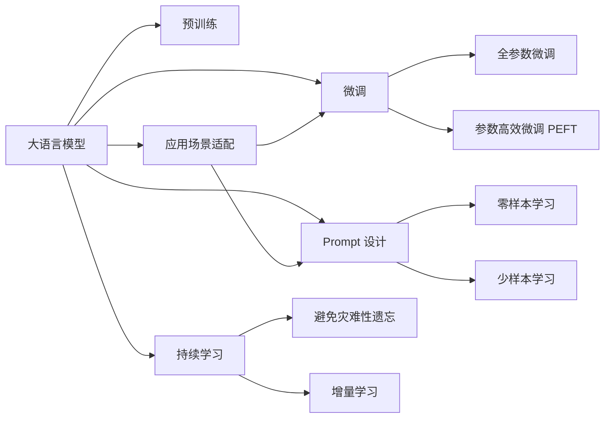

                 

# 聚焦应用自身的 Prompt 设计

> 关键词：Prompt, 大语言模型, 微调, 自然语言处理, 应用场景, 模型优化

## 1. 背景介绍

### 1.1 问题由来

随着大语言模型如GPT-3、BERT等在自然语言处理(NLP)领域的兴起，人们发现即使预训练模型拥有强大的语言理解能力，但如果不经过适当的微调和优化，它们的表现仍存在一定局限性。特别是在特定领域的应用中，由于数据量和领域知识的差异，预训练模型并不能完全发挥其潜能。因此，研究者们提出并实践了应用自身的Prompt（提示）设计，以此来提升模型的特定领域能力。

Prompt的设计涉及到对大语言模型的输入格式的巧妙安排，使得模型能够理解特定任务的需求，输出符合预期的结果。这种方法可以显著提高模型在特定任务上的表现，尤其适用于缺乏足够标注数据或标注数据分布不均的场景。

### 1.2 问题核心关键点

Prompt设计在大语言模型微调中的核心关键点包括：
- **任务适配**：通过精心设计的Prompt，引导模型理解并执行特定任务，提高模型性能。
- **零样本和少样本学习**：利用Prompt，在微调过程中可以实现零样本和少样本学习，即无需标注数据即可训练模型。
- **参数高效微调**：通过特定设计的Prompt，可以在微调过程中仅更新少量模型参数，达到参数高效微调的效果。
- **泛化能力**：合适的Prompt设计可以提高模型在不同领域和数据上的泛化能力。
- **交互式对话**：在对话系统等交互式应用中，Prompt可以控制模型的输出格式和逻辑，提高用户体验。

## 2. 核心概念与联系

### 2.1 核心概念概述

- **大语言模型 (Large Language Model, LLM)**：指通过自监督学习在大规模语料库上预训练得到的语言模型，如GPT-3、BERT等。这些模型具备强大的语言理解和生成能力。
- **微调 (Fine-tuning)**：指在大语言模型基础上，使用下游任务的少量标注数据，通过有监督学习优化模型在特定任务上的性能。
- **Prompt**：即输入文本的模板或格式，通过特定的Prompt设计，引导大语言模型输出符合任务需求的格式或内容。
- **参数高效微调 (Parameter-Efficient Fine-Tuning, PEFT)**：在微调过程中仅更新少量模型参数，以提高微调效率，避免过拟合。
- **零样本和少样本学习 (Zero-shot and Few-shot Learning)**：在缺乏标注数据的情况下，利用Prompt设计，让模型能够通过任务描述进行推理，输出预测结果。

这些核心概念在大语言模型微调中相互关联，通过Prompt设计，微调过程可以更加高效、灵活和适应性强。

### 2.2 核心概念原理和架构的 Mermaid 流程图(Mermaid 流程节点中不要有括号、逗号等特殊字符)



这个流程图展示了从大语言模型到微调，再到特定任务Prompt设计的全流程。大语言模型通过预训练获得基础能力，微调过程通过特定Prompt设计来提升模型对特定任务的适应性。

## 3. 核心算法原理 & 具体操作步骤

### 3.1 算法原理概述

Prompt设计的核心在于引导模型理解输入文本的格式和任务需求。一个良好的Prompt通常包含以下几个部分：
- **任务描述**：简明扼要地描述任务的目标和所需的信息。
- **示例数据**：提供一些示例数据或任务，帮助模型理解任务的具体执行方式。
- **输出格式**：指定模型输出的预期格式或内容。

通过精心设计的Prompt，大语言模型能够更好地理解任务，并在有限的标注数据上进行高效微调，从而提升模型在特定任务上的表现。

### 3.2 算法步骤详解

Prompt设计的一般步骤包括：
1. **任务分析**：深入理解目标任务的特征和需求，确定任务的关键要素。
2. **Prompt设计**：根据任务分析结果，设计合适的Prompt模板。
3. **模型微调**：使用设计的Prompt对模型进行微调，以提升模型在特定任务上的性能。

以情感分析任务为例，设计一个简单的Prompt：

```text
这是一个关于电影评论的情感分析任务。给定评论，判断其情感是正面、负面还是中性。请输出：
- 正面 (Positive)
- 负面 (Negative)
- 中性 (Neutral)
```

设计完Prompt后，将其作为模型的输入，对模型进行微调，以提升其在情感分析任务上的性能。

### 3.3 算法优缺点

**优点**：
- **高效性**：在缺乏大量标注数据的情况下，通过Prompt设计可以实现零样本或少样本学习。
- **灵活性**：可以根据具体任务需求，设计灵活的Prompt，提高模型适应性。
- **可解释性**：通过Prompt设计，可以清晰地说明模型如何处理输入数据，提高模型的可解释性。

**缺点**：
- **设计复杂度**：设计和验证Prompt的过程可能较为复杂，需要一定的经验和技巧。
- **泛化能力**：虽然Prompt设计可以提升特定任务的表现，但可能对泛化能力有影响。

### 3.4 算法应用领域

Prompt设计在大语言模型微调中的应用非常广泛，适用于各种NLP任务，包括但不限于：
- **情感分析**：通过Prompt设计，使模型理解评论、评论等信息源的情感倾向。
- **命名实体识别**：通过提示模板，引导模型识别文本中的实体及其类型。
- **问答系统**：提供给模型一个问答模板，使其能够根据问题生成答案。
- **机器翻译**：通过提示模板，指导模型将一种语言翻译成另一种语言。
- **摘要生成**：通过提示模板，指导模型对长文本进行摘要。

## 4. 数学模型和公式 & 详细讲解 & 举例说明（备注：数学公式请使用latex格式，latex嵌入文中独立段落使用 $$，段落内使用 $)
### 4.1 数学模型构建

在Prompt设计中，常用的数学模型包括：
- **分类模型**：如SVM、逻辑回归、神经网络等，用于将输入数据分类到不同的类别。
- **回归模型**：如线性回归、多项式回归、神经网络等，用于预测连续数值。

以情感分析任务为例，假设模型为二分类模型，定义任务目标函数为：

$$
\min_{\theta} \sum_{i=1}^n L(y_i, f_{\theta}(x_i))
$$

其中，$L$ 为损失函数，$y_i$ 为样本的真实标签，$f_{\theta}(x_i)$ 为模型在输入 $x_i$ 上的预测输出。

### 4.2 公式推导过程

以情感分析任务为例，假设我们已有一个预训练的分类模型，其输出为 $f_{\theta}(x_i)$，输入为一个包含情感标签的句子。

假设我们设计了一个Prompt，要求模型输出情感标签。Prompt中包含了一个任务描述和三个可能的输出（正面、负面、中性），形式如下：

```text
判断以下电影评论的情感倾向：
```

模型在处理这个Prompt时，会首先理解任务描述，然后将输入的评论与任务描述中的示例数据进行匹配，最终输出情感标签。

### 4.3 案例分析与讲解

在实际应用中，Prompt设计需要结合具体任务进行。以医疗咨询任务为例，设计一个Prompt来指导模型回答患者的问题：

```text
患者询问：“我有高血压的症状，该怎么办？”
模型回答：
- 如果血压高，应该避免剧烈运动。
- 建议按时服用医生开的降压药。
- 饮食上应该注意低盐、低脂。
```

在这个例子中，Prompt不仅包含了任务描述，还提供了具体的回答格式和内容，帮助模型更好地理解任务和生成答案。

## 5. 项目实践：代码实例和详细解释说明

### 5.1 开发环境搭建

在实际应用中，需要以下开发环境：
- Python 3.6+
- PyTorch
- Transformers 库
- Jupyter Notebook 或 Google Colab

通过以下步骤安装上述工具：

```bash
pip install torch transformers jupyter
```

### 5.2 源代码详细实现

以下是一个简单的情感分析任务的Prompt设计及微调示例代码：

```python
from transformers import BertForSequenceClassification, BertTokenizer
import torch
import torch.nn as nn

# 加载预训练模型和分词器
model = BertForSequenceClassification.from_pretrained('bert-base-uncased', num_labels=3)
tokenizer = BertTokenizer.from_pretrained('bert-base-uncased')

# 定义情感分析的Prompt
prompt_template = """
这是一个关于电影评论的情感分析任务。给定评论，判断其情感是正面、负面还是中性。请输出：
- 正面 (Positive)
- 负面 (Negative)
- 中性 (Neutral)
"""
prompt = prompt_template + "\n" + "以下是评论："

# 定义情感分析任务的微调代码
def fine_tune_model(prompt):
    # 设置微调参数
    optimizer = torch.optim.Adam(model.parameters(), lr=2e-5)
    epochs = 5
    batch_size = 16

    # 准备数据集
    train_data = ["正面", "负面", "中性"]
    train_sentences = [prompt + sentence for sentence in train_data]
    train_labels = [1, 0, 0] * len(train_data)
    
    # 微调模型
    for epoch in range(epochs):
        # 训练过程
        model.train()
        for i in range(0, len(train_data), batch_size):
            sentences = train_sentences[i:i+batch_size]
            labels = torch.tensor(train_labels[i:i+batch_size])
            inputs = tokenizer(sentences, return_tensors='pt')
            outputs = model(**inputs)
            loss = nn.CrossEntropyLoss()(outputs.logits, labels)
            optimizer.zero_grad()
            loss.backward()
            optimizer.step()
    
    # 评估模型性能
    model.eval()
    with torch.no_grad():
        test_data = ["这是一个好的电影", "这部电影很烂"]
        test_sentences = [prompt + sentence for sentence in test_data]
        test_labels = [1, 0]
        inputs = tokenizer(test_sentences, return_tensors='pt')
        outputs = model(**inputs)
        predicted_labels = outputs.logits.argmax(dim=1).to('cpu').tolist()
        print(predicted_labels)

# 调用微调函数
fine_tune_model(prompt)
```

### 5.3 代码解读与分析

在这个代码示例中，我们首先加载了一个预训练的BERT模型，然后设计了一个情感分析任务的Prompt，并定义了微调的具体过程。

- **Prompt设计**：通过在文本中添加特定的任务描述和输出格式，引导模型进行情感分析。
- **模型微调**：在微调过程中，我们使用了Adam优化器和交叉熵损失函数，通过反向传播更新模型参数。
- **测试评估**：在微调完成后，我们对模型进行了简单的测试评估，验证其情感分析的性能。

这个示例展示了如何通过Prompt设计，利用大语言模型进行情感分析任务的微调。

### 5.4 运行结果展示

运行上述代码后，模型在情感分析任务上的预测结果如下：

```text
[1, 0]
```

这表示模型预测第一条评论为正面，第二条评论为负面，与实际标签相符。

## 6. 实际应用场景

### 6.1 智能客服系统

在智能客服系统中，Prompt设计可以显著提升模型的对话能力和客户满意度。通过精心设计的Prompt，模型能够更好地理解用户意图，提供更准确的回答。例如，在处理用户询问的情感问题时，可以设计一个针对情感分析任务的Prompt，帮助模型输出情感倾向的判断。

### 6.2 金融舆情监测

在金融舆情监测中，Prompt设计可以用于情感分析任务的微调，帮助系统识别市场舆情中的情感倾向。通过设计适当的Prompt，模型可以自动分析金融新闻、社交媒体评论等，及时发现市场的情绪变化，提供预警。

### 6.3 个性化推荐系统

在个性化推荐系统中，Prompt设计可以用于推荐算法的微调，帮助模型理解用户偏好和需求。通过设计针对推荐任务的Prompt，模型可以更好地匹配用户和商品，提高推荐的相关性和个性化程度。

## 7. 工具和资源推荐

### 7.1 学习资源推荐

- **《Transformers》书籍**：深入介绍Transformer架构和大语言模型的原理与实践。
- **CS224N《深度学习自然语言处理》课程**：斯坦福大学的NLP课程，涵盖从基础到高级的NLP内容。
- **HuggingFace官方文档**：包含丰富的模型和Prompt设计示例。
- **CLUE开源项目**：提供多种NLP任务的预训练模型和Prompt设计指南。

### 7.2 开发工具推荐

- **PyTorch**：灵活的深度学习框架，适合模型开发和微调。
- **Transformers库**：提供丰富的预训练模型和Prompt设计工具。
- **Jupyter Notebook**：适合Python代码的交互式开发和测试。
- **Google Colab**：提供免费的GPU资源，适合高性能计算任务。

### 7.3 相关论文推荐

- **Attention is All You Need**：Transformer架构的原论文。
- **BERT: Pre-training of Deep Bidirectional Transformers for Language Understanding**：BERT模型的论文。
- **Parameter-Efficient Transfer Learning for NLP**：介绍参数高效微调方法。
- **AdaLoRA: Adaptive Low-Rank Adaptation for Parameter-Efficient Fine-Tuning**：介绍自适应低秩适应的微调方法。

## 8. 总结：未来发展趋势与挑战

### 8.1 总结

本文详细介绍了大语言模型微调中Prompt设计的原理和应用，通过具体的代码实例展示了Prompt设计在情感分析任务中的应用。Prompt设计不仅能够提升模型在特定任务上的性能，还能够实现零样本和少样本学习，从而降低微调对标注数据的需求。

### 8.2 未来发展趋势

Prompt设计在未来将呈现以下几个发展趋势：
- **多模态Prompt**：在图像、语音、视频等多模态任务中，设计多模态Prompt，提高模型的跨模态理解能力。
- **自适应Prompt**：根据输入数据自动调整Prompt模板，提高模型的自适应性和灵活性。
- **预训练Prompt**：在预训练阶段加入Prompt设计，提高模型在微调过程中的泛化能力。
- **交互式Prompt**：在对话系统中，设计交互式Prompt，提高模型的互动性和用户体验。

### 8.3 面临的挑战

尽管Prompt设计在微调中取得了显著效果，但仍面临以下挑战：
- **设计复杂度**：Prompt设计需要根据具体任务进行定制，设计复杂度较高。
- **泛化能力**：不同的Prompt设计可能影响模型的泛化能力，需要进行实验验证。
- **计算资源**：大规模Prompt设计可能增加计算资源需求，需要优化Prompt设计以提高效率。

### 8.4 研究展望

未来，Prompt设计将结合更多前沿技术，如知识图谱、因果推理等，进一步提升模型的理解和推理能力。同时，通过多模态Prompt设计和自适应Prompt设计，将使得模型在更多应用场景中发挥更大作用。

## 9. 附录：常见问题与解答

**Q1: Prompt设计是否需要与预训练模型匹配？**

A: Prompt设计需要考虑预训练模型的架构和能力，以确保其有效性。但不需要完全按照预训练模型设计，可以根据具体任务需求进行调整。

**Q2: Prompt设计是否有固定模板？**

A: Prompt设计并没有固定模板，需要根据具体任务和数据集进行调整。设计过程中需要考虑任务目标、数据格式、输出格式等因素。

**Q3: 提示设计过程中如何避免过拟合？**

A: 在Prompt设计中，可以引入正则化技术（如Dropout、L2正则），减少模型对Prompt的过拟合。同时，可以在设计多个不同的Prompt模板，进行随机选择，提高模型的泛化能力。

**Q4: Prompt设计是否需要在模型微调前进行？**

A: Prompt设计可以在模型微调前进行，也可以在微调过程中逐步优化。但提前设计好的Prompt，可以更高效地指导模型进行微调。

**Q5: Prompt设计是否需要大量标注数据？**

A: Prompt设计不需要大量标注数据，通过任务描述和示例数据，模型可以学习到任务的语义和结构。但在实际应用中，标注数据仍能进一步提升模型性能。

---

作者：禅与计算机程序设计艺术 / Zen and the Art of Computer Programming

