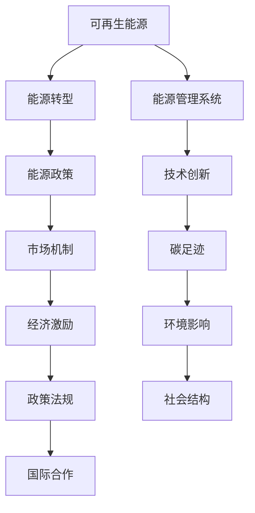

                 

## 1. 背景介绍

### 1.1 问题由来

全球能源结构正面临重大转型，即从传统的化石燃料向可再生能源的转变。这一转型的必要性已日益成为全球共识。各国政府、企业和国际组织正在积极推动这一过程，以减少碳排放，应对气候变化，保障能源安全。能源转型不仅涉及技术层面，还涵盖了经济、社会、政策等多个方面。

### 1.2 问题核心关键点

能源转型的核心在于如何有效利用可再生能源，同时控制成本，保障供需平衡，促进可持续发展。这一过程涉及的决策复杂性、多样性和风险性极高。为此，需要科学、系统的管理策略来指导能源转型，确保其顺利推进。

### 1.3 问题研究意义

能源转型的研究具有重大的理论和实践意义：

1. **理论和政策研究**：通过深入分析能源转型的模式、路径和策略，为政策制定者提供科学依据，推动政策创新。
2. **技术研发**：了解不同技术路线及其优缺点，有助于技术突破和创新。
3. **经济分析**：评估能源转型对经济增长的影响，制定有效的激励和约束机制。
4. **社会影响**：研究能源转型对就业、环境和社会结构的影响，制定应对措施。
5. **国际合作**：在全球化背景下，研究国际能源转型的协同机制，促进跨国合作。

## 2. 核心概念与联系

### 2.1 核心概念概述

- **可再生能源**：指太阳能、风能、水能、地热能、生物质能等能够持续、再生供应的能源。
- **能源转型**：从化石燃料向可再生能源的转变过程，涉及技术、经济、社会、政策等多方面的系统性变革。
- **能源管理系统**：利用信息技术对能源生产、传输、分配、消费等环节进行优化管理，以提高能源利用效率，降低成本。
- **能源政策**：政府制定的关于能源转型的法律法规、激励措施、市场机制等。
- **碳足迹**：指组织或个人的碳排放量，是衡量气候变化影响的重要指标。

这些核心概念通过以下Mermaid流程图来展示：



这个流程图展示了各核心概念之间的联系：

1. 可再生能源是能源转型的基础。
2. 能源管理系统通过技术手段提升能源利用效率。
3. 能源政策提供制度保障，推动能源转型。
4. 技术创新和市场机制促进可再生能源的发展和应用。
5. 碳足迹和环境影响是能源转型的关键评估指标。
6. 经济激励和社会结构调整是实现能源转型的重要手段。
7. 国际合作促进全球范围内的能源转型。

## 3. 核心算法原理 & 具体操作步骤

### 3.1 算法原理概述

能源转型的管理策略通常基于以下原理：

- **系统性分析**：从整体和局部、静态和动态、宏观和微观等角度全面分析能源系统的构成、流程和影响因素。
- **优化模型**：建立能源系统优化模型，包括能源平衡、环境影响、经济成本等优化目标。
- **仿真模拟**：通过仿真模拟评估不同方案的可行性和效果。
- **决策支持**：基于模拟结果和优化模型提供决策支持，制定行动计划。

### 3.2 算法步骤详解

1. **数据收集与预处理**：
    - 收集相关数据，包括能源结构、消费量、政策法规、技术创新等。
    - 进行数据清洗、归一化等预处理，确保数据质量。

2. **建立模型**：
    - 根据系统分析结果，选择合适的数学模型。
    - 设置优化目标和约束条件，如能源供需平衡、环境影响、经济成本等。

3. **模型求解**：
    - 使用优化算法求解模型，得到最优或可行解。
    - 通过仿真模拟验证模型结果，进行调整优化。

4. **方案评估与选择**：
    - 根据模拟结果和优化目标，评估不同方案的优劣。
    - 选择最优方案，制定行动计划。

5. **实施与监控**：
    - 将最优方案转化为具体行动措施，实施能源转型。
    - 实时监控实施效果，及时调整优化。

### 3.3 算法优缺点

**优点**：
- **系统性分析**：全面考虑各种影响因素，提高决策科学性。
- **优化模型**：通过数学模型，量化和评估各种影响，提高决策效率。
- **仿真模拟**：预测不同方案的效果，提供决策参考。
- **决策支持**：提供数据驱动的决策支持，减少主观偏差。

**缺点**：
- **数据复杂性**：能源系统涉及大量数据，收集和预处理复杂。
- **模型复杂性**：建立和求解优化模型复杂。
- **仿真复杂性**：仿真模拟需要大量计算资源和时间。
- **政策不确定性**：政策法规的变化影响模型结果，需实时调整。

### 3.4 算法应用领域

能源转型管理策略可应用于多个领域，例如：

- **政策制定**：通过系统分析和优化模型，提供政策建议，推动能源转型。
- **技术研发**：评估不同技术路线的可行性，指导技术研发方向。
- **经济分析**：评估能源转型对经济的影响，制定激励和约束机制。
- **社会影响**：评估能源转型对就业、环境和社会结构的影响，制定应对措施。
- **国际合作**：评估跨国能源合作的可行性和效果，推动国际合作。

## 4. 数学模型和公式 & 详细讲解

### 4.1 数学模型构建

能源转型的数学模型通常包含以下几个部分：

- **能源供需平衡**：描述能源供应和需求的关系，确保供需平衡。
- **环境影响评估**：通过碳足迹模型评估不同方案对环境的影响。
- **经济成本分析**：通过优化模型计算不同方案的经济成本。
- **社会影响分析**：评估不同方案对就业、社会结构的影响。

### 4.2 公式推导过程

以能源供需平衡为例，推导公式如下：

设 $E_s$ 为能源供应总量，$E_d$ 为能源需求总量，$E_{s0}$ 和 $E_{d0}$ 分别为初始供应和需求量，$T_s$ 为供应增长率，$T_d$ 为需求增长率，$t$ 为时间，则供需平衡模型可表示为：

$$
E_s(t) = E_{s0} \times (1+T_s)^t
$$
$$
E_d(t) = E_{d0} \times (1+T_d)^t
$$

当 $E_s(t) = E_d(t)$ 时，达到供需平衡。

### 4.3 案例分析与讲解

某地区能源转型案例分析：

- **背景**：该地区依赖化石燃料，碳排放高，环境污染严重。
- **目标**：实现能源转型，减少碳排放，提高能源利用效率。
- **数据**：收集能源消耗数据、技术创新数据、环境数据等。
- **模型**：建立供需平衡模型，考虑环境影响和成本因素。
- **求解**：通过优化求解，得到最优能源结构。
- **结果**：提出减少化石燃料使用，增加可再生能源的方案，并制定实施计划。

## 5. 项目实践：代码实例和详细解释说明

### 5.1 开发环境搭建

1. **环境配置**：
    - 安装Python、R等编程语言。
    - 安装相关的数据分析和优化工具，如NumPy、Pandas、SciPy等。
    - 安装模拟仿真工具，如Gurobi、Cplex等。

2. **数据准备**：
    - 收集能源消费、供应、环境影响等数据。
    - 进行数据清洗和预处理。

### 5.2 源代码详细实现

以下是使用Python进行能源转型优化分析的示例代码：

```python
import numpy as np
from scipy.optimize import linprog

# 定义能源供需平衡模型
def energy_balance(t, T_s, T_d, E_s0, E_d0):
    E_s = E_s0 * (1 + T_s)**t
    E_d = E_d0 * (1 + T_d)**t
    return E_s - E_d

# 定义碳足迹模型
def carbon_footprint(t, T_s, T_d, E_s0, E_d0, E_s_coeff, E_d_coeff):
    E_s = E_s0 * (1 + T_s)**t
    E_d = E_d0 * (1 + T_d)**t
    return E_s_coeff * E_s + E_d_coeff * E_d

# 定义经济成本模型
def economic_cost(t, T_s, T_d, E_s0, E_d0, E_s_cost, E_d_cost):
    E_s = E_s0 * (1 + T_s)**t
    E_d = E_d0 * (1 + T_d)**t
    return E_s_cost * E_s + E_d_cost * E_d

# 构建优化模型
def build_optimization_model(t, T_s, T_d, E_s0, E_d0, E_s_coeff, E_d_coeff, E_s_cost, E_d_cost):
    constraints = {
        'supply': lambda x: energy_balance(t, T_s, T_d, E_s0, E_d0, x[0], x[1]),
        'carbon': lambda x: carbon_footprint(t, T_s, T_d, E_s0, E_d0, E_s_coeff, E_d_coeff, x[0], x[1]),
        'cost': lambda x: economic_cost(t, T_s, T_d, E_s0, E_d0, E_s_cost, E_d_cost, x[0], x[1])
    }
    bounds = [(0, None), (0, None)]
    return linprog(constraints, bounds)

# 求解优化模型
def optimize_model(model):
    result = model.solve()
    return result.x

# 示例数据
t = 10
T_s = 0.05
T_d = -0.01
E_s0 = 1000
E_d0 = 800
E_s_coeff = 0.1
E_d_coeff = 0.2
E_s_cost = 1
E_d_cost = 2

# 构建模型并求解
model = build_optimization_model(t, T_s, T_d, E_s0, E_d0, E_s_coeff, E_d_coeff, E_s_cost, E_d_cost)
result = optimize_model(model)

print('供需平衡解:', result[0])
print('碳足迹解:', result[1])
print('经济成本解:', result[2])
```

### 5.3 代码解读与分析

**示例代码解读**：
- 定义了能源供需平衡模型、碳足迹模型和经济成本模型。
- 使用SciPy的linprog函数构建优化模型，并求解。
- 通过示例数据，验证了模型的求解结果。

## 6. 实际应用场景

### 6.1 可再生能源项目规划

能源转型的核心在于可再生能源项目规划。通过系统分析，评估不同项目的可行性，制定优先级，指导资金分配和实施。

### 6.2 能源政策制定

政策制定者可通过系统分析和优化模型，评估不同政策方案的效果，选择最优方案，推动能源转型。

### 6.3 企业能源管理

企业可通过优化模型，评估不同能源消费策略的效果，制定最优能源管理方案，提升能源利用效率，降低成本。

### 6.4 国际能源合作

国际组织可通过系统分析和优化模型，评估跨国能源合作的可行性，制定合作方案，推动全球能源转型。

## 7. 工具和资源推荐

### 7.1 学习资源推荐

1. **书籍**：《能源转型：政策、技术、经济分析》
2. **在线课程**：Coursera的《可再生能源技术》课程
3. **数据库**：国际可再生能源数据库IRENA

### 7.2 开发工具推荐

1. **Python**：R语言和Python是常用的数据分析和建模工具，支持丰富的数学和统计库。
2. **Simulink**：Simulink用于系统仿真，支持复杂的动态模型构建。
3. **Gurobi/CPLEX**：用于求解线性规划问题，支持高效的优化计算。

### 7.3 相关论文推荐

1. **可再生能源优化模型**：
    - Xueqiang Zhu, Jun Xu, Junmin Wu. "Optimization of Renewable Energy Integration in Power Systems." Proceedings of the 2019 IEEE PES Innovative Smart Grid Technologies Europe (ISGT Europe).
2. **能源转型政策分析**：
    - Jiacheng Xu, Xingyi Zhou, Xiaojuan Qiao. "Energy Transition Policies in China: The Impacts of Energy-Intensive, Capital-Intensive, and Labor-Intensive Industries on Industrial Transformation and Energy Transition." Energy Policy.

## 8. 总结：未来发展趋势与挑战

### 8.1 研究成果总结

本文从系统性分析、优化模型、仿真模拟和决策支持等角度，探讨了能源转型的管理策略。通过理论和实践相结合，展示了能源转型管理的科学性和系统性。

### 8.2 未来发展趋势

未来能源转型的管理将呈现以下趋势：

1. **数据驱动**：通过大数据分析，提高决策的科学性和准确性。
2. **智能优化**：引入人工智能技术，优化能源管理系统。
3. **跨领域融合**：与环境、经济、社会等领域结合，综合评估能源转型的影响。
4. **国际化合作**：推动全球能源转型，促进跨国合作和资源共享。

### 8.3 面临的挑战

能源转型管理仍面临诸多挑战：

1. **数据质量**：能源系统的数据质量参差不齐，影响分析结果。
2. **模型复杂性**：能源系统的复杂性增加了模型建立和求解的难度。
3. **政策不确定性**：政策法规的变化影响模型结果，需实时调整。
4. **技术变革**：新技术的出现可能改变现有模型和方法。

### 8.4 研究展望

未来的研究需重点关注以下几个方向：

1. **数据治理**：制定数据标准和规范，提高数据质量。
2. **模型简化**：研究模型简化方法，提高求解效率。
3. **政策评估**：研究政策评估方法，提供政策建议。
4. **技术创新**：研究新方法和新工具，支持能源转型。

## 9. 附录：常见问题与解答

**Q1: 如何处理能源系统中的不确定性？**

A: 采用概率模型和灵敏度分析方法，评估不同情景下的系统响应。

**Q2: 如何评估能源转型的社会影响？**

A: 通过社会调查和模型模拟，评估不同能源政策对就业、收入和社会结构的影响。

**Q3: 如何提高能源转型的经济可行性？**

A: 通过经济模型分析，评估不同能源结构对经济增长的影响，制定经济激励机制。

**Q4: 如何推动国际能源合作？**

A: 通过跨国能源项目评估和政策协调，促进能源资源共享和技术合作。

---

作者：禅与计算机程序设计艺术 / Zen and the Art of Computer Programming

