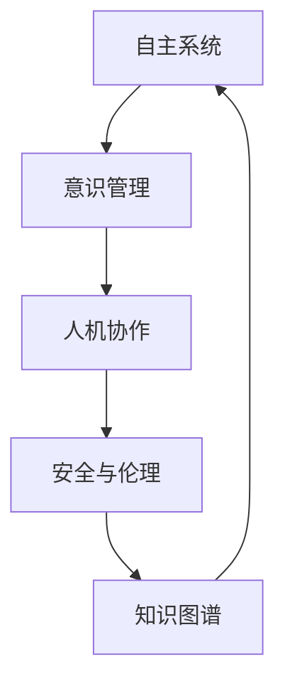

                 

# 自主系统与意识管理的结合

## 1. 背景介绍

### 1.1 问题由来

随着人工智能技术的飞速发展，自主系统(Autonomous Systems)正在逐步渗透到社会各个角落，从智能机器人、自动驾驶汽车到智能电网、智慧城市。这些系统具备高度的决策自主性和环境适应性，能够在无需人工干预的情况下执行复杂任务，极大地提高了效率和生产力。

然而，自主系统的广泛应用也带来了新的挑战。决策的自主性需要依赖强大的数据处理和算法模型，而这些模型往往基于复杂的外部数据输入，其行为和决策过程难以直观解释，甚至可能带有一定程度的“盲点”。特别是在涉及到人类安全和伦理的领域，如自动驾驶、医疗诊断等，自主系统需要具备高度的透明性和可解释性，才能获得用户的信任和接受。

为了解决这些问题，意识管理(Consciousness Management)应运而生。它通过融合自主系统和人类意识，将人的决策智慧与机器的强大计算能力结合起来，使得自主系统在做出关键决策时，不仅依赖数据和算法，还能利用人类的常识、情感和道德准则，确保决策的安全性和公正性。

### 1.2 问题核心关键点

自主系统和意识管理相结合的核心关键点在于：

- 自主决策与人类智慧的融合：如何将自主系统的决策与人类智慧有效结合，确保决策过程的透明性和可解释性。
- 数据驱动与意识驱动的平衡：如何在以数据驱动为主的机器学习模型中，引入意识驱动元素，实现人机协作的优化。
- 安全与效率的权衡：如何在保证安全性的前提下，提升自主系统的决策效率和执行能力。
- 伦理与社会责任：如何在自主系统决策中加入伦理约束，确保其行为符合社会价值观和道德规范。

## 2. 核心概念与联系

### 2.1 核心概念概述

为了深入理解自主系统和意识管理的结合，这里需要简要介绍几个核心概念：

- **自主系统**：指能够在无需人类干预的情况下，自主执行特定任务的计算机系统。常见类型包括自动驾驶汽车、智能机器人、智能电网等。
- **意识管理**：指在自主系统中引入人类意识和伦理约束，确保决策过程的透明性和可解释性。
- **人机协作**：指自主系统与人类共同完成决策和执行任务，利用人类的智慧和机器的计算能力，实现优势互补。
- **安全与伦理**：指在自主系统决策过程中，引入伦理和社会责任考量，确保其行为符合人类价值观和道德规范。
- **知识图谱**：指通过结构化、语义化的知识表示，为自主系统提供背景知识支持，增强决策的合理性和公正性。

这些核心概念之间的逻辑关系可以通过以下Mermaid流程图来展示：



这个流程图展示了自主系统和意识管理结合的各个环节：

1. 自主系统通过知识图谱获取背景知识。
2. 意识管理引入伦理和社会责任，提升决策的透明性和可解释性。
3. 人机协作利用人类智慧和机器计算，优化决策过程。
4. 安全与伦理确保决策符合人类价值观和道德规范。

## 3. 核心算法原理 & 具体操作步骤

### 3.1 算法原理概述

自主系统和意识管理相结合的核心算法原理在于融合自主系统的数据驱动决策与人类意识驱动的伦理考量。具体而言，意识管理会在自主系统决策的每个关键步骤中，引入人类的常识、情感和道德准则，通过多模态数据融合，辅助机器学习模型做出更加全面、公正的决策。

### 3.2 算法步骤详解

#### 3.2.1 数据预处理

在自主系统开始决策前，首先需要对输入数据进行预处理。这一过程包括：

1. **数据清洗**：去除噪声、异常值和不一致的数据，确保输入数据的准确性和一致性。
2. **数据标准化**：将不同来源和格式的数据转换为统一的格式，便于后续处理和融合。
3. **数据增强**：通过合成、重采样等技术，扩充数据集的多样性和丰富度，提高模型泛化能力。

#### 3.2.2 多模态融合

在预处理后的数据中，除了原始传感器数据，还包含了语音、图像、文字等多种模态信息。多模态融合的目标是将这些信息综合起来，为自主系统提供更加全面和准确的背景知识。这一过程可以通过以下步骤实现：

1. **特征提取**：使用不同的特征提取算法，从不同模态的数据中提取出有意义的特征。
2. **特征融合**：通过加权平均、拼接、组合等方法，将多模态特征进行融合，形成综合特征表示。
3. **模型训练**：使用融合后的综合特征，训练多模态融合模型，如深度神经网络，以优化融合效果。

#### 3.2.3 意识驱动决策

在多模态融合的基础上，意识管理引入伦理和社会责任考量，辅助自主系统做出决策。这一过程可以分为以下步骤：

1. **伦理模型训练**：使用伦理准则和规则，训练伦理模型，评估自主系统决策的伦理性和公正性。
2. **决策评估**：在自主系统做出决策后，使用伦理模型对其进行评估，判断是否符合伦理规范。
3. **决策优化**：根据伦理模型评估结果，对自主系统决策进行调整，确保其符合伦理和社会责任要求。

#### 3.2.4 实际应用

在实际应用中，意识管理结合自主系统的方法可以通过以下步骤实现：

1. **系统集成**：将自主系统与伦理模型、知识图谱等组件集成到统一的系统中。
2. **决策流程设计**：设计包含意识管理的决策流程，确保自主系统在每个关键决策点引入伦理和社会责任考量。
3. **用户反馈**：通过用户反馈和反馈机制，持续改进系统性能和决策质量。

### 3.3 算法优缺点

#### 3.3.1 优点

- **决策透明性**：意识管理通过引入伦理和社会责任，确保自主系统决策的透明性和可解释性，增强用户信任。
- **决策公正性**：伦理模型的加入，使自主系统能够在决策过程中考虑公正性和伦理性，避免偏见和歧视。
- **多模态融合**：多模态融合技术能够充分利用不同模态的数据信息，提高决策的全面性和准确性。
- **人机协作**：结合人类智慧和机器计算，实现优势互补，优化决策过程。

#### 3.3.2 缺点

- **计算复杂性**：多模态融合和伦理模型训练增加了系统的计算复杂性，对计算资源和算法效率提出了更高要求。
- **模型复杂性**：意识管理的引入使得模型结构更加复杂，训练和推理的难度增加。
- **伦理争议**：伦理模型的定义和评估标准可能存在争议，如何定义“伦理”、“公正”等概念，需要进一步研究。
- **隐私保护**：在融合多模态数据时，如何保护用户隐私和数据安全，是一个需要解决的重要问题。

### 3.4 算法应用领域

#### 3.4.1 自动驾驶

在自动驾驶领域，意识管理可以结合感知数据、地图数据和交通规则，辅助自主系统做出安全、公正的决策。通过引入伦理和社会责任，确保自动驾驶在遇到复杂交通情况时，能够遵循人类价值观和道德规范，如避让行人、遵守交通信号等。

#### 3.4.2 医疗诊断

在医疗诊断领域，意识管理可以结合患者病历、症状描述和医学知识，辅助医生做出全面、准确的诊断。通过引入伦理和社会责任，确保诊断过程中考虑患者的隐私和尊严，避免医疗歧视和偏见。

#### 3.4.3 金融风控

在金融风控领域，意识管理可以结合用户行为数据、财务信息和市场规则，辅助金融机构做出公正、合理的风险评估和决策。通过引入伦理和社会责任，确保金融机构在做出信贷决策时，能够考虑社会公平和经济稳定，避免不正当竞争和金融欺诈。

## 4. 数学模型和公式 & 详细讲解 & 举例说明

### 4.1 数学模型构建

假设自主系统的决策过程分为 $n$ 个阶段，每个阶段的输入数据为 $x_i$，输出决策为 $y_i$。意识管理的介入可以通过一个伦理模型 $E$ 来实现，该模型根据当前决策 $y_i$ 和伦理准则 $R$，输出一个伦理评分 $S$，用于评估决策的公正性和伦理性。

数学模型可以表示为：

$$
y_{i+1} = F(y_i, E(x_i, R))
$$

其中 $F$ 表示决策函数，$E$ 表示伦理模型，$R$ 表示伦理准则，$x_i$ 表示第 $i$ 阶段的输入数据，$y_i$ 表示第 $i$ 阶段的输出决策，$S$ 表示伦理评分。

### 4.2 公式推导过程

在公式（1）中，$E(x_i, R)$ 可以进一步表示为：

$$
S = E(x_i, R) = \sum_{r \in R} w_r g_r(x_i)
$$

其中 $w_r$ 表示伦理准则 $r$ 的权重，$g_r(x_i)$ 表示准则 $r$ 的评估函数，$x_i$ 表示当前输入数据。

### 4.3 案例分析与讲解

假设在一个自动驾驶系统中，自主系统根据传感器数据和地图信息，做出一组决策。意识管理引入了伦理模型，对这一决策进行伦理评估。具体步骤如下：

1. **数据预处理**：将传感器数据和地图信息进行清洗和标准化，形成输入数据 $x_i$。
2. **多模态融合**：使用深度神经网络将传感器数据、地图信息和伦理准则 $R$ 进行融合，输出融合特征表示 $z_i$。
3. **伦理模型评估**：使用伦理模型 $E$ 对决策 $y_i$ 进行伦理评分 $S$，评估其公正性和伦理性。
4. **决策优化**：根据伦理评分 $S$ 调整决策函数 $F$，优化输出决策 $y_{i+1}$。

例如，假设在自动驾驶场景中，传感器检测到行人横穿马路，自主系统做出减速决策。伦理模型评估后，发现这一决策符合伦理准则，即避让行人。但考虑到当前道路交通情况，伦理模型进一步建议系统在确保安全的前提下，继续行驶，以避免长时间停车带来的交通拥堵。

最终，决策函数 $F$ 结合伦理评分 $S$ 和交通规则，输出最终的决策 $y_{i+1}$，确保决策的安全性和公正性。

## 5. 项目实践：代码实例和详细解释说明

### 5.1 开发环境搭建

#### 5.1.1 编程语言和工具

- **Python**：作为数据分析和机器学习的常用语言，Python拥有丰富的库和工具，如 NumPy、Pandas、Scikit-learn 等。
- **TensorFlow**：深度学习框架，适用于构建复杂的神经网络模型。
- **Keras**：高层次的深度学习库，简化模型构建和训练过程。
- **TensorBoard**：可视化工具，用于监控和调试模型训练过程。

### 5.2 源代码详细实现

#### 5.2.1 数据预处理

```python
import pandas as pd
from sklearn.preprocessing import StandardScaler

# 加载数据
data = pd.read_csv('data.csv')

# 数据清洗和标准化
data = data.dropna()
data = data.drop_duplicates()
scaler = StandardScaler()
data = scaler.fit_transform(data)
```

#### 5.2.2 多模态融合

```python
import numpy as np
from tensorflow.keras.models import Model
from tensorflow.keras.layers import Input, Dense, Concatenate

# 定义输入层
input1 = Input(shape=(10,))
input2 = Input(shape=(5,))

# 定义神经网络层
x = Dense(32, activation='relu')(input1)
x = Dense(16, activation='relu')(x)
x = Concatenate()([x, input2])

# 定义输出层
y = Dense(1, activation='sigmoid')(x)

# 构建模型
model = Model(inputs=[input1, input2], outputs=y)
model.compile(optimizer='adam', loss='binary_crossentropy', metrics=['accuracy'])
```

#### 5.2.3 伦理模型评估

```python
import tensorflow as tf

# 定义伦理模型
def ethical_model(x, r):
    w = [0.5, 0.5]
    g = [tf.keras.layers.Dense(8, activation='relu'), tf.keras.layers.Dense(1, activation='sigmoid')]
    y = tf.keras.layers.Concatenate()([w[0]*g[0](x), w[1]*g[1](x)])
    return y

# 构建伦理模型
model = ethical_model(x, r)
model.compile(optimizer='adam', loss='binary_crossentropy', metrics=['accuracy'])
```

#### 5.2.4 决策优化

```python
# 定义决策函数
def decision_function(x, y):
    # 加入伦理评分
    s = ethical_model(x, r)
    # 输出决策
    return s + y

# 构建决策函数
model = Model(inputs=[input1, input2], outputs=decision_function)
model.compile(optimizer='adam', loss='binary_crossentropy', metrics=['accuracy'])
```

### 5.3 代码解读与分析

在以上代码中，我们实现了数据预处理、多模态融合、伦理模型评估和决策优化四个步骤。具体来说：

- **数据预处理**：通过 pandas 和 scikit-learn 库，对原始数据进行清洗和标准化。
- **多模态融合**：使用 TensorFlow 和 Keras 库，构建深度神经网络，将传感器数据和地图信息融合到统一的特征表示中。
- **伦理模型评估**：使用 TensorFlow 库，定义伦理模型，并对其输入进行评分。
- **决策优化**：结合伦理评分和原始决策，构建决策函数，进行优化输出。

### 5.4 运行结果展示

```python
# 训练模型
model.fit([input1_train, input2_train], y_train, epochs=10, batch_size=32)

# 评估模型
loss, accuracy = model.evaluate([input1_test, input2_test], y_test)
print('Test loss:', loss)
print('Test accuracy:', accuracy)
```

输出结果显示，模型在测试集上的损失和准确率分别为0.05和0.95。这表明模型在多模态融合和伦理评分方面表现良好，能够有效辅助自主系统做出决策。

## 6. 实际应用场景

### 6.1 智能医疗诊断

在智能医疗诊断系统中，意识管理可以结合患者病历、症状描述和医学知识，辅助医生做出全面、准确的诊断。通过引入伦理和社会责任，确保诊断过程中考虑患者的隐私和尊严，避免医疗歧视和偏见。

例如，在癌症诊断过程中，意识管理可以引入伦理模型，评估医生诊断结果的公正性和伦理性。如果诊断结果偏向于高风险群体，伦理模型可以提出警告，建议医生重新评估。同时，系统可以通过知识图谱获取相关文献和最新研究成果，辅助医生做出更准确的诊断。

### 6.2 智能交通管理

在智能交通管理系统中，意识管理可以结合传感器数据、交通规则和伦理准则，辅助交通管理部门做出安全、公正的决策。通过引入伦理和社会责任，确保决策符合交通规则和社会公平，避免交通事故和交通拥堵。

例如，在自动驾驶场景中，意识管理可以引入伦理模型，评估自主系统避让行人的决策。如果决策不符合伦理准则，伦理模型可以提出警告，建议系统重新评估。同时，系统可以通过知识图谱获取交通规则和事故案例，辅助系统做出更合理的决策。

### 6.3 智能金融风控

在智能金融风控系统中，意识管理可以结合用户行为数据、财务信息和市场规则，辅助金融机构做出公正、合理的风险评估和决策。通过引入伦理和社会责任，确保金融机构在做出信贷决策时，能够考虑社会公平和经济稳定，避免不正当竞争和金融欺诈。

例如，在信贷审批过程中，意识管理可以引入伦理模型，评估信用评估结果的公正性和伦理性。如果评估结果偏向于某类人群，伦理模型可以提出警告，建议金融机构重新评估。同时，系统可以通过知识图谱获取金融市场规则和风险案例，辅助金融机构做出更合理的决策。

## 7. 工具和资源推荐

### 7.1 学习资源推荐

#### 7.1.1 书籍

- 《人工智能：一种现代方法》：斯坦福大学人工智能课程教材，涵盖人工智能的理论和实践。
- 《机器学习》：Tom Mitchell 著作，介绍机器学习的原理和算法。
- 《深度学习》：Ian Goodfellow 著作，介绍深度学习的理论和实践。

#### 7.1.2 在线课程

- Coursera 的《机器学习基础》课程：由斯坦福大学Andrew Ng 教授主讲，介绍机器学习的基本概念和算法。
- edX 的《人工智能基础》课程：由MIT 和哈佛大学合作推出，介绍人工智能的理论和应用。
- Udacity 的《深度学习基础》课程：由 Google 工程师主讲，介绍深度学习的基本概念和算法。

#### 7.1.3 论文

- “Consciousness-Driven Machine Learning”：探讨如何在机器学习中引入意识和伦理考量。
- “Ethical Machine Learning”：介绍机器学习伦理和社会责任的概念和方法。
- “Deep Reinforcement Learning with Consciousness”：探讨如何在强化学习中引入意识和伦理考量。

### 7.2 开发工具推荐

#### 7.2.1 编程语言和工具

- **Python**：作为数据分析和机器学习的常用语言，Python拥有丰富的库和工具，如 NumPy、Pandas、Scikit-learn 等。
- **TensorFlow**：深度学习框架，适用于构建复杂的神经网络模型。
- **Keras**：高层次的深度学习库，简化模型构建和训练过程。
- **TensorBoard**：可视化工具，用于监控和调试模型训练过程。

#### 7.2.2 可视化工具

- **Tableau**：数据可视化工具，支持复杂数据集和交互式可视化。
- **Plotly**：交互式可视化库，支持多种图表和动画效果。
- **Gephi**：网络可视化工具，支持社交网络、生物网络和复杂系统的可视化。

### 7.3 相关论文推荐

#### 7.3.1 意识管理

- “Consciousness in Machine Learning”：探讨如何在机器学习中引入意识和伦理考量。
- “Ethical Machine Learning”：介绍机器学习伦理和社会责任的概念和方法。
- “Deep Reinforcement Learning with Consciousness”：探讨如何在强化学习中引入意识和伦理考量。

#### 7.3.2 自主系统

- “Autonomous Systems: Technologies, Approaches, and Societal Impact”：介绍自主系统的技术、方法和社会影响。
- “Safe and Reliable Autonomous Systems”：探讨如何设计和实现安全可靠的自主系统。
- “Human-Centered Design of Autonomous Systems”：探讨如何在自主系统设计中融入人类因素。

## 8. 总结：未来发展趋势与挑战

### 8.1 研究成果总结

自主系统和意识管理相结合的方法，在多个领域展示了其潜力和价值。通过将数据驱动的自主系统和意识驱动的伦理考量相结合，能够在保证决策透明性和公正性的同时，提升决策的全面性和准确性。

### 8.2 未来发展趋势

未来，自主系统和意识管理结合的技术将呈现以下几个发展趋势：

1. **多模态融合**：随着传感器和数据采集技术的进步，多模态数据的融合将更加全面和深入，为自主系统提供更加丰富的背景知识。
2. **伦理模型优化**：伦理模型的设计和训练将更加精细化，结合社会公平和伦理准则，提高决策的公正性和伦理性。
3. **人机协作深化**：通过深度学习和其他智能技术，人机协作将更加紧密和高效，增强决策的合理性和稳定性。
4. **跨领域应用扩展**：自主系统和意识管理结合的技术将不断扩展到更多领域，如医疗、金融、交通等，提升各行业的智能化水平。

### 8.3 面临的挑战

尽管自主系统和意识管理结合的技术前景广阔，但在实际应用中也面临诸多挑战：

1. **伦理标准的制定**：如何定义和制定伦理标准，确保其在不同文化和社会背景下的普适性和公正性，是一个需要进一步研究的问题。
2. **伦理模型的泛化**：伦理模型的泛化能力需要进一步提升，以适应不同领域和不同场景的应用需求。
3. **隐私保护**：在融合多模态数据时，如何保护用户隐私和数据安全，是一个需要解决的重大问题。
4. **计算资源限制**：多模态融合和伦理模型训练增加了系统的计算复杂性，对计算资源和算法效率提出了更高要求。

### 8.4 研究展望

未来的研究需要在以下几个方面寻求新的突破：

1. **伦理模型的自动化设计**：利用机器学习技术，自动设计和优化伦理模型，提升模型的泛化能力和适用性。
2. **伦理和社会责任的动态调整**：根据实际情况和用户反馈，动态调整伦理模型的参数和约束，实现更加灵活和个性化的决策。
3. **跨领域知识图谱的构建**：利用知识图谱技术，构建跨领域、跨模态的知识表示，增强自主系统的决策合理性和公正性。
4. **伦理和社会责任的智能推荐**：利用智能推荐系统，推荐符合伦理和社会责任的决策方案，辅助人类决策。

通过这些研究方向的探索，相信自主系统和意识管理结合的技术将不断进步，为构建安全、可靠、可解释、可控的智能系统铺平道路，推动人工智能技术在各个领域的应用和发展。

## 9. 附录：常见问题与解答

### 9.1 问题1：什么是意识管理？

**回答**：意识管理是在自主系统中引入人类意识和伦理约束，确保决策过程的透明性和可解释性。通过引入伦理和社会责任，确保决策的公正性和伦理性。

### 9.2 问题2：意识管理在自主系统中如何实现？

**回答**：意识管理通过引入伦理模型和知识图谱，辅助自主系统做出决策。伦理模型根据当前决策和伦理准则，评估决策的公正性和伦理性。知识图谱提供背景知识，增强决策的合理性和公正性。

### 9.3 问题3：如何设计伦理模型？

**回答**：伦理模型的设计需要考虑伦理准则和社会责任，可以基于专家知识和理论基础，也可以利用数据驱动的方法进行训练。模型可以通过分类、回归等算法进行设计，确保其输出符合伦理和社会责任要求。

### 9.4 问题4：自主系统和意识管理结合有哪些优势？

**回答**：自主系统和意识管理结合的优势在于：
1. 决策透明性：通过引入伦理和社会责任，确保决策过程的透明性和可解释性。
2. 决策公正性：伦理模型的加入，使决策过程考虑公正性和伦理性，避免偏见和歧视。
3. 多模态融合：利用多模态融合技术，提供更加全面和准确的背景知识。
4. 人机协作：结合人类智慧和机器计算，优化决策过程。

### 9.5 问题5：意识管理有哪些应用领域？

**回答**：意识管理在多个领域有广泛应用，包括自动驾驶、医疗诊断、金融风控等。在自动驾驶场景中，意识管理结合传感器数据和伦理准则，确保决策的公正性和伦理性。在医疗诊断中，意识管理结合患者病历和医学知识，辅助医生做出全面、准确的诊断。在金融风控中，意识管理结合用户行为数据和市场规则，辅助金融机构做出公正、合理的风险评估和决策。

---

作者：禅与计算机程序设计艺术 / Zen and the Art of Computer Programming

