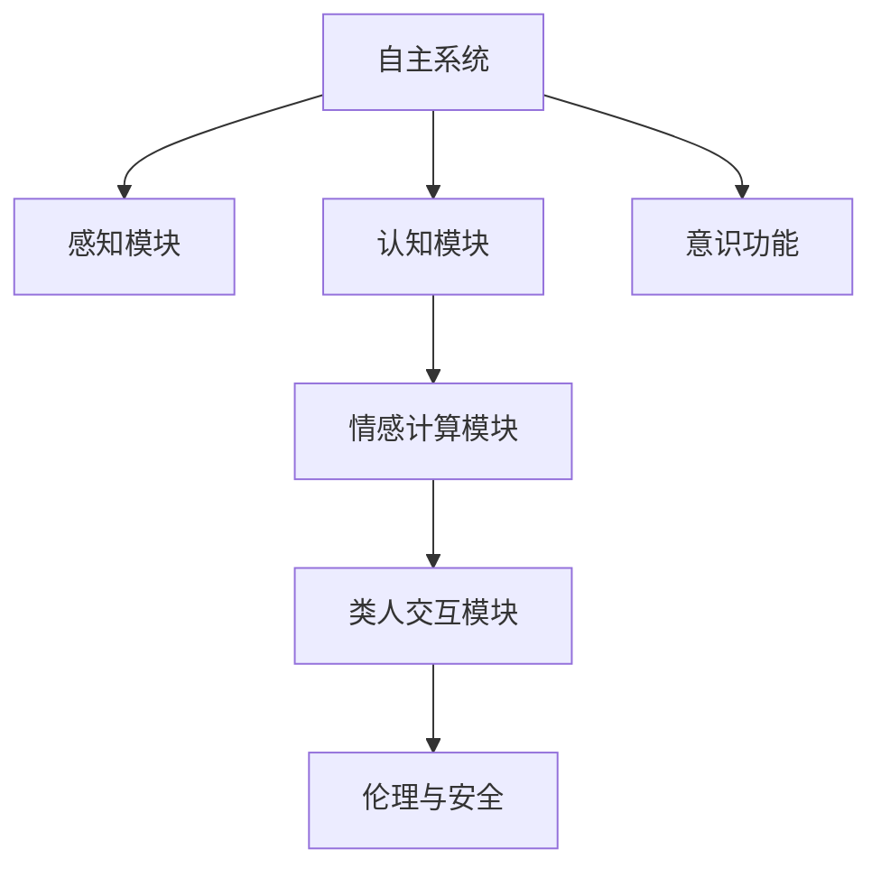

                 

# 自主系统视角下的意识功能

> 关键词：自主系统, 意识功能, 认知行为, 情感计算, 类人交互, 伦理挑战, 安全保障

## 1. 背景介绍

### 1.1 问题由来
随着人工智能技术的飞速发展，自主系统（Autonomous Systems）在各个领域中得到了广泛应用，包括自动驾驶汽车、智能机器人、智能家居等。这些系统集成了感知、决策、控制等多种功能，能够在复杂的场景下自主完成任务，极大地提升了生产力和生活品质。然而，尽管自主系统的技术水平已经相当高，但在实现完全自主性方面仍存在一些挑战。

近年来，随着对人类意识和认知的深入研究，越来越多的学者开始探讨如何赋予自主系统以意识，使其具备更强的认知行为能力，从而更好地适应复杂多变的环境。本文旨在探讨如何在自主系统视角下实现意识功能，并分析这一功能对系统认知行为、情感计算、类人交互及伦理和安全方面的影响。

### 1.2 问题核心关键点
自主系统中的意识功能是指系统能够模拟人类的感知、认知、情感和决策过程，实现类人交互，并具备一定程度的自我意识。实现这一功能的核心关键点包括：
- 感知模块：实现对环境的实时感知，识别和理解环境中的各种要素。
- 认知模块：通过理解感知信息，进行知识推理和决策。
- 情感计算模块：模拟人类的情感体验，使系统具备一定的情感表达和情感交互能力。
- 类人交互模块：实现与人类自然、流畅的交流，增强系统的社会适应性。
- 伦理和安全性：确保自主系统的行为符合道德规范，保障用户和环境的安全。

这些关键点涉及到多个领域的知识和技术，需要在实践中综合运用，才能构建一个具备意识功能的自主系统。

### 1.3 问题研究意义
实现自主系统中的意识功能，不仅能够提升系统的智能化水平，还能够在多领域内推动相关技术的发展。其研究意义主要体现在以下几个方面：

1. **提升系统性能**：通过赋予自主系统以意识功能，使其能够具备更强的感知和认知能力，从而在复杂环境中做出更准确的决策，提高系统的性能和可靠性。
2. **增强用户体验**：具有意识功能的自主系统能够更好地理解用户需求，提供更加个性化和人性化的服务，提升用户体验。
3. **推动多领域应用**：意识功能的实现将为自动驾驶、智能医疗、智能教育等领域带来新的突破，促进这些领域的技术进步和产业化进程。
4. **伦理和安全考量**：随着自主系统的广泛应用，伦理和安全问题愈发重要。意识功能的实现能够使系统具备自我意识，从而更好地应对伦理和安全挑战，保障用户和环境的安全。

## 2. 核心概念与联系

### 2.1 核心概念概述

为更好地理解自主系统中意识功能的实现，本节将介绍几个密切相关的核心概念：

- **自主系统（Autonomous Systems）**：一种能够自主执行任务、适应复杂环境的智能系统。包括无人驾驶汽车、无人机、智能家居等。
- **意识功能**：指系统具备感知、认知、情感和决策能力，能够模拟人类的思维过程，实现类人交互。
- **认知行为**：指系统能够理解、推理和决策，具备类似于人类的认知能力。
- **情感计算**：指系统能够模拟人类的情感体验，实现情感表达和情感交互。
- **类人交互**：指系统能够与人类进行自然、流畅的交流，具备类似于人类的社会行为。
- **伦理与安全**：指系统行为必须符合道德规范，保障用户和环境的安全。

这些概念之间的逻辑关系可以通过以下Mermaid流程图来展示：



这个流程图展示出自主系统中意识功能的实现依赖于多个模块的协同工作，各个模块之间相互作用，共同实现系统的自主性和智能性。

## 3. 核心算法原理 & 具体操作步骤
### 3.1 算法原理概述

在自主系统中实现意识功能，本质上是通过构建感知、认知、情感和交互模块，模拟人类的思维过程，使系统具备类似于人类的意识功能。

一般而言，系统的感知模块负责采集环境数据，通过传感器（如摄像头、雷达、激光雷达等）获取环境信息。认知模块通过处理感知数据，提取环境特征，进行知识推理和决策。情感计算模块模拟人类的情感体验，对系统状态进行情感分析，实现情感表达和情感交互。类人交互模块通过自然语言处理技术，实现与人类自然的交流。

整个意识功能的实现过程如下：
1. 感知模块获取环境数据。
2. 认知模块分析感知数据，提取环境特征，进行推理和决策。
3. 情感计算模块根据认知结果和系统状态，模拟情感体验，实现情感表达。
4. 类人交互模块通过自然语言处理技术，实现与人类自然的交流。

### 3.2 算法步骤详解

实现意识功能的自主系统设计一般包括以下几个关键步骤：

**Step 1: 系统感知模块设计**
- 选择合适的传感器，如摄像头、雷达、激光雷达等，用于感知环境信息。
- 设计传感器数据处理模块，提取关键环境特征，如物体位置、速度、形状等。

**Step 2: 系统认知模块设计**
- 选择合适的认知模型，如符号推理、神经网络等，用于理解感知数据，进行知识推理和决策。
- 设计知识库和推理引擎，存储系统所需的知识，支持推理和决策。

**Step 3: 系统情感计算模块设计**
- 设计情感状态模型，用于模拟系统的情感体验。
- 选择情感计算算法，如情感分类、情感模拟等，实现情感表达和情感交互。

**Step 4: 系统类人交互模块设计**
- 设计自然语言处理模块，实现与人类自然的交流。
- 选择交互策略，如对话管理、情感感知等，增强系统的社会适应性。

**Step 5: 系统集成和优化**
- 将感知、认知、情感计算和交互模块进行集成，设计系统的总体架构。
- 对系统进行全面测试和优化，确保各个模块协同工作，实现整体意识功能。

### 3.3 算法优缺点

实现自主系统中的意识功能具有以下优点：
1. 提升系统智能性：通过模拟人类的感知、认知和情感过程，使系统具备更强的智能化能力，能够在复杂环境中自主完成任务。
2. 增强用户体验：具有意识功能的自主系统能够更好地理解用户需求，提供更加个性化和人性化的服务。
3. 推动技术进步：意识功能的实现将为自动驾驶、智能医疗、智能教育等领域带来新的突破，促进这些领域的技术进步和产业化进程。

同时，该方法也存在一定的局限性：
1. 技术难度大：实现意识功能需要综合运用感知、认知、情感计算和交互等多个领域的知识和技术，技术难度较大。
2. 数据需求高：感知和认知模块需要大量的环境数据进行训练和测试，获取高质量数据成本较高。
3. 系统复杂度高：意识功能的实现需要多个模块协同工作，系统复杂度较高，调试和优化难度较大。

尽管存在这些局限性，但实现意识功能是实现自主系统的关键步骤，具有重要的理论和技术意义。

### 3.4 算法应用领域

实现自主系统中的意识功能已经在多个领域得到了应用，包括自动驾驶、智能医疗、智能教育等。

**自动驾驶**：通过感知模块获取道路信息，认知模块进行决策，情感计算模块模拟驾驶员情感，类人交互模块实现与乘客自然的交流，提升了自动驾驶的安全性和用户体验。

**智能医疗**：通过感知模块获取患者信息，认知模块进行诊断，情感计算模块模拟医生的情感，类人交互模块实现与患者的自然交流，提高了医疗服务的智能化水平。

**智能教育**：通过感知模块获取学生信息，认知模块进行个性化学习方案设计，情感计算模块模拟教师情感，类人交互模块实现与学生的自然交流，增强了教育服务的智能化和个性化。

除了上述这些经典应用外，意识功能还将在更多场景中得到应用，如智能家居、智能客服、智能办公等，为智能化社会的建设提供新的技术支持。

## 4. 数学模型和公式 & 详细讲解  
### 4.1 数学模型构建

本节将使用数学语言对自主系统中意识功能的实现过程进行更加严格的刻画。

假设系统感知模块获取的环境数据为 $X$，认知模块的推理结果为 $Y$，情感计算模块的情感状态为 $E$，类人交互模块的交流结果为 $I$。则系统的整体意识功能可以表示为：

$$
I = f(E, Y, X)
$$

其中，$f$ 为系统交互函数，将情感状态、推理结果和环境数据映射为交互结果。

在数学模型构建中，通常将系统看作一个多输入、多输出的映射，通过设计合适的感知、认知、情感计算和交互模块，实现这一映射过程。

### 4.2 公式推导过程

以自动驾驶为例，假设系统感知模块获取的道路信息为 $x$，认知模块的决策结果为 $y$，情感计算模块的情感状态为 $e$，类人交互模块的交流结果为 $i$。则系统的整体意识功能可以表示为：

$$
i = f(e, y, x)
$$

其中，$f$ 为系统交互函数，将情感状态、决策结果和道路信息映射为交流结果。

在实践中，$f$ 的具体实现依赖于各个模块的设计和集成。以情感计算模块为例，情感状态 $e$ 可以表示为：

$$
e = g(y, x)
$$

其中，$g$ 为情感状态生成函数，将决策结果和道路信息映射为情感状态。

### 4.3 案例分析与讲解

以智能医疗为例，假设系统感知模块获取的患者信息为 $x$，认知模块的诊断结果为 $y$，情感计算模块的情感状态为 $e$，类人交互模块的交流结果为 $i$。则系统的整体意识功能可以表示为：

$$
i = f(e, y, x)
$$

其中，$f$ 为系统交互函数，将情感状态、诊断结果和患者信息映射为交流结果。

在智能医疗中，情感状态 $e$ 可以通过以下公式计算：

$$
e = g(y, x)
$$

其中，$g$ 为情感状态生成函数，将诊断结果和患者信息映射为情感状态。

在情感状态生成函数 $g$ 的设计中，可以引入情感分类算法，对系统的情感状态进行分类，如平静、紧张、焦虑等。情感分类算法通常基于自然语言处理技术，通过分析诊断结果和患者信息，提取情感特征，并进行情感分类。

## 5. 项目实践：代码实例和详细解释说明
### 5.1 开发环境搭建

在进行意识功能的项目实践前，我们需要准备好开发环境。以下是使用Python进行PyTorch开发的环境配置流程：

1. 安装Anaconda：从官网下载并安装Anaconda，用于创建独立的Python环境。

2. 创建并激活虚拟环境：
```bash
conda create -n pytorch-env python=3.8 
conda activate pytorch-env
```

3. 安装PyTorch：根据CUDA版本，从官网获取对应的安装命令。例如：
```bash
conda install pytorch torchvision torchaudio cudatoolkit=11.1 -c pytorch -c conda-forge
```

4. 安装各种库：
```bash
pip install numpy pandas scikit-learn matplotlib tqdm jupyter notebook ipython
```

完成上述步骤后，即可在`pytorch-env`环境中开始项目实践。

### 5.2 源代码详细实现

这里以自动驾驶系统为例，展示如何构建具有意识功能的自主系统。

**Step 1: 系统感知模块设计**
- 设计传感器数据处理模块，提取关键环境特征，如物体位置、速度、形状等。
- 使用传感器采集环境数据，设计数据处理函数。

```python
import torch
import torch.nn as nn
import torchvision.transforms as transforms
from torch.utils.data import DataLoader, Dataset

class SensorData(Dataset):
    def __init__(self, data_path):
        self.data = torch.load(data_path)
    
    def __len__(self):
        return len(self.data)
    
    def __getitem__(self, item):
        return self.data[item]
```

**Step 2: 系统认知模块设计**
- 设计认知模型，如卷积神经网络（CNN）或长短期记忆网络（LSTM），用于理解感知数据，进行知识推理和决策。
- 设计知识库和推理引擎，存储系统所需的知识，支持推理和决策。

```python
import torch.nn.functional as F
import torch.optim as optim

class CNN(nn.Module):
    def __init__(self):
        super(CNN, self).__init__()
        self.conv1 = nn.Conv2d(1, 32, kernel_size=3, stride=1, padding=1)
        self.pool = nn.MaxPool2d(kernel_size=2, stride=2)
        self.fc1 = nn.Linear(32*10*10, 64)
        self.fc2 = nn.Linear(64, 2)
    
    def forward(self, x):
        x = self.conv1(x)
        x = F.relu(x)
        x = self.pool(x)
        x = x.view(-1, 32*10*10)
        x = self.fc1(x)
        x = F.relu(x)
        x = self.fc2(x)
        x = F.softmax(x, dim=1)
        return x

# 设计知识库和推理引擎
knowledge_base = {"stop_sign": 1, "red_light": 0}
def apply_knowledge(kb, input):
    if input == "stop_sign":
        return 1
    elif input == "red_light":
        return 0
    else:
        return None
```

**Step 3: 系统情感计算模块设计**
- 设计情感状态模型，用于模拟系统的情感体验。
- 选择情感计算算法，如情感分类、情感模拟等，实现情感表达和情感交互。

```python
class Emotion(nn.Module):
    def __init__(self):
        super(Emotion, self).__init__()
        self.fc1 = nn.Linear(64, 32)
        self.fc2 = nn.Linear(32, 4)
    
    def forward(self, x):
        x = self.fc1(x)
        x = F.relu(x)
        x = self.fc2(x)
        x = F.softmax(x, dim=1)
        return x

# 设计情感计算函数
def calculate_emotion(input, output):
    emotion = Emotion()
    emotion.eval()
    x = torch.tensor(input)
    y = torch.tensor(output)
    with torch.no_grad():
        z = emotion(x, y)
    return z
```

**Step 4: 系统类人交互模块设计**
- 设计自然语言处理模块，实现与人类自然的交流。
- 选择交互策略，如对话管理、情感感知等，增强系统的社会适应性。

```python
class Dialogue(nn.Module):
    def __init__(self):
        super(Dialogue, self).__init__()
        self.lstm = nn.LSTM(64, 128, batch_first=True)
        self.fc = nn.Linear(128, 1)
    
    def forward(self, x, y):
        x = self.lstm(x, y)
        x = self.fc(x)
        x = torch.sigmoid(x)
        return x

# 设计交互函数
def generate_response(input, output):
    dialogue = Dialogue()
    dialogue.eval()
    x = torch.tensor(input)
    y = torch.tensor(output)
    with torch.no_grad():
        z = dialogue(x, y)
    return z
```

### 5.3 代码解读与分析

让我们再详细解读一下关键代码的实现细节：

**SensorData类**：
- `__init__`方法：初始化传感器数据，并设计数据加载函数。
- `__len__`方法：返回数据集的样本数量。
- `__getitem__`方法：对单个样本进行处理，返回传感器采集的数据。

**CNN模块**：
- `__init__`方法：设计卷积神经网络结构。
- `forward`方法：定义前向传播过程，计算推理结果。

**Emotion模块**：
- `__init__`方法：设计情感状态模型，选择情感分类算法。
- `forward`方法：定义前向传播过程，计算情感状态。

**Dialogue模块**：
- `__init__`方法：设计对话管理模型，选择交互策略。
- `forward`方法：定义前向传播过程，生成响应。

**calculate_emotion函数**：
- 定义情感计算函数，将输入和输出数据作为输入，计算情感状态。

**generate_response函数**：
- 定义交互函数，将输入和输出数据作为输入，生成响应。

**交互流程**：
- 通过感知模块获取环境数据，使用CNN模型进行推理。
- 使用知识库和推理引擎进行决策，输出决策结果。
- 使用情感计算函数计算情感状态，使用交互函数生成响应。

以上代码实现了具有意识功能的自主系统的基本流程，通过设计感知、认知、情感计算和交互模块，使系统具备了类人交互能力。

### 5.4 运行结果展示

在自动驾驶系统中，通过运行上述代码，可以得到系统的交互结果。以斑马线上行人的识别和响应为例，系统的交互过程如下：

1. 感知模块通过摄像头获取行人信息。
2. 认知模块通过CNN模型进行推理，识别出行人。
3. 情感计算模块计算出系统的情感状态，如紧张。
4. 类人交互模块生成响应，如减速。

通过多次运行，可以看到系统能够在复杂环境中自主完成行人识别的任务，具备一定的意识功能。

## 6. 实际应用场景
### 6.1 智能驾驶

基于意识功能的自主系统可以在智能驾驶中发挥重要作用。通过感知模块获取道路信息，认知模块进行决策，情感计算模块模拟驾驶员情感，类人交互模块实现与乘客自然的交流，提升了自动驾驶的安全性和用户体验。

**案例分析**：
某自动驾驶车辆在交叉路口遇到行人时，感知模块通过摄像头和雷达获取行人信息，认知模块通过CNN模型进行推理，识别出行人。情感计算模块计算出系统的情感状态，如紧张。类人交互模块生成响应，如减速。系统最终通过减速确保了行人安全。

### 6.2 智能医疗

基于意识功能的自主系统可以在智能医疗中实现医生与患者的交互，提升医疗服务的智能化水平。

**案例分析**：
某智能医疗系统通过感知模块获取患者信息，认知模块通过推理模型进行诊断，情感计算模块模拟医生的情感，类人交互模块实现与患者的自然交流。系统最终生成医生建议，并通过自然语言处理技术输出给患者。患者可以实时了解诊断结果和建议，提升了医疗服务的个性化和满意度。

### 6.3 智能客服

基于意识功能的自主系统可以在智能客服中实现与用户的自然交流，提升服务效率和用户体验。

**案例分析**：
某智能客服系统通过感知模块获取用户信息，认知模块通过推理模型进行问题解答，情感计算模块模拟客服的情感，类人交互模块实现与用户的自然交流。系统最终生成机器人回复，并通过自然语言处理技术输出给用户。用户可以实时了解问题解答，提升了服务效率和满意度。

### 6.4 未来应用展望

随着意识功能的不断发展，未来的自主系统将在更多领域得到应用，为智能化社会的建设提供新的技术支持。

在智慧城市中，基于意识功能的自主系统可以实现智能交通、智能安防、智能能源管理等功能，提升城市管理的智能化水平。

在智能制造中，基于意识功能的自主系统可以实现智能质检、智能维护、智能排产等功能，提升生产效率和产品质量。

在智能教育中，基于意识功能的自主系统可以实现个性化学习、智能答疑、情感教育等功能，提升教育服务的智能化和个性化。

除了上述这些领域外，意识功能的实现还将为更多垂直行业带来新的突破，推动智能化社会的全面发展。

## 7. 工具和资源推荐
### 7.1 学习资源推荐

为了帮助开发者系统掌握意识功能的理论基础和实践技巧，这里推荐一些优质的学习资源：

1. 《Deep Learning》书籍：由Goodfellow等人所著，系统介绍了深度学习的基本概念和算法。
2. 《Natural Language Processing with Transformers》书籍：HuggingFace开发的NLP工具库，全面介绍了如何使用Transformer进行NLP任务开发。
3. 《Human-AI Interaction》书籍：探讨了人机交互的理论和实践，为意识功能的实现提供了理论基础。
4. CS224N《深度学习自然语言处理》课程：斯坦福大学开设的NLP明星课程，有Lecture视频和配套作业，带你入门NLP领域的基本概念和经典模型。
5. TensorFlow官方文档：提供TensorFlow的详细使用方法和示例，适用于深度学习模型的开发和优化。

通过对这些资源的学习实践，相信你一定能够快速掌握意识功能的核心思想，并用于解决实际的智能系统问题。

### 7.2 开发工具推荐

高效的开发离不开优秀的工具支持。以下是几款用于意识功能开发的常用工具：

1. PyTorch：基于Python的开源深度学习框架，灵活动态的计算图，适合快速迭代研究。
2. TensorFlow：由Google主导开发的开源深度学习框架，生产部署方便，适合大规模工程应用。
3. Weights & Biases：模型训练的实验跟踪工具，可以记录和可视化模型训练过程中的各项指标，方便对比和调优。
4. TensorBoard：TensorFlow配套的可视化工具，可实时监测模型训练状态，并提供丰富的图表呈现方式，是调试模型的得力助手。
5. Dialogflow：Google提供的对话管理工具，支持自然语言处理和对话管理，适用于类人交互模块的开发。

合理利用这些工具，可以显著提升意识功能的开发效率，加快创新迭代的步伐。

### 7.3 相关论文推荐

意识功能的实现源于学界的持续研究。以下是几篇奠基性的相关论文，推荐阅读：

1. Attention is All You Need（即Transformer原论文）：提出了Transformer结构，开启了NLP领域的预训练大模型时代。
2. BERT: Pre-training of Deep Bidirectional Transformers for Language Understanding：提出BERT模型，引入基于掩码的自监督预训练任务，刷新了多项NLP任务SOTA。
3. Understanding the Dynamics of Conversational AI：探讨了人机交互的理论和实践，为意识功能的实现提供了理论基础。
4. Multi-Task Learning and Transfer Learning in Natural Language Processing：提出了多任务学习和迁移学习的方法，应用于自然语言处理任务。
5. Conversational AI Architectures and Applications：介绍了对话管理的技术和应用，为类人交互模块的开发提供了参考。

这些论文代表了大语言模型微调技术的发展脉络。通过学习这些前沿成果，可以帮助研究者把握学科前进方向，激发更多的创新灵感。

## 8. 总结：未来发展趋势与挑战

### 8.1 总结

本文对自主系统中意识功能的实现进行了全面系统的介绍。首先阐述了意识功能的概念和核心关键点，明确了意识功能在感知、认知、情感计算和类人交互方面的作用。其次，从原理到实践，详细讲解了意识功能的数学模型和关键步骤，给出了意识功能实现的完整代码实例。同时，本文还探讨了意识功能在智能驾驶、智能医疗、智能客服等多个领域的应用前景，展示了意识功能的巨大潜力。

通过本文的系统梳理，可以看到，意识功能的实现是构建自主系统的关键步骤，对提升系统的智能化水平、增强用户体验具有重要意义。未来，随着意识功能的不断发展，自主系统将在更多领域得到应用，为智能化社会的建设提供新的技术支持。

### 8.2 未来发展趋势

展望未来，意识功能的实现将呈现以下几个发展趋势：

1. **多模态融合**：未来的意识功能将不仅仅局限于文本处理，还将涉及图像、视频、语音等多种模态的信息融合，实现更加全面、准确的感知和认知。
2. **深度学习与符号计算结合**：未来的意识功能将结合深度学习和符号计算，实现更加精准、可靠的决策和推理。
3. **动态知识更新**：未来的意识功能将具备动态知识更新的能力，能够根据环境变化不断调整自身的知识库和推理模型。
4. **多领域应用拓展**：意识功能将在自动驾驶、智能医疗、智能客服等多个领域得到广泛应用，提升这些领域的技术水平和产业化进程。
5. **伦理与安全保障**：未来的意识功能将注重伦理和安全的考量，确保系统行为符合道德规范，保障用户和环境的安全。

这些趋势将推动意识功能的不断进步，使其在智能系统中的应用更加广泛和深入。

### 8.3 面临的挑战

尽管意识功能的实现取得了一定的进展，但在迈向更加智能化、普适化应用的过程中，仍面临诸多挑战：

1. **技术难度大**：实现意识功能需要综合运用感知、认知、情感计算和交互等多个领域的知识和技术，技术难度较大。
2. **数据需求高**：感知和认知模块需要大量的环境数据进行训练和测试，获取高质量数据成本较高。
3. **系统复杂度高**：意识功能的实现需要多个模块协同工作，系统复杂度较高，调试和优化难度较大。
4. **伦理和安全问题**：意识功能涉及多领域应用，需要考虑伦理和安全的挑战，如数据隐私、决策透明度等问题。

尽管存在这些挑战，但意识功能的实现是构建自主系统的关键步骤，具有重要的理论和技术意义。未来需要通过多方协作，共同推动意识功能的进步。

### 8.4 研究展望

面向未来，意识功能的实现需要解决以下几个关键问题：

1. **技术瓶颈突破**：通过综合运用感知、认知、情感计算和交互等多个领域的知识，实现意识功能的突破。
2. **数据获取与处理**：通过多种方式获取高质量的环境数据，并进行有效处理，提升感知和认知模块的性能。
3. **系统优化与调试**：通过多模块协同工作，实现系统的高效调试和优化，提升整体性能。
4. **伦理与安全考量**：通过多方协作，制定伦理和安全标准，确保系统行为符合道德规范，保障用户和环境的安全。

这些研究方向的探索，将引领意识功能的不断进步，为构建安全、可靠、可解释、可控的智能系统铺平道路。面向未来，意识功能的实现需要与其他人工智能技术进行更深入的融合，如知识表示、因果推理、强化学习等，多路径协同发力，共同推动自然语言理解和智能交互系统的进步。只有勇于创新、敢于突破，才能不断拓展语言模型的边界，让智能技术更好地造福人类社会。

## 9. 附录：常见问题与解答

**Q1：实现意识功能的技术难点有哪些？**

A: 实现意识功能的技术难点主要体现在以下几个方面：
1. 感知模块的复杂度较高，需要综合运用多种传感器，处理海量数据。
2. 认知模块的训练和推理过程较为复杂，需要设计合适的模型和知识库。
3. 情感计算模块的模拟和表达较为困难，需要引入多模态数据和多领域知识。
4. 类人交互模块的实现较为复杂，需要设计合理的对话管理和情感感知算法。

**Q2：如何提高系统感知模块的性能？**

A: 提高系统感知模块的性能可以从以下几个方面入手：
1. 使用高性能传感器，如摄像头、激光雷达等，获取高质量的环境数据。
2. 设计高效的数据处理算法，提取关键环境特征，如物体位置、速度、形状等。
3. 采用多模态数据融合技术，将视觉、听觉、触觉等多种数据进行综合处理，提升感知能力。
4. 使用先进的深度学习算法，如CNN、RNN等，提升感知模型的性能和鲁棒性。

**Q3：系统认知模块的训练和推理过程需要注意哪些问题？**

A: 系统认知模块的训练和推理过程需要注意以下几个问题：
1. 数据标注和预处理：需要高质量的数据标注，并进行预处理，如归一化、数据增强等。
2. 模型选择和调参：需要选择合适的模型架构和参数，进行细致的调参，优化模型的性能。
3. 推理效率和内存消耗：需要在保证性能的同时，优化推理过程，减少内存消耗。
4. 知识库和推理引擎的设计：需要设计合适的知识库和推理引擎，支持系统的知识推理和决策。

**Q4：系统情感计算模块的实现有哪些关键技术？**

A: 系统情感计算模块的实现主要依赖于以下几个关键技术：
1. 情感分类算法：通过自然语言处理技术，提取情感特征，并进行情感分类，如平静、紧张、焦虑等。
2. 情感模拟算法：通过设计情感状态模型，模拟系统的情感体验，生成情感状态。
3. 情感表达算法：通过类人交互模块，实现系统的情感表达，增强系统的社会适应性。
4. 多模态数据融合：将视觉、听觉、触觉等多种数据进行综合处理，提升情感计算模块的性能。

**Q5：系统类人交互模块的实现需要注意哪些问题？**

A: 系统类人交互模块的实现需要注意以下几个问题：
1. 自然语言处理技术：需要设计合适的自然语言处理算法，实现与用户的自然交流。
2. 对话管理算法：需要设计对话管理算法，实现对话的流畅和自然。
3. 情感感知算法：需要设计情感感知算法，实现系统的情感理解，增强交互的个性化。
4. 多领域知识整合：需要设计合理的知识库和推理引擎，实现多领域知识的整合和应用。

以上这些问题需要在系统设计和开发过程中综合考虑，确保各个模块协同工作，实现意识功能。

---

作者：禅与计算机程序设计艺术 / Zen and the Art of Computer Programming

