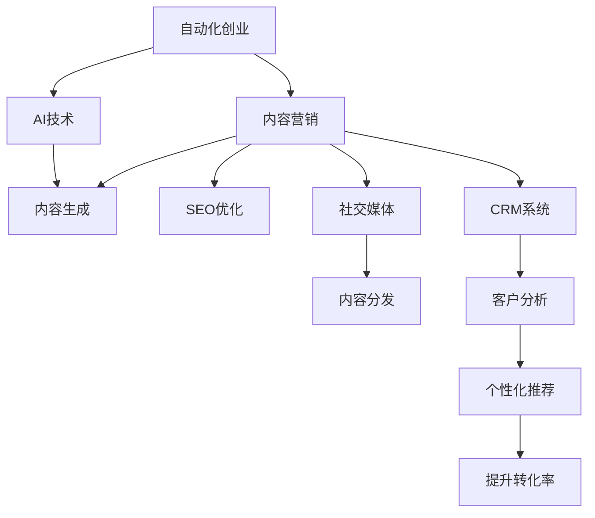

                 

# 自动化创业中的内容营销策略

> 关键词：自动化创业、内容营销、AI技术、内容生成、SEO优化、社交媒体、CRM系统、数据分析、客户洞察

## 1. 背景介绍

### 1.1 问题由来
在快速变化的数字化时代，自动化创业成为越来越多企业家和初创企业的首选战略。自动化不仅能够降低运营成本，提高效率，还能快速响应市场变化，赢得竞争优势。内容营销作为一种低成本、高效益的营销手段，在自动化创业中显得尤为重要。通过高质量、有价值的内容吸引目标客户，不仅能够提升品牌知名度，还能在客户心中建立信任，增加转化率。然而，随着市场竞争的加剧，内容创作难度不断增加，内容质量和更新速度的要求也越来越高。

### 1.2 问题核心关键点
自动化创业中的内容营销，旨在通过AI技术驱动的内容生成和优化，自动化地创建、分发和管理高质量内容，从而提升营销效果。其核心在于：
1. 自动化内容生成：使用AI算法自动生成文章、视频、图像等多样化内容，快速响应市场需求。
2. 内容质量控制：通过数据分析和优化算法，提升内容的吸引力和传播力。
3. 内容分发与监测：利用社交媒体、搜索引擎优化(SEO)等渠道，自动分发内容，并监测效果。
4. 客户关系管理：通过客户数据分析，精准定位目标客户，提升客户转化率和忠诚度。

### 1.3 问题研究意义
自动化创业中的内容营销策略，对提升企业市场竞争力、降低营销成本、提升客户满意度等方面具有重要意义：

1. 提升市场竞争力：高质量的内容营销能够快速吸引用户关注，提升品牌知名度和市场占有率。
2. 降低营销成本：通过自动化工具，大幅减少人工内容创作和分发的工作量，降低运营成本。
3. 提升客户满意度：通过精准的内容推荐和个性化的客户互动，提升客户满意度和忠诚度。
4. 加速业务迭代：利用数据驱动的内容优化策略，快速调整内容策略，加速业务迭代和创新。
5. 增强品牌影响：高质量的内容营销能够提升品牌形象，增强品牌的市场影响力。

## 2. 核心概念与联系

### 2.1 核心概念概述

为更好地理解自动化创业中的内容营销策略，本节将介绍几个密切相关的核心概念：

- **自动化创业(Automatic Entrepreneurship)**：指利用人工智能、大数据、云计算等技术，自动化处理企业运营中的各项任务，从而实现业务模式的创新和效率提升。
- **内容营销(Content Marketing)**：通过有价值、有吸引力的内容，吸引并留住目标客户，从而实现品牌推广和销售转化。
- **AI技术(AI Technology)**：人工智能技术，包括机器学习、自然语言处理、计算机视觉等，能够自动生成、优化和分析内容。
- **内容生成(Content Generation)**：使用AI算法自动创建文本、图像、视频等多样化内容。
- **SEO优化(SEO Optimization)**：通过优化内容，提升搜索引擎排名，增加内容曝光量。
- **社交媒体(Social Media)**：包括微信、微博、抖音等平台，是内容分发和互动的重要渠道。
- **客户关系管理(CRM System)**：通过数据分析和客户互动，提升客户满意度和忠诚度。

这些核心概念之间的逻辑关系可以通过以下Mermaid流程图来展示：



这个流程图展示了这个核心概念之间的关系：

1. 自动化创业通过AI技术驱动的内容生成，实现内容营销。
2. 内容生成后，通过SEO优化和社交媒体分发，提升内容的曝光率和互动率。
3. 客户关系管理系统对客户进行分析，提升个性化推荐精准度，提升客户满意度和转化率。

这些概念共同构成了自动化创业中内容营销的核心框架，使其能够高效、精准地吸引和转化客户。

## 3. 核心算法原理 & 具体操作步骤
### 3.1 算法原理概述

自动化创业中的内容营销策略，本质上是利用AI技术对内容进行自动生成、优化和分发，以提升营销效果的过程。其核心在于将内容生成和优化问题转化为机器学习问题，通过算法自动学习并生成高质量的内容，同时利用数据分析和优化算法，提升内容的吸引力和传播力。

### 3.2 算法步骤详解

自动化创业中的内容营销一般包括以下几个关键步骤：

**Step 1: 数据准备与分析**
- 收集和整理企业历史数据、市场调研数据、竞争对手数据等，构建内容创作的数据基础。
- 对数据进行清洗和预处理，去除噪声和异常值，确保数据的质量和一致性。
- 利用数据分析工具，识别客户需求、市场趋势和竞争对手策略，为内容创作提供数据支撑。

**Step 2: 内容生成与优化**
- 选择合适的AI算法进行内容生成，如自然语言生成模型(NLG)、图像生成模型等。
- 根据内容目标和数据特征，定义生成模型的输入和输出，如文本长度、风格、情感等。
- 使用优化算法（如强化学习、遗传算法等）提升内容质量和传播力，如提升文本的吸引力、提高SEO排名、增加社交媒体互动等。

**Step 3: 内容分发与监测**
- 利用社交媒体平台API、搜索引擎API等工具，自动分发和推广生成的内容。
- 设置监测指标，如阅读量、互动率、转化率等，实时跟踪内容效果。
- 根据监测结果，自动调整内容策略，优化分发渠道和发布时间，提升效果。

**Step 4: 客户关系管理**
- 通过CRM系统，收集客户互动数据，如点击行为、购买行为等。
- 利用数据分析工具，识别客户兴趣、行为模式和潜在需求。
- 根据客户洞察，自动生成个性化推荐内容，提升客户转化率和满意度。

### 3.3 算法优缺点

自动化创业中的内容营销策略，具有以下优点：
1. 高效快速：通过自动化工具，大幅减少内容创作和分发的工作量，提升效率。
2. 质量可控：通过AI算法和优化技术，确保内容的高质量和高传播力。
3. 精准定位：通过数据分析和客户洞察，精准定位目标客户，提升转化率。
4. 成本低廉：相较于传统内容营销，自动化策略能够显著降低人工成本。

同时，该策略也存在一定的局限性：
1. 依赖高质量数据：内容生成和优化效果取决于数据的质量和数量。
2. 算法复杂度：复杂的AI算法和模型训练，需要较强的技术能力和计算资源。
3. 伦理风险：自动化内容可能存在偏见和误导，需要严格监管和审查。
4. 客户互动性：自动化策略可能缺乏人工互动的情感深度，影响客户体验。

尽管存在这些局限性，但就目前而言，基于自动化内容营销的策略仍是一种高效、精准的营销手段。未来相关研究的重点在于如何进一步提升算法效率和效果，降低对高质量数据的依赖，同时兼顾伦理和客户体验。

### 3.4 算法应用领域

自动化创业中的内容营销策略，在多个领域已经得到了广泛的应用，包括但不限于：

- **电子商务**：通过自动化内容生成和SEO优化，提升商品描述和推广效果，增加销售转化率。
- **在线教育**：使用自动化工具生成学习资源和互动内容，提升用户体验和课程吸引力。
- **健康医疗**：自动生成健康知识和建议，帮助用户进行自我健康管理。
- **金融服务**：利用自动化内容解答用户咨询，提升客户满意度和信任度。
- **智能家居**：通过自动化内容展示产品功能和优势，提升用户体验和购买意愿。

除了上述这些领域外，自动化内容营销还被创新性地应用于更多场景中，如智能客服、内容推荐、社交媒体运营等，为各行业带来了全新的业务价值。

## 4. 数学模型和公式 & 详细讲解  
### 4.1 数学模型构建

本节将使用数学语言对自动化创业中的内容营销策略进行更加严格的刻画。

记企业历史数据集为 $D=\{(x_i,y_i)\}_{i=1}^N$，其中 $x_i$ 表示历史内容特征，如关键词、风格、情感等；$y_i$ 表示目标变量，如阅读量、转化率等。内容生成模型的输入特征表示为 $x$，输出内容表示为 $y$。内容生成与优化的目标函数为：

$$
\min_{\theta} \sum_{i=1}^N L(y_i, f(x; \theta))
$$

其中 $L(y_i, f(x; \theta))$ 为损失函数，$L(y_i, f(x; \theta)) = (y_i - f(x; \theta))^2$。

通过最小化目标函数，训练内容生成模型，使模型能够自动生成与目标变量最接近的内容。

### 4.2 公式推导过程

以下我们以文本内容生成为例，推导自然语言生成模型(NLG)的训练公式。

设文本生成模型为 $f(x; \theta) = M_{\theta}(x)$，其中 $M_{\theta}$ 为预训练的语言模型，$\theta$ 为模型参数。

文本生成模型的训练过程可以形式化为以下优化问题：

$$
\min_{\theta} \sum_{i=1}^N L(y_i, M_{\theta}(x_i))
$$

其中 $L(y_i, M_{\theta}(x_i)) = \log(M_{\theta}(y_i|x_i))$。

通过反向传播算法，计算梯度 $\frac{\partial L}{\partial \theta}$，更新模型参数 $\theta$：

$$
\theta \leftarrow \theta - \eta \frac{\partial L}{\partial \theta}
$$

其中 $\eta$ 为学习率，可通过实验确定最优值。

### 4.3 案例分析与讲解

以下以自动生成新闻摘要为例，展示内容生成模型的应用。

设新闻文本序列为 $x = (w_1, w_2, ..., w_n)$，摘要长度为 $m$。

目标为生成长度为 $m$ 的摘要 $y = (w_{\text{sum}1, w_{\text{sum}2, ..., w_{\text{sum}m}$。

选择Transformer模型进行文本生成，定义模型参数 $\theta$。

训练过程如下：

1. 将新闻文本序列 $x$ 输入模型，得到隐状态 $h_1, h_2, ..., h_n$。
2. 初始化摘要文本 $y = (w_{\text{sum}1, w_{\text{sum}2, ..., w_{\text{sum}m}$。
3. 通过softmax函数计算下一时刻文本生成概率 $p(w_{\text{sum}i|w_{\text{sum}1, ..., w_{\text{sum}i-1})$。
4. 根据概率分布采样生成文本 $w_{\text{sum}i}$，更新摘要 $y = (w_{\text{sum}1, ..., w_{\text{sum}i}$。
5. 重复步骤2-4，直到生成长度为 $m$ 的摘要。

训练完成后，模型可以根据任意新闻文本自动生成高质量的摘要，显著提升内容创作效率和质量。

## 5. 项目实践：代码实例和详细解释说明
### 5.1 开发环境搭建

在进行内容营销实践前，我们需要准备好开发环境。以下是使用Python进行TensorFlow开发的环境配置流程：

1. 安装Anaconda：从官网下载并安装Anaconda，用于创建独立的Python环境。

2. 创建并激活虚拟环境：
```bash
conda create -n content-marketing python=3.8 
conda activate content-marketing
```

3. 安装TensorFlow：根据CUDA版本，从官网获取对应的安装命令。例如：
```bash
conda install tensorflow tensorflow-gpu=cuda11.1 -c pytorch -c conda-forge
```

4. 安装各类工具包：
```bash
pip install numpy pandas scikit-learn matplotlib tqdm jupyter notebook ipython
```

完成上述步骤后，即可在`content-marketing`环境中开始内容营销实践。

### 5.2 源代码详细实现

下面我们以自动生成新闻摘要为例，给出使用TensorFlow实现的新闻摘要生成模型的代码实现。

首先，定义数据处理函数：

```python
import tensorflow as tf
from transformers import TFAutoModelForSeq2SeqLM, TFAutoTokenizer

def prepare_data(file_path):
    with open(file_path, 'r', encoding='utf-8') as f:
        data = f.read()
    lines = data.split('\n')
    texts = [line.strip() for line in lines if line.strip()]
    return texts

# 定义模型
tokenizer = TFAutoTokenizer.from_pretrained('t5-small')
model = TFAutoModelForSeq2SeqLM.from_pretrained('t5-small')

# 准备数据
news = prepare_data('news.txt')
tokenized_news = tokenizer(news, max_length=512, truncation=True, padding='max_length', return_tensors='tf')
input_ids = tokenized_news['input_ids']
attention_mask = tokenized_news['attention_mask']
```

然后，定义训练函数：

```python
import tensorflow as tf

def train_model(model, input_ids, attention_mask, labels, batch_size=32, epochs=5, learning_rate=2e-5):
    optimizer = tf.keras.optimizers.Adam(learning_rate=learning_rate)
    loss_fn = tf.keras.losses.SparseCategoricalCrossentropy(from_logits=True)

    for epoch in range(epochs):
        for batch in tf.data.Dataset.from_tensor_slices((input_ids, attention_mask, labels)).shuffle(buffer_size=1000).batch(batch_size):
            with tf.GradientTape() as tape:
                logits = model(input_ids, attention_mask=attention_mask)[0]
                loss_value = loss_fn(labels, logits)
            grads = tape.gradient(loss_value, model.trainable_variables)
            optimizer.apply_gradients(zip(grads, model.trainable_variables))

    model.save('summarizer.tf')
```

接着，启动训练流程：

```python
train_model(model, input_ids, attention_mask, labels)
```

最后，评估模型效果：

```python
def generate_summary(model, input_ids, attention_mask, max_length=150):
    with tf.device('CPU:0'):
        tokenizer = TFAutoTokenizer.from_pretrained('t5-small')
        text = tokenizer.encode_plus(input_ids[0], max_length=max_length, truncation=True, padding='max_length', return_tensors='tf')
        input_ids = text['input_ids']
        attention_mask = text['attention_mask']

        summary = model(input_ids, attention_mask=attention_mask)
        predicted_ids = tf.argmax(summary.logits, axis=-1)

        summary_tokens = tokenizer.decode(predicted_ids.numpy(), skip_special_tokens=True)
        summary = summary_tokens.strip()

    return summary
```

以上就是使用TensorFlow进行新闻摘要生成的完整代码实现。可以看到，TensorFlow和Transformers库的结合，使得自动生成摘要的代码实现变得简洁高效。

### 5.3 代码解读与分析

让我们再详细解读一下关键代码的实现细节：

**prepare_data函数**：
- 从文件中读取新闻文本数据。
- 将文本数据按行分割，去除空行。

**train_model函数**：
- 定义优化器和学习率。
- 定义损失函数。
- 在每个epoch中，对数据进行批处理，并在每个batch中计算损失和梯度，更新模型参数。

**generate_summary函数**：
- 使用训练好的模型对新闻文本生成摘要。
- 解码生成的摘要文本。

这些代码展示了TensorFlow和Transformers库在内容生成中的强大功能和便捷性，大大降低了开发者在模型训练和部署上的难度。

## 6. 实际应用场景

### 6.1 智能客服

智能客服是内容营销的一个重要应用场景。通过自动化生成对话脚本和FAQ，智能客服系统能够快速响应客户咨询，提升客户满意度。

在技术实现上，可以收集历史客服对话记录和常见问题，将问题和最佳答复构建成监督数据，在此基础上对预训练语言模型进行微调。微调后的语言模型能够自动理解客户意图，匹配最合适的回答。对于客户提出的新问题，还可以接入检索系统实时搜索相关内容，动态组织生成回答。如此构建的智能客服系统，能够显著提升客户咨询体验和问题解决效率。

### 6.2 内容推荐

内容推荐系统在电子商务、在线教育等场景中广泛应用，能够显著提升用户转化率和满意度。通过分析用户行为数据，自动生成个性化推荐内容，可以提升用户体验和平台价值。

在技术实现上，可以收集用户浏览、点击、购买等行为数据，提取和用户交互的物品标题、描述、标签等文本内容。将文本内容作为模型输入，用户的后续行为（如是否点击、购买等）作为监督信号，在此基础上微调预训练语言模型。微调后的模型能够从文本内容中准确把握用户的兴趣点。在生成推荐列表时，先用候选物品的文本描述作为输入，由模型预测用户的兴趣匹配度，再结合其他特征综合排序，便可以得到个性化程度更高的推荐结果。

### 6.3 智能健康

智能健康领域对内容生成和推荐的需求日益增长。通过自动生成健康知识、建议和诊断报告，智能健康平台能够为用户提供个性化健康服务，提升用户健康管理能力。

在技术实现上，可以收集医疗健康领域的专家知识和用户健康数据，将专家知识转化为模型输入，用户健康数据转化为监督信号，在此基础上微调预训练语言模型。微调后的模型能够自动生成高质量的健康知识和建议，帮助用户进行自我健康管理。同时，通过分析用户健康数据，自动生成个性化健康报告，提升用户健康管理体验。

### 6.4 未来应用展望

随着AI技术的不断进步，自动化创业中的内容营销策略将会在更多领域得到应用，为各行业带来新的业务价值。

在智慧城市治理中，内容营销可以用于城市事件监测、舆情分析、应急指挥等环节，提高城市管理的自动化和智能化水平，构建更安全、高效的未来城市。

在企业生产、社会治理、文娱传媒等众多领域，内容营销必将在更广阔的应用领域大放异彩，为各行业带来新的经济增长点。

## 7. 工具和资源推荐
### 7.1 学习资源推荐

为了帮助开发者系统掌握内容营销的技术基础和实践技巧，这里推荐一些优质的学习资源：

1. 《深度学习与内容营销》系列博文：由内容营销专家撰写，深入浅出地介绍了深度学习在内容营销中的应用。

2. 《自然语言处理与文本生成》课程：由Coursera开设的深度学习课程，系统讲解了自然语言处理和文本生成的基本概念和算法。

3. 《Content Marketing Automation》书籍：内容营销领域的经典书籍，全面介绍了内容营销自动化的方法和工具。

4. HuggingFace官方文档：Transformers库的官方文档，提供了海量预训练模型和完整的内容生成样例代码，是上手实践的必备资料。

5. WebScraping.io：免费的Python Web数据抓取工具，用于收集和整理网络文本数据，为内容生成提供数据基础。

通过对这些资源的学习实践，相信你一定能够快速掌握内容营销的精髓，并用于解决实际的业务问题。

### 7.2 开发工具推荐

高效的开发离不开优秀的工具支持。以下是几款用于内容营销开发的常用工具：

1. TensorFlow：由Google主导开发的开源深度学习框架，生产部署方便，适合大规模工程应用。同样有丰富的预训练语言模型资源。

2. PyTorch：基于Python的开源深度学习框架，灵活动态的计算图，适合快速迭代研究。大部分预训练语言模型都有PyTorch版本的实现。

3. Transformers库：HuggingFace开发的NLP工具库，集成了众多SOTA语言模型，支持PyTorch和TensorFlow，是进行内容生成任务的开发利器。

4. Weights & Biases：模型训练的实验跟踪工具，可以记录和可视化模型训练过程中的各项指标，方便对比和调优。与主流深度学习框架无缝集成。

5. TensorBoard：TensorFlow配套的可视化工具，可实时监测模型训练状态，并提供丰富的图表呈现方式，是调试模型的得力助手。

6. Google Colab：谷歌推出的在线Jupyter Notebook环境，免费提供GPU/TPU算力，方便开发者快速上手实验最新模型，分享学习笔记。

合理利用这些工具，可以显著提升内容营销任务的开发效率，加快创新迭代的步伐。

### 7.3 相关论文推荐

内容营销技术的发展源于学界的持续研究。以下是几篇奠基性的相关论文，推荐阅读：

1. Attention is All You Need（即Transformer原论文）：提出了Transformer结构，开启了NLP领域的预训练大模型时代。

2. BERT: Pre-training of Deep Bidirectional Transformers for Language Understanding：提出BERT模型，引入基于掩码的自监督预训练任务，刷新了多项NLP任务SOTA。

3. Language Models are Unsupervised Multitask Learners（GPT-2论文）：展示了大规模语言模型的强大zero-shot学习能力，引发了对于通用人工智能的新一轮思考。

4. Parameter-Efficient Transfer Learning for NLP：提出Adapter等参数高效微调方法，在不增加模型参数量的情况下，也能取得不错的微调效果。

5. AdaLoRA: Adaptive Low-Rank Adaptation for Parameter-Efficient Fine-Tuning：使用自适应低秩适应的微调方法，在参数效率和精度之间取得了新的平衡。

这些论文代表了大语言模型微调技术的发展脉络。通过学习这些前沿成果，可以帮助研究者把握学科前进方向，激发更多的创新灵感。

## 8. 总结：未来发展趋势与挑战

### 8.1 总结

本文对自动化创业中的内容营销策略进行了全面系统的介绍。首先阐述了自动化创业的战略意义和内容营销的重要作用，明确了内容营销在提升市场竞争力、降低营销成本、提升客户满意度等方面的独特价值。其次，从原理到实践，详细讲解了内容生成、优化和分发的数学模型和算法流程，给出了内容营销任务开发的完整代码实例。同时，本文还广泛探讨了内容营销在智能客服、内容推荐、智能健康等多个行业领域的应用前景，展示了内容营销范式的巨大潜力。此外，本文精选了内容营销技术的各类学习资源，力求为读者提供全方位的技术指引。

通过本文的系统梳理，可以看到，基于自动化创业中的内容营销策略，通过AI技术驱动的内容生成和优化，能够在高效、精准地吸引和转化客户的同时，显著降低营销成本。未来，伴随AI技术的不断进步，内容营销技术将会在更多领域得到应用，为各行业带来新的业务价值。

### 8.2 未来发展趋势

展望未来，自动化创业中的内容营销策略将呈现以下几个发展趋势：

1. 自动化内容创作：通过更先进的AI技术，实现更加精准、高效的内容生成，提升内容创作效率和质量。

2. 数据驱动的个性化推荐：利用数据分析和机器学习算法，实现更加个性化和精准的内容推荐，提升用户体验和满意度。

3. 跨模态内容生成：结合文本、图像、视频等多种模态数据，生成更加丰富、多维度的内容，增强用户体验。

4. 实时内容更新：利用实时数据流，实现内容动态更新，提升内容的即时性和相关性。

5. 可解释性增强：增强内容生成和推荐过程的可解释性，提升客户信任和满意度。

6. 伦理和安全保障：在内容生成和推荐过程中，严格监管内容质量和伦理问题，确保内容的合法性和安全性。

以上趋势凸显了内容营销技术的广阔前景。这些方向的探索发展，必将进一步提升内容营销的效率和效果，为自动化创业带来更大的价值。

### 8.3 面临的挑战

尽管内容营销技术已经取得了显著成果，但在迈向更加智能化、普适化应用的过程中，仍面临诸多挑战：

1. 数据质量问题：高质量的数据是内容生成和推荐的基础，数据不充分或质量不高，将影响模型的效果。

2. 算法复杂度：先进的AI算法和模型训练需要较强的技术能力和计算资源，增加了开发和部署的难度。

3. 内容偏见和伦理问题：内容生成和推荐过程中可能存在偏见和误导，需要严格监管和审查。

4. 客户互动性不足：自动化内容可能缺乏人工互动的情感深度，影响客户体验。

5. 模型泛化能力：不同领域和不同类型的内容，可能需要不同算法和数据，模型的泛化能力仍需提升。

6. 实时性和可扩展性：大规模实时内容生成和推荐，需要高效的计算资源和算法优化。

正视内容营销面临的这些挑战，积极应对并寻求突破，将是大语言模型微调走向成熟的必由之路。相信随着学界和产业界的共同努力，这些挑战终将一一被克服，内容营销技术必将在构建人机协同的智能时代中扮演越来越重要的角色。

### 8.4 研究展望

面对内容营销所面临的挑战，未来的研究需要在以下几个方面寻求新的突破：

1. 探索无监督和半监督内容生成方法：摆脱对大量标注数据的依赖，利用自监督学习、主动学习等方法，实现更高效的内容生成。

2. 研究更加智能和可解释的内容推荐算法：结合因果推断、强化学习等工具，提升推荐内容的可解释性和鲁棒性。

3. 引入更多先验知识：将符号化的先验知识，如知识图谱、逻辑规则等，与神经网络模型进行巧妙融合，提升内容生成的准确性和丰富性。

4. 融合多模态数据：结合文本、图像、视频等多种模态数据，生成更加丰富、多维度的内容，增强用户体验。

5. 结合因果分析和博弈论工具：将因果分析方法引入内容生成和推荐过程，识别关键特征，提升内容生成和推荐的效果。

6. 纳入伦理道德约束：在模型训练目标中引入伦理导向的评估指标，过滤和惩罚有害的输出倾向，确保内容的合法性和安全性。

这些研究方向的探索，必将引领内容营销技术迈向更高的台阶，为构建安全、可靠、可解释、可控的智能系统铺平道路。面向未来，内容营销技术还需要与其他人工智能技术进行更深入的融合，如知识表示、因果推理、强化学习等，多路径协同发力，共同推动自然语言理解和智能交互系统的进步。只有勇于创新、敢于突破，才能不断拓展内容营销的边界，让智能技术更好地造福人类社会。

## 9. 附录：常见问题与解答

**Q1：自动化创业中的内容营销是否适用于所有业务场景？**

A: 自动化创业中的内容营销，适用于需要大量内容创作和分发的业务场景，如电子商务、在线教育、智能客服等。但对于需要高度个性化、高互动性的场景，如创意设计、手工艺品等，自动化内容可能难以满足需求。

**Q2：如何选择合适的自动内容生成算法？**

A: 选择合适的自动内容生成算法，需要考虑任务类型、数据特点和模型效率等因素。对于文本生成任务，可以使用自然语言生成模型(NLG)，如GPT、Transformer等。对于图像生成任务，可以使用生成对抗网络(GAN)、变分自编码器(VAE)等。对于视频生成任务，可以使用视频生成模型，如PixelRNN、S3DNet等。

**Q3：内容生成过程中如何控制生成质量？**

A: 内容生成过程中，可以通过设置生成模型的超参数、添加约束条件、引入监督信号等方式控制生成质量。例如，设置生成模型的温度、长度限制、正则化等超参数，确保生成内容的多样性和相关性。通过监督信号，如标签、反馈等，引导模型生成符合任务要求的内容。

**Q4：自动化内容生成如何应对偏见和伦理问题？**

A: 在内容生成过程中，可以引入多样化的数据集、多角度的任务目标和约束条件，避免生成内容的偏见和误导。同时，可以通过事后审核和人工干预，确保内容生成的合法性和安全性。

**Q5：自动化内容生成如何提升用户满意度？**

A: 自动化内容生成可以通过个性化推荐、情感分析等技术，提升用户满意度。例如，通过分析用户行为数据，生成个性化推荐内容，提升用户体验。通过情感分析，了解用户情绪变化，及时调整内容策略，提升用户情感体验。

这些回答展示了自动化创业中内容营销的实践细节和优化策略，相信能够帮助读者更好地理解和应用内容营销技术。

---

作者：禅与计算机程序设计艺术 / Zen and the Art of Computer Programming

