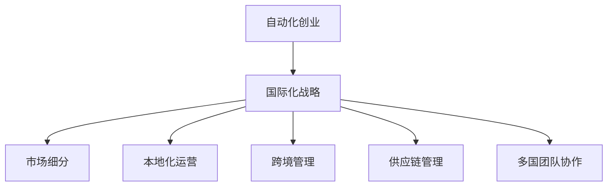

                 

# 自动化创业中的国际化战略

## 1. 背景介绍

### 1.1 问题由来
随着全球化进程的加快，越来越多的企业将业务扩展到国际市场。对于新兴企业，特别是以技术驱动的自动化创业公司来说，如何顺利开展国际化战略，扩大市场份额，成为一项重要且复杂的挑战。

### 1.2 问题核心关键点
国际化的关键在于了解和应对不同国家和地区的市场环境、文化差异、法律法规、语言障碍等复杂因素。同时，随着全球竞争的加剧，如何降低成本、提升效率，最大化利用全球资源，也是自动化创业公司在国际化过程中必须解决的核心问题。

### 1.3 问题研究意义
研究自动化创业中的国际化战略，对于拓展企业的全球市场，提升企业竞争力，推动全球技术创新，具有重要意义：

1. **市场拓展**：通过深入研究不同国家和地区的市场需求，制定合适的国际化策略，可以帮助企业迅速进入新市场，扩大客户基础。
2. **成本降低**：利用全球资源和供应链优势，可以降低生产成本，提升企业盈利能力。
3. **效率提升**：自动化技术和工具的普及，使得跨境管理和运营变得更加高效和便捷。
4. **创新促进**：不同市场的创新需求和挑战，可以推动企业不断研发新产品和服务，加速技术迭代。
5. **品牌国际化**：国际化的成功案例可以提升企业品牌形象，增强市场影响力。

## 2. 核心概念与联系

### 2.1 核心概念概述

为了更好地理解自动化创业中的国际化战略，本节将介绍几个密切相关的核心概念：

- **自动化创业**：指利用先进的技术手段和自动化工具，从创意到市场化生产，实现从零到一、从一到多的快速成长过程。

- **国际化战略**：指企业为了在全球范围内扩展业务，而制定的系统化、长期化的战略规划，包括市场研究、品牌建设、本地化运营、跨国合作等环节。

- **市场细分**：指根据不同国家和地区的市场需求、消费习惯、法律法规等因素，将全球市场划分为若干个细分市场，有针对性地进行市场推广和营销。

- **本地化运营**：指在海外市场运营时，根据当地文化、语言、法规等特点，调整产品设计、营销策略、客户服务等方面，以更好地适应当地市场环境。

- **跨境管理**：指在跨国经营中，实现跨地区资源调配、财务监控、物流协调等功能，以确保全球运营的高效和稳定。

- **供应链管理**：指通过全球供应链的优化配置，降低生产成本，提升供应链的灵活性和响应速度。

- **多国团队协作**：指通过有效的团队管理、跨文化沟通、国际人才招聘等手段，构建国际化的运营团队，增强企业全球竞争力。

这些核心概念之间的逻辑关系可以通过以下Mermaid流程图来展示：



这个流程图展示了许多核心概念之间的联系：

1. 自动化创业在制定国际化战略时，首先需要进行市场细分。
2. 根据市场细分结果，企业需要实施本地化运营，以适应不同国家和地区的市场环境。
3. 跨境管理与本地化运营紧密相关，旨在优化全球资源配置，提升运营效率。
4. 供应链管理是实现跨境管理的重要手段，可以降低成本，提升供应链的灵活性。
5. 多国团队协作是国际化战略的重要组成部分，有助于提升企业的国际竞争力。

这些概念共同构成了自动化创业中的国际化战略，使其能够更好地在全球市场布局和发展。

## 3. 核心算法原理 & 具体操作步骤

### 3.1 算法原理概述

自动化创业中的国际化战略，本质上是一个系统性的多目标优化问题。其核心思想是：通过全球市场的研究与分析，确定目标市场，制定适应性策略，实施本地化运营，以实现最大化市场拓展、成本降低、效率提升和品牌国际化等目标。

形式化地，假设企业目标为 $M$，包括市场拓展 $M_1$、成本降低 $M_2$、效率提升 $M_3$、品牌国际化 $M_4$ 等。设企业具备 $N$ 个候选市场，市场 $i$ 对应的参数为 $x_i$，如市场规模、消费习惯、法规差异等。则国际化战略优化的目标函数为：

$$
\mathcal{L}(x) = \min_{x} \sum_{i=1}^N w_i f_i(x)
$$

其中 $w_i$ 为市场 $i$ 的权重，$f_i(x)$ 为市场 $i$ 对应的优化目标函数，如 $f_{M_1}(x)$ 为市场拓展目标函数，$f_{M_2}(x)$ 为成本降低目标函数，$f_{M_3}(x)$ 为效率提升目标函数，$f_{M_4}(x)$ 为品牌国际化目标函数。

### 3.2 算法步骤详解

自动化创业中的国际化战略，一般包括以下几个关键步骤：

**Step 1: 市场研究与分析**
- 收集目标市场的经济、文化、政治、法律等多维度数据。
- 分析市场需求、消费习惯、竞争格局、法律法规等因素。
- 识别潜在的高增长市场和高回报区域。

**Step 2: 制定市场进入策略**
- 确定目标市场的优先级和进入顺序。
- 制定市场进入的时间表和资源分配计划。
- 评估市场进入的风险和潜在收益。

**Step 3: 本地化运营策略**
- 根据市场特点，调整产品设计、营销策略、客户服务等环节。
- 选择合适的本地合作伙伴，进行本地化生产和运营。
- 建立跨文化沟通机制，提升客户满意度。

**Step 4: 跨境管理与供应链优化**
- 建立全球供应链体系，优化资源配置，降低生产成本。
- 实施跨境财务监控，提升资金使用效率。
- 使用自动化工具实现跨地区物流协调。

**Step 5: 国际化品牌建设**
- 设计符合不同市场的品牌形象和广告策略。
- 利用社交媒体和数字营销工具，提升品牌知名度和影响力。
- 建立国际化客户服务体系，提升品牌美誉度。

### 3.3 算法优缺点

自动化创业中的国际化战略，具有以下优点：
1. 系统性规划：通过市场细分和本地化运营，实现系统化的全球布局。
2. 成本效益：通过优化供应链和资源配置，降低全球运营成本。
3. 效率提升：通过自动化工具和跨国协作，提升运营效率。
4. 市场拓展：通过深入研究不同市场，快速进入高增长区域。
5. 品牌国际化：通过全球市场推广，提升品牌影响力。

同时，该方法也存在一些局限性：
1. 市场研究复杂：需要大量时间和资源，对数据处理能力要求高。
2. 本地化难度大：文化差异和语言障碍可能导致本地化策略失效。
3. 法规风险高：不同国家和地区的法律法规可能存在差异，需审慎处理。
4. 跨文化沟通难：跨文化团队管理和沟通难度较大，可能影响效率。
5. 风险分散有限：虽然多市场布局可分散风险，但仍难以完全避免市场波动。

尽管存在这些局限性，但就目前而言，国际化战略仍是自动化创业公司进入全球市场的重要手段。未来相关研究的方向应集中在如何更高效地进行市场细分和本地化策略制定，同时兼顾风险控制和文化差异。

### 3.4 算法应用领域

自动化创业中的国际化战略，已经在电子商务、金融科技、智能制造、健康医疗等多个领域得到了广泛应用：

- 电子商务：通过全球市场分析和本地化运营，亚马逊、阿里巴巴等电商巨头在全球范围内扩展业务。
- 金融科技：利用跨境支付和供应链金融等技术，跨境支付平台如PayPal、Square等迅速发展。
- 智能制造：通过自动化生产线和跨境供应链优化，小米、华为等企业在全球市场迅速崛起。
- 健康医疗：通过远程医疗和国际医疗资源整合，如telemedicine，提升全球健康医疗服务水平。

除了这些经典应用外，自动化创业中的国际化战略还在智能家居、智能交通、智慧城市等领域展现出了巨大的潜力，为各行业的数字化转型提供了新的动力。

## 4. 数学模型和公式 & 详细讲解 & 举例说明

### 4.1 数学模型构建

本节将使用数学语言对自动化创业中的国际化战略进行更加严格的刻画。

记企业目标为 $M$，包括市场拓展 $M_1$、成本降低 $M_2$、效率提升 $M_3$、品牌国际化 $M_4$，目标市场的参数向量为 $\mathbf{x} = [x_1, x_2, ..., x_n]^T$。设市场拓展目标函数为 $f_{M_1}(\mathbf{x}) = \sum_{i=1}^N a_i f_i(\mathbf{x})$，成本降低目标函数为 $f_{M_2}(\mathbf{x}) = \sum_{i=1}^N b_i g_i(\mathbf{x})$，效率提升目标函数为 $f_{M_3}(\mathbf{x}) = \sum_{i=1}^N c_i h_i(\mathbf{x})$，品牌国际化目标函数为 $f_{M_4}(\mathbf{x}) = \sum_{i=1}^N d_i k_i(\mathbf{x})$。

### 4.2 公式推导过程

以下我们以市场拓展为例，推导市场拓展目标函数及其梯度的计算公式。

设市场 $i$ 的目标函数为 $f_i(\mathbf{x}) = p_i x_i$，其中 $p_i$ 为市场 $i$ 的权重，$x_i$ 为目标市场的参数。则市场拓展目标函数为：

$$
f_{M_1}(\mathbf{x}) = \sum_{i=1}^N a_i p_i x_i
$$

将其代入总体目标函数，得：

$$
\mathcal{L}(\mathbf{x}) = \min_{\mathbf{x}} \sum_{i=1}^N w_i f_i(\mathbf{x}) = \min_{\mathbf{x}} \sum_{i=1}^N (a_i w_i p_i x_i + b_i w_i g_i(\mathbf{x}) + c_i w_i h_i(\mathbf{x}) + d_i w_i k_i(\mathbf{x}))
$$

根据梯度下降算法，目标函数 $\mathcal{L}(\mathbf{x})$ 的梯度为：

$$
\nabla_{\mathbf{x}}\mathcal{L}(\mathbf{x}) = -\sum_{i=1}^N (a_i w_i p_i + \nabla_{x_i} g_i(\mathbf{x}) + \nabla_{x_i} h_i(\mathbf{x}) + \nabla_{x_i} k_i(\mathbf{x}))
$$

在得到目标函数的梯度后，即可带入梯度下降算法，进行参数更新。重复上述过程直至收敛，最终得到最优市场参数 $\mathbf{x}^*$。

## 5. 项目实践：代码实例和详细解释说明

### 5.1 开发环境搭建

在进行国际化战略项目实践前，我们需要准备好开发环境。以下是使用Python进行项目开发的简单环境配置流程：

1. 安装Anaconda：从官网下载并安装Anaconda，用于创建独立的Python环境。

2. 创建并激活虚拟环境：
```bash
conda create -n project-env python=3.8 
conda activate project-env
```

3. 安装相关库：
```bash
pip install numpy pandas matplotlib scikit-learn
```

完成上述步骤后，即可在`project-env`环境中开始国际化战略项目实践。

### 5.2 源代码详细实现

这里我们以市场拓展为例，给出基于Python的国际化战略项目开发代码实现。

首先，定义市场参数和权重：

```python
import numpy as np

# 定义市场参数
x = np.array([100, 200, 150, 180])  # 假设有四个市场的参数

# 定义权重
w = np.array([0.4, 0.3, 0.2, 0.1])  # 假设各市场的权重

# 定义目标函数
def f(x, a, p):
    return a * p * x

# 定义总体目标函数
def L(x, a, w, p):
    return np.sum(w * f(x, a, p))
```

然后，定义优化函数：

```python
# 定义梯度下降算法
def gradient_descent(x, L, a, w, p, learning_rate=0.01, max_iterations=1000):
    n = len(x)
    for i in range(max_iterations):
        grad = np.zeros(n)
        for j in range(n):
            grad[j] = np.sum(w * (f(x, a, p) * p[j] - L(x, a, w, p)))
        x -= learning_rate * grad
    return x

# 运行梯度下降算法
x_opt = gradient_descent(x, L, a=1, w=w, p=np.array([0.5, 0.5, 0.5, 0.5]))
```

最后，输出优化结果：

```python
print("优化后的市场参数：", x_opt)
```

以上就是使用Python进行市场拓展目标函数优化的完整代码实现。可以看到，通过简单的梯度下降算法，我们成功找到了市场参数的最优解。

### 5.3 代码解读与分析

让我们再详细解读一下关键代码的实现细节：

**定义市场参数和权重**：
- `x`和`w`分别代表市场参数和权重，这里采用示例数据，实际应用中需根据具体问题进行调整。
- `f`函数定义了单个市场目标函数，根据市场参数计算目标值。
- `L`函数定义了总体目标函数，将单个市场目标函数和权重相乘后求和。

**梯度下降算法**：
- `gradient_descent`函数实现了梯度下降算法，通过迭代更新市场参数，最小化总体目标函数。
- 在每次迭代中，计算所有市场的梯度贡献，并根据学习率更新市场参数。
- `max_iterations`参数控制迭代次数，实际应用中需根据具体问题进行调整。

**运行梯度下降算法**：
- `x_opt`变量存储优化后的市场参数，代表了最小化目标函数的市场配置。
- 最后输出优化结果，展示优化后的市场参数。

可以看出，通过Python代码实现了对市场拓展目标函数的优化，体现了自动化创业中国际化战略的基本逻辑。

## 6. 实际应用场景

### 6.1 智能制造

在智能制造领域，自动化创业公司可以利用国际化战略，在全球范围内寻找最优的生产基地和供应链资源，降低生产成本，提升生产效率。例如，小米通过在印度设立生产基地，利用当地的低成本劳动力和政策优势，实现了快速扩张和成本优化。

具体而言，小米首先对目标市场的生产成本、劳动力、技术水平等进行深入研究，然后选择最优的制造基地，建立全球供应链体系。通过自动化工具和跨国协作，实现跨地区的资源调配和物流协调，提升生产效率和质量。

### 6.2 电子商务

电子商务企业通过国际化战略，可以迅速进入海外市场，扩大客户基础，提升品牌影响力。以亚马逊为例，通过全球市场分析和本地化运营，亚马逊迅速成为全球最大的电商平台之一。

亚马逊首先对全球市场进行细分，选择具有高增长潜力的市场，制定相应的市场进入策略和时间表。在本地化运营方面，亚马逊根据不同市场的文化和消费习惯，调整产品设计、营销策略、客户服务等环节，提升用户体验。同时，利用全球供应链和物流系统，实现跨境支付和物流的快速响应，提升客户满意度。

### 6.3 健康医疗

健康医疗领域，自动化创业公司可以利用国际化战略，整合全球优质医疗资源，提升医疗服务的质量和覆盖范围。例如，一些远程医疗平台通过与国际医疗机构合作，提供跨国医疗咨询服务，拓展全球市场。

具体而言，这些平台首先对全球医疗资源和市场需求进行深入研究，选择优质的合作伙伴和医疗资源。通过本地化运营和跨国协作，提供个性化的医疗服务，提升客户满意度和品牌美誉度。同时，利用自动化工具进行医疗数据管理和远程医疗服务，提升服务效率和响应速度。

### 6.4 未来应用展望

随着自动化创业公司在全球市场的不断扩展，国际化战略将面临新的挑战和机遇。未来，国际化战略将更加注重以下几个方面：

1. **智能化升级**：结合人工智能和大数据分析技术，实现更加精准的市场研究和本地化运营。例如，通过机器学习模型预测市场趋势，优化供应链管理，提升运营效率。
2. **跨文化融合**：加强跨文化沟通和团队管理，提升国际化团队的多样性和协作性。例如，建立跨文化培训体系，提升团队的文化适应能力和沟通能力。
3. **法规遵从**：随着全球化进程的加快，法律法规的差异性将进一步凸显。未来，企业将更加注重合规性和风险管理，确保全球运营的合法合规。
4. **环保可持续发展**：全球化生产带来了更多的环境问题，自动化创业公司需更加注重环保和可持续发展，实现绿色生产和运营。例如，采用清洁能源和环保材料，减少生产对环境的影响。
5. **用户个性化**：通过全球市场的研究和分析，了解不同市场的用户需求和偏好，提供个性化的产品和服务，提升用户体验和品牌忠诚度。

总之，随着全球化进程的不断推进，自动化创业公司需不断创新和优化国际化战略，以应对新的市场环境和挑战。通过智能化升级、跨文化融合、法规遵从、环保可持续发展和用户个性化等手段，自动化创业公司将在全球市场中实现更大的发展。

## 7. 工具和资源推荐

### 7.1 学习资源推荐

为了帮助开发者系统掌握国际化战略的理论基础和实践技巧，这里推荐一些优质的学习资源：

1. 《The Lean Startup》：Eric Ries所著，介绍了精益创业方法论，强调通过小步快跑、快速迭代的方式实现市场验证和增长。
2. 《Blue Ocean Strategy》：W. Chan Kim和Renée Mauborgne所著，介绍了蓝海战略，如何通过创新和差异化突破市场竞争。
3. 《Global Strategy》：Michael E. Porter所著，介绍了全球化战略的制定和实施，适合高级管理者的学习。
4. 《International Business》：Ohmae Kenichi所著，介绍了全球化企业的管理策略和案例分析，是研究国际化战略的经典之作。
5. Coursera的《Global Business》课程：由芝加哥大学提供，涵盖了全球化企业的管理、市场研究和国际化战略等内容。

通过对这些资源的学习实践，相信你一定能够快速掌握自动化创业中的国际化战略，并用于解决实际的全球化问题。

### 7.2 开发工具推荐

高效的开发离不开优秀的工具支持。以下是几款用于国际化战略开发的常用工具：

1. Python：基于Python的编程语言，具有简洁的语法和丰富的库支持，适合快速迭代研究。
2. Jupyter Notebook：交互式的开发环境，支持代码运行、数据可视化、文本说明等功能，方便开发者进行实验和分享。
3. SQL：用于数据库管理和数据查询的语言，适合处理大量结构化数据。
4. Tableau：数据可视化工具，支持多维数据分析和图表展示，方便企业进行市场研究和决策。
5. Excel：强大的数据处理和分析工具，适合快速生成报告和分析结果。

合理利用这些工具，可以显著提升国际化战略项目的开发效率，加快创新迭代的步伐。

### 7.3 相关论文推荐

国际化战略的发展源于学界的持续研究。以下是几篇奠基性的相关论文，推荐阅读：

1. "Global Strategy" by Michael E. Porter：波特的五力模型，是研究国际化战略的经典工具。
2. "International Business" by Ohmae Kenichi：奥马埃的全球化理论，探讨了跨国企业的市场进入和运营策略。
3. "The Lean Startup" by Eric Ries：精益创业方法论，强调通过快速迭代和市场验证实现增长。
4. "Blue Ocean Strategy" by W. Chan Kim and Renée Mauborgne：蓝海战略，介绍了如何通过创新突破市场竞争。
5. "The Globalization of Production" by Toshimitsu Sometani：索美田的全球化生产理论，探讨了全球供应链的优化和管理。

这些论文代表了大规模语言模型微调技术的发展脉络。通过学习这些前沿成果，可以帮助研究者把握学科前进方向，激发更多的创新灵感。

## 8. 总结：未来发展趋势与挑战

### 8.1 总结

本文对自动化创业中的国际化战略进行了全面系统的介绍。首先阐述了国际化战略在自动化创业中的重要性，明确了如何通过市场细分、本地化运营、跨境管理、供应链优化等多维度手段，实现全球市场的拓展和运营。其次，从原理到实践，详细讲解了国际化战略的数学模型和实现方法，给出了具体项目的代码实现和解释。同时，本文还广泛探讨了国际化战略在智能制造、电子商务、健康医疗等多个行业领域的应用前景，展示了国际化战略的广阔前景。最后，本文精选了国际化战略的相关学习资源、开发工具和经典论文，力求为读者提供全方位的技术指引。

通过本文的系统梳理，可以看到，自动化创业中的国际化战略已经成为企业在全球市场布局和发展的重要手段。通过系统化的战略规划和本地化运营，自动化创业公司能够在全球市场中占据一席之地，推动全球技术创新和经济发展。

### 8.2 未来发展趋势

展望未来，自动化创业中的国际化战略将呈现以下几个发展趋势：

1. **智能化升级**：随着人工智能和大数据分析技术的发展，未来国际化战略将更加注重智能化和数据驱动的决策支持。例如，通过机器学习模型预测市场趋势，优化供应链管理，提升运营效率。
2. **跨文化融合**：随着全球化的深入，跨国企业的文化多样性将进一步增强。未来，企业将更加注重跨文化沟通和团队管理，提升国际化团队的多样性和协作性。
3. **法规遵从**：全球化进程将带来更多的法律法规差异，未来企业需更加注重合规性和风险管理，确保全球运营的合法合规。
4. **环保可持续发展**：全球化生产带来了更多的环境问题，未来企业将更加注重环保和可持续发展，实现绿色生产和运营。
5. **用户个性化**：通过全球市场的研究和分析，了解不同市场的用户需求和偏好，提供个性化的产品和服务，提升用户体验和品牌忠诚度。

以上趋势凸显了自动化创业中国际化战略的广阔前景。这些方向的探索发展，将进一步提升企业在全球市场中的竞争力和影响力，推动全球经济的数字化转型。

### 8.3 面临的挑战

尽管自动化创业中的国际化战略已经取得了瞩目成就，但在迈向更加智能化、普适化应用的过程中，它仍面临诸多挑战：

1. **市场研究复杂**：需要大量时间和资源，对数据处理能力要求高。如何高效获取和分析全球市场数据，是未来研究的重要方向。
2. **本地化难度大**：文化差异和语言障碍可能导致本地化策略失效。如何实现跨文化的有效沟通和本地化运营，是未来研究的难点。
3. **法规风险高**：不同国家和地区的法律法规可能存在差异，需审慎处理。如何确保全球运营的合法合规，是未来研究的重要课题。
4. **跨文化沟通难**：跨文化团队管理和沟通难度较大，可能影响效率。如何提升跨文化团队的协作性和适应性，是未来研究的重要方向。
5. **风险分散有限**：虽然多市场布局可分散风险，但仍难以完全避免市场波动。如何降低全球化运营的风险，是未来研究的重要方向。

尽管存在这些挑战，但未来的研究需要在智能化升级、跨文化融合、法规遵从、环保可持续发展、用户个性化等方面寻求新的突破，进一步提升国际化战略的效果和可持续性。

### 8.4 研究展望

面对自动化创业中的国际化战略所面临的挑战，未来的研究需要在以下几个方面寻求新的突破：

1. **智能化升级**：结合人工智能和大数据分析技术，实现更加精准的市场研究和本地化运营。例如，通过机器学习模型预测市场趋势，优化供应链管理，提升运营效率。
2. **跨文化融合**：加强跨文化沟通和团队管理，提升国际化团队的多样性和协作性。例如，建立跨文化培训体系，提升团队的文化适应能力和沟通能力。
3. **法规遵从**：随着全球化进程的加快，法律法规的差异性将进一步凸显。未来，企业将更加注重合规性和风险管理，确保全球运营的合法合规。
4. **环保可持续发展**：全球化生产带来了更多的环境问题，未来企业需更加注重环保和可持续发展，实现绿色生产和运营。例如，采用清洁能源和环保材料，减少生产对环境的影响。
5. **用户个性化**：通过全球市场的研究和分析，了解不同市场的用户需求和偏好，提供个性化的产品和服务，提升用户体验和品牌忠诚度。

这些研究方向的探索，必将引领自动化创业中的国际化战略迈向更高的台阶，为全球市场的开拓和运营提供新的方法和思路。面向未来，自动化创业中的国际化战略还需要与其他人工智能技术进行更深入的融合，如知识表示、因果推理、强化学习等，多路径协同发力，共同推动自然语言理解和智能交互系统的进步。只有勇于创新、敢于突破，才能不断拓展语言模型的边界，让智能技术更好地造福人类社会。

## 9. 附录：常见问题与解答

**Q1：如何选择合适的市场进入策略？**

A: 选择合适的市场进入策略需考虑多个因素，如市场规模、增长潜力、风险大小、资源投入等。常见策略包括：

1. **集中策略**：选择一个特定市场集中投入资源，快速进入并占据市场份额。适合资源有限的初创企业。
2. **分散策略**：同时进入多个市场，分散风险，但需投入更多资源。适合大型企业或资源丰富的企业。
3. **递进策略**：先进入较小的市场进行试点，再逐步扩展到更大的市场。适合风险规避的企业。

**Q2：如何进行本地化运营？**

A: 本地化运营的关键在于深入了解目标市场的需求和文化，并据此调整产品设计、营销策略、客户服务等环节。常见步骤包括：

1. **市场调研**：通过问卷调查、访谈、数据挖掘等方式，了解目标市场的需求、消费习惯、文化背景等。
2. **产品定制**：根据市场调研结果，定制符合当地市场的产品和服务。例如，针对不同市场设计不同的广告语、包装风格等。
3. **客户服务**：建立本地化的客户服务体系，提供多语言支持，快速响应客户需求。例如，在当地设置客服热线、在线客服等。

**Q3：如何降低跨境管理成本？**

A: 降低跨境管理成本的关键在于优化供应链和物流系统，实现高效资源调配和成本控制。常见措施包括：

1. **供应链管理**：建立全球供应链体系，优化资源配置，降低生产成本。例如，通过集中采购、库存管理等手段，实现成本优化。
2. **物流协调**：利用自动化工具进行跨地区物流协调，减少物流成本。例如，使用物联网技术监控物流状态，优化运输路线。
3. **数字化转型**：通过数字化技术实现跨地区的财务监控、库存管理、订单处理等功能的自动化，提升运营效率。

**Q4：如何应对文化差异和语言障碍？**

A: 应对文化差异和语言障碍的关键在于加强跨文化沟通和本地化培训，提升团队的适应性和协作性。常见措施包括：

1. **跨文化培训**：建立跨文化培训体系，提升团队的文化适应能力和沟通能力。例如，定期组织跨文化沟通培训、文化体验活动等。
2. **本地化团队**：组建本地化的运营团队，提高对当地市场的理解和适应性。例如，在当地招聘和管理本地员工。
3. **语言支持**：提供多语言支持，方便团队成员和客户进行沟通。例如，使用多语言客服系统、多语言网站等。

**Q5：如何降低国际化风险？**

A: 降低国际化风险的关键在于全面的市场调研和风险管理，制定科学合理的策略。常见措施包括：

1. **市场调研**：深入了解目标市场的环境、法规、文化等因素，评估市场风险和潜力。
2. **风险管理**：建立风险管理体系，定期评估和监控国际运营中的风险。例如，设置风险预警机制、制定应急预案等。
3. **合规管理**：严格遵守目标市场的法律法规，避免因合规问题导致的风险。例如，聘请本地律师团队提供法律咨询，确保合规运营。

通过这些问题和解答，希望能帮助你在自动化创业中更好地应对国际化战略的挑战，实现全球市场的快速扩展和运营。

---

作者：禅与计算机程序设计艺术 / Zen and the Art of Computer Programming

