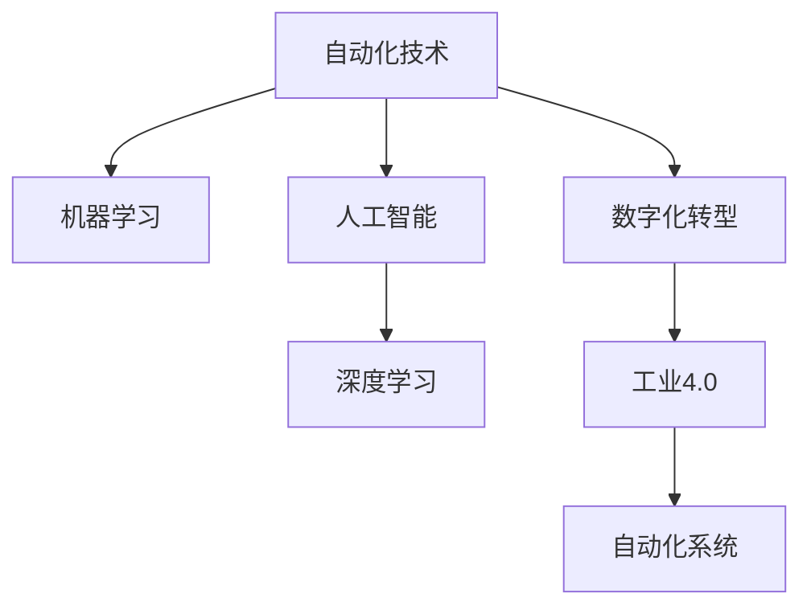

                 

# 自动化技术的未来发展方向

> 关键词：自动化,未来发展,技术趋势,机器学习,人工智能,数字化转型

## 1. 背景介绍

### 1.1 问题由来
随着第四次工业革命的加速推进，自动化技术正以前所未有的速度改变着各行各业的运作方式。从生产制造到服务流通，从科学研究到日常娱乐，自动化无处不在，深刻影响着人类社会的方方面面。

自动化技术的迅猛发展，离不开底层计算能力的提升和软件技术的演进。近年来，以深度学习为代表的机器学习技术迅猛发展，极大地推动了自动化技术的前进步伐，使得自动化系统能够从数据中自动学习，适应多样化的应用场景。然而，随着自动化系统的日益复杂，如何提升系统的智能化水平、增强其在多样性和不确定性条件下的鲁棒性，成为当前亟需解决的问题。

### 1.2 问题核心关键点
本文聚焦于未来自动化技术的发展方向，探讨如何通过前沿技术，提升自动化系统的智能化水平和适应能力，推动数字化转型进程。我们将从技术趋势、具体应用场景和未来展望三个方面，全面阐述自动化技术未来的发展方向。

## 2. 核心概念与联系

### 2.1 核心概念概述

为更好地理解自动化技术的未来发展方向，本节将介绍几个密切相关的核心概念：

- 自动化技术(Automation Technology)：通过计算机软件和硬件，实现对生产、服务、管理等环节的自动控制和优化。常见的自动化技术包括机器人自动化、生产自动化、智能监控等。

- 机器学习(Machine Learning)：一种基于数据的算法，使机器能够通过学习历史数据，自动发现并抽象出数据中的规律，从而进行预测、分类、决策等任务。

- 人工智能(Artificial Intelligence)：使机器具备类似于人类的智能能力，能够在复杂环境下进行推理、学习、决策等高级任务。

- 深度学习(Deep Learning)：机器学习的一个分支，通过构建多层神经网络，模仿人类大脑的结构，实现对数据的高效处理和分析。

- 数字化转型(Digital Transformation)：利用信息技术和自动化技术，改变企业业务流程，提升效率、创新产品和服务的过程。

- 自动化系统(Automation System)：集成软件和硬件资源，自动完成特定任务的系统，如智能工厂、无人驾驶、智能客服等。

- 工业4.0(Industry 4.0)：利用信息技术、自动化技术，实现工业生产的智能化和自动化，提升生产效率和质量。

这些核心概念之间的逻辑关系可以通过以下Mermaid流程图来展示：



这个流程图展示了几大核心概念及其之间的关系：

1. 自动化技术是其他技术的基础，为其他技术提供了实现手段。
2. 机器学习、人工智能和深度学习是自动化技术的核心技术，提供算法支持。
3. 数字化转型是自动化技术的发展方向，旨在通过技术改造提升企业竞争力。
4. 工业4.0是数字化转型的具体实现，代表未来工业发展的趋势。
5. 自动化系统是技术和应用的具体结合，是实现自动化和智能化目标的手段。

## 3. 核心算法原理 & 具体操作步骤
### 3.1 算法原理概述

自动化技术未来的发展方向，离不开前沿算法和技术的支撑。本节将详细介绍几个关键算法原理及其操作步骤。

**强化学习(Reinforcement Learning)**：
强化学习是一种通过试错优化策略的算法，在复杂多变的环境中，通过与环境的互动，学习最优的决策策略。强化学习的核心思想是让智能体通过执行一系列动作，最大化累积奖励，从而在未知环境中进行探索和优化。

**迁移学习(Transfer Learning)**：
迁移学习是一种基于知识迁移的机器学习技术，将一个任务学到的知识迁移到另一个相关任务中。在自动化系统中，迁移学习可以显著减少新任务的学习成本，提升系统的适应能力。

**联邦学习(Federated Learning)**：
联邦学习是一种分布式机器学习技术，多个客户端在不共享数据的情况下，协同训练模型。该技术在自动化系统中具有重要应用价值，特别是在数据隐私和安全要求较高的场景下，可以有效保护用户数据隐私。

**自监督学习(Self-Supervised Learning)**：
自监督学习是一种无需标注数据的机器学习技术，通过数据自身特性，学习数据的表示和特征。在自动化系统中，自监督学习可以广泛应用于数据预处理、特征提取等环节，提升系统的智能化水平。

### 3.2 算法步骤详解

**强化学习**：
1. **环境定义**：定义自动化系统所处的环境，包括状态空间、动作空间和奖励函数。
2. **模型选择**：选择适合的强化学习算法和模型结构，如Q-learning、SARSA、DQN等。
3. **训练过程**：通过试错迭代，调整模型参数，最大化累积奖励。
4. **评估优化**：在验证集上评估模型性能，根据评估结果进行参数优化和调整。
5. **应用部署**：将优化后的模型部署到自动化系统中，进行实际应用。

**迁移学习**：
1. **源任务训练**：在源任务上训练模型，学习任务特定的知识。
2. **知识迁移**：将源任务学到的知识迁移到目标任务中。
3. **目标任务微调**：在目标任务上对迁移后的模型进行微调，适应目标任务的具体需求。
4. **性能评估**：在测试集上评估模型性能，对比迁移前后的效果。
5. **应用部署**：将微调后的模型应用于自动化系统，提升系统适应性。

**联邦学习**：
1. **数据划分**：将数据划分为多个本地数据集，分布在不同客户端。
2. **模型初始化**：在本地数据集上训练模型，并计算模型参数。
3. **参数更新**：在本地模型参数的基础上，计算全局模型参数，进行参数更新。
4. **聚合优化**：通过聚合各客户端的更新信息，优化全局模型。
5. **分布式部署**：将优化后的全局模型部署到各客户端，进行分布式应用。

**自监督学习**：
1. **数据选择**：选择适合自监督学习任务的数据集，如掩码语言模型、图像自编码器等。
2. **模型训练**：在数据集上训练自监督模型，学习数据表示和特征。
3. **特征提取**：使用训练好的模型提取数据的高级特征，应用于自动化系统的各环节。
4. **性能评估**：在自动化系统上评估特征提取的效果，对比前后性能差异。
5. **应用部署**：将提取的特征应用于自动化系统的优化和决策中。

### 3.3 算法优缺点

**强化学习**：
- **优点**：
  - 能够在复杂多变的环境中进行学习和优化。
  - 可以处理不确定性条件下的决策问题。
  - 适用于需要持续改进和优化的自动化系统。
  
- **缺点**：
  - 学习过程慢，需要大量试错。
  - 需要明确的奖励函数和状态空间，对环境建模要求高。
  - 难以处理某些复杂环境中的状态空间。

**迁移学习**：
- **优点**：
  - 减少新任务的学习成本。
  - 提高模型在特定领域的适应能力。
  - 保护数据隐私，减少数据传输。
  
- **缺点**：
  - 需要源任务和目标任务之间的领域一致性。
  - 迁移效果依赖于源任务的代表性。
  - 目标任务的数据量和质量可能影响迁移效果。

**联邦学习**：
- **优点**：
  - 保护数据隐私，减少数据泄露风险。
  - 适合分布式环境下的模型训练。
  - 提高模型的鲁棒性和泛化能力。
  
- **缺点**：
  - 通信开销大，网络环境对训练效果有影响。
  - 客户端计算资源可能不均衡。
  - 参数更新复杂，需要高效的聚合算法。

**自监督学习**：
- **优点**：
  - 无需标注数据，可应用于大数据集。
  - 提高数据表示的准确性和泛化能力。
  - 适用于自动化系统的多个环节，如特征提取、异常检测等。
  
- **缺点**：
  - 对数据的选择和处理要求高，需要避免过拟合。
  - 可能存在数据的代表性问题，影响模型泛化能力。
  - 无法直接应用于某些特定任务，需要结合其他方法。

### 3.4 算法应用领域

**强化学习**：
- **机器人控制**：通过强化学习，训练机器人执行复杂的运动任务，如路径规划、避障等。
- **智能电网**：在电力系统中，通过强化学习优化电力调度和需求响应，提升系统稳定性。
- **自动驾驶**：在自动驾驶中，通过强化学习训练车辆的决策策略，提高驾驶安全性和舒适度。

**迁移学习**：
- **医疗诊断**：在医疗领域，通过迁移学习将已有的疾病诊断模型应用于新的疾病诊断任务，提升诊断效率。
- **金融风控**：在金融领域，通过迁移学习将已有的风险评估模型应用于新的金融产品评估，减少风险损失。
- **自然灾害预测**：在自然灾害预测中，通过迁移学习将已有的气象模型应用于新的地理位置，提高预测准确度。

**联邦学习**：
- **物联网**：在物联网中，通过联邦学习保护设备数据隐私，提升网络安全性。
- **医疗数据共享**：在医疗领域，通过联邦学习共享疾病数据，提升医学研究的效率和深度。
- **智能家居**：在智能家居中，通过联邦学习保护用户隐私，提升设备间的协同效果。

**自监督学习**：
- **图像处理**：在图像处理中，通过自监督学习提取图像特征，应用于图像分类、目标检测等任务。
- **语音识别**：在语音识别中，通过自监督学习提取语音特征，应用于语音识别、语音生成等任务。
- **自然语言处理**：在自然语言处理中，通过自监督学习提取文本特征，应用于文本分类、文本生成等任务。

这些核心算法和应用领域共同构成了未来自动化技术的发展蓝图，展示了自动化技术在各个领域的广泛应用前景。

## 4. 数学模型和公式 & 详细讲解

### 4.1 数学模型构建

**强化学习**：
定义环境状态空间为 $S$，动作空间为 $A$，奖励函数为 $r$，策略为 $\pi$，最优策略为 $\pi^*$。强化学习的目标是最小化累计奖励差距，即：

$$
\min_{\pi} \mathbb{E}_{s \sim S, a \sim \pi} \sum_{t=0}^{\infty} \gamma^t r(s_t, a_t)
$$

其中，$\gamma$ 为折扣因子，控制未来奖励的权重。

**迁移学习**：
定义源任务为 $T_s$，目标任务为 $T_t$，源任务训练的模型为 $M_s$，目标任务的微调模型为 $M_t$。迁移学习的目标是最大化目标任务上的预测精度，即：

$$
\min_{M_t} \mathbb{E}_{x \sim D_t} [L(f_{M_s}(x), f_{M_t}(x))]
$$

其中，$f_{M_s}$ 和 $f_{M_t}$ 分别为源任务和目标任务下的预测函数，$D_t$ 为目标任务的训练数据集。

**联邦学习**：
定义 $k$ 个客户端的数据集为 $D_i$，联邦学习的目标是最小化全局模型参数 $\theta$ 的损失函数，即：

$$
\min_{\theta} \sum_{i=1}^{k} L_i(\theta)
$$

其中，$L_i$ 为第 $i$ 个客户端的损失函数，$L_i(\theta) = \frac{1}{|D_i|} \sum_{x \in D_i} \ell(\theta, x)$。

**自监督学习**：
定义自监督任务为 $T$，自监督学习的目标是最小化自监督任务下的损失函数，即：

$$
\min_{\theta} \mathbb{E}_{x \sim D} L(\theta, x)
$$

其中，$L$ 为自监督任务的损失函数，$D$ 为自监督任务的数据集。

### 4.2 公式推导过程

**强化学习**：
强化学习的核心在于通过Q-learning算法更新策略参数。定义状态值函数 $Q(s, a)$，表示在状态 $s$ 下采取动作 $a$ 的累积奖励期望。Q-learning的更新规则如下：

$$
Q(s, a) \leftarrow Q(s, a) + \alpha(r + \gamma \max_{a'} Q(s', a') - Q(s, a))
$$

其中，$\alpha$ 为学习率，$s'$ 为下一状态。

**迁移学习**：
迁移学习中的知识迁移可以通过特征提取的方式实现。设 $f_{M_s}$ 和 $f_{M_t}$ 分别为源任务和目标任务的特征提取函数，迁移学习的目标是最大化目标任务上的预测精度。假设在目标任务上有一个监督损失函数 $L$，则迁移学习的目标函数为：

$$
\min_{\theta_t} \mathbb{E}_{x \sim D_t} [L(f_{M_s}(x), f_{M_t}(x))]
$$

**联邦学习**：
联邦学习中，模型参数 $\theta$ 的更新规则为：

$$
\theta \leftarrow \theta - \frac{\eta}{k} \sum_{i=1}^{k} \nabla L_i(\theta)
$$

其中，$\eta$ 为学习率，$k$ 为客户端数。

**自监督学习**：
自监督学习中的损失函数可以基于掩码语言模型、图像自编码器等设计。以掩码语言模型为例，定义模型 $M$，自监督任务的损失函数 $L$，自监督学习的目标函数为：

$$
\min_{\theta} \mathbb{E}_{x \sim D} L(M(x))
$$

其中，$x$ 为输入数据，$\theta$ 为模型参数。

### 4.3 案例分析与讲解

**强化学习案例**：
在机器人导航任务中，通过强化学习训练机器人执行路径规划任务。定义状态空间为机器人的位置和方向，动作空间为机器人的左转、右转、前进等操作。设计一个折扣奖励函数，当机器人到达目标位置时，奖励为1，否则为0。通过Q-learning算法迭代训练，最终训练出最优的路径规划策略。

**迁移学习案例**：
在医疗诊断任务中，将已有的疾病诊断模型应用于新的疾病诊断任务。选择源任务为已有的肺部疾病诊断，目标任务为新的心脏疾病诊断。在源任务上训练一个深度神经网络，提取疾病特征。然后将提取的特征用于目标任务，进行微调训练。通过迁移学习，提升了新的心脏疾病诊断模型的准确度。

**联邦学习案例**：
在智能电网中，通过联邦学习优化电力调度和需求响应。定义 $k$ 个客户端，每个客户端负责管理一个电网的子系统，包括风电场、水电站等。在每个客户端上训练局部模型，并将模型参数进行聚合，得到全局模型。通过联邦学习，优化了整个电网的电力调度和需求响应策略。

**自监督学习案例**：
在图像分类任务中，通过自监督学习提取图像特征。定义掩码语言模型，将输入图像部分像素进行掩码，模型需要根据未掩码的像素预测被掩码的像素。通过自监督学习训练模型，得到高维图像特征。将这些特征用于图像分类任务，取得了优异的分类效果。

## 5. 项目实践：代码实例和详细解释说明

### 5.1 开发环境搭建

在进行自动化技术实践前，我们需要准备好开发环境。以下是使用Python进行TensorFlow开发的环境配置流程：

1. 安装Anaconda：从官网下载并安装Anaconda，用于创建独立的Python环境。

2. 创建并激活虚拟环境：
```bash
conda create -n tf-env python=3.8 
conda activate tf-env
```

3. 安装TensorFlow：根据CUDA版本，从官网获取对应的安装命令。例如：
```bash
conda install tensorflow -c tf
```

4. 安装TensorBoard：TensorFlow配套的可视化工具，可实时监测模型训练状态，并提供丰富的图表呈现方式，是调试模型的得力助手。

5. 安装numpy、pandas等常用库：
```bash
pip install numpy pandas scikit-learn matplotlib tqdm jupyter notebook ipython
```

完成上述步骤后，即可在`tf-env`环境中开始自动化技术实践。

### 5.2 源代码详细实现

这里我们以强化学习中的DQN算法为例，给出TensorFlow的代码实现。

首先，定义Q网络模型：

```python
import tensorflow as tf
import tensorflow.keras as keras

class QNetwork(tf.keras.Model):
    def __init__(self, input_shape, num_actions):
        super(QNetwork, self).__init__()
        self.fc1 = tf.keras.layers.Dense(64, activation='relu')
        self.fc2 = tf.keras.layers.Dense(64, activation='relu')
        self.fc3 = tf.keras.layers.Dense(num_actions, activation='linear')
    
    def call(self, inputs):
        x = self.fc1(inputs)
        x = self.fc2(x)
        x = self.fc3(x)
        return x
```

然后，定义DQN算法：

```python
import numpy as np

class DQN:
    def __init__(self, env, input_shape, num_actions, learning_rate=0.01, gamma=0.9, epsilon=1.0, epsilon_min=0.01, epsilon_decay=0.995, target_update_interval=100):
        self.env = env
        self.input_shape = input_shape
        self.num_actions = num_actions
        self.learning_rate = learning_rate
        self.gamma = gamma
        self.epsilon = epsilon
        self.epsilon_min = epsilon_min
        self.epsilon_decay = epsilon_decay
        self.target_update_interval = target_update_interval
        self.q_network = QNetwork(self.input_shape, self.num_actions)
        self.target_q_network = QNetwork(self.input_shape, self.num_actions)
        self.optimizer = tf.keras.optimizers.Adam(self.learning_rate)
        self.loss_fn = tf.keras.losses.MeanSquaredError()
    
    def act(self, state):
        if np.random.uniform() < self.epsilon:
            return np.random.choice(self.num_actions)
        q_values = self.q_network(tf.convert_to_tensor([state], dtype=tf.float32))
        return np.argmax(q_values.numpy()[0])
    
    def train(self, state, action, reward, next_state, done):
        q_values = self.q_network(tf.convert_to_tensor([state], dtype=tf.float32))
        q_values_next = self.target_q_network(tf.convert_to_tensor([next_state], dtype=tf.float32))
        target = reward + (1 - done) * self.gamma * np.max(q_values_next.numpy()[0])
        q_values = q_values[0]
        self.optimizer.minimize(self.loss_fn, variables=self.q_network.trainable_variables, grad_values=[target - q_values[action]])
        if self.target_update_interval % 100 == 0:
            self.target_q_network.set_weights(self.q_network.get_weights())
    
    def update_epsilon(self):
        self.epsilon = max(self.epsilon_min, self.epsilon * self.epsilon_decay)
```

最后，启动训练流程：

```python
import gym

env = gym.make('CartPole-v0')
state_shape = (env.observation_space.shape[0],)
num_actions = env.action_space.n

dqn = DQN(env, state_shape, num_actions)

steps = 0
scores = []
while steps < 1000:
    state = env.reset()
    done = False
    while not done:
        action = dqn.act(state)
        next_state, reward, done, _ = env.step(action)
        state = next_state
        dqn.train(state, action, reward, next_state, done)
        steps += 1
    scores.append(reward)
    dqn.update_epsilon()
    print(f"Episode: {steps}, Score: {reward}")
```

以上就是使用TensorFlow实现DQN算法的完整代码实现。可以看到，得益于TensorFlow的强大封装，我们可以用相对简洁的代码完成强化学习模型的构建和训练。

### 5.3 代码解读与分析

让我们再详细解读一下关键代码的实现细节：

**QNetwork类**：
- `__init__`方法：定义了模型的输入形状、输出动作数和网络结构。
- `call`方法：定义了前向传播的过程，将输入数据通过多个全连接层得到最终输出。

**DQN类**：
- `__init__`方法：初始化强化学习环境、模型参数、优化器和损失函数。
- `act`方法：在每个状态上选择动作，采用epsilon-greedy策略，平衡探索和利用。
- `train`方法：根据Q-learning算法更新模型参数。
- `update_epsilon`方法：根据训练进程动态调整探索概率。

**训练流程**：
- 创建一个环境，定义状态和动作空间。
- 实例化DQN类，设置初始参数。
- 循环迭代，每个 episode 中，从环境开始，根据状态选择动作，执行动作，接收奖励，更新状态。
- 更新模型参数，根据动作、奖励和状态计算目标值，优化Q网络。
- 周期性更新目标网络，以稳定优化过程。
- 记录训练过程，包括奖励和探索概率的变化。

可以看到，TensorFlow配合TensorFlow.keras等高阶API，使得强化学习模型的构建和训练变得简洁高效。开发者可以将更多精力放在模型优化和应用部署上，而不必过多关注底层的实现细节。

当然，工业级的系统实现还需考虑更多因素，如模型的保存和部署、超参数的自动搜索、更灵活的任务适配层等。但核心的微调范式基本与此类似。

## 6. 实际应用场景

### 6.1 智能制造

在智能制造领域，自动化技术的应用主要集中在工厂的自动化生产线上。通过智能制造，可以实现生产线上的智能监控、故障预测、异常检测等，提高生产效率和质量。

具体而言，可以通过强化学习训练机器人完成自动化装配、自动导航等任务。使用迁移学习将已有的制造知识应用于新设备，提升设备自适应能力。利用联邦学习实现不同设备间的协同优化，提高生产线整体效率。采用自监督学习提取生产数据中的特征，应用于预测性维护等任务。

### 6.2 智慧医疗

在智慧医疗领域，自动化技术的应用主要集中在医疗影像分析、疾病诊断和治疗方案生成等。

通过强化学习训练医疗影像分析系统，实现自动化的影像诊断和识别。使用迁移学习将已有的疾病诊断模型应用于新的疾病诊断任务，提升诊断效率。利用联邦学习共享医疗数据，提高医学研究的效率和深度。采用自监督学习提取医疗数据中的特征，应用于疾病预测和个性化治疗方案生成。

### 6.3 智能交通

在智能交通领域，自动化技术的应用主要集中在交通流量监控、自动驾驶和智能调度等。

通过强化学习训练自动驾驶车辆，实现自动驾驶任务。使用迁移学习将已有的交通预测模型应用于新的交通场景，提升预测准确度。利用联邦学习实现不同交通系统间的协同优化，提高交通流量管理效率。采用自监督学习提取交通数据中的特征，应用于交通流量预测和优化。

### 6.4 未来应用展望

随着自动化技术的不断发展，未来自动化技术将在更多领域得到应用，为传统行业带来变革性影响。

在智慧农业领域，通过自动化技术，可以实现智能农业机械的操作、农业生产过程的监控和优化等，提高农业生产效率和质量。

在智慧物流领域，通过自动化技术，可以实现智能仓储、智能配送、智能运输等，提高物流效率，降低物流成本。

在智慧城市治理中，通过自动化技术，可以实现智能安防、智能交通、智能环保等，提升城市管理的自动化和智能化水平，构建更安全、高效的未来城市。

此外，在智慧零售、智能家居、智能办公等众多领域，自动化技术也将不断涌现，为各行各业带来变革性影响。相信随着技术的日益成熟，自动化技术必将在更广阔的应用领域大放异彩。

## 7. 工具和资源推荐
### 7.1 学习资源推荐

为了帮助开发者系统掌握自动化技术的理论基础和实践技巧，这里推荐一些优质的学习资源：

1. 《深度学习》系列书籍：由深度学习领域的知名专家撰写，系统介绍了深度学习的基本概念、算法和应用。

2. 《强化学习：基础与算法》书籍：详细介绍了强化学习的基本原理和算法，适合初学者入门。

3. 《TensorFlow官方文档》：TensorFlow的官方文档，提供了详细的API说明和样例代码，是学习TensorFlow的必备资料。

4. 《机器学习实战》书籍：提供了大量的实战案例，适合编程实践和项目开发。

5. Coursera和edX等在线课程：提供高质量的课程和作业，系统讲解自动化技术的理论基础和实践技巧。

通过对这些资源的学习实践，相信你一定能够快速掌握自动化技术的精髓，并用于解决实际的自动化问题。
###  7.2 开发工具推荐

高效的开发离不开优秀的工具支持。以下是几款用于自动化技术开发的常用工具：

1. TensorFlow：基于Python的开源深度学习框架，灵活动态的计算图，适合快速迭代研究。

2. PyTorch：基于Python的开源深度学习框架，易于使用，支持动态图和静态图。

3. Keras：基于TensorFlow和Theano等框架的高层API，提供简单易用的API接口。

4. OpenAI Gym：提供标准化的环境接口，方便强化学习模型的训练和评估。

5. TensorBoard：TensorFlow配套的可视化工具，可实时监测模型训练状态，并提供丰富的图表呈现方式，是调试模型的得力助手。

6. Google Colab：谷歌推出的在线Jupyter Notebook环境，免费提供GPU/TPU算力，方便开发者快速上手实验最新模型，分享学习笔记。

合理利用这些工具，可以显著提升自动化技术的开发效率，加快创新迭代的步伐。

### 7.3 相关论文推荐

自动化技术的发展离不开学界的持续研究。以下是几篇奠基性的相关论文，推荐阅读：

1. AlphaGo Zero：提出基于强化学习的自我对弈算法，通过自我对弈训练，大幅提升围棋的AI水平。

2. GAN：提出生成对抗网络，通过对抗训练生成高质量的图像、音频等。

3. Transformer模型：提出自注意力机制，用于自然语言处理任务，显著提升模型的性能。

4. YOLO：提出基于YOLO算法的目标检测方法，实现实时目标检测和分类。

5. GPT-3：提出基于Transformer的预训练语言模型，在自然语言处理任务上取得最优性能。

这些论文代表了大规模自动化技术的发展脉络。通过学习这些前沿成果，可以帮助研究者把握学科前进方向，激发更多的创新灵感。

## 8. 总结：未来发展趋势与挑战

### 8.1 总结

本文对未来自动化技术的发展方向进行了全面系统的介绍。首先阐述了自动化技术在工业4.0和数字化转型中的重要地位，明确了未来自动化技术的发展方向。其次，从技术趋势、具体应用场景和未来展望三个方面，详细讲解了强化学习、迁移学习、联邦学习、自监督学习等前沿技术的原理和操作步骤。最后，本文还给出了自动化的实际应用场景，展示了自动化技术在各个领域的应用前景。

通过本文的系统梳理，可以看到，自动化技术的发展前景广阔，未来将在更多领域得到应用，推动各行各业的数字化转型进程。基于深度学习、强化学习、联邦学习等前沿技术的支撑，自动化系统将具备更高的智能化水平和适应能力，实现更加高效、安全和可靠的系统应用。

### 8.2 未来发展趋势

展望未来，自动化技术将呈现以下几个发展趋势：

1. 技术融合加速。自动化技术将与人工智能、物联网、区块链等技术深度融合，推动更多领域实现智能化和自动化。

2. 多模态融合深化。自动化系统将更加注重多模态数据的融合，通过视觉、听觉、触觉等多模态信息的协同建模，提升系统的感知和决策能力。

3. 数据驱动决策。自动化系统将更加依赖数据驱动的决策，通过大数据分析和智能算法，优化生产流程、提升服务质量、改善用户体验。

4. 人机协同增强。自动化系统将更加注重人机协同，通过增强现实、虚拟现实等技术，提升人机交互的体验和效率。

5. 安全性和隐私保护。自动化系统将更加注重数据安全和隐私保护，通过区块链、联邦学习等技术，保护用户数据隐私和系统安全。

6. 实时性和可扩展性。自动化系统将更加注重实时性和可扩展性，通过分布式计算和边缘计算技术，提高系统的响应速度和扩展能力。

以上趋势凸显了未来自动化技术的发展前景。这些方向的探索发展，必将进一步提升自动化系统的智能化水平和适应能力，为各行各业带来变革性影响。

### 8.3 面临的挑战

尽管自动化技术已经取得了显著成就，但在迈向更加智能化、普适化应用的过程中，它仍面临诸多挑战：

1. 数据质量瓶颈。自动化系统的决策依赖于数据驱动，数据的准确性和全面性将直接影响系统的性能。

2. 技术复杂度高。自动化系统的构建涉及多个技术和领域，开发和维护难度大，需要多学科协同合作。

3. 技术标准化不足。当前自动化技术缺乏统一的行业标准，系统间的互联互通和互操作性差，影响系统应用和推广。

4. 安全性和隐私保护问题。自动化系统面临的安全威胁和隐私泄露风险增加，需要采取更多技术手段保护用户数据和系统安全。

5. 人机协同挑战。自动化系统需要更好地与人类协同工作，提升人机交互的体验和效率，但人机协同的复杂性也带来了新的挑战。

6. 长期可维护性问题。自动化系统的复杂性和多样性，增加了系统维护的难度，需要更多的资源和技术支持。

这些挑战需要产业界和学术界共同应对，推动技术标准化和规范化，提升系统的安全性、隐私保护和可维护性，才能使自动化技术更好地服务于各行各业。

### 8.4 研究展望

面对自动化技术所面临的挑战，未来的研究需要在以下几个方面寻求新的突破：

1. 提升数据质量和管理。通过数据清洗、标注、增强等技术手段，提升数据的质量和可靠性，增强自动化系统的决策能力。

2. 推进技术标准化。建立统一的行业标准和规范，推动自动化技术的互联互通和互操作性，促进技术的应用和推广。

3. 加强安全性和隐私保护。通过区块链、联邦学习等技术手段，保护用户数据隐私和系统安全，提升自动化系统的可靠性。

4. 提升人机协同能力。通过增强现实、虚拟现实等技术手段，提升人机交互的体验和效率，推动人机协同发展。

5. 提高系统的可维护性和可扩展性。通过模块化设计和微服务架构，提升自动化系统的可维护性和可扩展性，降低维护和升级成本。

这些研究方向的探索，必将引领自动化技术迈向更高的台阶，为各行各业带来变革性影响。面向未来，自动化技术还需要与其他人工智能技术进行更深入的融合，如知识表示、因果推理、强化学习等，多路径协同发力，共同推动自动化技术的进步。只有勇于创新、敢于突破，才能不断拓展自动化技术的边界，让自动化技术更好地服务于人类社会。

## 9. 附录：常见问题与解答

**Q1：自动化技术在实际应用中面临的主要挑战有哪些？**

A: 自动化技术在实际应用中面临的主要挑战包括数据质量瓶颈、技术复杂度高、技术标准化不足、安全性和隐私保护问题、人机协同挑战以及长期可维护性问题。这些挑战需要通过数据清洗、技术标准化、安全技术、增强现实、微服务等技术手段进行应对，才能更好地推动自动化技术的落地应用。

**Q2：自动化技术未来的发展趋势是什么？**

A: 自动化技术未来的发展趋势包括技术融合加速、多模态融合深化、数据驱动决策、人机协同增强、安全性和隐私保护以及实时性和可扩展性。这些趋势凸显了未来自动化技术的发展前景，推动自动化技术在更多领域实现智能化和自动化。

**Q3：如何选择适合的自动化技术？**

A: 选择适合的自动化技术需要考虑多个因素，包括应用场景、技术需求、数据特征、系统复杂度等。一般而言，需要根据具体需求选择合适的技术方案，并结合技术成熟度和可行性进行综合评估。同时，可以参考行业标准和最佳实践，选择成熟稳定的技术方案。

**Q4：如何提升自动化系统的性能？**

A: 提升自动化系统的性能可以通过多个途径实现，包括优化算法、提升数据质量、改进硬件设备、优化软件架构等。具体而言，可以采用强化学习、迁移学习、联邦学习、自监督学习等前沿技术，提升系统的智能化水平和适应能力。同时，可以通过数据清洗、增强等手段提升数据质量，提升系统的决策能力。

**Q5：自动化技术在实际应用中如何保护用户隐私？**

A: 自动化技术在实际应用中保护用户隐私可以通过多种技术手段实现，包括数据匿名化、联邦学习、区块链等。具体而言，可以通过加密技术保护用户数据，防止数据泄露和篡改。同时，采用联邦学习等分布式计算技术，实现数据本地化处理，保护用户隐私。

这些常见问题的解答，可以帮助开发者更好地理解自动化技术的应用和挑战，推动技术创新和应用推广。

