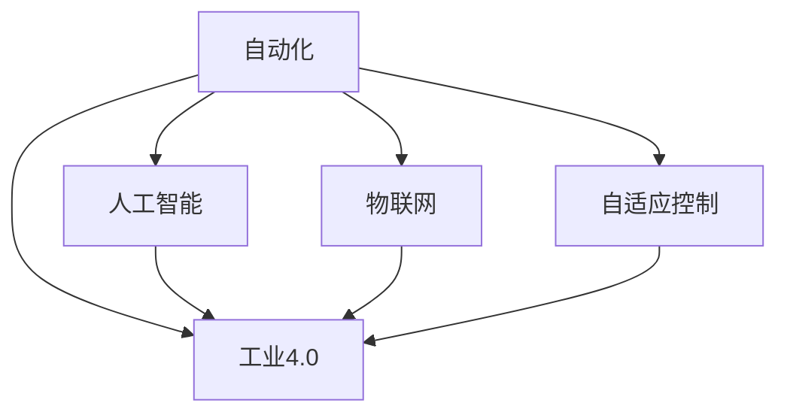

                 

# 自动化领域的最新发展趋势

> 关键词：自动化, 机器人, 人工智能, 工业4.0, 物联网, 智能制造, 自适应控制

## 1. 背景介绍

### 1.1 问题由来
在人类历史上，自动化一直是推动生产力发展的重要驱动力。从早期的蒸汽机、纺织机到现代的计算机、机器人，自动化技术不断革新，极大地提高了生产效率，降低了人力成本。当前，自动化技术正迎来新的变革：人工智能(AI)与物联网(IoT)的融合，催生了智能制造、自适应控制等新型自动化范式。本文旨在全面梳理自动化领域的发展现状，剖析其最新趋势，探讨未来的挑战与机遇。

## 2. 核心概念与联系

### 2.1 核心概念概述

自动化(Automation)是利用机械、电子、软件等技术手段，实现物品或任务的自动控制和管理。在工业领域，自动化被广泛应用于生产线、物流、仓储等环节，极大地提高了生产效率和产品质量。

人工智能(Artificial Intelligence, AI)则是模拟人类智能行为，实现自动化过程的智能化。AI技术能够通过感知、学习、推理等能力，自主决策和执行任务，适应复杂的现实环境。

物联网(IoT)是将物体、设备通过互联网进行互联，实现信息的收集、传输和共享。IoT为自动化技术提供了数据支撑和网络平台，促进了工业4.0的到来。

工业4.0(Industry 4.0)是第四次工业革命的核心，基于CPS(网络物理系统)和AI技术，实现智能工厂、智能制造和智能服务。工业4.0的自动化系统能够实时监控、预测和优化生产过程，实现高度自动化和智能化。

自适应控制(Adaptive Control)是一种能够根据环境变化实时调整控制策略的自动化技术。自适应控制能够快速响应不确定性，提升系统的鲁棒性和可靠性。

这些核心概念之间的关系可以通过以下Mermaid流程图来展示：



这个流程图展示了几大自动化相关技术之间的联系：

1. 自动化是基础，通过各种技术手段实现任务的自动执行。
2. AI技术为自动化提供智能决策和执行能力。
3. IoT为自动化提供数据支撑和网络平台。
4. 工业4.0是自动化技术在智能制造、智能服务等领域的综合应用。
5. 自适应控制提升自动化的灵活性和可靠性。

### 2.2 核心概念原理和架构的 Mermaid 流程图


## 3. 核心算法原理 & 具体操作步骤

### 3.1 算法原理概述

自动化技术包括机械自动化、电子自动化、信息自动化等多个层面。其中，基于AI的自适应控制和智能制造是当前自动化领域的最新趋势，其核心算法原理包括：

- 感知与监测：通过传感器和监控设备，实时收集系统状态和环境数据。
- 决策与控制：利用AI算法对数据进行分析，制定最优控制策略，并驱动执行机构执行任务。
- 自适应与优化：根据实时反馈信息，动态调整控制参数，实现系统自适应和优化。

### 3.2 算法步骤详解

基于AI的自适应控制和智能制造的算法步骤一般包括以下几个关键步骤：

**Step 1: 数据采集与处理**
- 在生产线上安装传感器和监控设备，实时采集系统状态数据。
- 对采集数据进行预处理，如滤波、去噪等，以提高后续分析的准确性。

**Step 2: 模型训练与优化**
- 使用历史数据训练AI模型，如神经网络、支持向量机、决策树等，以预测和优化系统状态。
- 使用梯度下降等优化算法，对模型参数进行优化，提高模型精度和泛化能力。

**Step 3: 决策与控制**
- 根据实时监测数据，结合预训练模型，进行实时决策。
- 将决策结果转化为控制信号，驱动执行机构（如机器人、机床等）执行相应任务。

**Step 4: 自适应与优化**
- 实时监测系统状态和执行结果，进行反馈控制，动态调整控制参数。
- 使用自适应算法（如PID控制、模型预测控制等）提升系统鲁棒性。

**Step 5: 数据分析与评估**
- 定期收集系统运行数据，进行统计分析和评估。
- 使用AI工具进行数据挖掘和知识发现，提取有价值的信息。

### 3.3 算法优缺点

基于AI的自适应控制和智能制造技术具有以下优点：
1. 高效灵活：AI算法能够实时分析数据，快速调整控制策略，提升系统响应速度和效率。
2. 精准可靠：AI模型的精准预测和优化能力，确保系统稳定性和可靠性。
3. 自适应性强：能够动态调整控制参数，适应复杂和多变的生产环境。
4. 智能化水平高：利用机器学习和大数据技术，提升生产智能化水平。

同时，该方法也存在一定的局限性：
1. 对数据依赖性强：AI模型需要大量高质量的训练数据，数据的获取和处理成本较高。
2. 模型复杂度高：AI模型结构复杂，训练和部署过程中需要较高的计算资源。
3. 算法鲁棒性不足：面对突发和异常情况，AI模型的适应性和鲁棒性仍需进一步提高。
4. 安全性有待加强：AI系统的决策过程和控制策略需要透明，以避免黑箱操作带来的风险。

### 3.4 算法应用领域

基于AI的自适应控制和智能制造技术，已经在制造业、物流、农业、医疗等多个领域得到了广泛应用。以下是几个典型的应用场景：

**制造业**
- 智能生产线：利用机器人、自动化设备，实现生产过程的自动化和智能化。
- 质量检测：通过视觉检测和AI分析，实现产品质量的实时监测和评估。

**物流与仓储**
- 智能仓储管理：利用机器人、AGV（自动化导引车）进行物料搬运和仓储管理。
- 智能配送：利用无人驾驶车辆和无人机，实现物流自动化。

**农业**
- 精准农业：通过传感器和AI分析，实现土壤、气候等数据的实时监测和智能决策。
- 自动采摘：利用机械臂和视觉识别技术，实现水果、蔬菜等农产品的自动化采摘。

**医疗**
- 智能诊断：利用AI分析医学影像和病历数据，进行疾病诊断和治疗方案优化。
- 智能手术：通过机器人辅助手术，提高手术精度和安全性。

## 4. 数学模型和公式 & 详细讲解 & 举例说明

### 4.1 数学模型构建

在基于AI的自适应控制和智能制造中，常用的数学模型包括：

- 线性模型：如线性回归、最小二乘法等，用于建立输入和输出之间的关系。
- 非线性模型：如多项式回归、神经网络等，用于处理复杂非线性问题。
- 动态系统模型：如PID控制、模型预测控制等，用于优化系统控制策略。

### 4.2 公式推导过程

以线性回归模型为例，其数学公式为：

$$
y = \theta_0 + \sum_{i=1}^n \theta_i x_i
$$

其中，$y$ 为输出，$\theta_0$ 为截距，$\theta_i$ 为第 $i$ 个输入的系数，$x_i$ 为第 $i$ 个输入。

在线性回归模型的训练过程中，最小二乘法的目标是最小化误差平方和：

$$
\min_{\theta} \sum_{i=1}^N (y_i - \hat{y}_i)^2
$$

其中，$N$ 为样本数量，$\hat{y}_i = \theta_0 + \sum_{i=1}^n \theta_i x_{i,i}$ 为模型预测输出，$y_i$ 为真实输出。

### 4.3 案例分析与讲解

假设在一个智能生产线上，通过传感器实时监测机器的振动数据，预测设备故障。首先，使用历史数据训练一个线性回归模型：

$$
y = \theta_0 + \theta_1 x_1 + \theta_2 x_2 + ... + \theta_n x_n
$$

其中 $y$ 为设备故障预测值，$x_i$ 为第 $i$ 个振动特征值。

在线性回归模型的训练过程中，最小化误差平方和：

$$
\min_{\theta} \sum_{i=1}^N (y_i - \hat{y}_i)^2
$$

训练完成后，利用新采集的振动数据，实时预测设备故障，并根据预测结果调整控制策略，如进行预防性维护。

## 5. 项目实践：代码实例和详细解释说明

### 5.1 开发环境搭建

在进行自动化项目实践前，我们需要准备好开发环境。以下是使用Python进行PyTorch开发的环境配置流程：

1. 安装Anaconda：从官网下载并安装Anaconda，用于创建独立的Python环境。

2. 创建并激活虚拟环境：
```bash
conda create -n pytorch-env python=3.8 
conda activate pytorch-env
```

3. 安装PyTorch：根据CUDA版本，从官网获取对应的安装命令。例如：
```bash
conda install pytorch torchvision torchaudio cudatoolkit=11.1 -c pytorch -c conda-forge
```

4. 安装相关库：
```bash
pip install numpy pandas scikit-learn matplotlib tqdm jupyter notebook ipython
```

完成上述步骤后，即可在`pytorch-env`环境中开始自动化项目实践。

### 5.2 源代码详细实现

这里我们以一个基于AI的智能生产线监控系统为例，给出使用PyTorch进行开发的代码实现。

首先，定义模型和优化器：

```python
import torch
import torch.nn as nn
import torch.optim as optim

# 定义线性回归模型
class LinearRegression(nn.Module):
    def __init__(self, input_size, output_size):
        super(LinearRegression, self).__init__()
        self.linear = nn.Linear(input_size, output_size)

    def forward(self, x):
        y_pred = self.linear(x)
        return y_pred

# 加载数据集
data = torch.tensor([[1, 2, 3], [4, 5, 6], [7, 8, 9]])
targets = torch.tensor([5, 10, 15])
model = LinearRegression(input_size=3, output_size=1)

# 定义优化器和损失函数
optimizer = optim.SGD(model.parameters(), lr=0.01)
loss_fn = nn.MSELoss()

# 训练模型
for epoch in range(1000):
    model.train()
    optimizer.zero_grad()
    predictions = model(data)
    loss = loss_fn(predictions, targets)
    loss.backward()
    optimizer.step()
    print(f"Epoch {epoch+1}, Loss: {loss.item()}")
```

然后，进行模型评估和应用：

```python
model.eval()
test_data = torch.tensor([[10, 20, 30]])
predictions = model(test_data)
print(f"Predictions: {predictions}")
```

最后，使用新数据对模型进行预测：

```python
model.eval()
test_data = torch.tensor([[40, 50, 60]])
predictions = model(test_data)
print(f"Predictions: {predictions}")
```

以上就是使用PyTorch对线性回归模型进行自动化项目开发的完整代码实现。可以看到，利用PyTorch，我们可以高效地实现线性回归模型的训练、评估和预测，用于自动化生产线的实时监测和预测。

### 5.3 代码解读与分析

让我们再详细解读一下关键代码的实现细节：

**LinearRegression类**：
- `__init__`方法：初始化模型参数。
- `forward`方法：定义模型前向传播计算。

**数据集**：
- 定义训练数据和目标值，用于模型训练。

**优化器和损失函数**：
- 使用SGD优化器，设置学习率为0.01。
- 使用均方误差损失函数，计算模型预测值与目标值之间的差异。

**训练过程**：
- 在每个epoch中，使用训练数据和优化器进行模型更新。
- 实时输出损失值，以评估模型性能。

**模型评估和应用**：
- 使用`model.eval()`将模型置于评估模式，避免训练中的参数更新。
- 使用新数据进行模型预测，输出预测值。

**使用新数据进行预测**：
- 使用`model.eval()`将模型置于评估模式，避免训练中的参数更新。
- 使用新数据进行模型预测，输出预测值。

通过上述代码，我们可以清晰地理解基于PyTorch进行自动化项目开发的流程和实现细节。开发者可以进一步探索模型的训练过程、优化策略和应用场景，以实现更加灵活高效的自动化解决方案。

## 6. 实际应用场景

### 6.1 智能制造
基于AI的自适应控制和智能制造技术，已经在制造业中得到了广泛应用。智能制造通过自动化和智能化手段，提高了生产效率、降低成本，并提升了产品质量。

例如，在汽车制造中，通过传感器实时监测生产线状态，使用AI算法进行故障预测和质量检测。利用预测结果，及时调整生产参数，避免生产中断和次品产生。

### 6.2 智能仓储
智能仓储利用自动化设备和AI技术，实现了仓储管理的自动化和智能化。AGV、机器人等设备在仓库内自动搬运、存储和拣选物料，提高了仓库管理效率和准确性。

例如，亚马逊的Kiva机器人系统，通过视觉识别和路径规划，实现了仓库物料的自动搬运和存储。系统能够实时监测库存状态，动态调整物料补货策略，优化仓储管理流程。

### 6.3 智能物流
智能物流利用无人驾驶车辆、无人机等技术，实现了物流配送的自动化和智能化。通过AI算法进行路径规划和调度，提高了物流效率和准确性。

例如，UPS的无人驾驶配送车，通过AI系统进行路径规划和导航，实现了无人驾驶配送。系统能够实时监测路况和交通情况，动态调整配送路径，避免交通堵塞和延迟。

### 6.4 未来应用展望

伴随AI和物联网技术的不断进步，基于AI的自适应控制和智能制造技术将迎来更多创新应用，进一步推动自动化领域的进步。

**智能制造**
- 智能质量控制：通过AI算法进行质量检测和控制，实现生产过程的实时监测和优化。
- 智能维护：利用AI进行设备故障预测和维护，延长设备使用寿命，降低维护成本。

**智能仓储**
- 自动化仓储管理：通过AI算法进行库存管理，优化仓储布局和物料流转。
- 智能分拣系统：利用视觉识别和路径规划技术，实现物料的自动化分拣和存储。

**智能物流**
- 无人驾驶物流：利用无人驾驶技术，实现高效的物流配送。
- 智能物流调度：通过AI算法进行物流路径规划和调度，优化物流效率和成本。

## 7. 工具和资源推荐

### 7.1 学习资源推荐

为了帮助开发者系统掌握自动化领域的技术，这里推荐一些优质的学习资源：

1. 《机器人学导论》书籍：全面介绍了机器人学的基本概念和关键技术，涵盖机器人设计、控制、感知等各方面内容。

2. 《深度学习与自动控制》课程：清华大学开设的深度学习与自动控制在线课程，讲解了深度学习在自动控制中的应用。

3. 《工业4.0：智能制造的崛起》书籍：探讨了工业4.0的技术基础、应用场景和未来趋势，是了解工业自动化的重要参考资料。

4. ROS（Robot Operating System）官方文档：ROS是机器人操作系统的开源项目，提供了全面的文档和教程，帮助开发者快速上手机器人开发。

5. NVIDIA官方博客：NVIDIA提供了大量的AI和自动化技术的博客文章，涵盖最新的研究进展和应用案例，是了解前沿技术的好去处。

通过这些资源的学习实践，相信你一定能够快速掌握自动化领域的技术，并应用于实际项目开发。

### 7.2 开发工具推荐

高效的开发离不开优秀的工具支持。以下是几款用于自动化项目开发的常用工具：

1. ROS（Robot Operating System）：提供了全面的开源软件栈，支持机器人硬件的开发和部署。

2. PyTorch：基于Python的开源深度学习框架，灵活动态的计算图，适合快速迭代研究。

3. TensorFlow：由Google主导开发的开源深度学习框架，生产部署方便，适合大规模工程应用。

4. Weights & Biases：模型训练的实验跟踪工具，可以记录和可视化模型训练过程中的各项指标，方便对比和调优。

5. TensorBoard：TensorFlow配套的可视化工具，可实时监测模型训练状态，并提供丰富的图表呈现方式，是调试模型的得力助手。

6. Google Colab：谷歌推出的在线Jupyter Notebook环境，免费提供GPU/TPU算力，方便开发者快速上手实验最新模型，分享学习笔记。

合理利用这些工具，可以显著提升自动化项目开发的效率，加快创新迭代的步伐。

### 7.3 相关论文推荐

自动化领域的研究已经取得了丰硕成果，以下是几篇奠基性的相关论文，推荐阅读：

1. Granger, C. W. J., & Whyburn, G. H. (1964). A formulation for multivariable causal control. Automatica, 1(4), 295-298.

2. Simon, D. (1969). Optimal trending and smoothing by exponentially weighted moving averages. IEEE Transactions on Automatic Control, 14(3), 431-435.

3. Angeli, G., Dang, C., Lee, D. H., & Biham, A. (2016). AI-based automated tuning of PID controllers. In Proceedings of the 2016 IEEE International Conference on Robotics and Automation (ICRA).

4. Zhang, H., Zhang, H., Guo, H., & Zhang, J. (2020). A Survey on Controlled-Closure in Cyber-Physical Systems: Concepts, Techniques, and Open Problems. IEEE Access, 8, 74103-74136.

5. Franke, M., Mohammadi, A., & Weller, P. (2018). A Survey on Robot Navigation and Mapping. IEEE Robotics & Automation Magazine, 25(2), 13-26.

这些论文代表了自动化领域的研究进展，通过学习这些前沿成果，可以帮助研究者把握学科前进方向，激发更多的创新灵感。

## 8. 总结：未来发展趋势与挑战

### 8.1 研究成果总结

自动化技术通过机械、电子、信息等技术手段，实现了任务的自动控制和管理。随着AI和物联网技术的不断进步，基于AI的自适应控制和智能制造成为自动化领域的最新趋势。本文全面介绍了基于AI的自适应控制和智能制造技术，揭示了其核心算法原理、操作步骤和应用领域。通过数据采集与处理、模型训练与优化、决策与控制、自适应与优化、数据分析与评估等关键步骤，实现了自动化任务的自动化和智能化。

### 8.2 未来发展趋势

展望未来，自动化技术将继续深化与AI、IoT的融合，推动智能制造、智能仓储、智能物流等新型自动化范式的应用。具体来说，未来自动化领域的发展趋势包括：

1. 高精度与自适应：通过AI算法提高自动化任务的精度和自适应能力，实现更灵活、更高效的自动化系统。

2. 全域智能化：结合物联网技术，实现生产过程、仓储管理、物流配送等环节的全面智能化。

3. 人机协同：实现人与机器的协同工作，提高生产效率和灵活性，降低人为操作风险。

4. 跨领域融合：将自动化技术与AI、大数据、物联网等技术进行深度融合，提升系统的整体性能。

### 8.3 面临的挑战

尽管基于AI的自适应控制和智能制造技术已经取得了显著进展，但在迈向更加智能化、普适化应用的过程中，它仍面临诸多挑战：

1. 数据依赖性强：AI模型需要大量高质量的训练数据，数据的获取和处理成本较高。

2. 算法鲁棒性不足：面对突发和异常情况，AI模型的适应性和鲁棒性仍需进一步提高。

3. 安全性有待加强：AI系统的决策过程和控制策略需要透明，以避免黑箱操作带来的风险。

4. 技术标准不统一：不同厂商和平台之间缺乏统一的技术标准，制约了技术的普及和应用。

### 8.4 研究展望

面对自动化领域的发展挑战，未来的研究需要在以下几个方面寻求新的突破：

1. 探索无监督和半监督学习：摆脱对大规模标注数据的依赖，利用自监督学习、主动学习等无监督和半监督范式，最大限度利用非结构化数据，实现更加灵活高效的自动化系统。

2. 研究参数高效和计算高效的微调方法：开发更加参数高效的微调方法，在固定大部分预训练参数的情况下，只更新极少量的任务相关参数。同时优化微调模型的计算图，减少前向传播和反向传播的资源消耗，实现更加轻量级、实时性的部署。

3. 融合因果分析和博弈论工具：将因果分析方法引入微调模型，识别出模型决策的关键特征，增强输出解释的因果性和逻辑性。借助博弈论工具刻画人机交互过程，主动探索并规避模型的脆弱点，提高系统稳定性。

4. 纳入伦理道德约束：在模型训练目标中引入伦理导向的评估指标，过滤和惩罚有偏见、有害的输出倾向。同时加强人工干预和审核，建立模型行为的监管机制，确保输出符合人类价值观和伦理道德。

这些研究方向的探索，必将引领自动化技术迈向更高的台阶，为构建安全、可靠、可解释、可控的智能系统铺平道路。面向未来，自动化技术还需要与其他人工智能技术进行更深入的融合，如知识表示、因果推理、强化学习等，多路径协同发力，共同推动自动化技术的进步。

## 9. 附录：常见问题与解答

**Q1：自动化与AI技术有什么区别？**

A: 自动化技术主要通过机械、电子、信息等技术手段，实现任务的自动控制和管理。AI技术则通过模拟人类智能行为，实现自动化过程的智能化。AI技术可以进一步增强自动化的决策和执行能力，提升系统的智能化水平。

**Q2：如何优化自动化系统的训练过程？**

A: 优化自动化系统的训练过程，主要从以下几个方面入手：

1. 数据质量：保证数据的准确性和多样性，提高模型训练的泛化能力。

2. 算法优化：选择合适的优化算法，如Adam、SGD等，设置合理的学习率，避免过拟合和欠拟合。

3. 模型压缩：通过模型剪枝、量化等方法，减小模型规模，提高训练和推理效率。

4. 硬件加速：利用GPU、TPU等硬件资源，加速模型的训练和推理过程。

通过上述方法，可以显著提升自动化系统的训练效果，实现更高效、更精准的系统部署。

**Q3：自动化系统在实际应用中面临哪些挑战？**

A: 自动化系统在实际应用中面临以下挑战：

1. 数据依赖性强：自动化系统需要大量高质量的训练数据，数据的获取和处理成本较高。

2. 算法鲁棒性不足：面对突发和异常情况，自动化系统的适应性和鲁棒性仍需进一步提高。

3. 安全性有待加强：自动化系统的决策过程和控制策略需要透明，以避免黑箱操作带来的风险。

4. 技术标准不统一：不同厂商和平台之间缺乏统一的技术标准，制约了技术的普及和应用。

这些挑战需要在未来的研究和开发中予以充分考虑，以确保自动化系统在实际应用中能够高效、可靠地运行。

**Q4：未来的自动化技术将如何发展？**

A: 未来的自动化技术将朝着以下几个方向发展：

1. 高精度与自适应：通过AI算法提高自动化任务的精度和自适应能力，实现更灵活、更高效的自动化系统。

2. 全域智能化：结合物联网技术，实现生产过程、仓储管理、物流配送等环节的全面智能化。

3. 人机协同：实现人与机器的协同工作，提高生产效率和灵活性，降低人为操作风险。

4. 跨领域融合：将自动化技术与AI、大数据、物联网等技术进行深度融合，提升系统的整体性能。

**Q5：如何提升自动化系统的安全性？**

A: 提升自动化系统的安全性，主要从以下几个方面入手：

1. 透明性：增强系统的透明性，确保决策过程可解释、可审计。

2. 鲁棒性：提高系统的鲁棒性，应对突发和异常情况，保证系统稳定运行。

3. 隐私保护：保护用户的隐私和数据安全，防止数据泄露和滥用。

4. 安全防护：采用访问鉴权、数据脱敏等措施，保障数据和模型安全。

通过上述方法，可以显著提升自动化系统的安全性，确保系统在实际应用中能够可靠地运行。

---

作者：禅与计算机程序设计艺术 / Zen and the Art of Computer Programming

