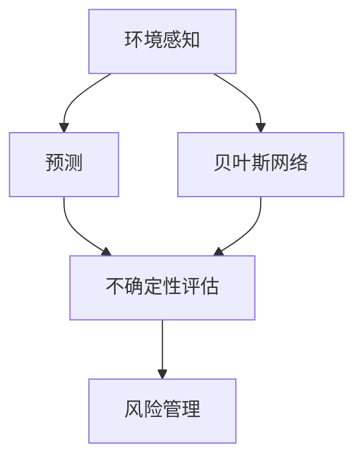
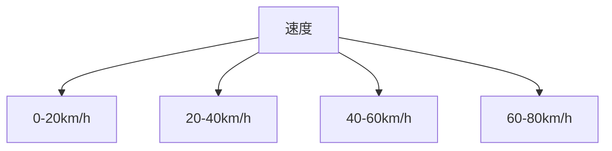

                 

# 自动驾驶中的环境感知与预测不确定性评估

> 关键词：自动驾驶,环境感知,预测不确定性,贝叶斯网络,感知-预测融合

## 1. 背景介绍

自动驾驶技术作为未来交通的颠覆性变革，在减少交通事故、缓解交通拥堵等方面展现出巨大潜力。然而，自动驾驶系统面临的复杂多变环境、感知能力的不确定性、决策错误的后果等因素，使其在安全性、可靠性上仍面临重大挑战。环境感知与预测的不确定性评估，作为自动驾驶核心技术之一，旨在通过构建精确的环境模型和合理的风险评估体系，为车辆行为决策提供可靠的依据，保障行车安全。

### 1.1 问题由来

在自动驾驶过程中，环境感知与预测是确保系统安全和可靠性的基石。然而，由于环境复杂性和动态性，车辆在实际行驶中可能会遇到诸如天气突变、交通堵塞、行人干扰等不可预测的情况，导致感知与预测模型产生偏差。如何在不确定的环境下，准确评估模型的预测效果，及时调整行为决策，成为自动驾驶领域的重要研究方向。

### 1.2 问题核心关键点

环境感知与预测不确定性评估的核心在于构建模型，预测结果与实际结果的一致性分析，以及风险管理。其中，关键问题包括：

1. **模型选择与构建**：选择合适的感知与预测模型，考虑其准确性和泛化能力。
2. **不确定性量化**：通过统计、概率方法，量化模型的预测不确定性。
3. **风险评估**：结合不确定性评估结果，合理评估风险，制定相应的应急措施。

这些关键点相互关联，共同构成了自动驾驶中环境感知与预测不确定性评估的全貌。

### 1.3 问题研究意义

环境感知与预测不确定性评估的研究对于提升自动驾驶系统的安全性、可靠性具有重要意义：

1. **增强安全性**：通过精确评估感知与预测模型的可靠性，及时调整驾驶策略，降低事故风险。
2. **提升用户体验**：在驾驶过程中提供可靠的风险评估信息，增强用户对自动驾驶系统的信任度。
3. **促进技术发展**：推动感知与预测模型的优化与创新，提升自动驾驶技术的整体水平。
4. **支持法规制定**：为制定自动驾驶相关的法律法规和标准，提供科学依据。

本文将对自动驾驶中环境感知与预测不确定性评估的核心技术进行深入探讨，重点介绍贝叶斯网络在处理不确定性问题上的优势，并通过具体案例分析，展示其在实际应用中的有效性。

## 2. 核心概念与联系

### 2.1 核心概念概述

为了更好地理解自动驾驶中的环境感知与预测不确定性评估，本节将介绍几个关键概念：

- **环境感知**：指自动驾驶系统通过传感器（如摄像头、雷达、激光雷达等）收集道路环境信息的过程。通过环境感知，车辆能够获取道路、车辆、行人等实体的准确位置、速度、姿态等关键参数。
- **预测**：指在获取环境感知信息的基础上，通过算法模型对未来行为进行预测。常见的预测任务包括路径预测、行为预测、事件预测等。
- **不确定性**：指环境感知和预测模型在处理复杂多变的环境时，可能出现的预测偏差和误判。不确定性评估旨在量化和评估这种预测的可靠性。
- **贝叶斯网络**：一种基于概率统计的建模工具，通过构建有向无环图（DAG），实现变量之间的条件概率推理。在自动驾驶中，贝叶斯网络可以用于构建环境感知与预测的不确定性模型。

这些核心概念之间的逻辑关系可以通过以下Mermaid流程图来展示：



这个流程图展示了几项关键技术之间的联系：环境感知是预测的基础，而预测结果的不确定性需要通过不确定性评估来量化，评估结果用于风险管理，而贝叶斯网络作为不确定性评估的工具，帮助构建精确的环境感知与预测模型。

## 3. 核心算法原理 & 具体操作步骤
### 3.1 算法原理概述

自动驾驶中的环境感知与预测不确定性评估，本质上是通过构建和分析不确定性模型，量化环境感知与预测的可靠性，并基于风险评估制定相应的应急措施。

假设环境感知模型为 $P(E)$，预测模型为 $P(T|E)$，其中 $E$ 为环境状态，$T$ 为预测结果。环境感知与预测不确定性评估的目标是找到最优的决策策略 $D$，使得预测结果 $T$ 在特定决策 $D$ 下的风险 $R$ 最小化：

$$
\min_{D} R(T|D) = \mathbb{E}[\ell(T, D)]
$$

其中 $\ell(T, D)$ 为预测结果 $T$ 与决策 $D$ 的损失函数。通常使用贝叶斯网络构建 $P(E)$ 和 $P(T|E)$，并通过最大化后验概率（MAP）或贝叶斯优化算法求解最优决策 $D$。

### 3.2 算法步骤详解

基于贝叶斯网络的环境感知与预测不确定性评估，通常包含以下关键步骤：

**Step 1: 准备数据与模型**
- 收集环境感知数据，并进行预处理，如噪声过滤、数据增强等。
- 选择合适类型的贝叶斯网络模型，根据数据分布特点选择合适的节点结构。

**Step 2: 构建贝叶斯网络**
- 定义网络节点，包括环境感知节点 $E$ 和预测节点 $T$。
- 计算节点之间的条件概率分布，构建贝叶斯网络结构。

**Step 3: 进行不确定性分析**
- 使用贝叶斯网络进行推理，计算预测结果的期望值和方差，量化预测的不确定性。
- 通过风险评估，确定预测结果的风险等级，指导驾驶策略的调整。

**Step 4: 制定应急措施**
- 根据风险评估结果，制定相应的应急措施，如减速、避让、紧急制动等。
- 实时监控环境状态和预测结果，动态调整应急措施。

**Step 5: 系统集成与部署**
- 将环境感知与预测不确定性评估模块集成到自动驾驶系统中。
- 在实际驾驶环境中，持续收集数据，优化模型和应急策略。

### 3.3 算法优缺点

贝叶斯网络在自动驾驶环境感知与预测不确定性评估中的优势在于：

- **灵活性**：可以根据具体问题选择不同的网络结构，适应各种复杂环境。
- **集成性**：可以集成多种传感器数据，提供更全面的环境感知信息。
- **概率推断**：通过概率模型，可以处理不确定性和非确定性因素，提供可靠的决策支持。

但贝叶斯网络也存在一些局限性：

- **计算复杂性**：构建和推理大型贝叶斯网络计算复杂度高，需要高效的算法支持。
- **数据需求**：需要大量的标注数据来训练和优化模型。
- **模型泛化**：模型可能过拟合训练数据，泛化能力不足。

尽管如此，贝叶斯网络在自动驾驶中的环境感知与预测不确定性评估中仍展现出巨大的潜力和应用前景。

### 3.4 算法应用领域

环境感知与预测不确定性评估方法在自动驾驶领域有广泛的应用：

- **路径规划**：在复杂交通环境中，通过评估预测路径的不确定性，优化路径选择，减少碰撞风险。
- **行为预测**：对其他道路用户（如行人、车辆）的行为进行预测，及时调整驾驶策略。
- **事件识别**：识别交通事件（如交通事故、拥堵），提前采取应对措施。
- **车辆控制**：根据环境感知和预测结果，调整车辆的速度、方向和姿态，实现安全行驶。

此外，环境感知与预测不确定性评估技术还可以应用于其他智能交通系统，如智能公交、智能停车等领域，提升系统整体的智能化水平。

## 4. 数学模型和公式 & 详细讲解  
### 4.1 数学模型构建

在自动驾驶中，环境感知与预测不确定性评估的数学模型通常基于贝叶斯网络构建。以路径预测为例，假设有 $N$ 条候选路径，每条路径对应一个状态 $S$，路径预测的不确定性可以用后验概率 $P(S_i|T)$ 来表示，其中 $T$ 为当前环境感知状态，$S_i$ 为路径 $i$ 的状态。通过贝叶斯网络，可以将路径预测的不确定性转化为条件概率：

$$
P(S_i|T) = \frac{P(T|S_i)P(S_i)}{\sum_{j=1}^{N} P(T|S_j)P(S_j)}
$$

其中 $P(T|S_i)$ 为给定状态 $S_i$ 下环境感知状态 $T$ 的条件概率，$P(S_i)$ 为路径 $i$ 的先验概率。

### 4.2 公式推导过程

对于上述路径预测模型，可以进一步推导路径不确定性的期望值和方差：

$$
\begin{aligned}
E[P(S_i|T)] &= \sum_{T} P(T)P(S_i|T) \\
&= \sum_{T} P(T|S_i)P(S_i)P(S_i|T) \\
&= \sum_{T} P(T|S_i)P(S_i)^2
\end{aligned}
$$

$$
\begin{aligned}
\text{Var}[P(S_i|T)] &= E[P(S_i|T)^2] - (E[P(S_i|T)])^2 \\
&= E[P(S_i|T)^2] - \left(\sum_{T} P(T|S_i)P(S_i)^2\right)^2 \\
&= \sum_{T} P(T|S_i)P(S_i)^2 - \left(\sum_{T} P(T|S_i)P(S_i)^2\right)^2
\end{aligned}
$$

在实际应用中，为了简化计算，通常使用蒙特卡洛方法或重要性抽样等技术进行数值计算。

### 4.3 案例分析与讲解

以一个简单的交叉路口为例，假设车辆在不同速度下通过路口的概率如下表所示：

| 速度 | 0-20km/h | 20-40km/h | 40-60km/h | 60-80km/h |
| ---- | -------- | -------- | -------- | -------- |
| 概率 | 0.1     | 0.3     | 0.4     | 0.2     |

使用贝叶斯网络，可以构建如下模型：



其中 $A$ 为速度节点，$B$、$C$、$D$、$E$ 分别为不同速度对应的通过路口的概率节点。根据实际数据，可以对节点之间的条件概率进行初始化：

$$
P(0-20km/h|A) = 0.1, P(20-40km/h|A) = 0.3, P(40-60km/h|A) = 0.4, P(60-80km/h|A) = 0.2
$$

假设车辆当前速度为 $v=40km/h$，则可以通过贝叶斯网络进行推理：

$$
P(20-40km/h|A) = P(20-40km/h|40-60km/h)P(40-60km/h|A) = 0.3 \times 0.4 = 0.12
$$

通过上述分析，可以得出车辆以40km/h速度通过路口的概率为0.12，这为驾驶策略的调整提供了可靠的依据。

## 5. 项目实践：代码实例和详细解释说明
### 5.1 开发环境搭建

在进行环境感知与预测不确定性评估的开发前，我们需要准备好开发环境。以下是使用Python进行PyTorch开发的环境配置流程：

1. 安装Anaconda：从官网下载并安装Anaconda，用于创建独立的Python环境。

2. 创建并激活虚拟环境：
```bash
conda create -n pytorch-env python=3.8 
conda activate pytorch-env
```

3. 安装PyTorch：根据CUDA版本，从官网获取对应的安装命令。例如：
```bash
conda install pytorch torchvision torchaudio cudatoolkit=11.1 -c pytorch -c conda-forge
```

4. 安装相关库：
```bash
pip install networkx scipy pandas numpy matplotlib scikit-learn tqdm jupyter notebook ipython
```

完成上述步骤后，即可在`pytorch-env`环境中开始项目实践。

### 5.2 源代码详细实现

下面我们以贝叶斯网络路径预测为例，给出使用PyTorch构建和推理的Python代码实现。

首先，定义路径预测的贝叶斯网络结构：

```python
import networkx as nx

# 定义节点
nodes = ['S0', 'S1', 'S2', 'S3', 'S4', 'S5']

# 构建贝叶斯网络
G = nx.DiGraph()
for i in range(len(nodes)):
    G.add_node(nodes[i])
    G.add_edge(nodes[i-1], nodes[i], prob=0.5)  # 相邻节点概率均为0.5
```

然后，定义条件概率分布：

```python
probs = {(s, t): 0.5 for s in nodes for t in nodes}
G.edges.update(probs)
```

接下来，定义计算路径不确定性的函数：

```python
def path_uncertainty(v):
    # 将节点编号转化为路径状态
    states = [i for i in range(len(nodes))]
    # 构建路径节点
    states.append(v)
    # 构建新的贝叶斯网络
    G_new = nx.DiGraph()
    G_new.add_nodes_from(states)
    for i in range(len(states)-1):
        G_new.add_edge(states[i], states[i+1], prob=probs[(states[i], states[i+1])])
    # 计算路径不确定性
    return nx PageRank(G_new, weights='prob')[states[-1]]
```

最后，使用该函数计算特定速度下的路径不确定性：

```python
# 计算速度40km/h下的路径不确定性
uncertainty = path_uncertainty(40)
print(f"40km/h速度下的路径不确定性为: {uncertainty:.3f}")
```

通过上述代码，即可实现基于贝叶斯网络的路径预测不确定性评估。

### 5.3 代码解读与分析

让我们再详细解读一下关键代码的实现细节：

**定义贝叶斯网络**：
- 使用networkx库定义有向图，构建贝叶斯网络结构。

**条件概率分布**：
- 定义节点之间的条件概率，这里使用了简单的0.5概率作为示例。在实际应用中，根据实际数据进行初始化。

**路径不确定性计算**：
- 根据给定速度，构建新的贝叶斯网络，并使用PageRank算法计算路径不确定性。PageRank是一种图论算法，可以用于计算节点之间的重要性，这里用于计算路径状态的概率分布。

**路径不确定性评估**：
- 使用定义的函数计算特定速度下的路径不确定性，并输出结果。

通过上述代码，我们可以看到，PyTorch配合networkx库，可以方便地构建和计算贝叶斯网络，实现环境感知与预测不确定性评估。开发者可以根据具体任务，灵活调整网络结构和参数，以适应不同的复杂环境。

## 6. 实际应用场景
### 6.1 智能交通系统

在智能交通系统中，环境感知与预测不确定性评估方法可以广泛应用于交通流量预测、路径优化、事故预警等领域。通过构建精确的环境模型，系统能够实时预测交通状态，优化路径选择，及时发出事故预警，显著提升系统的智能化水平。

例如，在高速公路上，基于贝叶斯网络的交通流量预测模型可以实时监测各路段的车辆流量和速度，预测未来流量变化趋势，并根据预测结果自动调整车道配置，优化行车流线，提高道路通行效率。

### 6.2 自动驾驶路径规划

自动驾驶中的路径规划是实现安全行驶的重要环节。通过构建环境感知与预测不确定性评估模型，系统能够实时评估路径的不确定性，动态调整路径选择，避免潜在风险。

例如，在交叉路口，系统可以通过贝叶斯网络评估不同速度下通过路口的概率，根据预测结果调整行驶策略，确保车辆安全通过。在复杂的城市道路环境中，系统还可以结合地图信息，预测路段拥堵情况，选择最佳路径，避免长时间滞留。

### 6.3 智能公交系统

智能公交系统需要实时监测公交车的运行状态，确保公交车的准点率和安全行驶。通过环境感知与预测不确定性评估，系统能够实时评估道路环境，预测公交车到站时间，动态调整行驶策略，提高公交车的运营效率和安全性。

例如，在公交车的行驶过程中，系统可以通过贝叶斯网络预测前方道路的拥堵情况，及时调整行驶速度和路线，确保公交车的准点到达和乘客的舒适体验。

### 6.4 未来应用展望

随着贝叶斯网络技术的不断成熟，基于环境感知与预测不确定性评估的方法将在自动驾驶和其他智能交通系统中发挥更大的作用。

- **实时性**：未来的模型将更加高效，能够在实时环境中快速计算和推理，提供即时的决策支持。
- **融合性**：未来的模型将更好地融合多种传感器数据，提供更全面的环境感知信息。
- **智能性**：未来的模型将具备更高的智能水平，能够处理更加复杂多变的环境，提供更可靠的决策支持。

## 7. 工具和资源推荐
### 7.1 学习资源推荐

为了帮助开发者系统掌握环境感知与预测不确定性评估的理论基础和实践技巧，这里推荐一些优质的学习资源：

1. **《概率图模型：原理与技术》**：由斯坦福大学统计系教授编写，详细介绍了概率图模型的基本原理和应用方法。
2. **Coursera上的《贝叶斯网络》课程**：由哥伦比亚大学教授讲授，系统讲解了贝叶斯网络的构建和应用，适合初学者和进阶学习者。
3. **Kaggle上的贝叶斯网络竞赛**：通过实际数据集，训练和优化贝叶斯网络模型，提升实践能力。
4. **arXiv上的贝叶斯网络论文**：阅读最新的贝叶斯网络研究论文，了解前沿技术。
5. **HuggingFace官方文档**：提供了详细的贝叶斯网络模型实现和案例分析，是学习实践的良好参考。

通过这些资源的学习实践，相信你一定能够快速掌握环境感知与预测不确定性评估的精髓，并用于解决实际的智能交通问题。

### 7.2 开发工具推荐

高效的开发离不开优秀的工具支持。以下是几款用于环境感知与预测不确定性评估开发的常用工具：

1. **PyTorch**：基于Python的开源深度学习框架，灵活动态的计算图，适合快速迭代研究。
2. **TensorFlow**：由Google主导开发的开源深度学习框架，生产部署方便，适合大规模工程应用。
3. **networkx**：用于构建和分析复杂网络结构的Python库，适合构建贝叶斯网络模型。
4. **SciPy**：Python的科学计算库，提供了丰富的数学函数和优化算法，适合数值计算和模型优化。
5. **Jupyter Notebook**：免费的交互式编程环境，适合数据可视化、代码调试和论文撰写。

合理利用这些工具，可以显著提升环境感知与预测不确定性评估任务的开发效率，加快创新迭代的步伐。

### 7.3 相关论文推荐

环境感知与预测不确定性评估的研究源于学界的持续研究。以下是几篇奠基性的相关论文，推荐阅读：

1. **"Probabilistic Graphical Models for Knowledge Discovery and Data Mining"**：由Pearl教授撰写，详细介绍了概率图模型的原理和应用。
2. **"Bayesian Networks: The Next 30 Years"**：由Buntine教授撰写的综述文章，总结了贝叶斯网络30年的发展历程和最新研究进展。
3. **"Deep Belief Networks and Unsupervised Learning using Belief Propagation"**：由Hinton教授等人发表的论文，介绍了深度信念网络及其在贝叶斯网络中的应用。
4. **"Bayesian Network Classifiers"**：由Koller教授等人撰写的经典书籍，详细讲解了贝叶斯网络的分类算法和应用。
5. **"Bayesian Networks for Data Mining"**：由Gilbert教授等人撰写的书籍，介绍了贝叶斯网络在数据挖掘中的应用。

这些论文代表了大模型微调技术的发展脉络。通过学习这些前沿成果，可以帮助研究者把握学科前进方向，激发更多的创新灵感。

## 8. 总结：未来发展趋势与挑战

### 8.1 总结

本文对自动驾驶中环境感知与预测不确定性评估的核心技术进行了全面系统的介绍。首先阐述了环境感知与预测不确定性评估的研究背景和意义，明确了其在自动驾驶安全性、可靠性提升方面的重要性。其次，从原理到实践，详细讲解了基于贝叶斯网络的环境感知与预测不确定性评估过程，给出了环境感知与预测不确定性评估的完整代码实例。同时，本文还广泛探讨了环境感知与预测不确定性评估在智能交通系统、自动驾驶路径规划等实际应用场景中的应用前景，展示了其在实际应用中的有效性。

通过本文的系统梳理，可以看到，环境感知与预测不确定性评估技术在自动驾驶中的关键作用。这些技术的应用，为自动驾驶系统提供了更可靠的决策支持，显著提升了系统的智能化水平和安全性。未来，随着技术的不断进步和应用场景的不断拓展，环境感知与预测不确定性评估将发挥更大的作用，助力自动驾驶技术的进一步发展。

### 8.2 未来发展趋势

展望未来，环境感知与预测不确定性评估技术将呈现以下几个发展趋势：

1. **融合多种传感器数据**：未来的环境感知与预测模型将更好地融合摄像头、雷达、激光雷达等多种传感器数据，提供更全面的环境感知信息。
2. **引入深度学习和神经网络**：通过深度学习和神经网络技术，提升环境感知与预测模型的精度和泛化能力。
3. **实时性和高可靠性**：未来的模型将具备更高的实时性和可靠性，能够在复杂多变的环境中快速计算和推理，提供可靠的决策支持。
4. **跨领域融合**：环境感知与预测不确定性评估技术将与其他人工智能技术进行更深入的融合，如知识表示、因果推理、强化学习等，推动智能交通系统的整体进步。

以上趋势凸显了环境感知与预测不确定性评估技术的广阔前景。这些方向的探索发展，必将进一步提升自动驾驶系统的性能和应用范围，为人类认知智能的进化带来深远影响。

### 8.3 面临的挑战

尽管环境感知与预测不确定性评估技术已经取得了显著进展，但在迈向更加智能化、普适化应用的过程中，仍面临诸多挑战：

1. **数据质量与多样性**：环境感知与预测模型依赖高质量、多样化的传感器数据，数据缺失或不完整可能导致模型预测偏差。
2. **计算资源消耗**：贝叶斯网络等复杂模型计算复杂度高，对计算资源的需求大，需要高效的算法和硬件支持。
3. **模型泛化能力**：模型在复杂环境中的泛化能力不足，可能过拟合训练数据，无法适应新的环境变化。
4. **实时性与精度**：在实时环境中，模型的计算和推理速度需要进一步提升，同时保持高精度。
5. **跨领域适应性**：不同领域的环境和数据特征差异大，模型需要具备良好的跨领域适应性。

这些挑战需要在算法、硬件、数据等多个维度进行持续优化和创新，才能实现环境感知与预测不确定性评估技术在自动驾驶系统中的大规模应用。

### 8.4 研究展望

面对环境感知与预测不确定性评估所面临的挑战，未来的研究需要在以下几个方面寻求新的突破：

1. **模型优化与融合**：开发更加高效、泛化能力强的模型，并与其他技术进行深度融合，提升整体系统性能。
2. **跨领域数据融合**：研究和开发跨领域数据融合技术，增强模型对不同环境特征的适应性。
3. **实时计算与推理**：开发高效的计算和推理算法，支持模型在实时环境中的应用。
4. **数据增强与质量提升**：探索数据增强技术，提升数据质量，增强模型的泛化能力。
5. **风险管理与决策支持**：建立更加完善的风险评估和决策支持体系，确保系统在各种环境下的安全可靠。

这些研究方向的研究成果，必将推动环境感知与预测不确定性评估技术向更高层次迈进，为自动驾驶技术的实际应用提供强有力的技术支撑。

## 9. 附录：常见问题与解答

**Q1：环境感知与预测不确定性评估的目的是什么？**

A: 环境感知与预测不确定性评估的目的是通过构建精确的环境模型和合理的风险评估体系，为车辆行为决策提供可靠的依据，保障行车安全。

**Q2：如何选择合适类型的贝叶斯网络模型？**

A: 选择合适的贝叶斯网络模型需要考虑数据分布特点和问题复杂度。一般来说，简单问题可以使用层次结构（Hierarchical Structure）或置信网络（Confidence Network），复杂问题可以使用因果网络（Causal Network）或贝叶斯网络（Bayesian Network）。

**Q3：如何量化环境感知与预测的不确定性？**

A: 通过贝叶斯网络进行推理，计算预测结果的期望值和方差，量化预测的不确定性。常用的方法包括蒙特卡洛模拟、重要性抽样、变分推断等。

**Q4：环境感知与预测不确定性评估在实际应用中面临哪些挑战？**

A: 在实际应用中，环境感知与预测不确定性评估面临的挑战包括数据质量与多样性、计算资源消耗、模型泛化能力、实时性与精度、跨领域适应性等。

**Q5：环境感知与预测不确定性评估在自动驾驶中的应用前景如何？**

A: 环境感知与预测不确定性评估在自动驾驶中的应用前景广阔，能够提升系统的安全性、可靠性，优化驾驶策略，增强用户信任度。随着技术的发展，其应用范围将进一步拓展，成为自动驾驶系统不可或缺的重要组成部分。

通过本文的系统梳理，相信你一定能够全面掌握环境感知与预测不确定性评估的核心技术，并在实际应用中取得良好的效果。环境感知与预测不确定性评估技术将继续在智能交通系统中发挥重要作用，为人类社会带来更加安全、便捷、智能的出行方式。

