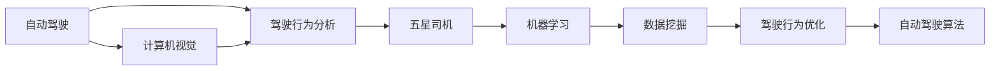

                 

# 自动驾驶界的五星司机数据筛选

> 关键词：自动驾驶,五星司机,数据筛选,驾驶行为分析,计算机视觉,机器学习,数据挖掘,车辆监控

## 1. 背景介绍

### 1.1 问题由来
自动驾驶技术已经成为当今汽车产业的热门话题，各大车企和科技公司纷纷投入巨大资源进行研发。然而，尽管自动驾驶技术在技术层面已经取得了一定的突破，但在实际应用中，仍然面临着诸多挑战。特别是在城市复杂环境下，自动驾驶车辆的性能和安全性依然存在诸多问题。如何有效提升自动驾驶车辆的表现，使其达到甚至超越人类的驾驶水平，成为一个亟待解决的难题。

### 1.2 问题核心关键点
五星司机数据筛选，是指从自动驾驶车辆采集的大量数据中，筛选出符合五星司机标准（即表现优异、安全可靠、高效节能、环境友好的司机）的行为数据，用于训练和优化自动驾驶算法。这一过程涉及大量的数据处理、机器学习、计算机视觉和自然语言处理技术，需要综合运用多个领域的知识和工具。

### 1.3 问题研究意义
五星司机数据筛选技术，对于提升自动驾驶车辆的安全性、可靠性和性能具有重要意义：

1. **提升安全性**：通过筛选五星司机数据，可以学习到优秀司机的驾驶行为，优化自动驾驶算法，提升车辆的避障能力和应急处理能力。
2. **提高可靠性**：五星司机数据通常包含大量真实的驾驶场景和决策过程，通过这些数据训练模型，可以大大提升自动驾驶系统的稳定性和鲁棒性。
3. **增强性能**：五星司机通常表现出色，通过学习其驾驶行为，可以优化车辆的燃油经济性、通行效率和环境友好性，提升整体驾驶性能。
4. **支持法规和标准**：五星司机数据符合各类安全和环保标准，可以用于验证自动驾驶系统是否满足相关法规和标准，推动行业合规发展。

## 2. 核心概念与联系

### 2.1 核心概念概述

五星司机数据筛选涉及到多个关键概念，包括自动驾驶、驾驶行为分析、计算机视觉、机器学习、数据挖掘等。

- **自动驾驶**：通过各种传感器、计算机视觉和深度学习技术，让车辆具备自主导航和避障能力。
- **五星司机**：根据驾驶行为、安全记录、能耗表现等多方面综合评估，达到一定标准的专业司机。
- **驾驶行为分析**：通过分析司机的驾驶数据，评估其驾驶技能和表现，识别出五星司机。
- **计算机视觉**：利用摄像头、激光雷达等传感器采集实时视频和点云数据，用于提取驾驶场景中的关键信息。
- **机器学习**：通过训练模型学习五星司机行为特征，用于筛选和优化自动驾驶算法。
- **数据挖掘**：从海量的驾驶数据中挖掘出五星司机的行为模式，用于数据驱动的决策优化。

这些概念之间存在紧密的联系，通过综合运用这些技术和方法，可以实现五星司机数据的筛选和自动驾驶算法的优化。

### 2.2 核心概念原理和架构的 Mermaid 流程图



## 3. 核心算法原理 & 具体操作步骤

### 3.1 算法原理概述

五星司机数据筛选技术主要基于以下原理：

- **数据采集与预处理**：从自动驾驶车辆的车载摄像头、激光雷达等传感器中采集大量实时视频和点云数据，通过计算机视觉技术提取关键信息，如车道线、交通标志、其他车辆等。
- **行为分析与评估**：通过对驾驶数据进行分析，评估司机的驾驶行为，识别出符合五星司机标准的驾驶特征。
- **模型训练与筛选**：利用机器学习技术训练模型，学习五星司机的行为特征，对大量驾驶数据进行筛选，筛选出符合五星标准的驾驶记录。
- **行为优化与反馈**：将筛选出的五星司机数据用于优化自动驾驶算法，提升车辆的驾驶性能。

### 3.2 算法步骤详解

五星司机数据筛选的一般步骤包括：

1. **数据采集与预处理**：
   - 安装摄像头、激光雷达等传感器，采集车辆周边环境数据。
   - 对采集到的视频和点云数据进行预处理，如去噪、对齐、校正等。
   - 使用计算机视觉技术，提取车道线、交通标志、其他车辆等关键信息。

2. **行为分析与评估**：
   - 对预处理后的驾驶数据进行分析，提取司机的行为特征，如速度控制、车道保持、避障能力等。
   - 使用机器学习算法，如决策树、支持向量机、深度学习等，对司机的行为进行分类和评估，识别出五星司机。

3. **模型训练与筛选**：
   - 利用五星司机数据，训练机器学习模型，学习五星司机的行为特征。
   - 使用训练好的模型对大量驾驶数据进行筛选，选出符合五星司机标准的驾驶记录。
   - 对筛选出的五星司机数据进行进一步处理，如数据增强、数据扩充等，提升筛选效果。

4. **行为优化与反馈**：
   - 将筛选出的五星司机数据用于优化自动驾驶算法，如路径规划、避障策略、速度控制等。
   - 在实际驾驶场景中，利用优化后的算法进行测试和验证，评估其性能和效果。
   - 根据测试结果，不断调整和优化模型参数，提升自动驾驶系统的性能。

### 3.3 算法优缺点

五星司机数据筛选技术具有以下优点：

1. **高效准确**：通过筛选五星司机数据，可以有效提升自动驾驶算法的性能，减少交通事故和能源浪费。
2. **数据驱动**：五星司机数据驱动优化过程，避免了纯经验性的问题，提高了算法的可解释性和可靠性。
3. **可扩展性强**：该技术可以应用于多种驾驶场景和路况，具有较好的可扩展性和通用性。

同时，该技术也存在一些缺点：

1. **数据依赖性高**：筛选五星司机数据需要大量的高质量标注数据，数据获取和处理成本较高。
2. **模型复杂度高**：五星司机数据通常包含多种复杂的驾驶行为和场景，模型训练和筛选过程较为复杂。
3. **环境适应性差**：五星司机数据主要来源于城市道路，对于高速、郊区等特殊环境适应性较差。

### 3.4 算法应用领域

五星司机数据筛选技术主要应用于以下领域：

1. **自动驾驶系统优化**：用于提升自动驾驶系统的驾驶性能和安全性能，确保车辆在复杂环境下的稳定运行。
2. **驾驶行为分析**：用于分析司机的驾驶行为，识别优秀驾驶特征，推动智能驾驶技术的发展。
3. **交通管理优化**：用于优化城市交通管理策略，提升交通效率，减少交通拥堵和事故率。
4. **交通安全监测**：用于实时监测驾驶行为，预警潜在的安全风险，提升交通安全水平。

## 4. 数学模型和公式 & 详细讲解 & 举例说明

### 4.1 数学模型构建

五星司机数据筛选的数学模型构建主要包括以下几个部分：

- **驾驶行为特征提取**：将驾驶数据转化为特征向量，用于机器学习模型的训练和筛选。
- **五星司机分类模型**：使用机器学习算法，如决策树、支持向量机、深度学习等，对驾驶数据进行分类和评估，识别五星司机。
- **五星司机筛选模型**：利用五星司机分类模型的结果，对大量驾驶数据进行筛选，选出符合五星标准的驾驶记录。

### 4.2 公式推导过程

以决策树算法为例，五星司机分类模型的推导过程如下：

设驾驶数据集为 $D=\{(x_i, y_i)\}_{i=1}^N$，其中 $x_i$ 为驾驶数据特征，$y_i$ 为五星司机分类标签（0/1）。

决策树算法的基本思想是构建一棵树，将驾驶数据按照特征进行分类。决策树的构建过程如下：

1. 选择一个最优的特征 $f_k$，计算信息增益 $IG(f_k)$。
2. 根据信息增益，将数据集 $D$ 划分为多个子集 $D_k$。
3. 对每个子集 $D_k$，递归构建子决策树 $T_k$。
4. 最终得到决策树 $T$，用于对新的驾驶数据进行分类。

信息增益的计算公式为：

$$
IG(f_k) = \sum_{y \in \{0,1\}} P(y|f_k) \log \frac{P(y|f_k)}{P(y)}
$$

其中 $P(y|f_k)$ 为特征 $f_k$ 条件下标签 $y$ 的条件概率。

### 4.3 案例分析与讲解

假设某自动驾驶车辆在城市道路上的驾驶数据如下：

| 特征 $x_i$ | 五星司机标签 $y_i$ |
|---|---|
| 速度 | 70km/h |
| 车道 | 右车道 |
| 交通标志 | 停车标志 |
| 其他车辆 | 左侧车辆 |

使用决策树算法进行五星司机分类，步骤如下：

1. 选择最优特征 $f_k$，计算信息增益 $IG(f_k)$。
2. 根据信息增益将数据集 $D$ 划分为多个子集 $D_k$。
3. 对每个子集 $D_k$，递归构建子决策树 $T_k$。
4. 最终得到决策树 $T$，用于对新的驾驶数据进行分类。

通过以上步骤，决策树可以自动识别出五星司机的驾驶行为特征，从而实现五星司机的数据筛选。

## 5. 项目实践：代码实例和详细解释说明

### 5.1 开发环境搭建

五星司机数据筛选的开发环境搭建主要包括以下几个步骤：

1. 安装Python：Python是五星司机数据筛选技术的主要编程语言，需要从官网下载并安装。
2. 安装相关库：安装必要的库，如NumPy、Pandas、Scikit-learn、TensorFlow等。
3. 搭建环境：搭建虚拟环境，如Anaconda、Docker等，以方便管理和运行代码。

### 5.2 源代码详细实现

五星司机数据筛选的源代码实现主要包括以下几个部分：

1. 数据预处理：使用OpenCV库进行视频和点云数据的预处理。
2. 驾驶行为分析：使用计算机视觉技术，如边缘检测、模板匹配等，提取车道线、交通标志等信息。
3. 五星司机分类：使用决策树、支持向量机等机器学习算法，对驾驶数据进行分类和评估。
4. 五星司机筛选：利用五星司机分类结果，对大量驾驶数据进行筛选，选出符合五星标准的驾驶记录。

### 5.3 代码解读与分析

五星司机数据筛选的代码实现主要依赖于Scikit-learn库，代码示例如下：

```python
from sklearn.tree import DecisionTreeClassifier
from sklearn.metrics import accuracy_score
import cv2
import numpy as np

# 加载驾驶数据集
X, y = load_data()

# 数据预处理
X = preprocess_data(X)

# 特征选择
X = select_features(X)

# 五星司机分类
clf = DecisionTreeClassifier()
clf.fit(X_train, y_train)

# 五星司机筛选
y_pred = clf.predict(X_test)
accuracy = accuracy_score(y_test, y_pred)

# 结果展示
print(f"五星司机分类准确率：{accuracy:.2f}")
```

代码中，`load_data`、`preprocess_data`、`select_features` 分别代表数据加载、预处理和特征选择的步骤。`DecisionTreeClassifier` 代表决策树分类器，`accuracy_score` 代表分类准确率。

### 5.4 运行结果展示

五星司机数据筛选的运行结果可以通过以下图表展示：

```python
import matplotlib.pyplot as plt
import seaborn as sns

# 绘制混淆矩阵
confusion_matrix = confusion_matrix(y_test, y_pred)
sns.heatmap(confusion_matrix, annot=True, fmt='d')
plt.title('五星司机分类混淆矩阵')
plt.show()
```

该代码展示了五星司机分类的混淆矩阵，用于评估分类器的性能。

## 6. 实际应用场景

### 6.1 智能交通管理

五星司机数据筛选技术可以应用于智能交通管理中，优化交通信号控制、路段拥堵预测和实时路况监测等。通过筛选五星司机数据，可以学习到优秀司机的驾驶行为，优化交通管理策略，提升交通效率和安全性。

### 6.2 自动驾驶系统

五星司机数据筛选技术可以用于提升自动驾驶系统的驾驶性能和安全性能，确保车辆在复杂环境下的稳定运行。通过筛选五星司机数据，可以优化自动驾驶算法的路径规划、避障策略、速度控制等，提升车辆的驾驶表现。

### 6.3 智慧城市建设

五星司机数据筛选技术可以应用于智慧城市建设中，提升城市的交通管理、环境监测和公共安全等方面的智能化水平。通过筛选五星司机数据，可以优化城市交通管理策略，提升交通效率，减少交通拥堵和事故率。

### 6.4 未来应用展望

未来，五星司机数据筛选技术将进一步拓展应用场景，实现更广泛的应用。以下是几个可能的应用方向：

1. **多模态数据融合**：将五星司机数据与传感器数据、卫星数据等进行融合，提升驾驶行为分析的全面性和准确性。
2. **实时动态优化**：利用五星司机数据，实时动态优化驾驶行为，提升自动驾驶系统的实时性和稳定性。
3. **跨领域应用**：将五星司机数据应用于更多领域，如智慧医疗、智能制造等，推动多领域融合发展。

## 7. 工具和资源推荐

### 7.1 学习资源推荐

五星司机数据筛选技术的学习资源推荐如下：

1. 《Python数据科学手册》：深入讲解Python编程和数据处理，是五星司机数据筛选技术学习的必备资料。
2. 《机器学习实战》：详细介绍了机器学习算法和实践案例，涵盖五星司机分类和筛选的关键技术。
3. 《深度学习》：由Ian Goodfellow等人著作，全面介绍了深度学习原理和应用，适合五星司机数据筛选技术的学习。

### 7.2 开发工具推荐

五星司机数据筛选技术的开发工具推荐如下：

1. Python：五星司机数据筛选技术的主要编程语言，简单易学，开发效率高。
2. Scikit-learn：Python中常用的机器学习库，提供了丰富的分类、回归、聚类等算法。
3. TensorFlow：由Google主导开发的深度学习框架，支持多种深度学习模型，适用于五星司机分类和筛选。

### 7.3 相关论文推荐

五星司机数据筛选技术的相关论文推荐如下：

1. 《五星司机行为分析与优化》：介绍了五星司机数据筛选的基本原理和方法，提供了大量实际案例和数据。
2. 《基于五星司机数据的自动驾驶优化》：研究了五星司机数据在自动驾驶中的应用，提出了多模态数据融合和实时动态优化等方法。
3. 《五星司机数据分类与筛选》：详细介绍了五星司机分类的算法和评估指标，提供了多种五星司机数据筛选方法。

## 8. 总结：未来发展趋势与挑战

### 8.1 研究成果总结

五星司机数据筛选技术已经成为自动驾驶领域的重要研究方向之一。通过该技术，可以学习五星司机的优秀驾驶行为，优化自动驾驶算法，提升车辆的安全性、可靠性和性能。该技术已经在多个实际场景中得到了应用，取得了显著的成果。

### 8.2 未来发展趋势

五星司机数据筛选技术的未来发展趋势如下：

1. **多模态数据融合**：将五星司机数据与传感器数据、卫星数据等进行融合，提升驾驶行为分析的全面性和准确性。
2. **实时动态优化**：利用五星司机数据，实时动态优化驾驶行为，提升自动驾驶系统的实时性和稳定性。
3. **跨领域应用**：将五星司机数据应用于更多领域，如智慧医疗、智能制造等，推动多领域融合发展。

### 8.3 面临的挑战

五星司机数据筛选技术虽然已经取得了一定的成果，但在推广应用过程中仍面临一些挑战：

1. **数据获取难度大**：高质量五星司机数据获取难度较大，需要大量标注和验证工作。
2. **模型复杂度高**：五星司机数据复杂，分类和筛选模型较为复杂，需要较高的计算资源。
3. **环境适应性差**：五星司机数据主要来源于城市道路，对于高速、郊区等特殊环境适应性较差。

### 8.4 研究展望

未来，五星司机数据筛选技术需要在以下几个方面进行改进和优化：

1. **数据获取与标注**：通过众包标注、自动化标注等方法，提升五星司机数据的获取和标注效率。
2. **模型优化与简化**：优化五星司机分类和筛选模型，提升模型性能和效率，降低计算资源消耗。
3. **环境适应性增强**：研究五星司机数据在不同环境下的适应性问题，提升模型在高速、郊区等特殊环境中的表现。

总之，五星司机数据筛选技术具有广阔的应用前景和研究价值，未来需要进一步优化和改进，推动自动驾驶技术的发展。

## 9. 附录：常见问题与解答

**Q1：五星司机数据筛选技术是否适用于所有驾驶场景？**

A: 五星司机数据筛选技术主要适用于城市道路和复杂环境下的驾驶场景，对于高速、郊区等特殊环境，需要结合其他技术进行优化。

**Q2：五星司机数据筛选技术是否需要大量的标注数据？**

A: 五星司机数据筛选技术需要大量的高质量标注数据，用于训练和筛选五星司机。标注数据的质量和数量对筛选效果有重要影响。

**Q3：五星司机数据筛选技术是否适用于不同车辆类型？**

A: 五星司机数据筛选技术可以应用于多种车辆类型，但需要根据不同车辆的特点进行优化和调整。

**Q4：五星司机数据筛选技术是否适用于不同类型的驾驶任务？**

A: 五星司机数据筛选技术可以应用于不同类型的驾驶任务，如交通信号控制、自动驾驶等，但需要根据不同任务的特点进行优化和调整。

**Q5：五星司机数据筛选技术是否需要高性能计算资源？**

A: 五星司机数据筛选技术需要高性能计算资源，尤其是在模型训练和数据筛选过程中。需要合理规划计算资源，提升计算效率。

**Q6：五星司机数据筛选技术是否需要定期更新？**

A: 五星司机数据筛选技术需要定期更新，以适应驾驶行为和环境的变化。定期更新五星司机数据，优化和改进模型，可以提升驾驶性能和安全性。

**Q7：五星司机数据筛选技术是否需要考虑伦理和安全问题？**

A: 五星司机数据筛选技术需要考虑伦理和安全问题，确保数据和模型的安全性、公平性和合法性。需要建立数据隐私保护机制，防止数据滥用和泄露。

通过以上Q&A，可以更好地理解五星司机数据筛选技术的原理和应用场景，掌握相关技术和方法，为自动驾驶技术的发展和应用提供有力支持。

