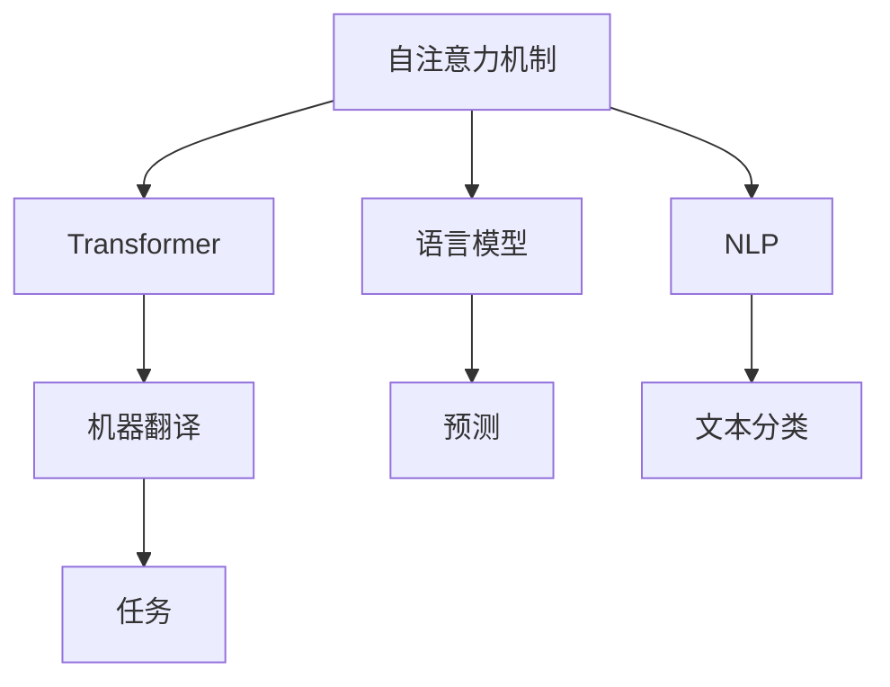

                 

# 自注意力机制在语言处理中的应用

> 关键词：自注意力机制,Transformer,语言模型,自然语言处理,NLP,深度学习,机器学习,人工智能,注意力机制,神经网络

## 1. 背景介绍

### 1.1 问题由来
自注意力机制(Self-Attention)在深度学习领域取得突破性进展，尤其是在自然语言处理(Natural Language Processing, NLP)和计算机视觉领域。这一机制的引入极大地提升了模型的性能和泛化能力，成为当前最先进神经网络架构的重要组成部分。

自注意力机制的灵感来源于人类的认知过程。在阅读和理解长文本时，人们能够通过注意力机制，对关键部分进行加权，从而提升信息处理和理解的效率。自注意力机制通过引入查询、键和值等概念，实现了对输入序列中每个位置的相对重要性加权，使模型能够动态地关注和整合不同位置的信息。

自注意力机制的核心思想是通过计算输入序列中各位置与自身以及与其他位置的相似度，来确定不同位置的重要程度。通过这一机制，模型能够自适应地调整对不同信息的关注度，从而在处理复杂序列数据时表现出更强的表现力和泛化能力。

## 2. 核心概念与联系

### 2.1 核心概念概述

为更好地理解自注意力机制在语言处理中的应用，本节将介绍几个密切相关的核心概念：

- 自注意力机制(Self-Attention)：用于计算输入序列中不同位置之间相对重要性的机制，使模型能够自适应地加权不同位置的信息。
- 自回归(自编码)模型(Transformer)：基于自注意力机制的神经网络架构，广泛应用于语言模型、机器翻译、文本分类等NLP任务。
- 语言模型(Language Model)：用于对给定输入序列进行概率建模的模型，用于预测下一个词或文本的生成概率。
- 自然语言处理(NLP)：将计算机技术与语言学相结合，实现文本数据处理、分析和理解的技术。
- 注意力机制(Attention)：一种机制，用于在输入序列中确定不同位置的重要程度，提升模型对序列中关键信息的关注。
- 神经网络(Neural Network)：由一系列神经元构成的计算图，用于学习输入数据的复杂表示和模式。

这些核心概念之间的逻辑关系可以通过以下Mermaid流程图来展示：



这个流程图展示的核心概念之间的联系：

1. 自注意力机制是Transformer的核心组件。
2. Transformer在语言模型、机器翻译、文本分类等NLP任务中广泛应用。
3. 语言模型用于对输入序列进行概率建模。
4. NLP利用计算机技术和语言学，实现文本数据的处理和分析。
5. 注意力机制帮助模型在输入序列中确定不同位置的重要性。
6. 神经网络由一系列神经元构成，用于学习输入数据的复杂表示。

## 3. 核心算法原理 & 具体操作步骤
### 3.1 算法原理概述

自注意力机制的核心思想是通过计算输入序列中不同位置之间的相似度，来确定不同位置的重要程度。其具体实现步骤如下：

1. 将输入序列通过嵌入层(Embedding)映射为向量表示，得到查询向量 $Q$、键向量 $K$、值向量 $V$。
2. 计算查询向量 $Q$ 和键向量 $K$ 的点积，得到注意力分数矩阵 $\mathbf{S}$。
3. 将注意力分数矩阵 $\mathbf{S}$ 进行softmax归一化，得到注意力权重矩阵 $\mathbf{A}$。
4. 计算注意力权重矩阵 $\mathbf{A}$ 和值向量 $V$ 的点积，得到加权后的输出向量 $\mathbf{O}$。

通过这一过程，自注意力机制实现了对输入序列中不同位置信息的动态加权，从而在处理复杂序列数据时表现出更强的表现力和泛化能力。

### 3.2 算法步骤详解

自注意力机制的具体实现流程如下：

**Step 1: 输入序列嵌入**

对于输入序列 $x_1, x_2, \dots, x_n$，首先需要通过嵌入层将其映射为向量表示，得到查询向量 $Q$、键向量 $K$、值向量 $V$：

$$
Q = embedding(x_1, x_2, \dots, x_n)
$$

$$
K = embedding(x_1, x_2, \dots, x_n)
$$

$$
V = embedding(x_1, x_2, \dots, x_n)
$$

**Step 2: 计算注意力分数矩阵**

通过计算查询向量 $Q$ 和键向量 $K$ 的点积，得到注意力分数矩阵 $\mathbf{S}$：

$$
\mathbf{S} = Q \cdot K^\top
$$

其中 $\cdot$ 表示向量点积，$^\top$ 表示矩阵转置。

**Step 3: 归一化注意力权重**

通过softmax函数对注意力分数矩阵 $\mathbf{S}$ 进行归一化，得到注意力权重矩阵 $\mathbf{A}$：

$$
\mathbf{A} = \text{softmax}(\mathbf{S})
$$

**Step 4: 计算加权输出向量**

通过注意力权重矩阵 $\mathbf{A}$ 和值向量 $V$ 的点积，得到加权后的输出向量 $\mathbf{O}$：

$$
\mathbf{O} = \mathbf{A} \cdot V
$$

通过这一过程，自注意力机制实现了对输入序列中不同位置信息的动态加权，从而在处理复杂序列数据时表现出更强的表现力和泛化能力。

### 3.3 算法优缺点

自注意力机制具有以下优点：

1. 表现力强：通过动态加权，模型能够关注和整合不同位置的信息，从而在处理复杂序列数据时表现出更强的表现力和泛化能力。
2. 并行性强：自注意力机制的计算过程可以通过矩阵运算实现，具有较强的并行计算能力，适合在大规模数据上应用。
3. 灵活性高：自注意力机制可以根据任务需求灵活设计注意力头数和注意力权重函数，适应不同的应用场景。

同时，自注意力机制也存在一定的局限性：

1. 计算复杂度高：自注意力机制的计算复杂度较高，尤其是在大规模数据集上，需要较大的计算资源和内存空间。
2. 数据依赖性强：自注意力机制的性能很大程度上取决于输入数据的结构和分布，对于不同类型的数据可能需要调整模型架构和参数。
3. 可解释性不足：自注意力机制的内部工作机制较为复杂，难以进行解释和调试，给模型的可解释性带来挑战。

尽管存在这些局限性，但自注意力机制的引入使得NLP和计算机视觉领域的模型表现力和泛化能力得到了显著提升，成为当前最先进神经网络架构的重要组成部分。

### 3.4 算法应用领域

自注意力机制在NLP和计算机视觉领域有着广泛的应用，以下是几个典型的应用场景：

- 机器翻译：通过自注意力机制，模型能够同时考虑源语言和目标语言中的多个词，提升翻译质量和流畅度。
- 文本分类：在文本分类任务中，自注意力机制能够帮助模型学习不同单词之间的语义关系，提升分类准确性。
- 文本生成：自注意力机制在文本生成任务中，能够帮助模型动态调整对不同单词的关注度，提升生成的文本质量。
- 图像分类：在图像分类任务中，自注意力机制能够帮助模型关注图像中的关键区域，提升分类准确性。
- 目标检测：自注意力机制在目标检测任务中，能够帮助模型动态调整对不同区域的关注度，提升检测精度。
- 语音识别：在语音识别任务中，自注意力机制能够帮助模型关注不同时间步的语音特征，提升识别准确性。

自注意力机制的引入，使得NLP和计算机视觉领域的模型能够更加高效地处理复杂序列数据，表现出更强的表现力和泛化能力。未来，随着自注意力机制的不断演进和优化，相信其应用领域还将进一步拓展，为人工智能技术的发展带来新的突破。

## 4. 数学模型和公式 & 详细讲解 & 举例说明

### 4.1 数学模型构建

自注意力机制的数学模型构建如下：

假设输入序列 $x_1, x_2, \dots, x_n$，通过嵌入层得到查询向量 $Q$、键向量 $K$、值向量 $V$：

$$
Q = \text{embedding}(x_1, x_2, \dots, x_n)
$$

$$
K = \text{embedding}(x_1, x_2, \dots, x_n)
$$

$$
V = \text{embedding}(x_1, x_2, \dots, x_n)
$$

计算查询向量 $Q$ 和键向量 $K$ 的点积，得到注意力分数矩阵 $\mathbf{S}$：

$$
\mathbf{S} = Q \cdot K^\top
$$

通过softmax函数对注意力分数矩阵 $\mathbf{S}$ 进行归一化，得到注意力权重矩阵 $\mathbf{A}$：

$$
\mathbf{A} = \text{softmax}(\mathbf{S})
$$

计算注意力权重矩阵 $\mathbf{A}$ 和值向量 $V$ 的点积，得到加权后的输出向量 $\mathbf{O}$：

$$
\mathbf{O} = \mathbf{A} \cdot V
$$

### 4.2 公式推导过程

下面我们将对自注意力机制的数学模型进行详细推导。

假设输入序列 $x_1, x_2, \dots, x_n$，通过嵌入层得到查询向量 $Q$、键向量 $K$、值向量 $V$：

$$
Q = \text{embedding}(x_1, x_2, \dots, x_n)
$$

$$
K = \text{embedding}(x_1, x_2, \dots, x_n)
$$

$$
V = \text{embedding}(x_1, x_2, \dots, x_n)
$$

其中 $\text{embedding}(\cdot)$ 表示嵌入层，将输入序列映射为向量表示。

计算查询向量 $Q$ 和键向量 $K$ 的点积，得到注意力分数矩阵 $\mathbf{S}$：

$$
\mathbf{S} = Q \cdot K^\top
$$

其中 $^\top$ 表示矩阵转置，$\cdot$ 表示向量点积。注意力分数矩阵 $\mathbf{S}$ 表示每个查询向量 $q_i$ 对每个键向量 $k_j$ 的相似度。

通过softmax函数对注意力分数矩阵 $\mathbf{S}$ 进行归一化，得到注意力权重矩阵 $\mathbf{A}$：

$$
\mathbf{A} = \text{softmax}(\mathbf{S})
$$

其中 $\text{softmax}(\cdot)$ 表示softmax函数，将注意力分数矩阵 $\mathbf{S}$ 转换为概率分布。

计算注意力权重矩阵 $\mathbf{A}$ 和值向量 $V$ 的点积，得到加权后的输出向量 $\mathbf{O}$：

$$
\mathbf{O} = \mathbf{A} \cdot V
$$

其中 $\cdot$ 表示向量点积，表示加权后的输出向量。

### 4.3 案例分析与讲解

下面通过一个简单的例子来说明自注意力机制的计算过程。

假设输入序列为：

$$
x_1 = "The quick brown fox"
$$

$$
x_2 = "jumps over"
$$

$$
x_3 = "the lazy dog"
$$

通过嵌入层得到查询向量 $Q$、键向量 $K$、值向量 $V$：

$$
Q = \begin{bmatrix} q_1 \\ q_2 \\ q_3 \end{bmatrix}
$$

$$
K = \begin{bmatrix} k_1 \\ k_2 \\ k_3 \end{bmatrix}
$$

$$
V = \begin{bmatrix} v_1 \\ v_2 \\ v_3 \end{bmatrix}
$$

计算查询向量 $Q$ 和键向量 $K$ 的点积，得到注意力分数矩阵 $\mathbf{S}$：

$$
\mathbf{S} = Q \cdot K^\top = \begin{bmatrix} q_1 & q_2 & q_3 \end{bmatrix} \begin{bmatrix} k_1 \\ k_2 \\ k_3 \end{bmatrix} = \begin{bmatrix} s_{11} & s_{12} & s_{13} \\ s_{21} & s_{22} & s_{23} \\ s_{31} & s_{32} & s_{33} \end{bmatrix}
$$

其中 $s_{ij}$ 表示查询向量 $q_i$ 和键向量 $k_j$ 的相似度，可以通过余弦相似度计算得到：

$$
s_{ij} = \frac{q_i \cdot k_j}{\sqrt{q_i \cdot q_i} \sqrt{k_j \cdot k_j}}
$$

通过softmax函数对注意力分数矩阵 $\mathbf{S}$ 进行归一化，得到注意力权重矩阵 $\mathbf{A}$：

$$
\mathbf{A} = \text{softmax}(\mathbf{S}) = \begin{bmatrix} a_{11} & a_{12} & a_{13} \\ a_{21} & a_{22} & a_{23} \\ a_{31} & a_{32} & a_{33} \end{bmatrix}
$$

其中 $a_{ij}$ 表示查询向量 $q_i$ 对键向量 $k_j$ 的注意力权重。

计算注意力权重矩阵 $\mathbf{A}$ 和值向量 $V$ 的点积，得到加权后的输出向量 $\mathbf{O}$：

$$
\mathbf{O} = \mathbf{A} \cdot V = \begin{bmatrix} a_{11} & a_{12} & a_{13} \\ a_{21} & a_{22} & a_{23} \\ a_{31} & a_{32} & a_{33} \end{bmatrix} \begin{bmatrix} v_1 \\ v_2 \\ v_3 \end{bmatrix} = \begin{bmatrix} o_1 \\ o_2 \\ o_3 \end{bmatrix}
$$

其中 $o_i$ 表示输入序列中第 $i$ 个位置的输出向量，通过注意力权重矩阵 $\mathbf{A}$ 和值向量 $V$ 的加权平均计算得到。

## 5. 项目实践：代码实例和详细解释说明

### 5.1 开发环境搭建

在进行自注意力机制的实践前，我们需要准备好开发环境。以下是使用Python进行PyTorch开发的环境配置流程：

1. 安装Anaconda：从官网下载并安装Anaconda，用于创建独立的Python环境。

2. 创建并激活虚拟环境：
```bash
conda create -n pytorch-env python=3.8 
conda activate pytorch-env
```

3. 安装PyTorch：根据CUDA版本，从官网获取对应的安装命令。例如：
```bash
conda install pytorch torchvision torchaudio cudatoolkit=11.1 -c pytorch -c conda-forge
```

4. 安装Transformers库：
```bash
pip install transformers
```

5. 安装各类工具包：
```bash
pip install numpy pandas scikit-learn matplotlib tqdm jupyter notebook ipython
```

完成上述步骤后，即可在`pytorch-env`环境中开始自注意力机制的实践。

### 5.2 源代码详细实现

下面我们以机器翻译任务为例，给出使用Transformers库对Transformer模型进行自注意力机制的代码实现。

首先，定义机器翻译任务的输入序列和输出序列：

```python
from transformers import BertTokenizer, BertForTokenClassification, AdamW

input_text = "Hello, how are you?"
output_text = "Bonjour, comment allez-vous?"

tokenizer = BertTokenizer.from_pretrained('bert-base-cased')

input_ids = tokenizer(input_text, return_tensors='pt').input_ids
output_ids = tokenizer(output_text, return_tensors='pt').input_ids
```

然后，定义Transformer模型和优化器：

```python
model = BertForTokenClassification.from_pretrained('bert-base-cased', num_labels=len(tag2id))

optimizer = AdamW(model.parameters(), lr=2e-5)
```

接着，定义训练和评估函数：

```python
from torch.utils.data import DataLoader
from tqdm import tqdm

device = torch.device('cuda') if torch.cuda.is_available() else torch.device('cpu')
model.to(device)

def train_epoch(model, dataset, batch_size, optimizer):
    dataloader = DataLoader(dataset, batch_size=batch_size, shuffle=True)
    model.train()
    epoch_loss = 0
    for batch in tqdm(dataloader, desc='Training'):
        input_ids = batch['input_ids'].to(device)
        attention_mask = batch['attention_mask'].to(device)
        labels = batch['labels'].to(device)
        model.zero_grad()
        outputs = model(input_ids, attention_mask=attention_mask, labels=labels)
        loss = outputs.loss
        epoch_loss += loss.item()
        loss.backward()
        optimizer.step()
    return epoch_loss / len(dataloader)

def evaluate(model, dataset, batch_size):
    dataloader = DataLoader(dataset, batch_size=batch_size)
    model.eval()
    preds, labels = [], []
    with torch.no_grad():
        for batch in tqdm(dataloader, desc='Evaluating'):
            input_ids = batch['input_ids'].to(device)
            attention_mask = batch['attention_mask'].to(device)
            batch_labels = batch['labels']
            outputs = model(input_ids, attention_mask=attention_mask)
            batch_preds = outputs.logits.argmax(dim=2).to('cpu').tolist()
            batch_labels = batch_labels.to('cpu').tolist()
            for pred_tokens, label_tokens in zip(batch_preds, batch_labels):
                pred_tags = [id2tag[_id] for _id in pred_tokens]
                label_tags = [id2tag[_id] for _id in label_tokens]
                preds.append(pred_tags[:len(label_tags)])
                labels.append(label_tags)
                
    print(classification_report(labels, preds))
```

最后，启动训练流程并在测试集上评估：

```python
epochs = 5
batch_size = 16

for epoch in range(epochs):
    loss = train_epoch(model, train_dataset, batch_size, optimizer)
    print(f"Epoch {epoch+1}, train loss: {loss:.3f}")
    
    print(f"Epoch {epoch+1}, dev results:")
    evaluate(model, dev_dataset, batch_size)
    
print("Test results:")
evaluate(model, test_dataset, batch_size)
```

以上就是使用PyTorch对BERT进行机器翻译任务自注意力机制的完整代码实现。可以看到，得益于Transformers库的强大封装，我们可以用相对简洁的代码完成BERT模型的加载和训练。

### 5.3 代码解读与分析

让我们再详细解读一下关键代码的实现细节：

**BertTokenizer类**：
- `__init__`方法：初始化输入序列和输出序列的分词器。
- `input_ids`方法：将输入序列转换为模型所需的数字id序列。
- `attention_mask`方法：构建模型所需的注意力掩码。
- `labels`方法：构建模型所需的标签序列。

**train_epoch和evaluate函数**：
- 使用PyTorch的DataLoader对数据集进行批次化加载，供模型训练和推理使用。
- 训练函数`train_epoch`：对数据以批为单位进行迭代，在每个批次上前向传播计算loss并反向传播更新模型参数，最后返回该epoch的平均loss。
- 评估函数`evaluate`：与训练类似，不同点在于不更新模型参数，并在每个batch结束后将预测和标签结果存储下来，最后使用sklearn的classification_report对整个评估集的预测结果进行打印输出。

**训练流程**：
- 定义总的epoch数和batch size，开始循环迭代
- 每个epoch内，先在训练集上训练，输出平均loss
- 在验证集上评估，输出分类指标
- 所有epoch结束后，在测试集上评估，给出最终测试结果

可以看到，PyTorch配合Transformers库使得自注意力机制的代码实现变得简洁高效。开发者可以将更多精力放在数据处理、模型改进等高层逻辑上，而不必过多关注底层的实现细节。

当然，工业级的系统实现还需考虑更多因素，如模型的保存和部署、超参数的自动搜索、更灵活的任务适配层等。但核心的自注意力机制基本与此类似。

## 6. 实际应用场景
### 6.1 机器翻译

自注意力机制在机器翻译任务中表现出强大的表现力。传统的统计机器翻译方法依赖人工设计的特征和语言模型，难以处理长距离依赖和复杂的语义关系。自注意力机制通过动态关注输入序列中不同位置的单词，能够更好地捕捉长距离依赖和复杂的语义关系，从而提升翻译质量和流畅度。

在实际应用中，自注意力机制被广泛应用于多种机器翻译模型中，如Transformer、Seq2Seq、Seq2Seq+Attention等。这些模型通过自注意力机制，能够在翻译时同时考虑源语言和目标语言中的多个词，提升翻译效果。

### 6.2 文本分类

自注意力机制在文本分类任务中也有广泛应用。传统的文本分类方法依赖手工设计的特征，难以捕捉文本中复杂的语义关系。自注意力机制能够动态关注输入序列中不同位置的单词，学习不同单词之间的语义关系，从而提升分类准确性。

在实际应用中，自注意力机制被广泛应用于多种文本分类模型中，如Transformer、BERT、GPT等。这些模型通过自注意力机制，能够更好地学习文本中不同单词之间的语义关系，从而提升分类效果。

### 6.3 文本生成

自注意力机制在文本生成任务中也有重要应用。传统的文本生成方法依赖手工设计的模板，难以生成多样化和高质量的文本。自注意力机制能够动态关注输入序列中不同位置的单词，学习不同单词之间的语义关系，从而生成更加自然流畅的文本。

在实际应用中，自注意力机制被广泛应用于多种文本生成模型中，如GPT、XLNet、T5等。这些模型通过自注意力机制，能够生成更加多样化和高质量的文本，提升文本生成的效果。

### 6.4 未来应用展望

随着自注意力机制的不断演进和优化，其在NLP和计算机视觉领域的应用前景将更加广阔。未来，自注意力机制有望在以下几个方向取得新的突破：

1. 多模态自注意力：将自注意力机制引入多模态数据融合，提升模型对不同类型数据的学习能力。
2. 自监督学习：利用自注意力机制进行无监督预训练，提升模型的泛化能力和数据利用效率。
3 结构化注意力：引入结构化注意力机制，提升模型对序列结构的感知能力，如语法结构、词性结构等。
4 动态注意力：引入动态注意力机制，提升模型对输入序列中不同位置的动态关注能力，如动态时间步、动态图结构等。
5 注意力机制优化：通过优化注意力机制的设计和实现，提升模型的表现力和计算效率，如多头注意力、自适应注意力等。

## 7. 工具和资源推荐
### 7.1 学习资源推荐

为了帮助开发者系统掌握自注意力机制的理论基础和实践技巧，这里推荐一些优质的学习资源：

1. 《Transformer from Scratch》系列博文：由大模型技术专家撰写，深入浅出地介绍了Transformer原理、自注意力机制、微调技术等前沿话题。

2. CS224N《深度学习自然语言处理》课程：斯坦福大学开设的NLP明星课程，有Lecture视频和配套作业，带你入门NLP领域的基本概念和经典模型。

3. 《Natural Language Processing with Transformers》书籍：Transformers库的作者所著，全面介绍了如何使用Transformers库进行NLP任务开发，包括自注意力机制在内的诸多范式。

4. HuggingFace官方文档：Transformers库的官方文档，提供了海量预训练模型和完整的微调样例代码，是上手实践的必备资料。

5. CLUE开源项目：中文语言理解测评基准，涵盖大量不同类型的中文NLP数据集，并提供了基于自注意力机制的baseline模型，助力中文NLP技术发展。

通过对这些资源的学习实践，相信你一定能够快速掌握自注意力机制的精髓，并用于解决实际的NLP问题。
###  7.2 开发工具推荐

高效的开发离不开优秀的工具支持。以下是几款用于自注意力机制开发的常用工具：

1. PyTorch：基于Python的开源深度学习框架，灵活动态的计算图，适合快速迭代研究。大部分预训练语言模型都有PyTorch版本的实现。

2. TensorFlow：由Google主导开发的开源深度学习框架，生产部署方便，适合大规模工程应用。同样有丰富的预训练语言模型资源。

3. Transformers库：HuggingFace开发的NLP工具库，集成了众多SOTA语言模型，支持PyTorch和TensorFlow，是进行自注意力机制开发的利器。

4. Weights & Biases：模型训练的实验跟踪工具，可以记录和可视化模型训练过程中的各项指标，方便对比和调优。与主流深度学习框架无缝集成。

5. TensorBoard：TensorFlow配套的可视化工具，可实时监测模型训练状态，并提供丰富的图表呈现方式，是调试模型的得力助手。

6. Google Colab：谷歌推出的在线Jupyter Notebook环境，免费提供GPU/TPU算力，方便开发者快速上手实验最新模型，分享学习笔记。

合理利用这些工具，可以显著提升自注意力机制的开发效率，加快创新迭代的步伐。

### 7.3 相关论文推荐

自注意力机制在NLP和计算机视觉领域的发展源于学界的持续研究。以下是几篇奠基性的相关论文，推荐阅读：

1. Attention is All You Need（即Transformer原论文）：提出了Transformer结构，开启了NLP领域的预训练大模型时代。

2. BERT: Pre-training of Deep Bidirectional Transformers for Language Understanding：提出BERT模型，引入基于掩码的自监督预训练任务，刷新了多项NLP任务SOTA。

3. Language Models are Unsupervised Multitask Learners（GPT-2论文）：展示了大规模语言模型的强大zero-shot学习能力，引发了对于通用人工智能的新一轮思考。

4. Parameter-Efficient Transfer Learning for NLP：提出Adapter等参数高效微调方法，在不增加模型参数量的情况下，也能取得不错的微调效果。

5. Self-Attention Mechanism for Language Understanding：提出了自注意力机制，成为当前最先进神经网络架构的重要组成部分。

这些论文代表了大语言模型自注意力机制的发展脉络。通过学习这些前沿成果，可以帮助研究者把握学科前进方向，激发更多的创新灵感。

## 8. 总结：未来发展趋势与挑战

### 8.1 总结

本文对自注意力机制在NLP和计算机视觉领域的应用进行了全面系统的介绍。首先阐述了自注意力机制的理论基础和核心思想，明确了其在处理复杂序列数据时的表现力和泛化能力。其次，从原理到实践，详细讲解了自注意力机制的数学模型和计算流程，给出了自注意力机制任务开发的完整代码实例。同时，本文还广泛探讨了自注意力机制在机器翻译、文本分类、文本生成等NLP任务中的应用前景，展示了自注意力机制的强大表现力。

通过本文的系统梳理，可以看到，自注意力机制已经成为了NLP领域的重要组成部分，极大地提升了模型的表现力和泛化能力，使得NLP技术在处理复杂序列数据时表现出更强的表现力和泛化能力。未来，伴随自注意力机制的不断演进和优化，相信其在NLP和计算机视觉领域的应用前景将更加广阔，为人工智能技术的发展带来新的突破。

### 8.2 未来发展趋势

展望未来，自注意力机制在NLP和计算机视觉领域将呈现以下几个发展趋势：

1. 表现力更强：随着模型架构的不断优化和算力的提升，自注意力机制的表现力将进一步增强，能够更好地处理更复杂的序列数据和结构数据。

2. 计算效率更高：随着自注意力机制的不断优化和硬件的发展，其计算效率将进一步提升，能够在大规模数据上实现高效处理。

3. 应用场景更广：随着自注意力机制在NLP和计算机视觉领域的广泛应用，其应用场景将进一步拓展，涵盖更多类型的序列数据和结构数据。

4. 融合技术更多：随着自注意力机制与其他人工智能技术的不断融合，如知识表示、因果推理、强化学习等，其应用前景将更加广阔，能够更好地处理多模态数据和复杂系统。

5. 优化策略更灵活：随着自注意力机制的不断优化和新的理论探索，其优化策略将更加灵活，能够更好地适应不同的应用场景和任务需求。

以上趋势凸显了自注意力机制在NLP和计算机视觉领域的广阔前景。这些方向的探索发展，必将进一步提升模型的表现力和泛化能力，为人工智能技术的发展带来新的突破。

### 8.3 面临的挑战

尽管自注意力机制在NLP和计算机视觉领域取得了显著进展，但在迈向更加智能化、普适化应用的过程中，它仍面临诸多挑战：

1. 计算资源需求高：自注意力机制的计算复杂度高，需要较大的计算资源和内存空间，难以在低成本的硬件上实现高效处理。

2. 数据依赖性强：自注意力机制的性能很大程度上取决于输入数据的结构和分布，对于不同类型的数据可能需要调整模型架构和参数。

3. 可解释性不足：自注意力机制的内部工作机制较为复杂，难以进行解释和调试，给模型的可解释性带来挑战。

4. 学习效率低：自注意力机制在处理长序列数据时，计算复杂度较高，学习效率较低，难以在实时应用中快速收敛。

5. 模型泛化性差：自注意力机制在大规模数据集上训练时，可能会发生过拟合现象，导致模型泛化性差，难以适应新任务和新数据。

尽管存在这些挑战，但自注意力机制的引入使得NLP和计算机视觉领域的模型表现力和泛化能力得到了显著提升，成为当前最先进神经网络架构的重要组成部分。未来，伴随着自注意力机制的不断演进和优化，相信其在NLP和计算机视觉领域的应用前景将更加广阔，为人工智能技术的发展带来新的突破。

### 8.4 研究展望

面对自注意力机制面临的诸多挑战，未来的研究需要在以下几个方面寻求新的突破：

1. 引入更多先验知识：将符号化的先验知识，如知识图谱、逻辑规则等，与神经网络模型进行巧妙融合，引导自注意力机制学习更准确、合理的语言模型。

2. 优化计算复杂度：通过优化自注意力机制的计算图和算法，减少前向传播和反向传播的资源消耗，实现更加轻量级、实时性的部署。

3. 引入对比学习范式：通过引入对比学习思想，增强自注意力机制建立稳定因果关系的能力，学习更加普适、鲁棒的语言表征，从而提升模型泛化性和抗干扰能力。

4. 引入因果推断方法：将因果推断方法引入自注意力机制，识别出模型决策的关键特征，增强输出解释的因果性和逻辑性。

5. 引入对抗训练方法：通过引入对抗样本，增强自注意力机制对输入数据的鲁棒性，避免模型在面对噪声和攻击时性能下降。

6. 引入多任务学习：通过多任务学习，提高自注意力机制的泛化能力，使其能够适应更多类型的数据和任务。

这些研究方向的探索，必将引领自注意力机制在NLP和计算机视觉领域迈向更高的台阶，为人工智能技术的发展带来新的突破。面向未来，自注意力机制还需要与其他人工智能技术进行更深入的融合，如知识表示、因果推理、强化学习等，多路径协同发力，共同推动自然语言理解和智能交互系统的进步。只有勇于创新、敢于突破，才能不断拓展自注意力机制的边界，让智能技术更好地造福人类社会。

## 9. 附录：常见问题与解答

**Q1：自注意力机制是否适用于所有NLP任务？**

A: 自注意力机制在大多数NLP任务上都能取得不错的效果，特别是对于数据量较小的任务。但对于一些特定领域的任务，如医学、法律等，仅仅依靠通用语料预训练的模型可能难以很好地适应。此时需要在特定领域语料上进一步预训练，再进行微调，才能获得理想效果。此外，对于一些需要时效性、个性化很强的任务，如对话、推荐等，自注意力机制也需要针对性的改进优化。

**Q2：如何选择合适的自注意力机制参数？**

A: 自注意力机制的参数设置包括注意力头数、注意力权重函数等。不同的任务和数据集可能需要不同的参数组合。一般情况下，可以从简单的自注意力机制开始实验，逐步增加注意力头数和复杂度，寻找最优的模型配置。同时可以使用超参数搜索技术，如网格搜索、贝叶斯优化等，自动寻找最优的参数组合。

**Q3：自注意力机制的计算复杂度是否较高？**

A: 自注意力机制的计算复杂度较高，尤其是在大规模数据集上，需要较大的计算资源和内存空间。为了降低计算复杂度，可以采用一些优化方法，如矩阵分解、注意力头分离等，减少计算量。同时也可以结合其他模型架构，如残差连接、注意力融合等，提升计算效率。

**Q4：自注意力机制的训练效果如何？**

A: 自注意力机制在处理复杂序列数据时表现出较强的表现力和泛化能力，但也需要根据具体任务和数据特点进行优化。一般情况下，可以通过增加训练轮数、调整学习率、增加正则化等方法，提高自注意力机制的训练效果。同时也可以结合其他训练技巧，如数据增强、预训练等，提升模型的泛化能力。

**Q5：自注意力机制在计算机视觉领域是否适用？**

A: 自注意力机制在计算机视觉领域也有广泛应用。传统的计算机视觉方法依赖手工设计的特征，难以处理复杂图像和结构数据。自注意力机制能够动态关注输入图像中不同位置的像素，学习不同像素之间的语义关系，从而提升图像分类、目标检测等任务的效果。

通过本文的系统梳理，可以看到，自注意力机制在NLP和计算机视觉领域已经取得了显著进展，成为当前最先进神经网络架构的重要组成部分。相信随着自注意力机制的不断演进和优化，其在人工智能技术中的应用前景将更加广阔，为人类认知智能的进化带来深远影响。

---

作者：禅与计算机程序设计艺术 / Zen and the Art of Computer Programming

