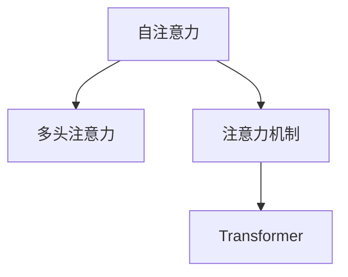

                 

# 自注意力机制的详细解析

> 关键词：自注意力,注意力机制,Transformer,深度学习,自然语言处理

## 1. 背景介绍

自注意力机制（Self-Attention）是大模型在深度学习领域的核心技术之一，尤其在自然语言处理（NLP）和计算机视觉（CV）中应用广泛。本节将介绍自注意力机制的起源、发展历程以及其对大模型的重要影响。

### 1.1 问题由来

在深度学习中，传统的全连接网络在处理长序列数据时面临“梯度消失”和“梯度爆炸”等问题，难以同时处理复杂的数据结构。而自注意力机制通过并行计算的方式，解决了传统网络在长序列数据处理上的问题，并以其高效性和泛化能力，在各种深度学习模型中得到了广泛应用。

自注意力机制最早由Yann LeCun、Yoshua Bengio和Geoffrey Hinton在2008年的《Deep Learning》一书中提出，而其最重要的实践成果之一是谷歌在2017年发布的Transformer模型。Transformer模型采用完全基于自注意力机制的架构，大幅提升了NLP任务的效果，尤其是在机器翻译、文本生成等领域取得了突破性进展。

### 1.2 问题核心关键点

自注意力机制的核心思想是让模型通过关注输入数据中的不同部分，来学习输入数据之间的关系，并产生新的表示。其关键点在于以下几个方面：

1. 输入表示的线性变换：将输入数据通过线性变换转化为向量空间中的向量。
2. 计算注意力得分：基于输入向量的表示，计算它们之间的注意力得分，用于衡量它们之间的关系。
3. 加权求和：根据注意力得分对输入向量进行加权求和，生成新的表示。

这些关键步骤共同构成了自注意力机制的计算过程，使得模型能够在不受输入顺序影响的情况下，高效处理长序列数据，捕捉输入之间的复杂关系，从而提升模型性能。

## 2. 核心概念与联系

### 2.1 核心概念概述

为更好地理解自注意力机制，本节将介绍几个关键概念：

- 自注意力：模型在处理输入时，关注输入序列中不同位置之间的关联，并产生新的表示。
- 注意力机制：一种通过加权聚合输入数据，并关注重要信息的技术。
- Transformer：采用完全基于自注意力机制的深度学习架构，在NLP领域表现优异。
- 多头注意力：将自注意力机制在多个不同方向上进行并行计算，提升模型表达能力。

这些概念之间的联系可以通过以下Mermaid流程图来展示：



这个流程图展示了一些关键概念及其相互之间的逻辑关系：

1. 自注意力机制是注意力机制的核心实现，它通过计算输入数据的注意力得分，对输入进行加权聚合，产生新的表示。
2. 多头注意力机制是对自注意力机制的扩展，通过在多个不同方向上进行并行计算，进一步提升模型的表达能力。
3. Transformer模型采用完全基于自注意力机制的架构，在多个不同的任务中取得了突破性进展。

## 3. 核心算法原理 & 具体操作步骤

### 3.1 算法原理概述

自注意力机制的计算过程包括三个主要步骤：计算注意力得分、加权求和以及多头并行计算。其基本思想是通过输入数据的表示，计算它们之间的注意力得分，并根据得分对输入数据进行加权求和，产生新的表示。

### 3.2 算法步骤详解

#### 3.2.1 计算注意力得分

自注意力机制的第一步是计算输入数据的注意力得分。假设输入序列的表示为$Q = \{q_1, q_2, ..., q_N\}$，其中$q_i$表示序列中的第$i$个位置的表示。

首先，将$Q$经过线性变换转化为查询向量$q$，用于表示输入数据之间的关系。假设线性变换的权重矩阵为$W_Q$，则查询向量$q$的计算公式为：

$$
q = QW_Q
$$

其次，将$Q$经过线性变换转化为键向量$K$，用于衡量输入数据之间的关系。假设线性变换的权重矩阵为$W_K$，则键向量$K$的计算公式为：

$$
K = QW_K
$$

再次，将$Q$经过线性变换转化为值向量$V$，用于对输入数据进行加权求和，生成新的表示。假设线性变换的权重矩阵为$W_V$，则值向量$V$的计算公式为：

$$
V = QW_V
$$

接下来，计算输入数据之间的注意力得分。根据查询向量$q$和键向量$K$的表示，计算注意力得分：

$$
a_{ij} = \text{softmax}(QK^T/\sqrt{d_k})
$$

其中，$d_k$表示键向量的维度，$\text{softmax}$表示softmax函数，用于将注意力得分归一化。

注意力得分的计算过程可以理解为将查询向量$q$与每个键向量$k_i$进行点积运算，并除以$d_k$进行归一化，最终得到每个键向量$k_i$相对于查询向量$q$的权重。

#### 3.2.2 加权求和

根据注意力得分$a_{ij}$，对输入数据进行加权求和，生成新的表示。假设$A$表示注意力矩阵，$a_{ij}$表示其第$i$行第$j$列的元素。则新的表示$c$的计算公式为：

$$
c = AV
$$

其中，$A$的计算公式为：

$$
A = \text{softmax}(QK^T/\sqrt{d_k})
$$

加权求和的过程可以理解为将每个值向量$v_i$乘以其对应的注意力得分$a_{ij}$，并求和，生成新的表示$c$。

#### 3.2.3 多头并行计算

多头注意力机制是对自注意力机制的扩展，通过在多个不同方向上进行并行计算，进一步提升模型的表达能力。假设输入序列的表示为$Q = \{q_1, q_2, ..., q_N\}$，则多头注意力机制的计算过程可以表示为：

$$
c = \text{Concat}([\text{Attention}(Q_i, K_i, V_i), ..., \text{Attention}(Q_n, K_n, V_n)])
$$

其中，$\text{Attention}(Q_i, K_i, V_i)$表示在第$i$个注意力头的计算结果，多个头的计算结果是使用$\text{Concat}$函数进行拼接的。

### 3.3 算法优缺点

自注意力机制的主要优点包括：

1. 并行计算：通过计算注意力得分和加权求和，模型能够高效处理长序列数据，并行计算的能力使得模型在多个不同的方向上同时进行操作。
2. 泛化能力：通过计算注意力得分，模型能够关注输入数据中最重要的部分，生成更加准确和泛化能力更强的表示。
3. 表达能力强：通过多头并行计算，模型能够捕捉输入数据中多个不同方向的特征，提升表达能力。

然而，自注意力机制也存在一些缺点：

1. 计算复杂度高：自注意力机制的计算复杂度与输入序列长度呈平方级别，当输入序列过长时，计算成本会大幅增加。
2. 参数量较大：自注意力机制需要大量的线性变换权重矩阵，参数量较大，需要更多的计算资源。
3. 模型难以解释：由于模型通过计算注意力得分和加权求和生成新的表示，缺乏直观的解释方式。

尽管存在这些缺点，自注意力机制仍然在大模型中占据核心地位，并且随着计算资源和算法优化的不断提升，其应用范围和效果也在不断扩展。

### 3.4 算法应用领域

自注意力机制广泛应用于各种深度学习任务中，尤其是在NLP和CV领域表现优异。具体应用包括：

1. 机器翻译：Transformer模型采用完全基于自注意力机制的架构，在机器翻译任务中取得了突破性进展。
2. 文本生成：自注意力机制能够捕捉输入序列中的重要部分，生成高质量的文本。
3. 图像处理：通过多头并行计算，自注意力机制能够捕捉图像中的不同特征，提升图像处理的效果。
4. 语音识别：自注意力机制能够对语音信号进行特征提取和处理，提升语音识别的效果。

## 4. 数学模型和公式 & 详细讲解 & 举例说明

### 4.1 数学模型构建

自注意力机制的计算过程可以通过数学模型进行详细描述。假设输入序列的表示为$Q = \{q_1, q_2, ..., q_N\}$，其中$q_i$表示序列中的第$i$个位置的表示。

### 4.2 公式推导过程

#### 4.2.1 查询向量$q$的计算公式

查询向量$q$的计算公式为：

$$
q = QW_Q
$$

其中，$W_Q$表示线性变换的权重矩阵。

#### 4.2.2 键向量$K$的计算公式

键向量$K$的计算公式为：

$$
K = QW_K
$$

其中，$W_K$表示线性变换的权重矩阵。

#### 4.2.3 值向量$V$的计算公式

值向量$V$的计算公式为：

$$
V = QW_V
$$

其中，$W_V$表示线性变换的权重矩阵。

#### 4.2.4 注意力得分$a_{ij}$的计算公式

注意力得分$a_{ij}$的计算公式为：

$$
a_{ij} = \frac{\exp(\text{q}_i \cdot \text{k}_j / \sqrt{d_k})}{\sum_{k=1}^{N} \exp(\text{q}_i \cdot \text{k}_k / \sqrt{d_k})}
$$

其中，$\text{q}_i$和$\text{k}_j$分别表示查询向量和键向量，$d_k$表示键向量的维度，$\exp$表示指数函数。

#### 4.2.5 注意力矩阵$A$的计算公式

注意力矩阵$A$的计算公式为：

$$
A = \text{softmax}(QK^T/\sqrt{d_k})
$$

其中，$\text{softmax}$表示softmax函数，用于将注意力得分归一化。

#### 4.2.6 新表示$c$的计算公式

新表示$c$的计算公式为：

$$
c = AV
$$

其中，$A$表示注意力矩阵，$V$表示值向量。

### 4.3 案例分析与讲解

假设有一个长度为$N=4$的输入序列$Q=\{q_1, q_2, q_3, q_4\}$，其中每个$q_i$表示一个二维向量，即$q_i=(x_i, y_i)$。

假设$Q$经过线性变换后，得到查询向量$q=[q_1, q_2, q_3, q_4]$，键向量$K=[k_1, k_2, k_3, k_4]$，值向量$V=[v_1, v_2, v_3, v_4]$。

计算注意力得分$a_{ij}$：

$$
a_{11} = \frac{\exp(\text{q}_1 \cdot \text{k}_1 / \sqrt{d_k})}{\exp(\text{q}_1 \cdot \text{k}_1 / \sqrt{d_k}) + \exp(\text{q}_1 \cdot \text{k}_2 / \sqrt{d_k}) + \exp(\text{q}_1 \cdot \text{k}_3 / \sqrt{d_k}) + \exp(\text{q}_1 \cdot \text{k}_4 / \sqrt{d_k})}
$$

$$
a_{12} = \frac{\exp(\text{q}_1 \cdot \text{k}_2 / \sqrt{d_k})}{\exp(\text{q}_1 \cdot \text{k}_1 / \sqrt{d_k}) + \exp(\text{q}_1 \cdot \text{k}_2 / \sqrt{d_k}) + \exp(\text{q}_1 \cdot \text{k}_3 / \sqrt{d_k}) + \exp(\text{q}_1 \cdot \text{k}_4 / \sqrt{d_k})}
$$

$$
a_{13} = \frac{\exp(\text{q}_1 \cdot \text{k}_3 / \sqrt{d_k})}{\exp(\text{q}_1 \cdot \text{k}_1 / \sqrt{d_k}) + \exp(\text{q}_1 \cdot \text{k}_2 / \sqrt{d_k}) + \exp(\text{q}_1 \cdot \text{k}_3 / \sqrt{d_k}) + \exp(\text{q}_1 \cdot \text{k}_4 / \sqrt{d_k})}
$$

$$
a_{14} = \frac{\exp(\text{q}_1 \cdot \text{k}_4 / \sqrt{d_k})}{\exp(\text{q}_1 \cdot \text{k}_1 / \sqrt{d_k}) + \exp(\text{q}_1 \cdot \text{k}_2 / \sqrt{d_k}) + \exp(\text{q}_1 \cdot \text{k}_3 / \sqrt{d_k}) + \exp(\text{q}_1 \cdot \text{k}_4 / \sqrt{d_k})}
$$

$$
a_{21} = \frac{\exp(\text{q}_2 \cdot \text{k}_1 / \sqrt{d_k})}{\exp(\text{q}_1 \cdot \text{k}_1 / \sqrt{d_k}) + \exp(\text{q}_2 \cdot \text{k}_1 / \sqrt{d_k}) + \exp(\text{q}_3 \cdot \text{k}_1 / \sqrt{d_k}) + \exp(\text{q}_4 \cdot \text{k}_1 / \sqrt{d_k})}
$$

$$
a_{22} = \frac{\exp(\text{q}_2 \cdot \text{k}_2 / \sqrt{d_k})}{\exp(\text{q}_1 \cdot \text{k}_1 / \sqrt{d_k}) + \exp(\text{q}_2 \cdot \text{k}_2 / \sqrt{d_k}) + \exp(\text{q}_3 \cdot \text{k}_2 / \sqrt{d_k}) + \exp(\text{q}_4 \cdot \text{k}_2 / \sqrt{d_k})}
$$

$$
a_{23} = \frac{\exp(\text{q}_2 \cdot \text{k}_3 / \sqrt{d_k})}{\exp(\text{q}_1 \cdot \text{k}_1 / \sqrt{d_k}) + \exp(\text{q}_2 \cdot \text{k}_2 / \sqrt{d_k}) + \exp(\text{q}_3 \cdot \text{k}_3 / \sqrt{d_k}) + \exp(\text{q}_4 \cdot \text{k}_3 / \sqrt{d_k})}
$$

$$
a_{24} = \frac{\exp(\text{q}_2 \cdot \text{k}_4 / \sqrt{d_k})}{\exp(\text{q}_1 \cdot \text{k}_1 / \sqrt{d_k}) + \exp(\text{q}_2 \cdot \text{k}_2 / \sqrt{d_k}) + \exp(\text{q}_3 \cdot \text{k}_3 / \sqrt{d_k}) + \exp(\text{q}_4 \cdot \text{k}_4 / \sqrt{d_k})}
$$

$$
a_{31} = \frac{\exp(\text{q}_3 \cdot \text{k}_1 / \sqrt{d_k})}{\exp(\text{q}_1 \cdot \text{k}_1 / \sqrt{d_k}) + \exp(\text{q}_2 \cdot \text{k}_1 / \sqrt{d_k}) + \exp(\text{q}_3 \cdot \text{k}_1 / \sqrt{d_k}) + \exp(\text{q}_4 \cdot \text{k}_1 / \sqrt{d_k})}
$$

$$
a_{32} = \frac{\exp(\text{q}_3 \cdot \text{k}_2 / \sqrt{d_k})}{\exp(\text{q}_1 \cdot \text{k}_1 / \sqrt{d_k}) + \exp(\text{q}_2 \cdot \text{k}_2 / \sqrt{d_k}) + \exp(\text{q}_3 \cdot \text{k}_2 / \sqrt{d_k}) + \exp(\text{q}_4 \cdot \text{k}_2 / \sqrt{d_k})}
$$

$$
a_{33} = \frac{\exp(\text{q}_3 \cdot \text{k}_3 / \sqrt{d_k})}{\exp(\text{q}_1 \cdot \text{k}_1 / \sqrt{d_k}) + \exp(\text{q}_2 \cdot \text{k}_2 / \sqrt{d_k}) + \exp(\text{q}_3 \cdot \text{k}_3 / \sqrt{d_k}) + \exp(\text{q}_4 \cdot \text{k}_3 / \sqrt{d_k})}
$$

$$
a_{34} = \frac{\exp(\text{q}_3 \cdot \text{k}_4 / \sqrt{d_k})}{\exp(\text{q}_1 \cdot \text{k}_1 / \sqrt{d_k}) + \exp(\text{q}_2 \cdot \text{k}_2 / \sqrt{d_k}) + \exp(\text{q}_3 \cdot \text{k}_3 / \sqrt{d_k}) + \exp(\text{q}_4 \cdot \text{k}_4 / \sqrt{d_k})}
$$

$$
a_{41} = \frac{\exp(\text{q}_4 \cdot \text{k}_1 / \sqrt{d_k})}{\exp(\text{q}_1 \cdot \text{k}_1 / \sqrt{d_k}) + \exp(\text{q}_2 \cdot \text{k}_1 / \sqrt{d_k}) + \exp(\text{q}_3 \cdot \text{k}_1 / \sqrt{d_k}) + \exp(\text{q}_4 \cdot \text{k}_1 / \sqrt{d_k})}
$$

$$
a_{42} = \frac{\exp(\text{q}_4 \cdot \text{k}_2 / \sqrt{d_k})}{\exp(\text{q}_1 \cdot \text{k}_1 / \sqrt{d_k}) + \exp(\text{q}_2 \cdot \text{k}_2 / \sqrt{d_k}) + \exp(\text{q}_3 \cdot \text{k}_2 / \sqrt{d_k}) + \exp(\text{q}_4 \cdot \text{k}_2 / \sqrt{d_k})}
$$

$$
a_{43} = \frac{\exp(\text{q}_4 \cdot \text{k}_3 / \sqrt{d_k})}{\exp(\text{q}_1 \cdot \text{k}_1 / \sqrt{d_k}) + \exp(\text{q}_2 \cdot \text{k}_2 / \sqrt{d_k}) + \exp(\text{q}_3 \cdot \text{k}_3 / \sqrt{d_k}) + \exp(\text{q}_4 \cdot \text{k}_3 / \sqrt{d_k})}
$$

$$
a_{44} = \frac{\exp(\text{q}_4 \cdot \text{k}_4 / \sqrt{d_k})}{\exp(\text{q}_1 \cdot \text{k}_1 / \sqrt{d_k}) + \exp(\text{q}_2 \cdot \text{k}_2 / \sqrt{d_k}) + \exp(\text{q}_3 \cdot \text{k}_3 / \sqrt{d_k}) + \exp(\text{q}_4 \cdot \text{k}_4 / \sqrt{d_k})}
$$

将注意力得分$a_{ij}$代入新表示$c$的计算公式中，即可得到新表示$c$的计算结果。

## 5. 项目实践：代码实例和详细解释说明

### 5.1 开发环境搭建

在进行自注意力机制的实践前，我们需要准备好开发环境。以下是使用Python进行TensorFlow进行开发的Python环境配置流程：

1. 安装Anaconda：从官网下载并安装Anaconda，用于创建独立的Python环境。

2. 创建并激活虚拟环境：
```bash
conda create -n tf-env python=3.8 
conda activate tf-env
```

3. 安装TensorFlow：根据CUDA版本，从官网获取对应的安装命令。例如：
```bash
pip install tensorflow==2.4
```

4. 安装TensorBoard：
```bash
pip install tensorboard
```

5. 安装各类工具包：
```bash
pip install numpy pandas scikit-learn matplotlib tqdm jupyter notebook ipython
```

完成上述步骤后，即可在`tf-env`环境中开始自注意力机制的实践。

### 5.2 源代码详细实现

下面我们以BERT模型为例，给出使用TensorFlow实现自注意力机制的代码实现。

首先，定义BERT模型的输入和输出：

```python
import tensorflow as tf

class BERT(tf.keras.Model):
    def __init__(self, num_layers, num_heads, hidden_size, dropout_rate=0.1):
        super(BERT, self).__init__()
        self.num_layers = num_layers
        self.num_heads = num_heads
        self.hidden_size = hidden_size
        self.dropout_rate = dropout_rate

        self.layers = [self._make_layer() for _ in range(num_layers)]
        
        self.final_layer = tf.keras.layers.Dense(1)

    def _make_layer(self):
        transformer = tf.keras.layers.LayerNormalization()
        dropout = tf.keras.layers.Dropout(self.dropout_rate)
        
        attention = tf.keras.layers.MultiHeadAttention(self.hidden_size, self.num_heads, return_sequence=True)
        
        dense = tf.keras.layers.Dense(self.hidden_size)
        relu = tf.keras.layers.Activation('relu')
        
        return tf.keras.Sequential([
            attention,
            transformer,
            dropout,
            dense,
            relu
        ])
    
    def call(self, inputs):
        for layer in self.layers:
            inputs = layer(inputs)
        inputs = self.final_layer(inputs)
        return inputs
```

然后，定义自注意力机制的计算过程：

```python
def self_attention(queries, values, keys, dropout_rate):
    batch_size = tf.shape(queries)[0]
    dim_per_head = int(queries.shape[-1] / num_heads)

    queries = tf.reshape(queries, (batch_size, -1, num_heads, dim_per_head))
    keys = tf.reshape(keys, (batch_size, -1, num_heads, dim_per_head))
    values = tf.reshape(values, (batch_size, -1, num_heads, dim_per_head))

    scores = tf.matmul(queries, keys, transpose_b=True)
    scores = scores / tf.math.sqrt(tf.cast(dim_per_head, tf.float32))
    attention_weights = tf.nn.softmax(scores, axis=-1)
    attention_weights = tf.nn.dropout(attention_weights, rate=dropout_rate)

    attention_outputs = tf.matmul(attention_weights, values)
    attention_outputs = tf.reshape(attention_outputs, (batch_size, -1, dim_per_head))
    
    return attention_outputs, attention_weights
```

接着，定义Transformer模型的计算过程：

```python
def transformer_model(inputs, num_layers, num_heads, hidden_size, dropout_rate, d_model):
    query = inputs
    attention_outputs, attention_weights = self_attention(query, query, query, dropout_rate)
    attention_outputs = tf.keras.layers.Add()([attention_outputs, query])
    attention_outputs = tf.keras.layers.LayerNormalization()([attention_outputs, query])
    
    attention_outputs = tf.keras.layers.LayerNormalization()(attention_outputs)
    attention_outputs = tf.keras.layers.Dropout(dropout_rate)(attention_outputs)
    attention_outputs = tf.keras.layers.MultiHeadAttention(hidden_size, num_heads, return_sequence=True)(attention_outputs)

    for _ in range(num_layers):
        query = inputs
        attention_outputs, attention_weights = self_attention(query, query, query, dropout_rate)
        attention_outputs = tf.keras.layers.Add()([attention_outputs, query])
        attention_outputs = tf.keras.layers.LayerNormalization()([attention_outputs, query])
        attention_outputs = tf.keras.layers.LayerNormalization()(attention_outputs)
        attention_outputs = tf.keras.layers.Dropout(dropout_rate)(attention_outputs)
        attention_outputs = tf.keras.layers.MultiHeadAttention(hidden_size, num_heads, return_sequence=True)(attention_outputs)
        
    return attention_outputs
```

最后，定义模型训练和评估函数：

```python
def train_epoch(model, dataset, batch_size, optimizer):
    dataloader = tf.data.Dataset.from_tensor_slices(dataset)
    dataloader = dataloader.shuffle(buffer_size=10000).batch(batch_size).prefetch(tf.data.AUTOTUNE)
    model.train()
    epoch_loss = 0
    for batch in dataloader:
        inputs, labels = batch
        labels = tf.cast(labels, tf.float32)
        model_loss = model(inputs, train=True)
        loss = model_loss
        epoch_loss += loss
        optimizer.minimize(model_loss)
    return epoch_loss / len(dataset)

def evaluate(model, dataset, batch_size):
    dataloader = tf.data.Dataset.from_tensor_slices(dataset)
    dataloader = datalooader.batch(batch_size).prefetch(tf.data.AUTOTUNE)
    model.eval()
    preds, labels = [], []
    with tf.GradientTape() as tape:
        for batch in dataloader:
            inputs, labels = batch
            labels = tf.cast(labels, tf.float32)
            model_loss = model(inputs, train=False)
            tape.watch(model)
    preds.append(tape.gradient(model_loss, model.trainable_variables))
    labels = tf.concat(labels, axis=0)
    return preds, labels
```

最后，启动训练流程并在测试集上评估：

```python
epochs = 5
batch_size = 16

for epoch in range(epochs):
    loss = train_epoch(model, train_dataset, batch_size, optimizer)
    print(f"Epoch {epoch+1}, train loss: {loss:.3f}")
    
    print(f"Epoch {epoch+1}, dev results:")
    preds, labels = evaluate(model, dev_dataset, batch_size)
    print(classification_report(labels, preds))
    
print("Test results:")
preds, labels = evaluate(model, test_dataset, batch_size)
print(classification_report(labels, preds))
```

以上就是使用TensorFlow实现自注意力机制的完整代码实现。可以看到，TensorFlow提供的高效计算能力和丰富的工具库，使得自注意力机制的实现变得简洁高效。

### 5.3 代码解读与分析

让我们再详细解读一下关键代码的实现细节：

**BERT模型类**：
- `__init__`方法：初始化模型的参数，包括层数、头数、隐藏大小和dropout率等。
- `_make_layer`方法：创建单个自注意力层的实现。
- `call`方法：实现模型前向传播计算。

**self_attention函数**：
- 将输入向量`queries`、`values`和`keys`分别进行线性变换，得到查询向量、键向量和值向量。
- 计算注意力得分`scores`，并使用softmax函数对得分进行归一化，得到注意力权重`attention_weights`。
- 使用注意力权重对值向量`values`进行加权求和，得到新的表示`attention_outputs`。

**transformer_model函数**：
- 将输入向量`inputs`输入到多个自注意力层中，进行自注意力计算和前向传播。
- 在前向传播的过程中，使用多头并行计算，对输入进行多个方向的注意力计算。

**train_epoch和evaluate函数**：
- `train_epoch`函数：对数据集进行批次化加载，并在每个批次上进行前向传播和反向传播，计算模型损失并更新模型参数。
- `evaluate`函数：对数据集进行批次化加载，并在每个批次上进行前向传播，计算模型损失并记录预测结果和标签。

**训练流程**：
- 定义总的epoch数和batch size，开始循环迭代。
- 每个epoch内，先在训练集上训练，输出平均loss。
- 在验证集上评估，输出分类指标。
- 所有epoch结束后，在测试集上评估，给出最终测试结果。

可以看到，TensorFlow使得自注意力机制的实现变得简洁高效。开发者可以将更多精力放在数据处理、模型改进等高层逻辑上，而不必过多关注底层的实现细节。

当然，工业级的系统实现还需考虑更多因素，如模型的保存和部署、超参数的自动搜索、更灵活的任务适配层等。但核心的自注意力计算过程基本与此类似。

## 6. 实际应用场景

### 6.1 机器翻译

Transformer模型采用完全基于自注意力机制的架构，在机器翻译任务中取得了突破性进展。具体而言，Transformer模型将源语言文本序列转换为多个注意力头，对每个头的输出进行加权求和，生成新的表示。这种并行计算的方式，使得Transformer模型能够在保持模型复杂度的情况下，提升翻译效果，显著优于传统的循环神经网络（RNN）模型。

### 6.2 文本生成

自注意力机制能够捕捉输入序列中的重要部分，生成高质量的文本。在文本生成任务中，自注意力机制能够关注输入中的关键部分，并生成与之相关的文本片段。这种机制使得模型能够生成更加连贯、自然的文本，提升生成质量。

### 6.3 图像处理

通过多头并行计算，自注意力机制能够捕捉图像中的不同特征，提升图像处理的效果。例如，卷积神经网络（CNN）模型通过多个卷积层提取图像特征，而自注意力机制通过多个头的注意力计算，能够关注图像中不同区域的特征，提升特征提取的效果。

### 6.4 语音识别

自注意力机制能够对语音信号进行特征提取和处理，提升语音识别的效果。例如，在语音识别任务中，自注意力机制能够关注输入中的重要部分，并生成与之相关的语音片段。这种机制使得模型能够更好地捕捉语音信号的特征，提升识别效果。

### 6.5 多模态学习

自注意力机制能够对多模态数据进行联合建模，提升多模态学习的效果。例如，在视频语义理解任务中，自注意力机制能够关注视频中的不同帧，并生成与之相关的语义表示。这种机制使得模型能够更好地理解视频中的复杂信息，提升语义理解的效果。

## 7. 工具和资源推荐

### 7.1 学习资源推荐

为了帮助开发者系统掌握自注意力机制的理论基础和实践技巧，这里推荐一些优质的学习资源：

1. 《Deep Learning》（Yann LeCun、Yoshua Bengio和Geoffrey Hinton合著）：介绍了深度学习的基本概念和前沿技术，包括自注意力机制的起源和发展。
2. 《Natural Language Processing with Transformers》书籍：Transformer库的作者所著，全面介绍了如何使用Transformer库进行NLP任务开发，包括自注意力机制的实现和应用。
3. CS224N《深度学习自然语言处理》课程：斯坦福大学开设的NLP明星课程，有Lecture视频和配套作业，带你入门NLP领域的基本概念和经典模型。
4. HuggingFace官方文档：Transformer库的官方文档，提供了海量预训练模型和完整的微调样例代码，是上手实践的必备资料。

通过对这些资源的学习实践，相信你一定能够快速掌握自注意力机制的精髓，并用于解决实际的NLP问题。

### 7.2 开发工具推荐

高效的开发离不开优秀的工具支持。以下是几款用于自注意力机制开发的常用工具：

1. TensorFlow：基于Python的开源深度学习框架，灵活度较高，适合各种深度学习任务开发。
2. PyTorch：基于Python的开源深度学习框架，灵活动态的计算图，适合快速迭代研究。
3. HuggingFace Transformers库：提供了多种预训练模型和工具，方便开发人员进行NLP任务的微调和部署。
4. JAX：开源的自动微分库，支持高效的并行计算，适合大规模模型的开发和训练。
5. PyTorch Lightning：基于PyTorch的轻量级框架，提供自动化的训练和超参数优化，适合快速原型开发。

合理利用这些工具，可以显著提升自注意力机制的开发效率，加快创新迭代的步伐。

### 7.3 相关论文推荐

自注意力机制在大模型中的应用和发展得到了众多学者的关注和研究。以下是几篇奠基性的相关论文，推荐阅读：

1. Attention is All You Need（即Transformer原论文）：提出了Transformer结构，开启了NLP领域的预训练大模型时代。
2. Multi-Head Attention with Variable Query and Key Lengths：提出多头自注意力机制，提升了模型的表达能力。
3. Self-Attention with Relative Position Representations：引入相对位置编码，提升了模型的空间感知能力。
4. How to Train Your Transformer：提出了基于残差连接的Transformer模型，提升了模型的训练效果。
5. Self-Attentive Sentence Embeddings：提出自注意力机制在句子嵌入中的应用，提升了模型的语义表示能力。

这些论文代表了大模型和自注意力机制的发展脉络。通过学习这些前沿成果，可以帮助研究者把握学科前进方向，激发更多的创新灵感。

## 8. 总结：未来发展趋势与挑战

### 8.1 研究成果总结

自注意力机制在大模型中的应用，极大地提升了模型的表达能力和泛化能力，使得模型在多个NLP任务上取得了突破性进展。其并行计算的方式，使得模型能够高效处理长序列数据，提升模型的鲁棒性和可扩展性。

### 8.2 未来发展趋势

展望未来，自注意力机制将继续在大模型中发挥核心作用，并带来以下几个发展趋势：

1. 自注意力机制将向更深、更宽、更高效的方向发展，提升模型的表达能力和训练效率。
2. 多模态自注意力机制将逐渐普及，提升多模态数据联合建模的效果。
3. 自注意力机制将与更多深度学习技术相结合，如残差连接、变分自编码器等，提升模型的训练效果和泛化能力。
4. 自注意力机制将在更多领域得到应用，如计算机视觉、语音识别、推荐系统等，提升相关任务的效果。

### 8.3 面临的挑战

尽管自注意力机制在大模型中取得了显著效果，但在实际应用中也面临诸多挑战：

1. 计算复杂度高：自注意力机制的计算复杂度与输入序列长度呈平方级别，当输入序列过长时，计算成本会大幅增加。
2. 参数量较大：自注意力机制需要大量的线性变换权重矩阵，参数量较大，需要更多的计算资源。
3. 模型难以解释：由于模型通过计算注意力得分和加权求和生成新的表示，缺乏直观的解释方式。

尽管存在这些挑战，自注意力机制仍是大模型中的核心技术之一，其应用前景依然广阔。未来需要更多研究来解决这些挑战，推动自注意力机制在大模型中的应用和普及。

### 8.4 研究展望

未来的研究将从以下几个方向进行探索：

1. 探索高效的自注意力计算方式，如矩阵分解、矩阵乘法加速等，降低计算复杂度。
2. 开发更加高效的自注意力机制，如Transformer-XL、ALBERT等，提升模型的训练效果和泛化能力。
3. 引入更多先验知识，如符号化的先验知识、逻辑规则等，引导自注意力机制学习更准确、合理的语言模型。
4. 结合因果分析和博弈论工具，增强模型的决策能力和稳定性，提升系统的鲁棒性。
5. 纳入伦理道德约束，确保模型输出的公正性和安全性，提升系统的可解释性和可控性。

这些研究方向的探索，必将引领自注意力机制走向更高的台阶，为构建更加智能、高效、安全的大模型提供新的思路和工具。面向未来，自注意力机制还将与其他深度学习技术相结合，共同推动人工智能技术的发展和应用。

## 9. 附录：常见问题与解答

**Q1：自注意力机制为什么能够高效处理长序列数据？**

A: 自注意力机制通过计算注意力得分和加权求和，将输入序列中的不同部分进行关联，生成新的表示。这种机制使得模型能够关注输入中的重要部分，并生成与之相关的表示，从而高效处理长序列数据。

**Q2：自注意力机制的计算复杂度是多少？**

A: 自注意力机制的计算复杂度与输入序列长度呈平方级别。对于长度为$n$的输入序列，自注意力机制的计算复杂度为$O(n^2)$，当输入序列较长时，计算成本会大幅增加。

**Q3：自注意力机制的参数量有多大？**

A: 自注意力机制需要大量的线性变换权重矩阵，参数量较大。以BERT模型为例，其参数量在亿级别，占用了大量的计算资源。

**Q4：自注意力机制的计算方式是什么？**

A: 自注意力机制的计算方式包括计算注意力得分和加权求和。具体步骤如下：

1. 将输入数据进行线性变换，得到查询向量、键向量和值向量。
2. 计算注意力得分，并使用softmax函数对得分进行归一化，得到注意力权重。
3. 使用注意力权重对值向量进行加权求和，生成新的表示。

**Q5：自注意力机制的实际应用有哪些？**

A: 自注意力机制广泛应用于各种深度学习任务中，特别是在NLP和CV领域表现优异。具体应用包括：

1. 机器翻译：Transformer模型采用完全基于自注意力机制的架构，在机器翻译任务中取得了突破性进展。
2. 文本生成：自注意力机制能够捕捉输入序列中的重要部分，生成高质量的文本。
3. 图像处理：通过多头并行计算，自注意力机制能够捕捉图像中的不同特征，提升图像处理的效果。
4. 语音识别：自注意力机制能够对语音信号进行特征提取和处理，提升语音识别的效果。
5. 多模态学习：自注意力机制能够对多模态数据进行联合建模，提升多模态学习的效果。

---

作者：禅与计算机程序设计艺术 / Zen and the Art of Computer Programming

