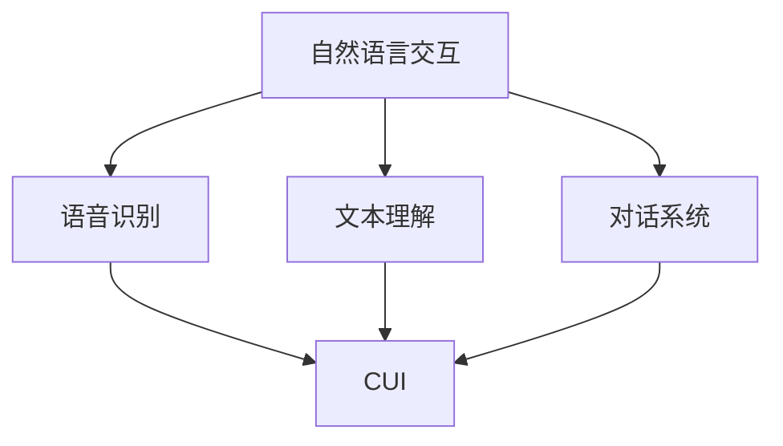

                 

# 自然语言交互在CUI中的详细优势

## 1. 背景介绍

### 1.1 问题由来
随着人工智能技术的迅速发展，自然语言交互(Natural Language Interaction, NLI)在计算用户界面(Computing User Interface, CUI)中的应用日益广泛，从智能助手到虚拟客服，从智能家居到车载系统，自然语言交互技术正逐步渗透到人类生活的各个方面。然而，传统的用户界面多为基于图形界面的交互方式，如窗口、菜单、图标等，用户需要记忆和操作复杂的界面操作流程，且交互效率较低。自然语言交互技术的引入，使得用户可以通过语音或文本命令直接与机器进行互动，极大地提升了用户体验和交互效率。

### 1.2 问题核心关键点
自然语言交互在CUI中的应用，主要体现在以下几个方面：
1. **用户友好性**：自然语言交互使用自然语言进行命令输入，减少了用户对于复杂界面操作的记忆负担。
2. **交互效率**：自然语言交互支持语音识别和文本输入，提供了更快捷、更自然的信息输入方式。
3. **多模态融合**：结合图像、声音、文本等多种信息，提供更丰富、更全面的信息输入和反馈方式。
4. **上下文理解**：通过理解用户的历史交互记录和上下文信息，提供更加个性化、智能化的服务。
5. **动态响应**：能够即时响应用户指令，支持交互式的对话流程。

### 1.3 问题研究意义
自然语言交互在CUI中的应用，有助于提升人机交互的智能性和自然性，使得用户与机器的交互更加流畅、高效。以下是自然语言交互技术在CUI中的几个主要优势：

1. **提升用户满意度**：通过自然语言交互，用户能够以更自然、更便捷的方式与机器交流，从而提升用户的满意度和使用体验。
2. **提高工作效率**：自然语言交互可以自动处理大量重复性工作，减少人工操作，提高工作效率。
3. **促进创新发展**：自然语言交互技术为CUI的创新应用提供了新的可能，推动了各行各业的信息化进程。
4. **增强安全性**：自然语言交互能够自动识别和处理用户指令，降低误操作的风险。
5. **强化个性化**：通过上下文理解和个性化推荐，自然语言交互技术能够提供更加精准的服务。

## 2. 核心概念与联系

### 2.1 核心概念概述

为了更好地理解自然语言交互在CUI中的应用，本节将介绍几个密切相关的核心概念：

- **自然语言交互(NLI)**：指计算机系统能够通过自然语言理解用户的意图和需求，并能够使用自然语言与用户进行交流的技术。
- **计算用户界面(CUI)**：指通过计算机软件实现的，用户与计算机交互的界面，包括图形界面和自然语言界面。
- **语音识别**：将语音信号转换为文本的过程，是自然语言交互的重要组成部分。
- **文本理解**：将自然语言文本转换为计算机可理解的信息，是自然语言交互的基础。
- **对话系统**：基于自然语言交互构建的系统，能够实现人机对话，为用户提供智能化的服务。

这些核心概念之间的逻辑关系可以通过以下Mermaid流程图来展示：



这个流程图展示了大语言模型的工作原理和逻辑关系：

1. 用户通过自然语言输入指令。
2. 语音识别将语音信号转换为文本。
3. 文本理解将文本转换为计算机可处理的信息。
4. 对话系统根据理解结果生成回复，并通过语音或文本形式输出。
5. 自然语言交互技术最终通过CUI显示给用户。

## 3. 核心算法原理 & 具体操作步骤
### 3.1 算法原理概述

自然语言交互在CUI中的应用，涉及语音识别、文本理解、对话系统等多个核心技术。其核心思想是：通过自然语言处理技术，实现用户与计算机的智能化交互。

形式化地，假设用户输入的自然语言指令为 $u$，计算机能够理解并响应的自然语言输出为 $r$。自然语言交互的目标是找到一个映射函数 $f(u)$，使得 $f(u) = r$，即：

$$
f(u) = r
$$

其中 $f$ 为自然语言理解函数，将自然语言转换为计算机可理解的表示。常见的自然语言理解技术包括分词、命名实体识别、依存句法分析等。

### 3.2 算法步骤详解

自然语言交互在CUI中的应用，主要包括以下几个关键步骤：

**Step 1: 准备自然语言交互系统**

- 选择合适的自然语言处理库，如NLTK、spaCy、HuggingFace等。
- 准备自然语言交互数据集，包括对话历史、文本、语音等数据。
- 设计对话系统架构，如使用规则型对话系统、基于深度学习的对话系统等。

**Step 2: 语音识别和文本理解**

- 使用语音识别技术将用户的语音指令转换为文本。
- 使用文本理解技术将文本指令转换为计算机可理解的形式。

**Step 3: 对话管理**

- 根据用户输入的指令，选择相应的响应。
- 管理对话状态，保存对话历史信息。
- 支持对话流程控制，如上下文理解、状态跟踪、多轮对话等。

**Step 4: 生成自然语言响应**

- 根据对话管理模块的结果，生成自然语言响应。
- 使用语音合成技术将文本响应转换为语音输出。

**Step 5: 交互反馈**

- 将生成的自然语言响应反馈给用户。
- 根据用户的反馈，不断优化和改进自然语言交互系统。

以上是自然语言交互在CUI中的一般流程。在实际应用中，还需要根据具体场景对各环节进行优化设计，如改进语音识别算法、优化文本理解模型、提高对话系统的准确性和响应速度等，以进一步提升自然语言交互的效果。

### 3.3 算法优缺点

自然语言交互在CUI中的应用，具有以下优点：
1. 提升用户满意度：自然语言交互使得用户能够以更自然、更便捷的方式与计算机交流，从而提升用户的满意度和使用体验。
2. 提高工作效率：自然语言交互可以自动处理大量重复性工作，减少人工操作，提高工作效率。
3. 促进创新发展：自然语言交互技术为CUI的创新应用提供了新的可能，推动了各行各业的信息化进程。
4. 增强安全性：自然语言交互能够自动识别和处理用户指令，降低误操作的风险。
5. 强化个性化：通过上下文理解和个性化推荐，自然语言交互技术能够提供更加精准的服务。

同时，该方法也存在一定的局限性：
1. 依赖语音和文本质量：自然语言交互的效果很大程度上依赖于语音和文本的质量，如口音、噪音、误识别等。
2. 对话系统复杂：自然语言交互的对话系统设计复杂，需要处理多轮对话、上下文理解等，技术实现难度较高。
3. 交互环境受限：自然语言交互需要稳定的网络连接和设备支持，难以在离线环境中使用。
4. 数据隐私风险：自然语言交互涉及用户隐私数据，如语音、文本等，数据安全和隐私保护问题需引起重视。
5. 技术成本较高：自然语言交互涉及语音识别、文本理解、对话管理等多项技术，开发和维护成本较高。

尽管存在这些局限性，但就目前而言，自然语言交互在CUI中的应用已展现出强大的潜力和优势。未来相关研究的重点在于如何进一步提高自然语言交互的准确性、响应速度、个性化程度等，同时兼顾可解释性和数据隐私保护等伦理问题。

### 3.4 算法应用领域

自然语言交互在CUI中的应用，涵盖了多个领域：

1. **智能客服**：通过自然语言交互技术，构建智能客服系统，实现自动应答和客户管理。
2. **智能家居**：结合语音识别和文本理解，实现智能家居设备的语音控制和智能交互。
3. **车载系统**：在车载系统中集成自然语言交互技术，实现语音控制、导航、信息查询等功能。
4. **智能助手**：开发智能助手应用，提供日程管理、信息检索、购物推荐等服务。
5. **智能办公**：在企业办公系统中集成自然语言交互技术，提高办公效率，支持语音输入、文本处理等功能。
6. **智能医疗**：在医疗系统中集成自然语言交互技术，实现电子病历记录、医疗咨询等功能。
7. **智能金融**：在金融系统中集成自然语言交互技术，提供智能理财、客户服务等功能。

除了上述这些经典应用场景外，自然语言交互技术还在更多领域展现出广阔的应用前景，如智能教育、智能交通、智能旅游等，为各行各业带来新的变化和发展。

## 4. 数学模型和公式 & 详细讲解 & 举例说明

### 4.1 数学模型构建

本节将使用数学语言对自然语言交互在CUI中的应用进行更加严格的刻画。

假设用户输入的自然语言指令为 $u$，计算机能够理解并响应的自然语言输出为 $r$。自然语言交互的目标是找到一个映射函数 $f(u)$，使得 $f(u) = r$，即：

$$
f(u) = r
$$

其中 $f$ 为自然语言理解函数，将自然语言转换为计算机可理解的表示。常见的自然语言理解技术包括分词、命名实体识别、依存句法分析等。

### 4.2 公式推导过程

以下我们以命名实体识别(Named Entity Recognition, NER)任务为例，推导自然语言交互在CUI中的应用过程。

假设输入的自然语言指令为 $u = "Where is the nearest hospital?"$，自然语言交互的目标是识别出其中的人名、地名、组织机构名等实体。任务的定义为：

$$
f(u) = \{(e_1, t_1), (e_2, t_2), ..., (e_n, t_n)\}
$$

其中 $e_i$ 为第 $i$ 个实体，$t_i$ 为其对应的实体类型。例如，$u$ 中的 "hospital" 应被识别为地名。

将 $u$ 输入到自然语言处理模型 $M$ 中，得到模型输出 $y$，模型 $M$ 将 $u$ 转换为一个向量表示 $\overrightarrow{u}$，即：

$$
y = M(u) = \overrightarrow{u}
$$

然后，使用NER模型 $N$ 对向量 $\overrightarrow{u}$ 进行实体识别，得到实体序列 $e_1, e_2, ..., e_n$ 及其类型序列 $t_1, t_2, ..., t_n$，即：

$$
(e_1, t_1), (e_2, t_2), ..., (e_n, t_n) = N(\overrightarrow{u})
$$

根据实体识别结果，自然语言交互系统生成相应的自然语言响应 $r$，例如：

$$
r = "The nearest hospital is at [e_1]."
$$

其中 $[e_1]$ 表示从实体识别结果中获取的实体信息。

### 4.3 案例分析与讲解

以下是一个使用自然语言交互技术实现智能客服系统对话的示例。

假设客服系统接收到用户输入的自然语言指令 $u = "I need to book a flight to New York next week."$。客服系统首先使用语音识别技术将指令转换为文本：

$$
u = "I need to book a flight to New York next week."
$$

然后，将指令输入到自然语言理解模型中，生成模型输出 $y$：

$$
y = M(u) = \overrightarrow{u}
$$

接着，使用NER模型对 $y$ 进行实体识别，得到实体序列 $e_1, e_2, ..., e_n$ 及其类型序列 $t_1, t_2, ..., t_n$：

$$
(e_1, t_1), (e_2, t_2) = N(\overrightarrow{u}) = ("flight", "交通工具")
$$

根据实体识别结果，自然语言交互系统生成相应的自然语言响应 $r$：

$$
r = "I can help you book a flight. Please provide your travel date and preferred departure time."
$$

用户收到响应后，继续输入指令，完成机票预订流程。

## 5. 项目实践：代码实例和详细解释说明

### 5.1 开发环境搭建

在进行自然语言交互实践前，我们需要准备好开发环境。以下是使用Python进行自然语言交互开发的环境配置流程：

1. 安装Anaconda：从官网下载并安装Anaconda，用于创建独立的Python环境。

2. 创建并激活虚拟环境：
```bash
conda create -n nli-env python=3.8 
conda activate nli-env
```

3. 安装必要的Python库：
```bash
pip install numpy pandas scikit-learn nltk transformers
```

4. 安装自然语言处理库：
```bash
pip install spacy
```

5. 安装语音识别库：
```bash
pip install SpeechRecognition
```

完成上述步骤后，即可在`nli-env`环境中开始自然语言交互实践。

### 5.2 源代码详细实现

下面我们以命名实体识别(NER)任务为例，给出使用Python进行自然语言交互的代码实现。

首先，定义NER任务的数据处理函数：

```python
import spacy

def process_text(text):
    nlp = spacy.load('en_core_web_sm')
    doc = nlp(text)
    entities = [(e.text, e.label_) for e in doc.ents]
    return entities

# 示例输入文本
text = "I need to book a flight to New York next week."
entities = process_text(text)
print(entities)
```

然后，使用SpeechRecognition库实现语音识别功能：

```python
import speech_recognition as sr

def recognize_speech():
    r = sr.Recognizer()
    with sr.Microphone() as source:
        print("Say something!")
        audio = r.listen(source)
    try:
        text = r.recognize_google(audio)
        return text
    except sr.UnknownValueError:
        return "Unable to understand audio"
    except sr.RequestError as e:
        return "Could not request results; {0}".format(e)

# 示例语音识别
text = recognize_speech()
print(text)
```

最后，结合语音识别和文本处理，实现自然语言交互的完整流程：

```python
while True:
    text = recognize_speech()
    if text == "exit":
        break
    entities = process_text(text)
    response = f"Sure, I can help you with that. Can you please provide your travel date and preferred departure time?"
    print(response)
```

以上就是使用Python实现自然语言交互的完整代码实例。可以看到，通过结合语音识别和文本处理技术，可以轻松构建一个基本的自然语言交互系统。

### 5.3 代码解读与分析

让我们再详细解读一下关键代码的实现细节：

**process_text函数**：
- 加载英文自然语言处理模型 `spacy.load('en_core_web_sm')`。
- 对输入文本进行分词和命名实体识别，将识别结果转换为 `(entity.text, entity.label_)` 的元组序列。
- 返回识别出的实体序列。

**recognize_speech函数**：
- 使用SpeechRecognition库的 `sr.Microphone()` 函数打开麦克风，等待用户输入。
- 调用 `r.listen(source)` 函数记录用户的语音输入。
- 调用 `r.recognize_google(audio)` 函数将语音输入转换为文本，返回识别结果。

**自然语言交互流程**：
- 使用 `while True` 循环不断监听用户的语音输入。
- 如果用户输入 "exit"，则退出循环。
- 对用户的语音输入进行实体识别，生成实体序列。
- 根据实体识别结果生成响应，并输出到控制台。

可以看到，通过结合语音识别和文本处理技术，可以轻松实现自然语言交互的基本功能。当然，在实际应用中，还需要考虑更多因素，如用户隐私保护、语音识别准确率、系统稳定性和响应速度等。

## 6. 实际应用场景

### 6.1 智能客服系统

自然语言交互技术在智能客服系统中的应用，极大地提升了客服系统的响应速度和效率。传统客服系统依赖于人工客服，需要耗费大量人力物力，且响应速度较慢，用户体验较差。通过自然语言交互技术，客服系统可以自动处理大量重复性问题，如机票预订、火车票查询等，减少人工干预，提升服务效率。

例如，用户可以通过语音或文本输入指令，向客服系统咨询问题。系统根据用户指令自动处理并生成响应，如 "您的火车已在10分钟后出发"，实现了24小时不间断服务，提高了用户满意度。

### 6.2 智能家居

自然语言交互技术在智能家居中的应用，使得用户可以通过语音控制家庭设备，如灯光、空调、窗帘等。用户只需要简单地说出指令，如 "打开客厅的灯"，系统便能自动识别并执行相应操作。

例如，用户可以通过语音指令控制智能音箱播放音乐、查询天气预报、设定智能设备等。自然语言交互技术为智能家居设备提供了更加自然、便捷的控制方式，提升了用户的生活品质。

### 6.3 车载系统

自然语言交互技术在车载系统中的应用，为用户提供了更加便捷、安全的信息检索和导航功能。用户可以通过语音指令查询导航目的地、搜索音乐、调节车机设置等。

例如，用户可以通过语音指令查询导航目的地，系统自动调用地图API获取路线并生成导航提示。自然语言交互技术为车载系统提供了更加智能、便捷的信息服务。

### 6.4 智能助手

自然语言交互技术在智能助手中的应用，为用户提供了更加个性化的服务。用户可以通过语音或文本输入指令，智能助手能够根据用户的指令自动执行相应的操作，如日程管理、信息检索、购物推荐等。

例如，用户可以通过语音指令设定日程安排、查询新闻资讯、购物推荐等。自然语言交互技术为智能助手提供了更加智能、高效的服务，提升了用户的工作和生活效率。

## 7. 工具和资源推荐

### 7.1 学习资源推荐

为了帮助开发者系统掌握自然语言交互技术，以下是一些优质的学习资源：

1. 《Natural Language Processing with Python》书籍：介绍了自然语言处理的基本概念和常见技术，包括文本处理、分词、命名实体识别等。
2. NLTK官方文档：NLTK库的官方文档，提供了丰富的自然语言处理工具和教程，适合初学者入门。
3. spaCy官方文档：spaCy库的官方文档，提供了高性能的自然语言处理工具和教程。
4. Stanford NLP课程：斯坦福大学开设的自然语言处理课程，有Lecture视频和配套作业，带你深入理解自然语言处理的核心技术。
5. Coursera自然语言处理课程：由Coursera平台提供的多门自然语言处理课程，涵盖多个领域的自然语言处理技术。

通过对这些资源的学习实践，相信你一定能够快速掌握自然语言交互技术的精髓，并用于解决实际的CUI问题。

### 7.2 开发工具推荐

自然语言交互开发中，常用到的工具包括：

1. Python：自然语言处理的主流编程语言，支持丰富的自然语言处理库和工具。
2. NLTK：自然语言处理的标准库，提供了文本处理、分词、命名实体识别等功能。
3. spaCy：高性能的自然语言处理库，支持分词、命名实体识别、句法分析等功能。
4. SpeechRecognition：语音识别库，支持Google、IBM、CMU Sphinx等语音识别引擎。
5. Amazon Lex：AWS提供的自然语言理解服务，支持多语言、多渠道的对话系统构建。
6. Google Dialogflow：Google提供的自然语言理解服务，支持多语言、多平台对话系统构建。
7. IBM Watson Assistant：IBM提供的自然语言理解服务，支持多语言、多平台对话系统构建。

合理利用这些工具，可以显著提升自然语言交互任务的开发效率，加快创新迭代的步伐。

### 7.3 相关论文推荐

自然语言交互技术的发展源于学界的持续研究。以下是几篇奠基性的相关论文，推荐阅读：

1. "Speech and Language Processing" 书籍：由D Jurafsky和J H Martin所著，全面介绍了自然语言处理的基础理论和应用技术。
2. "Natural Language Understanding with Deep Learning" 论文：由Y Li和F Ng所著，介绍了使用深度学习技术进行自然语言理解的基本方法。
3. "Natural Language Generation" 论文：由D elimin和C Mikolov所著，介绍了自然语言生成技术的最新进展。
4. "Deep Learning for Conversational Agents" 论文：由M Riedel和I Potamianos所著，介绍了使用深度学习技术构建对话系统的方法。
5. "Sequence to Sequence Learning with Neural Networks" 论文：由I Sutskever、O Vinyals和Q V Le所著，介绍了序列到序列学习的基本方法。

这些论文代表了大语言交互技术的发展脉络。通过学习这些前沿成果，可以帮助研究者把握学科前进方向，激发更多的创新灵感。

## 8. 总结：未来发展趋势与挑战

### 8.1 总结

本文对自然语言交互在CUI中的应用进行了全面系统的介绍。首先阐述了自然语言交互技术的研究背景和意义，明确了自然语言交互在CUI中的应用优势。其次，从原理到实践，详细讲解了自然语言交互的数学原理和关键步骤，给出了自然语言交互任务开发的完整代码实例。同时，本文还广泛探讨了自然语言交互技术在多个行业领域的应用前景，展示了自然语言交互技术的巨大潜力。

通过本文的系统梳理，可以看到，自然语言交互技术正在成为CUI的重要范式，极大地提升了人机交互的智能性和自然性。未来，伴随自然语言交互技术的不断发展，将进一步推动CUI的创新应用，为各行各业带来新的变革。

### 8.2 未来发展趋势

展望未来，自然语言交互技术的发展趋势如下：

1. **技术不断进步**：随着深度学习、自然语言处理等技术的不断进步，自然语言交互技术将进一步提升准确性、响应速度和个性化程度。
2. **多模态融合**：自然语言交互将更多地融合图像、声音、文本等多种信息，提供更加丰富、全面的信息输入和反馈方式。
3. **语义理解**：自然语言交互将更注重语义理解，提升对用户意图的理解能力，从而提供更加智能、精准的服务。
4. **上下文理解**：自然语言交互将更注重上下文理解，根据用户的历史交互记录和上下文信息，提供更加个性化、智能化的服务。
5. **无监督学习**：自然语言交互将更多地采用无监督学习、半监督学习等技术，减少对标注数据的依赖，提高模型泛化能力。
6. **端到端模型**：自然语言交互将更多地采用端到端模型，减少中间环节，提高系统效率和响应速度。
7. **跨领域应用**：自然语言交互技术将更广泛地应用于各个领域，如智能客服、智能家居、车载系统等，推动各行各业的信息化进程。

以上趋势凸显了自然语言交互技术的广阔前景。这些方向的探索发展，必将进一步提升自然语言交互系统的性能和应用范围，为人类认知智能的进化带来深远影响。

### 8.3 面临的挑战

尽管自然语言交互技术已经取得了瞩目成就，但在迈向更加智能化、普适化应用的过程中，它仍面临着诸多挑战：

1. **技术瓶颈**：自然语言交互涉及语音识别、文本理解、对话管理等多个技术环节，技术实现难度较高，需要进一步提升。
2. **数据隐私**：自然语言交互涉及用户隐私数据，如语音、文本等，数据安全和隐私保护问题需引起重视。
3. **环境适应性**：自然语言交互需要稳定的网络连接和设备支持，难以在离线环境中使用。
4. **鲁棒性不足**：自然语言交互系统面对环境噪声、口音、口音、语速等干扰时，容易出现误识别或误理解的情况。
5. **可解释性不足**：自然语言交互系统往往被认为是"黑盒"系统，难以解释其内部工作机制和决策逻辑。

尽管存在这些挑战，但通过学界和产业界的共同努力，相信自然语言交互技术将会不断突破技术瓶颈，提升鲁棒性，增强可解释性，从而为各行各业带来更多的创新应用。

### 8.4 研究展望

未来的研究需要在以下几个方面寻求新的突破：

1. **提升准确性和鲁棒性**：开发更加准确、鲁棒的自然语言交互技术，提升系统的可靠性和稳定性。
2. **提高个性化程度**：通过上下文理解和个性化推荐，提供更加精准、个性化的服务。
3. **优化对话管理**：改进对话管理算法，提高系统的响应速度和用户体验。
4. **增强可解释性**：增强系统的可解释性，使用户能够理解和信任系统的决策过程。
5. **融合多模态信息**：将符号化的先验知识与神经网络模型进行巧妙融合，提高系统的通用性和泛化能力。
6. **引入伦理道德**：在模型训练目标中引入伦理导向的评估指标，过滤和惩罚有偏见、有害的输出倾向。

这些研究方向的探索，必将引领自然语言交互技术迈向更高的台阶，为构建安全、可靠、可解释、可控的智能系统铺平道路。面向未来，自然语言交互技术还需要与其他人工智能技术进行更深入的融合，如知识表示、因果推理、强化学习等，多路径协同发力，共同推动自然语言理解和智能交互系统的进步。

## 9. 附录：常见问题与解答

**Q1：自然语言交互和传统用户界面的区别是什么？**

A: 自然语言交互与传统用户界面的主要区别在于输入方式和交互方式。传统用户界面主要依靠图形、菜单、按钮等界面元素，用户需要通过点击、拖拽等方式进行交互。而自然语言交互则允许用户通过语音或文本命令与计算机进行交互，无需记忆复杂的界面操作流程，提高了交互效率和用户体验。

**Q2：自然语言交互的准确性受哪些因素影响？**

A: 自然语言交互的准确性受到以下因素影响：
1. 语音识别准确性：语音识别技术的准确性直接影响自然语言交互的输入准确性。
2. 文本理解能力：文本理解技术的准确性决定了自然语言交互系统的理解能力。
3. 对话管理算法：对话管理算法的优化程度直接影响自然语言交互系统的响应速度和稳定性。
4. 上下文理解能力：上下文理解能力决定了自然语言交互系统的个性化程度和交互质量。
5. 多模态融合能力：多模态融合能力决定了自然语言交互系统的丰富性和多样性。

**Q3：自然语言交互系统的开发难点有哪些？**

A: 自然语言交互系统的开发难点包括：
1. 技术实现难度高：自然语言交互涉及语音识别、文本理解、对话管理等多个技术环节，技术实现难度较高。
2. 数据隐私保护：自然语言交互系统涉及用户隐私数据，数据安全和隐私保护问题需引起重视。
3. 环境适应性差：自然语言交互需要稳定的网络连接和设备支持，难以在离线环境中使用。
4. 鲁棒性不足：自然语言交互系统面对环境噪声、口音、语速等干扰时，容易出现误识别或误理解的情况。
5. 可解释性不足：自然语言交互系统往往被认为是"黑盒"系统，难以解释其内部工作机制和决策逻辑。

尽管存在这些难点，但通过技术不断进步和研究不断深入，相信自然语言交互技术将能够克服这些挑战，提供更加智能、便捷、可靠的自然语言交互系统。

---

作者：禅与计算机程序设计艺术 / Zen and the Art of Computer Programming

