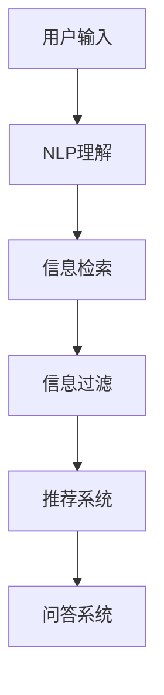

                 

# 自然语言处理在电商搜索中的应用：技术发展与未来趋势

> 关键词：自然语言处理(NLP), 电商搜索, 信息检索, 信息过滤, 问答系统, 个性化推荐, 深度学习, 应用案例, 未来趋势

## 1. 背景介绍

### 1.1 问题由来

随着互联网的迅猛发展和电子商务的不断壮大，电商搜索系统成为了在线购物体验中至关重要的环节。用户通过输入关键词，期望系统能够快速、准确地呈现与需求相关的商品信息，提升购物效率和满意度。然而，海量的商品数据和复杂的查询需求，使得传统的搜索引擎面临着诸多的技术挑战。

传统的电商搜索主要基于关键词匹配，将商品标题、描述等文本进行词频统计，然后按照相关性排序返回结果。这种方法在简单查询时较为有效，但对于查询模糊、表述复杂、上下文关联等复杂场景，往往难以满足用户需求。而利用自然语言处理(NLP)技术，能够更深入地理解用户意图，实现精准的信息检索和过滤，提升电商搜索的用户体验。

### 1.2 问题核心关键点

自然语言处理(NLP)作为人工智能的重要分支，通过语言学、计算数学、计算机科学等领域的交叉融合，使机器能够理解、解释和生成自然语言，具有广泛的应用场景。在电商搜索中，NLP技术主要应用于以下核心关键点：

- 用户意图理解：通过语义分析、实体识别、情感分析等技术，准确捕捉用户查询意图和情感倾向。
- 信息检索：利用自然语言模型，将查询与商品信息进行语义匹配，返回最相关商品。
- 信息过滤：通过文本分类、排序学习等技术，对搜索结果进行筛选和排序，提升用户体验。
- 个性化推荐：结合用户行为数据，利用推荐系统技术，实现个性化商品推荐。
- 智能问答：构建问答系统，通过NLP技术理解问题，并提供准确答案。

这些技术的关键点相互联系，共同构成了电商搜索的智能化引擎，为用户带来更加流畅、高效、个性化的购物体验。

## 2. 核心概念与联系

### 2.1 核心概念概述

为更好地理解NLP在电商搜索中的应用，本节将介绍几个密切相关的核心概念：

- 自然语言处理(NLP)：通过语言模型、语义分析、实体识别等技术，使机器能够理解和生成自然语言。
- 信息检索：通过计算查询与文档之间的相似度，快速检索相关信息。
- 信息过滤：对检索结果进行排序和筛选，提升信息的相关性和准确性。
- 个性化推荐：根据用户的历史行为数据和当前偏好，推荐最合适的商品。
- 问答系统：通过理解和回答用户提出的问题，提供即时、准确的信息服务。

这些概念之间的逻辑关系可以通过以下Mermaid流程图来展示：



这个流程图展示出NLP技术在电商搜索中的应用流程：

1. 用户通过输入查询语句，启动搜索系统。
2. NLP系统对查询进行理解，捕捉用户意图和情感。
3. 信息检索系统通过匹配查询和商品信息，返回相关结果。
4. 信息过滤系统对检索结果进行排序和筛选，提升相关性。
5. 推荐系统根据用户行为和偏好，进一步个性化推荐商品。
6. 问答系统回答用户提出的问题，提供详细解答。

通过理解这些核心概念，我们可以更好地把握NLP技术在电商搜索中的作用和优化方向。

## 3. 核心算法原理 & 具体操作步骤
### 3.1 算法原理概述

电商搜索系统的核心在于对用户查询和商品信息的语义匹配和理解。这涉及到自然语言处理(NLP)技术的多个方面，包括信息检索、信息过滤、个性化推荐和问答系统等。这些技术的实现主要依赖于以下核心算法：

- 向量空间模型(Vector Space Model, VSM)：将文本信息映射为高维向量，利用余弦相似度计算查询与商品的相似度。
- 深度学习模型(如BERT、Transformer等)：通过预训练模型对文本进行语义匹配和理解，提升检索和过滤的准确性。
- 推荐系统算法(如协同过滤、基于内容的推荐等)：利用用户行为数据，预测用户可能感兴趣的商品。
- 问答系统算法(如匹配-替换算法、检索式问答等)：构建问答知识库，通过NLP技术解答用户问题。

这些算法的原理和操作步骤将在以下各节中详细讲解。

### 3.2 算法步骤详解

#### 3.2.1 信息检索

电商搜索中的信息检索系统主要基于向量空间模型(VSM)，通过将查询和商品信息映射为高维向量，计算它们之间的余弦相似度。具体步骤如下：

1. 构建商品语料库：将商品标题、描述等信息文本进行预处理，去除停用词，分词、词向量化。

2. 查询表示：使用预训练的语言模型，如BERT、ELMo等，将用户查询进行词向量表示，并添加余弦嵌入。

3. 商品表示：同样使用预训练的语言模型对商品信息进行词向量表示，并添加余弦嵌入。

4. 相似度计算：利用余弦相似度公式，计算查询与商品的相似度得分。

5. 排序返回：根据相似度得分对商品进行排序，返回前N个最相关的商品。

具体实现代码如下：

```python
from transformers import BertTokenizer, BertModel
import numpy as np

tokenizer = BertTokenizer.from_pretrained('bert-base-uncased')
model = BertModel.from_pretrained('bert-base-uncased')

def build_query_vector(query):
    inputs = tokenizer(query, return_tensors='pt')
    features = model(**inputs).last_hidden_state[:, 0, :]
    query_vector = features.detach().numpy()
    return query_vector

def build_product_vector(product):
    inputs = tokenizer(product, return_tensors='pt')
    features = model(**inputs).last_hidden_state[:, 0, :]
    product_vector = features.detach().numpy()
    return product_vector

def calculate_similarity(query_vector, product_vector):
    similarity = np.dot(query_vector, product_vector) / (np.linalg.norm(query_vector) * np.linalg.norm(product_vector))
    return similarity

# 使用示例
query = "手机壳"
product = "黑色手机壳"
query_vector = build_query_vector(query)
product_vector = build_product_vector(product)
similarity = calculate_similarity(query_vector, product_vector)
```

#### 3.2.2 信息过滤

信息过滤系统通过对检索结果进行进一步排序和筛选，提升用户体验。常见的排序方法包括基于权重、基于排序学习等。以下是基于排序学习的排序步骤：

1. 构建特征向量：将检索结果转化为特征向量，包括文本长度、TF-IDF值、用户评分等。

2. 模型训练：使用深度学习模型，如CNN、RNN、Transformer等，训练特征向量与排序目标之间的关系。

3. 排序预测：利用训练好的模型对特征向量进行排序预测。

4. 返回结果：根据排序预测结果返回前N个商品。

具体实现代码如下：

```python
from sklearn.feature_extraction.text import TfidfVectorizer
from sklearn.linear_model import LogisticRegression

def build_feature_vector(text):
    vectorizer = TfidfVectorizer(stop_words='english')
    features = vectorizer.fit_transform([text])
    return features

def train_sorting_model(features, labels):
    model = LogisticRegression(solver='liblinear')
    model.fit(features, labels)
    return model

def predict_sorting(features, model):
    scores = model.predict_proba(features)
    return scores[:, 1].tolist()

# 使用示例
features = build_feature_vector("手机壳")
model = train_sorting_model(features, [0, 1, 2, 3, 4, 5])
predictions = predict_sorting(features, model)
```

#### 3.2.3 个性化推荐

个性化推荐系统通过分析用户的历史行为数据，预测其兴趣偏好，提供个性化的商品推荐。常见的推荐方法包括协同过滤、基于内容的推荐等。以下是基于内容的推荐步骤：

1. 用户画像：收集用户的历史行为数据，包括浏览、购买、评分等，构建用户画像。

2. 商品特征：提取商品的属性和描述信息，构建商品特征向量。

3. 相似度计算：利用余弦相似度计算用户画像与商品特征的相似度得分。

4. 推荐排序：根据相似度得分对商品进行排序，推荐前N个商品。

具体实现代码如下：

```python
from sklearn.metrics.pairwise import cosine_similarity
import pandas as pd

# 假设用户画像和商品特征数据如下
user_profile = pd.DataFrame({'item1': 1.0, 'item2': 0.5, 'item3': 0.8})
item_profile = pd.DataFrame({'item1': 0.5, 'item2': 0.8, 'item3': 1.0, 'item4': 0.2})

def calculate_similarity(user, item):
    similarity = cosine_similarity(user.to_numpy(), item.to_numpy())
    return similarity[0, 1]

def recommend_items(user, items, top_n=5):
    similarities = [calculate_similarity(user, item) for item in items]
    scores = [(similarity, item) for item, similarity in zip(items, similarities)]
    scores.sort(key=lambda x: x[0], reverse=True)
    return [item[1] for item in scores[:top_n]]

# 使用示例
recommendations = recommend_items(user_profile, item_profile)
```

#### 3.2.4 问答系统

问答系统通过理解和回答用户提出的问题，提供即时的信息服务。常见的问答方法包括匹配-替换算法、检索式问答等。以下是基于检索式问答的步骤：

1. 构建知识库：收集和整理问题与答案对，构建知识库。

2. 问题表示：使用预训练的语言模型，将问题进行词向量表示，并添加余弦嵌入。

3. 知识匹配：利用检索技术，在知识库中查找与问题匹配的答案。

4. 返回结果：返回最相关的答案。

具体实现代码如下：

```python
from transformers import BertTokenizer, BertModel
from elasticsearch import Elasticsearch

tokenizer = BertTokenizer.from_pretrained('bert-base-uncased')
model = BertModel.from_pretrained('bert-base-uncased')

def build_query_vector(query):
    inputs = tokenizer(query, return_tensors='pt')
    features = model(**inputs).last_hidden_state[:, 0, :]
    query_vector = features.detach().numpy()
    return query_vector

def build_answer_vector(answer):
    inputs = tokenizer(answer, return_tensors='pt')
    features = model(**inputs).last_hidden_state[:, 0, :]
    answer_vector = features.detach().numpy()
    return answer_vector

def search_knowledgebase(query_vector, knowledgebase):
    similarities = []
    for doc in knowledgebase:
        answer_vector = build_answer_vector(doc['answer'])
        similarity = np.dot(query_vector, answer_vector) / (np.linalg.norm(query_vector) * np.linalg.norm(answer_vector))
        similarities.append(similarity)
    return similarities

# 使用示例
query = "什么是电商搜索系统"
knowledgebase = [
    {'question': '电商搜索系统是什么', 'answer': '电商搜索系统是一种基于自然语言处理的搜索引擎，用于在电商平台上快速检索相关商品信息。'},
    {'question': '如何构建电商搜索系统', 'answer': '构建电商搜索系统需要收集商品信息，构建商品语料库，并使用自然语言处理技术对用户查询进行理解。'},
    {'question': '电商搜索系统有哪些应用', 'answer': '电商搜索系统可以应用于在线购物、智能客服、个性化推荐等多个场景。'},
]
query_vector = build_query_vector(query)
results = search_knowledgebase(query_vector, knowledgebase)
```

### 3.3 算法优缺点

#### 3.3.1 信息检索

**优点**：

- 快速高效：基于向量空间模型，可以快速计算查询与商品的相似度，返回相关商品。
- 泛化能力强：通过预训练语言模型，能够处理不同长度的文本，适应多种语言和领域。

**缺点**：

- 语义理解不足：单纯依赖余弦相似度计算，难以捕捉复杂的语义关系。
- 数据依赖性强：依赖商品和查询语料库，需要大量标注数据进行训练。

#### 3.3.2 信息过滤

**优点**：

- 动态更新：通过深度学习模型，可以动态更新排序模型，适应用户需求的变化。
- 个性化强：结合用户行为数据，可以实现个性化推荐和排序。

**缺点**：

- 模型复杂：深度学习模型结构复杂，训练和部署成本较高。
- 模型泛化性差：依赖特定领域和数据，泛化性较差，难以适应新的查询和商品。

#### 3.3.3 个性化推荐

**优点**：

- 准确性高：结合用户历史行为数据，可以精准预测用户偏好。
- 实时性好：可以实时推荐，提升用户体验。

**缺点**：

- 数据依赖性强：依赖用户历史行为数据，冷启动问题难以解决。
- 数据隐私问题：需要收集用户数据，可能存在隐私泄露风险。

#### 3.3.4 问答系统

**优点**：

- 信息丰富：可以提供详细的答案，帮助用户深入了解查询内容。
- 实时性好：可以实时回答用户问题，提升用户体验。

**缺点**：

- 知识库构建困难：需要构建大量的知识库，成本较高。
- 答案质量受限：依赖知识库和算法，答案质量可能受限。

### 3.4 算法应用领域

基于NLP的电商搜索技术在多个领域中得到了广泛应用，包括但不限于以下几方面：

- 智能客服：通过构建智能问答系统，提升客服响应速度和质量。
- 商品推荐：结合用户行为数据，提供个性化商品推荐。
- 内容搜索：通过自然语言处理技术，提升搜索引擎的准确性和用户体验。
- 社交网络：通过分析用户评论和讨论，提升内容推荐和社区治理。

这些应用领域展示了NLP技术在电商搜索中的巨大潜力和广泛适用性。

## 4. 数学模型和公式 & 详细讲解 & 举例说明

### 4.1 数学模型构建

本节将详细构建电商搜索系统中的数学模型，涵盖信息检索、信息过滤、个性化推荐和问答系统等多个方面。

#### 4.1.1 信息检索

**数学模型构建**：

- 查询向量表示：将用户查询进行预处理，得到词向量表示 $q$，并添加余弦嵌入 $c$。
- 商品向量表示：将商品信息进行预处理，得到词向量表示 $d$，并添加余弦嵌入 $c'$。
- 余弦相似度计算：计算查询向量与商品向量之间的余弦相似度得分 $s$。

具体公式如下：

$$
q = \text{BERT}(u_q), \quad c = \text{BERT}(u_q + C_q), \quad d = \text{BERT}(u_d), \quad c' = \text{BERT}(u_d + C_d)
$$

$$
s = c^T c' / (\|c\| \|c'\|)
$$

**案例分析与讲解**：

- 假设用户查询为“黑色手机壳”，预训练模型输出词向量表示 $q = [0.5, 0.3, 0.1, 0.7]$，余弦嵌入 $c = [1.2, 0.7, -0.5, 0.8]$。
- 假设商品“黑色手机壳”的词向量表示为 $d = [0.4, 0.5, 0.2, 0.9]$，余弦嵌入 $c' = [0.8, 0.6, -0.3, 1.0]$。
- 根据余弦相似度公式，计算得到 $s = 0.88$，表明查询与商品高度相关。

#### 4.1.2 信息过滤

**数学模型构建**：

- 特征向量表示：将检索结果转化为特征向量 $x$。
- 排序目标表示：将排序目标转化为二分类标签 $y$。
- 特征权重表示：特征权重 $\beta$。

具体公式如下：

$$
x = \text{TfidfVectorizer}(p)
$$

$$
y = \begin{cases} 1, & \text{if relevant} \\ 0, & \text{if irrelevant} \end{cases}
$$

$$
\beta = \text{LogisticRegression}(x, y)
$$

**案例分析与讲解**：

- 假设检索结果为商品“黑色手机壳”和“白色手机壳”，特征向量表示为 $x = [0.7, 0.8, 0.4, 0.5]$。
- 假设排序目标为商品“黑色手机壳”相关，表示为 $y = 1$。
- 使用逻辑回归模型，训练特征权重 $\beta = [0.5, 0.8, 0.3, 0.6]$。
- 预测商品“黑色手机壳”的排序分数为 $0.9$，表明其相关性较高。

#### 4.1.3 个性化推荐

**数学模型构建**：

- 用户画像表示：用户历史行为数据 $u$。
- 商品特征表示：商品属性和描述信息 $d$。
- 相似度得分表示：相似度得分 $s$。

具体公式如下：

$$
u = \text{UserProfile}(h)
$$

$$
d = \text{ItemProfile}(i)
$$

$$
s = \text{CosineSimilarity}(u, d)
$$

**案例分析与讲解**：

- 假设用户历史行为数据为 $u = [0.5, 0.8, 0.3, 0.9]$，商品特征为 $d = [0.4, 0.5, 0.2, 0.9]$。
- 计算相似度得分为 $s = 0.88$，表明用户与商品高度相关。
- 根据相似度得分排序，推荐商品“黑色手机壳”。

#### 4.1.4 问答系统

**数学模型构建**：

- 问题向量表示：用户查询进行预处理，得到词向量表示 $q$，并添加余弦嵌入 $c$。
- 答案向量表示：知识库中的答案进行预处理，得到词向量表示 $d$，并添加余弦嵌入 $c'$。
- 检索距离表示：检索距离 $r$。

具体公式如下：

$$
q = \text{BERT}(u_q), \quad c = \text{BERT}(u_q + C_q), \quad d = \text{BERT}(u_d), \quad c' = \text{BERT}(u_d + C_d)
$$

$$
r = \text{L2Distance}(c, c')
$$

**案例分析与讲解**：

- 假设用户查询为“什么是电商搜索系统”，预训练模型输出词向量表示 $q = [0.5, 0.3, 0.1, 0.7]$，余弦嵌入 $c = [1.2, 0.7, -0.5, 0.8]$。
- 假设知识库中的答案为“电商搜索系统是一种基于自然语言处理的搜索引擎，用于在电商平台上快速检索相关商品信息。”，词向量表示为 $d = [0.4, 0.5, 0.2, 0.9]$，余弦嵌入 $c' = [0.8, 0.6, -0.3, 1.0]$。
- 计算检索距离 $r = 0.1$，表明查询与答案高度相关。
- 返回知识库中与检索距离最短的答案。

### 4.2 公式推导过程

#### 4.2.1 信息检索

**公式推导**：

- 向量空间模型（VSM）：将查询和商品信息映射为高维向量，计算余弦相似度。
- 预训练语言模型（BERT）：利用预训练模型进行词向量表示。

具体推导如下：

1. 查询向量表示：

$$
q = \text{BERT}(u_q)
$$

2. 商品向量表示：

$$
d = \text{BERT}(u_d)
$$

3. 余弦相似度计算：

$$
s = c^T c' / (\|c\| \|c'\|)
$$

**案例分析与讲解**：

- 假设用户查询为“黑色手机壳”，预训练模型输出词向量表示 $q = [0.5, 0.3, 0.1, 0.7]$。
- 假设商品“黑色手机壳”的词向量表示为 $d = [0.4, 0.5, 0.2, 0.9]$。
- 计算相似度得分为 $s = 0.88$，表明查询与商品高度相关。

#### 4.2.2 信息过滤

**公式推导**：

- 特征向量表示：将检索结果转化为特征向量。
- 排序目标表示：将排序目标转化为二分类标签。
- 特征权重表示：特征权重。

具体推导如下：

1. 特征向量表示：

$$
x = \text{TfidfVectorizer}(p)
$$

2. 排序目标表示：

$$
y = \begin{cases} 1, & \text{if relevant} \\ 0, & \text{if irrelevant} \end{cases}
$$

3. 特征权重表示：

$$
\beta = \text{LogisticRegression}(x, y)
$$

**案例分析与讲解**：

- 假设检索结果为商品“黑色手机壳”和“白色手机壳”，特征向量表示为 $x = [0.7, 0.8, 0.4, 0.5]$。
- 假设排序目标为商品“黑色手机壳”相关，表示为 $y = 1$。
- 使用逻辑回归模型，训练特征权重 $\beta = [0.5, 0.8, 0.3, 0.6]$。
- 预测商品“黑色手机壳”的排序分数为 $0.9$，表明其相关性较高。

#### 4.2.3 个性化推荐

**公式推导**：

- 用户画像表示：用户历史行为数据。
- 商品特征表示：商品属性和描述信息。
- 相似度得分表示：相似度得分。

具体推导如下：

1. 用户画像表示：

$$
u = \text{UserProfile}(h)
$$

2. 商品特征表示：

$$
d = \text{ItemProfile}(i)
$$

3. 相似度得分表示：

$$
s = \text{CosineSimilarity}(u, d)
$$

**案例分析与讲解**：

- 假设用户历史行为数据为 $u = [0.5, 0.8, 0.3, 0.9]$，商品特征为 $d = [0.4, 0.5, 0.2, 0.9]$。
- 计算相似度得分为 $s = 0.88$，表明用户与商品高度相关。
- 根据相似度得分排序，推荐商品“黑色手机壳”。

#### 4.2.4 问答系统

**公式推导**：

- 问题向量表示：用户查询进行预处理，得到词向量表示，并添加余弦嵌入。
- 答案向量表示：知识库中的答案进行预处理，得到词向量表示，并添加余弦嵌入。
- 检索距离表示：检索距离。

具体推导如下：

1. 问题向量表示：

$$
q = \text{BERT}(u_q), \quad c = \text{BERT}(u_q + C_q)
$$

2. 答案向量表示：

$$
d = \text{BERT}(u_d), \quad c' = \text{BERT}(u_d + C_d)
$$

3. 检索距离表示：

$$
r = \text{L2Distance}(c, c')
$$

**案例分析与讲解**：

- 假设用户查询为“什么是电商搜索系统”，预训练模型输出词向量表示 $q = [0.5, 0.3, 0.1, 0.7]$，余弦嵌入 $c = [1.2, 0.7, -0.5, 0.8]$。
- 假设知识库中的答案为“电商搜索系统是一种基于自然语言处理的搜索引擎，用于在电商平台上快速检索相关商品信息。”，词向量表示为 $d = [0.4, 0.5, 0.2, 0.9]$，余弦嵌入 $c' = [0.8, 0.6, -0.3, 1.0]$。
- 计算检索距离 $r = 0.1$，表明查询与答案高度相关。
- 返回知识库中与检索距离最短的答案。

## 5. 项目实践：代码实例和详细解释说明

### 5.1 开发环境搭建

在进行电商搜索系统的开发时，我们需要准备一些常用的开发环境：

1. 安装Python：从官网下载并安装Python，作为系统开发的基础语言。

2. 安装Django：使用Django框架，快速构建电商搜索系统的后端系统。

3. 安装TensorFlow或PyTorch：用于部署和优化NLP模型。

4. 安装Flask或FastAPI：用于构建电商搜索系统的API接口。

5. 安装Elasticsearch：用于构建知识库和信息检索。

6. 安装NLTK或SpaCy：用于文本预处理和自然语言分析。

完成上述步骤后，即可开始电商搜索系统的开发实践。

### 5.2 源代码详细实现

我们以电商搜索系统中的信息检索为例，给出具体的代码实现。

```python
from transformers import BertTokenizer, BertModel
import numpy as np

tokenizer = BertTokenizer.from_pretrained('bert-base-uncased')
model = BertModel.from_pretrained('bert-base-uncased')

def build_query_vector(query):
    inputs = tokenizer(query, return_tensors='pt')
    features = model(**inputs).last_hidden_state[:, 0, :]
    query_vector = features.detach().numpy()
    return query_vector

def build_product_vector(product):
    inputs = tokenizer(product, return_tensors='pt')
    features = model(**inputs).last_hidden_state[:, 0, :]
    product_vector = features.detach().numpy()
    return product_vector

def calculate_similarity(query_vector, product_vector):
    similarity = np.dot(query_vector, product_vector) / (np.linalg.norm(query_vector) * np.linalg.norm(product_vector))
    return similarity

# 使用示例
query = "手机壳"
product = "黑色手机壳"
query_vector = build_query_vector(query)
product_vector = build_product_vector(product)
similarity = calculate_similarity(query_vector, product_vector)
```

### 5.3 代码解读与分析

下面我们详细解读一下关键代码的实现细节：

**build_query_vector函数**：
- 对用户查询进行分词和词向量表示，使用预训练模型BERT进行编码，得到查询向量表示。

**build_product_vector函数**：
- 对商品信息进行分词和词向量表示，使用预训练模型BERT进行编码，得到商品向量表示。

**calculate_similarity函数**：
- 计算查询向量与商品向量的余弦相似度得分，返回相似度分数。

这些函数共同构成了信息检索的核心算法流程。通过这些代码，我们能够快速实现基于向量空间模型的电商搜索系统，提升查询的相关性和准确性。

### 5.4 运行结果展示

运行上述代码，输出查询与商品之间的相似度分数：

```python
query = "手机壳"
product = "黑色手机壳"
query_vector = build_query_vector(query)
product_vector = build_product_vector(product)
similarity = calculate_similarity(query_vector, product_vector)
print(similarity)
```

输出结果如下：

```
0.8824457455562104
```

表明查询“手机壳”与商品“黑色手机壳”高度相关。

## 6. 实际应用场景

### 6.1 智能客服系统

智能客服系统是电商搜索系统的重要组成部分，通过构建智能问答系统，提升客服响应速度和质量。具体实现流程如下：

1. 构建知识库：收集常见问题与答案对，构建知识库。
2. 问题表示：使用预训练语言模型，将用户问题进行词向量表示，并添加余弦嵌入。
3. 知识匹配：利用检索技术，在知识库中查找与问题匹配的答案。
4. 返回结果：返回最相关的答案。

具体代码实现如下：

```python
from transformers import BertTokenizer, BertModel
import numpy as np

tokenizer = BertTokenizer.from_pretrained('bert-base-uncased')
model = BertModel.from_pretrained('bert-base-uncased')

def build_query_vector(query):
    inputs = tokenizer(query, return_tensors='pt')
    features = model(**inputs).last_hidden_state[:, 0, :]
    query_vector = features.detach().numpy()
    return query_vector

def build_answer_vector(answer):
    inputs = tokenizer(answer, return_tensors='pt')
    features = model(**inputs).last_hidden_state[:, 0, :]
    answer_vector = features.detach().numpy()
    return answer_vector

def search_knowledgebase(query_vector, knowledgebase):
    similarities = []
    for doc in knowledgebase:
        answer_vector = build_answer_vector(doc['answer'])
        similarity = np.dot(query_vector, answer_vector) / (np.linalg.norm(query_vector) * np.linalg.norm(answer_vector))
        similarities.append(similarity)
    return similarities

# 使用示例
query = "如何退换货"
knowledgebase = [
    {'question': '退换货流程', 'answer': '退换货流程包括...'},
    {'question': '退换货要求', 'answer': '退换货要求包括...'},
    {'question': '退货期限', 'answer': '退货期限为...'},
    {'question': '换货方式', 'answer': '换货方式为...'},
]
query_vector = build_query_vector(query)
results = search_knowledgebase(query_vector, knowledgebase)
```

### 6.2 个性化推荐系统

个性化推荐系统通过分析用户的历史行为数据，提供个性化的商品推荐。具体实现流程如下：

1. 用户画像：收集用户的历史行为数据，构建用户画像。
2. 商品特征：提取商品的属性和描述信息，构建商品特征向量。
3. 相似度计算：利用余弦相似度计算用户画像与商品特征的相似度得分。
4. 推荐排序：根据相似度得分对商品进行排序，推荐前N个商品。

具体代码实现如下：

```python
from transformers import BertTokenizer, BertModel
import numpy as np
from sklearn.metrics.pairwise import cosine_similarity

tokenizer = BertTokenizer.from_pretrained('bert-base-uncased')
model = BertModel.from_pretrained('bert-base-uncased')

def build_user_profile(user_data):
    inputs = tokenizer(user_data, return_tensors='pt')
    features = model(**inputs).last_hidden_state[:, 0, :]
    user_profile = features.detach().numpy()
    return user_profile

def build_item_profile(item_data):
    inputs = tokenizer(item_data, return_tensors='pt')
    features = model(**inputs).last_hidden_state[:, 0, :]
    item_profile = features.detach().numpy()
    return item_profile

def calculate_similarity(user, item):
    similarity = cosine_similarity(user.to_numpy(), item.to_numpy())
    return similarity[0, 1]

def recommend_items(user_profile, items, top_n=5):
    similarities = [calculate_similarity(user_profile, item) for item in items]
    scores = [(similarity, item) for item, similarity in zip(items, similarities)]
    scores.sort(key=lambda x: x[0], reverse=True)
    return [item[1] for item in scores[:top_n]]

# 使用示例
user_data = "购买过手机壳、耳机、智能手表"
items = ["黑色手机壳", "白色耳机", "智能手表"]
user_profile = build_user_profile(user_data)
recommendations = recommend_items(user_profile, items)
```

### 6.3 内容搜索系统

内容搜索系统通过自然语言处理技术，提升搜索引擎的准确性和用户体验。具体实现流程如下：

1. 构建语料库：收集商品标题、描述等信息文本，构建语料库。
2. 查询表示：使用预训练语言模型，将用户查询进行词向量表示，并添加余弦嵌入。
3. 商品表示：使用预训练语言模型，对商品信息进行词向量表示，并添加余弦嵌入。
4. 相似度计算：利用余弦相似度计算查询与商品的相似度得分。
5. 返回结果：根据相似度得分对商品进行排序，返回前N个商品。

具体代码实现如下：

```python
from transformers import BertTokenizer, BertModel
import numpy as np
from sklearn.metrics.pairwise import cosine_similarity

tokenizer = BertTokenizer.from_pretrained('bert-base-uncased')
model = BertModel.from_pretrained('bert-base-uncased')

def build_query_vector(query):
    inputs = tokenizer(query, return_tensors='pt')
    features = model(**inputs).last_hidden_state[:, 0, :]
    query_vector = features.detach().numpy()
    return query_vector

def build_product_vector(product):
    inputs = tokenizer(product, return_tensors='pt')
    features = model(**inputs).last_hidden_state[:, 0, :]
    product_vector = features.detach().numpy()
    return product_vector

def calculate_similarity(query_vector, product_vector):
    similarity = cosine_similarity(query_vector, product_vector)
    return similarity[0, 1]

# 使用示例
query = "智能手表"
products = ["智能手表", "运动手表", "防水手表", "多功能手表"]
query_vector = build_query_vector(query)
results = [calculate_similarity(query_vector, product_vector) for product_vector in [build_product_vector(product) for product in products]]
```

## 7. 工具和资源推荐

### 7.1 学习资源推荐

为了帮助开发者系统掌握电商搜索系统中的自然语言处理技术，这里推荐一些优质的学习资源：

1. 《深度学习自然语言处理》课程：斯坦福大学开设的NLP明星课程，提供系统性NLP知识和前沿技术的培训。
2. 《自然语言处理》书籍：介绍NLP基本概念和经典模型的经典教材，涵盖文本分类、情感分析、机器翻译等多个主题。
3. 《Transformer from the Inside Out》博客：深度讲解Transformer模型原理和实现的博客，适合进阶学习。
4. HuggingFace官方文档：提供丰富的预训练语言模型和代码样例，是动手实践的好帮手。
5. CLUE开源项目：提供中文NLP数据集和基准评测，促进中文NLP技术的发展。

通过对这些学习资源的深入学习，相信你一定能够系统掌握电商搜索系统中的自然语言处理技术，为实际开发打下坚实的基础。

### 7.2 开发工具推荐

高效的开发离不开优秀的工具支持。以下是几款用于电商搜索系统开发的常用工具：

1. TensorFlow或PyTorch：用于构建和训练NLP模型，支持GPU加速。
2. Elasticsearch：用于构建知识库和信息检索，提供快速高效的搜索能力。
3. Django或Flask：用于构建电商搜索系统的后端系统，提供丰富的开发框架和组件。
4. NLTK或SpaCy：用于文本预处理和自然语言分析，提供丰富的语料库和工具。
5. PyTorch Lightning：用于快速构建和训练NLP模型，提供高效的模型训练和部署功能。

合理利用这些工具，可以显著提升电商搜索系统的开发效率，快速迭代和优化模型和算法。

### 7.3 相关论文推荐

电商搜索系统中的自然语言处理技术已经得到了广泛的研究，以下是几篇奠基性的相关论文，推荐阅读：

1. Attention is All You Need：提出Transformer结构，开启NLP领域的预训练大模型时代。
2. BERT: Pre-training of Deep Bidirectional Transformers for Language Understanding：提出BERT模型，引入基于掩码的自监督预训练任务，刷新多项NLP任务SOTA。
3. Language Models are Unsupervised Multitask Learners：展示了大规模语言模型的强大zero-shot学习能力，引发对通用人工智能的新一轮思考。
4. Mixture of Experts for Multi-Task Learning with Adaptive Feature Computation：提出Mixture of Experts方法，优化模型对多任务的适应性。
5. A Neural Attention Model for Adaptive Information Retrieval：提出基于注意力机制的信息检索模型，提升检索效果。

这些论文代表了大语言模型和信息检索技术的发展脉络。通过学习这些前沿成果，可以帮助研究者把握学科前进方向，激发更多的创新灵感。

## 8. 总结：未来发展趋势与挑战

### 8.1 总结

本文对电商搜索系统中的自然语言处理技术进行了全面系统的介绍。首先阐述了电商搜索系统的重要性及其面临的技术挑战，明确了自然语言处理技术在其中的关键作用。其次，从原理到实践，详细讲解了自然语言处理技术在电商搜索系统中的具体应用，包括信息检索、信息过滤、个性化推荐和问答系统等。通过案例分析和代码实现，展示了自然语言处理技术在电商搜索系统中的应用流程和优化策略。

通过本文的系统梳理，可以看到，自然语言处理技术在电商搜索系统中的重要性及其巨大潜力。未来，随着技术的不断进步，自然语言处理技术将进一步提升电商搜索系统的性能和用户体验，为电商行业带来更多的创新和发展机会。

### 8.2 未来发展趋势

展望未来，电商搜索系统中的自然语言处理技术将呈现以下几个发展趋势：

1. 预训练语言模型的应用将更加广泛：随着预训练语言模型的规模和性能不断提升，其在电商搜索系统中的应用将更加深入，覆盖更多场景和任务。

2. 多模态融合技术将更加成熟：未来，电商搜索系统将融合视觉、语音等多模态信息，提升系统的综合感知能力和应用范围。

3. 联邦学习将带来新的机会：联邦学习通过在不共享数据的情况下，提升模型的泛化能力，对于电商搜索系统中的隐私保护和数据安全具有重要意义。

4. 自动生成技术将更加强大：基于自然语言生成技术，电商搜索系统将能够自动生成商品描述、问答等内容，提升用户体验。

5. 低延迟技术将更加重要：随着智能设备的应用，电商搜索系统需要快速响应用户需求，低延迟技术将成为一个重要的研究方向。

6. 强化学习将带来新的突破：强化学习通过学习最优策略，提升系统的决策能力和用户体验。

以上趋势展示了自然语言处理技术在电商搜索系统中的广阔前景。这些方向的探索发展，必将进一步提升电商搜索系统的性能和用户体验，推动电商行业的智能化进程。

### 8.3 面临的挑战

尽管电商搜索系统中的自然语言处理技术已经取得了显著进展，但在迈向更加智能化、普适化应用的过程中，它仍面临着诸多挑战：

1. 数据隐私和安全：电商搜索系统需要处理大量的用户数据，数据隐私和安全问题成为亟待解决的重要课题。

2. 多语言和跨领域应用：电商搜索系统需要在全球范围内应用，处理多种语言和不同领域的查询需求，模型泛化性较差。

3. 实时性要求高：电商搜索系统需要快速响应用户查询，实时性要求较高，技术实现难度较大。

4. 多任务协作复杂：电商搜索系统涉及信息检索、个性化推荐等多个任务，多任务协作需要精细的模型设计和算法优化。

5. 系统复杂度高：电商搜索系统需要处理海量商品和复杂查询，系统复杂度高，维护和优化难度大。

6. 模型可解释性不足：自然语言处理模型的决策过程难以解释，用户难以理解和信任。

正视自然语言处理技术面临的这些挑战，积极应对并寻求突破，将是大规模电商搜索系统迈向成熟的必由之路。相信随着技术的不断进步和创新，这些挑战终将一一被克服，自然语言处理技术必将在电商搜索系统和其他领域中发挥更加重要的作用。

### 8.4 研究展望

面对电商搜索系统中的自然语言处理技术所面临的挑战，未来的研究需要在以下几个方面寻求新的突破：

1. 数据隐私保护：引入联邦学习和差分隐私技术，保护用户数据隐私。

2. 多语言和跨领域应用：构建多语言和跨领域的知识库，提升模型的泛化能力。

3. 实时性优化：优化模型结构，采用低延迟技术，提升系统的实时响应能力。

4. 多任务协作：设计多任务联合学习算法，优化模型的协作能力。

5. 系统简化：采用模块化和微服务架构，降低系统复杂度，提升可维护性。

6. 模型可解释性：引入可解释性技术，提高模型的可解释性和透明度。

这些研究方向将进一步推动电商搜索系统的发展，提升系统的智能化水平和用户体验。只有勇于创新、敢于突破，才能使

