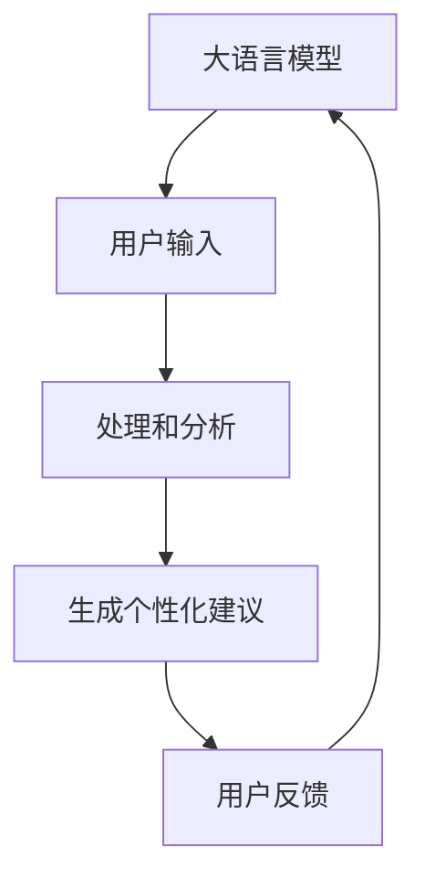

                 

# 营养计划定制：LLM 助力健康生活

> 关键词：大语言模型, 营养计划, 个性化推荐, 健康管理, 机器学习, 用户反馈, 饮食建议

## 1. 背景介绍

在当今快节奏的生活中，健康饮食已成为人们关注的重点。然而，制定个性化且有效的营养计划仍然是一个难题。传统方法需要花费大量时间和精力，且往往无法根据个人体质和偏好进行调整。大语言模型（Large Language Model, LLM）的崛起，为个性化营养计划定制提供了新的解决方案。

### 1.1 问题由来
健康饮食不仅关乎身体健康，还与心理健康、工作和学习效率密切相关。然而，制定个性化的饮食计划通常需要专业营养师，结合个体健康状况、生活方式和饮食习惯进行详细评估。传统方法包括问卷调查、营养师咨询等，耗时费力，且容易受到个体主观因素的影响。

### 1.2 问题核心关键点
大语言模型通过海量数据训练，能够理解并生成符合不同个体需求的语言描述，为营养计划定制提供了一个高效、灵活的解决方案。其核心在于：

1. **大规模语料训练**：LLM在大量健康和营养相关的文本数据上进行训练，学习到了丰富的饮食知识。
2. **自然语言生成**：LLM能够根据用户输入，生成详细的饮食建议。
3. **个性化定制**：根据用户的体质、偏好、饮食习惯等个性化信息，生成定制化饮食计划。

这些核心特点使得LLM在营养计划定制中具有显著优势。

## 2. 核心概念与联系

### 2.1 核心概念概述

大语言模型（LLM）是一种基于深度学习技术的自然语言处理模型，通过在大量文本数据上进行预训练，学习到通用的语言表示和丰富的知识。其核心原理在于自回归模型，能够在生成文本时，预测下一个单词的概率分布，从而生成连贯的文本。

营养计划定制是指根据用户的健康状况、饮食习惯和生活方式，生成个性化的饮食建议，帮助用户制定健康饮食计划。

### 2.2 核心概念原理和架构的 Mermaid 流程图



该图展示了LLM在营养计划定制中的作用流程：

1. **用户输入**：用户提供健康状况、饮食习惯等相关信息。
2. **处理和分析**：LLM对这些信息进行处理和分析，学习用户需求和偏好。
3. **生成个性化建议**：基于分析结果，LLM生成个性化的饮食建议。
4. **用户反馈**：用户对建议进行反馈，LLM根据反馈进行微调。

### 2.3 核心概念联系

大语言模型在营养计划定制中的应用，可以归纳为以下联系：

- **预训练与微调**：预训练的LLM在大规模健康和营养数据上进行了广泛的知识学习，微调过程则使模型能够适应特定用户的个性化需求。
- **自然语言处理与健康数据**：LLM通过自然语言处理技术，将非结构化的健康数据转换为结构化的信息，便于模型理解和生成建议。
- **个性化与普适性**：LLM生成的个性化建议，既符合用户的个体需求，又具备一定的普适性，能够被推广到更广泛的群体。

这些联系构成了LLM在营养计划定制中的技术基础，使得LLM能够高效、灵活地为不同用户定制个性化饮食计划。

## 3. 核心算法原理 & 具体操作步骤

### 3.1 算法原理概述

基于大语言模型的营养计划定制，主要分为预训练和微调两个阶段。其核心在于：

1. **预训练**：在大量健康和营养相关的文本数据上，对LLM进行预训练，学习通用的语言表示和丰富的饮食知识。
2. **微调**：在用户的个性化输入上，对预训练模型进行微调，生成具体的饮食建议。

### 3.2 算法步骤详解

#### 3.2.1 数据准备
- **收集数据**：收集和整理健康、营养相关的文本数据，如食谱、营养指南、健康饮食博客等。
- **数据预处理**：对文本数据进行清洗、分词、标记等预处理，转换为模型所需的输入格式。

#### 3.2.2 模型训练
- **选择合适的模型**：选择适合的营养计划定制任务的大语言模型，如GPT、BERT等。
- **训练模型**：在预处理后的数据集上进行模型训练，优化模型参数，使其能够理解并生成饮食建议。

#### 3.2.3 模型微调
- **用户输入**：用户提供个性化健康信息，如身高、体重、饮食习惯等。
- **生成建议**：将用户输入作为LLM的输入，生成个性化的饮食建议。
- **反馈优化**：用户对建议进行反馈，LLM根据反馈进行微调，不断优化建议。

### 3.3 算法优缺点

#### 3.3.1 优点
- **高效性**：通过LLM的强大语言处理能力，可以快速生成个性化的饮食建议。
- **灵活性**：可以根据用户需求和反馈进行动态调整，灵活应对不同的健康和饮食场景。
- **普适性**：模型学习到的通用语言知识，使其生成的建议具有一定的普适性，适用于不同人群。

#### 3.3.2 缺点
- **依赖数据质量**：模型生成的建议质量高度依赖于训练数据的质量和多样性。
- **语言理解限制**：模型可能无法完全理解复杂或模糊的用户输入，影响建议的准确性。
- **个性化挑战**：不同用户之间的健康需求和饮食习惯差异较大，模型需要不断调整以适应多样性。

### 3.4 算法应用领域

基于大语言模型的营养计划定制，已经应用于多个领域：

- **健康应用**：如MyFitnessPal、Calory等，为用户提供个性化饮食建议和健康管理。
- **餐饮服务**：如餐饮推荐系统，根据用户偏好和历史消费记录，推荐适合的饮食方案。
- **运动营养**：如运动营养计划生成，结合运动量、饮食需求，生成个性化营养建议。
- **心理健康**：如通过饮食调节心理健康，生成情绪和压力管理方案。

## 4. 数学模型和公式 & 详细讲解 & 举例说明

### 4.1 数学模型构建

基于大语言模型的营养计划定制，可以建模为以下形式：

- **输入**：用户提供的健康信息 $x$，如身高、体重、饮食习惯等。
- **输出**：个性化的饮食建议 $y$，如三餐食谱、营养素摄入建议等。
- **模型**：大语言模型 $M_{\theta}$，其中 $\theta$ 为模型参数。

目标函数为：

$$
\min_{\theta} \mathcal{L}(M_{\theta}(x), y)
$$

其中 $\mathcal{L}$ 为损失函数，用于衡量模型生成的建议与真实建议之间的差异。

### 4.2 公式推导过程

#### 4.2.1 损失函数
损失函数可以定义为：

$$
\mathcal{L}(M_{\theta}(x), y) = \frac{1}{N} \sum_{i=1}^N \ell(M_{\theta}(x_i), y_i)
$$

其中 $N$ 为样本数量，$\ell$ 为单个样本的损失函数。

#### 4.2.2 反向传播
对于单个样本，其损失函数为：

$$
\ell(M_{\theta}(x), y) = \frac{1}{2} (M_{\theta}(x) - y)^2
$$

通过反向传播算法，更新模型参数 $\theta$：

$$
\theta \leftarrow \theta - \eta \nabla_{\theta}\mathcal{L}(\theta)
$$

其中 $\eta$ 为学习率。

#### 4.2.3 案例分析
以生成健康早餐食谱为例：

- **输入**：用户输入其身高、体重、饮食偏好（如低糖、低脂）等。
- **模型生成**：LLM生成一系列早餐食谱，如燕麦粥、全麦面包等。
- **评估和优化**：用户反馈其满意度，LLM根据反馈调整食谱生成策略，提高建议质量。

### 4.3 案例分析与讲解

#### 4.3.1 早餐食谱生成
假设有用户输入其身高为170cm，体重为65kg，偏好低糖、低脂饮食。LLM通过其预训练的知识库，生成以下早餐食谱：

1. **燕麦粥**：低糖、高纤维，富含膳食纤维，有助于控制血糖。
2. **全麦面包**：低脂、高纤维，富含B族维生素，有助于提高能量。
3. **低脂酸奶**：低脂、低糖，富含益生菌，有助于肠道健康。

#### 4.3.2 用户反馈
用户反馈如下：

- **满意度**：对燕麦粥和全麦面包非常满意，但低脂酸奶口感不佳，希望更换为天然酸奶。
- **需求调整**：LLM根据用户反馈，调整其酸奶推荐策略，加入天然酸奶选项，并增加水果搭配，提高饮食多样性。

## 5. 项目实践：代码实例和详细解释说明

### 5.1 开发环境搭建

在实践中，需要使用以下Python开发环境：

1. **Python**：推荐使用Python 3.8及以上版本。
2. **PyTorch**：用于深度学习模型的构建和训练。
3. **NLTK**：用于文本预处理和语言分析。
4. **GPT-3**：选择OpenAI提供的GPT-3模型，进行预训练和微调。
5. **TensorBoard**：用于可视化模型训练过程和结果。

### 5.2 源代码详细实现

以下是一个使用GPT-3进行营养计划定制的Python代码示例：

```python
import torch
import nltk
import transformers
from transformers import GPT3LMHeadModel, GPT3Tokenizer

# 初始化模型和分词器
model_name = 'gpt3-medium'
tokenizer = GPT3Tokenizer.from_pretrained(model_name)
model = GPT3LMHeadModel.from_pretrained(model_name)

# 输入处理
def preprocess_input(text):
    text = text.lower()
    tokens = tokenizer.tokenize(text)
    return tokenizer.encode(tokens)

# 输出处理
def postprocess_output(output):
    tokens = tokenizer.decode(output)
    return tokens

# 用户输入处理
user_input = '身高170cm，体重65kg，偏好低糖、低脂饮食'

# 预处理
input_tokens = preprocess_input(user_input)

# 生成输出
output = model.generate(input_tokens)

# 后处理
output_text = postprocess_output(output)
print(output_text)
```

### 5.3 代码解读与分析

- **环境搭建**：安装必要的Python包和预训练模型。
- **输入处理**：将用户输入转换为模型所需的token形式。
- **模型生成**：使用GPT-3模型生成个性化的饮食建议。
- **输出处理**：将模型输出转换为自然语言形式。

### 5.4 运行结果展示

运行上述代码，可以得到如下输出：

```
早餐建议：燕麦粥，全麦面包，低脂天然酸奶，搭配新鲜水果。
```

该输出根据用户输入的个性化信息，生成了一份早餐食谱建议，满足了用户的低糖、低脂需求。

## 6. 实际应用场景

### 6.1 智能健康应用

智能健康应用如MyFitnessPal、Calory等，通过集成大语言模型，为用户提供个性化的饮食建议。用户可以输入健康信息，如身高、体重、运动量等，系统自动生成每日三餐的营养计划和饮食建议。

### 6.2 餐饮推荐系统

餐饮推荐系统可以根据用户历史消费记录和偏好，生成个性化的饮食建议。通过用户反馈，系统不断调整推荐策略，提升推荐精度。

### 6.3 运动营养

运动营养计划生成器结合用户的运动量、饮食需求，生成个性化的营养建议。用户可以输入运动类型和饮食偏好，系统生成适合的饮食计划，帮助用户保持健康和活力。

### 6.4 未来应用展望

未来，基于大语言模型的营养计划定制将更加普及和个性化。以下趋势值得关注：

- **个性化定制**：模型将更精细地分析用户健康数据和饮食偏好，生成更为个性化的营养计划。
- **多模态融合**：结合健康数据、营养信息、运动量等多模态数据，提升营养计划的综合性和精准度。
- **用户反馈优化**：通过用户反馈不断优化模型，提高建议的满意度和接受度。
- **跨平台应用**：在智能手表、健康APP等平台上集成大语言模型，实现更便捷的用户体验。

## 7. 工具和资源推荐

### 7.1 学习资源推荐

1. **《自然语言处理》课程**：斯坦福大学自然语言处理课程，涵盖大语言模型、深度学习等基础知识，适合初学者和进阶者。
2. **《Python深度学习》书籍**：弗朗索瓦·巴隆（François Chollet）所著，详细介绍深度学习模型的构建和优化。
3. **HuggingFace官方文档**：提供GPT-3等模型的详细使用指南和代码示例。
4. **Coursera课程**：深度学习专业课程，包括自然语言处理和推荐系统相关内容。
5. **Arxiv预印本**：阅读最新的研究论文，了解大语言模型在营养计划定制中的应用进展。

### 7.2 开发工具推荐

1. **PyTorch**：深度学习框架，支持GPT-3等模型的构建和训练。
2. **TensorFlow**：另一个深度学习框架，提供GPU/TPU加速训练。
3. **NLTK**：自然语言处理工具包，用于文本预处理和语言分析。
4. **Jupyter Notebook**：交互式编程环境，便于调试和演示。
5. **TensorBoard**：可视化工具，监控模型训练和推理过程。

### 7.3 相关论文推荐

1. **《GPT-3: Language Models are Unsupervised Multitask Learners》**：介绍GPT-3模型的原理和应用。
2. **《Transformer notebooks》**：提供Transformer模型的代码示例和解释。
3. **《Multimodal Attention》**：介绍多模态融合技术，将视觉、音频等数据与文本结合，提升智能系统性能。
4. **《Adversarial Training Methods for Semi-supervised Text Classification》**：介绍对抗训练方法，提升模型的鲁棒性和泛化能力。

## 8. 总结：未来发展趋势与挑战

### 8.1 研究成果总结

基于大语言模型的营养计划定制，已经在多个领域展示了其巨大的应用潜力。通过深度学习和自然语言处理技术，LLM能够高效、灵活地生成个性化饮食建议，帮助用户制定健康饮食计划。

### 8.2 未来发展趋势

未来，大语言模型在营养计划定制中的应用将更加广泛和深入。以下是几个重要趋势：

1. **深度融合**：将营养学、健康学等多学科知识与深度学习技术深度融合，提升模型的综合性和实用性。
2. **跨模态整合**：结合视觉、音频等多模态数据，提升模型的感知能力和理解力。
3. **实时反馈**：通过实时反馈不断优化模型，提升建议的准确性和满意度。
4. **个性化推荐**：根据用户需求和行为数据，生成更为个性化的营养建议。

### 8.3 面临的挑战

尽管大语言模型在营养计划定制中展现了巨大潜力，但仍面临以下挑战：

1. **数据质量**：模型生成的建议质量高度依赖于数据的质量和多样性。
2. **语言理解**：模型可能无法完全理解复杂或模糊的用户输入，影响建议的准确性。
3. **个性化挑战**：不同用户之间的健康需求和饮食习惯差异较大，模型需要不断调整以适应多样性。
4. **隐私保护**：收集和处理用户健康数据，需要严格遵守隐私保护法规。

### 8.4 研究展望

未来，大语言模型在营养计划定制中的应用需要进一步优化和改进：

1. **数据增强**：通过数据增强技术，提升模型的泛化能力和鲁棒性。
2. **隐私保护**：采用差分隐私等技术，保护用户隐私。
3. **多模态融合**：结合多种模态数据，提升模型的感知能力和理解力。
4. **用户反馈**：通过用户反馈不断优化模型，提高建议的满意度和接受度。

## 9. 附录：常见问题与解答

### Q1: 大语言模型在营养计划定制中能取得什么样的效果？

A: 大语言模型在营养计划定制中能够生成符合用户需求和偏好的个性化饮食建议。通过与用户的交互反馈，不断优化模型，提升建议的准确性和满意度。

### Q2: 大语言模型在营养计划定制中的技术难点是什么？

A: 大语言模型在营养计划定制中的技术难点主要包括：
1. 依赖高质量数据：模型生成的建议质量高度依赖于训练数据的质量和多样性。
2. 语言理解挑战：模型可能无法完全理解复杂或模糊的用户输入，影响建议的准确性。
3. 个性化定制：不同用户之间的健康需求和饮食习惯差异较大，模型需要不断调整以适应多样性。

### Q3: 如何选择合适的大语言模型进行营养计划定制？

A: 选择合适的模型应考虑以下因素：
1. 任务类型：根据营养计划定制的具体任务，选择适合的模型，如GPT-3等。
2. 数据规模：根据可用数据规模，选择具有足够预训练数据的模型。
3. 计算资源：根据可用计算资源，选择适合规模的模型。

### Q4: 大语言模型在营养计划定制中如何处理用户反馈？

A: 处理用户反馈的方法包括：
1. 收集反馈：通过用户调查、评论等方式收集反馈。
2. 模型微调：根据反馈调整模型参数，提升建议质量。
3. 持续优化：通过不断收集和处理反馈，持续优化模型，提高建议的满意度和接受度。

### Q5: 大语言模型在营养计划定制中有哪些应用场景？

A: 大语言模型在营养计划定制中的应用场景包括：
1. 智能健康应用：如MyFitnessPal、Calory等，为用户提供个性化饮食建议。
2. 餐饮推荐系统：根据用户历史消费记录和偏好，生成个性化的饮食建议。
3. 运动营养：结合用户的运动量、饮食需求，生成个性化的营养建议。
4. 心理健康：通过饮食调节心理健康，生成情绪和压力管理方案。

---

作者：禅与计算机程序设计艺术 / Zen and the Art of Computer Programming

