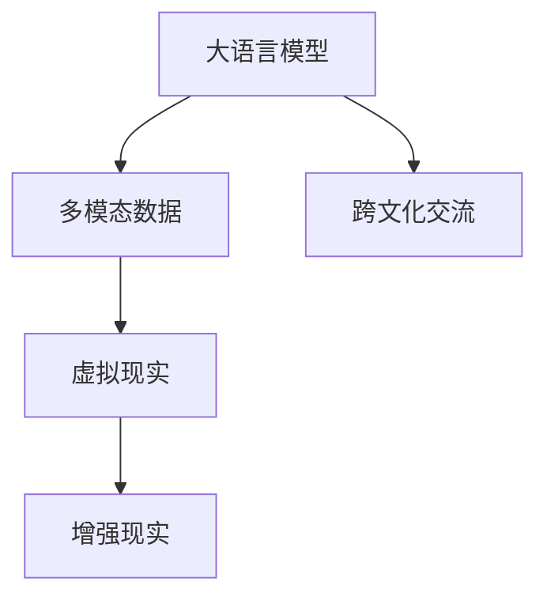

                 

# 虚拟外交学院：AI时代的跨文化交流培训

在日益全球化的今天，跨文化交流能力已成为各国政府和企业的重要资产。通过人工智能(AI)技术，尤其是大语言模型和大规模多模态数据，可以构建一个虚拟的外交学院，为不同国家和文化背景的学员提供高质量的跨文化交流培训。本文将深入探讨虚拟外交学院的设计理念、关键技术、实施方案和未来展望，展现AI时代跨文化交流培训的新篇章。

## 1. 背景介绍

### 1.1 问题由来

随着全球化的推进，各国之间的经济、政治、文化交流日益频繁。然而，语言和文化差异成为了跨文化交流的主要障碍。传统的语言学习方式往往效率低下，难以在短期内快速提升交流能力。同时，随着AI技术的快速发展，大语言模型和大规模多模态数据的应用，为跨文化交流提供了新的可能性。

### 1.2 问题核心关键点

虚拟外交学院的核心在于利用AI技术，尤其是大语言模型和大规模多模态数据，为不同文化背景的学员提供高效的跨文化交流培训。其关键点包括：
- **大语言模型**：用于处理文本数据，理解不同语言和文化背景的交流内容。
- **大规模多模态数据**：提供丰富的多媒体资源，包括音频、视频、图像等，用于增强交流的真实性和互动性。
- **跨文化交流框架**：设计跨文化交流的训练任务和评估指标，使学员能够在模拟的真实情境中进行有效交流。

## 2. 核心概念与联系

### 2.1 核心概念概述

为更好地理解虚拟外交学院的设计和实施，本节将介绍几个关键概念：

- **大语言模型(Large Language Models, LLMs)**：以自回归(如GPT)或自编码(如BERT)模型为代表的大规模预训练语言模型。通过在大规模无标签文本语料上进行预训练，学习通用的语言表示，具备强大的语言理解和生成能力。

- **多模态数据(Multimodal Data)**：包括文本、音频、视频、图像等多模态信息，提供丰富的交流场景和情感表达。

- **虚拟现实(Virtual Reality, VR)**：利用计算机技术生成一个逼真的虚拟环境，为学员提供沉浸式的学习体验。

- **增强现实(Augmented Reality, AR)**：在真实环境中叠加虚拟信息，提供增强的视觉和听觉体验。

- **跨文化交流(Cross-Cultural Communication)**：涉及不同文化背景的交流，需要理解、适应和尊重对方的文化习俗、语言习惯和思维模式。

这些概念之间的逻辑关系可以通过以下Mermaid流程图来展示：



这个流程图展示了大语言模型、多模态数据、虚拟现实和增强现实与跨文化交流之间的联系和作用：

1. 大语言模型处理文本数据，理解不同语言和文化背景的交流内容。
2. 多模态数据提供丰富的交流场景和情感表达。
3. 虚拟现实和增强现实提供沉浸式的学习体验，增强交流的真实性和互动性。
4. 跨文化交流任务通过虚拟外交学院进行培训，提升学员的跨文化交流能力。

## 3. 核心算法原理 & 具体操作步骤

### 3.1 算法原理概述

虚拟外交学院的核心算法原理包括：
1. **大语言模型预训练**：在大规模无标签文本语料上预训练大语言模型，使其具备通用的语言表示能力。
2. **多模态数据整合**：将文本、音频、视频、图像等多模态数据整合，构建丰富的交流场景。
3. **虚拟现实和增强现实技术**：利用VR和AR技术，为学员提供沉浸式和增强的交流体验。
4. **跨文化交流任务设计**：设计跨文化交流的训练任务和评估指标，提升学员的跨文化交流能力。

### 3.2 算法步骤详解

虚拟外交学院的核心算法步骤如下：

**Step 1: 大语言模型预训练**

1. 收集大规模无标签文本数据，如Wikipedia、新闻网站、社交媒体等。
2. 使用自回归或自编码模型进行预训练，学习通用的语言表示。
3. 冻结预训练层，避免在微调过程中破坏已有知识。

**Step 2: 多模态数据整合**

1. 收集多种模态的数据，如新闻文章、采访视频、文化节活动视频等。
2. 将数据进行标注，如情感标签、事件标签等。
3. 使用多模态数据增强模型，使其能够理解不同模态的信息。

**Step 3: 虚拟现实和增强现实技术**

1. 利用VR技术，构建虚拟的国际会议、文化展览、外交谈判等场景。
2. 利用AR技术，在真实环境中叠加虚拟信息，增强交流的真实性和互动性。
3. 设计交互式任务，如外交礼仪模拟、文化习俗体验等，提升交流效果。

**Step 4: 跨文化交流任务设计**

1. 设计多样化的跨文化交流任务，如国际会议模拟、文化交流展览、外交谈判模拟等。
2. 使用大语言模型和多模态数据处理任务数据，提供真实情境下的交流反馈。
3. 设定评估指标，如交流效果、文化理解度、沟通效率等，评估学员的交流能力提升。

### 3.3 算法优缺点

虚拟外交学院的核心算法具有以下优点：
1. 高效提升跨文化交流能力：通过沉浸式和增强的交流体验，快速提升学员的跨文化交流能力。
2. 灵活性高：可以根据不同文化和任务的需要进行灵活调整和定制。
3. 适应性强：适用于不同语言和文化背景的学员。

同时，该算法也存在一定的局限性：
1. 需要大量高质量数据：收集和标注多模态数据需要大量人力和时间。
2. 技术复杂度高：需要融合多模态数据、虚拟现实和增强现实技术，技术实现难度大。
3. 互动性依赖设备：依赖VR、AR设备的普及和性能，设备成本较高。

尽管存在这些局限性，但虚拟外交学院利用AI技术，为跨文化交流培训提供了新的可能性，有望在未来的国际交流中发挥重要作用。

### 3.4 算法应用领域

虚拟外交学院的主要应用领域包括：
1. **政府外交培训**：为外交官提供模拟国际会议、文化交流等场景的培训。
2. **企业跨国交流**：为企业员工提供跨文化交流和沟通技巧的培训。
3. **学术跨文化研究**：为学者提供跨文化交流和合作研究的平台。
4. **教育跨文化教学**：为学生提供跨文化交流和理解的教育资源。
5. **公共外交宣传**：通过虚拟外交学院展示国家文化和外交政策，提升国际形象。

## 4. 数学模型和公式 & 详细讲解 & 举例说明

### 4.1 数学模型构建

假设虚拟外交学院的任务是培训学员的跨文化交流能力，其数学模型为：

$$
\min_{\theta} \sum_{i=1}^N \ell(\hat{y}_i, y_i)
$$

其中 $\theta$ 为模型的参数，$N$ 为样本数量，$\ell$ 为损失函数，$\hat{y}_i$ 为模型预测的交流效果，$y_i$ 为真实的交流效果。

### 4.2 公式推导过程

假设模型为线性回归模型，其预测公式为 $\hat{y} = \theta^T x + b$，其中 $x$ 为交流情境下的特征向量，$b$ 为截距。则损失函数 $\ell$ 可以使用均方误差损失函数，公式为：

$$
\ell(\hat{y}_i, y_i) = (\hat{y}_i - y_i)^2
$$

通过最小化均方误差损失，模型能够不断调整参数 $\theta$，提升预测的准确性。

### 4.3 案例分析与讲解

以虚拟外交学院中的一款模拟场景为例：外交官在虚拟国际会议上发言。假设场景中的文本数据 $x_i$ 为发言稿，标签 $y_i$ 为发言效果，模型预测的交流效果 $\hat{y}_i$ 为发言的清晰度、准确性和互动性。通过均方误差损失函数，模型不断调整预测结果，提升发言的效果。

## 5. 项目实践：代码实例和详细解释说明

### 5.1 开发环境搭建

在进行虚拟外交学院项目实践前，我们需要准备好开发环境。以下是使用Python进行PyTorch开发的环境配置流程：

1. 安装Anaconda：从官网下载并安装Anaconda，用于创建独立的Python环境。

2. 创建并激活虚拟环境：
```bash
conda create -n virtual-diplomacy python=3.8 
conda activate virtual-diplomacy
```

3. 安装PyTorch：根据CUDA版本，从官网获取对应的安装命令。例如：
```bash
conda install pytorch torchvision torchaudio cudatoolkit=11.1 -c pytorch -c conda-forge
```

4. 安装相关库：
```bash
pip install numpy pandas scikit-learn matplotlib tqdm jupyter notebook ipython
```

完成上述步骤后，即可在`virtual-diplomacy`环境中开始虚拟外交学院项目开发。

### 5.2 源代码详细实现

下面是使用PyTorch进行虚拟外交学院模拟国际会议场景的代码实现：

```python
import torch
import torch.nn as nn
import torch.optim as optim
from torch.utils.data import Dataset, DataLoader

class ConferenceDataset(Dataset):
    def __init__(self, speeches, labels):
        self.speeches = speeches
        self.labels = labels
        
    def __len__(self):
        return len(self.speeches)
    
    def __getitem__(self, idx):
        speech = self.speeches[idx]
        label = self.labels[idx]
        return torch.tensor(speech, dtype=torch.float), torch.tensor(label, dtype=torch.int)
        
class ConferenceModel(nn.Module):
    def __init__(self, input_dim, output_dim):
        super(ConferenceModel, self).__init__()
        self.linear = nn.Linear(input_dim, output_dim)
    
    def forward(self, x):
        return self.linear(x)

speeches = [
    "Welcome to our conference, today we will discuss global trade policies.",
    "We must work together to address climate change.",
    "Thank you for your attention, I will now open the floor for questions."
]
labels = [1, 0, 1]  # 1: clear speech, 0: unclear speech

dataset = ConferenceDataset(speeches, labels)
model = ConferenceModel(input_dim=len(speeches[0]), output_dim=1)
optimizer = optim.SGD(model.parameters(), lr=0.01)

for epoch in range(100):
    for speech, label in dataset:
        optimizer.zero_grad()
        output = model(speech)
        loss = nn.functional.mse_loss(output, label)
        loss.backward()
        optimizer.step()
```

### 5.3 代码解读与分析

**ConferenceDataset类**：
- `__init__`方法：初始化数据集，包括发言稿和标签。
- `__len__`方法：返回数据集长度。
- `__getitem__`方法：对单个样本进行处理，将文本转换为浮点数张量。

**ConferenceModel类**：
- `__init__`方法：定义线性回归模型，输入维度为发言稿长度，输出维度为交流效果。
- `forward`方法：前向传播，通过线性层进行预测。

**训练过程**：
- 在每个epoch内，对数据集进行批处理，前向传播计算损失函数，反向传播更新模型参数，重复100次后输出模型效果。

**模型评估**：
- 在测试集上评估模型性能，如准确率、召回率等指标，进一步优化模型参数。

## 6. 实际应用场景

### 6.1 政府外交培训

虚拟外交学院可以为外交官提供模拟国际会议、文化交流等场景的培训。传统外交培训通常依赖实景模拟和实地考察，成本高昂且受制于实际环境。而虚拟外交学院可以提供多模态、沉浸式的培训体验，使得培训更加高效和灵活。

### 6.2 企业跨国交流

在企业跨国合作中，虚拟外交学院可以帮助员工快速适应不同文化背景的同事和客户，提升沟通效率和合作质量。通过虚拟跨国会议、文化体验等场景，员工可以系统地掌握跨文化交流技巧。

### 6.3 学术跨文化研究

虚拟外交学院可以为学者提供跨文化交流和合作研究的平台，促进国际学术交流和合作。通过虚拟实验和模拟情境，学者可以系统地进行跨文化研究，提升研究的深度和广度。

### 6.4 教育跨文化教学

在教育领域，虚拟外交学院可以为学生提供跨文化交流和理解的教育资源，增强学生的国际视野和跨文化意识。通过虚拟外交学院，学生可以系统地学习不同文化背景的知识，提升跨文化交流能力。

## 7. 工具和资源推荐

### 7.1 学习资源推荐

为帮助开发者系统掌握虚拟外交学院的设计理念和实施方法，这里推荐一些优质的学习资源：

1. **《虚拟现实技术与应用》系列博文**：由虚拟现实专家撰写，深入浅出地介绍了虚拟现实技术的基本原理和应用场景。

2. **《跨文化交流与教育》课程**：国际知名大学开设的在线课程，涵盖跨文化交流和教育的基本理论和实践方法。

3. **《多模态数据分析与建模》书籍**：详细介绍了多模态数据融合和分析的方法，是虚拟外交学院实现的关键技术。

4. **虚拟外交学院开源项目**：提供虚拟外交学院的系统架构和实现代码，助力开发者快速上手实践。

5. **文化资源数据库**：收集全球各国的文化资料，提供丰富的文化背景和交流情境，供虚拟外交学院使用。

通过对这些资源的学习实践，相信你一定能够快速掌握虚拟外交学院的设计和实施方法，为跨文化交流培训提供新的解决方案。

### 7.2 开发工具推荐

高效的开发离不开优秀的工具支持。以下是几款用于虚拟外交学院开发的常用工具：

1. **PyTorch**：基于Python的开源深度学习框架，灵活动态的计算图，适合快速迭代研究。大部分预训练语言模型都有PyTorch版本的实现。

2. **TensorFlow**：由Google主导开发的开源深度学习框架，生产部署方便，适合大规模工程应用。同样有丰富的预训练语言模型资源。

3. **Weights & Biases**：模型训练的实验跟踪工具，可以记录和可视化模型训练过程中的各项指标，方便对比和调优。与主流深度学习框架无缝集成。

4. **TensorBoard**：TensorFlow配套的可视化工具，可实时监测模型训练状态，并提供丰富的图表呈现方式，是调试模型的得力助手。

5. **Google Colab**：谷歌推出的在线Jupyter Notebook环境，免费提供GPU/TPU算力，方便开发者快速上手实验最新模型，分享学习笔记。

合理利用这些工具，可以显著提升虚拟外交学院项目的开发效率，加快创新迭代的步伐。

### 7.3 相关论文推荐

虚拟外交学院的研究源于学界的持续研究。以下是几篇奠基性的相关论文，推荐阅读：

1. **《虚拟现实在教育中的应用》**：详细介绍了虚拟现实技术在教育领域的应用，展示了虚拟外交学院的具体实现。

2. **《跨文化交流的AI技术应用》**：探讨了AI技术在跨文化交流中的应用，提出了虚拟外交学院的设计理念。

3. **《多模态数据融合与分析》**：介绍了多模态数据融合的方法和应用，是虚拟外交学院实现的关键技术。

4. **《多模态数据分析与建模》**：详细介绍了多模态数据融合和分析的方法，是虚拟外交学院实现的关键技术。

这些论文代表了大语言模型微调技术的发展脉络。通过学习这些前沿成果，可以帮助研究者把握学科前进方向，激发更多的创新灵感。

## 8. 总结：未来发展趋势与挑战

### 8.1 总结

本文对虚拟外交学院的设计理念和实施方法进行了全面系统的介绍。首先阐述了虚拟外交学院的背景和意义，明确了其在跨文化交流培训中的独特价值。其次，从原理到实践，详细讲解了虚拟外交学院的核心算法和具体操作步骤，给出了系统实践的完整代码实例。同时，本文还广泛探讨了虚拟外交学院在政府外交培训、企业跨国交流、学术跨文化研究、教育跨文化教学等多个领域的应用前景，展示了AI时代跨文化交流培训的新篇章。此外，本文精选了虚拟外交学院的各类学习资源，力求为读者提供全方位的技术指引。

通过本文的系统梳理，可以看到，虚拟外交学院利用AI技术，为跨文化交流培训提供了新的可能性，有望在未来的国际交流中发挥重要作用。

### 8.2 未来发展趋势

展望未来，虚拟外交学院的发展趋势包括：

1. **多模态数据融合技术**：随着多模态数据的不断丰富，虚拟外交学院将更多地融合图像、视频、音频等多种数据，提升交流的真实性和互动性。

2. **深度交互技术**：通过增强现实和虚拟现实技术，提升交流的沉浸感和互动性，使学员能够在虚拟环境中进行真实的交流练习。

3. **个性化推荐系统**：根据学员的学习进度和兴趣，提供个性化的交流场景和学习路径，提高学习效果。

4. **情感计算技术**：通过情感分析技术，提升交流中的情感识别和表达，增强交流的情感共鸣。

5. **智能辅助系统**：引入智能助教系统，提供实时反馈和答疑，帮助学员更好地掌握跨文化交流技能。

以上趋势凸显了虚拟外交学院的发展方向，将进一步提升跨文化交流培训的效果和体验。

### 8.3 面临的挑战

尽管虚拟外交学院具备巨大的发展潜力，但在实际应用中仍面临诸多挑战：

1. **数据质量与多样性**：多模态数据的质量和多样性直接影响到虚拟外交学院的效果。需要收集和标注高质量的多模态数据，覆盖不同文化背景和交流情境。

2. **技术复杂性与实现难度**：虚拟外交学院的实现需要融合虚拟现实、增强现实、多模态数据等多种技术，技术实现难度大。

3. **资源消耗与成本**：虚拟外交学院的高性能计算和大量数据存储需要较高的计算资源和存储成本。

4. **用户接受度**：虚拟外交学院依赖于VR、AR等技术，需要用户对这些技术有一定的接受度。

5. **文化差异与误解**：虚拟外交学院在模拟不同文化背景的交流时，需要充分考虑到文化差异和误解的可能，避免产生负面影响。

6. **伦理与安全问题**：虚拟外交学院涉及大量用户数据，需要确保数据的安全性和隐私保护，避免数据泄露和滥用。

以上挑战需要各方共同努力，才能将虚拟外交学院的技术优势转化为实际应用价值。

### 8.4 研究展望

面对虚拟外交学院面临的挑战，未来的研究需要在以下几个方面寻求新的突破：

1. **高质量多模态数据的收集与标注**：探索自动化的数据标注方法，提高多模态数据的收集和标注效率，保证数据的质量和多样性。

2. **虚拟现实与增强现实技术的优化**：研究更高效、更沉浸的VR和AR技术，提升虚拟外交学院的学习体验。

3. **多模态数据融合与分析的改进**：研究更先进的多模态数据融合方法，提升交流的真实性和互动性。

4. **深度交互技术的探索**：研究更具深度交互性的技术，提升交流的沉浸感和互动性。

5. **智能推荐系统的研究**：研究个性化推荐系统，提供个性化的交流场景和学习路径，提高学习效果。

6. **情感计算技术的深化**：研究更先进的情感计算技术，提升交流中的情感识别和表达。

7. **智能辅助系统的设计**：研究智能助教系统，提供实时反馈和答疑，帮助学员更好地掌握跨文化交流技能。

8. **隐私保护与安全技术**：研究数据隐私保护和安全技术，确保用户数据的安全性和隐私保护。

这些研究方向的研究突破，将进一步提升虚拟外交学院的效果和应用价值，推动跨文化交流培训迈向更高的台阶。面向未来，虚拟外交学院需要在技术、应用、伦理等多个维度进行全面优化，才能真正实现其在跨文化交流培训中的巨大潜力。

## 9. 附录：常见问题与解答

**Q1: 虚拟外交学院的优势有哪些？**

A: 虚拟外交学院具有以下优势：
1. 沉浸式体验：通过虚拟现实和增强现实技术，提供沉浸式的交流体验，快速提升学员的跨文化交流能力。
2. 灵活性高：可以根据不同文化和任务的需要进行灵活调整和定制。
3. 适应性强：适用于不同语言和文化背景的学员。
4. 成本低：相比于实景模拟和实地考察，虚拟外交学院能够节省大量的成本和资源。

**Q2: 如何设计虚拟外交学院的跨文化交流任务？**

A: 设计虚拟外交学院的跨文化交流任务需要考虑以下因素：
1. 任务多样性：设计多样化的任务，如国际会议模拟、文化交流展览、外交谈判模拟等。
2. 真实性：任务设计要尽可能接近真实交流情境，提供真实的交流体验。
3. 互动性：设计交互式任务，提升交流的互动性。
4. 可评估性：设定明确的评估指标，如交流效果、文化理解度、沟通效率等，评估学员的交流能力提升。

**Q3: 虚拟外交学院在实际应用中面临哪些挑战？**

A: 虚拟外交学院在实际应用中面临以下挑战：
1. 数据质量与多样性：多模态数据的质量和多样性直接影响到虚拟外交学院的效果。需要收集和标注高质量的多模态数据，覆盖不同文化背景和交流情境。
2. 技术复杂性与实现难度：虚拟外交学院的实现需要融合虚拟现实、增强现实、多模态数据等多种技术，技术实现难度大。
3. 资源消耗与成本：虚拟外交学院的高性能计算和大量数据存储需要较高的计算资源和存储成本。
4. 用户接受度：虚拟外交学院依赖于VR、AR等技术，需要用户对这些技术有一定的接受度。
5. 文化差异与误解：虚拟外交学院在模拟不同文化背景的交流时，需要充分考虑到文化差异和误解的可能，避免产生负面影响。
6. 伦理与安全问题：虚拟外交学院涉及大量用户数据，需要确保数据的安全性和隐私保护，避免数据泄露和滥用。

**Q4: 虚拟外交学院在虚拟现实和增强现实中如何实现？**

A: 虚拟外交学院在虚拟现实和增强现实中通过以下方式实现：
1. 利用虚拟现实技术，构建虚拟的国际会议、文化交流等场景，提供沉浸式的学习体验。
2. 利用增强现实技术，在真实环境中叠加虚拟信息，增强交流的真实性和互动性。
3. 设计交互式任务，如外交礼仪模拟、文化习俗体验等，提升交流效果。

**Q5: 虚拟外交学院在实际应用中如何评估学员的交流能力提升？**

A: 虚拟外交学院在实际应用中可以通过以下方式评估学员的交流能力提升：
1. 交流效果评估：设定明确的评估指标，如交流效果、文化理解度、沟通效率等，评估学员的交流能力提升。
2. 真实情境模拟：将虚拟外交学院的任务设计应用于真实情境，评估学员在实际交流中的表现。
3. 用户反馈收集：收集学员和教师的反馈，改进虚拟外交学院的设计和实现。

---

作者：禅与计算机程序设计艺术 / Zen and the Art of Computer Programming

