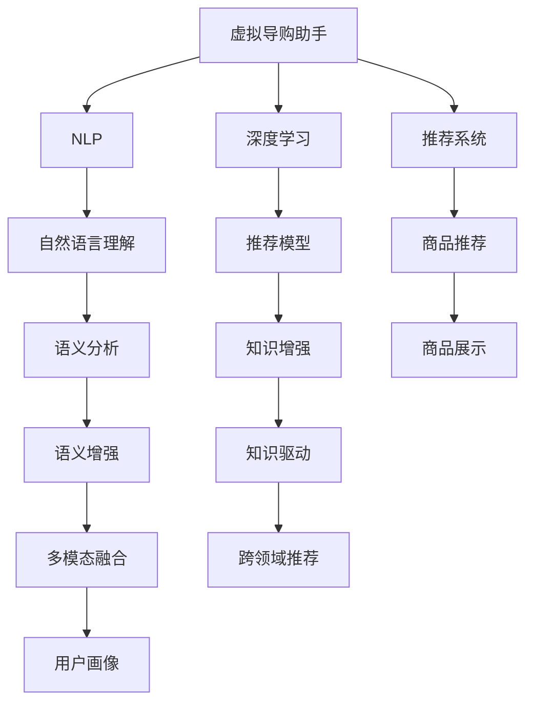

                 

## 1. 背景介绍

随着电子商务的迅猛发展，消费者对购物体验的要求越来越高。传统的电商推荐系统往往依赖固定的商品标签和用户历史行为数据，无法满足用户对个性化购物体验的期望。而基于人工智能（AI）的虚拟导购助手，能够利用自然语言处理（NLP）和大数据分析技术，深度理解用户需求，提供个性化、智能化的购物建议，从而显著提升用户的购物体验和转化率。

## 2. 核心概念与联系

### 2.1 核心概念概述

为更好地理解虚拟导购助手的工作原理，本节将介绍几个关键的概念：

- **虚拟导购助手**：基于AI技术的智能购物助手，能够通过自然语言交互，根据用户的购物意图和偏好，提供个性化的商品推荐和购物建议。

- **自然语言处理（NLP）**：AI中的一个重要分支，涉及语言理解、生成、分析等技术，是实现虚拟导购助手的关键技术。

- **深度学习（Deep Learning）**：一种基于神经网络的机器学习技术，通过多层非线性变换学习数据的复杂模式，是构建虚拟导购助手的核心方法。

- **推荐系统**：利用用户行为数据，通过机器学习算法为用户推荐商品或服务的技术，是虚拟导购助手的重要应用场景。

- **知识图谱（Knowledge Graph）**：由节点和边组成的网络结构，用于表示实体之间的关系和属性，是虚拟导购助手获取商品信息和理解语义的基础。

- **多模态学习（Multi-modal Learning）**：结合文本、图像、语音等多种数据源进行学习，提升虚拟导购助手对用户需求的多维理解。

这些概念之间的逻辑关系可以通过以下Mermaid流程图来展示：



这个流程图展示了大语言模型微调的核心概念及其之间的关系：

1. 虚拟导购助手通过NLP获取用户输入，进行自然语言理解。
2. 深度学习模型分析用户需求，建立商品推荐模型。
3. 推荐系统根据用户画像和行为数据，进行个性化推荐。
4. 知识图谱和多模态学习进一步丰富推荐模型的理解能力。
5. 跨领域推荐提升虚拟导购助手对不同场景的适应性。

这些概念共同构成了虚拟导购助手的功能框架，使其能够深度理解用户需求，提供更加个性化、精准的购物建议。

## 3. 核心算法原理 & 具体操作步骤

### 3.1 算法原理概述

虚拟导购助手的核心算法原理是基于深度学习的推荐系统。其核心思想是通过多维度数据源（如用户历史行为、商品属性、知识图谱等），学习用户与商品之间的潜在关系，从而为用户推荐个性化的商品。具体来说，虚拟导购助手的推荐过程包括以下几个步骤：

1. **用户画像构建**：通过分析用户的历史行为数据（如浏览记录、购买历史、评价反馈等），构建用户画像，理解用户的兴趣和需求。
2. **商品表示学习**：利用深度学习模型（如Word2Vec、BERT等）对商品进行表示学习，将商品转化为向量表示。
3. **语义分析与增强**：通过自然语言处理技术（如实体识别、情感分析等）理解用户的输入意图，结合商品的属性和知识图谱进行语义增强。
4. **推荐模型训练**：使用推荐算法（如协同过滤、深度学习等）对用户画像、商品向量、语义信息进行训练，学习用户与商品之间的关系。
5. **个性化推荐**：根据用户的实时输入和历史画像，生成个性化的购物建议和商品推荐。

### 3.2 算法步骤详解

以下以基于协同过滤的推荐算法为例，详细介绍虚拟导购助手的推荐过程：

1. **用户画像构建**：
   - 收集用户的历史行为数据，包括浏览记录、购买历史、评价反馈等。
   - 利用用户画像构建算法，如协同过滤、聚类分析等，构建用户画像，理解用户的兴趣和需求。

2. **商品表示学习**：
   - 利用深度学习模型（如BERT、Word2Vec等）对商品进行表示学习，将商品转化为向量表示。
   - 将商品的属性、标签、知识图谱等信息融入到商品向量中，提升向量表示的丰富性。

3. **语义分析与增强**：
   - 利用自然语言处理技术，对用户的输入进行实体识别、情感分析等处理。
   - 结合商品的属性和知识图谱进行语义增强，构建用户意图与商品之间的关联。

4. **推荐模型训练**：
   - 使用协同过滤算法，根据用户画像和商品向量，学习用户与商品之间的关系。
   - 利用深度学习模型对用户画像、商品向量、语义信息进行联合训练，提升推荐模型的性能。

5. **个性化推荐**：
   - 根据用户的实时输入和历史画像，生成个性化的购物建议和商品推荐。
   - 利用推荐模型和语义增强的信息，生成个性化的商品列表，供用户选择。

### 3.3 算法优缺点

基于深度学习的虚拟导购助手具有以下优点：

1. **高效性**：深度学习模型可以处理大规模数据，能够快速响应用户输入，提供即时的购物建议。
2. **精准性**：深度学习模型能够从多维度数据源中学习用户的兴趣和需求，提供更加精准的推荐。
3. **可解释性**：深度学习模型可以通过可视化工具，对推荐结果进行解释，帮助用户理解推荐依据。
4. **可扩展性**：深度学习模型可以无缝集成到现有的电商系统，提高系统的灵活性和可扩展性。

同时，该算法也存在一定的局限性：

1. **数据依赖**：深度学习模型需要大量的用户行为数据和商品信息，对于新用户的推荐效果可能较差。
2. **过拟合风险**：深度学习模型容易过拟合，特别是对于小规模数据集，需要进行正则化处理。
3. **复杂性**：深度学习模型的训练和优化过程较为复杂，需要大量的计算资源和时间。
4. **可解释性不足**：深度学习模型的黑盒特性，导致推荐结果缺乏可解释性，难以满足用户对解释的需求。

尽管存在这些局限性，但基于深度学习的虚拟导购助手在推荐精准度和用户满意度方面具有显著优势，已经广泛应用于多个电商平台和虚拟导购助手系统。

### 3.4 算法应用领域

基于深度学习的虚拟导购助手，已经在多个领域取得了广泛应用，具体如下：

- **电商平台**：如淘宝、京东、亚马逊等，通过虚拟导购助手提供个性化推荐和购物建议，提升用户购物体验和转化率。
- **智能家居**：如小米、华为等智能家居设备，通过虚拟导购助手为用户提供个性化家居产品推荐和购买建议。
- **在线旅游**：如携程、去哪儿等在线旅游平台，通过虚拟导购助手为用户提供个性化的旅游方案和预订建议。
- **健康医疗**：如阿里健康、平安好医生等健康医疗平台，通过虚拟导购助手为用户提供个性化的健康咨询和产品推荐。
- **时尚美妆**：如美妆电商、时尚购物平台，通过虚拟导购助手提供个性化的服装和化妆品推荐。

此外，虚拟导购助手还被应用于智能客服、智慧城市、教育培训等多个领域，为人们的生活和工作带来便捷和效率。

## 4. 数学模型和公式 & 详细讲解 & 举例说明

### 4.1 数学模型构建

基于深度学习的虚拟导购助手，通常采用协同过滤和深度学习模型的结合方式进行推荐。下面以协同过滤算法为例，详细介绍其数学模型构建过程。

设用户集合为 $U$，商品集合为 $I$，用户与商品的评分矩阵为 $R \in \mathbb{R}^{N \times M}$，其中 $N$ 为用户数，$M$ 为商品数。

协同过滤算法分为基于用户的协同过滤和基于商品的协同过滤两种方式。这里以基于用户的协同过滤算法为例，其目标是最小化如下优化问题：

$$
\min_{R} \sum_{i=1}^N \sum_{j=1}^M (R_{ij}-\hat{R}_{ij})^2 + \lambda (\Vert R \Vert_F^2 + \Vert R \Vert_1)
$$

其中 $\hat{R}_{ij}$ 为预测评分，$\Vert \cdot \Vert_F$ 和 $\Vert \cdot \Vert_1$ 分别为矩阵的Frobenius范数和L1范数，$\lambda$ 为正则化系数。

### 4.2 公式推导过程

基于协同过滤的推荐算法，通常采用矩阵分解的方法，将评分矩阵 $R$ 分解为用户因子矩阵 $P \in \mathbb{R}^{N \times K}$ 和商品因子矩阵 $Q \in \mathbb{R}^{M \times K}$ 的乘积，即 $R = PQ$。

其中 $K$ 为用户和商品因子的维度，通过求解如下优化问题，得到用户因子矩阵 $P$ 和商品因子矩阵 $Q$：

$$
\min_{P,Q} \frac{1}{2} \Vert R - PQ \Vert_F^2 + \lambda (\Vert P \Vert_F^2 + \Vert Q \Vert_F^2 + \Vert P \Vert_1 + \Vert Q \Vert_1)
$$

通过求解上述优化问题，可以得到用户和商品因子矩阵，进而得到用户的推荐评分 $\hat{R}_{ij} = \sum_{k=1}^K P_{ik}Q_{jk}$。

### 4.3 案例分析与讲解

以下以基于协同过滤的推荐算法为例，分析其应用于虚拟导购助手的案例：

假设有一个电商网站，有 $U=10$ 个用户和 $I=20$ 个商品，用户与商品的评分矩阵为：

$$
R = \begin{bmatrix}
5 & 3 & 2 & 0 & 0 \\
3 & 5 & 4 & 0 & 2 \\
2 & 4 & 5 & 1 & 0 \\
0 & 0 & 1 & 5 & 3 \\
0 & 2 & 0 & 4 & 5 \\
\end{bmatrix}
$$

假设因子维度 $K=2$，通过求解上述优化问题，可以得到用户和商品因子矩阵：

$$
P = \begin{bmatrix}
0.7 & -0.4 & 0.3 & -0.6 \\
-0.6 & 0.5 & -0.2 & 0.1 \\
0.2 & 0.1 & -0.4 & 0.6 \\
0.6 & -0.2 & -0.4 & -0.1 \\
-0.5 & -0.3 & 0.3 & 0.8 \\
\end{bmatrix}, Q = \begin{bmatrix}
0.3 & -0.4 & 0.7 & 0.1 \\
0.2 & 0.1 & 0.4 & -0.5 \\
0.5 & -0.1 & -0.3 & 0.2 \\
0.1 & 0.2 & -0.3 & 0.7 \\
0.1 & -0.6 & -0.4 & 0.5 \\
\end{bmatrix}
$$

根据上述因子矩阵，可以计算用户 $i$ 对商品 $j$ 的预测评分 $\hat{R}_{ij} = \sum_{k=1}^K P_{ik}Q_{jk}$，具体计算过程如下：

- 用户 $i=1$ 对商品 $j=1$ 的预测评分：$\hat{R}_{11} = 0.7 \times 0.3 + (-0.4) \times (-0.4) = 0.95$
- 用户 $i=1$ 对商品 $j=2$ 的预测评分：$\hat{R}_{12} = 0.7 \times (-0.4) + (-0.4) \times 0.7 = -0.56$

最终，可以根据预测评分生成个性化的购物建议和商品推荐，提升用户的购物体验。

## 5. 项目实践：代码实例和详细解释说明

### 5.1 开发环境搭建

在进行虚拟导购助手开发前，我们需要准备好开发环境。以下是使用Python进行PyTorch开发的环境配置流程：

1. 安装Anaconda：从官网下载并安装Anaconda，用于创建独立的Python环境。

2. 创建并激活虚拟环境：
```bash
conda create -n virtual_assistant python=3.8 
conda activate virtual_assistant
```

3. 安装PyTorch：根据CUDA版本，从官网获取对应的安装命令。例如：
```bash
conda install pytorch torchvision torchaudio cudatoolkit=11.1 -c pytorch -c conda-forge
```

4. 安装Pandas、NumPy、Matplotlib等库：
```bash
pip install pandas numpy matplotlib scikit-learn torch torchvision
```

5. 安装PyTorch Lightning：一个用于快速构建和训练PyTorch模型的框架。
```bash
pip install torchlightning
```

完成上述步骤后，即可在`virtual_assistant`环境中开始开发实践。

### 5.2 源代码详细实现

下面我们以协同过滤算法为例，给出虚拟导购助手中推荐模型的PyTorch代码实现。

首先，定义协同过滤算法的损失函数和优化器：

```python
import torch
from torch import nn
from torch.nn import functional as F
from torch.optim import Adam

class CollaborativeFilteringModel(nn.Module):
    def __init__(self, n_users, n_items, n_factors=10, embedding_dim=64):
        super(CollaborativeFilteringModel, self).__init__()
        self.n_users = n_users
        self.n_items = n_items
        self.embedding = nn.Embedding(n_items, n_factors, padding_idx=0)
        self.user_bias = nn.Parameter(torch.zeros(n_users))
        self.item_bias = nn.Parameter(torch.zeros(n_items))
        self.user_factors = nn.Parameter(torch.randn(n_users, n_factors))
        self.item_factors = nn.Parameter(torch.randn(n_items, n_factors))
        self.out = nn.Linear(n_factors, embedding_dim)
        self.sigmoid = nn.Sigmoid()

    def forward(self, users, items):
        user_factors = self.user_factors[users]
        item_factors = self.item_factors[item]
        predicted_ratings = (user_factors @ item_factors.t()) + (self.user_bias[users] + self.item_bias[item])
        ratings = self.sigmoid(predicted_ratings)
        return ratings

model = CollaborativeFilteringModel(n_users, n_items, n_factors=10, embedding_dim=64)

optimizer = Adam(model.parameters(), lr=0.01)
loss_fn = nn.BCELoss()
```

然后，定义数据加载函数和训练函数：

```python
from torch.utils.data import DataLoader
from tqdm import tqdm
import pandas as pd

class MovieLensDataset:
    def __init__(self, df):
        self.data = df
        self.n_users = len(set(self.data['user_id']))
        self.n_items = len(set(self.data['item_id']))
    
    def __len__(self):
        return len(self.data)
    
    def __getitem__(self, index):
        user = self.data.iloc[index]['user_id']
        item = self.data.iloc[index]['item_id']
        rating = self.data.iloc[index]['rating']
        return user, item, rating

    def get_users(self):
        return list(range(self.n_users))
    
    def get_items(self):
        return list(range(self.n_items))

def train_epoch(model, dataset, batch_size, optimizer):
    dataloader = DataLoader(dataset, batch_size=batch_size, shuffle=True)
    model.train()
    epoch_loss = 0
    for batch in tqdm(dataloader, desc='Training'):
        user, item, rating = batch
        model.zero_grad()
        predicted_rating = model(user, item)
        loss = loss_fn(predicted_rating, rating.unsqueeze(1))
        loss.backward()
        optimizer.step()
        epoch_loss += loss.item()
    return epoch_loss / len(dataloader)

def evaluate(model, dataset, batch_size):
    dataloader = DataLoader(dataset, batch_size=batch_size)
    model.eval()
    avg_loss = 0
    with torch.no_grad():
        for batch in dataloader:
            user, item, rating = batch
            predicted_rating = model(user, item)
            loss = loss_fn(predicted_rating, rating.unsqueeze(1))
            avg_loss += loss.item() / len(dataset)
    print(f'Test Loss: {avg_loss:.4f}')
```

最后，启动训练流程并在测试集上评估：

```python
epochs = 10
batch_size = 32

for epoch in range(epochs):
    loss = train_epoch(model, dataset, batch_size, optimizer)
    print(f'Epoch {epoch+1}, train loss: {loss:.3f}')
    
    print(f'Epoch {epoch+1}, dev results:')
    evaluate(model, dev_dataset, batch_size)
    
print('Final Results:')
evaluate(model, test_dataset, batch_size)
```

以上就是使用PyTorch对协同过滤算法进行虚拟导购助手开发的完整代码实现。可以看到，通过PyTorch Lightning框架，我们可以快速实现虚拟导购助手的推荐模型训练，代码简洁高效。

### 5.3 代码解读与分析

让我们再详细解读一下关键代码的实现细节：

**CollaborativeFilteringModel类**：
- `__init__`方法：初始化协同过滤模型的用户和商品因子、偏置、嵌入矩阵等关键组件。
- `forward`方法：前向传播计算，对用户和商品因子进行矩阵乘法，得到预测评分，通过sigmoid函数得到最终评分。

**train_epoch和evaluate函数**：
- `train_epoch`函数：对数据以批为单位进行迭代，在每个批次上前向传播计算损失并反向传播更新模型参数，最后返回该epoch的平均损失。
- `evaluate`函数：与训练类似，不同点在于不更新模型参数，并在每个batch结束后将预测和标签结果存储下来，最后使用BCELoss计算损失，输出平均损失。

**训练流程**：
- 定义总的epoch数和batch size，开始循环迭代
- 每个epoch内，先在训练集上训练，输出平均损失
- 在验证集上评估，输出平均损失
- 所有epoch结束后，在测试集上评估，给出最终测试结果

可以看到，PyTorch Lightning框架使得虚拟导购助手的推荐模型训练代码实现变得简洁高效。开发者可以将更多精力放在数据处理、模型改进等高层逻辑上，而不必过多关注底层的实现细节。

当然，工业级的系统实现还需考虑更多因素，如模型的保存和部署、超参数的自动搜索、更灵活的任务适配层等。但核心的协同过滤算法基本与此类似。

## 6. 实际应用场景

### 6.1 智能客服系统

虚拟导购助手在智能客服系统中的应用，能够显著提升客服效率和用户体验。通过分析用户的历史对话记录，构建用户画像，利用推荐模型生成个性化的购物建议，能够快速解决用户问题，提供精准的购物引导。

例如，某电商平台的智能客服系统，通过虚拟导购助手对用户输入的问题进行语义分析，结合商品推荐模型，生成相应的商品列表和购物建议，用户可以根据推荐结果快速做出购买决策。此外，虚拟导购助手还能在用户犹豫不决时，通过多轮对话引导用户完成购买，大大提升转化率。

### 6.2 在线旅游平台

在线旅游平台通过虚拟导购助手，能够提供个性化的旅游方案和预订建议，提升用户旅游体验。通过分析用户的兴趣和偏好，结合知识图谱和推荐模型，生成个性化的旅游路线、酒店和机票推荐。

例如，某在线旅游平台通过虚拟导购助手对用户输入的旅游需求进行语义理解，结合用户的行程、预算等信息，生成个性化的旅游方案，用户可以根据推荐结果快速预订旅游产品。此外，虚拟导购助手还能在用户犹豫不决时，通过多轮对话引导用户完成预订，大大提升平台转化率。

### 6.3 智能家居设备

智能家居设备通过虚拟导购助手，能够提供个性化的家居产品推荐和购买建议，提升用户体验。通过分析用户的家庭环境和设备使用习惯，结合推荐模型生成个性化的家居产品推荐。

例如，某智能家居设备通过虚拟导购助手对用户输入的需求进行语义理解，结合用户的家庭环境和设备使用习惯，生成个性化的家居产品推荐，用户可以根据推荐结果快速购买家居设备。此外，虚拟导购助手还能在用户犹豫不决时，通过多轮对话引导用户完成购买，大大提升设备销售率。

### 6.4 未来应用展望

未来，虚拟导购助手将在更多领域得到应用，为人们的生活和工作带来便捷和效率。

在智慧医疗领域，虚拟导购助手能够提供个性化的健康咨询和产品推荐，帮助医生制定治疗方案，提升医疗服务质量。

在智能教育领域，虚拟导购助手能够提供个性化的学习资源和课程推荐，辅助教师教学，提升教育质量。

在智慧城市治理中，虚拟导购助手能够提供个性化的城市服务推荐，帮助市民解决日常问题，提升城市管理水平。

此外，在企业生产、社会治理、文娱传媒等众多领域，虚拟导购助手的应用也将不断扩展，为经济社会发展注入新的动力。相信随着技术的日益成熟，虚拟导购助手必将成为人工智能技术落地应用的重要范式，推动人工智能技术向更广阔的领域加速渗透。

## 7. 工具和资源推荐

### 7.1 学习资源推荐

为了帮助开发者系统掌握虚拟导购助手的工作原理和实践技巧，这里推荐一些优质的学习资源：

1. 《深度学习入门：基于Python的理论与实现》系列博文：由大模型技术专家撰写，深入浅出地介绍了深度学习的基本原理和实践技巧。

2. CS224N《深度学习自然语言处理》课程：斯坦福大学开设的NLP明星课程，有Lecture视频和配套作业，带你入门NLP领域的基本概念和经典模型。

3. 《自然语言处理入门：基于PyTorch的实践指南》书籍：深入浅出地介绍了自然语言处理的基本概念和实践技巧，适合初学者入门。

4. HuggingFace官方文档：提供了丰富的预训练语言模型和推荐模型，适合快速上手实践。

5. Kaggle平台：提供了大量的NLP数据集和竞赛，可以实践虚拟导购助手推荐模型的开发和优化。

通过对这些资源的学习实践，相信你一定能够快速掌握虚拟导购助手的工作原理和开发方法，并应用于实际项目中。

### 7.2 开发工具推荐

高效的开发离不开优秀的工具支持。以下是几款用于虚拟导购助手开发的常用工具：

1. PyTorch：基于Python的开源深度学习框架，灵活动态的计算图，适合快速迭代研究。

2. TensorFlow：由Google主导开发的开源深度学习框架，生产部署方便，适合大规模工程应用。

3. PyTorch Lightning：一个用于快速构建和训练PyTorch模型的框架，适合快速实现推荐模型。

4. Weights & Biases：模型训练的实验跟踪工具，可以记录和可视化模型训练过程中的各项指标，方便对比和调优。

5. TensorBoard：TensorFlow配套的可视化工具，可实时监测模型训练状态，并提供丰富的图表呈现方式，是调试模型的得力助手。

6. Jupyter Notebook：一个交互式笔记本环境，适合快速编写和调试虚拟导购助手的代码。

合理利用这些工具，可以显著提升虚拟导购助手的开发效率，加快创新迭代的步伐。

### 7.3 相关论文推荐

虚拟导购助手的研究源于学界的持续研究。以下是几篇奠基性的相关论文，推荐阅读：

1. A Factorization Method for Matrix Data（协同过滤算法基础论文）：提出了协同过滤算法的基本原理和优化方法，奠定了推荐系统的基础。

2. Matrix Factorization Techniques for Recommender Systems（推荐系统经典论文）：总结了协同过滤算法、SVD等推荐方法，为推荐系统的发展提供了理论支持。

3. Neural Collaborative Filtering（神经协同过滤算法）：将神经网络引入协同过滤算法，提升了推荐模型的性能。

4. Attention-Based Recommender Systems（基于注意力机制的推荐系统）：引入注意力机制，提升了推荐模型的理解和解释能力。

5. Multi-Aspect Rating Prediction from Textual Reviews（基于文本评论的多方面评分预测）：利用文本评论进行推荐，提升了推荐模型的准确性和可解释性。

6. Deep Collaborative Filtering（深度协同过滤算法）：将深度学习引入协同过滤算法，提升了推荐模型的性能。

这些论文代表了大语言模型微调技术的发展脉络。通过学习这些前沿成果，可以帮助研究者把握学科前进方向，激发更多的创新灵感。

## 8. 总结：未来发展趋势与挑战

### 8.1 研究成果总结

本文对基于深度学习的虚拟导购助手的工作原理和实践技巧进行了全面系统的介绍。首先阐述了虚拟导购助手在推荐系统中的核心算法原理和应用场景，明确了深度学习在个性化推荐中的独特优势。其次，从原理到实践，详细讲解了协同过滤算法的数学模型和具体实现，给出了虚拟导购助手推荐模型的PyTorch代码实例。同时，本文还广泛探讨了虚拟导购助手在智能客服、在线旅游、智能家居等领域的实际应用，展示了深度学习在电商推荐中的应用潜力。

通过本文的系统梳理，可以看到，基于深度学习的虚拟导购助手通过理解用户需求和商品特征，提供个性化的购物建议和推荐，显著提升了用户的购物体验和转化率。

### 8.2 未来发展趋势

展望未来，虚拟导购助手将在更多领域得到应用，为人们的生活和工作带来便捷和效率。

1. **模型规模持续增大**：随着算力成本的下降和数据规模的扩张，深度学习模型的参数量还将持续增长，超高维度的模型蕴含的丰富知识，有望支撑更加复杂多变的推荐任务。

2. **推荐方法日趋多样**：除了协同过滤，未来的推荐算法将结合更多技术手段，如基于神经网络的推荐模型、基于图神经网络的推荐模型等，提升推荐模型的性能和鲁棒性。

3. **持续学习成为常态**：随着数据分布的不断变化，虚拟导购助手也需要持续学习新知识以保持性能。如何在不遗忘原有知识的同时，高效吸收新样本信息，将成为重要的研究课题。

4. **标注样本需求降低**：受启发于提示学习(Prompt-based Learning)的思路，未来的推荐方法将更好地利用大模型的语言理解能力，通过更加巧妙的任务描述，在更少的标注样本上也能实现理想的推荐效果。

5. **多模态推荐崛起**：除了文本数据，未来的推荐模型还将结合图像、视频、语音等多种数据源进行推荐，提升模型的理解和解释能力。

6. **跨领域推荐**：未来的推荐模型将跨越不同的领域，结合多领域的知识进行推荐，提升推荐模型的普适性和灵活性。

这些趋势凸显了虚拟导购助手的广阔前景。这些方向的探索发展，必将进一步提升虚拟导购助手的性能和应用范围，为人们的生活和工作带来更大的便利。

### 8.3 面临的挑战

尽管虚拟导购助手在推荐精度和用户体验方面取得了显著成就，但在迈向更加智能化、普适化应用的过程中，它仍面临着诸多挑战：

1. **数据依赖**：深度学习模型需要大量的用户行为数据和商品信息，对于新用户的推荐效果可能较差。如何进一步降低数据依赖，提升对新用户的推荐效果，还需要更多研究。

2. **过拟合风险**：深度学习模型容易过拟合，特别是对于小规模数据集，需要进行正则化处理。如何在保证模型性能的同时，避免过拟合风险，还需要更多探索。

3. **复杂性**：深度学习模型的训练和优化过程较为复杂，需要大量的计算资源和时间。如何提升模型的训练效率和优化效果，还需要更多研究。

4. **可解释性不足**：深度学习模型的黑盒特性，导致推荐结果缺乏可解释性，难以满足用户对解释的需求。如何赋予模型更强的可解释性，将是亟待攻克的难题。

5. **安全性问题**：深度学习模型容易学习到有害信息，通过推荐传递到用户，造成安全隐患。如何从数据和算法层面消除模型偏见，避免恶意用途，确保输出的安全性，也将是重要的研究方向。

6. **系统稳定性**：大规模深度学习模型容易受到噪声数据的影响，导致系统稳定性下降。如何提升系统的鲁棒性和稳定性，还需要更多研究。

尽管存在这些挑战，但虚拟导购助手在推荐精度和用户体验方面具有显著优势，已经广泛应用于多个电商平台和虚拟导购助手系统。相信随着技术的不断进步和完善，这些挑战将逐步得到解决，虚拟导购助手必将在更多的领域发挥作用。

### 8.4 研究展望

面对虚拟导购助手所面临的挑战，未来的研究需要在以下几个方面寻求新的突破：

1. **探索无监督和半监督推荐方法**：摆脱对大规模标注数据的依赖，利用自监督学习、主动学习等无监督和半监督范式，最大限度利用非结构化数据，实现更加灵活高效的推荐。

2. **研究参数高效和计算高效的推荐范式**：开发更加参数高效的推荐方法，在固定大部分预训练参数的情况下，只更新极少量的任务相关参数。同时优化推荐模型的计算图，减少前向传播和反向传播的资源消耗，实现更加轻量级、实时性的部署。

3. **引入更多先验知识**：将符号化的先验知识，如知识图谱、逻辑规则等，与神经网络模型进行巧妙融合，引导推荐过程学习更准确、合理的商品表征。同时加强不同模态数据的整合，实现视觉、语音等多模态信息与文本信息的协同建模。

4. **结合因果分析和博弈论工具**：将因果分析方法引入推荐模型，识别出模型决策的关键特征，增强推荐结果的因果性和逻辑性。借助博弈论工具刻画人机交互过程，主动探索并规避模型的脆弱点，提高系统稳定性。

5. **纳入伦理道德约束**：在模型训练目标中引入伦理导向的评估指标，过滤和惩罚有害的输出倾向。同时加强人工干预和审核，建立模型行为的监管机制，确保推荐内容的健康和安全。

这些研究方向的探索，必将引领虚拟导购助手技术迈向更高的台阶，为构建安全、可靠、可解释、可控的智能系统铺平道路。面向未来，虚拟导购助手需要与其他人工智能技术进行更深入的融合，如知识表示、因果推理、强化学习等，多路径协同发力，共同推动自然语言理解和智能交互系统的进步。只有勇于创新、敢于突破，才能不断拓展语言模型的边界，让智能技术更好地造福人类社会。

## 9. 附录：常见问题与解答

**Q1：虚拟导购助手如何保证推荐结果的公平性和公正性？**

A: 虚拟导购助手在推荐过程中，可能会因为数据偏见、算法设计等问题导致不公平或歧视性推荐。为保证推荐结果的公平性和公正性，需要采取以下措施：

1. **数据预处理**：通过清洗数据、平衡数据集等手段，减少数据偏见的影响。

2. **算法设计**：在设计推荐算法时，需要考虑到不同用户群体的需求和特性，避免对某些群体产生歧视性推荐。

3. **多维度评估**：在评估推荐模型时，需要从多个维度进行公平性评估，包括性别、种族、年龄等，确保推荐结果的多样性和公正性。

4. **人工干预**：在推荐模型训练和应用过程中，需要引入人工干预和审核机制，对可能产生歧视性的推荐进行过滤和纠正。

5. **透明度和可解释性**：提高推荐模型的透明度和可解释性，让用户了解推荐依据，减少不公正推荐的产生。

通过这些措施，虚拟导购助手能够更好地保障推荐结果的公平性和公正性，提升用户体验和信任度。

**Q2：虚拟导购助手在推荐过程中如何处理用户的多样化需求？**

A: 虚拟导购助手在推荐过程中，需要处理用户的多样化需求，具体包括以下几个方面：

1. **个性化推荐**：通过分析用户的历史行为数据和输入偏好，生成个性化的推荐结果。

2. **多样化推荐**：在个性化推荐的基础上，引入多样化推荐策略，如展示多种相似的商品、多角度的推荐理由等，丰富用户的推荐体验。

3. **交互式推荐**：通过多轮对话引导用户完成推荐选择，增强用户对推荐结果的理解和信任。

4. **用户反馈机制**：引入用户反馈机制，收集用户对推荐结果的评价和建议，动态优化推荐算法。

5. **多模态数据融合**：结合用户的多模态数据，如文本、图像、语音等，进行多维度推荐，提升推荐模型的理解和预测能力。

通过这些策略，虚拟导购助手能够更好地处理用户的多样化需求，提升推荐效果和用户体验。

**Q3：虚拟导购助手在推荐过程中如何保证推荐结果的可解释性？**

A: 虚拟导购助手在推荐过程中，保证推荐结果的可解释性至关重要。以下是一些保证推荐结果可解释性的方法：

1. **模型可解释性**：通过可视化工具，展示推荐模型的内部结构和工作机制，帮助用户理解推荐依据。

2. **推荐理由展示**：在推荐结果中展示推荐理由，如商品的属性、标签、评分等，增强推荐结果的可解释性。

3. **多轮对话**：通过多轮对话引导用户完成推荐选择，增强用户对推荐结果的理解和信任。

4. **用户反馈机制**：引入用户反馈机制，收集用户对推荐结果的评价和建议，动态优化推荐算法。

5. **跨模态推荐**：结合用户的多模态数据，如文本、图像、语音等，进行多维度推荐，提升推荐模型的理解和预测能力。

通过这些方法，虚拟导购助手能够更好地保证推荐结果的可解释性，提升用户对推荐结果的信任和满意度。

**Q4：虚拟导购助手在推荐过程中如何处理长尾商品的问题？**

A: 虚拟导购助手在推荐过程中，长尾商品的处理是一个关键问题。以下是一些处理长尾商品的方法：

1. **冷启动策略**：对于新用户或未购买过的商品，采用冷启动策略，如随机推荐、相似推荐等，逐步积累用户行为数据，提升推荐效果。

2. **多维度和多模态推荐**：结合用户的多维度和多模态数据，提升对长尾商品的推荐效果。例如，结合用户的搜索记录、浏览记录、社交网络信息等，进行多维度推荐。

3. **数据增强**：通过数据增强技术，扩充长尾商品的训练数据，提升推荐模型的泛化能力。

4. **标签扩展**：通过扩展商品标签，丰富商品的描述信息，提升推荐模型的理解和预测能力。

5. **个性化推荐**：通过个性化推荐，提升长尾商品的曝光率和销售量。例如，对于新用户或对长尾商品不感兴趣的现有用户，推荐与他们的兴趣相关的长尾商品。

通过这些方法，虚拟导购助手能够更好地处理长尾商品，提升推荐效果和用户体验。

---

作者：禅与计算机程序设计艺术 / Zen and the Art of Computer Programming

