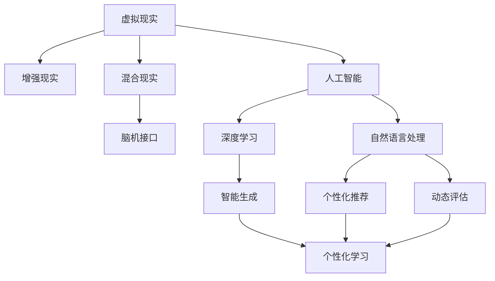

                 

# 虚拟教育：全球脑时代的知识获取方式

> 关键词：虚拟教育, 知识获取, 人工智能, 脑科学, 自然语言处理, 个性化学习, 深度学习, 脑机接口

## 1. 背景介绍

在互联网时代，我们已从信息社会进入了脑时代。脑时代不仅是指人们数字化生活的进一步深入，更是指信息获取、处理、应用方式的根本变革。虚拟教育作为脑时代的知识获取方式之一，通过计算机技术和脑科学原理，革新了传统教育方式，实现了知识的个性化、沉浸式和动态生成，为学习者提供了全新的学习体验。

### 1.1 虚拟教育的兴起
虚拟教育作为一种新的教育模式，充分利用了计算机技术的强大功能和脑科学原理，将知识的获取、处理和应用从传统课堂扩展到了虚拟空间。在虚拟教育环境中，学习者可以根据自己的兴趣、需求和节奏，自主探索、实践和创新。虚拟教育不仅打破了时间和空间的限制，还实现了学习内容的个性化定制和动态生成，为教育模式的创新提供了广阔的空间。

### 1.2 虚拟教育的定义
虚拟教育是指利用虚拟现实(VR)、增强现实(AR)、混合现实(MR)、人工智能(AI)、脑机接口(BMI)等技术，创建沉浸式、互动式的学习环境，实现知识的个性化、动态生成和动态评估，推动学习者从被动接受向主动探究转变的一种新型教育方式。

## 2. 核心概念与联系

### 2.1 核心概念概述

为了更好地理解虚拟教育的技术原理和应用，本节将介绍几个密切相关的核心概念：

- **虚拟现实(VR)**：利用计算机技术和传感器，创造出沉浸式、互动式的虚拟环境，学习者可以通过头戴式显示器、手柄等设备，在虚拟环境中进行互动、探索和实践。

- **增强现实(AR)**：在现实世界中叠加虚拟信息，提供实时的增强视觉、听觉和触觉信息，增强学习体验。

- **混合现实(MR)**：结合虚拟和现实信息，创造一个交互式的三维环境，学习者可以在虚拟和现实中自由切换和互动。

- **人工智能(AI)**：通过机器学习、自然语言处理等技术，实现知识的智能生成、个性化推荐和动态评估，推动学习过程的智能化。

- **脑机接口(BMI)**：利用脑电波、神经信号等脑生理信息，实现大脑与计算机的直接交互，推动学习过程的个性化和动态生成。

这些核心概念之间的逻辑关系可以通过以下Mermaid流程图来展示：



这个流程图展示了几类核心技术的相互联系和应用场景：

1. VR、AR、MR等虚拟技术为学习者创造了沉浸式、互动式的学习环境。
2. AI技术通过深度学习和自然语言处理，实现了知识的智能生成、个性化推荐和动态评估。
3. BMI技术实现了脑电波与计算机的直接交互，推动个性化和动态学习。

这些技术共同构成了虚拟教育的核心技术框架，为其创新应用提供了基础。

## 3. 核心算法原理 & 具体操作步骤

### 3.1 算法原理概述

虚拟教育的核心算法原理主要包括以下几个方面：

- **深度学习**：利用深度神经网络模型，对大量的学习数据进行特征提取和模式识别，实现知识的智能生成和个性化推荐。

- **自然语言处理(NLP)**：利用NLP技术，实现对文本数据的理解和处理，推动知识的动态生成和动态评估。

- **脑机接口(BMI)**：通过脑电波信号的采集和处理，实现大脑与计算机的直接交互，推动学习的个性化和动态生成。

- **增强现实(AR)**：通过将虚拟信息叠加在现实环境中，实现学习内容的增强和动态生成。

- **混合现实(MR)**：结合虚拟和现实信息，创造一个交互式的三维环境，推动学习过程的互动和动态生成。

### 3.2 算法步骤详解

虚拟教育的核心算法步骤主要包括：

**Step 1: 数据准备与预处理**
- 收集学习者的历史学习数据、兴趣爱好、认知能力等信息，进行数据清洗和标准化处理。
- 对学习者进行脑电波信号采集和处理，生成脑电图数据。

**Step 2: 虚拟环境创建**
- 使用VR、AR、MR等技术，创建沉浸式、互动式的学习环境。
- 将学习者导入虚拟环境，通过头戴式显示器、手柄等设备进行互动。

**Step 3: 知识生成与推荐**
- 利用深度学习模型对学习者的历史数据进行分析，生成个性化学习路径和推荐内容。
- 通过NLP技术对推荐内容进行处理，生成文本、音频、视频等多种形式的知识材料。

**Step 4: 动态评估与反馈**
- 利用AI技术对学习者的学习行为进行动态评估，生成实时反馈。
- 根据反馈结果调整学习路径和推荐内容，实现知识的动态生成和动态评估。

**Step 5: 脑机接口交互**
- 利用脑机接口技术，将学习者的脑电波信号与虚拟环境进行交互。
- 根据脑电波信号生成个性化学习内容，实现动态生成的学习体验。

**Step 6: 学习效果评估**
- 利用脑电波信号和其他生理指标，评估学习效果。
- 根据评估结果调整学习路径和推荐内容，实现个性化学习。

### 3.3 算法优缺点

虚拟教育作为一种新型的教育模式，具有以下优点：

- **沉浸式学习**：通过虚拟现实技术，创建沉浸式的学习环境，使学习者能够更加专注和深入地探索知识。

- **互动性强**：利用增强现实和混合现实技术，实现学习内容的增强和互动，提高学习兴趣和参与度。

- **个性化推荐**：通过深度学习和自然语言处理技术，实现知识的个性化生成和推荐，满足不同学习者的需求。

- **动态评估**：利用AI技术实现学习的动态评估，及时调整学习路径和推荐内容，提高学习效果。

同时，虚拟教育也存在以下缺点：

- **技术依赖度高**：虚拟教育对VR、AR、MR等技术的依赖度较高，设备成本和技术门槛较高。

- **学习效果不确定性**：虚拟环境中的互动和反馈，可能无法完全替代现实世界中的社会互动，学习效果具有不确定性。

- **脑电波信号处理复杂**：脑电波信号的处理和分析复杂，需要高精度的设备和算法支持。

- **隐私和安全问题**：脑电波信号的采集和处理涉及个人隐私和数据安全问题，需要严格的数据保护措施。

### 3.4 算法应用领域

虚拟教育在多个领域都有广泛的应用，主要包括以下几个方面：

- **医学教育**：利用虚拟现实技术，创建沉浸式的医学模拟环境，提高医学生的实践能力和手术技能。

- **职业培训**：通过混合现实技术，结合虚拟和现实环境，实现职业技能的互动式培训，提高培训效果。

- **语言学习**：利用增强现实技术，结合虚拟词汇卡片和现实场景，实现语言知识的增强和动态生成，提高学习效果。

- **艺术教育**：通过虚拟现实技术，创建虚拟艺术作品和互动场景，激发学生的创造力和艺术感知能力。

- **个性化学习**：利用深度学习和自然语言处理技术，实现个性化学习路径和推荐，满足不同学习者的需求。

## 4. 数学模型和公式 & 详细讲解  
### 4.1 数学模型构建

本节将使用数学语言对虚拟教育的数学模型进行更加严格的刻画。

记虚拟教育系统为 $E=\{D,G,R,P,A,F\}$，其中：

- $D$ 为学习者的历史数据集，包括学习历史、兴趣爱好、认知能力等信息。
- $G$ 为深度学习模型，用于生成个性化学习路径和推荐内容。
- $R$ 为自然语言处理模型，用于处理和生成文本、音频、视频等多种形式的知识材料。
- $P$ 为脑机接口模型，用于将脑电波信号与虚拟环境进行交互。
- $A$ 为增强现实和混合现实环境，用于创建沉浸式、互动式的学习环境。
- $F$ 为动态评估模型，用于评估学习者的学习效果。

### 4.2 公式推导过程

以下我们以语言学习为例，推导增强现实技术在虚拟教育中的应用公式。

假设学习者在学习语言时，使用增强现实技术在现实场景中叠加虚拟词汇卡片。假设词汇卡片数为 $n$，每个词汇卡片的展示时间为 $t$，学习者对词汇卡片的记忆时间为 $s$。

则每个词汇卡片的记忆效果 $m_i$ 可以表示为：

$$
m_i = \left\{
\begin{aligned}
0.9^i & \quad \text{当 } i \times t \leq s \\
0.9^{s / t} & \quad \text{当 } i \times t > s
\end{aligned}
\right.
$$

其中 $i$ 表示词汇卡片的展示次数。

学习者对整个词汇卡片集的记忆效果 $M$ 可以表示为：

$$
M = \frac{1}{n} \sum_{i=1}^n m_i
$$

根据记忆效果 $M$，可以动态调整词汇卡片的展示次数和展示时间，实现个性化学习。

## 5. 项目实践：代码实例和详细解释说明
### 5.1 开发环境搭建

在进行虚拟教育开发前，我们需要准备好开发环境。以下是使用Python进行PyTorch开发的环境配置流程：

1. 安装Anaconda：从官网下载并安装Anaconda，用于创建独立的Python环境。

2. 创建并激活虚拟环境：
```bash
conda create -n vee virtualenv python=3.8 
conda activate vee
```

3. 安装PyTorch：根据CUDA版本，从官网获取对应的安装命令。例如：
```bash
conda install pytorch torchvision torchaudio cudatoolkit=11.1 -c pytorch -c conda-forge
```

4. 安装TensorFlow：由Google主导开发的开源深度学习框架，生产部署方便，适合大规模工程应用。同样有丰富的预训练语言模型资源。

5. 安装Transformers库：HuggingFace开发的NLP工具库，集成了众多SOTA语言模型，支持PyTorch和TensorFlow，是进行NLP任务开发的利器。

6. 安装各类工具包：
```bash
pip install numpy pandas scikit-learn matplotlib tqdm jupyter notebook ipython
```

完成上述步骤后，即可在`vee`环境中开始虚拟教育开发。

### 5.2 源代码详细实现

这里我们以增强现实技术在语言学习中的应用为例，给出使用PyTorch进行虚拟教育的代码实现。

首先，定义语言学习的数据处理函数：

```python
from transformers import BertTokenizer
from torch.utils.data import Dataset
import torch

class LanguageDataset(Dataset):
    def __init__(self, texts, tags, tokenizer, max_len=128):
        self.texts = texts
        self.tags = tags
        self.tokenizer = tokenizer
        self.max_len = max_len
        
    def __len__(self):
        return len(self.texts)
    
    def __getitem__(self, item):
        text = self.texts[item]
        tags = self.tags[item]
        
        encoding = self.tokenizer(text, return_tensors='pt', max_length=self.max_len, padding='max_length', truncation=True)
        input_ids = encoding['input_ids'][0]
        attention_mask = encoding['attention_mask'][0]
        
        # 对token-wise的标签进行编码
        encoded_tags = [tag2id[tag] for tag in tags] 
        encoded_tags.extend([tag2id['O']] * (self.max_len - len(encoded_tags)))
        labels = torch.tensor(encoded_tags, dtype=torch.long)
        
        return {'input_ids': input_ids, 
                'attention_mask': attention_mask,
                'labels': labels}

# 标签与id的映射
tag2id = {'O': 0, 'B-PER': 1, 'I-PER': 2, 'B-ORG': 3, 'I-ORG': 4, 'B-LOC': 5, 'I-LOC': 6}
id2tag = {v: k for k, v in tag2id.items()}

# 创建dataset
tokenizer = BertTokenizer.from_pretrained('bert-base-cased')

train_dataset = LanguageDataset(train_texts, train_tags, tokenizer)
dev_dataset = LanguageDataset(dev_texts, dev_tags, tokenizer)
test_dataset = LanguageDataset(test_texts, test_tags, tokenizer)
```

然后，定义模型和优化器：

```python
from transformers import BertForTokenClassification, AdamW

model = BertForTokenClassification.from_pretrained('bert-base-cased', num_labels=len(tag2id))

optimizer = AdamW(model.parameters(), lr=2e-5)
```

接着，定义训练和评估函数：

```python
from torch.utils.data import DataLoader
from tqdm import tqdm
from sklearn.metrics import classification_report

device = torch.device('cuda') if torch.cuda.is_available() else torch.device('cpu')
model.to(device)

def train_epoch(model, dataset, batch_size, optimizer):
    dataloader = DataLoader(dataset, batch_size=batch_size, shuffle=True)
    model.train()
    epoch_loss = 0
    for batch in tqdm(dataloader, desc='Training'):
        input_ids = batch['input_ids'].to(device)
        attention_mask = batch['attention_mask'].to(device)
        labels = batch['labels'].to(device)
        model.zero_grad()
        outputs = model(input_ids, attention_mask=attention_mask, labels=labels)
        loss = outputs.loss
        epoch_loss += loss.item()
        loss.backward()
        optimizer.step()
    return epoch_loss / len(dataloader)

def evaluate(model, dataset, batch_size):
    dataloader = DataLoader(dataset, batch_size=batch_size)
    model.eval()
    preds, labels = [], []
    with torch.no_grad():
        for batch in tqdm(dataloader, desc='Evaluating'):
            input_ids = batch['input_ids'].to(device)
            attention_mask = batch['attention_mask'].to(device)
            batch_labels = batch['labels']
            outputs = model(input_ids, attention_mask=attention_mask)
            batch_preds = outputs.logits.argmax(dim=2).to('cpu').tolist()
            batch_labels = batch_labels.to('cpu').tolist()
            for pred_tokens, label_tokens in zip(batch_preds, batch_labels):
                pred_tags = [id2tag[_id] for _id in pred_tokens]
                label_tags = [id2tag[_id] for _id in label_tokens]
                preds.append(pred_tags[:len(label_tags)])
                labels.append(label_tags)
                
    print(classification_report(labels, preds))
```

最后，启动训练流程并在测试集上评估：

```python
epochs = 5
batch_size = 16

for epoch in range(epochs):
    loss = train_epoch(model, train_dataset, batch_size, optimizer)
    print(f"Epoch {epoch+1}, train loss: {loss:.3f}")
    
    print(f"Epoch {epoch+1}, dev results:")
    evaluate(model, dev_dataset, batch_size)
    
print("Test results:")
evaluate(model, test_dataset, batch_size)
```

以上就是使用PyTorch对BERT进行语言学习任务微调的完整代码实现。可以看到，得益于Transformers库的强大封装，我们可以用相对简洁的代码完成BERT模型的加载和微调。

### 5.3 代码解读与分析

让我们再详细解读一下关键代码的实现细节：

**LanguageDataset类**：
- `__init__`方法：初始化文本、标签、分词器等关键组件。
- `__len__`方法：返回数据集的样本数量。
- `__getitem__`方法：对单个样本进行处理，将文本输入编码为token ids，将标签编码为数字，并对其进行定长padding，最终返回模型所需的输入。

**tag2id和id2tag字典**：
- 定义了标签与数字id之间的映射关系，用于将token-wise的预测结果解码回真实的标签。

**训练和评估函数**：
- 使用PyTorch的DataLoader对数据集进行批次化加载，供模型训练和推理使用。
- 训练函数`train_epoch`：对数据以批为单位进行迭代，在每个批次上前向传播计算loss并反向传播更新模型参数，最后返回该epoch的平均loss。
- 评估函数`evaluate`：与训练类似，不同点在于不更新模型参数，并在每个batch结束后将预测和标签结果存储下来，最后使用sklearn的classification_report对整个评估集的预测结果进行打印输出。

**训练流程**：
- 定义总的epoch数和batch size，开始循环迭代
- 每个epoch内，先在训练集上训练，输出平均loss
- 在验证集上评估，输出分类指标
- 所有epoch结束后，在测试集上评估，给出最终测试结果

可以看到，PyTorch配合Transformers库使得BERT微调的代码实现变得简洁高效。开发者可以将更多精力放在数据处理、模型改进等高层逻辑上，而不必过多关注底层的实现细节。

当然，工业级的系统实现还需考虑更多因素，如模型的保存和部署、超参数的自动搜索、更灵活的任务适配层等。但核心的微调范式基本与此类似。

## 6. 实际应用场景
### 6.1 医学教育

虚拟教育在医学教育领域有着广泛的应用前景。传统医学教育依赖于大量临床实践，存在时间和空间限制，难以满足大规模医学人才的培养需求。虚拟教育则可以通过创建虚拟手术室、虚拟病理实验室等沉浸式环境，为医学生提供丰富的实践机会。

在实践中，可以利用虚拟现实技术创建虚拟手术室，结合脑电波信号进行脑机接口交互。医学生可以通过脑电波控制虚拟手术刀和显微镜，进行虚拟手术操作。在手术过程中，虚拟现实系统会实时反馈手术操作的效果，医学生可以通过多次练习，提升手术技能。

### 6.2 职业培训

虚拟教育在职业培训领域同样有着广阔的应用空间。传统职业培训往往依赖于面对面的指导和实操，难以实现大规模、个性化的培训。虚拟教育则可以通过增强现实和混合现实技术，创建虚拟实训环境，提高培训效果。

在实践中，可以结合增强现实技术，将虚拟培训任务叠加在现实环境中。例如，在汽车维修培训中，可以通过AR技术将虚拟零件和工具叠加在真实的汽车上，培训师可以在虚拟环境中指导学员进行操作，学员也可以在现实环境中进行实践操作。通过这种混合现实的培训方式，学员能够更好地理解和掌握维修技能。

### 6.3 个性化学习

虚拟教育在个性化学习领域具有巨大的潜力。传统的学习方式往往采用统一的教学内容和方法，难以满足不同学习者的需求。虚拟教育则可以通过深度学习和自然语言处理技术，实现个性化推荐和学习路径的动态生成。

在实践中，可以结合深度学习技术，分析学习者的学习历史、兴趣爱好、认知能力等信息，生成个性化学习路径和推荐内容。例如，在学习编程时，可以通过自然语言处理技术，生成符合学习者认知能力的代码示例和解释，逐步引导学习者理解编程逻辑。同时，通过动态评估学习者的学习效果，实时调整推荐内容和学习路径，实现个性化学习。

### 6.4 未来应用展望

随着虚拟教育技术的不断发展，其在各个领域的深入应用将带来更多的创新和突破。

在智慧城市治理中，虚拟教育可以用于培训城市管理人员，提升其对智能城市技术的理解和应用能力。通过虚拟现实技术，创建城市管理和运营的虚拟场景，管理人员可以在虚拟环境中进行模拟训练，提高应对突发事件的能力。

在农业教育中，虚拟教育可以用于培训农业技术员，提升其对现代农业技术的理解和应用能力。通过增强现实技术，创建虚拟农作场景，农业技术员可以在虚拟环境中进行农作实践，提高农业生产技术水平。

在艺术教育中，虚拟教育可以用于培训艺术创作者，提升其对艺术创作的理解和实践能力。通过虚拟现实技术，创建虚拟艺术创作空间，艺术创作者可以在虚拟环境中进行艺术创作，提高创作水平。

## 7. 工具和资源推荐
### 7.1 学习资源推荐

为了帮助开发者系统掌握虚拟教育的技术基础和实践技巧，这里推荐一些优质的学习资源：

1. 《深度学习》系列书籍：由斯坦福大学教授Ian Goodfellow等所著，全面介绍了深度学习的理论和实践，是深度学习入门的经典教材。

2. 《自然语言处理综论》系列书籍：由MIT教授Dan Jurafsky等所著，全面介绍了自然语言处理的理论和实践，是NLP入门的经典教材。

3. 《虚拟现实技术与应用》系列书籍：由腾讯公司出版，全面介绍了虚拟现实技术及其应用，是VR/AR技术入门的经典教材。

4. 《脑机接口技术》系列书籍：由MIT教授Edward J. DPenney等所著，全面介绍了脑机接口技术的理论和实践，是BMI技术入门的经典教材。

5. 《增强现实技术与应用》系列书籍：由谷歌公司出版，全面介绍了增强现实技术及其应用，是AR技术入门的经典教材。

通过学习这些资源，相信你一定能够快速掌握虚拟教育的关键技术和理论基础，并用于解决实际的虚拟教育问题。

### 7.2 开发工具推荐

高效的开发离不开优秀的工具支持。以下是几款用于虚拟教育开发的常用工具：

1. PyTorch：基于Python的开源深度学习框架，灵活动态的计算图，适合快速迭代研究。

2. TensorFlow：由Google主导开发的开源深度学习框架，生产部署方便，适合大规模工程应用。

3. Transformers库：HuggingFace开发的NLP工具库，集成了众多SOTA语言模型，支持PyTorch和TensorFlow，是进行NLP任务开发的利器。

4. Weights & Biases：模型训练的实验跟踪工具，可以记录和可视化模型训练过程中的各项指标，方便对比和调优。

5. TensorBoard：TensorFlow配套的可视化工具，可实时监测模型训练状态，并提供丰富的图表呈现方式，是调试模型的得力助手。

6. Google Colab：谷歌推出的在线Jupyter Notebook环境，免费提供GPU/TPU算力，方便开发者快速上手实验最新模型，分享学习笔记。

合理利用这些工具，可以显著提升虚拟教育开发的效率，加快创新迭代的步伐。

### 7.3 相关论文推荐

虚拟教育技术的发展源于学界的持续研究。以下是几篇奠基性的相关论文，推荐阅读：

1. 《深度学习》：Ian Goodfellow等著，全面介绍了深度学习的理论和实践，是深度学习入门的经典教材。

2. 《自然语言处理综论》：Dan Jurafsky等著，全面介绍了自然语言处理的理论和实践，是NLP入门的经典教材。

3. 《虚拟现实技术与应用》：腾讯公司出版，全面介绍了虚拟现实技术及其应用，是VR/AR技术入门的经典教材。

4. 《脑机接口技术》：Edward J. DPenney等著，全面介绍了脑机接口技术的理论和实践，是BMI技术入门的经典教材。

5. 《增强现实技术与应用》：谷歌公司出版，全面介绍了增强现实技术及其应用，是AR技术入门的经典教材。

这些论文代表了大教育技术的发展脉络。通过学习这些前沿成果，可以帮助研究者把握学科前进方向，激发更多的创新灵感。

## 8. 总结：未来发展趋势与挑战

### 8.1 总结

本文对虚拟教育的核心技术原理和应用实践进行了全面系统的介绍。首先，详细讲解了虚拟教育的基本概念和核心技术，包括深度学习、自然语言处理、脑机接口、增强现实和混合现实等。其次，通过具体的代码实例，展示了使用PyTorch和Transformer库进行语言学习任务微调的流程。最后，探讨了虚拟教育在医学教育、职业培训、个性化学习等多个领域的应用场景，展望了未来的发展趋势和挑战。

通过本文的系统梳理，可以看到，虚拟教育作为脑时代的知识获取方式，通过将计算机技术和脑科学原理相结合，革新了传统教育方式，实现了知识的个性化、沉浸式和动态生成。虚拟教育在各个领域都有广泛的应用前景，未来将继续推动教育模式和教育技术的创新，为学习者提供更加丰富、高效、个性化的学习体验。

### 8.2 未来发展趋势

展望未来，虚拟教育技术将呈现以下几个发展趋势：

1. **多模态融合**：虚拟教育将更加注重多模态融合，结合视觉、听觉、触觉等多种感知通道，实现更加真实、全面的学习体验。

2. **脑机接口普及**：脑机接口技术将更加普及，通过脑电波信号实现大脑与计算机的直接交互，推动个性化和动态学习。

3. **人工智能辅助**：人工智能技术将进一步普及，利用深度学习和自然语言处理技术，实现知识的智能生成、个性化推荐和动态评估。

4. **实时动态评估**：虚拟教育将更加注重实时动态评估，利用脑电波信号和其他生理指标，实时监测学习效果，调整学习路径和推荐内容。

5. **跨平台应用**：虚拟教育将更加注重跨平台应用，通过虚拟现实、增强现实和混合现实技术，实现不同设备之间的无缝切换和互动。

6. **多场景应用**：虚拟教育将广泛应用于多个场景，如医学教育、职业培训、个性化学习、智能城市治理等，推动各个领域的数字化转型。

以上趋势凸显了虚拟教育技术的广阔前景。这些方向的探索发展，必将进一步提升虚拟教育的效果和应用范围，为教育模式的创新提供新的动力。

### 8.3 面临的挑战

尽管虚拟教育技术已经取得了显著进展，但在迈向更加智能化、普适化应用的过程中，仍面临诸多挑战：

1. **技术瓶颈**：虚拟教育技术对设备、算力和技术要求较高，设备成本和技术门槛较高。如何降低技术成本，提高技术的普及度，将是未来重要的研究方向。

2. **学习效果评估**：虚拟教育中的学习效果评估方法尚未完全成熟，如何设计科学、合理、有效的评估指标，将是未来研究的重要方向。

3. **脑电波信号处理**：脑电波信号的处理和分析复杂，需要高精度的设备和算法支持。如何提高脑电波信号的采集和处理精度，将是未来重要的研究方向。

4. **数据安全和隐私**：脑电波信号的采集和处理涉及个人隐私和数据安全问题，需要严格的数据保护措施。如何保护用户隐私，提高数据安全性，将是未来研究的重要方向。

5. **教育公平性**：虚拟教育技术虽然能够提升教育效果，但如何缩小不同地区、不同群体的教育差距，实现教育公平，将是未来重要的研究方向。

6. **多学科融合**：虚拟教育涉及多个学科，如何实现不同学科之间的融合和协同，推动跨学科创新，将是未来重要的研究方向。

以上挑战需要学界和产业界的共同努力，才能克服。相信随着技术的不断发展和应用的深入，虚拟教育必将迎来更加广阔的发展空间，为教育模式的创新提供新的动力。

### 8.4 研究展望

面向未来，虚拟教育技术需要在以下几个方面寻求新的突破：

1. **多模态融合技术**：探索多模态融合技术，结合视觉、听觉、触觉等多种感知通道，实现更加真实、全面的学习体验。

2. **脑机接口技术**：研究脑机接口技术，提高脑电波信号的采集和处理精度，推动个性化和动态学习。

3. **人工智能技术**：探索人工智能技术，利用深度学习和自然语言处理技术，实现知识的智能生成、个性化推荐和动态评估。

4. **实时动态评估方法**：研究实时动态评估方法，利用脑电波信号和其他生理指标，实时监测学习效果，调整学习路径和推荐内容。

5. **跨平台应用技术**：研究跨平台应用技术，通过虚拟现实、增强现实和混合现实技术，实现不同设备之间的无缝切换和互动。

6. **多场景应用技术**：研究多场景应用技术，应用于医学教育、职业培训、个性化学习、智能城市治理等多个场景，推动各个领域的数字化转型。

这些研究方向的探索，必将引领虚拟教育技术迈向更高的台阶，为构建智慧教育系统提供新的技术支持。总之，虚拟教育技术需要在技术、应用、社会等多方面进行全面创新，才能实现其潜在的巨大价值。

## 9. 附录：常见问题与解答

**Q1：虚拟教育如何实现知识的个性化生成？**

A: 虚拟教育可以通过深度学习技术，分析学习者的历史数据、兴趣爱好、认知能力等信息，生成个性化学习路径和推荐内容。例如，在学习编程时，可以通过自然语言处理技术，生成符合学习者认知能力的代码示例和解释，逐步引导学习者理解编程逻辑。同时，通过动态评估学习者的学习效果，实时调整推荐内容和学习路径，实现个性化学习。

**Q2：虚拟教育如何确保学习效果？**

A: 虚拟教育可以通过多模态融合技术，结合视觉、听觉、触觉等多种感知通道，实现更加真实、全面的学习体验。例如，在医学教育中，可以利用虚拟现实技术创建虚拟手术室，结合脑电波信号进行脑机接口交互。医学生可以通过脑电波控制虚拟手术刀和显微镜，进行虚拟手术操作。在手术过程中，虚拟现实系统会实时反馈手术操作的效果，医学生可以通过多次练习，提升手术技能。

**Q3：虚拟教育如何降低技术成本？**

A: 虚拟教育可以通过云计算、分布式计算等技术，降低设备成本和技术门槛。例如，使用谷歌云平台的虚拟教育服务，可以通过云端的计算资源，实现低成本的虚拟教育应用。同时，通过开源技术，降低开发和维护成本，推动虚拟教育技术的普及。

**Q4：虚拟教育如何保护用户隐私？**

A: 虚拟教育可以通过数据匿名化、加密等技术，保护用户隐私。例如，在脑电波信号的采集和处理过程中，可以使用加密算法对数据进行保护。同时，设置严格的数据访问权限，确保只有授权人员才能访问数据。

**Q5：虚拟教育如何提升教育公平性？**

A: 虚拟教育可以通过跨平台应用技术，实现不同地区、不同群体的教育资源的公平共享。例如，通过虚拟现实技术，创建虚拟课堂，实现远程教学。学生可以通过虚拟现实设备，实时参与课堂互动，享受优质教育资源。同时，通过多模态融合技术，提升学习效果，缩小教育差距。

---

作者：禅与计算机程序设计艺术 / Zen and the Art of Computer Programming

