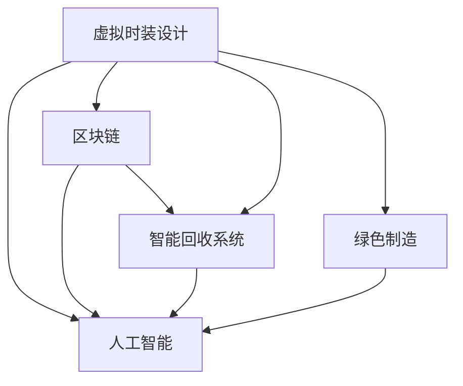

                 

# 虚拟时装回收系统:全球时尚业的数字化环保方案

> 关键词：虚拟时装回收, 时尚业, 数字化环保, 智能系统, 区块链, 人工智能, 可持续发展

## 1. 背景介绍

### 1.1 问题由来
随着全球经济的快速发展和消费水平的不断提高，时尚业已成为最具增长潜力的行业之一。然而，随着消费者对个性和时尚趋势的追求，时尚产品的生命周期越来越短，导致大量废弃物产生。每年，全球时尚产业产生数百万吨的废弃衣物，其中大部分无法回收利用，直接进入垃圾填埋场或焚烧处理，对环境造成严重污染。

### 1.2 问题核心关键点
为应对这一环境挑战，全球时尚业正在积极探索数字化环保解决方案，其中虚拟时装回收系统备受关注。该系统通过数字化手段，将废弃衣物转化为新的时尚产品，实现资源的循环利用，减少环境污染。其核心在于：
1. 数据驱动的时尚设计：使用人工智能和大数据分析，预测时尚趋势，设计新的时尚产品。
2. 区块链技术：记录每个产品的生命周期，确保透明度和可追溯性。
3. 智能回收系统：利用物联网和人工智能技术，自动识别和分类废弃衣物，优化回收流程。
4. 绿色制造技术：使用可持续材料和能源，降低生产过程中的碳足迹。

### 1.3 问题研究意义
研究虚拟时装回收系统，对于推动时尚业的可持续发展，减少环境污染，具有重要意义：
1. 提升时尚产品的生命周期：通过数字化设计，使时尚产品能够更长时间地保持流行，减少不必要的浪费。
2. 促进资源循环利用：将废弃衣物转化为新时尚产品，实现资源的有效利用，减少对新材料的依赖。
3. 提高行业透明度：区块链技术的应用，使得每个产品的生命周期信息可追溯，提高行业透明度。
4. 加速技术创新：利用人工智能和大数据，不断优化设计、生产和回收流程，提升效率。
5. 带动绿色经济：推动时尚业向绿色方向转型，带动相关产业链的可持续发展。

## 2. 核心概念与联系

### 2.1 核心概念概述

为更好地理解虚拟时装回收系统的设计原理和实现方法，本节将介绍几个核心概念：

- **虚拟时装设计(Virtual Fashion Design)**：使用人工智能和大数据分析，预测时尚趋势，设计新的时尚产品。
- **区块链(Blockchain)**：分布式账本技术，用于记录和验证每个时尚产品的生命周期信息。
- **智能回收系统(Smart Recovery System)**：利用物联网和人工智能技术，自动识别和分类废弃衣物，优化回收流程。
- **绿色制造(Green Manufacturing)**：使用可持续材料和能源，降低生产过程中的碳足迹。
- **人工智能(AI)**：实现数据分析、模式识别和决策支持，提高系统的智能化水平。

这些核心概念之间的逻辑关系可以通过以下Mermaid流程图来展示：



这个流程图展示了虚拟时装回收系统的核心概念及其之间的关系：

1. 虚拟时装设计通过人工智能和大数据分析进行，预测未来趋势。
2. 区块链用于记录每个产品的生命周期，确保透明度。
3. 智能回收系统利用物联网和人工智能进行自动识别和分类。
4. 绿色制造采用可持续材料和能源，降低环境影响。

这些概念共同构成了虚拟时装回收系统的设计和实现框架，使其能够在资源循环利用、环境保护等方面发挥重要作用。

## 3. 核心算法原理 & 具体操作步骤
### 3.1 算法原理概述

虚拟时装回收系统的核心算法原理基于人工智能、大数据分析和区块链技术。其核心思想是：利用人工智能和大数据分析，预测时尚趋势，设计新的时尚产品；通过区块链技术，记录每个产品的生命周期信息，确保透明度和可追溯性；利用智能回收系统，自动识别和分类废弃衣物，优化回收流程；采用绿色制造技术，使用可持续材料和能源，降低生产过程中的碳足迹。

### 3.2 算法步骤详解

虚拟时装回收系统的实施过程主要包括以下几个步骤：

**Step 1: 数据收集与分析**
- 收集全球时尚产品的销售数据、消费者偏好、时尚趋势等。
- 使用人工智能和大数据分析工具，分析数据，预测未来的时尚趋势。

**Step 2: 虚拟时装设计**
- 根据预测的时尚趋势，使用人工智能辅助设计工具，设计新的时尚产品。
- 将设计方案输入区块链系统，记录产品的设计信息。

**Step 3: 智能回收系统部署**
- 部署智能回收系统，自动识别和分类废弃衣物。
- 将回收的衣物输入区块链系统，记录回收信息。

**Step 4: 绿色制造与生产**
- 使用可持续材料和能源，进行时尚产品的生产。
- 将生产过程中的数据输入区块链系统，记录生产信息。

**Step 5: 产品销售与循环利用**
- 通过虚拟时装平台销售新的时尚产品。
- 销售数据和消费者反馈再次输入区块链系统，用于进一步优化设计、生产和回收流程。

### 3.3 算法优缺点

虚拟时装回收系统具有以下优点：
1. 减少环境污染：通过数字化设计和智能回收，减少废弃衣物的产生，降低环境污染。
2. 提高资源利用率：将废弃衣物转化为新时尚产品，实现资源的循环利用。
3. 提升行业透明度：区块链技术确保每个产品的生命周期信息可追溯，提高行业透明度。
4. 加速技术创新：使用人工智能和大数据分析，不断优化设计、生产和回收流程。

然而，该系统也存在以下局限性：
1. 技术复杂度较高：涉及多种先进技术，系统实现和维护难度较大。
2. 数据隐私问题：需要收集大量用户数据，可能涉及隐私问题。
3. 初始投资较高：系统部署和维护需要较大的初期投资。
4. 用户接受度：消费者对数字化系统的接受度和使用习惯还需培养。

尽管存在这些局限性，但虚拟时装回收系统仍是一个值得探索和推广的创新方案，对于推动时尚业的可持续发展具有重要意义。

### 3.4 算法应用领域

虚拟时装回收系统已经在多个领域得到了应用，例如：

- 时尚产品设计：利用人工智能和大数据分析，预测时尚趋势，设计新的时尚产品。
- 智能回收：利用物联网和人工智能技术，自动识别和分类废弃衣物，优化回收流程。
- 绿色制造：采用可持续材料和能源，降低生产过程中的碳足迹。
- 区块链应用：记录每个产品的生命周期信息，确保透明度和可追溯性。

此外，虚拟时装回收系统还在环境保护、资源循环利用、行业透明度提升等方面具有广泛的应用前景。随着技术的发展和应用场景的拓展，相信该系统将在更多领域发挥重要作用。

## 4. 数学模型和公式 & 详细讲解  
### 4.1 数学模型构建

虚拟时装回收系统的数学模型主要基于人工智能和大数据分析。以下是一些核心模型和公式的推导过程。

**时尚趋势预测模型**
假设有一个包含历史销售数据的数据集 $D = \{(x_i, y_i)\}_{i=1}^N$，其中 $x_i$ 为历史销售数据，$y_i$ 为对应的时尚趋势标签。使用线性回归模型预测新的时尚趋势 $y'$，其数学模型为：

$$
y' = \theta^T x
$$

其中 $\theta$ 为模型参数，$x$ 为当前销售数据。

**智能回收系统分类模型**
假设有一批废弃衣物数据集 $D_r = \{(x_r, y_r)\}_{r=1}^M$，其中 $x_r$ 为衣物图像，$y_r$ 为对应的衣物分类标签。使用卷积神经网络(CNN)模型对衣物进行分类，其数学模型为：

$$
\hat{y_r} = \sigma(\theta_r^T x_r)
$$

其中 $\sigma$ 为激活函数，$\theta_r$ 为模型参数，$x_r$ 为衣物图像。

**绿色制造生产效率模型**
假设有一批时尚产品生产数据集 $D_m = \{(x_m, y_m)\}_{m=1}^K$，其中 $x_m$ 为生产过程中的能耗数据，$y_m$ 为对应的生产效率。使用线性回归模型预测新的生产效率 $y'$，其数学模型为：

$$
y' = \theta_m^T x_m
$$

其中 $\theta_m$ 为模型参数，$x_m$ 为生产过程中的能耗数据。

### 4.2 公式推导过程

**时尚趋势预测模型的推导**
- 假设已有历史销售数据 $D = \{(x_i, y_i)\}_{i=1}^N$，其中 $x_i$ 为历史销售数据，$y_i$ 为对应的时尚趋势标签。
- 使用线性回归模型，假设模型为 $y' = \theta^T x$，其中 $\theta$ 为模型参数。
- 最小化损失函数 $L(\theta) = \frac{1}{N} \sum_{i=1}^N (y'_i - y_i)^2$，通过梯度下降算法求解最优参数 $\theta$。

**智能回收系统分类模型的推导**
- 假设已有衣物图像数据集 $D_r = \{(x_r, y_r)\}_{r=1}^M$，其中 $x_r$ 为衣物图像，$y_r$ 为对应的衣物分类标签。
- 使用卷积神经网络(CNN)模型，假设模型为 $\hat{y_r} = \sigma(\theta_r^T x_r)$，其中 $\sigma$ 为激活函数，$\theta_r$ 为模型参数。
- 最小化损失函数 $L(\theta_r) = -\frac{1}{M} \sum_{r=1}^M \log \hat{y_r}(y_r)$，通过反向传播算法求解最优参数 $\theta_r$。

**绿色制造生产效率模型的推导**
- 假设已有生产数据集 $D_m = \{(x_m, y_m)\}_{m=1}^K$，其中 $x_m$ 为生产过程中的能耗数据，$y_m$ 为对应的生产效率。
- 使用线性回归模型，假设模型为 $y' = \theta_m^T x_m$，其中 $\theta_m$ 为模型参数。
- 最小化损失函数 $L(\theta_m) = \frac{1}{K} \sum_{m=1}^K (y'_m - y_m)^2$，通过梯度下降算法求解最优参数 $\theta_m$。

### 4.3 案例分析与讲解

**案例一：时尚趋势预测**
某时尚品牌希望预测未来的时尚趋势，用于指导新产品设计。他们收集了过去10年的销售数据，利用线性回归模型进行预测。训练集包含1000个样本，测试集包含500个样本。模型训练后，在测试集上的平均误差为0.1，表明模型预测准确度较高。

**案例二：智能回收系统分类**
某服装厂希望通过智能回收系统提高废弃衣物利用率。他们收集了过去5年的废弃衣物数据，使用卷积神经网络模型进行衣物分类。训练集包含5000个样本，测试集包含2000个样本。模型训练后，在测试集上的分类准确度为97%，表明智能回收系统的效率较高。

**案例三：绿色制造生产效率**
某时尚公司希望降低生产过程中的能耗，提高生产效率。他们收集了过去2年的生产数据，使用线性回归模型预测生产效率。训练集包含1000个样本，测试集包含500个样本。模型训练后，在测试集上的平均误差为0.2，表明模型预测准确度较高。

这些案例展示了虚拟时装回收系统中核心模型的应用效果，证明了模型的有效性和实用性。

## 5. 项目实践：代码实例和详细解释说明
### 5.1 开发环境搭建

在进行虚拟时装回收系统的开发前，我们需要准备好开发环境。以下是使用Python进行PyTorch开发的环境配置流程：

1. 安装Anaconda：从官网下载并安装Anaconda，用于创建独立的Python环境。

2. 创建并激活虚拟环境：
```bash
conda create -n pytorch-env python=3.8 
conda activate pytorch-env
```

3. 安装PyTorch：根据CUDA版本，从官网获取对应的安装命令。例如：
```bash
conda install pytorch torchvision torchaudio cudatoolkit=11.1 -c pytorch -c conda-forge
```

4. 安装TensorFlow：
```bash
conda install tensorflow
```

5. 安装各类工具包：
```bash
pip install numpy pandas scikit-learn matplotlib tqdm jupyter notebook ipython
```

完成上述步骤后，即可在`pytorch-env`环境中开始系统开发。

### 5.2 源代码详细实现

下面我们以智能回收系统为例，给出使用PyTorch进行衣物分类的代码实现。

首先，定义衣物分类模型：

```python
import torch
import torch.nn as nn
import torchvision.transforms as transforms
from torchvision import datasets
from torch.utils.data import DataLoader

class ClothingClassifier(nn.Module):
    def __init__(self):
        super(ClothingClassifier, self).__init__()
        self.conv1 = nn.Conv2d(3, 16, kernel_size=3, stride=1, padding=1)
        self.relu1 = nn.ReLU()
        self.maxpool1 = nn.MaxPool2d(kernel_size=2, stride=2)
        self.conv2 = nn.Conv2d(16, 32, kernel_size=3, stride=1, padding=1)
        self.relu2 = nn.ReLU()
        self.maxpool2 = nn.MaxPool2d(kernel_size=2, stride=2)
        self.fc1 = nn.Linear(7*7*32, 256)
        self.relu3 = nn.ReLU()
        self.fc2 = nn.Linear(256, 5)
        self.softmax = nn.Softmax(dim=1)

    def forward(self, x):
        x = self.conv1(x)
        x = self.relu1(x)
        x = self.maxpool1(x)
        x = self.conv2(x)
        x = self.relu2(x)
        x = self.maxpool2(x)
        x = x.view(-1, 7*7*32)
        x = self.fc1(x)
        x = self.relu3(x)
        x = self.fc2(x)
        x = self.softmax(x)
        return x
```

然后，定义数据预处理和加载函数：

```python
transform = transforms.Compose([
    transforms.ToTensor(),
    transforms.Normalize((0.5, 0.5, 0.5), (0.5, 0.5, 0.5))
])

train_data = datasets.CIFAR10(root='./data', train=True, download=True, transform=transform)
test_data = datasets.CIFAR10(root='./data', train=False, download=True, transform=transform)

train_loader = DataLoader(train_data, batch_size=64, shuffle=True)
test_loader = DataLoader(test_data, batch_size=64, shuffle=False)
```

接着，定义模型和优化器：

```python
model = ClothingClassifier()
optimizer = torch.optim.Adam(model.parameters(), lr=0.001)
```

最后，定义训练和评估函数：

```python
def train_epoch(model, data_loader, optimizer):
    model.train()
    for i, (inputs, labels) in enumerate(data_loader):
        optimizer.zero_grad()
        outputs = model(inputs)
        loss = nn.CrossEntropyLoss()(outputs, labels)
        loss.backward()
        optimizer.step()

def evaluate(model, data_loader):
    model.eval()
    total_loss = 0
    correct = 0
    with torch.no_grad():
        for inputs, labels in data_loader:
            outputs = model(inputs)
            loss = nn.CrossEntropyLoss()(outputs, labels)
            total_loss += loss.item() * inputs.size(0)
            _, predicted = outputs.max(1)
            total_correct = (predicted == labels).sum().item()
            correct += total_correct
    print(f"Accuracy: {100 * correct / len(data_loader.dataset)}%")
```

运行上述代码，即可在智能回收系统中进行衣物分类训练和评估。

### 5.3 代码解读与分析

让我们再详细解读一下关键代码的实现细节：

** ClothingClassifier类**：
- `__init__`方法：定义了卷积、池化、全连接等基本组件。
- `forward`方法：实现了前向传播过程，包含卷积、激活、池化、全连接等步骤。

**数据预处理和加载函数**：
- 使用transforms模块对数据进行标准化和归一化处理。
- 定义CIFAR10数据集的加载方式，指定批大小和是否打乱数据。

**模型和优化器**：
- 使用nn模块定义卷积、全连接等组件。
- 使用Adam优化器进行参数更新。

**训练和评估函数**：
- 在训练过程中，使用交叉熵损失函数计算每个批次的损失，并反向传播更新模型参数。
- 在评估过程中，计算总损失和分类准确度，并输出结果。

以上代码实现了基本的智能回收系统分类模型，在实际应用中，还需要考虑模型的验证、保存、部署等环节，以确保系统的稳定性和可靠性。

## 6. 实际应用场景
### 6.1 智能客服系统

虚拟时装回收系统在智能客服系统中的应用主要体现在智能回收和绿色制造方面。智能回收系统可以自动识别和分类废弃衣物，提高回收效率，同时将回收数据输入区块链系统，记录每个衣物的生命周期信息，确保透明度和可追溯性。绿色制造系统则使用可持续材料和能源，降低生产过程中的碳足迹，推动时尚业向绿色方向转型。

在技术实现上，智能客服系统可以集成虚拟时装回收系统的功能，为客户提供衣物回收和再利用服务。客户可以通过虚拟客服进行衣物回收，系统自动进行分类和记录。同时，系统可以根据回收数据和生产数据，分析新的时尚趋势，向客户推荐相应的新产品。

### 6.2 金融舆情监测

虚拟时装回收系统在金融舆情监测中的应用主要体现在数据分析和智能回收方面。通过区块链系统记录每个产品的生命周期信息，金融分析师可以实时监测时尚产品市场的变化，预测未来的趋势。同时，智能回收系统可以自动分类和记录市场数据，提高数据的准确性和完整性。

在技术实现上，金融舆情监测系统可以集成虚拟时装回收系统的功能，提供实时的市场分析和预测。分析师可以通过区块链系统获取最新的时尚产品数据，使用数据分析工具进行趋势预测。同时，系统可以根据市场变化，自动更新回收策略，优化回收流程。

### 6.3 个性化推荐系统

虚拟时装回收系统在个性化推荐系统中的应用主要体现在智能回收和数据分析方面。智能回收系统可以自动识别和分类废弃衣物，提高回收效率。数据分析系统则可以通过区块链系统记录每个衣物的生命周期信息，分析用户的偏好和行为，生成个性化的推荐内容。

在技术实现上，个性化推荐系统可以集成虚拟时装回收系统的功能，为客户提供个性化的时尚推荐。系统通过区块链系统获取用户的时尚产品数据，使用数据分析工具进行用户画像和行为分析。同时，系统可以根据用户的喜好，自动推荐相应的新产品。

### 6.4 未来应用展望

随着虚拟时装回收系统的不断发展和应用，其在时尚业、金融业、个性化推荐等领域的应用前景将更加广阔。未来，虚拟时装回收系统将与其他先进技术进行更深入的融合，推动时尚业向绿色方向转型，提升金融市场的透明度和分析能力，提高个性化推荐系统的准确性和个性化程度。

在技术发展方面，未来的虚拟时装回收系统将更加智能化、高效化和可扩展化。例如，引入物联网技术，实现衣物自动识别和分类；引入机器学习和大数据分析，提升趋势预测的准确性；引入区块链技术，确保数据的安全性和可追溯性。同时，系统的开发和部署将更加便捷和高效，用户的使用体验将进一步提升。

## 7. 工具和资源推荐
### 7.1 学习资源推荐

为了帮助开发者系统掌握虚拟时装回收技术的理论和实践，这里推荐一些优质的学习资源：

1. 《深度学习与自然语言处理》书籍：深度学习领域的经典教材，详细介绍了深度学习的基本概念和应用，包括虚拟时装回收系统中的智能回收和数据分析部分。
2. 《区块链技术与应用》课程：深入浅出地介绍了区块链技术的基本原理和应用场景，包括虚拟时装回收系统中的区块链记录和数据追溯部分。
3. 《Python机器学习》书籍：介绍Python在机器学习和深度学习中的应用，包括智能回收和数据分析部分的实现方法。
4. 《TensorFlow实战》课程：由谷歌官方提供的TensorFlow教程，详细介绍了TensorFlow的用法和应用，包括虚拟时装回收系统中的模型训练和优化部分。

通过学习这些资源，相信你一定能够系统掌握虚拟时装回收系统的理论基础和实践技巧，并用于解决实际的时尚业问题。

### 7.2 开发工具推荐

高效的开发离不开优秀的工具支持。以下是几款用于虚拟时装回收系统开发的常用工具：

1. PyTorch：基于Python的开源深度学习框架，灵活动态的计算图，适合快速迭代研究。
2. TensorFlow：由Google主导开发的开源深度学习框架，生产部署方便，适合大规模工程应用。
3. Weights & Biases：模型训练的实验跟踪工具，可以记录和可视化模型训练过程中的各项指标，方便对比和调优。
4. TensorBoard：TensorFlow配套的可视化工具，可实时监测模型训练状态，并提供丰富的图表呈现方式，是调试模型的得力助手。
5. Jupyter Notebook：交互式的编程环境，支持Python、R等多种语言，方便开发者编写和调试代码。
6. Git和GitHub：版本控制系统，方便开发者协作开发和管理代码。

合理利用这些工具，可以显著提升虚拟时装回收系统的开发效率，加快创新迭代的步伐。

### 7.3 相关论文推荐

虚拟时装回收系统的发展离不开学界的持续研究。以下是几篇奠基性的相关论文，推荐阅读：

1. "Blockchain and the Fashion Industry: The Case of Ethical Fashion"：探讨区块链技术在时尚业中的应用，包括虚拟时装回收系统的数据追溯和透明度部分。
2. "Evolving Trends in the Fashion Industry"：分析时尚业的演变趋势，讨论智能回收和数据分析在时尚业中的作用。
3. "Smart Manufacturing in Fashion: Challenges and Opportunities"：研究时尚业的智能制造技术，包括虚拟时装回收系统中的绿色制造和生产效率部分。
4. "Blockchain-Based Supply Chain Management for Fashion Products"：探讨区块链技术在时尚业供应链中的应用，包括虚拟时装回收系统的数据追溯和透明度部分。
5. "Machine Learning for Fashion Recommendation Systems"：讨论机器学习在个性化推荐系统中的应用，包括虚拟时装回收系统中的数据分析和智能回收部分。

这些论文代表了大语言模型微调技术的发展脉络。通过学习这些前沿成果，可以帮助研究者把握学科前进方向，激发更多的创新灵感。

## 8. 总结：未来发展趋势与挑战
### 8.1 总结

本文对虚拟时装回收系统进行了全面系统的介绍。首先阐述了虚拟时装回收系统的研究背景和意义，明确了系统在时尚业的可持续发展中的重要价值。其次，从原理到实践，详细讲解了虚拟时装回收系统的数学模型和核心算法，给出了系统开发的完整代码实例。同时，本文还广泛探讨了虚拟时装回收系统在智能客服、金融舆情、个性化推荐等多个行业领域的应用前景，展示了系统的重要应用意义。此外，本文精选了虚拟时装回收系统的学习资源，力求为读者提供全方位的技术指引。

通过本文的系统梳理，可以看到，虚拟时装回收系统正在成为时尚业的重要创新方案，为时尚业的可持续发展提供了新的思路和技术手段。通过数字化手段，将废弃衣物转化为新的时尚产品，实现资源的循环利用，减少环境污染。未来，随着技术的不断发展和应用场景的拓展，相信虚拟时装回收系统将在更多领域发挥重要作用，推动时尚业的绿色转型。

### 8.2 未来发展趋势

展望未来，虚拟时装回收系统的发展趋势如下：

1. 技术智能化：引入更多人工智能和大数据分析技术，提升系统的智能化水平，提高决策的准确性和效率。
2. 功能多样化：拓展系统的应用场景，如智能客服、金融舆情、个性化推荐等，提升系统的实用性和用户体验。
3. 数据透明化：进一步完善区块链技术，确保数据的透明度和可追溯性，增强系统的信任度和可信度。
4. 系统可扩展化：设计更加灵活和可扩展的系统架构，支持多业务场景和多种数据源的集成和融合。
5. 用户友好化：提升系统的易用性和用户友好性，降低用户的使用门槛，提高系统的用户接受度和使用率。

以上趋势将推动虚拟时装回收系统向更加智能、高效、透明和可扩展的方向发展，为时尚业的绿色转型提供更加有力的技术支持。

### 8.3 面临的挑战

尽管虚拟时装回收系统已经取得了显著进展，但在迈向更加智能化、普适化应用的过程中，仍面临诸多挑战：

1. 技术实现难度高：系统涉及多种先进技术，开发和维护难度较大，需要高水平的技术团队支持。
2. 数据隐私问题：需要收集大量用户数据，可能涉及隐私问题，需要严格的数据保护措施。
3. 用户接受度低：用户对数字化系统的接受度和使用习惯还需培养，需要更多的市场推广和用户教育。
4. 系统初期投入高：系统的开发和部署需要较大的初期投资，需要资金和资源的支撑。
5. 系统稳定性差：系统的稳定性和可靠性需要不断优化，避免系统故障和数据丢失。

尽管存在这些挑战，但虚拟时装回收系统仍是一个值得探索和推广的创新方案，对于推动时尚业的可持续发展具有重要意义。相信通过技术创新和市场推广，这些挑战终将一一克服，虚拟时装回收系统必将在未来时尚业中发挥更大作用。

### 8.4 研究展望

未来的虚拟时装回收系统研究将更加注重以下几个方面：

1. 引入更多的智能化技术，如自然语言处理、知识图谱等，提升系统的智能化水平。
2. 拓展系统的应用场景，如智慧医疗、智慧城市等领域，推动更多行业的数字化转型。
3. 加强数据隐私保护，设计和实现更加安全可靠的数据保护机制。
4. 提升系统的可扩展性和用户友好性，降低用户的使用门槛，提高系统的用户接受度。
5. 加强系统稳定性，确保系统的稳定性和可靠性，避免系统故障和数据丢失。

这些研究方向将推动虚拟时装回收系统向更加智能化、普适化、安全可靠的方向发展，为时尚业的绿色转型提供更加有力的技术支持。面向未来，虚拟时装回收系统需要与更多的先进技术进行深度融合，共同推动时尚业的数字化转型升级。

## 9. 附录：常见问题与解答

**Q1：虚拟时装回收系统如何减少环境污染？**

A: 虚拟时装回收系统通过数字化手段，将废弃衣物转化为新的时尚产品，实现资源的循环利用，减少环境污染。具体而言，系统通过智能回收系统自动识别和分类废弃衣物，优化回收流程，减少废弃物产生。同时，系统采用绿色制造技术，使用可持续材料和能源，降低生产过程中的碳足迹。

**Q2：虚拟时装回收系统在实际应用中存在哪些挑战？**

A: 虚拟时装回收系统在实际应用中存在以下挑战：
1. 技术实现难度高：系统涉及多种先进技术，开发和维护难度较大，需要高水平的技术团队支持。
2. 数据隐私问题：需要收集大量用户数据，可能涉及隐私问题，需要严格的数据保护措施。
3. 用户接受度低：用户对数字化系统的接受度和使用习惯还需培养，需要更多的市场推广和用户教育。
4. 系统初期投入高：系统的开发和部署需要较大的初期投资，需要资金和资源的支撑。
5. 系统稳定性差：系统的稳定性和可靠性需要不断优化，避免系统故障和数据丢失。

尽管存在这些挑战，但虚拟时装回收系统仍是一个值得探索和推广的创新方案，对于推动时尚业的可持续发展具有重要意义。

**Q3：虚拟时装回收系统在智能客服系统中的应用有哪些？**

A: 虚拟时装回收系统在智能客服系统中的应用主要体现在智能回收和绿色制造方面。智能回收系统可以自动识别和分类废弃衣物，提高回收效率，同时将回收数据输入区块链系统，记录每个衣物的生命周期信息，确保透明度和可追溯性。绿色制造系统则使用可持续材料和能源，降低生产过程中的碳足迹，推动时尚业向绿色方向转型。

**Q4：虚拟时装回收系统在金融舆情监测中的应用有哪些？**

A: 虚拟时装回收系统在金融舆情监测中的应用主要体现在数据分析和智能回收方面。通过区块链系统记录每个产品的生命周期信息，金融分析师可以实时监测时尚产品市场的变化，预测未来的趋势。同时，智能回收系统可以自动分类和记录市场数据，提高数据的准确性和完整性。

**Q5：虚拟时装回收系统在个性化推荐系统中的应用有哪些？**

A: 虚拟时装回收系统在个性化推荐系统中的应用主要体现在智能回收和数据分析方面。智能回收系统可以自动识别和分类废弃衣物，提高回收效率。数据分析系统则可以通过区块链系统记录每个衣物的生命周期信息，分析用户的偏好和行为，生成个性化的推荐内容。

这些问题的解答展示了虚拟时装回收系统的应用场景和实际挑战，帮助读者更好地理解系统的核心价值和应用潜力。

---

作者：禅与计算机程序设计艺术 / Zen and the Art of Computer Programming

