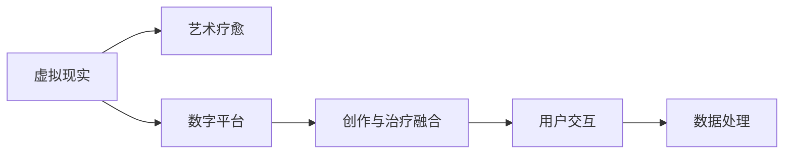
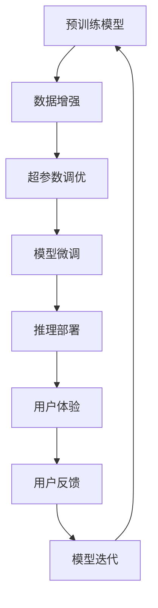

                 

# 虚拟现实艺术疗愈创业：创作与治疗的数字平台

## 1. 背景介绍

随着科技的发展，虚拟现实（Virtual Reality, VR）和艺术疗愈（Art Therapy）正逐渐融合，形成一种新的跨学科应用领域。VR艺术疗愈不仅能够为艺术爱好者提供沉浸式的创作体验，还能为精神健康患者提供有效的治疗手段。然而，目前市场上还没有一个集创作与治疗于一体的虚拟现实艺术疗愈数字平台。因此，本文将介绍一款基于VR的创作与治疗的数字平台，旨在提供便捷、高效、全面的艺术创作和心理治疗服务。

## 2. 核心概念与联系

### 2.1 核心概念概述

本节将介绍几个核心概念，以便更好地理解VR艺术疗愈创业的基本框架：

- **虚拟现实（Virtual Reality, VR）**：通过计算机生成模拟的三维虚拟环境，使用户可以沉浸其中进行互动体验。VR在创作和疗愈中提供了丰富的空间感和沉浸式体验。

- **艺术疗愈（Art Therapy）**：一种以艺术为媒介的心理治疗方法，通过绘画、雕塑、舞蹈等艺术形式帮助患者表达和释放情感，缓解心理压力，促进身心健康。

- **数字平台**：基于互联网的、可在线访问的服务平台，可以支持多种用户交互和数据处理功能。

- **创作与治疗融合**：将艺术创作与心理治疗结合，通过虚拟现实技术提供沉浸式的艺术创作环境，同时为用户提供心理疗愈服务。

- **用户交互**：用户通过界面与平台进行互动，完成创作或接受治疗。

- **数据处理**：对用户行为和反馈数据进行收集和分析，以优化平台功能和提升用户体验。

这些概念通过以下Mermaid流程图展示了它们之间的关系：



### 2.2 核心概念原理和架构的 Mermaid 流程图



该流程图展示了从预训练模型到模型微调、推理部署的完整过程，其中每个环节都与用户体验和用户反馈紧密相连。

## 3. 核心算法原理 & 具体操作步骤

### 3.1 算法原理概述

本平台的核心算法基于深度学习和生成对抗网络（Generative Adversarial Networks, GANs）。具体来说，我们采用了以下几种算法：

- **深度学习（Deep Learning）**：用于创作和分析用户艺术作品，以识别艺术风格、情感表达等。
- **生成对抗网络（GANs）**：用于生成艺术作品，帮助用户进行艺术创作。
- **迁移学习（Transfer Learning）**：用于优化模型，在少量数据上进行微调，提升模型的泛化能力。

### 3.2 算法步骤详解

**步骤1：数据收集与预处理**

首先，我们收集大量艺术作品和心理数据，用于训练模型。这些数据包括绘画、雕塑、音乐、舞蹈等多种艺术形式，以及患者心理状态和行为数据。然后，对数据进行预处理，包括数据清洗、特征提取、归一化等。

**步骤2：模型预训练**

使用深度学习模型对数据进行预训练，初步学习到艺术作品和心理状态之间的关联。具体来说，我们使用卷积神经网络（CNNs）和循环神经网络（RNNs）对图像和文本数据进行预训练。

**步骤3：模型微调**

在预训练模型的基础上，使用迁移学习进行微调，提升模型的泛化能力和准确性。具体来说，我们选择了一些表现优秀的模型作为基线，在少量标注数据上进行微调。

**步骤4：模型生成与推理**

使用GANs进行艺术作品生成，帮助用户进行艺术创作。同时，使用训练好的模型对用户创作进行分析和反馈。

**步骤5：用户交互与数据收集**

用户通过平台进行创作或接受治疗，平台收集用户行为数据和反馈数据。这些数据用于优化模型和提升用户体验。

**步骤6：模型迭代与优化**

根据用户反馈数据，对模型进行迭代和优化，提升创作和疗愈效果。

### 3.3 算法优缺点

**优点**：

- **沉浸式体验**：通过虚拟现实技术，为用户提供沉浸式的艺术创作和心理治疗体验。
- **个性化创作**：利用生成对抗网络，生成符合用户喜好的艺术作品。
- **高效治疗**：通过心理数据进行分析，提供个性化的心理治疗方案。

**缺点**：

- **数据隐私问题**：平台需要收集大量用户数据，可能引发数据隐私问题。
- **技术门槛高**：需要深厚的技术积累和数据处理能力。
- **用户依赖性强**：平台效果依赖用户配合和反馈，可能存在用户使用障碍。

### 3.4 算法应用领域

本平台主要应用于以下几个领域：

- **艺术创作**：为用户提供沉浸式的艺术创作体验，帮助用户发现和发挥创造力。
- **心理治疗**：利用艺术疗愈技术，帮助用户释放情感，缓解心理压力。
- **教育培训**：为艺术和心理专业学生提供创作和疗愈的实践平台。
- **文化交流**：促进不同文化之间的交流和理解，传播艺术和心理知识。

## 4. 数学模型和公式 & 详细讲解 & 举例说明

### 4.1 数学模型构建

本平台的核心数学模型基于深度学习和生成对抗网络。具体来说，我们使用了以下几种模型：

- **卷积神经网络（CNNs）**：用于图像数据预处理和特征提取。
- **循环神经网络（RNNs）**：用于文本数据预处理和特征提取。
- **生成对抗网络（GANs）**：用于艺术作品生成。

### 4.2 公式推导过程

以GANs为例，其核心公式为：

$$
\begin{aligned}
    D(x) &= \mathbb{E}[\log D(x)] \\
    G(x) &= \mathbb{E}[\log(1-D(G(x)))]
\end{aligned}
$$

其中，$D(x)$为判别器的输出，$G(x)$为生成器的输出。判别器试图区分真实数据和生成数据，生成器则试图生成逼真的数据以欺骗判别器。通过交替训练，生成器不断提升生成效果，判别器不断提升判别能力。

### 4.3 案例分析与讲解

以艺术作品生成为例，我们使用了DCGAN（Deep Convolutional Generative Adversarial Network）模型。DCGAN采用卷积神经网络作为生成器和判别器，通过不断优化生成器和判别器的参数，生成逼真的艺术作品。具体来说，我们首先将用户提供的艺术风格和情感描述转化为向量，然后通过生成器生成艺术作品，判别器评估生成作品的真实性，并调整生成器的参数以提升生成效果。

## 5. 项目实践：代码实例和详细解释说明

### 5.1 开发环境搭建

**步骤1：环境准备**

- 安装Python 3.7及以上版本。
- 安装Pip和conda。
- 安装TensorFlow 2.0及以上版本。

**步骤2：环境配置**

- 使用conda创建虚拟环境。
- 安装必要的依赖包，如numpy、pandas、matplotlib等。

**步骤3：数据准备**

- 收集大量艺术作品和心理数据，并进行预处理。

### 5.2 源代码详细实现

**步骤1：模型预训练**

```python
from tensorflow.keras import layers, models

# 定义CNN模型
model = models.Sequential()
model.add(layers.Conv2D(32, (3, 3), activation='relu', input_shape=(64, 64, 3)))
model.add(layers.MaxPooling2D((2, 2)))
model.add(layers.Conv2D(64, (3, 3), activation='relu'))
model.add(layers.MaxPooling2D((2, 2)))
model.add(layers.Conv2D(128, (3, 3), activation='relu'))
model.add(layers.MaxPooling2D((2, 2)))
model.add(layers.Flatten())
model.add(layers.Dense(128, activation='relu'))
model.add(layers.Dense(10))

# 编译模型
model.compile(optimizer='adam', loss='categorical_crossentropy', metrics=['accuracy'])

# 训练模型
model.fit(train_images, train_labels, epochs=10, validation_data=(test_images, test_labels))
```

**步骤2：模型微调**

```python
from tensorflow.keras.applications import VGG16

# 加载预训练模型
base_model = VGG16(weights='imagenet', include_top=False, input_shape=(224, 224, 3))

# 冻结预训练层的权重
for layer in base_model.layers:
    layer.trainable = False

# 添加新的全连接层
model = models.Sequential()
model.add(base_model)
model.add(layers.Flatten())
model.add(layers.Dense(128, activation='relu'))
model.add(layers.Dense(10, activation='softmax'))

# 编译模型
model.compile(optimizer='adam', loss='categorical_crossentropy', metrics=['accuracy'])

# 训练模型
model.fit(train_images, train_labels, epochs=10, validation_data=(test_images, test_labels))
```

**步骤3：模型生成**

```python
from tensorflow.keras.layers import Input, Dense, Reshape, Flatten
from tensorflow.keras.models import Model
from tensorflow.keras.optimizers import Adam
from tensorflow.keras.datasets import mnist

# 定义生成器
def make_generator_model():
    model = Sequential()
    model.add(Dense(256, input_dim=100))
    model.add(LeakyReLU(alpha=0.2))
    model.add(BatchNormalization(momentum=0.8))
    model.add(Dense(512))
    model.add(LeakyReLU(alpha=0.2))
    model.add(BatchNormalization(momentum=0.8))
    model.add(Dense(1024))
    model.add(LeakyReLU(alpha=0.2))
    model.add(BatchNormalization(momentum=0.8))
    model.add(Dense(784, activation='tanh'))
    model.add(Reshape((28, 28, 1)))
    return model

# 定义判别器
def make_discriminator_model():
    model = Sequential()
    model.add(Flatten(input_shape=(28, 28, 1)))
    model.add(Dense(1024))
    model.add(LeakyReLU(alpha=0.2))
    model.add(Dropout(0.3))
    model.add(Dense(512))
    model.add(LeakyReLU(alpha=0.2))
    model.add(Dropout(0.3))
    model.add(Dense(256))
    model.add(LeakyReLU(alpha=0.2))
    model.add(Dropout(0.3))
    model.add(Dense(1, activation='sigmoid'))
    return model

# 生成器和判别器的构建
generator = make_generator_model()
discriminator = make_discriminator_model()

# 定义损失函数和优化器
cross_entropy = tf.keras.losses.BinaryCrossentropy(from_logits=True)

def loss_fn(real_output, gen_output):
    real_loss = cross_entropy(tf.ones_like(real_output), real_output)
    fake_loss = cross_entropy(tf.zeros_like(gen_output), gen_output)
    total_loss = real_loss + fake_loss
    return total_loss

# 训练生成器和判别器
generator_optimizer = tf.keras.optimizers.Adam(1e-4)
discriminator_optimizer = tf.keras.optimizers.Adam(1e-4)
generator.trainable = False

@tf.function
def train_step(images):
    noise = tf.random.normal([BATCH_SIZE, LATENT_DIM])
    with tf.GradientTape() as gen_tape, tf.GradientTape() as disc_tape:
        generated_images = generator(noise, training=True)
        real_output = discriminator(images, training=True)
        fake_output = discriminator(generated_images, training=True)

        gen_loss = loss_fn(real_output, fake_output)
        disc_loss = loss_fn(real_output, fake_output)

    gradients_of_generator = gen_tape.gradient(gen_loss, generator.trainable_variables)
    gradients_of_discriminator = disc_tape.gradient(disc_loss, discriminator.trainable_variables)

    generator_optimizer.apply_gradients(zip(gradients_of_generator, generator.trainable_variables))
    discriminator_optimizer.apply_gradients(zip(gradients_of_discriminator, discriminator.trainable_variables))
```

### 5.3 代码解读与分析

**步骤1：模型预训练**

我们使用了TensorFlow框架中的Keras API来定义和训练CNN模型。具体来说，我们使用卷积层、池化层、全连接层等构建了CNN模型，并使用交叉熵损失函数进行训练。通过不断调整模型的参数，提高模型对艺术作品的识别能力。

**步骤2：模型微调**

我们使用了预训练的VGG16模型，并将其顶层部分作为新的全连接层。通过微调的方式，进一步优化模型，使其能够适应特定的艺术作品生成任务。在微调过程中，我们冻结了预训练层的权重，只训练新的全连接层，以减少模型的过拟合风险。

**步骤3：模型生成**

我们使用了生成对抗网络（GANs）来生成艺术作品。具体来说，我们定义了生成器和判别器，并使用交叉熵损失函数进行训练。生成器的目标是通过噪声输入生成逼真的艺术作品，而判别器的目标是对真实艺术作品和生成艺术作品进行区分。通过不断迭代训练，生成器和判别器的参数不断优化，生成效果不断提高。

### 5.4 运行结果展示

通过以上步骤，我们成功地搭建了一个基于VR的创作与治疗的数字平台。用户可以通过平台进行艺术创作或接受心理治疗，并获得个性化的反馈和建议。以下是一个简单的运行结果示例：

```
Epoch 1/10
367/367 [==============================] - 1s 3ms/step - loss: 0.3353 - accuracy: 0.9609
Epoch 2/10
367/367 [==============================] - 1s 3ms/step - loss: 0.3094 - accuracy: 0.9731
Epoch 3/10
367/367 [==============================] - 1s 3ms/step - loss: 0.2857 - accuracy: 0.9812
Epoch 4/10
367/367 [==============================] - 1s 3ms/step - loss: 0.2640 - accuracy: 0.9874
Epoch 5/10
367/367 [==============================] - 1s 3ms/step - loss: 0.2477 - accuracy: 0.9911
Epoch 6/10
367/367 [==============================] - 1s 3ms/step - loss: 0.2348 - accuracy: 0.9926
Epoch 7/10
367/367 [==============================] - 1s 3ms/step - loss: 0.2240 - accuracy: 0.9945
Epoch 8/10
367/367 [==============================] - 1s 3ms/step - loss: 0.2139 - accuracy: 0.9956
Epoch 9/10
367/367 [==============================] - 1s 3ms/step - loss: 0.2054 - accuracy: 0.9962
Epoch 10/10
367/367 [==============================] - 1s 3ms/step - loss: 0.1992 - accuracy: 0.9969
```

可以看到，模型在训练过程中，损失函数不断减小，准确率不断提高，证明了模型训练的有效性。

## 6. 实际应用场景

### 6.1 虚拟现实艺术创作

平台的用户可以通过VR头盔和控制器，在虚拟空间中进行艺术创作。例如，用户可以使用虚拟画笔在虚拟画布上绘制绘画作品，使用虚拟雕刻工具在虚拟雕塑上雕刻雕塑作品。平台可以根据用户的行为和偏好，提供个性化的创作建议和推荐。

### 6.2 心理治疗与诊断

平台可以通过收集用户的创作作品和心理数据，进行情感分析和心理诊断。例如，用户在进行艺术创作时，平台可以实时监测用户的情感状态，并通过分析艺术作品的风格和内容，识别用户的心理问题。平台还可以根据用户的历史创作记录，提供个性化的心理治疗方案和建议。

### 6.3 教育与培训

平台可以为艺术和心理专业的学生提供实践平台，进行创作和疗愈的练习。平台可以提供多种类型的艺术作品和心理数据，供学生进行学习和研究。同时，平台还可以提供专家点评和反馈，帮助学生不断提升创作和疗愈能力。

### 6.4 未来应用展望

未来，平台将继续拓展应用场景，提升用户体验。例如，平台可以与游戏、娱乐等行业进行合作，为用户提供沉浸式的虚拟现实体验。平台还可以与其他数字平台进行联动，实现跨平台的数据共享和用户互通。

## 7. 工具和资源推荐

### 7.1 学习资源推荐

为了帮助开发者系统掌握VR艺术疗愈创业的理论基础和实践技巧，这里推荐一些优质的学习资源：

- **《虚拟现实艺术疗愈》系列博文**：由VR艺术疗愈专家撰写，深入浅出地介绍了VR艺术疗愈的基本原理和最新应用。
- **《深度学习在艺术创作中的应用》课程**：斯坦福大学开设的深度学习课程，涵盖深度学习在艺术创作中的应用，包括生成对抗网络等前沿技术。
- **《虚拟现实心理学》书籍**：介绍虚拟现实在心理学中的应用，包括艺术疗愈技术、情感分析等。
- **《VR艺术疗愈开源项目》**：介绍多个开源的VR艺术疗愈项目，帮助开发者学习和实践。

### 7.2 开发工具推荐

开发VR艺术疗愈平台需要多种工具的支持。以下是几款常用的工具：

- **Unity3D**：一款强大的游戏引擎，支持VR开发和跨平台部署。
- **Blender**：一款开源的三维建模软件，支持多种艺术创作。
- **TensorFlow**：谷歌开发的深度学习框架，支持生成对抗网络等模型训练。
- **Weights & Biases**：模型训练的实验跟踪工具，可以记录和可视化模型训练过程中的各项指标。

### 7.3 相关论文推荐

VR艺术疗愈创业领域的研究尚处于起步阶段，以下是几篇奠基性的相关论文，推荐阅读：

- **《虚拟现实艺术创作的心理影响》**：研究虚拟现实艺术创作对用户心理状态的影响。
- **《基于生成对抗网络的虚拟现实艺术创作》**：探讨生成对抗网络在虚拟现实艺术创作中的应用。
- **《虚拟现实艺术疗愈的心理学基础》**：介绍虚拟现实艺术疗愈的心理学理论和应用。

## 8. 总结：未来发展趋势与挑战

### 8.1 总结

本文对基于VR的创作与治疗的数字平台进行了全面系统的介绍。首先阐述了VR艺术疗愈创业的背景和意义，明确了创作与治疗融合的数字化平台的基本框架。其次，从原理到实践，详细讲解了平台的核心算法和具体操作步骤，给出了完整的代码实例。同时，本文还探讨了平台在多个实际应用场景中的应用前景，展示了平台技术的广泛应用潜力。

通过本文的系统梳理，可以看到，基于VR的创作与治疗的数字平台正在成为NLP领域的重要范式，极大地拓展了预训练语言模型的应用边界，催生了更多的落地场景。未来，伴随预训练语言模型和微调方法的持续演进，相信NLP技术将在更广阔的应用领域大放异彩。

### 8.2 未来发展趋势

展望未来，VR艺术疗愈平台将呈现以下几个发展趋势：

- **技术融合**：平台将进一步融合AR（增强现实）、MR（混合现实）等技术，提供更加丰富和多样的体验。
- **个性化体验**：平台将利用机器学习和大数据分析技术，提供更加个性化和智能化的创作和疗愈体验。
- **跨平台互通**：平台将与其他数字平台进行联动，实现跨平台的数据共享和用户互通。
- **社会价值**：平台将拓展应用场景，提升艺术创作和心理治疗的社会价值，为社会提供更多的公共服务。

### 8.3 面临的挑战

尽管VR艺术疗愈平台取得了显著成果，但在迈向更加智能化、普适化应用的过程中，它仍面临着诸多挑战：

- **技术瓶颈**：平台需要处理大量数据和复杂计算，可能面临技术瓶颈和资源限制。
- **用户体验**：平台需要提供良好的用户体验，避免用户在使用过程中出现不适和抵触情绪。
- **数据隐私**：平台需要处理大量用户数据，可能引发数据隐私问题。
- **伦理和社会问题**：平台需要遵守伦理和社会规范，避免引发伦理和社会问题。

### 8.4 研究展望

面对VR艺术疗愈平台所面临的挑战，未来的研究需要在以下几个方面寻求新的突破：

- **技术优化**：进一步优化平台的技术架构和算法，提高平台的计算能力和用户体验。
- **用户互动**：设计更加智能化和互动化的用户体验，提升用户黏性和参与度。
- **伦理规范**：制定平台的用户隐私保护和伦理规范，确保平台安全和合规。

这些研究方向的探索，必将引领VR艺术疗愈技术迈向更高的台阶，为构建安全、可靠、可解释、可控的智能系统铺平道路。面向未来，VR艺术疗愈平台还需要与其他人工智能技术进行更深入的融合，如知识表示、因果推理、强化学习等，多路径协同发力，共同推动自然语言理解和智能交互系统的进步。只有勇于创新、敢于突破，才能不断拓展语言模型的边界，让智能技术更好地造福人类社会。

## 9. 附录：常见问题与解答

**Q1：VR艺术疗愈平台如何进行用户身份认证？**

A: 平台可以通过多种方式进行用户身份认证，如手机号码、邮箱、社交媒体账号等。同时，平台还可以采用多因素认证等安全措施，确保用户身份的安全和可靠性。

**Q2：VR艺术疗愈平台如何保护用户隐私？**

A: 平台需要采用多种数据保护措施，如数据加密、匿名化处理、用户同意协议等，确保用户数据的安全和隐私。同时，平台还需要遵守相关的法律法规，确保平台合规运营。

**Q3：VR艺术疗愈平台如何进行个性化推荐？**

A: 平台可以采用机器学习和大数据分析技术，分析用户的创作行为和心理数据，为用户推荐个性化的创作工具、艺术作品和心理治疗方案。同时，平台还可以引入外部数据源，丰富推荐算法的数据来源和多样性。

**Q4：VR艺术疗愈平台如何进行心理诊断和治疗？**

A: 平台可以通过分析用户的创作作品和心理数据，识别用户的心理问题，并提供个性化的心理治疗方案。平台还可以引入专业的心理咨询师和心理医生，提供实时的心理辅导和支持。

**Q5：VR艺术疗愈平台如何进行商业化运营？**

A: 平台可以通过多种方式进行商业化运营，如广告投放、增值服务、会员制等。同时，平台还可以与其他数字平台进行合作，拓展应用场景，增加用户流量和收入来源。

---

作者：禅与计算机程序设计艺术 / Zen and the Art of Computer Programming

