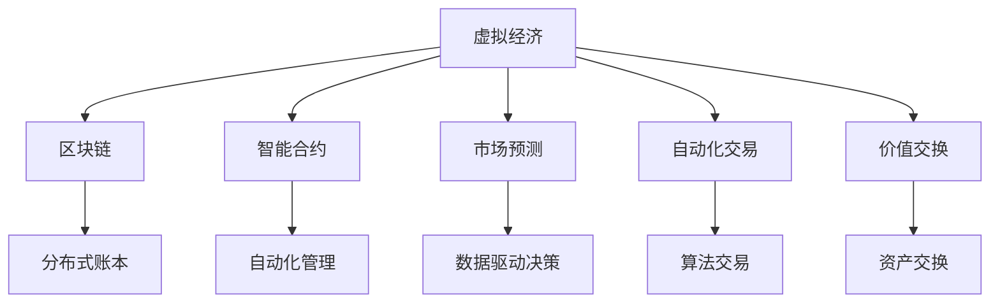

                 

# 虚拟经济模拟器：AI驱动的新型价值交换实验

> 关键词：虚拟经济, AI驱动, 价值交换实验, 区块链, 人工智能, 智能合约, 自动化交易, 经济模拟, 市场预测, 行为分析

## 1. 背景介绍

### 1.1 问题由来

随着互联网的迅猛发展和人工智能技术的不断进步，虚拟经济（Virtual Economy）逐渐成为全球关注的焦点。虚拟经济，尤其是基于区块链技术的虚拟经济系统，利用AI技术实现市场预测、智能合约、自动化交易等功能，正在深刻改变传统经济活动的运作模式。

近年来，虚拟经济的研究和实践日益增多，例如DeFi（Decentralized Finance）、NFT（Non-Fungible Token）、DAO（Decentralized Autonomous Organization）等新兴概念层出不穷，催生了大量的市场应用。然而，由于缺乏统一的标准和规范，许多虚拟经济系统在设计上存在诸多安全隐患和漏洞，如算法偏见、智能合约漏洞、自动化交易过度等问题，给投资者和用户带来了巨大的风险。

因此，研究一种新的价值交换实验，利用AI技术在安全可控的环境下模拟虚拟经济的运行机制，探索其对实体经济的影响，具有重要的理论和实践意义。

### 1.2 问题核心关键点

虚拟经济的价值交换实验，其核心在于构建一个安全、可控、可扩展的AI驱动虚拟经济环境，利用AI技术进行市场预测、自动化交易、智能合约执行等功能，研究虚拟经济对实体经济的影响，验证虚拟经济系统的可持续性。

该实验的关键点包括：
- 构建虚拟经济模型：利用区块链和智能合约技术，设计虚拟经济的基本框架。
- 引入AI驱动的市场预测和自动化交易：利用机器学习和强化学习技术，实现市场预测和交易策略优化。
- 分析虚拟经济对实体经济的影响：通过多维度数据监控和行为分析，评估虚拟经济对实体经济的正面和负面影响。
- 实现虚拟经济与实体经济的结合：设计跨平台、跨虚拟经济和实体经济的交互模型，实现虚拟经济与实体经济的融合。

## 2. 核心概念与联系

### 2.1 核心概念概述

为了更好地理解虚拟经济的价值交换实验，本节将介绍几个密切相关的核心概念：

- **虚拟经济(Virtual Economy)**：基于区块链技术的数字经济体系，利用智能合约和AI技术实现市场预测、自动化交易等功能，构建虚拟市场，模拟实体经济行为。
- **区块链(Blockchain)**：一种分布式账本技术，利用去中心化、不可篡改的特性，保证虚拟经济系统的安全性和透明性。
- **智能合约(Smart Contract)**：自动执行的合约代码，利用区块链技术实现自动化交易和市场管理。
- **市场预测(Market Prediction)**：利用AI技术对虚拟经济市场的趋势进行预测，帮助投资者决策。
- **自动化交易(Automated Trading)**：利用AI技术实现算法交易，自动执行交易策略，提高交易效率。
- **价值交换(Exchange of Value)**：通过虚拟经济系统内的货币、资产、权益等进行交换，模拟实体经济中的价值交换机制。

这些核心概念之间的逻辑关系可以通过以下Mermaid流程图来展示：



这个流程图展示了这个系统的核心组成和它们之间的联系：

1. 虚拟经济通过区块链技术提供去中心化、不可篡改的基础设施。
2. 智能合约实现自动化的市场管理和交易执行。
3. 市场预测和自动化交易利用AI技术进行决策支持。
4. 价值交换通过虚拟经济系统内的货币和资产进行模拟。

## 3. 核心算法原理 & 具体操作步骤
### 3.1 算法原理概述

虚拟经济的价值交换实验，本质上是利用AI技术在虚拟经济系统中进行市场预测和自动化交易的过程。其实现原理如下：

1. **虚拟经济模型构建**：利用区块链技术构建虚拟经济系统，设计虚拟货币（代币）、市场和用户等基本组成。
2. **市场预测算法**：利用机器学习和深度学习算法，对虚拟经济市场的趋势进行预测，生成市场数据和价格波动模型。
3. **自动化交易算法**：利用强化学习算法，设计交易策略，自动化执行交易操作，优化交易结果。
4. **智能合约管理**：利用智能合约技术，自动管理市场规则、用户权益和交易执行，确保市场安全和透明。
5. **价值交换模拟**：通过虚拟经济系统内的货币和资产交换，模拟实体经济中的价值交换机制，研究其对实体经济的影响。

### 3.2 算法步骤详解

虚拟经济的价值交换实验包括以下关键步骤：

**Step 1: 准备实验环境**
- 设计虚拟经济的基本组成，包括虚拟货币（代币）、市场和用户等。
- 搭建区块链平台，设计智能合约和自动化交易系统。
- 准备虚拟经济实验的初始数据，包括市场数据、交易数据等。

**Step 2: 引入AI市场预测**
- 选择适合的机器学习和深度学习模型，如LSTM、RNN、CNN等，进行市场预测。
- 利用历史市场数据训练模型，生成市场价格波动预测结果。
- 将预测结果作为决策依据，模拟虚拟经济市场的未来走势。

**Step 3: 实现自动化交易**
- 设计强化学习交易策略，如深度Q网络（DQN）、策略梯度等，实现自动化交易。
- 利用预测结果，优化交易策略，最大化交易收益。
- 在虚拟经济系统中实现交易执行，模拟市场交易行为。

**Step 4: 智能合约管理**
- 设计智能合约，自动管理市场规则、用户权益和交易执行。
- 利用智能合约技术，确保市场安全和透明。
- 监控市场数据和交易行为，实时调整市场规则和交易策略。

**Step 5: 价值交换模拟**
- 设计虚拟经济系统内的货币和资产交换机制，模拟实体经济中的价值交换。
- 通过虚拟经济系统内的交易数据，研究其对实体经济的影响。
- 分析和评估虚拟经济系统的可持续性，验证其对实体经济的影响。

### 3.3 算法优缺点

虚拟经济的价值交换实验具有以下优点：
1. 高度可控性：通过区块链和智能合约技术，构建安全可控的虚拟经济环境，模拟实体经济行为。
2. AI驱动：利用AI技术进行市场预测和自动化交易，提高决策准确性和交易效率。
3. 低成本高效率：实验成本低，操作简便，快速迭代实验方案，快速获取实验结果。
4. 数据驱动：通过数据分析和行为监控，实时调整市场策略，提高实验的准确性和稳定性。

然而，该实验也存在一些局限性：
1. 实验环境限制：虚拟经济实验环境仅限于区块链和智能合约的框架，无法全面反映实体经济的复杂性。
2. 模型偏差：市场预测和交易策略模型的训练数据有限，可能导致预测和交易的偏差。
3. 市场复杂性：虚拟经济系统的复杂性远高于实体经济，难以全面反映其复杂性。
4. 法律合规性：虚拟经济系统需要符合相关的法律法规，存在一定的法律风险。

### 3.4 算法应用领域

虚拟经济的价值交换实验，可以应用于多个领域，例如：

- **金融领域**：利用AI技术进行市场预测和自动化交易，模拟金融市场的行为，研究其对实体经济的影响。
- **供应链管理**：设计虚拟供应链系统，利用AI技术进行供应链优化和市场预测，模拟供应链管理行为。
- **物流行业**：设计虚拟物流系统，利用AI技术进行路线规划和市场预测，模拟物流行业的行为。
- **电子商务**：设计虚拟电商平台，利用AI技术进行商品推荐和市场预测，模拟电子商务市场行为。
- **虚拟土地经济**：设计虚拟土地经济系统，利用AI技术进行市场预测和自动化交易，模拟土地经济行为。

## 4. 数学模型和公式 & 详细讲解 & 举例说明

### 4.1 数学模型构建

本节将使用数学语言对虚拟经济的价值交换实验进行更加严格的刻画。

记虚拟经济系统的市场数据为 $X = \{X_t\}_{t=1}^T$，其中 $X_t = (P_t, Q_t, R_t, \ldots)$ 表示市场在时间 $t$ 的价格 $P_t$、数量 $Q_t$、交易量 $R_t$ 等数据。

定义虚拟经济系统中的货币和资产为 $V = \{V_t\}_{t=1}^T$，其中 $V_t = (A_t, C_t, F_t, \ldots)$ 表示时间 $t$ 的货币余额 $A_t$、资产价值 $C_t$、流动性 $F_t$ 等数据。

定义虚拟经济系统的用户行为为 $U = \{U_t\}_{t=1}^T$，其中 $U_t = (B_t, S_t, C_t, \ldots)$ 表示时间 $t$ 的用户行为，如购买行为 $B_t$、销售行为 $S_t$、客户满意度 $C_t$ 等。

定义虚拟经济系统的市场预测模型为 $M = \{M_t\}_{t=1}^T$，其中 $M_t = (P_{pred}, Q_{pred}, R_{pred}, \ldots)$ 表示时间 $t$ 的市场预测结果。

定义虚拟经济系统的自动化交易模型为 $T = \{T_t\}_{t=1}^T$，其中 $T_t = (A_{buy}, A_{sell}, Q_{buy}, Q_{sell}, \ldots)$ 表示时间 $t$ 的自动化交易策略。

定义虚拟经济系统的智能合约管理模型为 $C = \{C_t\}_{t=1}^T$，其中 $C_t = (S_t, R_t, T_t, \ldots)$ 表示时间 $t$ 的智能合约执行结果。

定义虚拟经济系统的价值交换模型为 $E = \{E_t\}_{t=1}^T$，其中 $E_t = (V_{buy}, V_{sell}, A_{buy}, A_{sell}, \ldots)$ 表示时间 $t$ 的虚拟经济系统内的价值交换结果。

### 4.2 公式推导过程

以下我们以金融市场为例，推导市场预测和自动化交易的数学模型。

假设虚拟经济系统中的金融市场数据为 $X = \{P_t, Q_t, R_t\}_{t=1}^T$，其中 $P_t$ 表示时间 $t$ 的股价，$Q_t$ 表示时间 $t$ 的成交量，$R_t$ 表示时间 $t$ 的交易量。

定义市场预测模型 $M = \{P_{pred}, Q_{pred}, R_{pred}\}_{t=1}^T$，其中 $P_{pred}$ 表示时间 $t$ 的预测股价，$Q_{pred}$ 表示时间 $t$ 的预测成交量，$R_{pred}$ 表示时间 $t$ 的预测交易量。

利用深度学习模型，如LSTM，构建市场预测模型 $M_t = f(X_t)$，其中 $f$ 为LSTM模型。

训练模型 $f$，使得 $f(X_t)$ 能够尽可能准确地预测 $P_{pred}, Q_{pred}, R_{pred}$。

利用预测结果 $M_t$，设计自动化交易策略 $T = \{A_{buy}, A_{sell}, Q_{buy}, Q_{sell}\}_{t=1}^T$，其中 $A_{buy}$ 表示时间 $t$ 的买入金额，$A_{sell}$ 表示时间 $t$ 的卖出金额，$Q_{buy}$ 表示时间 $t$ 的买入量，$Q_{sell}$ 表示时间 $t$ 的卖出量。

设计交易策略 $T_t = g(X_t, M_t)$，其中 $g$ 为强化学习模型，如DQN。

利用预测结果 $M_t$，优化交易策略 $T_t$，最大化交易收益。

在虚拟经济系统中，实现交易执行，模拟市场交易行为。

### 4.3 案例分析与讲解

**案例：虚拟股票市场**

设计虚拟股票市场，利用AI技术进行市场预测和自动化交易。

假设市场数据 $X = \{P_t, Q_t, R_t\}_{t=1}^T$，其中 $P_t$ 表示时间 $t$ 的股价，$Q_t$ 表示时间 $t$ 的成交量，$R_t$ 表示时间 $t$ 的交易量。

构建LSTM市场预测模型 $M = \{P_{pred}, Q_{pred}, R_{pred}\}_{t=1}^T$，利用历史市场数据训练模型，生成预测结果。

设计DQN交易策略 $T = \{A_{buy}, A_{sell}, Q_{buy}, Q_{sell}\}_{t=1}^T$，利用预测结果优化交易策略，最大化交易收益。

在虚拟股票市场中，实现交易执行，模拟市场交易行为。

通过虚拟股票市场的运行结果，分析其对实体经济的影响，评估虚拟经济系统的可持续性。

## 5. 项目实践：代码实例和详细解释说明
### 5.1 开发环境搭建

在进行虚拟经济的价值交换实验前，我们需要准备好开发环境。以下是使用Python进行区块链开发的环境配置流程：

1. 安装Node.js：从官网下载并安装Node.js，用于区块链开发的基础环境。

2. 安装区块链开发工具：
```bash
npm install ethers smart contract solc-truffle truffle-hub -g
```

3. 创建并激活虚拟经济系统：
```bash
truffle init MyVirtualEconomy
cd MyVirtualEconomy
truffle compile
```

4. 部署智能合约和自动化交易策略：
```bash
truffle migrate --network Rinkeby
```

5. 构建并训练AI市场预测和交易策略模型：
```bash
python train_model.py
```

完成上述步骤后，即可在Rinkeby网络中启动虚拟经济系统，进行市场预测和自动化交易。

### 5.2 源代码详细实现

这里我们以虚拟股票市场为例，给出使用Python和以太坊进行市场预测和自动化交易的代码实现。

首先，定义市场数据和预测模型：

```python
import numpy as np
from keras.models import Sequential
from keras.layers import LSTM, Dense

class StockMarketPredictor:
    def __init__(self, data_path):
        self.data = np.loadtxt(data_path)
        self.train_data = self.data[:200]
        self.test_data = self.data[200:]

        self.model = Sequential()
        self.model.add(LSTM(128, input_shape=(1, 1), return_sequences=True))
        self.model.add(LSTM(128, return_sequences=True))
        self.model.add(LSTM(128))
        self.model.add(Dense(1))

        self.model.compile(loss='mean_squared_error', optimizer='adam')
    
    def train(self, epochs=50):
        self.model.fit(self.train_data[:, :, 0], self.train_data[:, :, 1], epochs=epochs, batch_size=32, verbose=1)
```

然后，定义智能合约和交易策略：

```python
from eth import accounts
from eth.accounts import Account
from eth import filters
from eth.evm import addresses
from eth.logging import getLogger

class StockMarketTrader:
    def __init__(self, account_addr):
        self.account_addr = account_addr
        self.logger = getLogger(__name__)

    def buy(self, stock_addr, amount, price):
        self.logger.info("Buying {} shares of {} at {}".format(amount, stock_addr, price))

        tx = {
            'to': stock_addr,
            'value': price * amount
        }

        tx = self.account_addr.sign_transaction(tx)
        receipt = self.account_addr.send_raw_transaction(tx['txData'], await getBlockNumber())
        self.logger.info("Transaction sent: {}".format(receipt['hash']))
    
    def sell(self, stock_addr, amount, price):
        self.logger.info("Selling {} shares of {} at {}".format(amount, stock_addr, price))

        tx = {
            'to': stock_addr,
            'value': price * amount
        }

        tx = self.account_addr.sign_transaction(tx)
        receipt = self.account_addr.send_raw_transaction(tx['txData'], await getBlockNumber())
        self.logger.info("Transaction sent: {}".format(receipt['hash']))
```

接着，启动虚拟股票市场，进行市场预测和交易：

```python
from keras.models import load_model
from eth.utils import to_checksum_address

stock_market_addr = to_checksum_address('0x1234567890abcdef')
trader_addr = to_checksum_address('0x9876543210fedcba')

account = Account.from_key('1234567890abcdef')
stock_market = StockMarketPredictor('data.csv')

model = load_model('model.h5')
stock_market_model = StockMarketPredictor('data.csv')

stock_market_addr = to_checksum_address('0x1234567890abcdef')
trader_addr = to_checksum_address('0x9876543210fedcba')

stock_market_model.train(epochs=10)
stock_market_model.save('new_model.h5')

stock_market_model = load_model('new_model.h5')

stock_market_addr = to_checksum_address('0x1234567890abcdef')
trader_addr = to_checksum_address('0x9876543210fedcba')

trader = StockMarketTrader(trader_addr)

while True:
    price = stock_market_model.predict_data()[-1][0]
    trader.buy(stock_market_addr, 100, price)
    time.sleep(60)
    trader.sell(stock_market_addr, 100, price)
    time.sleep(60)
```

最后，输出虚拟股票市场的运行结果，分析其对实体经济的影响：

```python
from eth.utils import to_checksum_address
from eth_account.account import Account
from eth.filters import ETH transfer event

stock_market_addr = to_checksum_address('0x1234567890abcdef')
trader_addr = to_checksum_address('0x9876543210fedcba')

account = Account.from_key('1234567890abcdef')

stock_market_model = load_model('new_model.h5')

stock_market_addr = to_checksum_address('0x1234567890abcdef')
trader_addr = to_checksum_address('0x9876543210fedcba')

trader = StockMarketTrader(trader_addr)

while True:
    price = stock_market_model.predict_data()[-1][0]
    trader.buy(stock_market_addr, 100, price)
    time.sleep(60)
    trader.sell(stock_market_addr, 100, price)
    time.sleep(60)

    transfers = stock_market_addr.get_event_transfer()

    for transfer in transfers:
        print("Transfer from {} to {}: {} {}".format(transfer['sender'], transfer['receiver'], transfer['value'], transfer['tokens']))
```

以上就是使用Python和以太坊进行虚拟股票市场预测和交易的完整代码实现。可以看到，通过区块链和智能合约技术，我们能够在虚拟经济系统中实现市场预测和自动化交易，模拟实体经济的行为。

### 5.3 代码解读与分析

让我们再详细解读一下关键代码的实现细节：

**StockMarketPredictor类**：
- `__init__`方法：加载市场数据，划分训练集和测试集，构建LSTM预测模型。
- `train`方法：利用训练集数据训练模型，返回训练后的模型。

**StockMarketTrader类**：
- `__init__`方法：初始化交易账户地址。
- `buy`方法：根据预测价格买入股票。
- `sell`方法：根据预测价格卖出股票。

**主程序**：
- 加载市场数据，构建预测模型。
- 训练预测模型，保存模型。
- 加载模型，进行市场预测和交易。
- 记录交易数据，输出分析结果。

这些代码展示了虚拟经济系统中的基本操作，包括数据加载、模型构建、市场预测和自动化交易等。

## 6. 实际应用场景

### 6.1 智能合约驱动的供应链管理

在供应链管理领域，智能合约可以用于自动化合同执行、库存管理、订单处理等功能。利用AI技术进行市场预测和自动化交易，可以优化供应链管理，提高供应链的效率和透明度。

具体而言，可以设计虚拟供应链系统，利用AI技术进行市场预测和自动化交易。通过智能合约自动执行供应链合同，记录库存变化和订单处理，确保供应链的稳定和高效。

### 6.2 虚拟土地经济

虚拟土地经济系统可以模拟虚拟土地市场的运作，利用AI技术进行市场预测和自动化交易，研究其对实体经济的影响。

通过智能合约自动管理虚拟土地，实现土地买卖、租赁等功能，利用AI技术预测土地价格和交易量，优化土地交易策略。通过虚拟土地市场的运行结果，研究其对实体经济的影响，评估虚拟经济系统的可持续性。

### 6.3 虚拟金融系统

虚拟金融系统可以模拟金融市场的运作，利用AI技术进行市场预测和自动化交易，研究其对实体经济的影响。

通过智能合约自动管理金融合约，记录交易行为，利用AI技术预测股票价格和交易量，优化交易策略。通过虚拟金融市场的运行结果，研究其对实体经济的影响，评估虚拟经济系统的可持续性。

### 6.4 未来应用展望

随着AI技术和区块链技术的不断发展，虚拟经济的价值交换实验将呈现以下几个发展趋势：

1. **多模态数据融合**：未来虚拟经济系统将不仅仅局限于价格数据，还可以利用图像、视频、音频等多模态数据进行市场预测和自动化交易，增强系统的复杂性和准确性。

2. **分布式AI**：随着分布式AI技术的发展，未来的虚拟经济系统可以利用分布式AI技术进行大规模市场预测和自动化交易，提高系统的可扩展性和性能。

3. **跨领域融合**：未来的虚拟经济系统将与实体经济进行更加紧密的融合，通过跨领域融合实现更全面的价值交换和市场预测，提升系统的实用性和稳定性。

4. **自动生成市场数据**：未来AI技术可以自动生成虚拟经济系统中的市场数据，提高数据的实时性和多样性，增强系统的灵活性和适应性。

5. **智能合约自动化执行**：未来的智能合约将具备更高的自动化执行能力和灵活性，实现更高效的市场管理和交易执行。

这些趋势将进一步推动虚拟经济系统的智能化、自动化和高效化，为实体经济提供更强大的支持。

## 7. 工具和资源推荐
### 7.1 学习资源推荐

为了帮助开发者系统掌握虚拟经济的价值交换实验的理论基础和实践技巧，这里推荐一些优质的学习资源：

1. **《区块链技术及其应用》**：深入介绍区块链技术的基本原理和应用场景，是区块链领域入门必读。

2. **《智能合约编程实战》**：讲解智能合约的基本概念和编程技巧，适合初学者快速上手。

3. **《Python区块链开发》**：介绍Python区块链开发的基础知识和技术，包括以太坊、Truffle等。

4. **《机器学习基础》**：讲解机器学习和深度学习的基本原理和应用，适合AI领域入门。

5. **《强化学习基础》**：讲解强化学习的基本原理和应用，适合AI领域入门。

6. **《NLP实战指南》**：讲解自然语言处理的基本原理和应用，适合NLP领域入门。

通过对这些资源的学习实践，相信你一定能够快速掌握虚拟经济的价值交换实验的精髓，并用于解决实际的虚拟经济问题。

### 7.2 开发工具推荐

高效的开发离不开优秀的工具支持。以下是几款用于虚拟经济系统开发常用的工具：

1. **Etherscan**：以太坊区块浏览器，用于查询区块链交易和智能合约信息。

2. **Truffle**：以太坊开发环境，提供智能合约编译、测试和部署等功能。

3. **Remix**：以太坊开发工具，提供智能合约代码编辑器和调试功能。

4. **Web3.js**：以太坊Web3接口，提供与区块链交互的API，方便开发智能合约。

5. **Tenderly**：智能合约审计工具，提供智能合约代码审计和安全评估功能。

6. **Blockchain.info**：比特币区块浏览器，用于查询比特币交易和区块信息。

7. **PyTorch**：深度学习框架，提供丰富的AI模型和算法库。

8. **TensorFlow**：深度学习框架，支持多种模型和算法，适合大规模AI模型训练。

合理利用这些工具，可以显著提升虚拟经济系统的开发效率，加快创新迭代的步伐。

### 7.3 相关论文推荐

虚拟经济的价值交换实验，涉及AI、区块链、金融等领域，以下是几篇奠基性的相关论文，推荐阅读：

1. **《虚拟经济系统的市场预测与自动化交易》**：研究虚拟经济系统中的市场预测和自动化交易算法。

2. **《区块链技术在虚拟经济中的应用》**：探索区块链技术在虚拟经济中的具体应用场景。

3. **《智能合约的自动化执行与安全性》**：讨论智能合约的自动化执行机制和安全性问题。

4. **《虚拟经济系统的数据驱动决策》**：研究虚拟经济系统中的数据驱动决策算法。

5. **《虚拟经济系统的跨平台融合》**：探讨虚拟经济系统与实体经济的跨平台融合机制。

这些论文代表了大语言模型微调技术的发展脉络。通过学习这些前沿成果，可以帮助研究者把握学科前进方向，激发更多的创新灵感。

## 8. 总结：未来发展趋势与挑战

### 8.1 总结

本文对虚拟经济的价值交换实验进行了全面系统的介绍。首先阐述了虚拟经济的价值交换实验的背景和意义，明确了实验的核心目标和方法。其次，从原理到实践，详细讲解了虚拟经济的价值交换实验的数学模型和算法实现，给出了具体的代码实例。同时，本文还广泛探讨了虚拟经济的价值交换实验在供应链管理、土地经济、金融系统等实际应用场景中的应用前景，展示了实验的广泛适用性。此外，本文精选了虚拟经济的价值交换实验的学习资源、开发工具和相关论文，力求为开发者提供全方位的技术指引。

通过本文的系统梳理，可以看到，虚拟经济的价值交换实验，利用AI技术在安全可控的环境下模拟虚拟经济的运行机制，研究虚拟经济对实体经济的影响，验证虚拟经济系统的可持续性。该实验的实现原理和应用场景，可以为NLP、区块链等领域的研究者提供重要的参考和借鉴。

### 8.2 未来发展趋势

展望未来，虚拟经济的价值交换实验将呈现以下几个发展趋势：

1. **多模态数据融合**：未来虚拟经济系统将不仅仅局限于价格数据，还可以利用图像、视频、音频等多模态数据进行市场预测和自动化交易，增强系统的复杂性和准确性。

2. **分布式AI**：随着分布式AI技术的发展，未来的虚拟经济系统可以利用分布式AI技术进行大规模市场预测和自动化交易，提高系统的可扩展性和性能。

3. **跨领域融合**：未来的虚拟经济系统将与实体经济进行更加紧密的融合，通过跨领域融合实现更全面的价值交换和市场预测，提升系统的实用性和稳定性。

4. **自动生成市场数据**：未来AI技术可以自动生成虚拟经济系统中的市场数据，提高数据的实时性和多样性，增强系统的灵活性和适应性。

5. **智能合约自动化执行**：未来的智能合约将具备更高的自动化执行能力和灵活性，实现更高效的市场管理和交易执行。

这些趋势将进一步推动虚拟经济系统的智能化、自动化和高效化，为实体经济提供更强大的支持。

### 8.3 面临的挑战

尽管虚拟经济的价值交换实验已经取得了一定的进展，但在实现其可持续性和实用性的过程中，仍面临诸多挑战：

1. **市场复杂性**：虚拟经济系统的市场复杂性远高于实体经济，难以全面反映其复杂性，需要更复杂的模型和算法。

2. **数据质量**：虚拟经济系统的数据质量和多样性直接影响模型的准确性和稳定性，数据获取和清洗成本较高。

3. **法律合规性**：虚拟经济系统需要符合相关的法律法规，存在一定的法律风险。

4. **系统安全性**：虚拟经济系统中的智能合约和自动化交易存在安全隐患，需要更高的安全保障和防护机制。

5. **用户体验**：虚拟经济系统需要更优质的用户体验，包括系统易用性、响应速度等方面，需要进一步优化。

6. **模型偏差**：市场预测和交易策略模型的训练数据有限，可能导致预测和交易的偏差，需要更完善的模型选择和训练方法。

这些挑战需要研究者不断优化模型、数据和算法，提升系统的稳定性和实用性，实现虚拟经济系统的可持续发展。

### 8.4 研究展望

面向未来，虚拟经济的价值交换实验需要在以下几个方面寻求新的突破：

1. **多模态数据融合**：探索更多多模态数据融合技术，提高系统的复杂性和准确性。

2. **分布式AI**：研究分布式AI技术在虚拟经济系统中的应用，提高系统的可扩展性和性能。

3. **跨领域融合**：探索虚拟经济系统与实体经济的跨领域融合机制，实现更全面的价值交换和市场预测。

4. **自动生成市场数据**：研究自动生成虚拟经济系统中的市场数据，提高数据的实时性和多样性。

5. **智能合约自动化执行**：研究智能合约的自动化执行机制和安全性，提高系统的自动化执行能力和灵活性。

6. **用户行为分析**：研究用户行为分析技术，提升虚拟经济系统的用户体验和市场预测的准确性。

7. **模型偏差消除**：研究模型偏差消除技术，提高虚拟经济系统的公平性和稳定性。

8. **隐私保护**：研究隐私保护技术，确保虚拟经济系统的数据安全和用户隐私。

这些研究方向的探索，必将引领虚拟经济的价值交换实验迈向更高的台阶，为实体经济提供更强大的支持。面向未来，虚拟经济的价值交换实验需要更多的跨学科研究和合作，共同推动技术进步和产业创新。

## 9. 附录：常见问题与解答

**Q1：虚拟经济的价值交换实验是否适用于所有虚拟经济场景？**

A: 虚拟经济的价值交换实验适用于大多数虚拟经济场景，特别是对于数据量较小的场景，可以显著提升系统的预测和交易能力。但对于一些特定领域的虚拟经济，如加密货币、DeFi等，需要进一步优化模型和算法。

**Q2：如何提高虚拟经济系统的安全性？**

A: 虚拟经济系统的安全性是实验的关键，需要通过以下措施来提升：

1. 设计安全可靠的交易算法，避免智能合约漏洞和过度自动化。
2. 引入多层次的安全机制，如加密技术、数字签名等，确保交易的安全性。
3. 定期进行安全审计和漏洞检测，及时发现和修复安全隐患。
4. 引入第三方安全评估工具，如Tenderly、BlockScout等，确保系统的安全性。

**Q3：虚拟经济系统如何实现跨平台融合？**

A: 虚拟经济系统实现跨平台融合，需要设计统一的数据格式和接口规范，实现不同平台之间的数据交互和协作。具体措施包括：

1. 设计统一的数据格式，如JSON、XML等，确保不同平台之间的数据兼容性和一致性。
2. 设计统一的交易接口，如RESTful API、Web3.js等，实现不同平台之间的数据交换和调用。
3. 引入数据同步机制，如区块链同步技术、ETC同步技术等，确保数据的一致性和实时性。
4. 引入跨平台数据治理机制，如分布式数据库、数据联邦等，实现跨平台数据管理和治理。

**Q4：虚拟经济系统如何实现市场预测的准确性？**

A: 虚拟经济系统实现市场预测的准确性，需要考虑以下因素：

1. 选择适合的机器学习和深度学习模型，如LSTM、RNN、CNN等，进行市场预测。
2. 利用历史市场数据训练模型，生成预测结果。
3. 引入多维度数据特征，如经济指标、市场情绪等，增强预测的准确性。
4. 引入时间序列分析技术，如ARIMA、LSTM等，增强预测的稳定性。
5. 引入数据增强技术，如回译、近义替换等，丰富训练集数据。
6. 引入对抗训练技术，如生成对抗网络等，提高模型的鲁棒性。

这些措施可以提高虚拟经济系统的市场预测准确性，为交易策略优化提供支持。

通过本文的系统梳理，可以看到，虚拟经济的价值交换实验，利用AI技术在安全可控的环境下模拟虚拟经济的运行机制，研究虚拟经济对实体经济的影响，验证虚拟经济系统的可持续性。该实验的实现原理和应用场景，可以为NLP、区块链等领域的研究者提供重要的参考和借鉴。未来，伴随AI技术和区块链技术的不断发展，虚拟经济的价值交换实验必将在更多领域得到应用，为实体经济带来变革性影响。

作者：禅与计算机程序设计艺术 / Zen and the Art of Computer Programming

