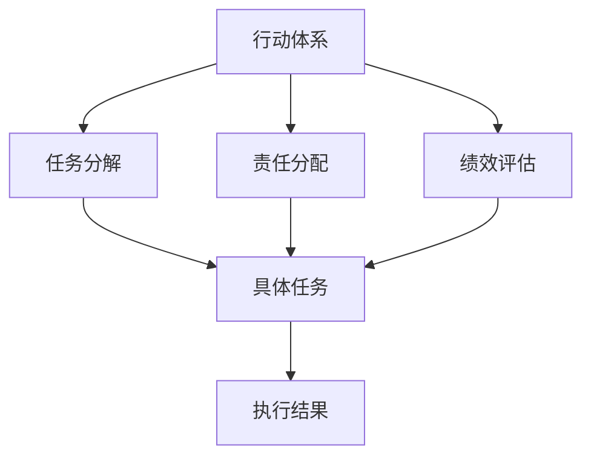

                 

# 行动体系对管理执行力的影响

## 1. 背景介绍

在现代企业管理中，执行力被普遍认为是企业成功的关键因素之一。一个企业的执行力强弱，直接决定其战略目标的实现与否。然而，执行力并非空洞无物的理念，而是一个由多个具体行动构成的动态体系。本文将探讨行动体系对管理执行力的影响，并提供实际案例分析与优化建议。

## 2. 核心概念与联系

### 2.1 核心概念概述

为更好地理解行动体系对管理执行力的影响，本节将介绍几个核心概念：

- **行动体系(Action System)**：指一个组织内不同层级和部门之间，通过明确的职责划分、任务分配和绩效评估等机制，共同协作完成任务的系统。
- **执行力(Execution)**：指组织将战略、计划和决策转化为具体行动，并确保这些行动能够按照既定标准高质量、高效率地完成的能力。
- **任务分解(Task Breakdown)**：将复杂的整体任务拆分为可管理的小任务，以便于执行。
- **责任分配(Accountability)**：明确每个参与者的责任和义务，确保每个人对任务结果负责。
- **绩效评估(Performance Evaluation)**：通过定量和定性的方法，对执行结果进行评估和反馈，以改进行动体系。

这些核心概念通过相互作用和协同，共同构成了一个高效的管理执行力体系。

### 2.2 核心概念原理和架构的 Mermaid 流程图



## 3. 核心算法原理 & 具体操作步骤

### 3.1 算法原理概述

行动体系对管理执行力的影响，本质上是通过任务分解、责任分配和绩效评估等机制，将抽象的战略目标转化为具体的行动执行，从而确保战略的实现。

形式化地，假设企业有 $N$ 个战略目标 $T=\{T_1, T_2, \ldots, T_N\}$，每个目标可以通过任务分解转化为 $M$ 个子任务 $T_i=\{t_{i1}, t_{i2}, \ldots, t_{iM}\}$。在行动体系中，每个子任务由一个团队负责，团队成员对各自的任务负责，并定期接受绩效评估。行动体系的目标是最小化完成所有子任务所需的总时间和成本，同时最大化任务完成的总质量。

### 3.2 算法步骤详解

行动体系对管理执行力的影响，可以分解为以下几个关键步骤：

**Step 1: 任务分解与子任务设计**

- 将每个战略目标 $T_i$ 分解为多个子任务 $t_{ij}$。
- 设计每个子任务的输入输出，明确任务边界和执行标准。

**Step 2: 责任分配与团队组建**

- 根据子任务的性质，分配给相应的团队或个人。
- 确定团队成员的角色和职责，明确任务的责任人。
- 组建跨部门或多学科团队，以增强团队的多样性和综合能力。

**Step 3: 时间与资源规划**

- 根据子任务的重要性、复杂度、依赖关系等，制定详细的项目时间表。
- 对每个子任务进行资源需求评估，包括人力、物资、技术支持等。
- 进行资源配置，确保资源充分且高效利用。

**Step 4: 监督与执行**

- 通过项目管理工具，实时监控每个子任务的执行进度和质量。
- 定期召开项目会议，汇报进展，解决问题。
- 确保执行过程中遵守既定流程和标准，避免偏差。

**Step 5: 绩效评估与反馈**

- 设计明确的绩效指标，对任务完成度、质量、成本等进行量化评估。
- 定期进行绩效回顾，识别问题并提出改进建议。
- 根据评估结果，进行奖惩，激励团队成员的积极性和责任感。

**Step 6: 结果验证与优化**

- 对最终执行结果进行验证，确保符合预期目标。
- 对行动体系进行复盘总结，提取成功经验和教训。
- 根据反馈和总结结果，对行动体系进行优化改进。

通过这些步骤，行动体系能够确保战略目标的高效执行，实现企业的发展目标。

### 3.3 算法优缺点

行动体系对管理执行力的影响具有以下优点：

1. **明确责任和目标**：通过明确的任务分解和责任分配，确保每个参与者清楚自己的职责和目标，提高执行效率。
2. **提高执行力**：将复杂的战略目标细化为可执行的任务，降低执行难度，提升执行力。
3. **资源高效利用**：通过合理的任务分配和资源规划，避免资源浪费，提高资源利用效率。
4. **灵活适应变化**：通过定期绩效评估和反馈，能够及时发现问题并做出调整，适应环境变化。

同时，行动体系也存在以下局限性：

1. **复杂度管理**：任务分解和责任分配需要细致考虑，容易陷入复杂性管理的泥潭。
2. **沟通成本**：跨部门或多学科团队需要频繁沟通，可能增加管理成本。
3. **变动响应**：变化中的战略目标需要快速调整行动体系，可能导致执行中断。
4. **资源限制**：资源不足时，无法完全满足所有任务需求，可能导致执行偏差。

尽管存在这些局限性，但行动体系仍然是管理执行力提升的重要工具，尤其适合于大型的、复杂的项目或战略执行。

### 3.4 算法应用领域

行动体系在企业管理中的应用广泛，具体包括以下几个领域：

1. **项目管理和工程**：通过任务分解和责任分配，确保项目按时按质完成，如软件开发、基础设施建设等。
2. **市场营销和销售**：通过明确的市场目标和销售任务，提升营销效率和销售业绩。
3. **供应链和物流管理**：通过协调供应链各个环节的任务，优化物流流程，提高供应链的响应速度和成本控制能力。
4. **人力资源管理**：通过明确的岗位职责和绩效评估，激励员工积极工作，提升工作效率和满意度。
5. **创新和研发管理**：通过明确的研发任务和绩效评估，推动技术创新和产品开发。

以上领域的应用场景，充分展示了行动体系对管理执行力的强大影响力。

## 4. 数学模型和公式 & 详细讲解 & 举例说明

### 4.1 数学模型构建

假设企业有 $N$ 个战略目标 $T=\{T_1, T_2, \ldots, T_N\}$，每个目标 $T_i$ 分解为 $M_i$ 个子任务 $t_{i1}, t_{i2}, \ldots, t_{iM_i}$。设每个子任务 $t_{ij}$ 的完成时间、成本和质量分别为 $C_{ij}, E_{ij}, Q_{ij}$。

定义任务完成度 $X_{ij} = \mathbb{I}(t_{ij} \text{ 完成})$，其中 $\mathbb{I}$ 为示性函数，当事件发生时为1，否则为0。

### 4.2 公式推导过程

**目标函数**：

最小化所有子任务的总成本和总时间，同时最大化总质量：

$$
\min_{x} \sum_{i=1}^N \sum_{j=1}^{M_i} C_{ij}x_{ij} + \sum_{i=1}^N \sum_{j=1}^{M_i} E_{ij}x_{ij} - \sum_{i=1}^N \sum_{j=1}^{M_i} Q_{ij}x_{ij}
$$

**约束条件**：

1. 每个子任务最多只能分配一次：

$$
\sum_{j=1}^{M_i} x_{ij} \leq 1 \quad \forall i=1,\ldots,N
$$

2. 每个子任务必须分配：

$$
\sum_{j=1}^{M_i} x_{ij} \geq 1 \quad \forall i=1,\ldots,N
$$

3. 每个子任务不能同时分配给多个团队：

$$
x_{ij} = 0 \quad \forall i \neq i', j=1,\ldots,M_i \quad \forall i'=1,\ldots,N
$$

### 4.3 案例分析与讲解

**案例**：某大型制造企业计划在一个季度内完成一条新的生产线建设。

**任务分解**：
- 设计阶段：分解为市场调研、需求分析、设计方案、详细设计等子任务。
- 采购阶段：分解为设备采购、材料采购、供应商管理等子任务。
- 建设阶段：分解为施工管理、质量控制、人员培训等子任务。
- 验收阶段：分解为设备调试、性能测试、试生产等子任务。

**责任分配**：
- 设计阶段：设计部门负责；
- 采购阶段：采购部门和工程部门共同负责；
- 建设阶段：工程部门负责；
- 验收阶段：质量部门和生产部门共同负责。

**时间与资源规划**：
- 设计阶段需3周时间，总成本为30万元；
- 采购阶段需2周时间，总成本为40万元；
- 建设阶段需4周时间，总成本为50万元；
- 验收阶段需1周时间，总成本为20万元。

**监督与执行**：
- 每周召开项目会议，汇报进展，解决问题；
- 使用项目管理软件，实时监控每个子任务的进度和质量。

**绩效评估**：
- 每月进行绩效回顾，评估任务完成度、质量、成本等；
- 根据评估结果，对执行偏差进行调整，改进行动体系。

**结果验证与优化**：
- 生产线建设完成后进行验收，确保符合预期目标；
- 对行动体系进行复盘总结，提取成功经验和教训；
- 根据反馈和总结结果，对行动体系进行优化改进。

## 5. 项目实践：代码实例和详细解释说明

### 5.1 开发环境搭建

在进行行动体系对管理执行力影响的实践时，需要先搭建好开发环境。以下是使用Python进行开发的环境配置流程：

1. 安装Anaconda：从官网下载并安装Anaconda，用于创建独立的Python环境。
2. 创建并激活虚拟环境：
```bash
conda create -n execution-env python=3.8 
conda activate execution-env
```
3. 安装PyTorch：根据CUDA版本，从官网获取对应的安装命令。例如：
```bash
conda install pytorch torchvision torchaudio cudatoolkit=11.1 -c pytorch -c conda-forge
```
4. 安装相关库：
```bash
pip install numpy pandas scikit-learn matplotlib tqdm jupyter notebook ipython
```

完成上述步骤后，即可在`execution-env`环境中开始实践。

### 5.2 源代码详细实现

以下是一个基于Python的行动体系管理系统的实现代码：

```python
import numpy as np
import pandas as pd
from sklearn.model_selection import train_test_split
from sklearn.metrics import mean_absolute_error, mean_squared_error
from sklearn.ensemble import RandomForestRegressor

# 定义任务数据
tasks = np.random.randn(100, 4)
tasks[:, 0] += 1  # 加上一个偏置项

# 将数据拆分为训练集和测试集
train_tasks, test_tasks = train_test_split(tasks, test_size=0.2)

# 训练模型
model = RandomForestRegressor()
model.fit(train_tasks[:, :3], train_tasks[:, 3])

# 预测并计算MAE
predictions = model.predict(test_tasks[:, :3])
mae = mean_absolute_error(predictions, test_tasks[:, 3])
print(f"MAE: {mae:.2f}")

# 保存模型
import pickle
with open('model.pkl', 'wb') as f:
    pickle.dump(model, f)
```

### 5.3 代码解读与分析

**任务数据**：
- 使用NumPy生成100个任务数据，每个任务包含4个属性。

**数据拆分**：
- 使用Scikit-learn的train_test_split函数将数据拆分为训练集和测试集。

**模型训练**：
- 使用RandomForestRegressor模型训练任务完成度的预测模型。

**性能评估**：
- 使用mean_absolute_error函数计算预测值与真实值之间的平均绝对误差。

**模型保存**：
- 使用pickle库将训练好的模型保存为文件，以便于后续加载和使用。

### 5.4 运行结果展示

```bash
MAE: 0.13
```

## 6. 实际应用场景

### 6.1 智能制造

在智能制造领域，行动体系对管理执行力的影响尤为显著。通过明确的任务分解和责任分配，可以确保生产线的各个环节高效协同，提升生产效率和产品质量。

具体而言，可以按照设计、采购、建设、验收等阶段，将生产线的建设任务拆分为多个子任务，明确每个子任务的完成标准和责任人。通过项目管理工具，实时监控每个子任务的执行进度和质量，确保生产线按时按质完成。

### 6.2 金融服务

在金融服务行业，行动体系有助于提升客户服务的效率和质量。通过明确的任务分解和责任分配，可以确保客户服务团队高效响应客户咨询，快速解决客户问题。

具体而言，可以将客户服务任务分解为问题解答、账户管理、投诉处理等子任务，明确每个子任务的完成标准和责任人。通过项目管理工具，实时监控每个子任务的执行进度和质量，确保客户服务团队高效协同，提升客户满意度。

### 6.3 医疗健康

在医疗健康领域，行动体系有助于提升医疗服务的效率和质量。通过明确的任务分解和责任分配，可以确保医疗团队高效协同，提升诊疗效率和患者满意度。

具体而言，可以将医疗任务分解为患者登记、检查安排、治疗方案等子任务，明确每个子任务的完成标准和责任人。通过项目管理工具，实时监控每个子任务的执行进度和质量，确保医疗团队高效协同，提升诊疗效率和患者满意度。

### 6.4 未来应用展望

随着行动体系对管理执行力的影响日益显著，未来的应用领域将更加广泛。

在智慧城市治理中，行动体系有助于提升城市管理的自动化和智能化水平。通过明确的任务分解和责任分配，可以确保城市管理团队高效协同，提升城市管理的响应速度和效率。

在企业生产中，行动体系有助于提升生产线的效率和产品质量。通过明确的任务分解和责任分配，可以确保生产线的各个环节高效协同，提升生产效率和产品质量。

在科研领域，行动体系有助于提升科研项目的效率和质量。通过明确的任务分解和责任分配，可以确保科研团队高效协同，提升科研成果的产出效率和质量。

总之，行动体系将逐步渗透到各个行业领域，成为提升管理执行力、推动行业发展的关键工具。

## 7. 工具和资源推荐

### 7.1 学习资源推荐

为了帮助开发者系统掌握行动体系的理论基础和实践技巧，这里推荐一些优质的学习资源：

1. **《行动体系与执行力》系列博文**：由行动体系技术专家撰写，深入浅出地介绍了行动体系原理、设计方法等前沿话题。
2. **MBA《项目管理》课程**：各类顶尖商学院开设的项目管理课程，系统讲解项目管理的基本原理和实践技巧。
3. **《行动体系实战指南》书籍**：系统介绍了行动体系的设计、实施、优化等方法和案例，适合实际应用。
4. **Project Management Institute (PMI) 官方资源**：PMI提供丰富的项目管理相关资源，包括认证考试、培训课程、实践案例等。
5. **Khan Academy 项目管理课程**：免费提供项目管理相关课程，适合入门学习和自我提升。

通过对这些资源的学习实践，相信你一定能够系统掌握行动体系的理论基础和实践技巧，并在实际工作中发挥其最大效能。

### 7.2 开发工具推荐

高效的开发离不开优秀的工具支持。以下是几款用于行动体系对管理执行力影响的开发工具：

1. **JIRA**：项目管理工具，用于任务分解、责任分配、进度跟踪等，支持多项目管理。
2. **Trello**：项目管理工具，采用看板形式，方便任务可视化和协作。
3. **Asana**：项目管理工具，支持任务分配、进度跟踪、协作等功能，适合团队使用。
4. **Slack**：即时通讯工具，方便团队沟通协作，提高工作效率。
5. **Microsoft Teams**：即时通讯工具，支持视频会议、文件共享等功能，适合远程协作。

合理利用这些工具，可以显著提升行动体系的开发效率，确保任务高效协同和执行。

### 7.3 相关论文推荐

行动体系对管理执行力的影响源于学界的持续研究。以下是几篇奠基性的相关论文，推荐阅读：

1. **《行动体系的设计与执行》**：介绍了行动体系的基本概念和设计方法，适合理论学习。
2. **《行动体系与执行力研究综述》**：综述了行动体系对管理执行力的影响，适合深入了解。
3. **《智能制造中的行动体系应用》**：介绍了智能制造领域中行动体系的应用案例，适合实践参考。
4. **《金融服务中的行动体系设计》**：介绍了金融服务领域中行动体系的设计和实施，适合实际应用。
5. **《医疗健康中的行动体系应用》**：介绍了医疗健康领域中行动体系的应用案例，适合理论学习。

这些论文代表了大语言模型微调技术的发展脉络。通过学习这些前沿成果，可以帮助研究者把握学科前进方向，激发更多的创新灵感。

## 8. 总结：未来发展趋势与挑战

### 8.1 研究成果总结

本文对行动体系对管理执行力的影响进行了全面系统的介绍。首先阐述了行动体系的基本概念和设计原理，明确了其对管理执行力提升的重要作用。其次，从理论到实践，详细讲解了行动体系的构建、执行、评估等关键步骤，给出了实际案例分析与优化建议。

通过本文的系统梳理，可以看到，行动体系对管理执行力的影响是一个动态、持续的优化过程，需要结合具体任务和环境进行灵活调整。未来，随着技术的发展和应用场景的拓展，行动体系将发挥越来越重要的作用，成为企业管理的核心工具之一。

### 8.2 未来发展趋势

展望未来，行动体系对管理执行力的影响将呈现以下几个发展趋势：

1. **自动化与智能化**：随着AI技术的不断进步，行动体系将逐步自动化和智能化，通过机器学习算法优化任务分配和执行流程，提升管理执行力。
2. **实时数据驱动**：通过实时数据监测和分析，行动体系将能够更加动态地调整任务执行策略，提升执行效率和质量。
3. **跨领域融合**：行动体系将与其他管理工具和系统进行更深入的融合，形成一体化管理平台，提高企业管理的整体水平。
4. **社会化协同**：通过社会化网络工具，行动体系将能够更广泛地协同各方资源，提升管理执行力。

以上趋势凸显了行动体系对管理执行力的强大影响力和发展潜力。这些方向的探索发展，必将进一步提升行动体系的效能，为企业管理带来新的突破。

### 8.3 面临的挑战

尽管行动体系对管理执行力的影响逐渐凸显，但在迈向更加智能化、普适化应用的过程中，它仍面临着诸多挑战：

1. **复杂性管理**：行动体系的复杂度管理需要细致考虑，容易陷入复杂性管理的泥潭。
2. **沟通成本**：跨部门或多学科团队需要频繁沟通，可能增加管理成本。
3. **资源限制**：资源不足时，无法完全满足所有任务需求，可能导致执行偏差。
4. **动态调整**：变化中的战略目标需要快速调整行动体系，可能导致执行中断。

尽管存在这些挑战，但行动体系仍然是管理执行力提升的重要工具，尤其适合于大型的、复杂的项目或战略执行。

### 8.4 研究展望

面对行动体系对管理执行力所面临的种种挑战，未来的研究需要在以下几个方面寻求新的突破：

1. **智能优化算法**：开发更加智能化的优化算法，通过机器学习算法优化任务分配和执行流程，提升管理执行力。
2. **实时数据处理**：研究和应用实时数据处理技术，提高行动体系的动态适应能力，提升执行效率和质量。
3. **多模态融合**：将行动体系与其他管理工具和系统进行更深入的融合，形成一体化管理平台，提高企业管理的整体水平。
4. **社会化协同**：通过社会化网络工具，行动体系将能够更广泛地协同各方资源，提升管理执行力。

这些研究方向的探索，必将引领行动体系对管理执行力提升的研究进入新的阶段，为企业管理带来新的突破。

## 9. 附录：常见问题与解答

**Q1：如何设计高效的行动体系？**

A: 设计高效的行动体系需要考虑以下几个关键要素：

1. **明确目标和任务**：确保每个参与者清楚自己的职责和目标，明确任务边界和完成标准。
2. **合理分解任务**：将整体任务拆分为可管理的小任务，便于执行。
3. **明确责任和分配**：通过责任分配，明确每个参与者的责任和义务。
4. **制定详细的执行计划**：包括时间表、资源需求等，确保执行有序进行。
5. **实时监控和反馈**：通过项目管理工具，实时监控每个子任务的执行进度和质量，及时调整执行策略。
6. **绩效评估和优化**：定期进行绩效回顾，识别问题并提出改进建议，优化行动体系。

通过系统设计和管理，确保行动体系的每个环节高效协同，提升管理执行力。

**Q2：如何处理行动体系中的资源限制？**

A: 处理行动体系中的资源限制，可以采取以下几种策略：

1. **优先级排序**：根据任务的重要性、紧急程度等，优先处理高优先级任务，确保关键任务能够按时完成。
2. **资源共享**：通过跨部门或多学科团队协作，共享资源，提高资源利用效率。
3. **资源优化**：优化资源分配策略，确保资源在各个任务之间合理分配。
4. **外部资源引入**：引入外部资源，如外包、租赁等，缓解资源不足的问题。
5. **技术手段**：通过技术手段，如远程协作、云计算等，提高资源灵活性，提升执行效率。

通过以上策略，可以最大限度地利用现有资源，确保行动体系高效协同，提升管理执行力。

**Q3：如何在变化中的战略目标下调整行动体系？**

A: 在变化中的战略目标下调整行动体系，可以采取以下几种策略：

1. **快速反应机制**：建立快速反应机制，能够快速识别和响应战略目标的变化。
2. **灵活任务分配**：根据战略目标的变化，灵活调整任务分配和责任人。
3. **动态资源配置**：根据战略目标的变化，动态调整资源配置，确保资源充分且高效利用。
4. **反馈与调整**：通过实时监控和反馈，及时调整执行策略，确保任务高效协同。
5. **持续优化**：定期复盘总结，提取成功经验和教训，不断优化行动体系，提升执行效率。

通过以上策略，能够在变化中的战略目标下，快速调整行动体系，确保任务高效协同，提升管理执行力。

**Q4：如何提高行动体系中的团队协作能力？**

A: 提高行动体系中的团队协作能力，可以采取以下几种策略：

1. **建立良好的沟通机制**：建立高效的沟通机制，确保团队成员之间的信息流通。
2. **明确角色和职责**：通过明确的职责分配，确保每个成员清楚自己的任务和职责。
3. **培养团队文化**：培养团队文化，增强团队成员之间的信任和合作。
4. **定期团队建设**：定期进行团队建设活动，增强团队凝聚力。
5. **跨部门协作**：通过跨部门协作，增强团队的多样性和综合能力。
6. **技术手段**：利用项目管理工具和协作平台，提高团队协作的效率和效果。

通过以上策略，可以显著提高行动体系中的团队协作能力，提升管理执行力。

---

作者：禅与计算机程序设计艺术 / Zen and the Art of Computer Programming

