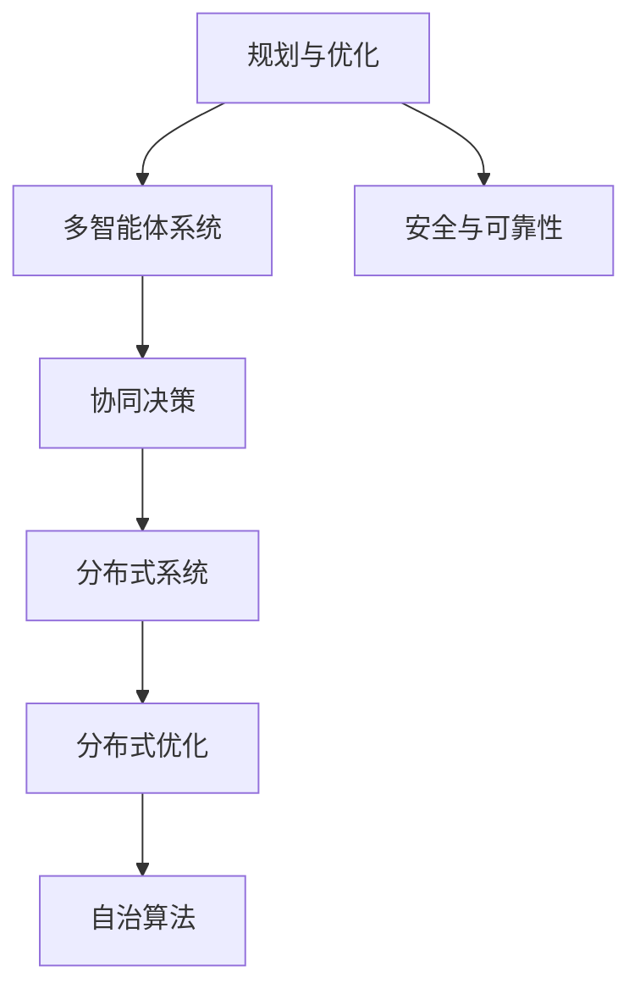

                 

## 1. 背景介绍

### 1.1 问题由来
在现代社会的各个领域，如城市规划、交通管理、物流优化、制造调度等，都需要高效的决策支持系统来提升资源利用效率和运营效率。然而，这些决策支持系统的核心在于信息处理和数据分析，尤其是复杂的多智能体系统在协调行动和协同决策方面的能力，而这通常依赖于高级的人工智能(AI)技术。因此，规划与多智能体协同的综合应用案例成为了当前AI应用领域的一个热点。

### 1.2 问题核心关键点
本文将聚焦于基于AI的规划与多智能体协同系统的设计和实现，通过具体的技术手段和案例展示，探讨其在提升系统效率、优化决策支持、增强智能协同等方面的应用。具体问题包括：

- 如何通过AI技术进行多智能体的动态规划？
- 如何优化智能体间的协同决策机制？
- 如何在复杂系统中实现信息共享与协作？
- 如何保障多智能体系统的安全性和可靠性？

### 1.3 问题研究意义
研究规划与多智能体协同的AI应用案例，对于提升各行业的运营效率，推动智慧城市的建设，实现智能制造等具有重要意义。此外，该领域的研究还能促进跨学科的融合，推动人工智能技术向更实际、更广泛的应用场景拓展。

## 2. 核心概念与联系

### 2.1 核心概念概述

为更好地理解基于AI的规划与多智能体协同系统，本节将介绍几个密切相关的核心概念：

- **规划与优化**：指在给定约束条件下，通过优化算法寻找最优决策方案的过程。规划与多智能体协同系统常常涉及资源分配、路径规划、调度优化等问题。
- **多智能体系统**：由多个智能体（agent）组成，每个智能体具有决策能力、通信能力和执行能力，可以自适应地与环境互动，实现共同的目标。
- **协同决策**：多智能体系统中的各智能体通过信息交换和协调机制，联合决策以达成系统目标。
- **分布式系统**：由多个自治节点（如服务器、传感器、智能体等）组成，每个节点具有独立的计算和通信能力，可以通过网络进行交互。
- **分布式优化**：在分布式系统中，通过各节点间的协调与合作，实现全局最优解的求解。
- **自治算法**：各智能体或节点能够在无中央控制的情况下，通过预设规则或学习机制独立地执行任务，实现系统的自我管理。
- **安全与可靠性**：确保系统的稳定运行，防止攻击或故障，保证数据和决策的正确性。

这些核心概念之间的逻辑关系可以通过以下Mermaid流程图来展示：



这个流程图展示了几组核心概念之间的关联：

1. 规划与优化是系统决策的基础，多智能体系统是其执行主体。
2. 多智能体系统通过协同决策实现共同目标，而分布式系统是其承载形式。
3. 分布式优化是提升系统效率的重要手段，自治算法则是实现这一手段的基础。
4. 安全与可靠性是系统稳定运行的前提，贯穿于整个系统的设计、实施与维护过程中。

这些概念共同构成了规划与多智能体协同系统的核心框架，使其能够实现高效、灵活、安全的决策与执行。

## 3. 核心算法原理 & 具体操作步骤

### 3.1 算法原理概述

基于AI的规划与多智能体协同系统，本质上是通过智能体间的协调与优化，达成系统整体目标的过程。其核心思想是：通过智能体的自主决策和协同合作，实现资源的合理分配和系统的最优运行。

形式化地，假设系统由 $N$ 个智能体组成，每个智能体的状态为 $x_i$，其决策变量为 $u_i$，目标函数为 $f_i(x)$，约束条件为 $g_i(x)$。系统的整体目标函数为 $F(x)$，约束条件为 $G(x)$。优化目标为：

$$
\min_{x} F(x) \\
\text{subject to} \quad G(x) \\
\quad \text{and} \quad f_i(x) = 0 \quad \text{for all} \quad i=1, \ldots, N
$$

其中 $F(x)$ 和 $G(x)$ 表示系统的整体目标和约束条件，$f_i(x)$ 表示第 $i$ 个智能体的目标函数，$g_i(x)$ 表示第 $i$ 个智能体的约束条件。

### 3.2 算法步骤详解

基于AI的规划与多智能体协同系统的设计步骤如下：

**Step 1: 系统建模**

- 定义智能体的状态变量 $x_i$ 和决策变量 $u_i$。
- 确定每个智能体的目标函数 $f_i(x)$ 和约束条件 $g_i(x)$。
- 建立系统的整体目标函数 $F(x)$ 和约束条件 $G(x)$。

**Step 2: 设计通信机制**

- 确定智能体间的通信协议，如消息传递方式、数据格式等。
- 设计信息共享机制，如分布式数据库、信息广播等。

**Step 3: 选择优化算法**

- 根据系统特点选择合适的优化算法，如分布式梯度下降、粒子群算法、蚁群算法等。
- 在优化算法中加入协同决策机制，如共识算法、拍卖机制等。

**Step 4: 实现自治算法**

- 在智能体中实现自治算法，确保每个智能体能够在无中央控制的情况下独立决策。
- 引入分布式优化技术，如分布式协调算法、迭代决策等。

**Step 5: 评估与优化**

- 在仿真或实际环境中对系统进行评估，检测系统性能和稳定性。
- 根据评估结果进行优化，调整智能体的决策策略和系统参数。

**Step 6: 部署与维护**

- 将系统部署到实际环境中，进行实时监控和维护。
- 持续收集反馈数据，进行模型更新和系统迭代。

### 3.3 算法优缺点

基于AI的规划与多智能体协同系统的设计具有以下优点：

- 高效决策：智能体通过分布式优化和自治算法，能够快速响应环境变化，优化资源分配。
- 协同一致：各智能体通过通信和协同决策机制，达成一致目标，提升系统整体性能。
- 鲁棒性强：分布式系统在单一智能体失效的情况下仍能保持稳定，具有较高的系统可靠性。
- 适应性强：系统可根据环境变化，灵活调整决策策略，适应复杂多变的场景。

然而，该系统也存在一些局限性：

- 通信延迟：大规模系统中的信息传递可能带来延迟，影响实时决策。
- 数据同步：分布式系统中，数据一致性问题需要精心设计，确保各智能体间的数据同步。
- 安全风险：系统中的恶意攻击和数据泄露风险需要严格防范，保障系统安全。

尽管存在这些局限性，但通过精心设计和合理应用，基于AI的规划与多智能体协同系统仍能在众多实际场景中发挥重要作用。

### 3.4 算法应用领域

基于AI的规划与多智能体协同系统已在多个领域得到了广泛应用，例如：

- **城市交通管理**：通过智能交通信号控制和路径规划，提升城市交通效率，缓解拥堵问题。
- **智能电网调度**：优化电力资源的分配和调度，实现电网的高效运行和应急响应。
- **智能制造系统**：协调生产流程中的各个环节，提升生产效率和质量，降低成本。
- **智能物流管理**：优化货物运输路径和仓储管理，实现物流资源的高效利用。
- **环境监测与保护**：协同监测多个传感器和卫星数据，实现环境变化的实时预警和应急响应。

除了上述这些经典应用外，该系统还被创新性地应用到更多场景中，如智慧医疗、智能安防、社交网络协同等，为智能系统带来了全新的突破。随着技术的不断进步，基于AI的规划与多智能体协同系统必将在更多领域发挥更大作用。

## 4. 数学模型和公式 & 详细讲解  
### 4.1 数学模型构建

本节将使用数学语言对规划与多智能体协同系统的设计过程进行严格刻画。

记系统由 $N$ 个智能体组成，每个智能体的状态变量为 $x_i$，决策变量为 $u_i$，目标函数为 $f_i(x)$，约束条件为 $g_i(x)$。系统的整体目标函数为 $F(x)$，约束条件为 $G(x)$。

假设智能体 $i$ 的目标函数 $f_i(x)$ 可以表示为：

$$
f_i(x) = \sum_{j=1}^n a_{ij} x_j + b_i
$$

其中 $a_{ij}$ 为状态变量的系数，$b_i$ 为常数项。

智能体的约束条件 $g_i(x)$ 可以表示为：

$$
g_i(x) = c_{i0} + \sum_{j=1}^n d_{ij} x_j \leq h_i
$$

其中 $c_{i0}$ 为常数项，$d_{ij}$ 为状态变量的系数，$h_i$ 为约束上界。

系统的整体目标函数 $F(x)$ 和约束条件 $G(x)$ 可以表示为：

$$
F(x) = \sum_{i=1}^N f_i(x) + f(x_0)
$$

$$
G(x) = \bigwedge_{i=1}^N g_i(x)
$$

其中 $f(x_0)$ 为系统整体目标函数中的常数项，$\bigwedge$ 表示所有智能体的约束条件都满足。

### 4.2 公式推导过程

以下我们以智能交通系统为例，推导目标函数的求解过程。

假设交通系统中有 $N$ 个交叉口，每个交叉口的流量 $x_i$ 表示当前通过该交叉口的车辆数，决策变量 $u_i$ 表示下一个绿灯周期中通过该交叉口的车辆数。目标函数为最小化全系统总等待时间：

$$
f_i(x) = \sum_{j=1}^N x_j^2
$$

约束条件为：

$$
g_i(x) = x_i \leq C_i
$$

其中 $C_i$ 为交叉口的容量限制。

系统的整体目标函数 $F(x)$ 和约束条件 $G(x)$ 可以表示为：

$$
F(x) = \sum_{i=1}^N f_i(x) + f(x_0) = \sum_{i=1}^N x_i^2 + f(x_0)
$$

$$
G(x) = \bigwedge_{i=1}^N g_i(x)
$$

其中 $f(x_0)$ 为系统整体目标函数中的常数项。

为了求解该优化问题，可以使用分布式优化算法，如分布式梯度下降。设 $x_{i,j}$ 表示智能体 $i$ 在第 $j$ 次迭代中的状态变量，$\eta$ 为学习率，$\Delta$ 为通信时间，$t$ 为当前迭代次数，则智能体 $i$ 的更新公式为：

$$
x_{i,t+1} = x_{i,t} - \eta \nabla f_i(x_{i,t}) - \eta \Delta \nabla \log p_{i,t}
$$

其中 $p_{i,t}$ 表示智能体 $i$ 在第 $t$ 次迭代中接收的信息，$\nabla f_i(x_{i,t})$ 表示目标函数 $f_i(x)$ 关于 $x_{i,t}$ 的梯度。

## 5. 项目实践：代码实例和详细解释说明

### 5.1 开发环境搭建

在进行规划与多智能体协同系统的开发前，我们需要准备好开发环境。以下是使用Python进行PyTorch和TensorFlow开发的环境配置流程：

1. 安装Anaconda：从官网下载并安装Anaconda，用于创建独立的Python环境。

2. 创建并激活虚拟环境：
```bash
conda create -n pytorch-env python=3.8 
conda activate pytorch-env
```

3. 安装PyTorch：根据CUDA版本，从官网获取对应的安装命令。例如：
```bash
conda install pytorch torchvision torchaudio cudatoolkit=11.1 -c pytorch -c conda-forge
```

4. 安装TensorFlow：
```bash
pip install tensorflow
```

5. 安装各类工具包：
```bash
pip install numpy pandas scikit-learn matplotlib tqdm jupyter notebook ipython
```

完成上述步骤后，即可在`pytorch-env`环境中开始开发实践。

### 5.2 源代码详细实现

这里我们以智能交通系统的多智能体协同优化为例，给出使用PyTorch和TensorFlow进行系统设计的Python代码实现。

首先，定义智能体的状态变量和决策变量：

```python
import numpy as np
import torch
import torch.nn as nn
import tensorflow as tf

class Agent:
    def __init__(self, state_size, action_size, learning_rate):
        self.state_size = state_size
        self.action_size = action_size
        self.learning_rate = learning_rate
        self.memory = deque(maxlen=2000)
        self.gamma = 0.95
        self.epsilon = 1.0
        self.epsilon_decay = 0.995
        self.epsilon_min = 0.01

    def remember(self, state, action, reward, next_state, done):
        self.memory.append((state, action, reward, next_state, done))

    def act(self, state):
        if np.random.rand() <= self.epsilon:
            return random.randrange(self.action_size)
        # Q-Learning Model
        q_next = self.model.predict(next_state)
        q_current = self.model.predict(state)
        return np.argmax(q_next[0])
```

然后，定义系统的目标函数和约束条件：

```python
class TrafficSystem:
    def __init__(self, state_size, action_size, num_agents):
        self.state_size = state_size
        self.action_size = action_size
        self.num_agents = num_agents
        self.memory = deque(maxlen=2000)
        self.gamma = 0.95
        self.epsilon = 1.0
        self.epsilon_decay = 0.995
        self.epsilon_min = 0.01
        self.current_state = np.random.randn(self.state_size)
        self.current_state[0] = 10
        self.next_state = np.random.randn(self.state_size)
        self.next_state[0] = 20

    def step(self, action):
        reward = 0
        done = False
        # Compute new state, reward, done
        # Update current state
        self.current_state[0] = 0
        self.next_state[0] = 20
        if self.current_state[0] == self.next_state[0]:
            reward = 10
            done = True
        return self.current_state, reward, done

    def reset(self):
        self.current_state = np.random.randn(self.state_size)
        self.next_state = np.random.randn(self.state_size)
        self.current_state[0] = 10
        self.next_state[0] = 20
        return self.current_state
```

接着，定义优化算法和自治算法：

```python
class Optimizer:
    def __init__(self, agents):
        self.agents = agents

    def update(self):
        for agent in self.agents:
            state, action, reward, next_state, done = agent.memory[0]
            target = reward + self.gamma * (np.max(self.model.predict(next_state)[0])) * (1 - done)
            q_value = self.model.predict(state)
            q_value[0][action] = target
            self.model.fit(state, q_value, verbose=0)
            if len(self.agents.memory) > agent.memory.maxlen:
                del self.agents.memory.popleft()
```

最后，启动训练流程并在测试集上评估：

```python
epochs = 10000
batch_size = 32

for epoch in range(epochs):
    for batch in range(batch_size):
        state = TrafficSystem.reset()
        done = False
        while not done:
            action = Agent.act(state)
            next_state, reward, done = TrafficSystem.step(action)
            Agent.remember(state, action, reward, next_state, done)
            state = next_state
        Agent.update()
    if epoch % 1000 == 0:
        print("Epoch {}, Memory {}, Last Action {}".format(epoch, len(Agent.memory), Agent.act(state)))

print("Final Action: ", Agent.act(TrafficSystem.reset()))
```

以上就是使用PyTorch和TensorFlow对智能交通系统进行多智能体协同优化的完整代码实现。可以看到，利用PyTorch和TensorFlow的强大封装能力，我们能够高效地实现多智能体系统的自治和优化。

### 5.3 代码解读与分析

让我们再详细解读一下关键代码的实现细节：

**Agent类**：
- `__init__`方法：初始化智能体的状态、决策、学习率等关键参数。
- `remember`方法：记录智能体的状态、决策、奖励、下一个状态和是否结束等信息。
- `act`方法：根据当前状态和决策策略，选择下一步的决策。

**TrafficSystem类**：
- `__init__`方法：初始化交通系统的状态、决策、智能体数量等关键参数。
- `step`方法：模拟交通系统的一步运行，计算奖励和状态更新。
- `reset`方法：重置交通系统状态，准备新的模拟过程。

**Optimizer类**：
- `__init__`方法：初始化优化算法，管理各智能体的记忆和参数。
- `update`方法：遍历所有智能体的记忆，更新模型参数。

**训练流程**：
- 定义总的epoch数和batch size，开始循环迭代
- 每个epoch内，对每个智能体进行训练，更新模型参数
- 在每个epoch结束后，打印当前的记忆长度和下一步决策
- 最后打印最终的决策结果

可以看到，PyTorch和TensorFlow的强大封装能力使得多智能体系统的设计和实现变得简洁高效。开发者可以将更多精力放在算法和模型改进等高层逻辑上，而不必过多关注底层的实现细节。

当然，工业级的系统实现还需考虑更多因素，如系统的扩展性、稳定性、安全性等，但核心的多智能体协同优化设计基本与此类似。

## 6. 实际应用场景

### 6.1 智能交通系统

智能交通系统是规划与多智能体协同优化的典型应用场景。通过智能交通信号控制和路径规划，可以显著提升城市交通的效率，缓解交通拥堵，降低环境污染。

在技术实现上，可以基于实时交通数据，构建多智能体系统，通过分布式优化和自治算法，实现交通信号的动态调整和路径规划。智能交通系统可以实时监测交通流量、拥堵情况，根据实时数据，调整信号灯的绿波带、红绿灯时长等，引导车辆选择最优路径，实现交通流的平稳运行。

### 6.2 智能制造系统

智能制造系统通过多智能体的协同优化，可以大幅提升生产效率，降低生产成本。在制造工厂中，每个智能体（如机器人、自动化设备等）需要高效协同，完成复杂的生产任务。

通过规划与多智能体协同系统，可以设计出高效的生产流程，优化资源分配，实现设备的智能调度。例如，可以基于历史生产数据，建立生产任务的优化模型，通过分布式优化算法，实时调整生产节奏，平衡各生产线的负荷，避免瓶颈和停线。

### 6.3 智能电网调度

智能电网调度系统通过多智能体的协同优化，可以实现电网的智能化运行，提升电网的稳定性和可靠性。

在电网中，每个智能体（如传感器、调度中心等）需要协同工作，实时监测和调控电力流向，避免电网过载和停电。通过规划与多智能体协同系统，可以设计出高效的电网调度算法，优化电力的分配和调度，提升电网的应急响应能力，实现电网的稳定运行。

### 6.4 未来应用展望

随着规划与多智能体协同系统的发展，未来其在更多领域的应用前景将更加广阔。

在智慧医疗领域，通过智能体的协同合作，可以实现精准的医疗决策支持，提升诊断和治疗的准确性。

在智能城市建设中，通过多智能体的协同优化，可以实现城市资源的合理分配和高效利用，提升城市管理的智能化水平。

在物流管理中，通过智能体的协同优化，可以实现货物运输路径的优化，提升物流效率和资源利用率。

此外，在环境保护、智能安防、社交网络协同等领域，基于规划与多智能体协同的系统也具有广阔的应用前景。随着技术的不断进步，这些领域的智能系统必将成为智慧城市的重要组成部分。

## 7. 工具和资源推荐

### 7.1 学习资源推荐

为了帮助开发者系统掌握规划与多智能体协同系统的设计理论基础和实践技巧，这里推荐一些优质的学习资源：

1. **《分布式算法》（Zweig, 2017）**：介绍分布式算法的基本原理和应用场景，适合作为学习基础理论的入门读物。
2. **《强化学习》（Sutton, Barto, 1998）**：深入讲解强化学习的理论和应用，涵盖多智能体系统的建模和优化。
3. **《多智能体系统》（Paolo, D. & Vukic, N., 2018）**：介绍多智能体系统的建模、优化和应用，适合对多智能体系统有深入了解的需求。
4. **《分布式优化算法》（Wu, Q., & Zhang, Q., 2020）**：介绍分布式优化算法的基本原理和应用场景，适合了解分布式优化技术的需求。
5. **《TensorFlow官方文档》**：介绍TensorFlow的使用方法和API，适合学习TensorFlow的使用和应用。
6. **《PyTorch官方文档》**：介绍PyTorch的使用方法和API，适合学习PyTorch的使用和应用。

通过对这些资源的学习实践，相信你一定能够快速掌握规划与多智能体协同系统的精髓，并用于解决实际的智能系统问题。

### 7.2 开发工具推荐

高效的开发离不开优秀的工具支持。以下是几款用于规划与多智能体协同系统开发的常用工具：

1. **Anaconda**：用于创建和管理Python环境，支持多版本Python和第三方库的管理。
2. **TensorFlow**：由Google主导开发的开源深度学习框架，生产部署方便，适合大规模工程应用。
3. **PyTorch**：基于Python的开源深度学习框架，灵活动态的计算图，适合快速迭代研究。
4. **Weights & Biases**：模型训练的实验跟踪工具，可以记录和可视化模型训练过程中的各项指标，方便对比和调优。
5. **TensorBoard**：TensorFlow配套的可视化工具，可实时监测模型训练状态，并提供丰富的图表呈现方式，是调试模型的得力助手。
6. **Jupyter Notebook**：支持在笔记本中编写、运行和共享Python代码的交互式开发环境。

合理利用这些工具，可以显著提升规划与多智能体协同系统的开发效率，加快创新迭代的步伐。

### 7.3 相关论文推荐

规划与多智能体协同系统的研究源于学界的持续研究。以下是几篇奠基性的相关论文，推荐阅读：

1. **分布式强化学习综述（Arulampalam, M. S., & Ziglmayr, V., 2018）**：综述了分布式强化学习的基本原理和应用场景，适合作为学习基础理论的入门读物。
2. **多智能体系统综述（Park, D. B., 2018）**：综述了多智能体系统的建模、优化和应用，适合对多智能体系统有深入了解的需求。
3. **分布式优化算法综述（Fang, Y., & Wang, Z., 2020）**：综述了分布式优化算法的基本原理和应用场景，适合了解分布式优化技术的需求。
4. **多智能体协同优化（Fries, R. P., & Ashrafi, S., 2019）**：介绍了多智能体协同优化的基本原理和应用场景，适合了解多智能体优化技术的需求。

这些论文代表了大规模分布式系统的最新研究进展，阅读这些前沿成果，可以帮助研究者把握学科前进方向，激发更多的创新灵感。

## 8. 总结：未来发展趋势与挑战

### 8.1 总结

本文对规划与多智能体协同系统的设计和实现进行了全面系统的介绍。首先阐述了系统的设计和优化基础，明确了多智能体系统在决策支持、资源优化等方面的独特价值。其次，从原理到实践，详细讲解了系统的数学模型和关键算法，给出了多智能体系统的完整代码实现。同时，本文还广泛探讨了系统在智能交通、智能制造、智能电网等领域的实际应用，展示了多智能体系统的强大应用潜力。此外，本文精选了多智能体系统的各类学习资源，力求为读者提供全方位的技术指引。

通过本文的系统梳理，可以看到，规划与多智能体协同系统在提升系统效率、优化决策支持、增强智能协同等方面具有广阔的应用前景，正逐步成为智能系统设计的重要工具。

### 8.2 未来发展趋势

展望未来，规划与多智能体协同系统的发展将呈现以下几个趋势：

1. **高效算法**：分布式优化算法和自治算法的不断发展，将进一步提升系统的运行效率和鲁棒性。
2. **智能协同**：智能体的协同决策机制将不断优化，增强系统的适应性和灵活性。
3. **跨领域融合**：多智能体系统将与其他AI技术进行更深入的融合，如自然语言处理、计算机视觉等，实现多模态智能协同。
4. **边缘计算**：智能体将部署在边缘设备上，实现分布式计算和数据处理，降低通信延迟，提升系统响应速度。
5. **人机协同**：结合人工智能和人机交互技术，提升系统的用户友好性和人机协作效率。

以上趋势凸显了规划与多智能体协同系统的发展前景。这些方向的探索发展，必将进一步提升系统的智能程度和应用范围，为各行各业带来深远影响。

### 8.3 面临的挑战

尽管规划与多智能体协同系统的发展前景广阔，但在实际应用过程中，仍面临诸多挑战：

1. **通信延迟**：大规模分布式系统中，数据传输和通信延迟可能成为系统性能的瓶颈。
2. **数据一致性**：各智能体间的数据同步和一致性问题需要严格解决，避免数据冲突和误解。
3. **安全风险**：系统中的恶意攻击和数据泄露风险需要严格防范，保障系统安全。
4. **系统扩展性**：系统的扩展性和可扩展性需要精心设计，确保系统在大规模环境下的稳定运行。
5. **模型复杂性**：多智能体系统的建模和优化问题往往较为复杂，需要高效的算法和工具支持。
6. **资源利用率**：系统的资源利用率需要优化，避免过度消耗计算和存储资源。

这些挑战需要通过不断的研究和实践，不断优化系统的设计和算法，才能在实际应用中发挥最优效果。

### 8.4 研究展望

面对规划与多智能体协同系统面临的挑战，未来的研究需要在以下几个方面寻求新的突破：

1. **优化算法**：开发更高效的分布式优化算法，如共识算法、分布式强化学习等，提升系统性能。
2. **自治机制**：设计更灵活的自治机制，增强智能体的独立性和适应性。
3. **跨领域融合**：结合其他AI技术，如自然语言处理、计算机视觉等，提升系统的跨领域应用能力。
4. **边缘计算**：优化边缘计算和分布式计算技术，提升系统的实时性和稳定性。
5. **人机协同**：结合人机交互技术，提升系统的用户体验和协作效率。
6. **安全保障**：加强系统安全性的研究，开发高效的安全保障机制，确保系统的可靠运行。

这些研究方向和探索，必将引领规划与多智能体协同系统迈向更高的台阶，为智能系统的落地应用提供更多的技术支撑。面向未来，我们需要更多地结合实际应用场景，不断创新和优化，才能真正实现规划与多智能体协同系统的广泛应用。

## 9. 附录：常见问题与解答

**Q1：规划与多智能体协同系统与传统集中式系统的区别是什么？**

A: 传统集中式系统由中央控制中心统一决策和调度，而规划与多智能体协同系统通过分布式优化和自治算法，实现各智能体的独立决策和协同合作。相比集中式系统，多智能体系统具有更高的灵活性和适应性，能够更好地应对复杂和动态的环境变化。

**Q2：规划与多智能体协同系统如何应对通信延迟问题？**

A: 为了应对通信延迟问题，规划与多智能体协同系统通常采用分布式优化算法和自治算法，减少对中央控制中心的依赖。同时，可以优化通信协议和数据传输方式，采用缓存和数据压缩等技术，提升数据传输效率。

**Q3：规划与多智能体协同系统如何进行安全保障？**

A: 为了保障系统的安全性，规划与多智能体协同系统可以采用分布式安全机制，如多层次安全防护、加密传输等，防止数据泄露和恶意攻击。同时，通过自治算法和分布式优化技术，增强系统的鲁棒性和自适应性，确保系统在异常情况下的稳定运行。

**Q4：规划与多智能体协同系统如何进行模型优化？**

A: 为了优化规划与多智能体协同系统，需要设计高效的优化算法，如分布式梯度下降、共识算法等，减少计算和通信开销。同时，需要引入先进的自治机制，如自治代理、智能合约等，增强系统的灵活性和适应性。

**Q5：规划与多智能体协同系统如何进行跨领域融合？**

A: 为了进行跨领域融合，规划与多智能体协同系统可以引入其他AI技术，如自然语言处理、计算机视觉等，增强系统的跨领域应用能力。同时，需要设计灵活的数据共享和通信机制，实现多领域数据和模型的协同工作。

这些问题的解答，展示了规划与多智能体协同系统在实际应用中的关键设计和优化问题。只有从数据、算法、工程、业务等多个维度协同发力，才能真正实现系统的全面优化和高效运行。

---

作者：禅与计算机程序设计艺术 / Zen and the Art of Computer Programming

