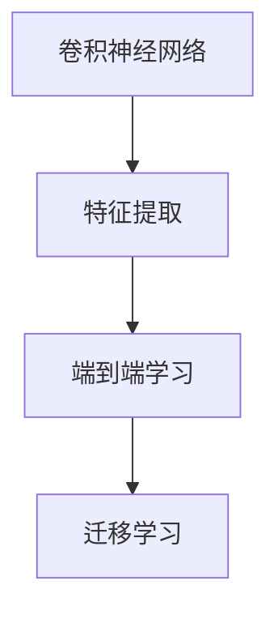

                 

## 1. 背景介绍

### 1.1 问题由来

视觉识别技术在过去几十年里取得了显著的进步，但这一过程并非一蹴而就。从早期的基于手工特征的机器学习，到近年来的端到端深度学习，视觉识别的发展经历了多个阶段。本文将深入探讨这一转变的原因，及其对视觉识别技术的深远影响。

### 1.2 问题核心关键点

视觉识别的早期尝试依赖于手工设计的特征提取和分类器。这些方法依赖于专家对问题的深入理解，但难以泛化到不同的任务和数据集上。而深度学习的发展，特别是卷积神经网络（Convolutional Neural Networks, CNNs）的出现，使得端到端学习成为可能。这一转变不仅提升了模型性能，还极大地降低了系统开发和维护的复杂度。

## 2. 核心概念与联系

### 2.1 核心概念概述

为更好地理解从手工特征到端到端深度学习的转变，本节将介绍几个密切相关的核心概念：

- **卷积神经网络（CNNs）**：一种特殊的神经网络，通过卷积层和池化层设计，能有效提取图像的局部特征，广泛应用于图像分类、目标检测、图像分割等任务。
- **特征提取（Feature Extraction）**：指从原始数据中提取有意义的特征表示，以用于分类或回归等任务。早期视觉识别方法依赖于手工设计的特征提取器，如HOG、SIFT等。
- **端到端学习（End-to-End Learning）**：一种学习范式，指直接通过输入数据和输出标签训练模型，中间不涉及手动设计特征提取器或中间变量，显著提升了模型性能和泛化能力。
- **迁移学习（Transfer Learning）**：指将在大规模数据集上预训练的模型迁移到小规模任务上，通过微调进一步优化模型，以提高模型在新任务上的性能。

这些核心概念之间的逻辑关系可以通过以下Mermaid流程图来展示：



这个流程图展示了核心概念之间的基本关系：

1. 卷积神经网络通过卷积和池化操作，自动提取图像特征。
2. 端到端学习直接通过输入和输出数据进行训练，中间不涉及手工特征提取。
3. 迁移学习利用预训练模型在新的任务上进行微调，进一步提升模型性能。

## 3. 核心算法原理 & 具体操作步骤

### 3.1 算法原理概述

从手工特征到端到端深度学习的转变，其核心在于利用深度学习模型自动提取图像特征，而无需手动设计特征提取器。这一转变基于以下原理：

- **深度网络的多层次抽象**：深度网络通过多层次的抽象，能够自动学习到图像的复杂特征表示，如边缘、纹理、形状等。
- **反向传播优化**：通过反向传播算法，深度网络能够自动调整网络参数，优化模型性能。
- **大量标注数据**：端到端深度学习模型需要大量的标注数据进行训练，以学习到准确的特征表示。

### 3.2 算法步骤详解

基于深度学习的视觉识别模型构建和训练通常包括以下几个关键步骤：

**Step 1: 准备数据集**

- 收集大量标注数据，包括训练集、验证集和测试集。
- 将图像数据预处理为网络可接受的形式，如裁剪、归一化等。

**Step 2: 设计网络架构**

- 选择合适的CNN架构，如LeNet、AlexNet、VGG、ResNet等。
- 定义网络输入输出，确定层数、卷积核大小、池化方式等超参数。

**Step 3: 设置优化器**

- 选择合适的优化器，如SGD、Adam等。
- 设置学习率、批大小、迭代轮数等超参数。

**Step 4: 执行梯度训练**

- 将训练集数据分批次输入模型，前向传播计算损失函数。
- 反向传播计算参数梯度，根据设定的优化算法和学习率更新模型参数。
- 周期性在验证集上评估模型性能，根据性能指标决定是否触发Early Stopping。
- 重复上述步骤直到满足预设的迭代轮数或Early Stopping条件。

**Step 5: 测试和部署**

- 在测试集上评估训练好的模型性能，对比微调前后的精度提升。
- 使用训练好的模型对新样本进行推理预测，集成到实际的应用系统中。

### 3.3 算法优缺点

端到端深度学习的视觉识别方法具有以下优点：

- 性能优越：自动提取特征使得模型性能显著提升。
- 鲁棒性强：模型对图像变换、噪声等扰动具有较强的鲁棒性。
- 泛化能力强：模型能够泛化到不同的任务和数据集。

同时，该方法也存在一定的局限性：

- 对标注数据依赖：需要大量标注数据进行训练，标注成本高。
- 计算资源需求高：模型训练和推理需要大量的计算资源，对硬件要求高。
- 可解释性不足：深度模型通常被视为“黑盒”，难以解释内部工作机制。

尽管存在这些局限性，但就目前而言，端到端深度学习已成为视觉识别领域的主流范式。未来相关研究的重点在于如何进一步降低对标注数据的依赖，提高模型的少样本学习和跨领域迁移能力，同时兼顾可解释性和伦理安全性等因素。

### 3.4 算法应用领域

端到端深度学习的视觉识别方法在许多领域得到了广泛的应用，例如：

- 图像分类：如识别不同种类的动物、植物、车辆等。
- 目标检测：如在图像中定位和识别多个物体。
- 图像分割：将图像分割成不同的区域，用于医疗影像分析、城市规划等。
- 人脸识别：在视频监控、考勤系统等应用中，自动识别和验证人员身份。
- 三维重建：通过多视角图像恢复三维场景，用于虚拟现实、建筑测绘等。
- 光流估计：在视频序列中计算像素点的运动轨迹，用于视频稳定、运动跟踪等。

除了上述这些经典任务外，端到端深度学习还被创新性地应用到更多场景中，如基于多模态数据的图像生成、风格迁移、图像超分辨率等，为视觉识别技术带来了全新的突破。随着深度学习模型的不断进步，相信视觉识别技术将在更广阔的应用领域大放异彩。

## 4. 数学模型和公式 & 详细讲解 & 举例说明

### 4.1 数学模型构建

本节将使用数学语言对端到端深度学习的视觉识别过程进行更加严格的刻画。

假设输入图像为 $\mathbf{x} \in \mathbb{R}^{H\times W \times C}$，其中 $H$、$W$ 分别为图像的高度和宽度，$C$ 为通道数（如RGB三通道）。网络模型定义为一个层次化的函数 $\mathcal{F}(\mathbf{x}, \theta)$，其中 $\theta$ 为模型参数。模型的输出为 $y \in \mathbb{R}^{K}$，其中 $K$ 为分类数目。

定义模型 $y=\mathcal{F}(\mathbf{x}, \theta)$ 在训练集上的经验风险为：

$$
\mathcal{L}(\theta) = \frac{1}{N}\sum_{i=1}^N \ell(y_i, \mathcal{F}(\mathbf{x}_i, \theta))
$$

其中 $\ell(y_i, \mathcal{F}(\mathbf{x}_i, \theta))$ 为损失函数，用于衡量模型输出 $y_i$ 与真实标签 $\mathbf{y}_i$ 之间的差异。

### 4.2 公式推导过程

以下我们以二分类任务为例，推导交叉熵损失函数及其梯度的计算公式。

假设模型 $y=\mathcal{F}(\mathbf{x}, \theta)$ 在输入 $\mathbf{x}$ 上的输出为 $\hat{y}=\sigma(\mathbf{z}) \in [0,1]$，表示样本属于正类的概率，其中 $\sigma(\cdot)$ 为Sigmoid函数。真实标签 $y \in \{0,1\}$。则二分类交叉熵损失函数定义为：

$$
\ell(y, \hat{y}) = -[y\log \hat{y} + (1-y)\log (1-\hat{y})]
$$

将其代入经验风险公式，得：

$$
\mathcal{L}(\theta) = -\frac{1}{N}\sum_{i=1}^N [y_i\log \sigma(\mathbf{z}_i)+(1-y_i)\log(1-\sigma(\mathbf{z}_i))]
$$

其中 $\mathbf{z}_i=\mathcal{F}(\mathbf{x}_i, \theta)$。根据链式法则，损失函数对参数 $\theta_k$ 的梯度为：

$$
\frac{\partial \mathcal{L}(\theta)}{\partial \theta_k} = -\frac{1}{N}\sum_{i=1}^N [y_i\frac{\partial \sigma(\mathbf{z}_i)}{\partial \mathbf{z}_i}\frac{\partial \mathbf{z}_i}{\partial \theta_k}+(1-y_i)\frac{\partial (1-\sigma(\mathbf{z}_i))}{\partial \mathbf{z}_i}\frac{\partial \mathbf{z}_i}{\partial \theta_k}]
$$

其中 $\frac{\partial \sigma(\cdot)}{\partial \cdot}$ 和 $\frac{\partial (1-\sigma(\cdot))}{\partial \cdot}$ 为Sigmoid函数的导数。

### 4.3 案例分析与讲解

假设我们有一个简单的CNN网络，用于二分类任务。网络结构如下：

```
input layer (H x W x C) -> convolution layer (H/2 x W/2 x C) -> ReLU -> max pooling layer (H/4 x W/4 x C) -> dropout layer -> fully connected layer -> softmax layer (K)
```

其中，卷积层和池化层的参数为 $\theta_{conv}$，全连接层的参数为 $\theta_{fc}$，输出层的参数为 $\theta_{softmax}$。通过反向传播算法计算损失函数对各个层参数的梯度，并更新参数，完成模型的训练。

## 5. 项目实践：代码实例和详细解释说明

### 5.1 开发环境搭建

在进行端到端深度学习项目开发前，我们需要准备好开发环境。以下是使用Python进行TensorFlow开发的环境配置流程：

1. 安装Anaconda：从官网下载并安装Anaconda，用于创建独立的Python环境。

2. 创建并激活虚拟环境：
```bash
conda create -n tf-env python=3.8 
conda activate tf-env
```

3. 安装TensorFlow：根据CUDA版本，从官网获取对应的安装命令。例如：
```bash
conda install tensorflow==2.7
```

4. 安装各类工具包：
```bash
pip install numpy pandas scikit-learn matplotlib tqdm jupyter notebook ipython
```

完成上述步骤后，即可在`tf-env`环境中开始项目开发。

### 5.2 源代码详细实现

下面我们以图像分类任务为例，给出使用TensorFlow对CNN模型进行训练和测试的PyTorch代码实现。

首先，定义模型和优化器：

```python
import tensorflow as tf
from tensorflow.keras import layers

model = tf.keras.Sequential([
    layers.Conv2D(32, (3, 3), activation='relu', input_shape=(224, 224, 3)),
    layers.MaxPooling2D((2, 2)),
    layers.Conv2D(64, (3, 3), activation='relu'),
    layers.MaxPooling2D((2, 2)),
    layers.Conv2D(128, (3, 3), activation='relu'),
    layers.MaxPooling2D((2, 2)),
    layers.Flatten(),
    layers.Dense(64, activation='relu'),
    layers.Dense(2, activation='softmax')
])

optimizer = tf.keras.optimizers.Adam(learning_rate=0.001)

# 训练集和测试集数据预处理
train_dataset = tf.keras.preprocessing.image_dataset_from_directory(
    'train',
    image_size=(224, 224),
    batch_size=32,
    class_mode='binary',
    shuffle=True
)

test_dataset = tf.keras.preprocessing.image_dataset_from_directory(
    'test',
    image_size=(224, 224),
    batch_size=32,
    class_mode='binary',
    shuffle=False
)
```

然后，定义训练和评估函数：

```python
@tf.function
def train_step(inputs, labels):
    with tf.GradientTape() as tape:
        predictions = model(inputs)
        loss = tf.keras.losses.BinaryCrossentropy()(labels, predictions)
    gradients = tape.gradient(loss, model.trainable_variables)
    optimizer.apply_gradients(zip(gradients, model.trainable_variables))
    return loss

@tf.function
def test_step(inputs, labels):
    predictions = model(inputs)
    loss = tf.keras.losses.BinaryCrossentropy()(labels, predictions)
    return loss

# 训练和评估
model.compile(optimizer=optimizer, loss='sparse_categorical_crossentropy', metrics=['accuracy'])

history = model.fit(train_dataset, epochs=10, validation_data=test_dataset)

# 评估
test_loss = test_step(test_dataset.batch(32), test_dataset.class_labels())
print('Test loss:', test_loss.numpy())
```

最后，启动训练流程并在测试集上评估：

```python
model.save('classification_model.h5')

# 重新加载模型
model = tf.keras.models.load_model('classification_model.h5')

# 加载测试集数据
test_dataset = tf.keras.preprocessing.image_dataset_from_directory(
    'test',
    image_size=(224, 224),
    batch_size=32,
    class_mode='binary',
    shuffle=False
)

# 评估模型
test_loss = test_step(test_dataset.batch(32), test_dataset.class_labels())
print('Test loss:', test_loss.numpy())
```

以上就是使用TensorFlow进行图像分类任务端到端深度学习的完整代码实现。可以看到，通过TensorFlow的强大封装，我们能够用相对简洁的代码完成CNN模型的训练和评估。

### 5.3 代码解读与分析

让我们再详细解读一下关键代码的实现细节：

**Sequential模型定义**：
- `tf.keras.Sequential`：创建一个线性的层次化模型，按照顺序添加网络层。
- `layers.Conv2D`：定义卷积层，提取图像的局部特征。
- `layers.MaxPooling2D`：定义池化层，降低特征图的大小。
- `layers.Flatten`：将特征图展平，输入全连接层。
- `layers.Dense`：定义全连接层，输出分类结果。
- `layers.Softmax`：输出概率分布，用于二分类任务。

**优化器定义**：
- `tf.keras.optimizers.Adam`：定义Adam优化器，优化模型参数。

**数据预处理**：
- `tf.keras.preprocessing.image_dataset_from_directory`：从目录中加载图像数据，进行标准化、扩增等预处理。

**训练函数**：
- `train_step`：定义训练函数，前向传播计算损失，反向传播更新模型参数。
- `test_step`：定义测试函数，前向传播计算损失，但不更新参数。

**模型编译和训练**：
- `model.compile`：定义模型编译参数，包括损失函数、优化器和评价指标。
- `model.fit`：定义训练参数，在训练集上进行模型训练，并返回训练历史。

**测试函数**：
- `test_step`：定义测试函数，用于在测试集上评估模型性能。

**模型保存和加载**：
- `model.save`：保存模型到磁盘。
- `tf.keras.models.load_model`：加载保存好的模型。

可以看到，TensorFlow提供了丰富的API和工具，极大简化了端到端深度学习的实现过程。开发者可以将更多精力放在网络结构设计、数据处理等核心任务上，而不必过多关注底层计算图的构建。

当然，工业级的系统实现还需考虑更多因素，如模型的保存和部署、超参数的自动搜索、更灵活的模型架构等。但核心的端到端深度学习过程基本与此类似。

## 6. 实际应用场景

### 6.1 智能监控系统

端到端深度学习的视觉识别技术，可以广泛应用于智能监控系统的构建。传统的监控系统依赖人工对视频进行实时分析和处理，成本高、效率低。而使用深度学习模型，可以对监控视频进行实时分析和异常检测，快速响应潜在的安全威胁。

在技术实现上，可以收集监控区域的监控视频，将视频帧作为输入，通过训练好的模型进行人脸识别、行为分析等任务。当模型检测到异常情况时，系统会自动发出警报并触发应急响应。

### 6.2 医疗影像分析

医疗影像分析是端到端深度学习的重要应用领域。传统的影像分析依赖于专家对图像的细致阅读和分析，耗时耗力。而使用深度学习模型，可以对医学影像进行自动化的特征提取和分类，辅助医生进行诊断和治疗决策。

在技术实现上，可以收集大量的医学影像数据，包括X光片、CT片、MRI等，将图像数据作为输入，通过训练好的模型进行病变区域定位、影像分类等任务。模型输出的结果可以辅助医生快速识别疾病类型，提高诊断的准确性和效率。

### 6.3 自动驾驶

自动驾驶是深度学习在视觉识别领域的又一重要应用。传统的自动驾驶依赖于复杂的传感器融合和决策算法，对硬件和算法的要求高。而使用深度学习模型，可以对摄像头拍摄的图像进行实时分析和处理，辅助车辆进行自主导航和避障。

在技术实现上，可以收集大量的驾驶场景数据，将摄像头拍摄的图像作为输入，通过训练好的模型进行车辆检测、行人识别、道路标记识别等任务。模型输出的结果可以辅助车辆进行自主驾驶，提升驾驶安全性和舒适性。

### 6.4 未来应用展望

随着端到端深度学习技术的发展，视觉识别的应用领域将进一步扩展，为更多行业带来变革性影响。

在智慧农业领域，深度学习模型可以用于农作物的识别和生长监测，提高农业生产的智能化和自动化水平。

在智能家居领域，深度学习模型可以用于智能设备的识别和行为分析，提高家庭生活的便捷性和安全性。

在工业制造领域，深度学习模型可以用于设备的故障检测和维护预测，提高生产效率和设备可靠性。

此外，在娱乐、教育、旅游等多个领域，深度学习技术也将得到广泛应用，为社会带来更多便利和创新。

## 7. 工具和资源推荐

### 7.1 学习资源推荐

为了帮助开发者系统掌握端到端深度学习的原理和实践，这里推荐一些优质的学习资源：

1. 《Deep Learning》一书：由Ian Goodfellow、Yoshua Bengio和Aaron Courville撰写，系统介绍了深度学习的基本原理和算法，是深度学习领域的经典教材。

2. CS231n《Convolutional Neural Networks for Visual Recognition》课程：斯坦福大学开设的深度学习课程，重点讲解CNN在视觉识别任务中的应用，并提供了丰富的代码和实验。

3. TensorFlow官方文档：提供详细的TensorFlow API文档和示例代码，帮助开发者快速上手深度学习模型的开发和部署。

4. PyTorch官方文档：提供详细的PyTorch API文档和示例代码，帮助开发者快速上手深度学习模型的开发和部署。

5. 《Hands-On Machine Learning with Scikit-Learn and TensorFlow》一书：由Jorge Los Alcazar和D Coachman撰写，介绍了使用Scikit-Learn和TensorFlow进行深度学习的实用技巧和案例。

通过学习这些资源，相信你一定能够快速掌握端到端深度学习的精髓，并用于解决实际的视觉识别问题。

### 7.2 开发工具推荐

高效的开发离不开优秀的工具支持。以下是几款用于端到端深度学习开发的常用工具：

1. TensorFlow：由Google主导开发的开源深度学习框架，生产部署方便，适合大规模工程应用。提供丰富的API和工具，支持CPU/GPU/TPU等多种硬件加速。

2. PyTorch：由Facebook主导开发的开源深度学习框架，灵活动态，适合快速迭代研究。提供丰富的API和工具，支持CPU/GPU等多种硬件加速。

3. Keras：高层次的深度学习API，提供了简单易用的接口，支持TensorFlow和Theano等后端。适合初学者快速上手深度学习模型开发。

4. MXNet：由Apache支持的深度学习框架，支持多种编程语言和硬件，提供了丰富的API和工具，适合分布式训练和模型部署。

5. OpenCV：开源计算机视觉库，提供了丰富的图像处理和计算机视觉功能，支持多种编程语言和硬件。适合图像预处理和数据增强。

6. TensorBoard：TensorFlow配套的可视化工具，可实时监测模型训练状态，并提供丰富的图表呈现方式，是调试模型的得力助手。

合理利用这些工具，可以显著提升深度学习模型的开发效率，加快创新迭代的步伐。

### 7.3 相关论文推荐

端到端深度学习的视觉识别技术的发展源于学界的持续研究。以下是几篇奠基性的相关论文，推荐阅读：

1. ImageNet Classification with Deep Convolutional Neural Networks：提出AlexNet模型，引入大规模数据集ImageNet进行预训练，展示了深度学习在图像分类任务上的强大能力。

2. Deep Residual Learning for Image Recognition：提出ResNet模型，解决深度网络训练中的梯度消失问题，显著提升了深度网络的深度和性能。

3. Mask R-CNN：提出Mask R-CNN模型，结合区域提取和像素级分割，实现目标检测和实例分割任务，为深度学习在视觉识别领域的应用提供了新的思路。

4. One-stage Anchoring Network for Real-time Object Detection：提出YOLOv3模型，通过单阶段检测网络实现实时目标检测，提升了检测速度和精度。

5. Video Action Recognition with Temporal Convolutional Networks：提出Temporal Convolutional Networks，用于视频动作识别任务，展示了深度学习在时间序列数据上的应用潜力。

6. Improved Techniques for Training GANs：提出生成对抗网络（GANs），用于生成图像、视频等数据，展示了深度学习在数据生成方面的强大能力。

这些论文代表了大深度学习技术的发展脉络。通过学习这些前沿成果，可以帮助研究者把握学科前进方向，激发更多的创新灵感。

## 8. 总结：未来发展趋势与挑战

### 8.1 总结

本文对端到端深度学习的视觉识别方法进行了全面系统的介绍。首先阐述了端到端深度学习在视觉识别领域应用的原理和背景，明确了其相对于手工特征提取方法的优越性。其次，从原理到实践，详细讲解了端到端深度学习的数学模型和关键步骤，给出了端到端深度学习的代码实现。同时，本文还广泛探讨了端到端深度学习在智能监控、医疗影像、自动驾驶等多个领域的应用前景，展示了端到端深度学习的广泛应用潜力。

通过本文的系统梳理，可以看到，端到端深度学习为视觉识别技术带来了革命性变革，极大地提升了模型性能和应用范围，成为深度学习在视觉领域的重要范式。未来，伴随深度学习模型的不断进步，视觉识别技术将在更广阔的应用领域大放异彩，深刻影响人类的生产生活方式。

### 8.2 未来发展趋势

展望未来，端到端深度学习的视觉识别技术将呈现以下几个发展趋势：

1. 模型规模持续增大。随着算力成本的下降和数据规模的扩张，深度学习模型的参数量还将持续增长。超大规模模型蕴含的丰富视觉知识，有望支撑更加复杂多变的视觉识别任务。

2. 端到端学习的自动化。未来的深度学习模型将更加注重自动化设计，减少对人类经验的依赖，提升模型的鲁棒性和泛化能力。

3. 跨模态学习。将视觉、听觉、触觉等多模态信息进行融合，构建更加全面、准确的视觉识别模型。

4. 联邦学习。在保证数据隐私和安全的前提下，利用分布式数据进行模型训练，提升模型的泛化能力和鲁棒性。

5. 自适应学习。通过实时反馈调整模型参数，提升模型的动态适应能力，更好地应对环境变化和噪声干扰。

6. 自监督学习。通过无监督数据进行模型预训练，提高模型的泛化能力和自适应能力，减少对标注数据的依赖。

以上趋势凸显了端到端深度学习技术的广阔前景。这些方向的探索发展，必将进一步提升视觉识别模型的性能和应用范围，为计算机视觉技术带来新的突破。

### 8.3 面临的挑战

尽管端到端深度学习的视觉识别技术已经取得了显著进展，但在迈向更加智能化、普适化应用的过程中，它仍面临着诸多挑战：

1. 标注数据成本高。深度学习模型通常需要大量标注数据进行训练，标注成本高昂，难以应对长尾任务。

2. 计算资源需求高。深度学习模型需要大量的计算资源进行训练和推理，对硬件要求高。

3. 可解释性不足。深度模型通常被视为“黑盒”，难以解释内部工作机制和决策逻辑。

4. 模型鲁棒性不足。深度模型面对域外数据时，泛化性能往往大打折扣，对抗样本也难以有效应对。

5. 模型训练时间长。深度模型训练时间通常较长，难以适应实时任务和快速迭代的需求。

6. 模型过拟合风险高。深度模型通常存在过拟合风险，需要通过数据增强、正则化等方法进行缓解。

正视端到端深度学习面临的这些挑战，积极应对并寻求突破，将是大规模视觉识别技术走向成熟的必由之路。相信随着学界和产业界的共同努力，这些挑战终将一一被克服，端到端深度学习必将在构建安全、可靠、可解释、可控的智能系统铺平道路。

### 8.4 研究展望

面对端到端深度学习所面临的种种挑战，未来的研究需要在以下几个方面寻求新的突破：

1. 探索无监督和半监督学习范式。摆脱对大规模标注数据的依赖，利用自监督学习、主动学习等无监督和半监督范式，最大限度利用非结构化数据，实现更加灵活高效的视觉识别。

2. 研究参数高效和计算高效的深度学习范式。开发更加参数高效的深度学习模型，在固定大部分预训练参数的同时，只更新极少量的任务相关参数。同时优化深度学习模型的计算图，减少前向传播和反向传播的资源消耗，实现更加轻量级、实时性的部署。

3. 融合因果和对比学习范式。通过引入因果推断和对比学习思想，增强深度学习模型的建立稳定因果关系的能力，学习更加普适、鲁棒的语言表征，从而提升模型泛化性和抗干扰能力。

4. 引入更多先验知识。将符号化的先验知识，如知识图谱、逻辑规则等，与神经网络模型进行巧妙融合，引导深度学习模型的训练过程，提高模型的泛化能力和适应能力。

5. 结合因果分析和博弈论工具。将因果分析方法引入深度学习模型的训练过程，识别出模型决策的关键特征，增强输出解释的因果性和逻辑性。借助博弈论工具刻画人机交互过程，主动探索并规避模型的脆弱点，提高系统稳定性。

6. 纳入伦理道德约束。在深度学习模型的训练目标中引入伦理导向的评估指标，过滤和惩罚有偏见、有害的输出倾向。同时加强人工干预和审核，建立模型行为的监管机制，确保输出符合人类价值观和伦理道德。

这些研究方向的探索，必将引领深度学习技术迈向更高的台阶，为构建安全、可靠、可解释、可控的智能系统铺平道路。面向未来，深度学习技术还需要与其他人工智能技术进行更深入的融合，如知识表示、因果推理、强化学习等，多路径协同发力，共同推动人工智能技术在视觉识别领域的进步。只有勇于创新、敢于突破，才能不断拓展深度学习模型的边界，让智能技术更好地造福人类社会。

## 9. 附录：常见问题与解答

**Q1：端到端深度学习如何提高模型性能？**

A: 端到端深度学习通过自动化的特征提取和分类器设计，可以显著提高模型性能。主要原因包括：

1. 自动化的特征提取：深度网络通过多层次的抽象，能够自动学习到图像的复杂特征表示，如边缘、纹理、形状等。这些特征表示具有层次性、鲁棒性和泛化能力。

2. 反向传播优化：通过反向传播算法，深度网络能够自动调整网络参数，优化模型性能。相比手工特征提取，端到端学习更加高效和准确。

3. 丰富的标注数据：端到端深度学习通常需要大量标注数据进行训练，可以更好地学习到准确的特征表示。

**Q2：深度学习模型的可解释性问题如何解决？**

A: 深度学习模型的可解释性问题可以通过以下方法解决：

1. 可视化技术：使用可视化工具如TensorBoard、Grad-CAM等，展示模型内部的激活图和梯度信息，帮助理解模型的决策过程。

2. 特征重要性分析：通过计算特征对输出结果的贡献度，理解模型对不同特征的依赖关系。

3. 模型简化：通过剪枝、蒸馏等方法简化模型，减小模型的复杂度，提升模型的可解释性。

4. 交互式解释工具：开发交互式工具，允许用户输入不同的特征，动态调整模型输出，了解不同特征对输出的影响。

5. 解释性模型设计：在设计模型时，引入解释性较强的层和单元，如可解释的神经元、门控单元等。

**Q3：深度学习模型的计算资源需求高如何解决？**

A: 深度学习模型的计算资源需求可以通过以下方法解决：

1. 硬件加速：利用GPU/TPU等高性能硬件，加速深度学习模型的训练和推理过程。

2. 分布式训练：通过分布式计算框架如TensorFlow、PyTorch等，将深度学习模型分布式训练，提高训练效率。

3. 模型压缩和量化：通过模型压缩和量化技术，减小模型的存储空间和计算量，提高模型推理效率。

4. 模型并行：通过模型并行技术，将深度学习模型并行化，提高训练和推理效率。

5. 数据增强：通过数据增强技术，增加训练数据的多样性和数量，提高模型的泛化能力和鲁棒性。

6. 计算图优化：通过计算图优化技术，减少前向传播和反向传播的资源消耗，提高模型的计算效率。

**Q4：深度学习模型的过拟合风险如何解决？**

A: 深度学习模型的过拟合风险可以通过以下方法解决：

1. 数据增强：通过数据增强技术，增加训练数据的多样性和数量，提高模型的泛化能力和鲁棒性。

2. 正则化技术：通过L2正则、Dropout等正则化技术，防止模型过度拟合训练数据。

3. 早停策略：通过设置早停阈值，在模型验证误差不再下降时停止训练，防止模型过拟合。

4. 模型简化：通过剪枝、蒸馏等方法简化模型，减小模型的复杂度，提高模型的泛化能力。

5. 生成对抗网络（GANs）：通过生成对抗网络技术，生成对抗样本，提高模型的鲁棒性和泛化能力。

**Q5：深度学习模型的训练时间过长如何解决？**

A: 深度学习模型的训练时间过长可以通过以下方法解决：

1. 硬件加速：利用GPU/TPU等高性能硬件，加速深度学习模型的训练过程。

2. 分布式训练：通过分布式计算框架如TensorFlow、PyTorch等，将深度学习模型分布式训练，提高训练效率。

3. 数据预处理：通过数据预处理技术，提高数据读取和处理效率，减少训练时间。

4. 模型简化：通过剪枝、蒸馏等方法简化模型，减小模型的复杂度，提高训练效率。

5. 混合精度训练：通过混合精度训练技术，提高训练效率，减少计算资源消耗。

6. 模型优化器：选择高效的优化器如Adam、RMSprop等，提高训练效率。

这些方法可以显著缩短深度学习模型的训练时间，提高模型的开发和部署效率。

---

作者：禅与计算机程序设计艺术 / Zen and the Art of Computer Programming

