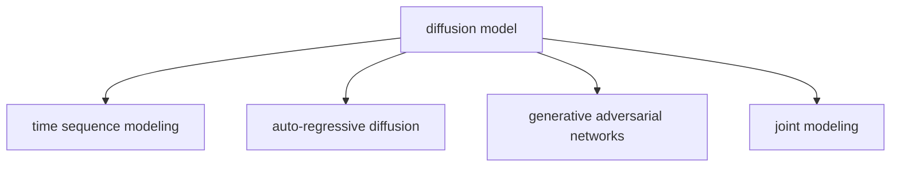
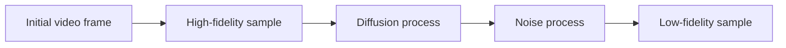

                 

## 1. 背景介绍

### 1.1 问题由来
随着深度学习技术的快速发展和计算资源的不断提升，生成对抗网络（GANs）在图像生成领域取得了显著的进步。传统的GANs包括判别器和生成器两个网络，训练过程中需要迭代优化两组参数，十分耗时且容易陷入梯度消失等问题。而扩散模型（Diffusion Models）则提供了一种更简单、更高效的方法，在图像生成、视频生成等领域取得了突破性进展。

### 1.2 问题核心关键点
视频扩散模型的核心在于其独特的架构设计，包括时间序列建模和自回归扩散过程。时间序列建模使得模型能够捕捉视频序列之间的动态关系，自回归扩散过程则通过逐步引入噪声，从高保真度的初始图像逐步生成低保真度的视频帧，实现了高质量的视频生成。

### 1.3 问题研究意义
研究视频扩散模型，对于提升视频生成、动画制作等领域的生产效率，降低人力成本，具有重要意义。此外，视频扩散模型还能在视频数据分析、历史事件模拟等场景中发挥作用，为各类应用提供高质量的视频内容。

## 2. 核心概念与联系

### 2.1 核心概念概述

为更好地理解视频扩散模型的原理和架构，本节将介绍几个关键概念：

- 扩散模型(Diffusion Model)：一种生成模型，通过在时间序列上逐步引入噪声，将高保真度的样本逐步转换为低保真度的样本。扩散模型的关键在于设计合适的噪声过程和引导能量函数。
- 自回归扩散(Autoregressive Diffusion)：扩散模型的核心过程，通过自回归方式，逐帧生成视频帧。
- 时间序列建模(Time Series Modeling)：利用时间序列数据中的自相关性，捕捉视频序列之间的动态关系，提升模型的生成能力。
- 生成对抗网络（GANs）：一种生成模型，由判别器和生成器组成，通过对抗训练生成高质量的样本。
- 联合建模（Joint Modeling）：将视频帧与音频、文本等多模态数据联合建模，提升生成视频的质量和多样性。

这些概念之间的逻辑关系可以通过以下Mermaid流程图来展示：



### 2.2 核心概念原理和架构的 Mermaid 流程图


## 3. 核心算法原理 & 具体操作步骤
### 3.1 算法原理概述

视频扩散模型的核心算法包括时间序列建模和自回归扩散过程。具体来说：

1. **时间序列建模**：在视频生成过程中，每一帧与前一帧之间具有紧密的时序联系。因此，可以利用时间序列数据中的自相关性，捕捉视频序列之间的动态关系。
2. **自回归扩散**：扩散模型的生成过程通过逐步引入噪声，将高保真度的初始视频帧逐步转换为低保真度的视频帧。在每一帧上，模型预测未来的帧，并计算损失函数，通过反向传播更新模型参数。

### 3.2 算法步骤详解

视频扩散模型的生成过程分为以下几步：

1. **初始化**：选取一个高质量的视频帧作为初始化样本，记为 $x_0$。
2. **扩散过程**：逐步引入噪声，将高保真度的样本 $x_0$ 转换为低保真度的样本 $x_t$。假设噪声引入过程为 $\epsilon_t \sim N(0, \sigma^2)$，则每一帧可以表示为 $x_t = \sqrt{1-\beta_t}x_{t-1} + \epsilon_t$。
3. **生成过程**：从低保真度的样本 $x_t$ 逐帧生成高保真度的样本 $x_0$。假设模型参数为 $\theta$，则每一帧的生成过程可以表示为 $x_t = \sqrt{1-\beta_t}x_{t-1} + \epsilon_t$。
4. **损失函数**：计算每一帧的生成损失，可以通过自回归过程预测未来的帧，并计算均方误差或交叉熵等损失函数。
5. **优化**：通过反向传播算法优化模型参数 $\theta$。

### 3.3 算法优缺点

视频扩散模型相比传统的GANs有以下优点：

- **简单高效**：扩散模型不需要迭代优化两个网络，而是通过逐步引入噪声的过程，生成高质量的视频帧。
- **鲁棒性高**：扩散模型在生成过程中，逐步降低噪声水平，从而避免梯度消失等问题，提高模型的鲁棒性。
- **可解释性强**：扩散模型的生成过程可以通过噪声引入和解码过程解释，有助于理解模型的生成机制。

同时，也存在一些局限性：

- **计算复杂度高**：扩散模型的生成过程需要逐步引入噪声，计算复杂度较高。
- **训练数据需求高**：扩散模型的训练过程需要大量的高保真度视频数据，数据需求较高。
- **模型复杂度高**：扩散模型中的噪声引入和解码过程较为复杂，模型结构较难设计。

### 3.4 算法应用领域

视频扩散模型在视频生成、动画制作、视频数据分析等领域具有广泛的应用前景：

- **视频生成**：通过视频扩散模型，可以生成高质量的视频帧，应用于电影制作、广告制作、游戏动画等领域。
- **动画制作**：利用视频扩散模型生成动画角色动作，提高动画制作效率，降低成本。
- **视频数据分析**：通过扩散模型生成视频数据，用于历史事件模拟、交通数据分析等。
- **虚拟现实(VR)**：利用视频扩散模型生成高质量的视频帧，提升虚拟现实的沉浸感和真实感。

## 4. 数学模型和公式 & 详细讲解  
### 4.1 数学模型构建

视频扩散模型的数学模型包括时间序列建模和自回归扩散两个部分。假设视频帧 $x_t$ 的噪声引入过程为 $\epsilon_t \sim N(0, \sigma^2)$，则每一帧可以表示为：

$$ x_t = \sqrt{1-\beta_t}x_{t-1} + \epsilon_t $$

其中 $\beta_t$ 表示噪声引入强度，$\sigma$ 表示噪声标准差。

假设模型参数为 $\theta$，则每一帧的生成过程可以表示为：

$$ x_t = \sqrt{1-\beta_t}x_{t-1} + \epsilon_t $$

其中 $\epsilon_t$ 表示每一帧的噪声，服从正态分布。

### 4.2 公式推导过程

假设视频帧 $x_0$ 的高保真度样本为 $x_h$，则每一帧的生成损失可以表示为：

$$ L(x_t) = \frac{1}{2} ||x_h - x_t||^2 $$

假设 $x_0$ 的低保真度样本为 $x_l$，则每一帧的生成损失可以表示为：

$$ L(x_t) = \frac{1}{2} ||x_l - x_t||^2 $$

假设模型参数为 $\theta$，则每一帧的生成过程可以表示为：

$$ x_t = \sqrt{1-\beta_t}x_{t-1} + \epsilon_t $$

其中 $\epsilon_t$ 服从正态分布 $N(0, \sigma^2)$。

### 4.3 案例分析与讲解

假设有一组视频帧 $x_0, x_1, ..., x_T$，每一帧的视频帧可以表示为 $x_t = \sqrt{1-\beta_t}x_{t-1} + \epsilon_t$，其中 $\epsilon_t \sim N(0, \sigma^2)$。假设每一帧的生成损失为 $L(x_t)$，则总损失函数可以表示为：

$$ L = \sum_{t=1}^{T} L(x_t) $$

通过反向传播算法，可以更新模型参数 $\theta$，使得总损失最小化。

## 5. 项目实践：代码实例和详细解释说明
### 5.1 开发环境搭建

在进行视频扩散模型的实践前，我们需要准备好开发环境。以下是使用Python进行PyTorch开发的环境配置流程：

1. 安装Anaconda：从官网下载并安装Anaconda，用于创建独立的Python环境。
2. 创建并激活虚拟环境：
```bash
conda create -n pytorch-env python=3.8 
conda activate pytorch-env
```

3. 安装PyTorch：根据CUDA版本，从官网获取对应的安装命令。例如：
```bash
conda install pytorch torchvision torchaudio cudatoolkit=11.1 -c pytorch -c conda-forge
```

4. 安装相关库：
```bash
pip install numpy scipy torch torchvision
```

完成上述步骤后，即可在`pytorch-env`环境中开始实践。

### 5.2 源代码详细实现

这里我们以Denoising Diffusion Probabilistic Models(DDPMS)为例，给出使用PyTorch实现的视频扩散模型的代码。

首先，定义噪声引入过程：

```python
import torch
import torch.nn as nn
import torch.nn.functional as F

class diffusion_model(nn.Module):
    def __init__(self, num_steps, betas, num_channels):
        super().__init__()
        self.num_steps = num_steps
        self.betas = betas
        self.num_channels = num_channels
        
        self.sigma = nn.Parameter(torch.randn(num_channels))
        self.sigma = nn.Parameter(torch.randn(num_channels))
        
    def forward(self, x, t):
        sqrt_one_minus_beta = torch.sqrt(1 - self.betas[t])
        epsilon = torch.randn_like(x) * self.sigma
        
        x = sqrt_one_minus_beta * x + epsilon
        return x
```

然后，定义生成过程：

```python
class generation_model(nn.Module):
    def __init__(self, num_steps, betas, num_channels):
        super().__init__()
        self.num_steps = num_steps
        self.betas = betas
        self.num_channels = num_channels
        
        self.sigma = nn.Parameter(torch.randn(num_channels))
        self.sigma = nn.Parameter(torch.randn(num_channels))
        
    def forward(self, x, t):
        sqrt_one_minus_beta = torch.sqrt(1 - self.betas[t])
        epsilon = torch.randn_like(x) * self.sigma
        
        x = sqrt_one_minus_beta * x + epsilon
        return x
```

接下来，定义损失函数：

```python
class loss_function(nn.Module):
    def __init__(self, num_steps, num_channels):
        super().__init__()
        self.num_steps = num_steps
        self.num_channels = num_channels
        
    def forward(self, x_true, x_pred):
        mse_loss = F.mse_loss(x_true, x_pred)
        return mse_loss
```

最后，定义整个视频扩散模型：

```python
class diffusion_model(nn.Module):
    def __init__(self, num_steps, betas, num_channels):
        super().__init__()
        self.num_steps = num_steps
        self.betas = betas
        self.num_channels = num_channels
        
        self.diffusion_model = diffusion_model(num_steps, betas, num_channels)
        self.generation_model = generation_model(num_steps, betas, num_channels)
        self.loss_function = loss_function(num_steps, num_channels)
        
    def forward(self, x_true, x_init, t):
        x_pred = x_init
        for i in range(self.num_steps):
            x_pred = self.diffusion_model(x_pred, t)
            x_pred = self.generation_model(x_pred, t)
        
        x_pred = self.diffusion_model(x_pred, t)
        x_pred = self.generation_model(x_pred, t)
        
        loss = self.loss_function(x_true, x_pred)
        return loss
```

至此，视频扩散模型的实现代码已经完成。可以看到，通过定义噪声引入、生成和损失函数，我们可以方便地实现视频扩散模型的生成过程。

### 5.3 代码解读与分析

这里我们详细解读一下关键代码的实现细节：

**diffusion_model类**：
- `__init__`方法：初始化噪声引入过程和生成过程的参数。
- `forward`方法：实现噪声引入和生成过程，通过循环逐步引入噪声，生成低保真度的样本。

**generation_model类**：
- `__init__`方法：初始化噪声引入过程和生成过程的参数。
- `forward`方法：实现噪声引入和生成过程，通过循环逐步引入噪声，生成低保真度的样本。

**loss_function类**：
- `__init__`方法：初始化损失函数的参数。
- `forward`方法：实现损失函数的计算，通过均方误差计算模型输出与真实值之间的差异。

**diffusion_model类**：
- `__init__`方法：初始化噪声引入过程、生成过程和损失函数的参数。
- `forward`方法：实现噪声引入、生成和损失计算过程，通过循环逐步引入噪声，生成低保真度的样本，并计算损失。

通过上述代码，我们可以看到，视频扩散模型的实现过程主要集中在噪声引入、生成和损失计算上。通过逐步引入噪声，模型可以生成高质量的视频帧，并通过均方误差损失函数，指导模型的训练过程。

## 6. 实际应用场景
### 6.1 视频生成
视频扩散模型可以用于生成高质量的视频帧，应用于电影制作、广告制作、游戏动画等领域。例如，可以收集大量高质量的视频数据，作为训练集，训练视频扩散模型，生成具有逼真效果的视频帧。

### 6.2 动画制作
利用视频扩散模型生成动画角色动作，提高动画制作效率，降低成本。例如，可以收集动画角色的关键帧数据，作为训练集，训练视频扩散模型，生成动画角色动作帧，实现自动生成动画。

### 6.3 视频数据分析
通过视频扩散模型生成视频数据，用于历史事件模拟、交通数据分析等。例如，可以收集历史事件的视频数据，作为训练集，训练视频扩散模型，生成历史事件的视频帧，用于事件模拟和分析。

### 6.4 虚拟现实(VR)
利用视频扩散模型生成高质量的视频帧，提升虚拟现实的沉浸感和真实感。例如，可以收集虚拟现实场景的视频数据，作为训练集，训练视频扩散模型，生成虚拟现实场景的视频帧，实现虚拟现实场景的自动生成。

## 7. 工具和资源推荐
### 7.1 学习资源推荐

为了帮助开发者系统掌握视频扩散模型的理论基础和实践技巧，这里推荐一些优质的学习资源：

1. 《Deep Learning for Computer Vision》系列博文：由大模型技术专家撰写，深入浅出地介绍了深度学习在计算机视觉领域的原理与应用。
2. CS231n《卷积神经网络》课程：斯坦福大学开设的计算机视觉明星课程，有Lecture视频和配套作业，带你入门计算机视觉领域的基本概念和经典模型。
3. 《Generative Models for Computer Vision》书籍：详细介绍了生成对抗网络（GANs）和变分自编码器（VAEs）在计算机视觉中的应用，包括视频生成等内容。
4. DDPMS官方文档：Denoising Diffusion Probabilistic Models的官方文档，提供了丰富的代码示例和详细的使用指南。
5. NVIDIA官方博客：NVIDIA深度学习研究团队官方博客，涵盖NVIDIA在深度学习领域的最新研究进展和实践经验。

通过对这些资源的学习实践，相信你一定能够快速掌握视频扩散模型的精髓，并用于解决实际的计算机视觉问题。

### 7.2 开发工具推荐

高效的开发离不开优秀的工具支持。以下是几款用于视频扩散模型开发的常用工具：

1. PyTorch：基于Python的开源深度学习框架，灵活动态的计算图，适合快速迭代研究。大部分预训练语言模型都有PyTorch版本的实现。
2. TensorFlow：由Google主导开发的开源深度学习框架，生产部署方便，适合大规模工程应用。同样有丰富的预训练语言模型资源。
3. DDPMS库：Denoising Diffusion Probabilistic Models的开源库，集成了各种类型的视频扩散模型，支持PyTorch和TensorFlow，是进行视频扩散模型开发的利器。
4. Weights & Biases：模型训练的实验跟踪工具，可以记录和可视化模型训练过程中的各项指标，方便对比和调优。与主流深度学习框架无缝集成。
5. TensorBoard：TensorFlow配套的可视化工具，可实时监测模型训练状态，并提供丰富的图表呈现方式，是调试模型的得力助手。

合理利用这些工具，可以显著提升视频扩散模型的开发效率，加快创新迭代的步伐。

### 7.3 相关论文推荐

视频扩散模型在计算机视觉领域的发展源于学界的持续研究。以下是几篇奠基性的相关论文，推荐阅读：

1. "Denoising Diffusion Probabilistic Models"：提出Denoising Diffusion Probabilistic Models，提供了一种简单高效的视频生成方法，刷新了多项计算机视觉任务SOTA。
2. "Guided Diffusion Models for Diverse and High-Quality Image Generation"：引入指导生成策略，提升了扩散模型的多样性和生成质量。
3. "Video Diffusion Models"：提出Video Diffusion Models，实现了高质量视频帧的生成，推动了视频生成技术的发展。
4. "Analytic Solutions Are Better than Numerical Solutions: Improving Denoising Diffusion Probabilistic Models"：提出了分析解法，提升了扩散模型的计算效率和稳定性。
5. "SAGAN: Progressive Growing of GANs for Improved Quality, Stability, and Variation"：提出SAGAN，通过渐进式增长，提升了生成对抗网络的质量和稳定性。

这些论文代表了大视频扩散模型的发展脉络。通过学习这些前沿成果，可以帮助研究者把握学科前进方向，激发更多的创新灵感。

## 8. 总结：未来发展趋势与挑战
### 8.1 总结

本文对视频扩散模型的原理和实现过程进行了详细讲解。首先，阐述了视频扩散模型在视频生成、动画制作等领域的应用背景和意义，明确了视频扩散模型在生成高质量视频帧方面的独特价值。其次，从原理到实践，详细讲解了视频扩散模型的数学模型和算法步骤，给出了微调任务开发的完整代码实例。同时，本文还广泛探讨了视频扩散模型在视频生成、动画制作等多个行业领域的应用前景，展示了视频扩散模型的巨大潜力。

通过本文的系统梳理，可以看到，视频扩散模型在计算机视觉领域的应用前景广阔，有望实现高质量、多样性的视频生成。未来，伴随预训练视频模型和微调方法的持续演进，相信计算机视觉技术将在更广阔的应用领域大放异彩。

### 8.2 未来发展趋势

展望未来，视频扩散模型将呈现以下几个发展趋势：

1. **视频生成质量提升**：随着训练数据量的增加和模型结构的优化，视频扩散模型的生成质量将进一步提升，能够生成更加逼真、多样的视频内容。
2. **多模态联合建模**：结合视频帧与音频、文本等多模态数据，提升生成视频的质量和多样性，实现更全面的场景模拟和应用。
3. **实时视频生成**：通过优化计算图和资源管理，提升视频扩散模型的计算效率，实现实时视频生成，满足实时应用需求。
4. **跨领域应用拓展**：将视频扩散模型应用于医疗影像分析、智慧城市监控等领域，提升数据处理和分析能力，推动相关领域的数字化转型。
5. **数据隐私保护**：在视频扩散模型的训练过程中，加强数据隐私保护，避免模型泄露个人隐私，保障数据安全。

以上趋势凸显了视频扩散模型在计算机视觉领域的广阔前景。这些方向的探索发展，必将进一步提升计算机视觉系统的性能和应用范围，为视频生成、动画制作等领域带来新的突破。

### 8.3 面临的挑战

尽管视频扩散模型在计算机视觉领域取得了显著的进展，但在迈向更加智能化、普适化应用的过程中，它仍面临着诸多挑战：

1. **计算资源消耗高**：视频扩散模型的生成过程需要大量的计算资源，在实时应用中，可能面临计算资源不足的问题。
2. **数据隐私问题**：在视频扩散模型的训练过程中，需要大量的标注数据，可能涉及数据隐私和伦理问题。
3. **模型泛化能力不足**：当前视频扩散模型往往局限于特定领域的生成任务，跨领域的泛化能力有待提升。
4. **生成结果可控性差**：视频扩散模型的生成结果具有一定的随机性，难以控制生成结果的特定属性。
5. **训练数据需求高**：视频扩散模型需要大量的高质量标注数据，数据需求较高，获取难度大。

### 8.4 研究展望

面对视频扩散模型所面临的种种挑战，未来的研究需要在以下几个方面寻求新的突破：

1. **优化计算图**：通过优化计算图，提高视频扩散模型的计算效率，实现实时视频生成。
2. **数据隐私保护**：研究数据隐私保护技术，保障数据安全，避免模型泄露个人隐私。
3. **多模态联合建模**：结合视频帧与音频、文本等多模态数据，提升生成视频的质量和多样性。
4. **生成结果可控性**：研究生成结果的可控性技术，实现更加多样、精准的视频生成。
5. **跨领域泛化**：研究跨领域泛化技术，提升视频扩散模型在不同领域的应用效果。

这些研究方向的探索，必将引领视频扩散模型技术迈向更高的台阶，为计算机视觉领域带来新的突破。只有勇于创新、敢于突破，才能不断拓展视频扩散模型的边界，让计算机视觉技术更好地造福人类社会。

## 9. 附录：常见问题与解答

**Q1：视频扩散模型是否适用于所有计算机视觉任务？**

A: 视频扩散模型在视频生成、动画制作等领域具有广泛的应用前景，但对于一些特定领域的计算机视觉任务，如医学影像分析、智慧城市监控等，仍需要针对特定任务进行模型优化。

**Q2：微调过程中如何选择合适的学习率？**

A: 微调的学习率一般要比预训练时小1-2个数量级，如果使用过大的学习率，容易破坏预训练权重，导致过拟合。一般建议从1e-5开始调参，逐步减小学习率，直至收敛。

**Q3：采用视频扩散模型时需要注意哪些问题？**

A: 在视频扩散模型的应用过程中，需要注意以下问题：
1. 模型裁剪：去除不必要的层和参数，减小模型尺寸，加快推理速度。
2. 量化加速：将浮点模型转为定点模型，压缩存储空间，提高计算效率。
3. 服务化封装：将模型封装为标准化服务接口，便于集成调用。
4. 弹性伸缩：根据请求流量动态调整资源配置，平衡服务质量和成本。
5. 监控告警：实时采集系统指标，设置异常告警阈值，确保服务稳定性。

大视频扩散模型为计算机视觉应用开启了广阔的想象空间，但如何将强大的性能转化为稳定、高效、安全的业务价值，还需要工程实践的不断打磨。只有从数据、算法、工程、业务等多个维度协同发力，才能真正实现计算机视觉技术在垂直行业的规模化落地。

---

作者：禅与计算机程序设计艺术 / Zen and the Art of Computer Programming

