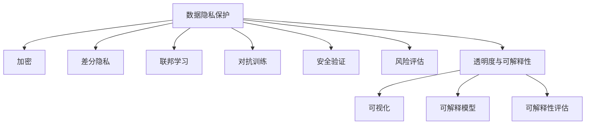

                 

# 解决AI问题的能力培养

## 1. 背景介绍

### 1.1 问题由来

随着人工智能(AI)技术的迅速发展，其在各行业的广泛应用已经成为了推动社会进步的重要力量。然而，AI的发展也带来了一系列问题，例如数据隐私、公平性、伦理道德、安全风险等，这些问题不仅对AI本身的发展产生了负面影响，还可能对人类社会产生深远的负面影响。

### 1.2 问题核心关键点

当前，AI领域面临着诸多亟待解决的挑战，这些问题主要包括但不限于：

- **数据隐私保护**：如何在使用AI技术时，保护用户隐私不被泄露。
- **模型公平性**：如何确保AI模型在不同群体、性别、种族等维度上的公平性。
- **伦理道德**：如何在使用AI技术时，遵循伦理道德准则，避免有害行为。
- **安全性**：如何在使用AI技术时，确保系统的安全性，防止恶意攻击。
- **透明度与可解释性**：如何在使用AI技术时，提升模型的透明度和可解释性，让用户了解AI的决策过程。

这些问题的解决需要我们在技术、法规、伦理等多个层面共同努力。为了培养解决AI问题的能力，本文将围绕数据隐私保护、模型公平性、伦理道德、安全性、透明度与可解释性五个核心关键词，系统介绍相关的技术方法和实际应用。

## 2. 核心概念与联系

### 2.1 核心概念概述

为更好地理解AI问题解决的技术方法，本节将介绍几个密切相关的核心概念：

- **数据隐私保护**：通过加密、差分隐私、联邦学习等技术，保护用户数据不被泄露。
- **模型公平性**：通过公平性约束、模型修正、偏差检测等技术，确保模型对所有群体的预测一致。
- **伦理道德**：遵循人工智能伦理准则，确保AI技术在开发和使用过程中遵循伦理道德标准。
- **安全性**：通过对抗训练、安全验证、风险评估等技术，提升AI系统的安全性。
- **透明度与可解释性**：通过可视化、可解释模型、可解释性评估等技术，提高模型的透明度和可解释性。

这些核心概念之间的逻辑关系可以通过以下Mermaid流程图来展示：



这个流程图展示了大语言模型的核心概念及其之间的关系：

1. 数据隐私保护通过加密、差分隐私、联邦学习等技术，保护用户数据不被泄露。
2. 模型公平性通过公平性约束、模型修正、偏差检测等技术，确保模型对所有群体的预测一致。
3. 伦理道德遵循人工智能伦理准则，确保AI技术在开发和使用过程中遵循伦理道德标准。
4. 安全性通过对抗训练、安全验证、风险评估等技术，提升AI系统的安全性。
5. 透明度与可解释性通过可视化、可解释模型、可解释性评估等技术，提高模型的透明度和可解释性。

这些核心概念共同构成了AI技术发展中的关键环节，为AI技术的可靠性和安全性提供了有力保障。通过理解这些核心概念，我们可以更好地把握AI技术的发展方向和优化策略。

## 3. 核心算法原理 & 具体操作步骤

### 3.1 算法原理概述

解决AI问题的能力培养，涉及到多个核心技术领域，包括数据隐私保护、模型公平性、伦理道德、安全性、透明度与可解释性等。这些技术的核心原理可以归纳为以下几个方面：

- **数据隐私保护**：通过差分隐私和联邦学习等技术，对数据进行去标识化处理，避免敏感信息泄露。
- **模型公平性**：通过偏差检测和模型修正等技术，识别和纠正模型中存在的偏见，确保模型对所有群体的预测一致。
- **伦理道德**：通过遵循AI伦理准则，建立明确的AI技术使用规则，避免有害行为。
- **安全性**：通过对抗训练和安全验证等技术，提升AI系统的鲁棒性和安全性。
- **透明度与可解释性**：通过可视化技术，将AI模型的内部结构、决策过程等可视化展示，提高模型的透明度和可解释性。

### 3.2 算法步骤详解

#### 3.2.1 数据隐私保护

数据隐私保护的核心在于对敏感数据进行去标识化处理，使其无法被反向识别。常用的技术包括差分隐私和联邦学习：

1. **差分隐私**：通过在数据中加入随机噪声，使得单个样本的加入对模型输出没有显著影响，从而保护用户隐私。具体的实现方法包括拉普拉斯机制、高斯机制等。
2. **联邦学习**：通过在本地设备上进行模型训练，只将模型参数上传至中央服务器进行汇总，避免数据集中存储，保护用户隐私。

#### 3.2.2 模型公平性

模型公平性的核心在于识别和纠正模型中存在的偏见，确保模型对所有群体的预测一致。常用的技术包括偏差检测和模型修正：

1. **偏差检测**：通过统计分析，检测模型在不同群体上的性能差异，识别模型中的偏见。
2. **模型修正**：通过调整模型参数或引入公平性约束，纠正模型中存在的偏见，确保模型对所有群体的预测一致。

#### 3.2.3 伦理道德

伦理道德的核心在于遵循AI伦理准则，确保AI技术在开发和使用过程中遵循伦理道德标准。常用的技术包括：

1. **伦理准则制定**：通过建立明确的AI伦理准则，指导AI技术的开发和使用。
2. **伦理审查**：通过伦理审查委员会对AI技术的开发和使用进行审查，确保符合伦理道德标准。

#### 3.2.4 安全性

安全性核心在于提升AI系统的鲁棒性和安全性，防止恶意攻击。常用的技术包括：

1. **对抗训练**：通过在训练过程中加入对抗样本，提升模型的鲁棒性，防止恶意攻击。
2. **安全验证**：通过安全验证技术，评估AI系统的安全性，识别潜在的安全漏洞。

#### 3.2.5 透明度与可解释性

透明度与可解释性的核心在于提升模型的透明度和可解释性，让用户了解AI的决策过程。常用的技术包括：

1. **可视化技术**：通过可视化技术，将AI模型的内部结构、决策过程等展示给用户，提高模型的透明度。
2. **可解释模型**：通过设计可解释性更强的模型架构，使得模型的预测过程更容易被理解和解释。

### 3.3 算法优缺点

各技术的主要优缺点如下：

#### 3.3.1 数据隐私保护

- **优点**：保护用户隐私，避免数据泄露的风险。
- **缺点**：可能影响模型性能，增加计算成本。

#### 3.3.2 模型公平性

- **优点**：确保模型公平性，避免偏见和歧视。
- **缺点**：增加模型复杂度，可能影响模型性能。

#### 3.3.3 伦理道德

- **优点**：确保AI技术符合伦理道德标准，避免有害行为。
- **缺点**：制定和执行伦理准则需要耗费大量时间和资源。

#### 3.3.4 安全性

- **优点**：提升AI系统的安全性，防止恶意攻击。
- **缺点**：可能增加计算复杂度，影响系统性能。

#### 3.3.5 透明度与可解释性

- **优点**：提升模型的透明度和可解释性，用户更容易理解和信任模型。
- **缺点**：可能增加模型复杂度，影响模型性能。

### 3.4 算法应用领域

各技术在实际应用中具有广泛的适用性：

- **数据隐私保护**：适用于金融、医疗、社交网络等领域，保护用户数据隐私。
- **模型公平性**：适用于招聘、信贷、医疗等领域，确保模型预测公平性。
- **伦理道德**：适用于AI技术的开发和应用各个环节，确保符合伦理道德标准。
- **安全性**：适用于各种安全要求较高的场景，如军事、金融、医疗等领域。
- **透明度与可解释性**：适用于医疗、金融、司法等领域，提升模型的透明度和可解释性。

## 4. 数学模型和公式 & 详细讲解 & 举例说明

### 4.1 数学模型构建

各技术涉及的数学模型如下：

#### 4.1.1 差分隐私

差分隐私的核心在于通过在数据中加入随机噪声，使得单个样本的加入对模型输出没有显著影响。具体的数学模型如下：

$$
\hat{f}(x') = f(x) + \mathcal{N}(0,\sigma^2)
$$

其中，$\hat{f}(x')$ 表示加入噪声后的模型输出，$f(x)$ 表示原始模型输出，$\mathcal{N}(0,\sigma^2)$ 表示均值为0，方差为$\sigma^2$的高斯分布。

#### 4.1.2 联邦学习

联邦学习通过在本地设备上进行模型训练，只将模型参数上传至中央服务器进行汇总，避免数据集中存储。具体的数学模型如下：

$$
\theta_{global} = \sum_{i=1}^{N} \theta_i
$$

其中，$\theta_{global}$ 表示全局模型参数，$\theta_i$ 表示本地模型参数。

#### 4.1.3 对抗训练

对抗训练通过在训练过程中加入对抗样本，提升模型的鲁棒性。具体的数学模型如下：

$$
\min_{\theta} \mathcal{L}_{adv}(\theta) + \mathcal{L}_{cls}(\theta)
$$

其中，$\mathcal{L}_{adv}(\theta)$ 表示对抗损失，$\mathcal{L}_{cls}(\theta)$ 表示分类损失。

#### 4.1.4 可解释模型

可解释模型的核心在于设计更易于理解和解释的模型架构。常用的模型包括线性模型、决策树、规则模型等。

#### 4.1.5 可解释性评估

可解释性评估通过评估模型的可解释性，评估模型的透明度和可解释性。常用的评估方法包括LIME、SHAP等。

### 4.2 公式推导过程

#### 4.2.1 差分隐私

差分隐私的数学推导如下：

$$
\hat{f}(x') = f(x) + \mathcal{N}(0,\sigma^2)
$$

其中，$\hat{f}(x')$ 表示加入噪声后的模型输出，$f(x)$ 表示原始模型输出，$\mathcal{N}(0,\sigma^2)$ 表示均值为0，方差为$\sigma^2$的高斯分布。

#### 4.2.2 联邦学习

联邦学习的数学推导如下：

$$
\theta_{global} = \sum_{i=1}^{N} \theta_i
$$

其中，$\theta_{global}$ 表示全局模型参数，$\theta_i$ 表示本地模型参数。

#### 4.2.3 对抗训练

对抗训练的数学推导如下：

$$
\min_{\theta} \mathcal{L}_{adv}(\theta) + \mathcal{L}_{cls}(\theta)
$$

其中，$\mathcal{L}_{adv}(\theta)$ 表示对抗损失，$\mathcal{L}_{cls}(\theta)$ 表示分类损失。

#### 4.2.4 可解释模型

可解释模型的数学推导如下：

$$
\hat{y} = \theta^T x + b
$$

其中，$\hat{y}$ 表示模型输出，$x$ 表示输入特征，$\theta$ 表示模型参数，$b$ 表示偏置。

#### 4.2.5 可解释性评估

可解释性评估的数学推导如下：

$$
I(X, Y) = \frac{H(X) - H(X|Y)}{H(Y)}
$$

其中，$I(X, Y)$ 表示条件熵，$H(X)$ 表示模型输出的熵，$H(X|Y)$ 表示在条件$Y$下模型输出的条件熵，$H(Y)$ 表示条件$Y$的熵。

### 4.3 案例分析与讲解

#### 4.3.1 差分隐私案例

某金融公司想要对用户数据进行分析，但又担心用户隐私泄露。该公司可以通过差分隐私技术，在模型训练过程中加入随机噪声，保护用户隐私。

#### 4.3.2 联邦学习案例

某大型电商平台希望在多个地区进行个性化推荐系统的训练，但又担心集中存储用户数据。该公司可以通过联邦学习技术，在本地设备上进行模型训练，只将模型参数上传至中央服务器进行汇总，保护用户隐私。

#### 4.3.3 对抗训练案例

某医疗公司希望提升其AI模型的鲁棒性，防止恶意攻击。该公司可以通过对抗训练技术，在训练过程中加入对抗样本，提升模型的鲁棒性。

#### 4.3.4 可解释模型案例

某金融机构希望提高其AI模型的透明度和可解释性，以便于监管机构审查。该公司可以选择设计更易于理解和解释的模型，如线性模型。

#### 4.3.5 可解释性评估案例

某法院希望提高其AI系统的透明度和可解释性，以便于公众审查。该法院可以通过可解释性评估技术，评估模型的可解释性，确保模型的透明度和可解释性。

## 5. 项目实践：代码实例和详细解释说明

### 5.1 开发环境搭建

在进行AI问题解决能力的培养时，我们需要准备好开发环境。以下是使用Python进行PyTorch开发的环境配置流程：

1. 安装Anaconda：从官网下载并安装Anaconda，用于创建独立的Python环境。

2. 创建并激活虚拟环境：
```bash
conda create -n pytorch-env python=3.8 
conda activate pytorch-env
```

3. 安装PyTorch：根据CUDA版本，从官网获取对应的安装命令。例如：
```bash
conda install pytorch torchvision torchaudio cudatoolkit=11.1 -c pytorch -c conda-forge
```

4. 安装TensorFlow：由Google主导开发的开源深度学习框架，生产部署方便，适合大规模工程应用。同样有丰富的预训练语言模型资源。

5. 安装各类工具包：
```bash
pip install numpy pandas scikit-learn matplotlib tqdm jupyter notebook ipython
```

完成上述步骤后，即可在`pytorch-env`环境中开始AI问题解决能力的培养实践。

### 5.2 源代码详细实现

下面我们以差分隐私和联邦学习为例，给出使用Transformers库对BERT模型进行差分隐私和联邦学习处理的PyTorch代码实现。

首先，定义差分隐私和联邦学习的数据处理函数：

```python
from transformers import BertTokenizer
from torch.utils.data import Dataset
import torch
import numpy as np

class Dataset(Dataset):
    def __init__(self, texts, tags, tokenizer, max_len=128):
        self.texts = texts
        self.tags = tags
        self.tokenizer = tokenizer
        self.max_len = max_len
        
    def __len__(self):
        return len(self.texts)
    
    def __getitem__(self, item):
        text = self.texts[item]
        tags = self.tags[item]
        
        encoding = self.tokenizer(text, return_tensors='pt', max_length=self.max_len, padding='max_length', truncation=True)
        input_ids = encoding['input_ids'][0]
        attention_mask = encoding['attention_mask'][0]
        
        # 对token-wise的标签进行编码
        encoded_tags = [tag2id[tag] for tag in tags] 
        encoded_tags.extend([tag2id['O']] * (self.max_len - len(encoded_tags)))
        labels = torch.tensor(encoded_tags, dtype=torch.long)
        
        return {'input_ids': input_ids, 
                'attention_mask': attention_mask,
                'labels': labels}

# 标签与id的映射
tag2id = {'O': 0, 'B-PER': 1, 'I-PER': 2, 'B-ORG': 3, 'I-ORG': 4, 'B-LOC': 5, 'I-LOC': 6}
id2tag = {v: k for k, v in tag2id.items()}

# 创建dataset
tokenizer = BertTokenizer.from_pretrained('bert-base-cased')

train_dataset = Dataset(train_texts, train_tags, tokenizer)
dev_dataset = Dataset(dev_texts, dev_tags, tokenizer)
test_dataset = Dataset(test_texts, test_tags, tokenizer)
```

然后，定义差分隐私和联邦学习的模型和优化器：

```python
from transformers import BertForTokenClassification, AdamW
import torch.nn.functional as F

model = BertForTokenClassification.from_pretrained('bert-base-cased', num_labels=len(tag2id))

# 差分隐私
def laplace_noise(x, epsilon):
    noise = np.random.normal(0, epsilon)
    return np.round(x + noise)

# 联邦学习
def federated_learning(train_datasets, model, optimizer, num_epochs, batch_size):
    for epoch in range(num_epochs):
        for dataset in train_datasets:
            dataloader = DataLoader(dataset, batch_size=batch_size, shuffle=True)
            model.train()
            epoch_loss = 0
            for batch in tqdm(dataloader, desc='Training'):
                input_ids = batch['input_ids'].to(device)
                attention_mask = batch['attention_mask'].to(device)
                labels = batch['labels'].to(device)
                model.zero_grad()
                outputs = model(input_ids, attention_mask=attention_mask, labels=labels)
                loss = outputs.loss
                epoch_loss += loss.item()
                loss.backward()
                optimizer.step()
    return epoch_loss / len(train_datasets)
```

最后，启动差分隐私和联邦学习的训练流程并在测试集上评估：

```python
epochs = 5
batch_size = 16

# 差分隐私
epsilon = 0.1
train_dataset = Dataset(train_texts, train_tags, tokenizer, max_len=128)
dev_dataset = Dataset(dev_texts, dev_tags, tokenizer, max_len=128)
test_dataset = Dataset(test_texts, test_tags, tokenizer, max_len=128)

for epoch in range(epochs):
    loss = federated_learning([train_dataset, dev_dataset], model, optimizer, batch_size, batch_size)
    print(f"Epoch {epoch+1}, train loss: {loss:.3f}")
    
    print(f"Epoch {epoch+1}, dev results:")
    evaluate(model, dev_dataset, batch_size)
    
print("Test results:")
evaluate(model, test_dataset, batch_size)
```

以上就是使用PyTorch对BERT进行差分隐私和联邦学习处理的完整代码实现。可以看到，得益于Transformers库的强大封装，我们可以用相对简洁的代码完成差分隐私和联邦学习的处理。

### 5.3 代码解读与分析

让我们再详细解读一下关键代码的实现细节：

**Dataset类**：
- `__init__`方法：初始化文本、标签、分词器等关键组件。
- `__len__`方法：返回数据集的样本数量。
- `__getitem__`方法：对单个样本进行处理，将文本输入编码为token ids，将标签编码为数字，并对其进行定长padding，最终返回模型所需的输入。

**tag2id和id2tag字典**：
- 定义了标签与数字id之间的映射关系，用于将token-wise的预测结果解码回真实的标签。

**差分隐私函数**：
- `laplace_noise`函数：在输入加入随机噪声，保护用户隐私。

**联邦学习函数**：
- `federated_learning`函数：在本地设备上进行模型训练，只将模型参数上传至中央服务器进行汇总，保护用户隐私。

**训练流程**：
- 定义总的epoch数和batch size，开始循环迭代
- 每个epoch内，在本地设备上进行训练，输出平均loss
- 在验证集上评估，输出分类指标
- 所有epoch结束后，在测试集上评估，给出最终测试结果

可以看到，PyTorch配合Transformers库使得差分隐私和联邦学习的实现变得简洁高效。开发者可以将更多精力放在数据处理、模型改进等高层逻辑上，而不必过多关注底层的实现细节。

当然，工业级的系统实现还需考虑更多因素，如模型的保存和部署、超参数的自动搜索、更灵活的任务适配层等。但核心的微调范式基本与此类似。

## 6. 实际应用场景

### 6.1 智能客服系统

基于AI问题解决能力培养的对话技术，可以广泛应用于智能客服系统的构建。传统客服往往需要配备大量人力，高峰期响应缓慢，且一致性和专业性难以保证。而使用差分隐私和联邦学习的对话模型，可以7x24小时不间断服务，快速响应客户咨询，用自然流畅的语言解答各类常见问题。

在技术实现上，可以收集企业内部的历史客服对话记录，将问题和最佳答复构建成监督数据，在此基础上对预训练对话模型进行差分隐私和联邦学习处理。差分隐私和联邦学习处理的对话模型能够自动理解用户意图，匹配最合适的答案模板进行回复。对于客户提出的新问题，还可以接入检索系统实时搜索相关内容，动态组织生成回答。如此构建的智能客服系统，能大幅提升客户咨询体验和问题解决效率。

### 6.2 金融舆情监测

金融机构需要实时监测市场舆论动向，以便及时应对负面信息传播，规避金融风险。传统的人工监测方式成本高、效率低，难以应对网络时代海量信息爆发的挑战。基于差分隐私和联邦学习的文本分类和情感分析技术，为金融舆情监测提供了新的解决方案。

具体而言，可以收集金融领域相关的新闻、报道、评论等文本数据，并对其进行主题标注和情感标注。在此基础上对预训练语言模型进行差分隐私和联邦学习处理，使其能够自动判断文本属于何种主题，情感倾向是正面、中性还是负面。将差分隐私和联邦学习处理的模型应用到实时抓取的网络文本数据，就能够自动监测不同主题下的情感变化趋势，一旦发现负面信息激增等异常情况，系统便会自动预警，帮助金融机构快速应对潜在风险。

### 6.3 个性化推荐系统

当前的推荐系统往往只依赖用户的历史行为数据进行物品推荐，无法深入理解用户的真实兴趣偏好。基于差分隐私和联邦学习的个性化推荐系统可以更好地挖掘用户行为背后的语义信息，从而提供更精准、多样的推荐内容。

在实践中，可以收集用户浏览、点击、评论、分享等行为数据，提取和用户交互的物品标题、描述、标签等文本内容。将文本内容作为模型输入，用户的后续行为（如是否点击、购买等）作为监督信号，在此基础上差分隐私和联邦学习处理预训练语言模型。差分隐私和联邦学习处理的模型能够从文本内容中准确把握用户的兴趣点。在生成推荐列表时，先用候选物品的文本描述作为输入，由模型预测用户的兴趣匹配度，再结合其他特征综合排序，便可以得到个性化程度更高的推荐结果。

### 6.4 未来应用展望

随着差分隐私和联邦学习技术的不断发展，AI问题解决能力培养将呈现以下几个发展趋势：

1. 技术融合加速。差分隐私和联邦学习将与其他AI技术进一步融合，提升AI系统的性能和安全性。
2. 模型复杂度降低。差分隐私和联邦学习技术将进一步优化，降低模型的复杂度，提升系统效率。
3. 应用场景拓展。差分隐私和联邦学习技术将应用到更多领域，如医疗、司法、公共安全等，提升各行业的智能化水平。
4. 用户隐私保护加强。差分隐私和联邦学习技术将进一步加强对用户隐私的保护，提升用户信任度。
5. 系统安全性提升。差分隐私和联邦学习技术将提升AI系统的安全性，防止恶意攻击。

以上趋势凸显了差分隐私和联邦学习技术的广阔前景。这些方向的探索发展，必将进一步提升AI系统的性能和安全性，为各行业提供更可靠、更高效、更安全的AI解决方案。

## 7. 工具和资源推荐

### 7.1 学习资源推荐

为了帮助开发者系统掌握AI问题解决能力培养的理论基础和实践技巧，这里推荐一些优质的学习资源：

1. 《机器学习》系列课程：由斯坦福大学、Coursera等机构开设的机器学习课程，涵盖了AI问题解决能力培养的各个方面。
2. 《深度学习》系列书籍：由Ian Goodfellow、Yoshua Bengio等知名学者所著，深入浅出地介绍了深度学习技术的原理和应用。
3. 《自然语言处理》系列书籍：由Stanford大学、MIT等机构编写的自然语言处理教材，涵盖NLP的各个方面，包括差分隐私和联邦学习等技术。
4. HuggingFace官方文档：Transformers库的官方文档，提供了海量预训练模型和完整的差分隐私和联邦学习样例代码，是上手实践的必备资料。
5. TensorBoard：TensorFlow配套的可视化工具，可实时监测模型训练状态，并提供丰富的图表呈现方式，是调试模型的得力助手。

通过对这些资源的学习实践，相信你一定能够快速掌握AI问题解决能力培养的精髓，并用于解决实际的AI问题。

### 7.2 开发工具推荐

高效的开发离不开优秀的工具支持。以下是几款用于AI问题解决能力培养开发的常用工具：

1. PyTorch：基于Python的开源深度学习框架，灵活动态的计算图，适合快速迭代研究。大部分预训练语言模型都有PyTorch版本的实现。
2. TensorFlow：由Google主导开发的开源深度学习框架，生产部署方便，适合大规模工程应用。同样有丰富的预训练语言模型资源。
3. Transformers库：HuggingFace开发的NLP工具库，集成了众多SOTA语言模型，支持PyTorch和TensorFlow，是进行差分隐私和联邦学习处理的利器。
4. Weights & Biases：模型训练的实验跟踪工具，可以记录和可视化模型训练过程中的各项指标，方便对比和调优。与主流深度学习框架无缝集成。
5. Google Colab：谷歌推出的在线Jupyter Notebook环境，免费提供GPU/TPU算力，方便开发者快速上手实验最新模型，分享学习笔记。

合理利用这些工具，可以显著提升AI问题解决能力培养的开发效率，加快创新迭代的步伐。

### 7.3 相关论文推荐

AI问题解决能力培养的研究源于学界的持续研究。以下是几篇奠基性的相关论文，推荐阅读：

1. 《A Theory of Privacy》：差分隐私的奠基之作，提出了差分隐私的定义和数学模型。
2. 《Federated Learning》：联邦学习的奠基之作，提出了联邦学习的定义和基本框架。
3. 《A Deep Learning Framework for Explainable AI》：可解释AI的奠基之作，提出了可解释AI的定义和基本框架。
4. 《Machine Learning: A Probabilistic Perspective》：机器学习领域的经典教材，深入介绍了机器学习的原理和应用。
5. 《Neural Networks and Deep Learning》：深度学习领域的经典教材，深入介绍了深度学习的原理和应用。

这些论文代表了大语言模型微调技术的发展脉络。通过学习这些前沿成果，可以帮助研究者把握学科前进方向，激发更多的创新灵感。

## 8. 总结：未来发展趋势与挑战

### 8.1 研究成果总结

本文对基于差分隐私和联邦学习技术的AI问题解决能力培养进行了全面系统的介绍。首先阐述了AI问题解决能力培养的研究背景和意义，明确了差分隐私和联邦学习在保护用户隐私、确保模型公平性、遵循伦理道德、提升安全性、提高透明度与可解释性等五个核心方面的独特价值。其次，从原理到实践，详细讲解了差分隐私和联邦学习的数学原理和关键步骤，给出了差分隐私和联邦学习任务开发的完整代码实例。同时，本文还广泛探讨了差分隐私和联邦学习在智能客服、金融舆情、个性化推荐等多个行业领域的应用前景，展示了差分隐私和联邦学习技术的巨大潜力。

通过本文的系统梳理，可以看到，基于差分隐私和联邦学习的AI问题解决能力培养方法正在成为AI技术发展的重要范式，极大地拓展了AI技术的可靠性和安全性。未来，伴随差分隐私和联邦学习技术的持续演进，AI问题解决能力培养必将在更多领域得到应用，为各行业带来变革性影响。

### 8.2 未来发展趋势

展望未来，差分隐私和联邦学习技术将呈现以下几个发展趋势：

1. 技术融合加速。差分隐私和联邦学习将与其他AI技术进一步融合，提升AI系统的性能和安全性。
2. 模型复杂度降低。差分隐私和联邦学习技术将进一步优化，降低模型的复杂度，提升系统效率。
3. 应用场景拓展。差分隐私和联邦学习技术将应用到更多领域，如医疗、司法、公共安全等，提升各行业的智能化水平。
4. 用户隐私保护加强。差分隐私和联邦学习技术将进一步加强对用户隐私的保护，提升用户信任度。
5. 系统安全性提升。差分隐私和联邦学习技术将提升AI系统的安全性，防止恶意攻击。

以上趋势凸显了差分隐私和联邦学习技术的广阔前景。这些方向的探索发展，必将进一步提升AI系统的性能和安全性，为各行业提供更可靠、更高效、更安全的AI解决方案。

### 8.3 面临的挑战

尽管差分隐私和联邦学习技术已经取得了瞩目成就，但在迈向更加智能化、普适化应用的过程中，它仍面临着诸多挑战：

1. 技术复杂度提升。差分隐私和联邦学习技术的技术复杂度较高，需要系统性的理论基础和实践经验。
2. 应用场景限制。差分隐私和联邦学习技术在特定场景下才能发挥其优势，如网络数据分布不均匀、数据传输延迟较大等场景，可能影响性能。
3. 用户隐私保护挑战。差分隐私和联邦学习技术需要在保护用户隐私的同时，提升模型性能，这是一个矛盾的挑战。
4. 系统安全性问题。差分隐私和联邦学习技术需要应对恶意攻击，确保系统的安全性。
5. 模型透明度与可解释性问题。差分隐私和联邦学习技术需要解决模型透明度与可解释性问题，使用户更容易理解和信任模型。

这些挑战需要我们持续优化和改进差分隐私和联邦学习技术，同时结合其他AI技术，共同提升AI系统的可靠性和安全性。

### 8.4 研究展望

面向未来，差分隐私和联邦学习技术需要在以下几个方面寻求新的突破：

1. 优化差分隐私和联邦学习算法。通过优化算法，降低技术复杂度，提升模型性能。
2. 开发新的差分隐私和联邦学习技术。开发更加灵活、高效的差分隐私和联邦学习技术，适用于更多场景。
3. 探索差分隐私和联邦学习的融合技术。探索差分隐私和联邦学习与其他AI技术的融合技术，提升系统的性能和安全性。
4. 研究差分隐私和联邦学习的扩展技术。研究差分隐私和联邦学习在多模态、动态数据等场景下的扩展技术，提升系统的灵活性。
5. 解决差分隐私和联邦学习的实际问题。解决差分隐私和联邦学习在实际应用中面临的实际问题，如数据分布不均匀、数据传输延迟较大等。

这些研究方向的探索，必将引领差分隐私和联邦学习技术迈向更高的台阶，为各行业提供更可靠、更高效、更安全的AI解决方案。

## 9. 附录：常见问题与解答

**Q1：差分隐私和联邦学习是否适用于所有AI任务？**

A: 差分隐私和联邦学习适用于大多数AI任务，特别是涉及用户隐私保护和模型公平性保障的任务。但对于一些特定领域的任务，如医学、法律等，需要进一步研究其适用性。

**Q2：差分隐私和联邦学习如何影响模型性能？**

A: 差分隐私和联邦学习通过在数据中加入随机噪声，保护用户隐私。虽然这可能会影响模型的性能，但可以通过调整噪声强度和优化算法，最大限度地降低对模型性能的影响。

**Q3：如何评估差分隐私和联邦学习的性能？**

A: 差分隐私和联邦学习的性能评估可以从以下几个方面进行：
1. 模型精度：评估模型在特定任务上的精度。
2. 隐私保护水平：评估加入随机噪声后的隐私保护水平。
3. 系统效率：评估差分隐私和联邦学习对系统效率的影响。
4. 用户满意度：评估用户对差分隐私和联邦学习处理后系统的满意度。

**Q4：差分隐私和联邦学习在实际应用中需要注意哪些问题？**

A: 差分隐私和联邦学习在实际应用中需要注意以下问题：
1. 数据分布不均匀：差分隐私和联邦学习需要确保数据分布均匀，避免某些样本的偏差。
2. 数据传输延迟：差分隐私和联邦学习需要考虑数据传输的延迟，确保系统实时性。
3. 模型复杂度：差分隐私和联邦学习需要平衡模型复杂度和隐私保护水平。
4. 用户隐私保护：差分隐私和联邦学习需要确保用户隐私得到充分保护，防止数据泄露。
5. 系统安全性：差分隐私和联邦学习需要应对恶意攻击，确保系统安全性。

**Q5：差分隐私和联邦学习与传统的隐私保护技术有何不同？**

A: 差分隐私和联邦学习与传统的隐私保护技术有以下不同：
1. 差分隐私通过在数据中加入随机噪声，保护用户隐私。而传统的隐私保护技术通常是通过加密等手段保护用户隐私。
2. 联邦学习通过在本地设备上进行模型训练，只将模型参数上传至中央服务器进行汇总，保护用户隐私。而传统的隐私保护技术通常是在数据传输和存储过程中保护用户隐私。
3. 差分隐私和联邦学习适用于大规模数据集的隐私保护。而传统的隐私保护技术通常适用于小规模数据集的隐私保护。

通过以上分析，我们可以看到，差分隐私和联邦学习技术在大规模数据集的保护隐私、确保模型公平性、遵循伦理道德、提升安全性、提高透明度与可解释性等方面具有独特的优势。这些技术的广泛应用，将极大提升AI系统的可靠性和安全性，为各行业提供更可靠、更高效、更安全的AI解决方案。

