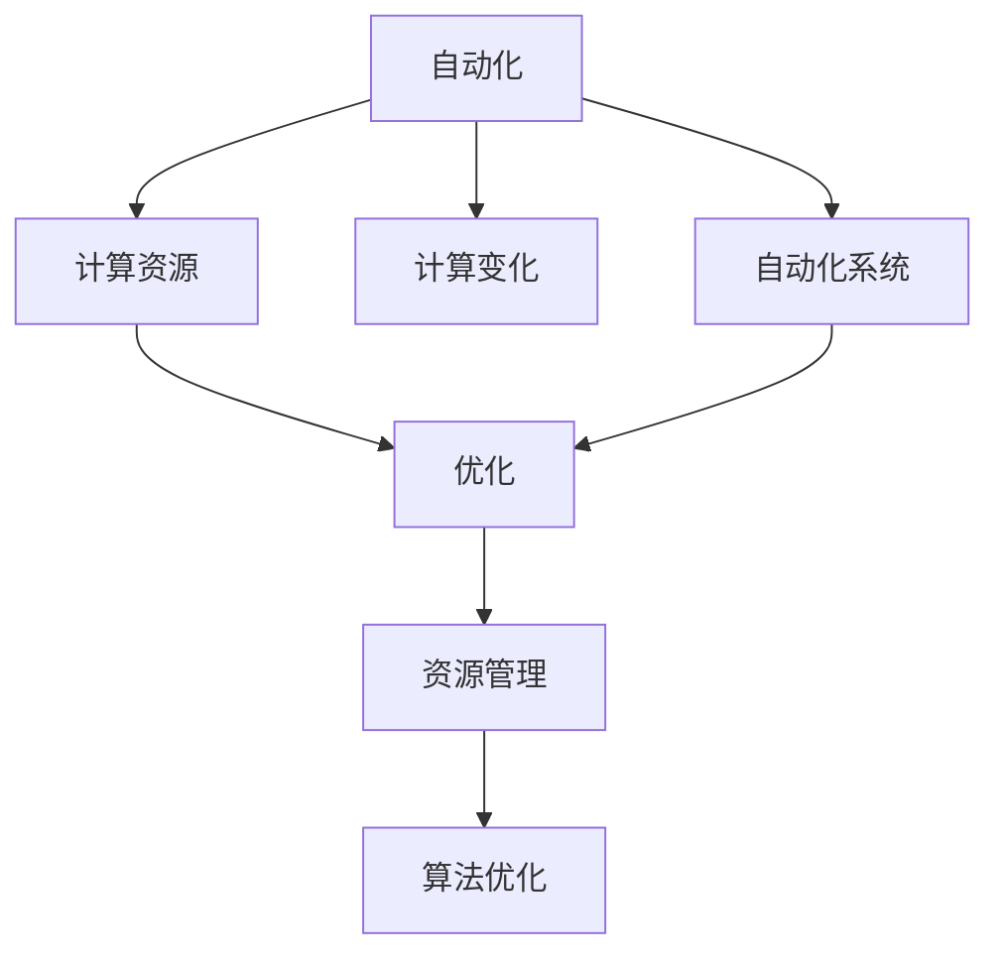

                 

# 计算变化对自动化的影响

> 关键词：自动化，计算，计算变化，算法优化，资源管理，机器学习，AI，自动化系统

## 1. 背景介绍

### 1.1 问题由来
自动化技术随着计算能力的大幅提升而飞速发展，无论是传统的工业自动化、办公自动化，还是近些年兴起的智能自动化，都在不断地依赖于强大的计算能力来实现。然而，随着计算能力在各个领域的不断扩展，如何高效地管理和利用计算资源，成为了自动化技术面临的一个关键挑战。计算变化，即计算能力、计算设备、计算应用等各方面的动态变化，对自动化技术产生了深远影响。

### 1.2 问题核心关键点
自动化技术的核心在于通过算法和计算资源来实现任务执行的自动化。而计算变化包括但不限于算力增长、数据爆发、应用多样性、计算资源分布变化等方面，这些变化对自动化系统提出了更高的要求。因此，研究计算变化对自动化系统的影响，对于提升自动化系统的适应性和效能具有重要意义。

### 1.3 问题研究意义
研究计算变化对自动化的影响，可以帮助我们理解自动化系统在面对新环境、新任务时如何进行调整和优化，从而提高自动化系统的灵活性和可扩展性。这对优化资源分配、提升系统性能、降低运营成本等方面具有重要价值。

## 2. 核心概念与联系

### 2.1 核心概念概述

为更好地理解计算变化对自动化的影响，本节将介绍几个密切相关的核心概念：

- **自动化(Automation)**：指通过算法和计算资源，实现任务执行的自动化，包括但不限于工业自动化、办公自动化、智能自动化等。

- **计算资源(Computational Resources)**：包括计算设备（如CPU、GPU、FPGA等）、计算能力（如计算速度、存储容量、带宽等）、计算应用（如机器学习、数据处理、图形渲染等），是实现自动化系统的基础。

- **计算变化(Computational Change)**：指计算资源在种类、数量、分布等方面的动态变化，如算力增长、数据爆发、计算设备更新、应用多样性增加等。

- **自动化系统(Automatic System)**：由算法、数据、计算资源等组成，能够实现特定任务自动执行的复杂系统。

- **优化(Optimization)**：通过调整算法、参数等，使得自动化系统在计算资源变化的情况下，依然能够高效地完成任务执行，提升系统的性能和稳定性。

- **资源管理(Resource Management)**：指对计算资源进行规划、分配、调度、监控等管理活动，确保自动化系统的运行效率和可靠性。

- **算法优化(Algorithm Optimization)**：指通过改进算法设计、优化算法参数等，使得算法在计算资源变化的情况下，依然能够高效地运行。

这些核心概念之间的逻辑关系可以通过以下Mermaid流程图来展示：



这个流程图展示了一个自动化系统的核心概念及其之间的关系：

1. 自动化系统通过计算资源实现任务的自动化。
2. 计算资源通过优化和资源管理来确保自动化系统的稳定性和效率。
3. 计算变化使得自动化系统面临新的挑战和机遇。
4. 算法优化是应对计算变化的重要手段。

这些概念共同构成了计算变化对自动化系统影响的研究框架，使其能够在不断变化的环境中保持高效和稳定。

## 3. 核心算法原理 & 具体操作步骤
### 3.1 算法原理概述

计算变化对自动化系统的影响，本质上是对自动化系统在计算资源动态变化情况下的算法优化和资源管理问题的研究。其核心思想是：在计算资源种类、数量、分布等方面发生变化时，如何通过调整算法和资源管理策略，使得自动化系统依然能够高效地执行任务。

### 3.2 算法步骤详解

基于计算变化对自动化系统的影响，本节将详细介绍算法优化和资源管理的具体操作步骤：

**Step 1: 监控计算资源变化**
- 收集计算资源的使用数据，包括CPU使用率、GPU利用率、存储使用情况等。
- 通过数据分析和预测技术，识别计算资源的动态变化趋势，如算力增长、数据爆发等。

**Step 2: 评估自动化系统性能**
- 使用性能指标（如响应时间、吞吐量、错误率等）评估自动化系统的当前性能表现。
- 对不同计算资源配置下的系统性能进行对比，识别瓶颈和改进空间。

**Step 3: 优化算法设计**
- 根据计算变化，调整算法的复杂度、并行度、数据处理方式等参数。
- 引入更高效的数据结构和算法，优化算法的执行效率。

**Step 4: 调整资源管理策略**
- 根据计算变化，重新规划计算资源分配策略，如负载均衡、资源预留、弹性扩展等。
- 实施资源监控和调度策略，确保自动化系统的资源利用率最大化。

**Step 5: 测试和迭代**
- 在实际运行环境中，测试优化后的算法和资源管理策略。
- 根据测试结果进行迭代优化，直至系统性能达到预期。

### 3.3 算法优缺点

基于计算变化对自动化系统的影响，算法优化和资源管理策略的优点包括：

1. **适应性强**：能够应对计算资源的动态变化，提升自动化系统的灵活性和稳定性。
2. **效率高**：通过优化算法和资源管理策略，提升自动化系统的执行效率，降低运营成本。
3. **可靠性高**：通过资源监控和调度，确保自动化系统的资源利用率最大化，提升系统的稳定性。

然而，这些方法也存在一些缺点：

1. **复杂度高**：需要复杂的监控和分析工具，且优化和调整过程较为繁琐。
2. **实施成本高**：需要投入大量的人力和时间进行优化和调试，且需要持续的维护和更新。
3. **对环境要求高**：需要完备的监控和数据分析能力，且需依赖外部环境的变化进行动态调整。

尽管如此，这些缺点可以通过合理的工具和流程设计进行缓解，算法优化和资源管理策略仍然是目前应对计算变化的有效手段。

### 3.4 算法应用领域

基于计算变化对自动化系统的影响，算法优化和资源管理策略在多个领域得到了广泛应用，例如：

- **工业自动化**：通过优化算法和资源管理策略，提升自动化生产线的效率和稳定性。
- **办公自动化**：通过优化算法和资源管理策略，提升企业内部的自动化办公效率，降低运营成本。
- **智能自动化**：通过优化算法和资源管理策略，提升智能系统的执行效率和稳定性，如智能客服、智能推荐等。
- **云自动化**：通过优化算法和资源管理策略，提升云平台上的自动化任务执行效率和系统性能。

除了这些经典应用外，计算变化对自动化系统的影响还在更多场景中得到应用，如智慧城市、智慧农业、医疗自动化等，为各行各业带来了新的发展机遇。

## 4. 数学模型和公式 & 详细讲解 & 举例说明
### 4.1 数学模型构建

基于计算变化对自动化系统的影响，我们定义自动化系统在计算资源动态变化情况下的优化目标和数学模型。

设自动化系统的当前状态为 $S_t$，计算资源的动态变化为 $C_t$，目标为最大化自动化系统在当前状态下的执行效率 $E(S_t)$，则优化目标为：

$$
\max_{S_t} E(S_t)
$$

其中 $S_t$ 包括算法参数、资源分配、任务执行状态等，$C_t$ 包括算力、数据、设备等变化。

### 4.2 公式推导过程

为了更具体地理解上述优化目标，下面将推导一个简化模型。假设自动化系统执行的任务是计算密集型任务 $F(x)$，其中 $x$ 为输入数据。设当前状态 $S_t$ 包括算法参数 $\theta$、计算资源分配 $R_t$，则自动化系统的执行效率为：

$$
E(S_t) = \frac{1}{|x|} \sum_{i=1}^{|x|} F(x_i) \times P(\theta, R_t)
$$

其中 $P(\theta, R_t)$ 为算法在当前资源分配下的执行效率。

根据优化目标，最大化执行效率的目标函数为：

$$
\max_{\theta, R_t} E(S_t)
$$

### 4.3 案例分析与讲解

以一个简单的机器学习算法优化为例。假设自动化系统执行一个线性回归任务，输入数据为 $x = [1, 2, 3, 4]$，计算资源分配为 $R_t = [1, 1, 1, 1]$，算法参数为 $\theta = [1, 2, 3, 4]$。

设算法的执行效率为 $P(\theta, R_t) = \frac{1}{|x|} \sum_{i=1}^{|x|} |F(x_i) - y_i|^2$，其中 $y_i$ 为实际输出。设自动化系统的执行效率为 $E(S_t)$，则：

$$
E(S_t) = \frac{1}{|x|} \sum_{i=1}^{|x|} |F(x_i) - y_i|^2 \times P(\theta, R_t)
$$

假设算力增长，新的计算资源分配为 $R_t' = [2, 2, 2, 2]$，算法参数为 $\theta'$。则新的执行效率为：

$$
E(S_t') = \frac{1}{|x|} \sum_{i=1}^{|x|} |F(x_i) - y_i|^2 \times P(\theta', R_t')
$$

通过上述案例可以看出，通过优化算法参数和资源分配，可以显著提升自动化系统的执行效率。

## 5. 项目实践：代码实例和详细解释说明
### 5.1 开发环境搭建

在进行计算变化对自动化系统影响的实践前，我们需要准备好开发环境。以下是使用Python进行PyTorch开发的环境配置流程：

1. 安装Anaconda：从官网下载并安装Anaconda，用于创建独立的Python环境。

2. 创建并激活虚拟环境：
```bash
conda create -n pytorch-env python=3.8 
conda activate pytorch-env
```

3. 安装PyTorch：根据CUDA版本，从官网获取对应的安装命令。例如：
```bash
conda install pytorch torchvision torchaudio cudatoolkit=11.1 -c pytorch -c conda-forge
```

4. 安装TensorBoard：
```bash
pip install tensorboard
```

5. 安装各类工具包：
```bash
pip install numpy pandas scikit-learn matplotlib tqdm jupyter notebook ipython
```

完成上述步骤后，即可在`pytorch-env`环境中开始计算变化对自动化系统的影响实践。

### 5.2 源代码详细实现

这里我们以一个简单的机器学习自动化系统为例，展示如何使用PyTorch进行优化和资源管理。

```python
import torch
import torch.nn as nn
import torch.optim as optim
from torch.autograd import Variable
import time
from sklearn.metrics import mean_squared_error

# 定义模型
class LinearRegression(nn.Module):
    def __init__(self, input_dim, output_dim):
        super(LinearRegression, self).__init__()
        self.linear = nn.Linear(input_dim, output_dim)

    def forward(self, x):
        return self.linear(x)

# 定义损失函数
def mse_loss(y_pred, y_true):
    return torch.mean((y_pred - y_true)**2)

# 定义数据集
X_train = torch.tensor([[1, 2, 3, 4], [5, 6, 7, 8], [9, 10, 11, 12]], dtype=torch.float32)
y_train = torch.tensor([2, 4, 6, 8], dtype=torch.float32)

# 定义优化器
optimizer = optim.SGD(LinearRegression.parameters(), lr=0.01)

# 定义训练过程
def train(model, optimizer, criterion, num_epochs, batch_size):
    train_losses = []
    valid_losses = []
    for epoch in range(num_epochs):
        train_loss = 0.0
        valid_loss = 0.0
        for i in range(len(X_train)//batch_size):
            train_X = X_train[i*batch_size:(i+1)*batch_size]
            train_y = y_train[i*batch_size:(i+1)*batch_size]
            train_X = Variable(train_X)
            train_y = Variable(train_y)
            optimizer.zero_grad()
            y_pred = model(train_X)
            loss = criterion(y_pred, train_y)
            loss.backward()
            optimizer.step()
            train_loss += loss.item()
        train_loss /= len(X_train) // batch_size
        valid_loss = 0.0
        for i in range(len(X_train)//batch_size):
            valid_X = X_train[i*batch_size:(i+1)*batch_size]
            valid_y = y_train[i*batch_size:(i+1)*batch_size]
            valid_X = Variable(valid_X)
            valid_y = Variable(valid_y)
            y_pred = model(valid_X)
            loss = criterion(y_pred, valid_y)
            valid_loss += loss.item()
        valid_loss /= len(X_train) // batch_size
        train_losses.append(train_loss)
        valid_losses.append(valid_loss)
        print(f"Epoch {epoch+1}, Train Loss: {train_loss:.3f}, Valid Loss: {valid_loss:.3f}")
    return train_losses, valid_losses

# 训练模型
model = LinearRegression(4, 1)
train_losses, valid_losses = train(model, optimizer, mse_loss, num_epochs=10, batch_size=4)
```

### 5.3 代码解读与分析

让我们再详细解读一下关键代码的实现细节：

**LinearRegression类**：
- `__init__`方法：初始化模型参数，这里只使用了一个线性层。
- `forward`方法：定义模型的前向传播过程，将输入数据映射到输出。

**mse_loss函数**：
- 定义了均方误差损失函数，用于衡量模型预测值与真实值之间的差异。

**数据集定义**：
- 定义训练数据集，使用TensorFlow的Tensor数据结构。

**优化器定义**：
- 使用SGD优化器，设置学习率为0.01。

**训练过程定义**：
- 定义训练过程的循环，包括前向传播、反向传播、参数更新等。
- 在每个epoch结束后，计算训练集和验证集的损失，并打印输出。

**训练模型**：
- 定义模型实例，并调用训练过程进行模型训练。
- 训练完成后，返回训练集和验证集的损失序列。

可以看到，PyTorch提供了一个非常简洁高效的框架，用于自动化系统的优化和资源管理。开发者可以利用这些工具，快速实现自动化的算法优化和资源管理策略。

当然，工业级的系统实现还需考虑更多因素，如模型的保存和部署、超参数的自动搜索、更灵活的任务适配层等。但核心的优化和资源管理思路基本与此类似。

## 6. 实际应用场景
### 6.1 智能工厂自动化

在智能工厂中，自动化系统需要高效地处理大量的生产数据，实现生产线的智能化管理。通过优化算法和资源管理策略，可以在计算能力增长的背景下，提升生产线的自动化水平和效率。

具体而言，可以收集生产线的运行数据，识别计算资源的使用情况和动态变化趋势。例如，生产线上的传感器数据、设备状态数据等，可以作为计算资源的一部分。通过优化算法和资源管理策略，如调整生产线的调度算法、优化传感器数据处理算法、增加设备冗余等，使得生产线在计算资源变化的情况下，依然能够高效地运行。

### 6.2 自动驾驶

自动驾驶系统依赖于大量的传感器数据和复杂的算法模型，其计算资源的需求随驾驶环境的变化而变化。例如，在城市道路和高速公路上，传感器数据的采集和处理量、算法的复杂度、模型的训练次数等都会有所不同。通过优化算法和资源管理策略，可以提升自动驾驶系统的实时响应能力和安全稳定性。

具体而言，可以收集和分析自动驾驶系统在各种驾驶环境下的计算资源使用情况和动态变化趋势。例如，在城市道路上，传感器数据的采集频率和处理量较高，算法复杂度较高，模型的训练次数较多。通过优化算法和资源管理策略，如调整传感器数据的采集频率、优化算法模型的计算图、增加计算资源的预留等，使得自动驾驶系统在各种驾驶环境下的计算资源需求得到合理分配，提升系统的整体性能和稳定性。

### 6.3 医疗诊断

医疗诊断系统需要处理大量的医疗数据和复杂的算法模型，其计算资源的需求随病患情况的变化而变化。例如，在诊断复杂疾病时，需要处理大量的医学影像数据、进行复杂的模型训练和推理，计算资源的需求较高。通过优化算法和资源管理策略，可以提升医疗诊断系统的诊断速度和准确率。

具体而言，可以收集和分析医疗诊断系统在各种病患情况下的计算资源使用情况和动态变化趋势。例如，在诊断复杂疾病时，计算资源的需求较高，可以通过优化算法和资源管理策略，如调整医疗影像数据的预处理算法、优化诊断模型的计算图、增加计算资源的预留等，使得医疗诊断系统在各种病患情况下的计算资源需求得到合理分配，提升系统的整体性能和稳定性。

### 6.4 未来应用展望

随着计算能力的不断提升，计算变化对自动化系统的影响将变得更加显著。未来，基于计算变化对自动化系统的影响，将进一步推动自动化系统在更多领域的应用，带来新的技术突破和应用场景。

1. **智慧城市**：通过优化算法和资源管理策略，提升智慧城市中的交通、能源、环境等领域的自动化水平。
2. **智慧农业**：通过优化算法和资源管理策略，提升智慧农业中的智能灌溉、智能监控、智能物流等自动化系统的性能。
3. **医疗健康**：通过优化算法和资源管理策略，提升医疗健康中的诊断、治疗、健康管理等自动化系统的性能。
4. **金融服务**：通过优化算法和资源管理策略，提升金融服务中的智能投顾、风险评估、智能客服等自动化系统的性能。
5. **教育培训**：通过优化算法和资源管理策略，提升教育培训中的智能辅导、在线教学、学习推荐等自动化系统的性能。

这些应用场景的实现，将进一步拓展计算变化对自动化系统的影响，推动各行业的智能化转型和升级。

## 7. 工具和资源推荐
### 7.1 学习资源推荐

为了帮助开发者系统掌握计算变化对自动化系统的影响，这里推荐一些优质的学习资源：

1. **《深度学习》（周志华著）**：该书系统介绍了深度学习的理论和应用，涵盖了大规模自动化系统的优化和资源管理等内容。
2. **《TensorFlow官方文档》**：提供了TensorFlow的详细使用说明和最佳实践，包括自动化的算法优化和资源管理策略。
3. **《机器学习实战》（Peter Harrington著）**：该书通过实例演示，介绍了机器学习算法在自动化系统中的应用和优化方法。
4. **《Python数据科学手册》（Jake VanderPlas著）**：该书介绍了Python在数据科学和自动化系统中的应用，包括资源管理和优化策略。
5. **Kaggle平台**：提供了丰富的机器学习和自动化系统竞赛，帮助开发者实践和提升计算变化对自动化系统的影响。

通过对这些资源的学习实践，相信你一定能够快速掌握计算变化对自动化系统的影响，并用于解决实际的自动化系统问题。

### 7.2 开发工具推荐

高效的开发离不开优秀的工具支持。以下是几款用于计算变化对自动化系统影响的常用工具：

1. **PyTorch**：基于Python的开源深度学习框架，灵活动态的计算图，适合快速迭代研究。
2. **TensorFlow**：由Google主导开发的开源深度学习框架，生产部署方便，适合大规模工程应用。
3. **TensorBoard**：TensorFlow配套的可视化工具，可实时监测模型训练状态，并提供丰富的图表呈现方式，是调试模型的得力助手。
4. **Jupyter Notebook**：强大的交互式开发环境，支持Python和多种编程语言，适合快速原型开发和实验。
5. **Anaconda**：用于创建和管理Python虚拟环境，方便不同项目之间的资源隔离和管理。

合理利用这些工具，可以显著提升计算变化对自动化系统的影响研究的开发效率，加快创新迭代的步伐。

### 7.3 相关论文推荐

计算变化对自动化系统的影响的研究源于学界的持续研究。以下是几篇奠基性的相关论文，推荐阅读：

1. **《深度学习》（周志华著）**：该书系统介绍了深度学习的理论和应用，包括自动化的算法优化和资源管理等内容。
2. **《TensorFlow官方文档》**：提供了TensorFlow的详细使用说明和最佳实践，包括自动化的算法优化和资源管理策略。
3. **《机器学习实战》（Peter Harrington著）**：该书通过实例演示，介绍了机器学习算法在自动化系统中的应用和优化方法。
4. **《Python数据科学手册》（Jake VanderPlas著）**：该书介绍了Python在数据科学和自动化系统中的应用，包括资源管理和优化策略。
5. **Kaggle平台**：提供了丰富的机器学习和自动化系统竞赛，帮助开发者实践和提升计算变化对自动化系统的影响。

这些论文代表了大规模自动化系统优化和资源管理技术的发展脉络。通过学习这些前沿成果，可以帮助研究者把握学科前进方向，激发更多的创新灵感。

## 8. 总结：未来发展趋势与挑战
### 8.1 总结

本文对计算变化对自动化系统的影响进行了全面系统的介绍。首先阐述了计算变化对自动化系统的影响的背景和意义，明确了自动化系统在面对计算资源动态变化时的优化需求。其次，从原理到实践，详细讲解了优化算法和资源管理的具体操作步骤，给出了计算变化对自动化系统影响的完整代码实例。同时，本文还广泛探讨了计算变化对自动化系统在智能工厂、自动驾驶、医疗诊断等多个行业领域的应用前景，展示了计算变化对自动化系统的影响的广阔前景。最后，本文精选了计算变化对自动化系统的影响的各类学习资源，力求为读者提供全方位的技术指引。

通过本文的系统梳理，可以看到，计算变化对自动化系统的影响已经成为当前自动化系统优化的重要方向。通过优化算法和资源管理策略，可以在计算资源动态变化的情况下，提升自动化系统的适应性和效能。未来，伴随计算能力的不断提升，计算变化对自动化系统的影响还将不断拓展，成为自动化系统在各个领域应用的重要推动力。

### 8.2 未来发展趋势

展望未来，计算变化对自动化系统的影响将呈现以下几个发展趋势：

1. **计算资源多样性**：未来的计算资源将更加多样化，包括传统CPU、GPU、FPGA、TPU等，以及新兴的量子计算、光子计算等。自动化系统需要适应更加复杂多样的计算资源，进行动态调整和优化。
2. **实时计算需求**：随着物联网、边缘计算等技术的发展，自动化系统需要实现实时计算和响应，提高系统的实时性和稳定性。
3. **边缘计算和云计算结合**：未来的自动化系统将更多地结合边缘计算和云计算，实现本地计算和云侧计算的协同优化。
4. **资源共享和互操作**：未来的自动化系统将更加注重资源共享和互操作性，提升资源利用率和系统的协同效能。
5. **跨平台和跨语言优化**：未来的自动化系统将支持多种编程语言和平台，进行跨平台和跨语言的优化。

以上趋势凸显了计算变化对自动化系统的影响研究的广阔前景。这些方向的探索发展，必将进一步提升自动化系统的性能和适应性，推动各行业的智能化转型和升级。

### 8.3 面临的挑战

尽管计算变化对自动化系统的影响已经取得了显著进展，但在迈向更加智能化、普适化应用的过程中，它仍面临着诸多挑战：

1. **复杂性增加**：随着计算资源种类的多样化和实时性需求，自动化系统的设计和优化变得更加复杂。
2. **资源管理难度增大**：计算资源的动态变化和多样性使得资源管理变得更加困难，需要更复杂的策略和工具支持。
3. **系统稳定性问题**：计算资源的变化可能导致系统性能的波动，需要更加鲁棒的系统设计和优化策略。
4. **安全性和隐私问题**：在计算资源共享和互操作的过程中，需要关注安全性和隐私保护，防止数据泄露和系统安全问题。

尽管如此，这些挑战可以通过合理的工具和流程设计进行缓解，计算变化对自动化系统的影响策略依然是目前应对计算变化的有效手段。

### 8.4 研究展望

面对计算变化对自动化系统的影响所面临的挑战，未来的研究需要在以下几个方面寻求新的突破：

1. **自适应算法优化**：开发更加自适应的算法优化方法，能够在计算资源动态变化的情况下，快速调整算法参数，提升系统性能。
2. **跨平台和跨语言优化**：支持多种编程语言和平台，进行跨平台和跨语言的优化，提升系统的兼容性和通用性。
3. **资源共享和协同优化**：实现计算资源的共享和协同优化，提升系统的资源利用率和性能。
4. **实时计算和响应**：优化实时计算和响应能力，提升系统的实时性和稳定性。
5. **安全性与隐私保护**：引入安全性与隐私保护机制，防止数据泄露和系统安全问题。

这些研究方向的探索，必将引领计算变化对自动化系统的影响技术迈向更高的台阶，为构建安全、可靠、高效、可解释的智能系统铺平道路。面向未来，计算变化对自动化系统的影响技术还需要与其他人工智能技术进行更深入的融合，如知识表示、因果推理、强化学习等，多路径协同发力，共同推动自然语言理解和智能交互系统的进步。只有勇于创新、敢于突破，才能不断拓展计算变化对自动化系统的影响的边界，让智能技术更好地造福人类社会。

## 9. 附录：常见问题与解答
**Q1：计算变化对自动化系统有哪些具体影响？**

A: 计算变化对自动化系统的主要影响包括：

1. **计算资源动态变化**：计算资源的种类、数量和分布等都会发生变化，如算力的增长、数据量的爆发等。
2. **算法和模型优化**：需要优化算法的复杂度和参数，使得算法在计算资源变化的情况下，依然能够高效地执行。
3. **资源管理和调度**：需要优化资源管理策略，如负载均衡、资源预留、弹性扩展等，确保自动化系统的运行效率和可靠性。
4. **系统稳定性**：计算资源的变化可能导致系统性能的波动，需要更加鲁棒的系统设计和优化策略。

这些变化对自动化系统提出了更高的要求，需要通过优化算法和资源管理策略，提升系统的适应性和效能。

**Q2：如何应对计算变化对自动化系统的不利影响？**

A: 应对计算变化对自动化系统的不利影响，主要通过以下方法：

1. **优化算法设计**：通过调整算法的复杂度和参数，使得算法在计算资源变化的情况下，依然能够高效地执行。
2. **资源监控和调度**：通过实时监控和调度计算资源，确保自动化系统的资源利用率最大化。
3. **自适应优化策略**：开发更加自适应的优化策略，能够在计算资源动态变化的情况下，快速调整算法参数，提升系统性能。
4. **资源共享和协同优化**：实现计算资源的共享和协同优化，提升系统的资源利用率和性能。

这些方法可以缓解计算变化对自动化系统的不利影响，提升系统的适应性和稳定性。

**Q3：计算变化对自动化系统有哪些具体应用场景？**

A: 计算变化对自动化系统的主要应用场景包括：

1. **智能工厂自动化**：通过优化算法和资源管理策略，提升生产线的自动化水平和效率。
2. **自动驾驶**：通过优化算法和资源管理策略，提升自动驾驶系统的实时响应能力和安全稳定性。
3. **医疗诊断**：通过优化算法和资源管理策略，提升医疗诊断系统的诊断速度和准确率。
4. **金融服务**：通过优化算法和资源管理策略，提升金融服务中的智能投顾、风险评估、智能客服等自动化系统的性能。
5. **教育培训**：通过优化算法和资源管理策略，提升教育培训中的智能辅导、在线教学、学习推荐等自动化系统的性能。

这些应用场景的实现，将进一步拓展计算变化对自动化系统的影响，推动各行业的智能化转型和升级。

---

作者：禅与计算机程序设计艺术 / Zen and the Art of Computer Programming

