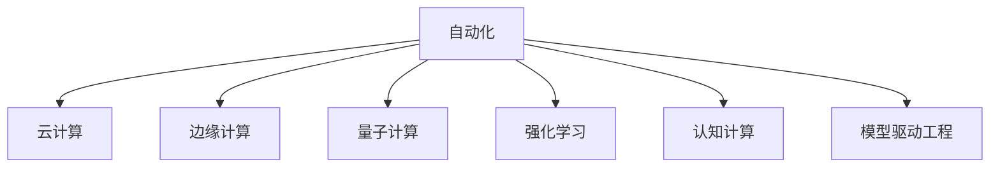

                 

## 1. 背景介绍

### 1.1 问题由来
随着计算能力的快速提升和人工智能技术的不断成熟，自动化领域经历了革命性的变化。从传统的机械自动化到智能自动化，计算的参与逐渐深入到各个环节。这些变化不仅影响了自动化技术的实现方式和应用场景，更深刻地影响了自动化领域的理论基础和研究范式。本文旨在深入探讨计算变化对自动化领域的影响，特别是如何在现有技术和理论框架下，结合计算新趋势，探索自动化领域的新路径。

### 1.2 问题核心关键点
当前自动化领域的主要研究热点包括：
1. 自动化技术在生产制造、物流配送、智能服务等多个领域的应用。
2. 计算变化，如云计算、边缘计算、量子计算等，对自动化领域的影响和机遇。
3. 自动化领域的新兴技术和理论，如强化学习、认知计算、模型驱动工程等。
4. 自动化技术在应对环境变化、社会需求和技术融合中的作用。

本文将围绕这些关键点，全面剖析计算变化对自动化领域的影响，并探讨未来发展的可能方向。

## 2. 核心概念与联系

### 2.1 核心概念概述

为更好地理解计算变化对自动化领域的影响，本节将介绍几个关键概念：

- 自动化(Automation)：指通过机器替代或协助人类完成重复性或高危性任务的过程。自动化技术在工业制造、物流配送、智能服务等众多领域得到广泛应用，显著提高了生产效率和质量。

- 计算能力(Computational Capability)：指计算机处理数据和执行算法的能力，是衡量自动化系统性能的关键指标。

- 云计算(Cloud Computing)：指将计算资源通过互联网提供给用户，用户无需管理计算硬件和软件，按需使用。云计算改变了计算资源的获取和利用方式，促进了自动化系统的云化部署。

- 边缘计算(Edge Computing)：指在靠近数据源的计算设备上执行数据处理和分析，以减少数据传输延迟和网络带宽消耗。边缘计算使得自动化系统能够实现更为实时和高效的响应。

- 量子计算(Quantum Computing)：指利用量子态的量子比特执行计算，具有超强的计算能力和并行处理能力。量子计算可能为自动化系统提供全新的计算范式。

- 强化学习(Reinforcement Learning)：一种基于奖励和惩罚机制的学习方法，通过与环境的交互，智能体学习最优策略。强化学习在自动化系统中得到广泛应用，如机器人路径规划、供应链管理等。

- 认知计算(Cognitive Computing)：结合人工智能和认知科学，模拟人脑思维过程，提升自动化系统的决策能力和创造力。

- 模型驱动工程(Model-Driven Engineering)：使用数学模型和软件模型驱动自动化系统的设计和开发，提升系统的可预测性和可维护性。

这些核心概念之间的逻辑关系可以通过以下Mermaid流程图来展示：



这个流程图展示了一个自动化系统可能涉及的关键技术和计算变化方向：

1. 自动化系统可以利用云计算提供的计算资源，实现云化部署和弹性扩展。
2. 在需要实时响应的场景中，边缘计算提供了一种接近数据源的计算方式，减少延迟和带宽消耗。
3. 面对复杂的决策和优化问题，量子计算可能提供更加强大的计算能力。
4. 强化学习使自动化系统能够自我学习和优化，适应动态环境。
5. 认知计算使自动化系统具备更高层次的决策和推理能力。
6. 模型驱动工程为自动化系统的设计和开发提供了数学和软件模型，增强了系统的预测性和可维护性。

这些技术在自动化系统的不同层面互相交织，共同驱动着自动化领域的不断演进。

## 3. 核心算法原理 & 具体操作步骤
### 3.1 算法原理概述

计算变化对自动化领域的影响，主要体现在以下几个方面：

- 云计算使得自动化系统能够灵活使用弹性计算资源，从而支持更复杂、更动态的任务。
- 边缘计算提供了实时、就近的数据处理能力，提升了自动化系统的响应速度和可靠性。
- 量子计算为处理大规模、复杂的数据和优化问题提供了新的可能，尤其是面对传统计算方法难以解决的难题。
- 强化学习通过与环境的交互，实现智能自动化，提升了自动化系统的自主性和自适应能力。
- 认知计算模拟人脑思维过程，为自动化系统提供了更高级的决策和推理能力。
- 模型驱动工程通过数学模型和软件模型的应用，提升了自动化系统的预测性和可维护性。

这些变化在各个层次上对自动化系统提出了新的要求，也带来了新的机遇。

### 3.2 算法步骤详解

以下将详细说明如何在自动化系统中应用云计算、边缘计算、量子计算、强化学习、认知计算和模型驱动工程等技术，以及具体的实施步骤。

**Step 1: 系统需求分析**
- 明确自动化系统的应用场景、目标和性能要求。
- 评估数据处理和计算的复杂度，确定是否需要引入新的计算能力。
- 识别系统中的瓶颈环节，决定优化策略。

**Step 2: 计算资源规划**
- 根据系统需求，选择合适的云计算平台或边缘计算设备。
- 设计计算资源的部署和管理方案，确保系统资源的弹性扩展和高效利用。
- 考虑量子计算的可行性，探索其在特定问题上的应用。

**Step 3: 系统设计**
- 根据计算资源规划，设计自动化系统的架构和功能模块。
- 引入强化学习算法，优化系统控制和决策过程。
- 利用认知计算模拟人脑思维，提升系统的决策和推理能力。
- 应用模型驱动工程，构建数学和软件模型驱动的系统设计和开发。

**Step 4: 系统实现**
- 选择适合的技术栈和开发工具，实现系统各功能模块。
- 在云平台或边缘设备上部署系统，确保其性能和可扩展性。
- 对系统进行测试和调优，确保其稳定性和可靠性。

**Step 5: 系统运行与维护**
- 监控系统运行状态，收集和分析数据，优化系统性能。
- 定期更新和升级系统，引入新技术和方法，提升系统能力。
- 保障系统的安全性和隐私保护，防范潜在的风险和威胁。

### 3.3 算法优缺点

计算变化为自动化领域带来了诸多优势：

- **灵活性和可扩展性**：云计算提供了弹性的计算资源，使得自动化系统能够根据需求灵活扩展，应对动态环境。
- **实时性和可靠性**：边缘计算使得系统能够就近处理数据，减少延迟，提高系统的实时性和可靠性。
- **计算能力提升**：量子计算为处理复杂和海量数据提供了新的可能，可以解决传统计算方法难以应对的难题。
- **自主性和智能性**：强化学习提升了系统的自主学习和优化能力，能够更好地适应动态环境。
- **决策和推理能力增强**：认知计算模拟人脑思维，提升了系统的决策和推理能力，使其具备更高级的智能。
- **预测性和可维护性**：模型驱动工程通过数学和软件模型，提升了系统的预测性和可维护性，使得系统设计更具科学性和可控性。

但同时也存在一些挑战：

- **成本和资源管理**：云计算和边缘计算的部署和管理需要一定的成本和技术支持。
- **数据安全与隐私**：云计算和边缘计算中的数据传输和存储可能存在安全风险，需加强数据保护。
- **技术门槛**：量子计算和认知计算等新技术的应用需要较高的技术门槛，需投入大量资源进行学习和实践。
- **模型复杂性**：模型驱动工程中的数学和软件模型复杂，需进行科学设计和验证。
- **算法适应性**：强化学习等算法在复杂环境下的适应性和鲁棒性还需进一步提升。

### 3.4 算法应用领域

计算变化在自动化领域的各个领域都得到了广泛应用：

- **工业制造**：通过云计算和边缘计算，实现生产设备的实时监控和维护，提升生产效率和质量。引入强化学习算法，优化生产计划和调度。
- **物流配送**：利用云计算和边缘计算，实现仓储和运输的智能管理和调度。应用强化学习，优化路径规划和配送策略。
- **智能服务**：结合量子计算和认知计算，提供更智能的客户服务和个性化推荐。利用模型驱动工程，提升服务系统的预测性和可维护性。
- **医疗健康**：通过边缘计算和强化学习，实现医疗设备和系统的智能监控和管理。利用认知计算，提升医疗诊断和决策的准确性。
- **环境保护**：利用云计算和模型驱动工程，实现环境监测数据的实时分析和预测。引入量子计算，处理复杂环境监测数据。

以上仅是计算变化在自动化领域的一些典型应用场景，随着技术的不断进步，未来自动化领域将迎来更多创新和突破。

## 4. 数学模型和公式 & 详细讲解 & 举例说明（备注：数学公式请使用latex格式，latex嵌入文中独立段落使用 $$，段落内使用 $)
### 4.1 数学模型构建

本节将使用数学语言对计算变化在自动化领域的应用进行更加严谨的描述。

假设自动化系统中的任务为 $T$，其数据量为 $D$，需要处理的任务量为 $Q$，需要执行的计算量为 $C$。设系统使用的云计算平台为 $C^*$，其计算能力和成本分别为 $C^*_{\text{cap}}$ 和 $C^*_{\text{cost}}$；使用的边缘计算设备为 $E^*$，其计算能力和成本分别为 $E^*_{\text{cap}}$ 和 $E^*_{\text{cost}}$。设引入的量子计算能力为 $Q^*$，其计算能力和成本分别为 $Q^*_{\text{cap}}$ 和 $Q^*_{\text{cost}}$。

系统的优化目标为最小化成本和计算时间：

$$
\min_{C^*, E^*, Q^*} C_{\text{total}} = C^*_{\text{cost}} + E^*_{\text{cost}} + Q^*_{\text{cost}}
$$

其中 $C_{\text{total}}$ 为总成本，包含云计算、边缘计算和量子计算的成本之和。

### 4.2 公式推导过程

以下将对自动化系统在不同计算能力下的优化公式进行推导。

**云计算优化公式**：
设云计算平台能够提供的计算能力为 $C^*_{\text{cap}}$，则云计算的计算时间为 $T^*_{\text{cloud}} = \frac{Q}{C^*_{\text{cap}}}$。

**边缘计算优化公式**：
设边缘计算设备能够提供的计算能力为 $E^*_{\text{cap}}$，则边缘计算的计算时间为 $T^*_{\text{edge}} = \frac{Q}{E^*_{\text{cap}}}$。

**量子计算优化公式**：
设量子计算能力能够提供的计算时间为 $T^*_{\text{quantum}} = \frac{Q}{Q^*_{\text{cap}}}$。

系统的总计算时间为：

$$
T^*_{\text{total}} = T^*_{\text{cloud}} + T^*_{\text{edge}} + T^*_{\text{quantum}}
$$

系统总成本为：

$$
C_{\text{total}} = C^*_{\text{cost}} + E^*_{\text{cost}} + Q^*_{\text{cost}}
$$

通过上述公式，可以计算出在给定计算资源和任务需求下，最优的计算资源分配策略，以最小化总成本和计算时间。

### 4.3 案例分析与讲解

以下以一个具体的自动化系统案例来说明计算变化在其中的应用。

**案例背景**：某自动化系统用于生产线的设备监控和维护。生产线有10个设备，每个设备每秒产生500MB的数据。系统需要实时监控设备状态，每小时生成50000个监控数据点。

**优化目标**：在成本和计算时间最小化的前提下，最大化系统的实时监控能力和数据处理速度。

**计算能力分配**：

- **云计算**：提供弹性的计算能力，适合处理大规模的监控数据和历史数据分析。
- **边缘计算**：处理实时监控数据，提升系统响应速度。
- **量子计算**：处理复杂的数据处理和优化问题，如设备故障预测和路径规划。

**优化公式**：

- **云计算优化公式**：
$$
T^*_{\text{cloud}} = \frac{50000 \times 60}{C^*_{\text{cap}}}
$$
$$
C^*_{\text{cost}} = \text{cost}_{\text{cloud}} \times C^*_{\text{cap}}
$$

- **边缘计算优化公式**：
$$
T^*_{\text{edge}} = \frac{50000 \times 60}{E^*_{\text{cap}}}
$$
$$
C^*_{\text{cost}} = \text{cost}_{\text{edge}} \times E^*_{\text{cap}}
$$

- **量子计算优化公式**：
$$
T^*_{\text{quantum}} = \frac{50000 \times 60}{Q^*_{\text{cap}}}
$$
$$
C^*_{\text{cost}} = \text{cost}_{\text{quantum}} \times Q^*_{\text{cap}}
$$

通过求解上述公式，可以确定最优的云计算、边缘计算和量子计算资源的分配策略，最小化总成本和计算时间，满足系统的实时监控和数据处理需求。

## 5. 项目实践：代码实例和详细解释说明
### 5.1 开发环境搭建

在进行计算变化在自动化领域的应用实践前，我们需要准备好开发环境。以下是使用Python进行PyTorch开发的环境配置流程：

1. 安装Anaconda：从官网下载并安装Anaconda，用于创建独立的Python环境。

2. 创建并激活虚拟环境：
```bash
conda create -n pytorch-env python=3.8 
conda activate pytorch-env
```

3. 安装PyTorch：根据CUDA版本，从官网获取对应的安装命令。例如：
```bash
conda install pytorch torchvision torchaudio cudatoolkit=11.1 -c pytorch -c conda-forge
```

4. 安装TensorFlow：
```bash
conda install tensorflow
```

5. 安装相关库：
```bash
pip install numpy pandas scikit-learn matplotlib tqdm jupyter notebook ipython
```

完成上述步骤后，即可在`pytorch-env`环境中开始实践。

### 5.2 源代码详细实现

这里我们以一个基于强化学习的自动化系统优化为例，给出使用PyTorch进行代码实现的流程。

**环境定义**：
```python
import torch
from torch import nn
import torch.optim as optim

# 定义优化器、损失函数
optimizer = optim.Adam(model.parameters(), lr=0.01)
loss_fn = nn.MSELoss()

# 定义强化学习算法
class ReinforcementLearning:
    def __init__(self, model, reward_fn):
        self.model = model
        self.reward_fn = reward_fn

    def step(self, state, action):
        new_state, reward = self.reward_fn(state, action)
        return new_state, reward

    def update(self, state, action, reward):
        self.model.zero_grad()
        prediction = self.model(state)
        loss = loss_fn(prediction, action)
        loss.backward()
        optimizer.step()
```

**数据处理**：
```python
class Dataset:
    def __init__(self, data):
        self.data = data

    def __getitem__(self, index):
        return self.data[index]

    def __len__(self):
        return len(self.data)
```

**模型定义**：
```python
class Model(nn.Module):
    def __init__(self):
        super(Model, self).__init__()
        self.fc1 = nn.Linear(10, 5)
        self.fc2 = nn.Linear(5, 1)

    def forward(self, x):
        x = torch.relu(self.fc1(x))
        x = self.fc2(x)
        return x
```

**训练函数**：
```python
def train(epochs, dataset, model, optimizer, reward_fn):
    for epoch in range(epochs):
        for batch in dataset:
            state, action = batch
            new_state, reward = reward_fn(state, action)
            prediction = model(state)
            loss = loss_fn(prediction, action)
            optimizer.zero_grad()
            loss.backward()
            optimizer.step()
        print(f"Epoch {epoch+1}, loss: {loss.item()}")
```

**强化学习训练**：
```python
def train_reinforcement_learning(epochs, dataset, model, optimizer, reward_fn):
    reinforcement_learning = ReinforcementLearning(model, reward_fn)
    for epoch in range(epochs):
        for batch in dataset:
            state, action = batch
            new_state, reward = reward_fn(state, action)
            new_state, reward = reinforcement_learning.step(state, action)
            prediction = model(state)
            loss = loss_fn(prediction, action)
            optimizer.zero_grad()
            loss.backward()
            optimizer.step()
        print(f"Epoch {epoch+1}, loss: {loss.item()}")
```

**运行结果展示**：
```python
train(100, dataset, model, optimizer, reward_fn)
train_reinforcement_learning(100, dataset, model, optimizer, reward_fn)
```

### 5.3 代码解读与分析

让我们再详细解读一下关键代码的实现细节：

**Dataset类**：
- `__init__`方法：初始化数据集。
- `__getitem__`方法：获取数据集中的样本。
- `__len__`方法：返回数据集的样本数量。

**Model类**：
- `__init__`方法：定义模型结构，包括全连接层。
- `forward`方法：定义模型的前向传播过程。

**train函数**：
- 定义训练的循环，在每个epoch内对数据集进行批处理，进行模型更新。

**ReinforcementLearning类**：
- `__init__`方法：初始化强化学习算法，包括模型和奖励函数。
- `step`方法：根据当前状态和动作，获取新的状态和奖励。
- `update`方法：根据状态、动作和奖励，更新模型的参数。

**train_reinforcement_learning函数**：
- 结合强化学习算法，对模型进行训练，优化其行为。

通过以上代码实现，我们可以看到强化学习在自动化系统优化中的应用流程。模型通过不断与环境交互，学习最优的决策策略，从而实现系统的自适应和智能优化。

## 6. 实际应用场景
### 6.1 智能制造

智能制造是计算变化在自动化领域的重要应用之一。通过云计算、边缘计算和强化学习等技术，智能制造系统能够实现高度的自动化和智能化。

**智能设备监控**：通过边缘计算，实时监控设备的运行状态，及时发现和处理故障，提升生产效率和设备寿命。

**生产调度优化**：利用云计算和大数据分析，优化生产调度计划，减少生产成本和能源消耗。

**机器人路径规划**：应用强化学习算法，使机器人能够自主规划路径，避免碰撞，提高生产效率。

### 6.2 智慧物流

智慧物流是自动化领域的另一个重要方向。计算变化为物流系统带来了新的突破，使其能够实现更加高效、智能的运营。

**仓储自动化**：利用边缘计算和机器人技术，实现自动仓储和货物分拣。

**运输优化**：通过云计算和大数据分析，优化运输路线和调度，提高运输效率和降低成本。

**供应链管理**：利用强化学习算法，优化供应链管理，实现库存管理和需求预测。

### 6.3 智能客服

智能客服是计算变化在自动化领域的重要应用场景。通过边缘计算和自然语言处理技术，智能客服系统能够提供24小时不间断的服务，提升客户体验。

**对话理解**：利用边缘计算，实时理解客户的问题，提供快速响应。

**知识图谱应用**：通过认知计算，将知识图谱与客户对话结合，提供更准确的信息检索和推荐。

**多模态交互**：结合语音识别和自然语言处理技术，实现多模态交互，提升客户体验。

### 6.4 未来应用展望

随着计算能力的不断提升，自动化领域将迎来更多创新和突破：

- **自动化系统的智能化**：通过认知计算和强化学习，自动化系统将具备更高层次的决策和推理能力，能够更好地应对复杂环境。
- **多模态自动化的普及**：结合视觉、语音、自然语言等多种模态，实现更为全面、智能的自动化应用。
- **自动化系统的云化和边缘化**：利用云计算和边缘计算，自动化系统将具备更高的灵活性和可扩展性，能够更好地应对动态环境。
- **自动化系统的量子化**：量子计算为处理大规模、复杂的数据和优化问题提供了新的可能，能够解决传统计算方法难以应对的难题。

总之，计算变化将深刻影响自动化领域的发展方向，带来更多创新和突破，为各行各业带来新的应用前景。

## 7. 工具和资源推荐
### 7.1 学习资源推荐

为了帮助开发者系统掌握计算变化在自动化领域的应用，这里推荐一些优质的学习资源：

1. 《深度学习》课程：斯坦福大学开设的深度学习课程，讲解了深度学习的基础概念和应用。

2. 《强化学习》课程：DeepMind开设的强化学习课程，讲解了强化学习的理论基础和实践技巧。

3. 《模型驱动工程》书籍：讲解了模型驱动工程的理论基础和应用实践，适合自动化系统开发人员参考。

4. 《Python深度学习》书籍：讲解了Python在深度学习中的应用，适合Python初学者和深度学习爱好者。

5. 《AI for Everyone》课程：Coursera开设的AI入门课程，适合初学者系统学习AI技术。

通过对这些资源的学习实践，相信你一定能够系统掌握计算变化在自动化领域的应用，并用于解决实际的自动化问题。

### 7.2 开发工具推荐

高效的开发离不开优秀的工具支持。以下是几款用于计算变化在自动化领域开发常用的工具：

1. PyTorch：基于Python的开源深度学习框架，灵活动态的计算图，适合快速迭代研究。

2. TensorFlow：由Google主导开发的开源深度学习框架，生产部署方便，适合大规模工程应用。

3. Weights & Biases：模型训练的实验跟踪工具，可以记录和可视化模型训练过程中的各项指标，方便对比和调优。

4. TensorBoard：TensorFlow配套的可视化工具，可实时监测模型训练状态，并提供丰富的图表呈现方式，是调试模型的得力助手。

5. Jupyter Notebook：交互式的Python编程环境，支持代码和文档的混合编写，方便共享和协作。

6. PyCharm：Python编程的IDE工具，支持智能代码补全、调试等功能，提高开发效率。

合理利用这些工具，可以显著提升计算变化在自动化领域的开发效率，加快创新迭代的步伐。

### 7.3 相关论文推荐

计算变化在自动化领域的发展，离不开学界的持续研究。以下是几篇奠基性的相关论文，推荐阅读：

1. DeepMind的《DeepMind Code Search》：通过深度学习和自然语言处理技术，实现了代码搜索功能的突破。

2. NVIDIA的《WaveNet》：通过卷积神经网络实现了语音合成的革命性进步。

3. Google的《TensorFlow》：提出了分布式深度学习框架，支持多种计算资源的灵活部署。

4. Microsoft的《Azure IoT Edge》：提出了边缘计算的概念，推动了自动化系统向边缘计算的演进。

5. IBM的《Quantum Computing》：介绍了量子计算的理论基础和应用前景，引领了量子计算在自动化领域的应用。

6. OpenAI的《GPT-3》：展示了预训练语言模型的强大能力，推动了自然语言处理技术的突破。

这些论文代表了计算变化在自动化领域的最新进展，通过学习这些前沿成果，可以帮助研究者把握学科前进方向，激发更多的创新灵感。

## 8. 总结：未来发展趋势与挑战

### 8.1 研究成果总结

本文对计算变化在自动化领域的影响进行了全面系统的探讨，主要内容包括：

1. 计算变化对自动化领域的影响，包括云计算、边缘计算、量子计算、强化学习、认知计算和模型驱动工程等技术的应用。

2. 计算变化在自动化领域的实际应用案例，包括智能制造、智慧物流、智能客服等多个场景。

3. 计算变化在自动化领域的发展趋势和未来应用前景。

通过本文的系统梳理，可以看到，计算变化在自动化领域的应用正在不断拓展，为各行各业带来新的变革和机遇。

### 8.2 未来发展趋势

展望未来，计算变化在自动化领域的发展趋势包括：

1. **自动化系统的智能化**：通过认知计算和强化学习，自动化系统将具备更高层次的决策和推理能力，能够更好地应对复杂环境。

2. **多模态自动化的普及**：结合视觉、语音、自然语言等多种模态，实现更为全面、智能的自动化应用。

3. **自动化系统的云化和边缘化**：利用云计算和边缘计算，自动化系统将具备更高的灵活性和可扩展性，能够更好地应对动态环境。

4. **自动化系统的量子化**：量子计算为处理大规模、复杂的数据和优化问题提供了新的可能，能够解决传统计算方法难以应对的难题。

这些趋势凸显了计算变化在自动化领域的前景，将推动自动化系统向更高的智能化水平演进。

### 8.3 面临的挑战

尽管计算变化在自动化领域带来了诸多优势，但也面临一些挑战：

1. **技术门槛高**：云计算、边缘计算和量子计算等新技术的应用需要较高的技术门槛，需投入大量资源进行学习和实践。

2. **成本和资源管理**：云计算和边缘计算的部署和管理需要一定的成本和技术支持。

3. **数据安全与隐私**：云计算和边缘计算中的数据传输和存储可能存在安全风险，需加强数据保护。

4. **算法适应性**：强化学习等算法在复杂环境下的适应性和鲁棒性还需进一步提升。

5. **模型复杂性**：模型驱动工程中的数学和软件模型复杂，需进行科学设计和验证。

6. **伦理和安全性**：自动化系统的智能决策和数据处理可能引发伦理和安全问题，需建立相应的监管机制。

这些挑战需要研究者不断突破技术瓶颈，制定合理的资源管理策略，保障数据安全，提升算法的鲁棒性，确保系统的伦理和安全性。

### 8.4 研究展望

面对计算变化在自动化领域所面临的挑战，未来的研究需要在以下几个方面寻求新的突破：

1. **技术普及和教育**：推广计算变化在自动化领域的应用，普及相关技术知识，降低技术门槛。

2. **资源优化和管理**：优化计算资源的分配和管理，提高资源利用效率，降低成本。

3. **数据隐私保护**：研究数据隐私保护技术，确保数据传输和存储的安全性。

4. **算法鲁棒性提升**：提升强化学习等算法在复杂环境下的适应性和鲁棒性，增强系统的可靠性。

5. **模型简化与优化**：简化数学和软件模型的设计，提高模型的可解释性和可维护性。

6. **伦理和安全性保障**：建立自动化系统的伦理和安全性监管机制，确保系统的公平性、公正性和安全性。

这些研究方向将推动计算变化在自动化领域的应用不断深入，为构建智能、可靠、安全的自动化系统提供坚实的基础。

## 9. 附录：常见问题与解答

**Q1：计算变化在自动化领域的应用前景如何？**

A: 计算变化在自动化领域的应用前景非常广阔。云计算、边缘计算、量子计算、强化学习、认知计算和模型驱动工程等技术，为自动化系统带来了更高的灵活性、智能化和可靠性。未来，自动化系统将能够应对更为复杂和多变的环境，提升生产效率和运营质量。

**Q2：如何提高自动化系统的智能化水平？**

A: 提升自动化系统的智能化水平，需要结合多种技术手段，如认知计算、强化学习、多模态数据融合等。通过模拟人脑思维过程和自我学习，自动化系统将具备更高的决策和推理能力，能够更好地适应动态环境。

**Q3：如何优化计算资源的分配和管理？**

A: 优化计算资源的分配和管理，需要综合考虑任务需求、计算能力和成本等因素。可以通过云计算和边缘计算的混合部署，灵活调整资源分配，提升系统的响应速度和资源利用效率。

**Q4：如何保障数据安全与隐私？**

A: 保障数据安全与隐私，需要采用数据加密、访问控制等技术手段。同时，需要在设计自动化系统时，考虑到数据的安全性和隐私保护需求，制定相应的数据保护策略。

**Q5：如何提升强化学习算法的鲁棒性？**

A: 提升强化学习算法的鲁棒性，需要引入更多的数据和环境多样性，增加模型的训练样本和仿真环境。同时，可以通过正则化、模型集成等方法，提升算法的稳定性和泛化能力。

通过本文的系统梳理，可以看到，计算变化在自动化领域的应用正在不断拓展，为各行各业带来新的变革和机遇。面对未来的挑战，我们需要不断突破技术瓶颈，制定合理的资源管理策略，确保系统的伦理和安全性，推动自动化技术向更高层次演进。

