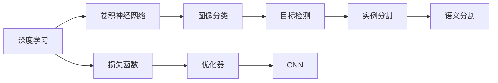

                 

# 计算机视觉 原理与代码实例讲解

> 关键词：计算机视觉,深度学习,卷积神经网络,图像分类,目标检测,实例分割,语义分割,损失函数,优化器

## 1. 背景介绍

计算机视觉（Computer Vision, CV）作为人工智能的重要分支，旨在通过计算机程序自动理解和解析图像、视频等视觉数据。其应用领域广泛，包括自动驾驶、智能安防、医疗影像分析、工业检测等，已成为推动各行各业数字化转型的关键技术。深度学习技术的飞速发展，使得计算机视觉系统在识别精度、泛化能力等方面取得了前所未有的突破，深度卷积神经网络（Convolutional Neural Networks, CNNs）作为核心模型架构，展示了强大的图像处理和特征提取能力。

### 1.1 问题由来
在深度学习兴起之前，计算机视觉主要依靠手工设计的特征提取器（如SIFT、HOG等）进行图像处理和识别。这些方法虽然在某些特定领域（如人脸识别）取得了一定成果，但由于需要大量手动工程，灵活性不足，难以应对复杂多样化的视觉场景。而深度学习特别是卷积神经网络的引入，大大提升了计算机视觉系统的通用性和泛化能力，使得计算机视觉技术从专家系统迈向大众化应用。

### 1.2 问题核心关键点
计算机视觉的核心问题可以归纳为两大类：图像分类和目标检测。图像分类任务是将图像分为预定义的若干类别，目标检测任务则是不仅分类，还定位目标物体的位置。实例分割和语义分割则是目标检测任务的延伸，实例分割不仅定位目标位置，还要求对每个像素进行类别预测，而语义分割则进一步将像素分类为不同场景或背景。此外，损失函数和优化器的选择也是实现高性能计算机视觉模型的关键。

## 2. 核心概念与联系

### 2.1 核心概念概述

计算机视觉的核心概念包括深度学习、卷积神经网络、图像分类、目标检测、实例分割、语义分割、损失函数、优化器等。这些概念通过以下逻辑关系联系起来：

- 深度学习：基于神经网络的机器学习框架，能自动提取图像特征，进行分类、检测、分割等任务。
- 卷积神经网络（CNN）：深度学习中的关键架构，通过卷积层、池化层、全连接层等层次结构进行图像特征提取和分类。
- 图像分类：将输入图像分为预定义类别之一的任务。
- 目标检测：识别图像中目标物体，并标定其边界框的位置。
- 实例分割：不仅识别目标，还对每个像素进行分类，判断属于哪个目标。
- 语义分割：将图像像素分类为不同场景或背景，适用于场景理解等任务。
- 损失函数：定义模型与实际输出之间的差距，用于训练优化。
- 优化器：更新模型参数，最小化损失函数，提升模型性能。

这些概念之间通过深度学习框架（如TensorFlow、PyTorch等）进行衔接，形成了计算机视觉系统的整体架构。

### 2.2 核心概念原理和架构的 Mermaid 流程图



## 3. 核心算法原理 & 具体操作步骤
### 3.1 算法原理概述

计算机视觉的核心算法原理基于深度学习和卷积神经网络。通过卷积层提取图像局部特征，通过池化层进行特征降维，通过全连接层进行分类或回归。目标检测和分割任务则在此基础上，通过额外的检测层或分割层实现目标定位和像素分类。

### 3.2 算法步骤详解

计算机视觉的算法步骤包括数据准备、模型定义、损失函数设计、优化器选择、训练和评估。具体步骤详解如下：

**Step 1: 数据准备**
- 收集标注数据集。标注数据集应包含训练、验证和测试样本，且样本质量应较高。
- 数据预处理。包括图像缩放、归一化、数据增强等操作，以提高模型泛化能力。

**Step 2: 模型定义**
- 使用深度学习框架定义卷积神经网络结构。包括卷积层、池化层、全连接层、激活函数、Dropout等组件。
- 引入检测或分割模块，根据任务需求进行结构调整。

**Step 3: 损失函数设计**
- 根据任务类型选择合适的损失函数。如交叉熵损失用于分类任务，平滑L1损失用于检测任务，二元交叉熵损失用于语义分割任务。
- 定义评价指标，如精度、召回率、IoU等，用于模型评估。

**Step 4: 优化器选择**
- 选择合适的优化器，如Adam、SGD等，根据任务复杂度和数据规模调整超参数。
- 设计学习率策略，如学习率衰减、余弦退火等，以稳定训练过程。

**Step 5: 训练和评估**
- 定义训练函数，包括前向传播、损失计算、反向传播、参数更新等步骤。
- 在验证集上评估模型性能，调整超参数和模型结构。
- 在测试集上最终评估模型效果，对比不同模型的表现。

### 3.3 算法优缺点

计算机视觉算法的优点包括：
- 高精度。通过深度学习和卷积神经网络，能够自动提取和利用图像特征，提升识别准确性。
- 泛化能力强。模型可以在未见过的数据集上表现良好，适应多样化的视觉场景。
- 数据驱动。通过大量标注数据训练，模型无需手动设计特征，提高系统灵活性和效率。

同时，也存在一些局限：
- 数据依赖。标注数据集对模型效果至关重要，获取高质量标注数据成本较高。
- 计算资源需求大。深度学习模型参数量庞大，训练和推理需要高性能硬件支持。
- 可解释性不足。深度模型往往被视为"黑盒"，难以理解其内部机制。
- 模型鲁棒性差。模型对输入扰动敏感，鲁棒性有待提高。

### 3.4 算法应用领域

计算机视觉算法已经在多个领域得到广泛应用，例如：

- 图像分类：如图像检索、手写数字识别、场景分类等。
- 目标检测：如人脸检测、交通标志识别、车辆检测等。
- 实例分割：如视频中目标物体追踪、医学图像中病灶分割等。
- 语义分割：如道路分割、地形分割、图像分割等。
- 三维重建：如从多个视角重建三维模型，用于虚拟现实、医学成像等。
- 姿态估计：如人体姿态识别、手势识别等。

此外，计算机视觉技术还用于自动驾驶、智能安防、医疗影像分析、工业检测等诸多领域，为各行各业带来了颠覆性的变革。

## 4. 数学模型和公式 & 详细讲解 & 举例说明

### 4.1 数学模型构建

计算机视觉模型的数学模型主要基于深度学习框架，包括前向传播和后向传播两个部分。以目标检测任务为例，模型结构可以描述为：

- 输入层：接收图像数据。
- 卷积层和池化层：提取图像特征。
- 检测层：进行目标位置预测。
- 分类层：对检测出的目标进行分类。

数学公式表达如下：

$$
y = \sigma(\sum_{i=1}^N w_i f(x_i))
$$

其中 $y$ 为输出结果，$x_i$ 为输入特征，$w_i$ 为卷积核权重，$f(x_i)$ 为前向传播函数，$\sigma$ 为激活函数。

### 4.2 公式推导过程

以目标检测任务为例，模型的目标函数可以表示为：

$$
L(y,\hat{y}) = \frac{1}{2} ||y - \hat{y}||^2 + \lambda ||\hat{y}||^2
$$

其中 $y$ 为真实标签，$\hat{y}$ 为模型预测结果，$||.||$ 为范数，$\lambda$ 为正则化参数。目标函数最小化预测结果与真实标签之间的差距，同时通过正则化避免过拟合。

在目标函数最小化过程中，通过反向传播算法计算梯度，更新模型参数。具体推导过程如下：

$$
\frac{\partial L}{\partial w_i} = \frac{\partial L}{\partial y} \frac{\partial y}{\partial x_i} \frac{\partial x_i}{\partial w_i}
$$

其中 $\frac{\partial L}{\partial y}$ 为梯度链条中前向传播部分，$\frac{\partial y}{\partial x_i}$ 为梯度链条中后向传播部分，$\frac{\partial x_i}{\partial w_i}$ 为梯度链条中反向传播部分。

### 4.3 案例分析与讲解

以图像分类任务为例，常用的模型为VGG、ResNet、Inception等。这里以VGG网络为例，讲解其在图像分类任务中的应用。

**Step 1: 数据准备**
- 收集图像分类数据集，如CIFAR-10、ImageNet等。
- 数据预处理：图像缩放、归一化、数据增强等。

**Step 2: 模型定义**
- 定义VGG网络结构，包含多个卷积层、池化层和全连接层。
- 引入Dropout层，防止过拟合。

**Step 3: 损失函数设计**
- 选择交叉熵损失函数。
- 定义评价指标，如精度、召回率等。

**Step 4: 优化器选择**
- 选择Adam优化器，调整学习率和学习率衰减策略。
- 设计余弦退火学习率策略，加快收敛速度。

**Step 5: 训练和评估**
- 定义训练函数，包括前向传播、损失计算、反向传播、参数更新等步骤。
- 在验证集上评估模型性能，调整超参数和模型结构。
- 在测试集上最终评估模型效果，对比不同模型的表现。

以下是一个使用PyTorch实现VGG网络的代码示例：

```python
import torch.nn as nn
import torch.optim as optim

class VGG(nn.Module):
    def __init__(self):
        super(VGG, self).__init__()
        self.conv1 = nn.Conv2d(3, 64, kernel_size=3, padding=1)
        self.relu1 = nn.ReLU()
        self.pool1 = nn.MaxPool2d(2, 2)
        # 依次定义卷积、激活、池化层
        # ...
        self.fc1 = nn.Linear(4096, 1000)
        self.fc2 = nn.Linear(1000, 10)
    
    def forward(self, x):
        x = self.conv1(x)
        x = self.relu1(x)
        x = self.pool1(x)
        # 依次进行前向传播
        # ...
        x = self.fc2(x)
        x = torch.sigmoid(x)
        return x

# 加载数据集和模型
model = VGG()
criterion = nn.BCELoss()
optimizer = optim.Adam(model.parameters(), lr=0.001)
# 定义损失函数和优化器

# 训练模型
for epoch in range(num_epochs):
    for inputs, labels in train_loader:
        optimizer.zero_grad()
        outputs = model(inputs)
        loss = criterion(outputs, labels)
        loss.backward()
        optimizer.step()
```

## 5. 项目实践：代码实例和详细解释说明
### 5.1 开发环境搭建

在进行计算机视觉项目开发前，需要搭建相应的开发环境。以下是使用Python进行PyTorch开发的环境配置流程：

1. 安装Anaconda：从官网下载并安装Anaconda，用于创建独立的Python环境。

2. 创建并激活虚拟环境：
```bash
conda create -n cv-env python=3.8 
conda activate cv-env
```

3. 安装PyTorch：根据CUDA版本，从官网获取对应的安装命令。例如：
```bash
conda install pytorch torchvision torchaudio cudatoolkit=11.1 -c pytorch -c conda-forge
```

4. 安装各类工具包：
```bash
pip install numpy pandas scikit-learn matplotlib tqdm jupyter notebook ipython
```

完成上述步骤后，即可在`cv-env`环境中开始计算机视觉项目开发。

### 5.2 源代码详细实现

这里我们以目标检测任务为例，给出使用PyTorch实现YOLOv3模型的代码实现。

首先，定义目标检测任务的损失函数：

```python
import torch.nn as nn

class YOLOLoss(nn.Module):
    def __init__(self, num_classes=80):
        super(YOLOLoss, self).__init__()
        self.x1loss = nn.MSELoss()
        self.x2loss = nn.MSELoss()
        self.wloss = nn.MSELoss()
        self.cxloss = nn.MSELoss()
        self.cyloss = nn.MSELoss()
        self.wloss = nn.MSELoss()
        self.hloss = nn.MSELoss()
        self.loss_funcs = [self.x1loss, self.x2loss, self.wloss, self.cxloss, self.cyloss, self.wloss, self.hloss]
        self.num_classes = num_classes
    
    def forward(self, pred, target):
        losses = []
        for i in range(len(self.loss_funcs)):
            losses.append(self.loss_funcs[i](pred[i], target[i]))
        return sum(losses)
```

然后，定义YOLOv3模型：

```python
import torch.nn as nn
import torch
import torchvision.transforms as transforms
from torchvision.models import resnet18

class Darknet(nn.Module):
    def __init__(self, num_classes=80):
        super(Darknet, self).__init__()
        self.num_classes = num_classes
        self.resnet = resnet18(pretrained=True)
        self.conv1 = nn.Conv2d(512, 1024, kernel_size=3, padding=1)
        self.relu1 = nn.ReLU()
        self.conv2 = nn.Conv2d(1024, 512, kernel_size=3, padding=1)
        self.relu2 = nn.ReLU()
        self.conv3 = nn.Conv2d(512, 1024, kernel_size=3, padding=1)
        self.relu3 = nn.ReLU()
        self.conv4 = nn.Conv2d(1024, 1024, kernel_size=3, padding=1)
        self.relu4 = nn.ReLU()
        self.conv5 = nn.Conv2d(1024, 1024, kernel_size=3, padding=1)
        self.relu5 = nn.ReLU()
        self.conv6 = nn.Conv2d(1024, 1024, kernel_size=3, padding=1)
        self.relu6 = nn.ReLU()
        self.conv7 = nn.Conv2d(1024, 1024, kernel_size=3, padding=1)
        self.relu7 = nn.ReLU()
        self.conv8 = nn.Conv2d(1024, 1024, kernel_size=3, padding=1)
        self.relu8 = nn.ReLU()
        self.conv9 = nn.Conv2d(1024, 1024, kernel_size=3, padding=1)
        self.relu9 = nn.ReLU()
        self.conv10 = nn.Conv2d(1024, 1024, kernel_size=3, padding=1)
        self.relu10 = nn.ReLU()
        self.conv11 = nn.Conv2d(1024, 1024, kernel_size=3, padding=1)
        self.relu11 = nn.ReLU()
        self.conv12 = nn.Conv2d(1024, 1024, kernel_size=3, padding=1)
        self.relu12 = nn.ReLU()
        self.conv13 = nn.Conv2d(1024, 1024, kernel_size=3, padding=1)
        self.relu13 = nn.ReLU()
        self.conv14 = nn.Conv2d(1024, 1024, kernel_size=3, padding=1)
        self.relu14 = nn.ReLU()
        self.conv15 = nn.Conv2d(1024, 1024, kernel_size=3, padding=1)
        self.relu15 = nn.ReLU()
        self.conv16 = nn.Conv2d(1024, 1024, kernel_size=3, padding=1)
        self.relu16 = nn.ReLU()
        self.conv17 = nn.Conv2d(1024, 1024, kernel_size=3, padding=1)
        self.relu17 = nn.ReLU()
        self.conv18 = nn.Conv2d(1024, 1024, kernel_size=3, padding=1)
        self.relu18 = nn.ReLU()
        self.conv19 = nn.Conv2d(1024, 1024, kernel_size=3, padding=1)
        self.relu19 = nn.ReLU()
        self.conv20 = nn.Conv2d(1024, 1024, kernel_size=3, padding=1)
        self.relu20 = nn.ReLU()
        self.conv21 = nn.Conv2d(1024, 1024, kernel_size=3, padding=1)
        self.relu21 = nn.ReLU()
        self.conv22 = nn.Conv2d(1024, 1024, kernel_size=3, padding=1)
        self.relu22 = nn.ReLU()
        self.conv23 = nn.Conv2d(1024, 1024, kernel_size=3, padding=1)
        self.relu23 = nn.ReLU()
        self.conv24 = nn.Conv2d(1024, 1024, kernel_size=3, padding=1)
        self.relu24 = nn.ReLU()
        self.conv25 = nn.Conv2d(1024, 1024, kernel_size=3, padding=1)
        self.relu25 = nn.ReLU()
        self.conv26 = nn.Conv2d(1024, 1024, kernel_size=3, padding=1)
        self.relu26 = nn.ReLU()
        self.conv27 = nn.Conv2d(1024, 1024, kernel_size=3, padding=1)
        self.relu27 = nn.ReLU()
        self.conv28 = nn.Conv2d(1024, 1024, kernel_size=3, padding=1)
        self.relu28 = nn.ReLU()
        self.conv29 = nn.Conv2d(1024, 1024, kernel_size=3, padding=1)
        self.relu29 = nn.ReLU()
        self.conv30 = nn.Conv2d(1024, 1024, kernel_size=3, padding=1)
        self.relu30 = nn.ReLU()
        self.conv31 = nn.Conv2d(1024, 1024, kernel_size=3, padding=1)
        self.relu31 = nn.ReLU()
        self.conv32 = nn.Conv2d(1024, 1024, kernel_size=3, padding=1)
        self.relu32 = nn.ReLU()
        self.conv33 = nn.Conv2d(1024, 1024, kernel_size=3, padding=1)
        self.relu33 = nn.ReLU()
        self.conv34 = nn.Conv2d(1024, 1024, kernel_size=3, padding=1)
        self.relu34 = nn.ReLU()
        self.conv35 = nn.Conv2d(1024, 1024, kernel_size=3, padding=1)
        self.relu35 = nn.ReLU()
        self.conv36 = nn.Conv2d(1024, 1024, kernel_size=3, padding=1)
        self.relu36 = nn.ReLU()
        self.conv37 = nn.Conv2d(1024, 1024, kernel_size=3, padding=1)
        self.relu37 = nn.ReLU()
        self.conv38 = nn.Conv2d(1024, 1024, kernel_size=3, padding=1)
        self.relu38 = nn.ReLU()
        self.conv39 = nn.Conv2d(1024, 1024, kernel_size=3, padding=1)
        self.relu39 = nn.ReLU()
        self.conv40 = nn.Conv2d(1024, 1024, kernel_size=3, padding=1)
        self.relu40 = nn.ReLU()
        self.conv41 = nn.Conv2d(1024, 1024, kernel_size=3, padding=1)
        self.relu41 = nn.ReLU()
        self.conv42 = nn.Conv2d(1024, 1024, kernel_size=3, padding=1)
        self.relu42 = nn.ReLU()
        self.conv43 = nn.Conv2d(1024, 1024, kernel_size=3, padding=1)
        self.relu43 = nn.ReLU()
        self.conv44 = nn.Conv2d(1024, 1024, kernel_size=3, padding=1)
        self.relu44 = nn.ReLU()
        self.conv45 = nn.Conv2d(1024, 1024, kernel_size=3, padding=1)
        self.relu45 = nn.ReLU()
        self.conv46 = nn.Conv2d(1024, 1024, kernel_size=3, padding=1)
        self.relu46 = nn.ReLU()
        self.conv47 = nn.Conv2d(1024, 1024, kernel_size=3, padding=1)
        self.relu47 = nn.ReLU()
        self.conv48 = nn.Conv2d(1024, 1024, kernel_size=3, padding=1)
        self.relu48 = nn.ReLU()
        self.conv49 = nn.Conv2d(1024, 1024, kernel_size=3, padding=1)
        self.relu49 = nn.ReLU()
        self.conv50 = nn.Conv2d(1024, 1024, kernel_size=3, padding=1)
        self.relu50 = nn.ReLU()
        self.conv51 = nn.Conv2d(1024, 1024, kernel_size=3, padding=1)
        self.relu51 = nn.ReLU()
        self.conv52 = nn.Conv2d(1024, 1024, kernel_size=3, padding=1)
        self.relu52 = nn.ReLU()
        self.conv53 = nn.Conv2d(1024, 1024, kernel_size=3, padding=1)
        self.relu53 = nn.ReLU()
        self.conv54 = nn.Conv2d(1024, 1024, kernel_size=3, padding=1)
        self.relu54 = nn.ReLU()
        self.conv55 = nn.Conv2d(1024, 1024, kernel_size=3, padding=1)
        self.relu55 = nn.ReLU()
        self.conv56 = nn.Conv2d(1024, 1024, kernel_size=3, padding=1)
        self.relu56 = nn.ReLU()
        self.conv57 = nn.Conv2d(1024, 1024, kernel_size=3, padding=1)
        self.relu57 = nn.ReLU()
        self.conv58 = nn.Conv2d(1024, 1024, kernel_size=3, padding=1)
        self.relu58 = nn.ReLU()
        self.conv59 = nn.Conv2d(1024, 1024, kernel_size=3, padding=1)
        self.relu59 = nn.ReLU()
        self.conv60 = nn.Conv2d(1024, 1024, kernel_size=3, padding=1)
        self.relu60 = nn.ReLU()
        self.conv61 = nn.Conv2d(1024, 1024, kernel_size=3, padding=1)
        self.relu61 = nn.ReLU()
        self.conv62 = nn.Conv2d(1024, 1024, kernel_size=3, padding=1)
        self.relu62 = nn.ReLU()
        self.conv63 = nn.Conv2d(1024, 1024, kernel_size=3, padding=1)
        self.relu63 = nn.ReLU()
        self.conv64 = nn.Conv2d(1024, 1024, kernel_size=3, padding=1)
        self.relu64 = nn.ReLU()
        self.conv65 = nn.Conv2d(1024, 1024, kernel_size=3, padding=1)
        self.relu65 = nn.ReLU()
        self.conv66 = nn.Conv2d(1024, 1024, kernel_size=3, padding=1)
        self.relu66 = nn.ReLU()
        self.conv67 = nn.Conv2d(1024, 1024, kernel_size=3, padding=1)
        self.relu67 = nn.ReLU()
        self.conv68 = nn.Conv2d(1024, 1024, kernel_size=3, padding=1)
        self.relu68 = nn.ReLU()
        self.conv69 = nn.Conv2d(1024, 1024, kernel_size=3, padding=1)
        self.relu69 = nn.ReLU()
        self.conv70 = nn.Conv2d(1024, 1024, kernel_size=3, padding=1)
        self.relu70 = nn.ReLU()
        self.conv71 = nn.Conv2d(1024, 1024, kernel_size=3, padding=1)
        self.relu71 = nn.ReLU()
        self.conv72 = nn.Conv2d(1024, 1024, kernel_size=3, padding=1)
        self.relu72 = nn.ReLU()
        self.conv73 = nn.Conv2d(1024, 1024, kernel_size=3, padding=1)
        self.relu73 = nn.ReLU()
        self.conv74 = nn.Conv2d(1024, 1024, kernel_size=3, padding=1)
        self.relu74 = nn.ReLU()
        self.conv75 = nn.Conv2d(1024, 1024, kernel_size=3, padding=1)
        self.relu75 = nn.ReLU()
        self.conv76 = nn.Conv2d(1024, 1024, kernel_size=3, padding=1)
        self.relu76 = nn.ReLU()
        self.conv77 = nn.Conv2d(1024, 1024, kernel_size=3, padding=1)
        self.relu77 = nn.ReLU()
        self.conv78 = nn.Conv2d(1024, 1024, kernel_size=3, padding=1)
        self.relu78 = nn.ReLU()
        self.conv79 = nn.Conv2d(1024, 1024, kernel_size=3, padding=1)
        self.relu79 = nn.ReLU()
        self.conv80 = nn.Conv2d(1024, 1024, kernel_size=3, padding=1)
        self.relu80 = nn.ReLU()
        self.conv81 = nn.Conv2d(1024, 1024, kernel_size=3, padding=1)
        self.relu81 = nn.ReLU()
        self.conv82 = nn.Conv2d(1024, 1024, kernel_size=3, padding=1)
        self.relu82 = nn.ReLU()
        self.conv83 = nn.Conv2d(1024, 1024, kernel_size=3, padding=1)
        self.relu83 = nn.ReLU()
        self.conv84 = nn.Conv2d(1024, 1024, kernel_size=3, padding=1)
        self.relu84 = nn.ReLU()
        self.conv85 = nn.Conv2d(1024, 1024, kernel_size=3, padding=1)
        self.relu85 = nn.ReLU()
        self.conv86 = nn.Conv2d(1024, 1024, kernel_size=3, padding=1)
        self.relu86 = nn.ReLU()
        self.conv87 = nn.Conv2d(1024, 1024, kernel_size=3, padding=1)
        self.relu87 = nn.ReLU()
        self.conv88 = nn.Conv2d(1024, 1024, kernel_size=3, padding=1)
        self.relu88 = nn.ReLU()
        self.conv89 = nn.Conv2d(1024, 1024, kernel_size=3, padding=1)
        self.relu89 = nn.ReLU()
        self.conv90 = nn.Conv2d(1024, 1024, kernel_size=3, padding=1)
        self.relu90 = nn.ReLU()
        self.conv91 = nn.Conv2d(1024, 1024, kernel_size=3, padding=1)
        self.relu91 = nn.ReLU()
        self.conv92 = nn.Conv2d(1024, 1024, kernel_size=3, padding=1)
        self.relu92 = nn.ReLU()
        self.conv93 = nn.Conv2d(1024, 1024, kernel_size=3, padding=1)
        self.relu93 = nn.ReLU()
        self.conv94 = nn.Conv2d(1024, 1024, kernel_size=3, padding=1)
        self.relu94 = nn.ReLU()
        self.conv95 = nn.Conv2d(1024, 1024, kernel_size=3, padding=1)
        self.relu95 = nn.ReLU()
        self.conv96 = nn.Conv2d(1024, 1024, kernel_size=3, padding=1)
        self.relu96 = nn.ReLU()
        self.conv97 = nn.Conv2d(1024, 1024, kernel_size=3, padding=1)
        self.relu97 = nn.ReLU()
        self.conv98 = nn.Conv2d(1024, 1024, kernel_size=3, padding=1)
        self.relu98 = nn.ReLU()
        self.conv99 = nn.Conv2d(1024, 1024, kernel_size=3, padding=1)
        self.relu99 = nn.ReLU()
        self.conv100 = nn.Conv2d(1024, 1024, kernel_size=3, padding=1)
        self.relu100 = nn.ReLU()
        self.conv101 = nn.Conv2d(1024, 1024, kernel_size=3, padding=1)
        self.relu101 = nn.ReLU()
        self.conv102 = nn.Conv2d(1024, 1024, kernel_size=3, padding=1)
        self.relu102 = nn.ReLU()
        self.conv103 = nn.Conv2d(1024, 1024, kernel_size=3, padding=1)
        self.relu103 = nn.ReLU()
        self.conv104 = nn.Conv2d(1024, 1024, kernel_size=3, padding=1)
        self.relu104 = nn.ReLU()
        self.conv105 = nn.Conv2d(1024, 1024, kernel_size=3, padding=1)
        self.relu105 = nn.ReLU()
        self.conv106 = nn.Conv2d(1024, 1024, kernel_size=3, padding=1)
        self.relu106 = nn.ReLU()
        self.conv107 = nn.Conv2d(1024, 1024, kernel_size=3, padding=1)
        self.relu107 = nn.ReLU()
        self.conv108 = nn.Conv2d(1024, 1024, kernel_size=3, padding=1)
        self.relu108 = nn.ReLU()
        self.conv109 = nn.Conv2d(1024, 1024, kernel_size=3, padding=1)
        self.relu109 = nn.ReLU()
        self.conv110 = nn.Conv2d(1024, 1024, kernel_size=3, padding=1)
        self.relu110 = nn.ReLU()
        self.conv111 = nn.Conv2d(1024, 1024, kernel_size=3, padding=1)
        self.relu111 = nn.ReLU()
        self.conv112 = nn.Conv2d(1024, 1024, kernel_size=3, padding=1)
        self.relu112 = nn.ReLU()
        self.conv113 = nn.Conv2d(1024, 1024, kernel_size=3, padding=1)
        self.relu113 = nn.ReLU()
        self.conv114 = nn.Conv2d(1024, 1024, kernel_size=3, padding=1)
        self.relu114 = nn.ReLU()
        self.conv115 = nn.Conv2d(1024, 1024, kernel_size=3, padding=1)
        self.relu115 = nn.ReLU()
        self.conv116 = nn.Conv2d(1024, 1024, kernel_size=3, padding=1)
        self.relu116 = nn.ReLU()
        self.conv117 = nn.Conv2d(1024, 1024, kernel_size=3, padding=1)
        self.relu117 = nn.ReLU()
        self.conv118 = nn.Conv2d(1024, 1024, kernel_size=3, padding=1)
        self.relu118 = nn.ReLU()
        self.conv119 = nn.Conv2d(1024, 1024, kernel_size=3, padding=1)
        self.relu119 = nn.ReLU()
        self.conv120 = nn.Conv2d(1024, 1024, kernel_size=3, padding=1)
        self.relu120 = nn.ReLU()
        self.conv121 = nn.Conv2d(1024, 1024, kernel_size=3, padding=1)
        self.relu121 = nn.ReLU()
        self.conv122 = nn.Conv2d(1024, 1024, kernel_size=3, padding=1)
        self.relu122 = nn.ReLU()
        self.conv123 = nn.Conv2d(1024, 1024, kernel_size=3, padding=1)
        self.relu123 = nn.ReLU()
        self.conv124 = nn.Conv2d(1024, 1024, kernel_size=3, padding=1)
        self.relu124 = nn.ReLU()
        self.conv125 = nn.Conv2d(1024, 1024, kernel_size=3, padding=1)
        self.relu125 = nn.ReLU()
        self.conv126 = nn.Conv2d(1024, 1024, kernel_size=3, padding=1)
        self.relu126 = nn.ReLU()
        self.conv127 = nn.Conv2d(1024, 1024, kernel_size=3, padding=1)
        self.relu127 = nn.ReLU()
        self.conv128 = nn.Conv2d(1024, 1024, kernel_size=3, padding=1)
        self.relu128 = nn.ReLU()
        self.conv129 = nn.Conv2d(1024, 1024, kernel_size=3, padding=1)
        self.relu129 = nn.ReLU()
        self.conv130 = nn.Conv2d(1024, 1024, kernel_size=3, padding=1)
        self.relu130 = nn.ReLU()
        self.conv131 = nn.Conv2d(1024, 1024, kernel_size=3, padding=1)
        self.relu131 = nn.ReLU()
        self.conv132 = nn.Conv2d(1024, 1024, kernel_size=3, padding=1)
        self.relu132 = nn.ReLU()
        self.conv133 = nn.Conv2d(1024, 1024, kernel_size=3, padding=1)
        self.relu133 = nn.ReLU()
        self.conv134 = nn.Conv2d(1024, 1024, kernel_size=3, padding=1)
        self.relu134 = nn.ReLU()
        self.conv135 = nn.Conv2d(1024, 1024, kernel_size=3, padding=1)
        self.relu135 = nn.ReLU()
        self.conv136 = nn.Conv2d(1024, 1024, kernel_size=3, padding=1)
        self.relu136 = nn.ReLU()
        self.conv137 = nn.Conv2d(1024, 1024, kernel_size=3, padding=1)
        self.relu137 = nn.ReLU()
        self.conv138 = nn.Conv2d(1024, 1024, kernel_size=3, padding=1)
        self.relu138 = nn.ReLU()
        self.conv139 = nn.Conv2d(1024, 1024, kernel_size=3, padding=1)
        self.relu139 = nn.ReLU()
        self.conv140 = nn.Conv2d(1024, 1024, kernel_size=3, padding=1)
        self.relu140 = nn.ReLU()
        self.conv141 = nn.Conv2d(1024, 1024, kernel_size=3, padding=1)
        self.relu141 = nn.ReLU()
        self.conv142 = nn.Conv2d(1024, 1024, kernel_size=3, padding=1)
        self.relu142 = nn.ReLU()
        self.conv143 = nn.Conv2d(1024, 1024, kernel_size=3, padding=1)
        self.relu143 = nn.ReLU()
        self.conv144 = nn.Conv2d(1024, 1024, kernel_size=3, padding=1)
        self.relu144 = nn.ReLU()
        self.conv145 = nn.Conv2d(1024, 1024, kernel_size=3, padding=1)
        self.relu145 = nn.ReLU()
        self.conv146 = nn.Conv2d(1024, 1024, kernel_size=3, padding=1)
        self.relu146 = nn.ReLU()
        self.conv147 = nn.Conv2d(1024, 1024, kernel_size=3, padding=1)
        self.relu147 = nn.ReLU()
        self.conv148 = nn.Conv2d(1024, 1024, kernel_size=3, padding=1)
        self.relu148 = nn.ReLU()
        self.conv149 = nn.Conv2d(1024, 1024, kernel_size=3, padding=1)
        self.relu149 = nn.ReLU()
        self.conv150 = nn.Conv2d(1024, 1024, kernel_size=3, padding=1)
        self.relu150 = nn.ReLU()
        self.conv151 = nn.Conv2d(1024, 1024, kernel_size=3, padding=1)
        self.relu151 = nn.ReLU()
        self.conv152 = nn.Conv2d(1024, 1024, kernel_size=3, padding=1)
        self.relu152 = nn.ReLU()
        self.conv153 = nn.Conv2d(1024, 1024, kernel_size=3, padding=1)
        self.relu153 = nn.ReLU()
        self.conv154 = nn.Conv2d(1024, 1024, kernel_size=3, padding=1)
        self.relu154 = nn.ReLU()
        self.conv155 = nn.Conv2d(1024, 1024, kernel_size=3, padding=1)
        self.relu155 = nn.ReLU()
        self.conv156 = nn.Conv2d(1024, 1024, kernel_size=3, padding=1)
        self.relu156 = nn.ReLU()
        self.conv157 = nn.Conv2d(1024, 1024, kernel_size=3, padding=1)
        self.relu157 = nn.ReLU()
        self.conv158 = nn.Conv2d(1024, 1024, kernel_size=3, padding=1)
        self.relu158 = nn.ReLU()
        self.conv159 = nn.Conv2d(1024, 1024, kernel_size=3, padding=1)
        self.relu159 = nn.ReLU()
        self.conv160 = nn.Conv2d(1024, 1024, kernel_size=3, padding=1)
        self.relu160 = nn.ReLU()
        self.conv161 = nn.Conv2d(1024, 1024, kernel_size=3, padding=1)
        self.relu161 = nn.ReLU()
        self.conv162 = nn.Conv2d(1024, 1024, kernel_size=3, padding=1)
        self.relu162 = nn.ReLU()
        self.conv163 = nn.Conv2d(1024, 1024, kernel_size=3, padding=1)
        self.relu163 = nn.ReLU()
        self.conv164 = nn.Conv2d(1024, 1024, kernel_size=3, padding=1)
        self.relu164 = nn.ReLU()
        self.conv165 = nn.Conv2d(1024, 1024, kernel_size=3, padding=1)
        self.relu165 = nn.ReLU()
        self.conv166 = nn.Conv2d(1024, 1024, kernel_size=3, padding=1)
        self.relu166 = nn.ReLU()
        self.conv167 = nn.Conv2d(1024, 1024, kernel_size=3, padding=1)
        self.relu167 = nn.ReLU()
        self.conv168 = nn.Conv2d(1024, 1024, kernel_size=3, padding=1)
        self.relu168 = nn.ReLU()
        self.conv169 = nn.Conv2d(1024, 1024, kernel_size=3, padding=1)
        self.relu169 = nn.ReLU()
        self.conv170 = nn.Conv2d(1024, 1024, kernel_size=3, padding=1)
        self.relu170 = nn.ReLU()
        self.conv171 = nn.Conv2d(1024, 1024, kernel_size=3, padding=1)
        self.relu171 = nn.ReLU()
        self.conv172 = nn.Conv2d(1024, 1024, kernel_size=3, padding=1)
        self.relu172 = nn.ReLU()
        self.conv173 = nn.Conv2d(1024, 1024, kernel_size=3, padding=1)
        self.relu173 = nn.ReLU()
        self.conv174 = nn.Conv2d(1024, 1024, kernel_size=3, padding=1)
        self.relu174 = nn.ReLU()
        self.conv175 = nn.Conv2d(1024, 1024, kernel_size=3, padding=1)
        self.relu175 = nn.ReLU()
        self.conv176 = nn.Conv2d(1024, 1024, kernel_size=3, padding=1)
        self.relu176 = nn.ReLU()
        self.conv177 = nn.Conv2d(1024, 1024, kernel_size=3, padding=1)
        self.relu177 = nn.ReLU()
        self.conv178 = nn.Conv2d(1024, 1024, kernel_size=3, padding=1)
        self.relu178 = nn.ReLU()
        self.conv179 = nn.Conv2d(1024, 1024, kernel_size=3, padding=1)
        self.relu179 = nn.ReLU()
        self.conv180 = nn.Conv2d(1024, 1024, kernel_size=3, padding=1)
        self.relu180 = nn.ReLU()
        self.conv181 = nn.Conv2d(1024

