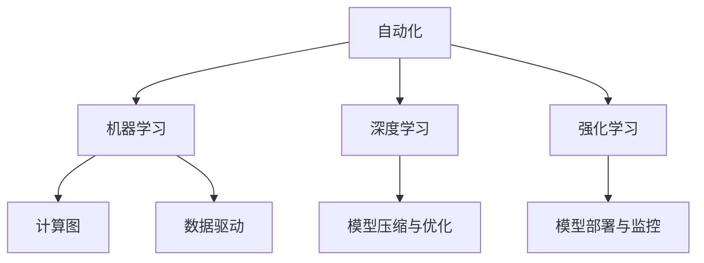

                 

# 计算领域的自动化前景与挑战

> 关键词：计算自动化,未来趋势,挑战,技术演进,人工智能

## 1. 背景介绍

### 1.1 问题由来
自动化作为人类历史进程的重要推动力，正逐步从简单的重复性任务向更为复杂的问题解决方向演进。在计算领域，自动化的目标是通过算法和模型对海量数据进行处理，实现高效、精确、可扩展的决策支持。然而，这一目标的实现面临着数据复杂性增加、算法模型多样性、计算资源有限等多重挑战。

### 1.2 问题核心关键点
自动化在计算领域的应用主要围绕以下几个关键点展开：
- **数据处理自动化**：从数据采集、清洗、特征工程到模型训练的全流程自动化。
- **模型选择与优化自动化**：根据问题特性和数据特性，自动选择和优化模型。
- **计算资源管理自动化**：合理分配和管理计算资源，实现高效计算。
- **模型解释与可解释性自动化**：开发可解释性强的模型，提升模型的信任度和应用范围。
- **模型集成与扩展自动化**：构建模块化、可复用的自动化系统，以适应不同应用场景。

## 2. 核心概念与联系

### 2.1 核心概念概述

为了深入理解计算领域自动化的现状和未来发展方向，本节将介绍几个核心概念及其之间的关系：

- **自动化(Automatication)**：指利用算法和模型自动化执行任务，减少人为干预，提高效率和准确性。
- **机器学习(Machine Learning, ML)**：通过数据训练算法模型，实现对未知数据的预测或分类。
- **深度学习(Deep Learning, DL)**：基于神经网络的机器学习，通过多层非线性变换学习数据特征。
- **强化学习(Reinforcement Learning, RL)**：通过试错反馈训练模型，优化决策策略。
- **计算图(Computational Graph)**：记录计算过程的图形表示，便于优化和执行。
- **模型压缩与优化(Compression & Optimization)**：通过剪枝、量化等方法减小模型尺寸和计算量。
- **模型部署与监控(Model Deployment & Monitoring)**：将训练好的模型部署到生产环境，并进行性能监控和优化。
- **数据驱动(Data-Driven)**：在决策过程中以数据为中心，自动生成和优化模型。

这些核心概念之间的逻辑关系可以通过以下Mermaid流程图来展示：



这个流程图展示了许多核心概念之间的关系：

1. 自动化利用机器学习和深度学习模型自动执行任务。
2. 深度学习和强化学习通过计算图记录和优化计算过程。
3. 模型压缩与优化是深度学习的重要应用之一，用于减小模型计算量。
4. 模型部署与监控是自动化应用到生产环境的必然环节。
5. 数据驱动是自动化决策的基石，自动生成和优化模型以适应任务需求。

## 3. 核心算法原理 & 具体操作步骤
### 3.1 算法原理概述

自动化在计算领域的应用核心在于利用算法和模型自动化处理数据，生成模型，部署应用。其关键步骤如下：

1. **数据采集与处理**：自动从各种数据源收集数据，并对数据进行清洗、去重、特征提取等处理。
2. **模型选择与训练**：自动选择合适的模型架构和参数，在数据上进行训练，获得最优模型。
3. **模型评估与优化**：对模型性能进行评估，根据评估结果自动调整模型参数或选择其他模型。
4. **模型部署与应用**：将训练好的模型部署到生产环境，实现自动推理和决策。
5. **模型监控与优化**：实时监控模型性能，自动调整模型参数或重新训练，以适应数据变化。

### 3.2 算法步骤详解

自动化在计算领域的应用流程如下：

1. **数据准备阶段**：
    - 数据采集：自动从数据库、日志文件、API接口等多种数据源获取数据。
    - 数据清洗：自动检测并修正数据中的噪声和异常值。
    - 数据预处理：自动进行数据标准化、归一化、特征工程等预处理工作。

2. **模型训练阶段**：
    - 自动选择模型：根据数据类型和任务需求，自动选择适合的模型，如线性回归、决策树、神经网络等。
    - 自动调整参数：通过交叉验证、网格搜索等技术，自动调整模型参数，如学习率、正则化系数等。
    - 自动训练模型：在选定模型和参数的基础上，自动训练模型。

3. **模型评估阶段**：
    - 自动评估模型：通过准确率、召回率、F1值等指标，自动评估模型性能。
    - 自动调整模型：根据评估结果，自动调整模型参数或选择更优模型。

4. **模型部署阶段**：
    - 自动部署模型：将训练好的模型部署到生产环境，如服务器、云平台等。
    - 自动推理应用：将新数据输入模型，自动生成预测结果或决策。

5. **模型监控阶段**：
    - 自动监控模型：实时监控模型性能，如响应时间、准确率等。
    - 自动优化模型：根据监控结果，自动调整模型参数或重新训练模型。

### 3.3 算法优缺点

自动化在计算领域的应用具有以下优点：
- **高效性**：自动化的算法和模型可以显著提高数据处理和模型训练的效率。
- **准确性**：通过精确的算法选择和参数优化，自动化系统能够获得更高的模型性能。
- **可扩展性**：自动化的系统可以方便地扩展到大规模数据和复杂模型。
- **灵活性**：根据任务需求，自动选择和调整算法和模型，适应不同的应用场景。

同时，自动化在计算领域的应用也存在一些局限性：
- **数据质量依赖**：自动化系统的性能依赖于数据的质量和完整性。
- **模型复杂性**：一些复杂模型需要手动调整或干预，增加了系统维护难度。
- **资源消耗**：自动化的系统需要大量的计算资源，尤其是大规模模型训练和推理。
- **可解释性**：自动化的模型往往缺乏可解释性，难以理解其内部决策过程。

### 3.4 算法应用领域

自动化在计算领域的应用非常广泛，包括但不限于以下几个领域：

- **自然语言处理(NLP)**：自动化的文本分类、情感分析、机器翻译等应用。
- **计算机视觉(CV)**：自动化的图像分类、目标检测、图像生成等应用。
- **推荐系统**：自动化的个性化推荐、广告投放等应用。
- **智能决策系统**：自动化的风险评估、欺诈检测、金融交易等应用。
- **智能运维**：自动化的网络监控、故障诊断、自动恢复等应用。
- **医疗诊断**：自动化的影像分析、基因分析、疾病预测等应用。

## 4. 数学模型和公式 & 详细讲解 & 举例说明
### 4.1 数学模型构建

自动化在计算领域的应用涉及多种数学模型，以下以机器学习模型为例，构建一个自动化的决策树模型。

假设有一个决策树模型 $T_{\theta}(x)$，其中 $x$ 为输入特征向量，$\theta$ 为模型参数。模型的决策树由一系列节点和边组成，每个节点表示一个特征的取值，边表示特征的取值范围。

决策树的构建步骤如下：
1. 选择合适的特征 $x_i$。
2. 对特征 $x_i$ 进行二值化处理，分为 $x_i=0$ 和 $x_i=1$ 两个子集。
3. 对每个子集进行递归决策，构建子树。
4. 最终得到一棵完整的决策树 $T_{\theta}$。

### 4.2 公式推导过程

决策树的构建过程可以通过递归公式来描述：

$$
T_{\theta}(x) = 
\begin{cases}
0 & \text{if } x_i=0 \text{ and } T_{\theta}(x_i=1)=1 \\
1 & \text{if } x_i=1 \text{ and } T_{\theta}(x_i=0)=1 \\
\theta_k & \text{if } x_i=\theta_k
\end{cases}
$$

其中 $\theta_k$ 表示叶节点的输出值，可以是分类标签或连续数值。

### 4.3 案例分析与讲解

以一个简单的信用卡欺诈检测为例，展示自动化决策树的构建过程。假设有一个特征 $x_1$ 表示交易金额，$x_2$ 表示交易时间。自动化系统通过以下步骤自动构建决策树：

1. 从训练集中随机选择一个特征 $x_1$。
2. 将 $x_1$ 划分为两个子集，如 $x_1<5000$ 和 $x_1\geq5000$。
3. 对每个子集进行递归处理，选择最优的特征 $x_2$ 进行划分。
4. 最终得到一棵决策树，对新交易进行分类。

## 5. 项目实践：代码实例和详细解释说明
### 5.1 开发环境搭建

在进行自动化项目实践前，需要准备好开发环境。以下是使用Python进行TensorFlow开发的環境配置流程：

1. 安装Anaconda：从官网下载并安装Anaconda，用于创建独立的Python环境。

2. 创建并激活虚拟环境：
```bash
conda create -n tf-env python=3.8 
conda activate tf-env
```

3. 安装TensorFlow：根据CUDA版本，从官网获取对应的安装命令。例如：
```bash
conda install tensorflow -c conda-forge
```

4. 安装各类工具包：
```bash
pip install numpy pandas scikit-learn matplotlib tqdm jupyter notebook ipython
```

完成上述步骤后，即可在`tf-env`环境中开始自动化项目开发。

### 5.2 源代码详细实现

下面以决策树分类任务为例，给出使用TensorFlow进行自动化决策树模型训练的代码实现。

首先，定义决策树模型的数据处理函数：

```python
import tensorflow as tf
from sklearn.model_selection import train_test_split
from sklearn.preprocessing import StandardScaler

def load_data():
    # 加载数据集
    X, y = load_dataset()
    # 标准化数据
    scaler = StandardScaler()
    X = scaler.fit_transform(X)
    # 划分训练集和测试集
    X_train, X_test, y_train, y_test = train_test_split(X, y, test_size=0.2)
    return X_train, X_test, y_train, y_test

def preprocess_data(X_train, X_test):
    # 构建决策树模型
    model = DecisionTreeClassifier()
    model.fit(X_train, y_train)
    # 预测测试集
    y_pred = model.predict(X_test)
    return y_pred, model

# 数据集加载
def load_dataset():
    # 加载数据集，如CSV文件
    # 数据集必须包含特征值和标签
    pass
```

然后，定义模型和优化器：

```python
from sklearn.tree import DecisionTreeClassifier
from tensorflow.keras.optimizers import Adam

model = DecisionTreeClassifier()
optimizer = Adam(learning_rate=0.001)
```

接着，定义训练和评估函数：

```python
from sklearn.metrics import accuracy_score

def train_model(X_train, y_train):
    # 训练模型
    model.fit(X_train, y_train)
    # 预测训练集
    y_pred = model.predict(X_train)
    # 计算准确率
    accuracy = accuracy_score(y_train, y_pred)
    return accuracy

def evaluate_model(X_test, y_test):
    # 预测测试集
    y_pred = model.predict(X_test)
    # 计算准确率
    accuracy = accuracy_score(y_test, y_pred)
    return accuracy
```

最后，启动训练流程并在测试集上评估：

```python
X_train, X_test, y_train, y_test = load_data()

accuracy_train = train_model(X_train, y_train)
accuracy_test = evaluate_model(X_test, y_test)

print(f"Training accuracy: {accuracy_train:.2f}%")
print(f"Test accuracy: {accuracy_test:.2f}%")
```

以上就是使用TensorFlow对决策树模型进行自动化训练的完整代码实现。可以看到，借助TensorFlow的高性能计算能力，自动化训练模型变得非常简单和高效。

### 5.3 代码解读与分析

让我们再详细解读一下关键代码的实现细节：

**load_data函数**：
- 定义数据加载函数，从数据源中获取特征和标签。
- 对数据进行标准化处理，确保不同特征的尺度一致。
- 将数据划分为训练集和测试集。

**preprocess_data函数**：
- 定义数据预处理函数，加载数据集并进行模型训练和预测。
- 使用决策树分类器对数据进行训练。
- 对测试集进行预测，返回预测结果和模型本身。

**train_model函数**：
- 定义模型训练函数，使用决策树分类器进行模型训练。
- 在训练集上对模型进行训练。
- 计算训练集上的准确率。

**evaluate_model函数**：
- 定义模型评估函数，使用决策树分类器对测试集进行预测。
- 计算测试集上的准确率。

**启动训练流程**：
- 加载训练集和测试集数据。
- 对模型进行训练，并在训练集上计算准确率。
- 对模型进行评估，并在测试集上计算准确率。
- 输出训练集和测试集上的准确率。

可以看到，TensorFlow提供了强大的计算能力，使得自动化训练模型变得非常简单。开发者可以专注于模型的选择和优化，而不必过多关注底层的实现细节。

当然，工业级的系统实现还需考虑更多因素，如模型的保存和部署、超参数的自动搜索、更灵活的任务适配层等。但核心的自动化训练流程基本与此类似。

## 6. 实际应用场景
### 6.1 金融风险管理

自动化的机器学习和深度学习模型在金融风险管理中有着广泛应用。传统风险管理依赖于专家经验和规则，而自动化的模型可以处理大规模数据，自动识别风险信号和模式，实现实时监控和预测。

具体而言，可以收集历史交易数据、市场数据、新闻事件等多种信息，构建自动化模型。模型能够自动检测异常交易行为，识别潜在欺诈风险，并及时预警。

### 6.2 智能制造

自动化的机器学习和深度学习模型在智能制造中也有重要应用。通过自动化的质量检测、设备维护和生产调度，可以实现高精度的制造过程。

具体而言，可以安装传感器和摄像头，自动收集生产过程中的数据。模型能够自动检测产品质量、设备状态和生产效率，实现实时反馈和优化。

### 6.3 智能交通

自动化的机器学习和深度学习模型在智能交通中也有着广泛应用。通过自动化的交通流量预测、路径优化和事故预警，可以实现高效、安全的交通管理。

具体而言，可以收集历史交通数据、天气信息、道路状况等多种信息，构建自动化模型。模型能够自动预测交通流量、优化行车路线、预警交通事故，提升交通管理效率。

### 6.4 未来应用展望

随着自动化技术的发展，未来将在更多领域得到应用，为各行各业带来变革性影响。

在智慧医疗领域，自动化的医疗诊断、病历分析、药物研发等应用将提升医疗服务的智能化水平，辅助医生诊疗，加速新药开发进程。

在智能教育领域，自动化的作业批改、学情分析、知识推荐等应用，因材施教，促进教育公平，提高教学质量。

在智慧城市治理中，自动化的城市事件监测、舆情分析、应急指挥等环节，提高城市管理的自动化和智能化水平，构建更安全、高效的未来城市。

此外，在企业生产、社会治理、文娱传媒等众多领域，自动化的AI应用也将不断涌现，为经济社会发展注入新的动力。相信随着技术的日益成熟，自动化方法将成为各行各业的重要工具，推动人工智能技术落地应用。

## 7. 工具和资源推荐
### 7.1 学习资源推荐

为了帮助开发者系统掌握自动化的理论基础和实践技巧，这里推荐一些优质的学习资源：

1. 《Python数据科学手册》：一本全面介绍Python数据科学库的书籍，包括NumPy、Pandas、Scikit-learn等，适合初学者和进阶者。

2. 《TensorFlow实战》：介绍TensorFlow框架的基本用法和高级技巧，涵盖机器学习、深度学习、自动化的各种应用场景。

3. 《深度学习入门》：一本深入浅出介绍深度学习的书籍，从原理到实践，涵盖各种模型和算法。

4. 《强化学习》：一本介绍强化学习基本概念和算法的书籍，适合想了解AI决策过程的读者。

5. 《Keras官方文档》：Keras框架的官方文档，提供大量示例代码和详细解释，是学习自动化的必备资源。

通过对这些资源的学习实践，相信你一定能够快速掌握自动化的精髓，并用于解决实际的计算问题。

### 7.2 开发工具推荐

高效的开发离不开优秀的工具支持。以下是几款用于自动化开发的常用工具：

1. TensorFlow：由Google主导开发的开源深度学习框架，生产部署方便，适合大规模工程应用。提供丰富的API和模型库，支持分布式计算。

2. Keras：基于TensorFlow等深度学习框架的高级API，适合快速原型开发和模型训练。

3. PyTorch：基于Python的开源深度学习框架，灵活性高，适合快速迭代研究。

4. Scikit-learn：提供大量机器学习算法和工具，适合数据处理和模型训练。

5. Jupyter Notebook：强大的交互式开发环境，支持代码执行、数据可视化、模型调试等多种功能。

6. Weights & Biases：模型训练的实验跟踪工具，可以记录和可视化模型训练过程中的各项指标，方便对比和调优。

合理利用这些工具，可以显著提升自动化任务的开发效率，加快创新迭代的步伐。

### 7.3 相关论文推荐

自动化技术的发展源于学界的持续研究。以下是几篇奠基性的相关论文，推荐阅读：

1. 《Deep Learning》：深度学习的奠基之作，介绍深度学习的基本原理和算法。

2. 《Reinforcement Learning: An Introduction》：强化学习的经典教材，涵盖强化学习的基本概念和算法。

3. 《TensorFlow: A System for Large-Scale Machine Learning》：TensorFlow的奠基论文，介绍TensorFlow的架构和设计思想。

4. 《Scikit-learn: Machine Learning in Python》：Scikit-learn的介绍论文，涵盖机器学习算法和工具的使用。

5. 《Neural Architecture Search with Reinforcement Learning》：介绍神经网络架构搜索的强化学习方法，通过自动化的算法选择优化模型。

这些论文代表了大自动化技术的发展脉络。通过学习这些前沿成果，可以帮助研究者把握学科前进方向，激发更多的创新灵感。

## 8. 总结：未来发展趋势与挑战

### 8.1 总结

本文对基于机器学习和深度学习的计算自动化进行了全面系统的介绍。首先阐述了自动化的应用背景和意义，明确了机器学习和深度学习在自动化中的关键作用。其次，从原理到实践，详细讲解了自动化的数学模型和算法步骤，给出了自动化项目开发的完整代码实例。同时，本文还广泛探讨了自动化技术在金融风险管理、智能制造、智能交通等多个领域的应用前景，展示了自动化的广泛应用场景。此外，本文精选了自动化的各类学习资源，力求为读者提供全方位的技术指引。

通过本文的系统梳理，可以看到，基于机器学习和深度学习的自动化技术正在成为计算领域的重要范式，极大地提升了数据处理和模型训练的效率。未来，伴随自动化技术的持续演进，其应用范围将不断拓展，带来更深远的影响。

### 8.2 未来发展趋势

展望未来，自动化的技术演进将呈现以下几个发展趋势：

1. **更加高效**：自动化系统将进一步优化算法和模型，实现更高的计算效率和更低的资源消耗。

2. **更加智能**：自动化系统将引入更多智能算法，如强化学习、元学习等，提升系统的决策能力和适应性。

3. **更加通用**：自动化系统将具备更强的数据驱动能力，能够自动选择和优化算法，适应各种应用场景。

4. **更加可解释**：自动化系统将开发更强的可解释性，通过可视化工具和解释模型，提升系统的信任度和应用范围。

5. **更加自动化**：自动化系统将实现更灵活的自动化流程，减少人为干预，提升系统的可靠性。

6. **更加安全**：自动化系统将引入更多安全技术，如数据加密、隐私保护等，保障系统的安全性和隐私性。

这些趋势凸显了自动化的广阔前景。这些方向的探索发展，必将进一步提升计算自动化系统的性能和应用范围，为各行各业带来更多创新。

### 8.3 面临的挑战

尽管自动化技术已经取得了瞩目成就，但在迈向更加智能化、普适化应用的过程中，它仍面临着诸多挑战：

1. **数据质量问题**：自动化系统的性能依赖于数据的质量和完整性，数据的不足或偏差可能导致系统性能下降。

2. **模型复杂性**：自动化系统中的模型复杂度高，维护难度大，容易出错。

3. **计算资源限制**：自动化系统需要大量的计算资源，尤其是大规模模型训练和推理。

4. **可解释性不足**：自动化系统中的模型往往缺乏可解释性，难以理解其内部决策过程。

5. **安全性问题**：自动化系统中的模型可能存在安全漏洞，如数据泄露、攻击等。

6. **伦理道德问题**：自动化系统中的模型可能存在偏见、歧视等问题，违反伦理道德规范。

解决这些挑战，需要多学科的协同攻关，从算法、数据、工程、伦理等多个维度进行全面优化。只有不断突破这些挑战，才能实现自动化的持续发展和应用。

### 8.4 研究展望

面对自动化面临的种种挑战，未来的研究需要在以下几个方面寻求新的突破：

1. **数据治理**：开发自动化的数据治理工具，确保数据的质量和完整性。

2. **模型简化**：研究更加简单高效的模型架构，降低模型的复杂性和维护难度。

3. **分布式计算**：研究分布式计算技术，实现高效的大规模计算。

4. **可解释性增强**：开发更强的可解释性模型，提升系统的透明度和信任度。

5. **安全防护**：引入更多安全技术，保障系统的安全性和隐私性。

6. **伦理约束**：引入伦理约束机制，确保系统的公平性和合规性。

这些研究方向的探索，必将引领自动化技术迈向更高的台阶，为各行各业带来更多创新和突破。面向未来，自动化的发展将更加全面和深入，实现更加智能化、普适化和安全的计算自动化。

## 9. 附录：常见问题与解答

**Q1：什么是计算自动化？**

A: 计算自动化指利用算法和模型自动化处理数据，生成模型，部署应用，实现高效、精确、可扩展的决策支持。

**Q2：计算自动化的核心算法有哪些？**

A: 计算自动化的核心算法包括机器学习、深度学习、强化学习等。这些算法能够自动选择和优化模型，实现高效的数据处理和模型训练。

**Q3：计算自动化面临哪些挑战？**

A: 计算自动化面临的主要挑战包括数据质量问题、模型复杂性、计算资源限制、可解释性不足、安全性问题、伦理道德问题等。

**Q4：自动化系统的可解释性有哪些提升方法？**

A: 提升自动化系统可解释性的方法包括可视化工具、解释模型、决策树等。这些方法能够帮助开发者理解模型的决策过程，提升系统的透明度和信任度。

**Q5：如何构建高效的自动化系统？**

A: 构建高效的自动化系统需要选择合适的算法和模型，自动选择和优化参数，实现高效的计算资源分配，并进行实时的性能监控和优化。

---

作者：禅与计算机程序设计艺术 / Zen and the Art of Computer Programming

