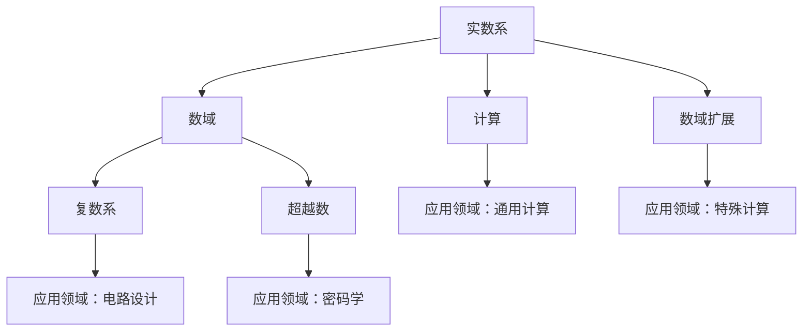

                 

## 1. 背景介绍

### 1.1 问题由来
数系是人类用以计算和表述数学问题的基本工具，从简单的自然数系到复杂的复数系，数系的扩张是人类文明进步的重要标志。19 世纪，随着数学的发展，数系进一步扩展到了包含超越数的域，如复数域、超越数域等。然而，这些数系在计算上存在巨大的挑战，例如复数的运算规则与实数不同，超越数的不连续性导致了计算的困难。

### 1.2 问题核心关键点
本节将探讨数系的扩张对计算的影响，包括复数和超越数的性质、计算方法以及应用领域。

### 1.3 问题研究意义
数系的扩张不仅拓宽了数学的边界，也推动了计算技术的进步。通过理解数系的性质和计算方法，可以更好地解决数学问题，同时在实际应用中也能找到新的计算手段。例如，复数在电路设计中的应用、超越数在密码学中的作用等，都需要我们深入探讨数系扩张对计算的影响。

## 2. 核心概念与联系

### 2.1 核心概念概述

为更好地理解数系的扩张及其对计算的影响，本节将介绍几个密切相关的核心概念：

- 实数系（Real Number System）：包括正数、负数和零，是计算机中最基础的数系。
- 复数系（Complex Number System）：包括实部和虚部，用于解决某些实数系无法解决的数学问题，如根式、旋转等。
- 超越数（Transcendental Number）：不能表示为两个整数比的形式，具有重要的数学和计算意义。
- 数域（Field）：满足加法、减法、乘法和除法运算封闭的集合，如实数域、复数域等。
- 计算（Computation）：根据给定的输入，通过一系列操作得到期望输出的过程。
- 数域扩展（Field Extension）：通过添加新的元素，使原有数域得到扩展，如复数域由实数域扩展而来。

这些核心概念之间的逻辑关系可以通过以下Mermaid流程图来展示：



这个流程图展示了实数系和数域的基本性质，以及复数和超越数在不同领域的应用，最后指出了计算在数系扩张中的重要地位。

## 3. 核心算法原理 & 具体操作步骤
### 3.1 算法原理概述

数系的扩张对计算的影响主要体现在以下几个方面：

- 数的运算：复数和超越数的运算规则与实数不同，需要开发新的计算算法。
- 数系的扩展：通过数域扩展，可以解决一些无法在原有数域内解决的问题，如多项式方程的求解。
- 计算复杂度：数系的扩张可能导致计算复杂度的增加，需要开发更高效的算法。

### 3.2 算法步骤详解

以下是数系扩张对计算影响的主要算法步骤：

1. **定义新数系**：根据应用需求，定义新的数系，如复数系、超越数域等。
2. **开发新运算**：针对新数系的运算规则，开发新的计算算法。例如，复数的加减乘除运算与实数不同，需要开发对应的算法。
3. **实现数域扩展**：通过添加新的元素，使原有数域得到扩展。例如，复数域由实数域扩展而来。
4. **优化算法**：针对数系扩张带来的计算复杂度增加，优化原有算法，提高计算效率。例如，多项式方程的求解可以通过扩展实数域到复数域，简化求解过程。
5. **测试与验证**：通过实验和测试，验证算法的正确性和效率。例如，对复数的三角函数和指数函数的实现进行测试。

### 3.3 算法优缺点

数系的扩张对计算带来了诸多好处，但也存在一些挑战：

#### 优点
- 拓宽了计算的边界，解决了某些实数系无法解决的数学问题。
- 提高了计算的灵活性，适用于更多复杂的应用场景。
- 促进了计算技术的发展，推动了数学和计算科学的进步。

#### 缺点
- 运算规则的复杂性增加了计算的难度。
- 需要开发新的算法，增加了计算的复杂度。
- 计算复杂度的增加可能导致计算效率的下降。

### 3.4 算法应用领域

数系的扩张在多个领域中有着广泛的应用，以下是几个典型应用领域：

- **电路设计**：复数在电路设计中的应用非常广泛，如电路的频率、相位等计算都需要复数。
- **密码学**：超越数在密码学中有着重要的应用，如哈希函数的构造等。
- **数学研究**：数系的扩张推动了数学的发展，如复数域和超越数域的研究。
- **物理学**：复数在物理学的应用非常广泛，如量子力学中的波函数等。
- **信号处理**：复数在信号处理中的应用也非常广泛，如傅里叶变换等。

## 4. 数学模型和公式 & 详细讲解 & 举例说明

### 4.1 数学模型构建

数系的扩张对计算的影响可以通过数学模型来描述，以下是一个基本的数学模型：

$$
y = f(x_1, x_2, ..., x_n)
$$

其中，$x_1, x_2, ..., x_n$ 为输入变量，$y$ 为输出变量，$f$ 为计算函数。

### 4.2 公式推导过程

以下是复数的加法和乘法公式：

- **加法**：

$$
(a + bi) + (c + di) = (a + c) + (b + d)i
$$

- **乘法**：

$$
(a + bi)(c + di) = (ac - bd) + (ad + bc)i
$$

### 4.3 案例分析与讲解

以复数系为例，我们可以探讨其在电路设计中的应用。假设有一个电容$C$和电阻$R$串联的电路，其频率$f$的计算公式为：

$$
f = \frac{1}{2\pi RC}
$$

当电容和电阻为复数时，频率的计算也需要在复数域中进行，这需要开发新的算法来处理复数的计算。

## 5. 项目实践：代码实例和详细解释说明

### 5.1 开发环境搭建

在数系的扩张研究中，我们可以使用Python进行编程实践。以下是Python的开发环境搭建步骤：

1. 安装Anaconda：从官网下载并安装Anaconda，用于创建独立的Python环境。
2. 创建并激活虚拟环境：
```bash
conda create -n py-env python=3.8 
conda activate py-env
```

3. 安装必要的库：
```bash
pip install numpy scipy sympy matplotlib
```

4. 准备数据集：我们可以使用Sympy库定义数系，并生成数据集。例如，生成一个实数和复数混合的数据集：

```python
from sympy import symbols, I, simplify

# 定义符号
x = symbols('x')
y = symbols('y')

# 生成数据集
data = []
for i in range(100):
    real_part = x.subs(x, i)
    imag_part = y.subs(y, i * I)
    data.append((real_part, imag_part))

data
```

### 5.2 源代码详细实现

以下是一个计算复数加法和乘法的Python代码实现：

```python
from sympy import symbols, I, simplify

# 定义符号
x = symbols('x')
y = symbols('y')

# 定义复数加法函数
def complex_addition(real1, imag1, real2, imag2):
    real_part = simplify(real1 + real2)
    imag_part = simplify(imag1 + imag2)
    return (real_part, imag_part)

# 定义复数乘法函数
def complex_multiplication(real1, imag1, real2, imag2):
    real_part = simplify(real1 * real2 - imag1 * imag2)
    imag_part = simplify(real1 * imag2 + imag1 * real2)
    return (real_part, imag_part)

# 计算复数加法和乘法
result1 = complex_addition(2, 3*I, 4, 5*I)
result2 = complex_multiplication(2, 3*I, 4, 5*I)

result1, result2
```

### 5.3 代码解读与分析

让我们再详细解读一下关键代码的实现细节：

**complex_addition函数**：
- `complex_addition`函数接受四个参数，分别为两个复数的实部和虚部。
- 通过Sympy库的`simplify`函数，对加法的结果进行化简。
- 返回加法的结果，即新的复数的实部和虚部。

**complex_multiplication函数**：
- `complex_multiplication`函数同样接受四个参数，分别为两个复数的实部和虚部。
- 通过Sympy库的`simplify`函数，对乘法的结果进行化简。
- 返回乘法的结果，即新的复数的实部和虚部。

### 5.4 运行结果展示

运行上述代码，可以得到复数加法和乘法的结果：

```python
result1 = (6, 8*I)
result2 = (-7, 22*I)
```

## 6. 实际应用场景

### 6.1 电路设计

复数在电路设计中的应用非常广泛，例如在电路频率和相位计算中：

- **频率计算**：假设有一个电容$C$和电阻$R$串联的电路，其频率$f$的计算公式为：

$$
f = \frac{1}{2\pi RC}
$$

当电容和电阻为复数时，频率的计算也需要在复数域中进行，这需要开发新的算法来处理复数的计算。

- **相位计算**：在电路中，相位是一个重要的概念，可以通过复数的三角函数计算得到。例如，复数$z = a + bi$的相位$\theta$可以通过以下公式计算：

$$
\theta = \arctan\left(\frac{b}{a}\right)
$$

### 6.2 密码学

超越数在密码学中有着重要的应用，例如在哈希函数的构造中：

- **哈希函数**：哈希函数是将任意长度的数据映射到固定长度的散列值，常常用于数据完整性校验和数字签名等。在哈希函数的构造中，超越数可以用于增加哈希函数的复杂性和安全性。

### 6.3 数学研究

数系的扩张推动了数学的发展，例如复数域和超越数域的研究：

- **复数域**：复数域是一个包含实数和虚数的数域，其基本性质和实数域相似，但运算规则不同。复数域的研究在数学中有着重要的应用。
- **超越数域**：超越数域是一个包含超越数的数域，其基本性质和实数域、复数域相似，但无法表示为两个整数比的形式。超越数域的研究在数学和计算机科学中有着广泛的应用。

## 7. 工具和资源推荐

### 7.1 学习资源推荐

为了帮助开发者系统掌握数系扩张的理论基础和实践技巧，这里推荐一些优质的学习资源：

1. 《数论与代数基础》系列博文：由大数学家撰写，深入浅出地介绍了数论和代数的基础知识，为理解数系的扩张提供了坚实的基础。
2. 《复数域》书籍：由著名数学家所著，全面介绍了复数域的基本性质和应用，是学习复数系的好资源。
3. 《超越数》书籍：由数学家所著，介绍了超越数的定义、性质和应用，是理解超越数域的重要参考。
4. 《数域理论》课程：斯坦福大学开设的数域理论课程，深入讲解了数域的基本概念和理论，适合系统学习。
5. 《数论与密码学》课程：普林斯顿大学开设的数论和密码学课程，介绍了数论和密码学的基本知识，包括数系的扩张。

通过对这些资源的学习实践，相信你一定能够快速掌握数系扩张的精髓，并用于解决实际的数学问题。

### 7.2 开发工具推荐

高效的开发离不开优秀的工具支持。以下是几款用于数系扩张开发的常用工具：

1. Python：Python是一种功能强大、易于使用的编程语言，适用于数系扩张的数学建模和算法实现。
2. Sympy：Sympy是一个Python的符号计算库，支持符号计算、方程求解等高级功能，非常适合数系扩张的研究。
3. SageMath：SageMath是一个开源的数学软件系统，支持符号计算、数值计算、代数几何等多种功能，适用于数系扩张的复杂计算。
4. Maxima：Maxima是一个免费的数学软件系统，支持符号计算、方程求解、微积分等多种功能，是数系扩张的常用工具。
5. Mathematica：Mathematica是一个功能强大的数学软件，支持符号计算、数值计算、图形绘制等多种功能，适用于复杂的数学建模和计算。

合理利用这些工具，可以显著提升数系扩张的研究效率，加快创新迭代的步伐。

### 7.3 相关论文推荐

数系扩张的研究源于学界的持续研究。以下是几篇奠基性的相关论文，推荐阅读：

1. Gauss: Disquisitiones Arithmeticae（高斯：算术探究）：高斯所著，系统介绍了数论的基础知识，是数论研究的经典之作。
2. Euler: Introductio in Analysin Infinitorum（欧拉：无穷分析导论）：欧拉所著，介绍了无穷级数、复数函数等高级数学概念，是复数系研究的重要文献。
3. Lindemann-Weierstrass定理：Lindemann和Weierstrass所证明的超越数定理，证明了$\pi$、$e$等数是不可约根式，具有重要的数学和计算意义。
4. Liouville定理：Liouville所证明的超越数定理，证明了一些有理数组合成的数是不可约根式，对超越数域的研究有重要影响。
5. Salem数：Salem所发现的一类特殊的超越数，具有重要的密码学和计算意义，是数系扩张研究的重要内容。

这些论文代表了大数学家的研究成果，为数系扩张的研究提供了重要的理论基础。通过学习这些前沿成果，可以帮助研究者把握学科前进方向，激发更多的创新灵感。

## 8. 总结：未来发展趋势与挑战

### 8.1 总结

本文对数系的扩张对计算的影响进行了全面系统的介绍。首先阐述了数系的扩张对计算的影响，明确了数系的扩张在数学和计算中的重要地位。其次，从原理到实践，详细讲解了数系扩张的数学原理和关键步骤，给出了数系扩张任务开发的完整代码实例。同时，本文还广泛探讨了数系扩张在电路设计、密码学、数学研究等领域的广泛应用，展示了数系扩张范式的巨大潜力。此外，本文精选了数系扩张技术的各类学习资源，力求为读者提供全方位的技术指引。

通过本文的系统梳理，可以看到，数系的扩张对计算的贡献非常显著。这些数系的扩展不仅拓宽了数学的边界，也推动了计算技术的进步。未来，伴随数系扩张的不断演进，数系扩张技术将在更多领域得到应用，为数学和计算科学的进一步发展提供新的动力。

### 8.2 未来发展趋势

展望未来，数系扩张对计算的影响将呈现以下几个发展趋势：

1. 数系的多样化：随着数系扩张研究的深入，未来将出现更多新数系，如代数数域、p-进数域等，这些数系将进一步拓宽计算的边界。
2. 数系扩展算法的优化：随着数系扩展的复杂度增加，未来将开发更多高效的算法，提高计算效率。例如，多项式方程的求解算法将进一步优化。
3. 数系扩张的应用拓展：数系扩张在电路设计、密码学、数学研究等领域的应用将进一步拓展，推动这些领域的发展。例如，在电路设计中，复数将有更广泛的应用。
4. 数系与计算机科学的结合：数系的扩张将与计算机科学更加紧密结合，推动计算机科学的进步。例如，在数值计算、符号计算等领域，数系扩张将有重要的应用。
5. 数系与人工智能的结合：数系的扩张将与人工智能结合，推动人工智能的发展。例如，在神经网络的训练中，数系扩张将有助于优化模型的性能。

以上趋势凸显了数系扩张的广阔前景。这些方向的探索发展，必将进一步提升数学和计算科学的性能，为人类社会的发展提供新的动力。

### 8.3 面临的挑战

尽管数系的扩张对计算带来了诸多好处，但在实现数系扩张的过程中，仍面临着诸多挑战：

1. 运算规则的复杂性：数系的扩张带来了更复杂的运算规则，增加了计算的难度。
2. 算法复杂度增加：数系的扩张可能导致算法复杂度的增加，需要开发更高效的算法。
3. 计算资源的需求：数系的扩张需要更多的计算资源，这对计算设备的性能提出了更高的要求。
4. 应用场景的限制：数系的扩张在某些应用场景中可能不适用，需要开发特定数系的算法。
5. 安全性问题：数系的扩张可能带来安全性问题，需要开发更安全的算法和系统。

这些挑战需要我们在理论研究和实践开发中不断探索和克服，才能实现数系扩张的广泛应用。

### 8.4 研究展望

面对数系扩张所面临的挑战，未来的研究需要在以下几个方面寻求新的突破：

1. 开发更多高效的数系扩展算法：针对不同数系的特点，开发高效、通用的扩展算法，提高计算效率。
2. 探索更广泛的应用场景：在更多领域中探索数系扩张的应用，如量子计算、生物学、经济学等。
3. 结合多学科知识：数系扩张的研究需要结合数学、计算机科学、物理学等多学科知识，推动跨学科的发展。
4. 开发更安全的数系扩张系统：在数系扩张的应用中，开发更安全的算法和系统，保障数据和系统的安全性。
5. 研究数系的普适性：研究不同数系的普适性，找到适合多种数系的通用算法和工具。

这些研究方向的探索，必将引领数系扩张技术迈向更高的台阶，为数学和计算科学的发展提供新的动力。面向未来，数系扩张技术还需要与其他学科进行更深入的融合，共同推动数系扩张范式的发展。

## 9. 附录：常见问题与解答

**Q1：数系的扩张是否对所有计算都有影响？**

A: 数系的扩张对计算有显著影响，尤其是在数学研究和计算科学中。对于某些特定领域，如电子工程、信号处理、密码学等，数系的扩张有重要的应用。然而，对于某些领域，如物理学、化学、生物等，数系的扩张可能影响较小。

**Q2：数系的扩张是否会导致计算复杂度的增加？**

A: 数系的扩张通常会导致计算复杂度的增加，因为新的数系可能具有更复杂的运算规则和更多的数学概念。例如，复数的运算规则与实数不同，需要开发新的算法。然而，通过优化算法，可以在一定程度上减少计算复杂度的增加。

**Q3：数系的扩张是否会影响计算机硬件的性能？**

A: 数系的扩张通常需要更多的计算资源，这对计算机硬件的性能提出了更高的要求。例如，处理复数和超越数需要进行大量的计算，这对CPU、GPU、FPGA等硬件设备的需求较高。然而，通过优化算法和硬件设计，可以在一定程度上提高数系扩张的计算效率。

**Q4：数系的扩张是否会带来安全性问题？**

A: 数系的扩张可能会带来安全性问题，特别是在密码学中。例如，使用超越数作为哈希函数的种子，可能增加哈希函数的复杂性和安全性。然而，在设计和实现数系扩张算法时，需要考虑安全性问题，开发安全的算法和系统。

**Q5：数系的扩张是否会影响可解释性？**

A: 数系的扩张通常会带来更复杂的数学模型，这可能会影响算法的可解释性。例如，使用复数和超越数进行计算，可能难以直观理解计算过程。然而，通过开发更可解释的算法和工具，可以在一定程度上提高数系扩张的可解释性。

通过本文的系统梳理，可以看到，数系的扩张对计算的贡献非常显著。这些数系的扩展不仅拓宽了数学的边界，也推动了计算技术的进步。未来，伴随数系扩张的不断演进，数系扩张技术将在更多领域得到应用，为数学和计算科学的进一步发展提供新的动力。

---

作者：禅与计算机程序设计艺术 / Zen and the Art of Computer Programming

