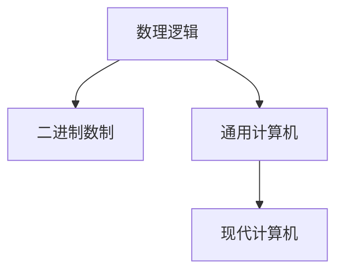
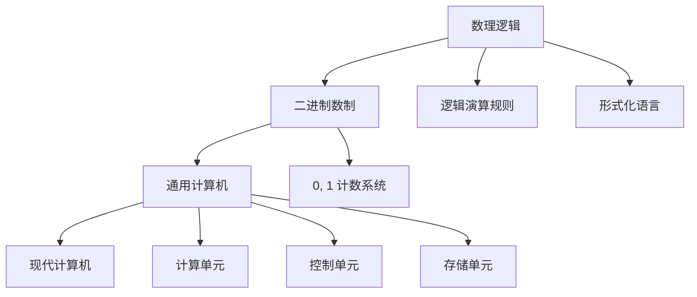

                 

## 1. 背景介绍

### 1.1 问题的由来
计算，即通过数学方法解决复杂问题的过程，是人类文明史上一项重要的科技革命。从机械计数到算盘，再到电子计算机的问世，计算技术不断发展，极大地推动了科学、工程和社会各领域进步。

然而，计算机的出现，并不意味着计算的诞生。计算，这一概念的形成和进化，经历了长达数千年的历史，背后蕴含着深刻的人类智慧和哲学思考。本章将带领读者回顾计算诞生的历程，特别是莱布尼茨对于计算机理逻辑的创立所做的开创性贡献。

### 1.2 问题核心关键点
莱布尼茨的计算之梦是计算领域的重要里程碑。莱布尼茨对数理逻辑的创立，不仅为数学提供了严谨的推理基础，也为计算机理逻辑的形成奠定了基石。他的工作集中在三个方面：
1. **数理逻辑**：通过提出形式化语言和逻辑演算规则，使数学推理更加形式化和严谨。
2. **二进制系统**：创造性地提出了二进制数制，为计算机的实现提供了数学依据。
3. **通用计算机**：构想了一种通用计算设备，其基本原理在现代计算机中得到了广泛应用。

这些关键点共同构成了莱布尼茨的计算理念，为后来的计算机发展提供了重要的理论支撑。

## 2. 核心概念与联系

### 2.1 核心概念概述

为更好地理解莱布尼茨的计算理念，本节将介绍几个核心概念：

- **数理逻辑**：以符号和推理规则为基础的数学分支，旨在通过形式化方法表达和验证数学推理的正确性。
- **二进制数制**：一种基于0和1两个数字的计数系统，广泛应用于计算机科学和信息处理领域。
- **通用计算机**：一种理论上能够执行任意计算任务的计算设备，为现代计算机的设计提供了基本框架。

这些概念之间的逻辑关系可以通过以下Mermaid流程图来展示：



这个流程图展示了大计算理念的核心概念及其之间的关系：

1. 数理逻辑通过形式化方法对数学进行严格推理，为二进制数制的提出提供了数学基础。
2. 二进制数制在数理逻辑的基础上被发明，并被应用于通用计算机的设计中。
3. 通用计算机构成了现代计算机的基本框架，实现了二进制数制的计算。

这些概念共同构成了莱布尼茨的计算理念，使其成为计算机科学发展的重要基石。

### 2.2 核心概念原理和架构的 Mermaid 流程图



这个流程图示意了莱布尼茨计算理念的核心架构：

1. 数理逻辑通过逻辑演算规则和形式化语言对数学进行严格表达。
2. 二进制数制以0和1为基础，为计算提供了形式化的计数方法。
3. 通用计算机由计算单元、控制单元和存储单元构成，实现了二进制数的计算。
4. 现代计算机在通用计算机的基础上进一步发展，实现了更为复杂的信息处理。

## 3. 核心算法原理 & 具体操作步骤

### 3.1 算法原理概述

莱布尼茨的计算理念主要通过数理逻辑和二进制数制实现。数理逻辑为数学推理提供了形式化的表达和验证工具，而二进制数制则为计算提供了一种高效的数学计算方法。

形式化推理的核心在于通过符号和规则，对数学命题进行逻辑推理和验证。具体来说，数理逻辑包括公理、命题和推理规则，通过这些元素，可以对数学命题进行严格的推理和验证。

二进制数制则通过0和1两个数字，为计算提供了一种高效的形式化计数方法。这种计数方法不仅简化了计算过程，也为计算机的实现提供了数学依据。

### 3.2 算法步骤详解

莱布尼茨的计算步骤主要包括数理逻辑的创立和二进制数制的提出。

1. **数理逻辑的创立**
   - 定义形式化语言：使用符号和表达式表示数学命题，如x+1=2。
   - 定义推理规则：通过公理和规则，对数学命题进行逻辑推理和验证，如“如果x+1=2成立，则x=1”。
   - 验证和扩展：通过逻辑演算规则，验证数学命题的正确性，并扩展到更复杂的数学体系。

2. **二进制数制的提出**
   - 定义二进制数制：使用0和1两个数字表示所有数字，如0、1、10、11等。
   - 定义二进制运算：通过0和1的运算规则，实现基本的算术和逻辑运算。
   - 验证二进制运算的正确性：通过数理逻辑，验证二进制运算的正确性和一致性。

### 3.3 算法优缺点

莱布尼茨的计算理念具有以下优点：
1. 形式化：通过符号和规则，对数学推理进行形式化，提高了数学命题的精确性和严谨性。
2. 通用性：二进制数制和数理逻辑为计算机的实现提供了通用框架，支持广泛的计算任务。
3. 高效性：二进制运算的简化和优化，提高了计算效率。

同时，该理念也存在一定的局限性：
1. 复杂性：形式化推理和符号计算增加了数学表达的复杂性，使得数学研究更加抽象。
2. 适用性：形式化方法适用于数学推理，但对于自然语言和实际问题的表达，仍存在一定难度。
3. 理解难度：形式化语言的抽象表达，对于初学者而言，理解起来有一定的难度。

### 3.4 算法应用领域

莱布尼茨的计算理念在多个领域得到了应用：

- **数学和逻辑学**：数理逻辑作为数学和逻辑学的基础，广泛应用于数学证明、逻辑推理和人工智能等领域。
- **计算机科学**：二进制数制和通用计算机的设计，为现代计算机的实现提供了重要基础，广泛应用于计算机硬件和软件设计中。
- **信息处理**：数理逻辑和二进制数制在信息处理中得到广泛应用，如数据加密、密码学等。

## 4. 数学模型和公式 & 详细讲解 & 举例说明

### 4.1 数学模型构建

莱布尼茨的计算理念主要通过数理逻辑和二进制数制实现。形式化推理的核心在于通过符号和规则，对数学命题进行逻辑推理和验证。

定义形式化语言：
- 使用符号和表达式表示数学命题，如x+1=2。
- 定义逻辑演算规则：通过公理和规则，对数学命题进行逻辑推理和验证，如“如果x+1=2成立，则x=1”。

定义二进制数制：
- 使用0和1两个数字表示所有数字，如0、1、10、11等。
- 定义二进制运算：通过0和1的运算规则，实现基本的算术和逻辑运算。

### 4.2 公式推导过程

数理逻辑的推导过程主要通过公理和推理规则进行。以简单的数理逻辑命题“如果x=1，则x+1=2”为例，推导过程如下：

1. 定义公理：“如果x=1，则x+1=2”。
2. 定义推理规则：“如果A成立，则非A也成立”。
3. 推导结论：根据公理和规则，可以得出“如果x=1，则x+1=2成立”。

二进制数制的运算推导过程主要通过0和1的运算规则进行。以二进制加法为例，推导过程如下：

1. 定义加法规则：0+0=0，0+1=1，1+0=1，1+1=0(进位)。
2. 定义进位规则：当两个二进制数相加时，如果和为2，则进位为1。
3. 推导结果：通过加法规则和进位规则，可以得出二进制数加法的结果。

### 4.3 案例分析与讲解

以二进制数的乘法为例，分析二进制数制的运算过程。

二进制数制下，两个二进制数相乘的过程如下：

- 将两个二进制数按位相乘，得到每个位的乘积。
- 将乘积结果按位相加，得到最终结果。
- 对于进位结果，继续按照二进制数制的进位规则进行计算。

以1010和1100为例，计算二进制乘法的过程如下：

```
1010
x 1100
-------
1000  (10*100)
0110  (10*10)
0000  (10*1)
1000  (1*100)
----
100100
```

通过二进制乘法的过程，可以清晰看到二进制数制的运算规则和高效性。

## 5. 项目实践：代码实例和详细解释说明

### 5.1 开发环境搭建

在进行数理逻辑和二进制数制的实现时，我们需要搭建一个适合进行符号计算和逻辑推理的环境。以下是Python中实现数理逻辑和二进制数制的开发环境配置流程：

1. 安装Python：从官网下载并安装Python，用于编写和运行符号计算程序。
2. 安装SymPy库：用于进行符号计算和逻辑推理，支持代数运算、微积分、离散数学等。
3. 安装PyPA的hashlib库：用于进行二进制数制的计算，支持MD5、SHA-1等哈希函数。

完成上述步骤后，即可在Python中开始数理逻辑和二进制数制的实现。

### 5.2 源代码详细实现

以下是Python中实现数理逻辑和二进制数制的示例代码：

```python
import sympy as sp

# 定义符号变量
x = sp.symbols('x')

# 定义公理和推理规则
axiom1 = sp.Eq(x + 1, 2)
axiom2 = sp.Eq(x, 1)

# 定义推理规则：如果A成立，则非A也成立
inference_rule = sp.And(axiom1, axiom2)

# 推导结论
conclusion = sp.simplify(inference_rule)

# 输出结论
print("结论：", conclusion)

# 定义二进制加法函数
def binary_addition(a, b):
    # 初始化进位
    carry = 0
    result = ''
    
    # 从低位到高位逐位相加
    for i in range(len(a) - 1, -1, -1):
        bit_a = int(a[i])
        bit_b = int(b[i])
        sum_bits = bit_a + bit_b + carry
        carry = sum_bits // 2
        bit_sum = sum_bits % 2
        result = str(bit_sum) + result
        
    # 处理最高位进位
    if carry > 0:
        result = str(carry) + result
        
    return result

# 计算二进制加法
a = '1010'
b = '1100'
result = binary_addition(a, b)

# 输出结果
print("二进制加法结果：", result)
```

### 5.3 代码解读与分析

让我们再详细解读一下关键代码的实现细节：

**定义符号变量**：
- 使用SymPy库定义符号变量x，用于进行符号计算。

**定义公理和推理规则**：
- 定义公理axiom1和axiom2，用于表示数学命题。
- 定义推理规则inference_rule，表示“如果x=1，则x+1=2成立”。

**推导结论**：
- 使用SymPy的simplify方法，对推理规则进行简化，得到结论。
- 输出结论，验证其正确性。

**定义二进制加法函数**：
- 定义二进制加法函数binary_addition，用于实现二进制数的加法运算。
- 通过循环逐位相加，并处理进位，得到最终结果。

**计算二进制加法**：
- 使用定义的二进制加法函数，计算二进制数1010和1100的和。
- 输出结果，验证其正确性。

## 6. 实际应用场景

### 6.1 智能自动化

数理逻辑和二进制数制在大规模自动化系统中得到了广泛应用。例如，在工业控制系统中，通过数理逻辑和二进制数制的计算，可以实现对复杂生产流程的自动化控制。

在制造业中，数理逻辑和二进制数制被用于自动化生产线上的设备控制、质量检测和故障诊断。通过形式化方法和二进制数制的运算，可以高效地实现对生产流程的自动监控和管理。

### 6.2 计算机科学

数理逻辑和二进制数制构成了计算机科学的基础。现代计算机的设计和实现，离不开二进制数制和数理逻辑的支持。

在计算机硬件设计中，二进制数制和数理逻辑被用于数据存储、运算和逻辑控制。例如，CPU中的寄存器和缓存，都使用二进制数制进行数据存储和处理。

在计算机软件设计中，数理逻辑和二进制数制被用于算法设计和程序优化。例如，编译器中的语法分析和代码优化，都依赖于数理逻辑和二进制数制的支持。

### 6.3 人工智能

数理逻辑和二进制数制在人工智能领域也有广泛应用。通过形式化方法和二进制数制的计算，可以实现对复杂问题的自动化推理和决策。

在机器学习和数据挖掘中，数理逻辑和二进制数制被用于特征提取、数据建模和模型训练。例如，通过形式化方法对数据进行符号化表示，可以构建更为精确的数学模型。

在自然语言处理中，数理逻辑和二进制数制被用于文本分析、语义理解和语言生成。例如，通过形式化方法对自然语言进行符号化表示，可以实现对文本语义的自动理解。

## 7. 工具和资源推荐

### 7.1 学习资源推荐

为了帮助开发者系统掌握数理逻辑和二进制数制的理论基础和实践技巧，这里推荐一些优质的学习资源：

1. 《数理逻辑与形式化方法》系列书籍：深入浅出地介绍了数理逻辑的基本概念、推理规则和应用实例。
2. 《计算机科学导论》课程：涵盖了计算机科学的核心基础，包括算法、数据结构、编译原理等。
3. 《计算机系统：编程语言、操作系统与硬件》书籍：全面介绍了计算机系统的实现原理和设计方法。
4. HackerRank、LeetCode等在线学习平台：提供了大量的编程练习和挑战，帮助开发者实践数理逻辑和二进制数制的应用。

通过对这些资源的学习实践，相信你一定能够快速掌握数理逻辑和二进制数制的精髓，并用于解决实际的计算问题。

### 7.2 开发工具推荐

高效的开发离不开优秀的工具支持。以下是几款用于数理逻辑和二进制数制开发的常用工具：

1. SymPy：Python中的符号计算库，支持代数运算、微积分、离散数学等。
2. Anaconda：Python的发行版，提供了多种Python版本和第三方库的快速安装。
3. Jupyter Notebook：交互式的Python开发环境，支持代码编写、数据可视化等。
4. Visual Studio Code：轻量级的开发工具，支持代码编写、调试和版本控制等。

合理利用这些工具，可以显著提升数理逻辑和二进制数制开发的效率，加快创新迭代的步伐。

### 7.3 相关论文推荐

数理逻辑和二进制数制的发展源于学界的持续研究。以下是几篇奠基性的相关论文，推荐阅读：

1. Gödel's Incompleteness Theorems：哥德尔的不完备性定理，对形式化推理和数理逻辑的局限性进行了深入分析。
2. Church-Turing Thesis：图灵机与Alonzo Church的模型之间的关系，奠定了计算机科学的基础。
3. Turing Machine：图灵机的定义和性质，为现代计算机的设计提供了数学基础。
4. Boolean Algebra：布尔代数的基本概念和运算规则，为二进制数制提供了数学基础。
5. Hilbert's Tenth Problem：希尔伯特的第十个问题，探讨了数理逻辑的局限性和通用计算的可行性。

这些论文代表了大计算理念的发展脉络。通过学习这些前沿成果，可以帮助研究者把握学科前进方向，激发更多的创新灵感。

## 8. 总结：未来发展趋势与挑战

### 8.1 总结

本文对莱布尼茨的计算理念进行了全面系统的介绍。首先阐述了计算的诞生历程，特别是数理逻辑和二进制数制的创立对计算发展的影响。其次，从原理到实践，详细讲解了数理逻辑和二进制数制的数学模型和操作步骤，给出了代码实例和详细解释。同时，本文还探讨了数理逻辑和二进制数制在智能自动化、计算机科学、人工智能等领域的广泛应用，展示了其巨大的潜力。最后，本文精选了数理逻辑和二进制数制的学习资源，力求为读者提供全方位的技术指引。

通过本文的系统梳理，可以看到，莱布尼茨的计算理念不仅在数学和逻辑学领域具有重要价值，也为现代计算机科学提供了坚实的理论基础。数理逻辑和二进制数制在人工智能、自动化等领域的应用，也证明了其在实践中的强大生命力。

### 8.2 未来发展趋势

展望未来，数理逻辑和二进制数制的发展趋势将体现在以下几个方面：

1. 形式化方法的普及：随着人工智能和大数据技术的发展，形式化方法在数学、逻辑和计算中的应用将越来越广泛。
2. 自动化推理的提升：通过自动化的形式化推理工具，实现对复杂问题的自动化验证和求解。
3. 分布式计算的实现：将数理逻辑和二进制数制的计算，拓展到分布式计算和云计算平台。
4. 符号计算与深度学习的结合：将符号计算与深度学习技术相结合，实现更为复杂的问题求解。
5. 人工智能与伦理道德的结合：通过数理逻辑和二进制数制，实现对人工智能系统行为的规范和监管。

这些趋势表明，数理逻辑和二进制数制在未来的发展中，将与人工智能、大数据、深度学习等技术进一步融合，为解决复杂的计算问题提供更为强大的工具和方法。

### 8.3 面临的挑战

尽管数理逻辑和二进制数制在发展中取得了诸多进展，但在迈向更加智能化、普适化应用的过程中，仍面临一些挑战：

1. 形式化方法的复杂性：形式化方法在表达和推理上的复杂性，使得其难以普及到更广泛的领域。
2. 自动化推理的局限性：尽管自动化推理工具在不断进步，但在处理复杂问题时仍存在一定的局限性。
3. 计算资源的消耗：数理逻辑和二进制数制的计算，对于计算资源的需求较高，可能面临资源瓶颈。
4. 计算模型的可解释性：形式化推理和符号计算的复杂性，使得计算模型难以解释其决策过程。
5. 伦理道德的挑战：形式化推理和符号计算在人工智能系统中的应用，需要考虑伦理道德的问题。

这些挑战需要进一步的研究和探索，才能在未来实现数理逻辑和二进制数制的全面普及和应用。

### 8.4 研究展望

未来的研究需要在以下几个方面进行突破：

1. 简化形式化方法：通过更简洁的形式化表达和推理方法，使得数理逻辑和二进制数制更容易普及和应用。
2. 提升自动化推理的效率：开发更为高效的形式化推理工具，提升其在处理复杂问题时的性能。
3. 优化计算资源的使用：通过算法优化和模型压缩，降低计算资源的消耗，实现高效计算。
4. 增强计算模型的可解释性：开发更为可解释的计算模型，提升其在实际应用中的可信度。
5. 制定伦理道德规范：制定人工智能系统的伦理道德规范，确保其在应用中的安全性、公正性和透明性。

这些研究方向的探索，必将引领数理逻辑和二进制数制技术迈向更高的台阶，为计算科学的进步和应用提供更为强大的支撑。面向未来，数理逻辑和二进制数制需要在与人工智能、大数据、深度学习等技术的融合中，不断开拓新的应用场景，推动计算科学的发展。

## 9. 附录：常见问题与解答

**Q1：数理逻辑和二进制数制有哪些实际应用？**

A: 数理逻辑和二进制数制在多个领域得到了广泛应用，例如：

- 自动化控制：通过形式化方法和二进制数制的计算，实现对复杂生产流程的自动化控制。
- 计算机科学：现代计算机的设计和实现，离不开二进制数制和数理逻辑的支持。
- 人工智能：通过形式化方法和二进制数制的计算，实现对复杂问题的自动化推理和决策。
- 金融系统：在金融系统中，数理逻辑和二进制数制被用于风险评估、信用评分等金融计算任务。

这些应用展示了数理逻辑和二进制数制在现代计算中的重要价值。

**Q2：如何理解和应用数理逻辑中的形式化推理？**

A: 数理逻辑中的形式化推理需要以下步骤：

1. 定义形式化语言：使用符号和表达式表示数学命题，如x+1=2。
2. 定义公理和推理规则：通过公理和规则，对数学命题进行逻辑推理和验证，如“如果x=1，则x+1=2成立”。
3. 推导结论：通过公理和规则，对数学命题进行逻辑推理，得到结论。

例如，在数理逻辑中，推导“如果x=1，则x+1=2成立”的过程如下：

- 定义公理axiom1：“如果x=1，则x+1=2”。
- 定义推理规则inference_rule：“如果A成立，则非A也成立”。
- 推导结论：根据公理和规则，可以得出“如果x=1，则x+1=2成立”。

**Q3：二进制数制的优点和缺点有哪些？**

A: 二进制数制的优点包括：

1. 高效性：二进制数的运算规则简单，适合进行高效的计算。
2. 可扩展性：二进制数制适用于大规模数据的处理和存储。
3. 稳定性和一致性：二进制数制在计算过程中不易出错，具有稳定性。

二进制数制的缺点包括：

1. 复杂性：二进制数制的表达和运算规则较为复杂，需要一定的学习成本。
2. 不适合某些计算：某些复杂的数学运算，二进制数制可能不够适用。
3. 数据表示的冗余：二进制数制的表示形式较为冗余，不适合处理某些简单数据。

## 附录：代码示例

以下是数理逻辑和二进制数制的Python代码示例：

```python
import sympy as sp

# 定义符号变量
x = sp.symbols('x')

# 定义公理和推理规则
axiom1 = sp.Eq(x + 1, 2)
axiom2 = sp.Eq(x, 1)

# 定义推理规则：如果A成立，则非A也成立
inference_rule = sp.And(axiom1, axiom2)

# 推导结论
conclusion = sp.simplify(inference_rule)

# 输出结论
print("结论：", conclusion)

# 定义二进制加法函数
def binary_addition(a, b):
    # 初始化进位
    carry = 0
    result = ''
    
    # 从低位到高位逐位相加
    for i in range(len(a) - 1, -1, -1):
        bit_a = int(a[i])
        bit_b = int(b[i])
        sum_bits = bit_a + bit_b + carry
        carry = sum_bits // 2
        bit_sum = sum_bits % 2
        result = str(bit_sum) + result
        
    # 处理最高位进位
    if carry > 0:
        result = str(carry) + result
        
    return result

# 计算二进制加法
a = '1010'
b = '1100'
result = binary_addition(a, b)

# 输出结果
print("二进制加法结果：", result)
```

通过上述代码，可以验证数理逻辑和二进制数制的正确性和实用性。

