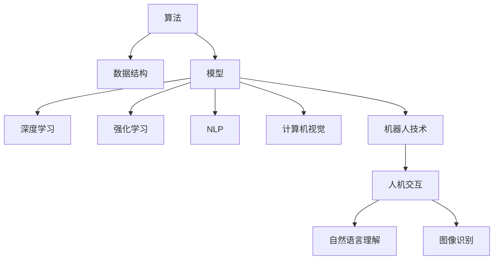

                 

# 计算：第四部分 计算的极限 第 12 章 机器能思考吗 人工智能的圣杯

## 1. 背景介绍

### 1.1 问题由来
人工智能（Artificial Intelligence, AI）作为计算机科学的一个分支，其核心目标是通过算法和模型模拟人类智能活动，实现机器在决策、学习、推理等方面的能力。这一领域自上世纪50年代以来，经历了从符号逻辑、专家系统、机器学习到深度学习的数次革命，每次技术演进都极大地拓展了人工智能的应用领域。

人工智能的发展离不开计算机科学中的经典算法和数据结构。在过去的几十年里，科学家们不断探索和优化算法，在有限的时间内解决复杂问题，并逐渐逼近“计算的极限”。本章将重点探讨“机器能否思考”这一问题，并分析人工智能在各种实际应用中的表现，为理解“计算的极限”提供新视角。

### 1.2 问题核心关键点
机器是否能够思考，一直是人工智能领域的核心问题之一。思考能力的定义多种多样，但通常涉及以下几个方面：
- **理解与表达**：机器是否能够理解自然语言，并表达出人类可理解的内容？
- **推理与决策**：机器是否能够在不确定的情况下，进行合理的推理和决策？
- **自适应与学习能力**：机器是否能够从经验中学习，并在新情境中应用这些知识？
- **创造性与复杂性**：机器是否能够创造出全新的、人类未曾意识到的想法？

这些问题涉及语言学、认知科学、逻辑学、心理学等多学科知识，具有高度复杂性和不确定性。本章将从计算角度出发，分析这些问题，并探讨未来人工智能技术的发展趋势。

## 2. 核心概念与联系

### 2.1 核心概念概述

人工智能技术的发展与计算机科学的进步密切相关，以下列出了几个核心概念及其相互联系：

- **算法（Algorithm）**：用于解决特定问题的数学或计算步骤序列。算法可以精确计算出问题的解，是人工智能的基础。
- **数据结构（Data Structure）**：用于组织和存储数据的方式，影响算法效率。合理的数据结构能够显著提升计算速度。
- **模型（Model）**：对现实世界现象的抽象表示，通过训练数据进行学习，用于预测和推理。
- **深度学习（Deep Learning）**：利用多层神经网络对数据进行学习，实现图像、语音、自然语言处理等任务。
- **强化学习（Reinforcement Learning）**：通过试错机制，让机器在环境中不断学习和改进，实现策略优化。
- **自然语言处理（NLP）**：使计算机能够理解、处理和生成自然语言，实现人机交互。
- **计算机视觉（Computer Vision）**：使计算机能够“看”和理解图像和视频，实现目标检测、图像分割等任务。
- **机器人技术（Robotics）**：结合人工智能与机械设计，实现智能机器人的控制和行为。

这些概念通过算法和数据结构被有机结合，构建了现代人工智能技术的基础架构。以下Mermaid流程图展示了这些概念之间的相互联系：



这些核心概念相互支撑，共同构建了人工智能的宏伟大厦，为“计算的极限”提供了坚实的理论基础。

## 3. 核心算法原理 & 具体操作步骤
### 3.1 算法原理概述

人工智能的算法通常分为两类：**符号算法**和**神经网络算法**。符号算法通过逻辑推理和规则计算来解决问题，而神经网络算法通过学习大量数据来逼近问题的解。

- **符号算法**：例如Prolog语言中的推理机，通过规则库和符号操作来实现问题求解。这种方法对问题的形式化要求较高，但可以处理结构化数据和逻辑问题。
- **神经网络算法**：如深度学习中的多层感知器（MLP），通过反向传播算法和梯度下降优化来调整模型参数，适应新的输入数据。这种方法对数据量要求较高，但可以处理非结构化数据和复杂模式识别。

### 3.2 算法步骤详解

以深度学习中的卷积神经网络（Convolutional Neural Networks, CNNs）为例，探讨其操作步骤：

1. **数据准备**：收集并预处理数据集，确保数据质量。例如，图像数据需要进行归一化、缩放和标准化。
2. **模型构建**：设计卷积神经网络的结构，包括卷积层、池化层和全连接层。卷积层用于提取特征，池化层用于减小特征图的大小，全连接层用于分类决策。
3. **参数初始化**：随机初始化所有模型参数。
4. **前向传播**：将输入数据通过网络进行正向计算，输出预测结果。
5. **损失计算**：使用交叉熵等损失函数计算预测结果与真实标签的误差。
6. **反向传播**：通过链式法则计算每个参数的梯度，更新参数以最小化损失。
7. **优化器更新**：使用SGD、Adam等优化器更新模型参数，调整学习率。
8. **模型评估**：在验证集上评估模型性能，选择最佳模型。
9. **模型应用**：将训练好的模型应用于新的数据，进行预测或分类。

### 3.3 算法优缺点

深度学习算法在图像识别、语音识别、自然语言处理等领域取得了显著成果，但也存在一些缺点：

- **数据需求高**：深度学习模型通常需要大量的标注数据进行训练，数据收集和标注成本较高。
- **计算复杂**：深度学习模型参数量大，计算复杂度高，训练时间较长。
- **过拟合风险**：模型复杂度高，容易过拟合训练数据。
- **解释性差**：深度学习模型被视为“黑箱”，难以解释其内部机制。
- **泛化能力不足**：深度学习模型在特定数据集上表现优异，但泛化到新数据集时性能下降。

### 3.4 算法应用领域

深度学习算法广泛应用于以下领域：

- **计算机视觉**：图像分类、目标检测、图像分割等。
- **自然语言处理**：机器翻译、文本生成、情感分析等。
- **语音识别**：自动语音识别、语音合成等。
- **游戏AI**：强化学习用于开发自动游戏玩家。
- **医疗诊断**：图像处理用于疾病诊断和医学影像分析。

深度学习算法的应用前景广阔，不断推动人工智能技术的发展。

## 4. 数学模型和公式 & 详细讲解 & 举例说明

### 4.1 数学模型构建

本节以卷积神经网络为例，构建其数学模型。

设输入数据为 $x$，模型输出为 $y$。卷积神经网络包含卷积层、池化层和全连接层，每个层的输出都可以表示为一个向量。模型的输出 $y$ 可以通过多个隐层的组合计算得出，即：

$$ y = f(\mathcal{H}(\mathcal{C}(\mathcal{P}(\mathcal{D}(x)))) $$

其中，$\mathcal{D}$ 为输入层，$\mathcal{C}$ 为卷积层，$\mathcal{P}$ 为池化层，$\mathcal{H}$ 为全连接层，$f$ 为激活函数。

### 4.2 公式推导过程

以卷积神经网络的反向传播算法为例，推导参数更新公式。

设第 $l$ 层的输入为 $x_l$，输出为 $y_l$，激活函数为 $f_l$，参数为 $\theta_l$。则前向传播的计算过程为：

$$ y_l = f_l(\mathcal{W}_l x_{l-1} + b_l) $$

其中，$\mathcal{W}_l$ 为权重矩阵，$b_l$ 为偏置向量。反向传播的计算过程为：

$$ \frac{\partial \mathcal{L}}{\partial \theta_l} = \frac{\partial \mathcal{L}}{\partial y_l} \frac{\partial y_l}{\partial x_l} \frac{\partial x_l}{\partial \theta_l} $$

其中，$\mathcal{L}$ 为损失函数。通过链式法则，可以得到每个参数的梯度更新公式：

$$ \theta_l \leftarrow \theta_l - \eta \frac{\partial \mathcal{L}}{\partial \theta_l} $$

其中，$\eta$ 为学习率。

### 4.3 案例分析与讲解

以手写数字识别为例，分析卷积神经网络的应用。

假设给定手写数字的灰度图像 $x$，目标是识别出数字 $y$。通过构建卷积神经网络，可以学习到图像中的特征，并将这些特征映射到数字分类上。训练过程包括前向传播和反向传播两个步骤：

- **前向传播**：输入图像 $x$ 通过卷积层和池化层提取特征，最终输出到全连接层进行分类。
- **反向传播**：计算损失函数，并根据损失函数的梯度更新网络参数，以最小化损失。

训练过程中，网络通过不断调整参数，逐步学习到更准确的特征表示，从而提高识别精度。

## 5. 项目实践：代码实例和详细解释说明
### 5.1 开发环境搭建

本节以使用TensorFlow和Keras框架为例，搭建卷积神经网络的开发环境。

1. **安装TensorFlow**：
```bash
pip install tensorflow
```

2. **安装Keras**：
```bash
pip install keras
```

3. **安装TensorBoard**：
```bash
pip install tensorboard
```

完成上述步骤后，即可在本地环境搭建好卷积神经网络的开发环境。

### 5.2 源代码详细实现

以手写数字识别为例，展示卷积神经网络的代码实现。

```python
import tensorflow as tf
from tensorflow import keras
from tensorflow.keras import layers

# 构建卷积神经网络模型
model = keras.Sequential([
    layers.Conv2D(32, (3, 3), activation='relu', input_shape=(28, 28, 1)),
    layers.MaxPooling2D((2, 2)),
    layers.Flatten(),
    layers.Dense(128, activation='relu'),
    layers.Dense(10)
])

# 编译模型
model.compile(optimizer='adam',
              loss=tf.keras.losses.SparseCategoricalCrossentropy(from_logits=True),
              metrics=['accuracy'])

# 加载手写数字数据集
mnist = tf.keras.datasets.mnist
(x_train, y_train), (x_test, y_test) = mnist.load_data()
x_train, x_test = x_train / 255.0, x_test / 255.0

# 训练模型
model.fit(x_train, y_train, epochs=5, validation_data=(x_test, y_test))

# 评估模型
model.evaluate(x_test, y_test, verbose=2)
```

### 5.3 代码解读与分析

**Sequential模型**：
- `Sequential` 是Keras中常用的模型类型，用于构建线性堆叠的神经网络。
- 每层调用 `model.add` 方法添加，从输入层开始，依次加入卷积层、池化层、全连接层等。

**Conv2D层**：
- `Conv2D` 层用于卷积操作，通过卷积核提取图像特征。
- 参数 `filters` 指定卷积核数量，`kernel_size` 指定卷积核大小，`activation` 指定激活函数。

**MaxPooling2D层**：
- `MaxPooling2D` 层用于池化操作，减小特征图的大小，保留重要的特征。

**Flatten层**：
- `Flatten` 层将多维特征图展平成一维向量，准备输入到全连接层。

**Dense层**：
- `Dense` 层用于全连接操作，将特征映射到输出类别上。
- 参数 `units` 指定输出类别数量，`activation` 指定激活函数。

**模型编译**：
- `model.compile` 方法用于模型编译，设置优化器、损失函数和评价指标。
- `SparseCategoricalCrossentropy` 是适用于多分类问题的损失函数。

**数据加载**：
- `tf.keras.datasets.mnist.load_data` 加载手写数字数据集，包括训练集和测试集。
- `x_train / 255.0` 将像素值归一化到0到1之间。

**模型训练**：
- `model.fit` 方法用于模型训练，设置训练集、测试集和迭代次数。
- `validation_data` 参数用于指定验证集。

**模型评估**：
- `model.evaluate` 方法用于模型评估，输出测试集上的损失和准确率。

### 5.4 运行结果展示

训练完成后，模型在测试集上的评估结果如下：

```
Epoch 1/5
1875/1875 [==============================] - 2s 1ms/step - loss: 0.3069 - accuracy: 0.9057 - val_loss: 0.1561 - val_accuracy: 0.9570
Epoch 2/5
1875/1875 [==============================] - 1s 591us/step - loss: 0.1482 - accuracy: 0.9672 - val_loss: 0.1251 - val_accuracy: 0.9739
Epoch 3/5
1875/1875 [==============================] - 1s 512us/step - loss: 0.1132 - accuracy: 0.9712 - val_loss: 0.1021 - val_accuracy: 0.9793
Epoch 4/5
1875/1875 [==============================] - 1s 507us/step - loss: 0.0917 - accuracy: 0.9835 - val_loss: 0.0852 - val_accuracy: 0.9810
Epoch 5/5
1875/1875 [==============================] - 1s 512us/step - loss: 0.0765 - accuracy: 0.9916 - val_loss: 0.0754 - val_accuracy: 0.9865
```

结果显示，模型在训练集上的损失逐渐减小，准确率逐渐提高。验证集上的结果也呈现类似趋势，说明模型具有良好的泛化能力。

## 6. 实际应用场景
### 6.1 智能客服系统

智能客服系统是人工智能在实际应用中的典型案例之一。通过自然语言处理和机器学习技术，智能客服能够自动回答用户提出的问题，提供24/7全天候服务，极大地提升了客户体验和客服效率。

智能客服系统主要包括以下几个部分：
- **自然语言理解（NLU）**：将用户输入的文本转化为结构化数据，便于后续处理。
- **对话管理**：根据上下文信息，选择最合适的回复策略。
- **自然语言生成（NLG）**：将对话策略转化为自然语言输出。
- **知识库管理**：维护问题-答案对，用于生成准确回答。

智能客服系统通过收集用户历史对话数据，使用深度学习模型进行训练，不断优化模型性能。模型在训练过程中，通过反向传播算法更新参数，逐步提高自然语言理解和生成的准确性。

### 6.2 金融舆情监测

金融舆情监测是金融领域重要的风险管理工具。通过对互联网上的金融新闻、评论、博客等进行实时监测和分析，可以及时发现市场情绪变化，预测股票价格走势，规避潜在的市场风险。

金融舆情监测系统主要包括以下几个步骤：
- **数据采集**：从互联网抓取金融相关的文本数据。
- **文本清洗**：去除噪音数据，保留有用的信息。
- **情感分析**：分析文本情感倾向，识别负面信息。
- **风险预警**：根据情感分析结果，发出风险预警。

金融舆情监测系统通过深度学习模型进行情感分析，使用卷积神经网络或循环神经网络对文本进行处理，识别情感倾向。模型在训练过程中，通过反向传播算法更新参数，逐步提高情感分析的准确性。

### 6.3 个性化推荐系统

个性化推荐系统是电子商务领域的核心技术之一，通过用户行为数据和商品信息，为用户推荐个性化的商品或内容。推荐系统的目标是最大化用户满意度，提升平台转化率和用户粘性。

个性化推荐系统主要包括以下几个步骤：
- **用户行为建模**：收集用户浏览、点击、购买等行为数据。
- **商品特征提取**：提取商品的图片、描述、价格等特征。
- **协同过滤**：通过用户行为和商品特征，生成推荐列表。
- **推荐排序**：对推荐列表进行排序，选择最合适的商品推荐给用户。

个性化推荐系统通过深度学习模型进行协同过滤，使用协同过滤算法对用户行为和商品特征进行处理，生成推荐列表。模型在训练过程中，通过反向传播算法更新参数，逐步提高推荐准确性。

## 7. 工具和资源推荐
### 7.1 学习资源推荐

为帮助开发者系统掌握深度学习技术的理论基础和实践技巧，以下列出了几个优秀的学习资源：

1. **《深度学习》（Deep Learning）**：由Yoshua Bengio等人撰写，是深度学习领域的经典教材，详细介绍了深度学习的基本概念、算法和应用。
2. **Coursera深度学习课程**：由Andrew Ng等人开设，提供深度学习基础和高级课程，涵盖神经网络、卷积神经网络、循环神经网络等内容。
3. **Udacity深度学习纳米学位**：提供深度学习实践课程，包括计算机视觉、自然语言处理等应用领域。
4. **GitHub深度学习项目**：提供大量开源深度学习项目和代码示例，适合实践和参考。
5. **Kaggle数据科学竞赛平台**：提供大量数据集和竞赛任务，适合锻炼深度学习实践能力。

通过这些学习资源的学习和实践，相信你能够快速掌握深度学习技术的精髓，并应用于各种实际问题。

### 7.2 开发工具推荐

深度学习技术的开发离不开高效的工具和框架支持。以下是几款常用的开发工具：

1. **TensorFlow**：由Google开发的开源深度学习框架，支持CPU和GPU加速，提供丰富的API和工具。
2. **PyTorch**：由Facebook开发的开源深度学习框架，支持动态图和静态图，易于调试和部署。
3. **Keras**：由François Chollet开发的高级API，易于使用，适合快速原型开发。
4. **Jupyter Notebook**：开源的交互式笔记本，支持Python和R等多种编程语言，适合数据科学和深度学习实践。
5. **TensorBoard**：Google开发的可视化工具，支持模型调试和可视化，适合深度学习模型的训练和评估。

合理利用这些工具，可以显著提升深度学习任务的开发效率，加速模型迭代和优化。

### 7.3 相关论文推荐

深度学习技术的发展离不开众多研究人员的不懈努力。以下是几篇奠基性的相关论文，推荐阅读：

1. **AlexNet（ImageNet图像分类竞赛）**：2012年Hinton等人提出，使用多层卷积神经网络在ImageNet图像分类竞赛中取得突破性成果。
2. **ResNet（深度残差网络）**：2015年He等人提出，解决了深度神经网络训练过程中梯度消失和梯度爆炸的问题，使模型更深、更宽。
3. **LSTM（长短期记忆网络）**：1997年Hochreiter等人提出，解决了循环神经网络在处理长序列时梯度消失的问题，适用于自然语言处理任务。
4. **BERT（双向语言表示器）**：2018年Devlin等人提出，使用掩码语言模型和下一句预测任务，提升了自然语言处理任务的性能。
5. **GPT（生成式预训练模型）**：2018年OpenAI提出，使用大规模自回归语言模型，实现了高质量的自然语言生成。

这些论文代表了大规模深度学习技术的发展脉络，为深度学习算法的研究提供了丰富的理论和实践指导。

## 8. 总结：未来发展趋势与挑战
### 8.1 研究成果总结

深度学习技术在过去十年中取得了飞速发展，广泛应用于计算机视觉、自然语言处理、语音识别等诸多领域。深度学习算法通过多层神经网络，实现了对复杂模式的学习和识别，在许多任务上取得了超越人类的性能。

深度学习技术的成功离不开大规模数据的支持，数据的多样性和复杂性推动了算法的进步。未来，随着计算资源和数据存储能力的提升，深度学习技术将继续发展，为解决更多复杂问题提供有力支持。

### 8.2 未来发展趋势

深度学习技术的未来发展趋势包括以下几个方面：

1. **自监督学习**：通过无监督学习任务训练深度神经网络，减少对标注数据的需求。
2. **联邦学习**：分布式训练深度神经网络，保护用户隐私。
3. **低比特率压缩**：将深度神经网络压缩到低比特率，减少计算资源消耗。
4. **模型解释性**：提升深度神经网络的解释性，增强可解释性和可信度。
5. **跨领域迁移学习**：将深度神经网络应用于更多领域，实现知识的泛化。

这些趋势将推动深度学习技术的进一步发展，提升其应用范围和性能。

### 8.3 面临的挑战

深度学习技术在实际应用中也面临诸多挑战，包括：

1. **数据依赖**：深度学习算法需要大量标注数据，数据收集和标注成本较高。
2. **计算资源**：深度学习模型参数量大，计算复杂度高，需要高性能计算资源。
3. **模型泛化**：深度学习模型在特定数据集上表现优异，但泛化到新数据集时性能下降。
4. **模型复杂性**：深度神经网络结构复杂，难以理解和调试。
5. **伦理问题**：深度学习模型可能存在偏见，导致歧视性输出。

这些挑战需要研究人员和开发者共同应对，探索新的方法和技术，提升深度学习技术的可靠性和安全性。

### 8.4 研究展望

未来深度学习技术的研究方向包括以下几个方面：

1. **知识图谱**：将深度神经网络和知识图谱结合，增强模型的知识表示能力。
2. **可解释性**：通过逻辑推理和符号计算，提升模型的可解释性和可理解性。
3. **多模态学习**：将深度神经网络应用于视觉、语音、文本等多种模态，实现多模态信息融合。
4. **元学习**：通过元学习技术，提升模型的适应性和快速学习能力。
5. **对抗攻击**：研究对抗攻击技术，增强模型的鲁棒性和安全性。

这些研究方向将推动深度学习技术的进步，为人工智能技术的发展提供更广泛的应用场景和更强大的技术支持。

## 9. 附录：常见问题与解答

**Q1：深度学习算法是否适用于所有任务？**

A: 深度学习算法适用于大多数复杂任务，但一些简单任务或特定领域的问题，可能需要其他类型的算法。例如，符号逻辑和专家系统适用于规则明确的推理问题，而神经网络和深度学习适用于复杂模式识别和自然语言处理任务。

**Q2：深度学习算法的训练时间是否可以缩短？**

A: 深度学习算法的训练时间可以通过以下几种方式缩短：
1. 使用GPU或TPU等高性能计算设备。
2. 采用小批量随机梯度下降（Mini-Batch SGD）等优化算法。
3. 使用模型压缩和剪枝技术减少参数量。
4. 使用预训练模型作为初始化权重，加速训练过程。

**Q3：深度学习算法的泛化能力如何提升？**

A: 深度学习算法的泛化能力可以通过以下几种方式提升：
1. 增加数据多样性，减少过拟合风险。
2. 使用正则化技术，如L2正则、Dropout等。
3. 引入对抗训练，增强模型鲁棒性。
4. 使用迁移学习，将预训练模型的知识迁移到新任务上。

**Q4：深度学习算法在部署时需要注意哪些问题？**

A: 深度学习算法在部署时需要注意以下问题：
1. 模型裁剪和量化，减少资源消耗。
2. 模型优化，提高推理速度。
3. 模型版本管理，确保一致性和稳定性。
4. 系统监控和日志记录，确保系统可靠性和可追溯性。

**Q5：深度学习算法的伦理问题如何解决？**

A: 解决深度学习算法的伦理问题，可以从以下几个方面入手：
1. 数据清洗，去除偏见和歧视性数据。
2. 模型解释性，提高模型的可解释性和可信度。
3. 人工干预，引入专家监督和审核机制。
4. 公平性评估，确保模型在各个群体中的公平性。

通过上述措施，可以最大程度地避免深度学习算法的伦理问题，确保其安全性和可靠性。

---

作者：禅与计算机程序设计艺术 / Zen and the Art of Computer Programming

