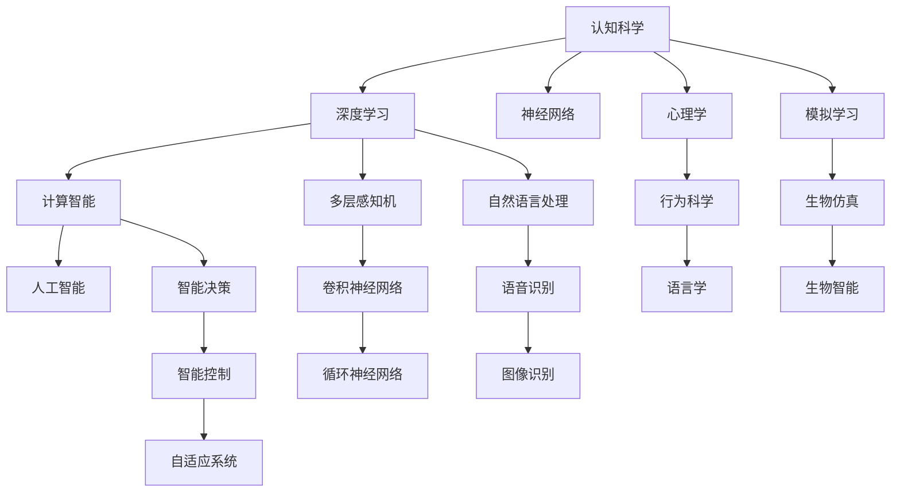

                 

# 认知发展中的简单与深刻变化

> 关键词：认知科学, 神经网络, 深度学习, 计算智能, 人工智能

## 1. 背景介绍

在人类历史的长河中，认知科学一直是探索智能本质和心智运作机制的核心领域。随着神经网络、深度学习等计算智能技术的飞速发展，认知科学正在经历一次深刻的变革。这种变革不仅仅体现在技术手段的创新上，更在于对认知过程的深入理解和对智能系统的全新设计。

本文将围绕认知科学与深度学习的交叉融合，深入探讨这一变革所带来的简单与深刻的变化。我们将从基础理论、关键技术、应用场景等方面，全面分析认知科学在现代人工智能发展中的地位和作用，及其对未来社会和科技的影响。

## 2. 核心概念与联系

### 2.1 核心概念概述

- **认知科学**：研究智能、认知、思维、学习等心智过程的科学。认知科学涵盖了心理学的理论、人工智能的算法、神经科学的发现等，是一门综合性的学科。

- **深度学习**：基于神经网络架构，通过多层非线性映射实现数据表示学习的技术。深度学习在图像识别、自然语言处理、语音识别等领域取得了卓越成效，被广泛应用于人工智能系统中。

- **计算智能**：结合生物智能和计算机科学的智能理论和技术，致力于模拟生物智能的过程，实现智能系统的计算化、自动化。

- **人工智能**：利用计算机技术模拟人类智能行为，实现智能决策、推理、学习等功能的系统。

这些概念紧密联系，共同构成了现代人工智能技术的基础。深度学习作为计算智能的核心，正在推动认知科学向更深层次发展，使认知过程得以形式化和自动化，并应用于实际问题的解决中。

### 2.2 核心概念原理和架构的 Mermaid 流程图



这个流程图展示了认知科学、深度学习、计算智能、人工智能之间及其与基础学科的联系。深度学习通过对神经网络的多层非线性映射，模拟生物神经系统的工作方式，结合心理学、行为科学、语言学等多学科的理论，应用于自然语言处理、语音识别、图像识别等具体任务，最终推动了智能决策、智能控制和自适应系统的发展。

## 3. 核心算法原理 & 具体操作步骤

### 3.1 算法原理概述

深度学习的核心原理是通过多层神经网络实现对数据的高效表示和处理。以卷积神经网络（CNN）和循环神经网络（RNN）为例，CNN适用于处理空间结构数据，如图像，通过卷积操作提取局部特征，再通过池化操作降低特征维度；RNN则擅长处理序列数据，如文本和时间序列，通过循环机制在序列上进行信息传递和更新。

在认知科学视角下，深度学习的原理可以被理解为对认知过程的模拟。具体而言，深度学习通过分层结构来抽象和处理输入数据，类似于人类视觉和听觉系统对信息的逐层处理。这种抽象和处理过程使得机器能够逐步构建出对世界的高级理解，从而实现复杂的智能行为。

### 3.2 算法步骤详解

深度学习的训练通常包括以下几个步骤：

1. **数据准备**：收集和预处理训练数据，确保数据的多样性和代表性。数据可以是图像、文本、音频等多种形式。
   
2. **模型设计**：选择合适的神经网络架构，如CNN、RNN、Transformer等，并根据任务需求进行微调。
   
3. **训练过程**：将数据输入模型，通过反向传播算法更新模型参数，最小化损失函数。训练过程中需要控制学习率、批次大小、迭代次数等超参数。
   
4. **模型评估**：在验证集上评估模型性能，选择最优模型保存。评估指标包括准确率、召回率、F1值等。

5. **模型应用**：将训练好的模型应用于实际问题中，进行推理和预测。

### 3.3 算法优缺点

**优点**：

- **自动化学习**：深度学习能够自动从数据中提取特征，减少人工设计特征的复杂性。
- **高效表达**：通过多层非线性映射，深度学习模型能够捕捉数据中的复杂关系和规律。
- **适应性强**：深度学习模型具有较强的泛化能力，能够适应不同类型和规模的数据。

**缺点**：

- **模型复杂性高**：深度学习模型参数量巨大，训练和推理过程复杂。
- **数据依赖性强**：深度学习对数据质量和数量的依赖性较高，需要大量标注数据。
- **黑盒特性**：深度学习模型通常被视为黑盒，难以解释其内部决策过程。

### 3.4 算法应用领域

深度学习已经在多个领域取得了显著成果：

- **计算机视觉**：如图像分类、目标检测、图像分割等。
- **自然语言处理**：如语言模型、机器翻译、文本生成等。
- **语音识别**：如语音转文本、语音合成等。
- **推荐系统**：如商品推荐、用户画像构建等。
- **游戏AI**：如AlphaGo、AlphaStar等。

## 4. 数学模型和公式 & 详细讲解 & 举例说明

### 4.1 数学模型构建

深度学习的数学模型通常基于多层神经网络，其结构可以表示为：

$$
y = f(W*x + b)
$$

其中 $y$ 是输出向量，$x$ 是输入向量，$W$ 是权重矩阵，$b$ 是偏置向量，$f$ 是激活函数。通过多个这样的线性变换和激活函数组合，深度学习模型可以处理复杂的数据关系。

### 4.2 公式推导过程

以卷积神经网络为例，卷积层的数学公式如下：

$$
y_{i,j} = \sum_{k=0}^{n-1} w_{i,k} * x_{i+1,j+k} + b
$$

其中 $y_{i,j}$ 是卷积层的输出，$x_{i,j}$ 是输入，$w_{i,k}$ 是卷积核，$b$ 是偏置。卷积操作能够捕捉图像中的局部特征，通过多个卷积层的多层组合，卷积神经网络可以处理复杂的图像识别任务。

### 4.3 案例分析与讲解

**图像分类案例**：
- **数据准备**：收集并标注图像数据，如CIFAR-10。
- **模型设计**：使用卷积神经网络，设置多个卷积层和池化层，通过Softmax层输出分类结果。
- **训练过程**：采用随机梯度下降法训练模型，优化交叉熵损失函数。
- **模型评估**：在验证集上评估模型精度，选择最优模型。
- **模型应用**：对新的图像进行分类预测。

## 5. 项目实践：代码实例和详细解释说明

### 5.1 开发环境搭建

为了实现深度学习模型的开发和训练，我们需要搭建相应的开发环境：

1. 安装Python：下载并安装Python 3.x版本。
2. 安装深度学习框架：如TensorFlow、PyTorch等。
3. 安装相关库：如NumPy、Pandas、Matplotlib等。
4. 安装数据集：下载并准备所需的数据集，如MNIST、CIFAR-10等。

### 5.2 源代码详细实现

以下是一个简单的卷积神经网络代码实现，用于图像分类任务：

```python
import tensorflow as tf
from tensorflow.keras import layers

# 定义卷积神经网络模型
model = tf.keras.Sequential([
    layers.Conv2D(32, (3,3), activation='relu', input_shape=(28,28,1)),
    layers.MaxPooling2D((2,2)),
    layers.Conv2D(64, (3,3), activation='relu'),
    layers.MaxPooling2D((2,2)),
    layers.Conv2D(64, (3,3), activation='relu'),
    layers.Flatten(),
    layers.Dense(64, activation='relu'),
    layers.Dense(10, activation='softmax')
])

# 编译模型
model.compile(optimizer='adam', loss='sparse_categorical_crossentropy', metrics=['accuracy'])

# 训练模型
model.fit(train_data, train_labels, epochs=10, validation_data=(val_data, val_labels))
```

### 5.3 代码解读与分析

- `Sequential`：用于创建线性堆叠的神经网络模型。
- `Conv2D`：卷积层，用于提取图像的局部特征。
- `MaxPooling2D`：池化层，用于降低特征维度。
- `Dense`：全连接层，用于将特征映射到输出类别。
- `compile`：编译模型，设置优化器、损失函数和评估指标。
- `fit`：训练模型，指定训练数据、标签、迭代次数和验证数据。

### 5.4 运行结果展示

训练过程可以使用TensorBoard等工具可视化训练损失和准确率的变化。训练完成后，使用测试数据集对模型进行评估，计算测试准确率。

```python
import tensorflow as tf
from tensorflow.keras import layers
from tensorflow.keras.models import Sequential
from tensorflow.keras.layers import Dense, Conv2D, MaxPooling2D
from tensorflow.keras.datasets import mnist

# 加载MNIST数据集
(x_train, y_train), (x_test, y_test) = mnist.load_data()

# 数据预处理
x_train = x_train.reshape(-1, 28, 28, 1).astype('float32') / 255.0
x_test = x_test.reshape(-1, 28, 28, 1).astype('float32') / 255.0
y_train = tf.keras.utils.to_categorical(y_train, 10)
y_test = tf.keras.utils.to_categorical(y_test, 10)

# 定义模型
model = Sequential()
model.add(Conv2D(32, (3,3), activation='relu', input_shape=(28,28,1)))
model.add(MaxPooling2D((2,2)))
model.add(Conv2D(64, (3,3), activation='relu'))
model.add(MaxPooling2D((2,2)))
model.add(Conv2D(64, (3,3), activation='relu'))
model.add(layers.Flatten())
model.add(Dense(64, activation='relu'))
model.add(Dense(10, activation='softmax'))

# 编译模型
model.compile(optimizer='adam', loss='sparse_categorical_crossentropy', metrics=['accuracy'])

# 训练模型
model.fit(x_train, y_train, epochs=10, validation_data=(x_test, y_test))

# 评估模型
model.evaluate(x_test, y_test)
```

## 6. 实际应用场景

### 6.1 医疗影像分析

深度学习在医疗影像分析中有着广泛应用。通过预训练的卷积神经网络，可以对医学影像进行分类、分割、识别等任务。如使用U-Net网络进行肺部CT图像的肿瘤分割，使用ResNet网络进行脑部MRI图像的病变检测等。

### 6.2 自然语言处理

深度学习在自然语言处理中也取得了显著成效。如使用RNN、Transformer网络进行机器翻译、文本生成、情感分析等任务。谷歌的BERT模型和OpenAI的GPT-3模型在自然语言处理领域取得了突破性成果，推动了NLP技术的快速发展。

### 6.3 自动驾驶

深度学习在自动驾驶中也发挥了重要作用。通过卷积神经网络对摄像头采集的图像进行目标检测和分类，通过循环神经网络对车辆行为进行预测和决策。特斯拉的自动驾驶系统Autopilot和Waymo的完全自动驾驶技术都依赖深度学习技术。

### 6.4 未来应用展望

未来，深度学习将进一步拓展其在更多领域的应用：

- **生物信息学**：深度学习应用于基因组学、蛋白质结构预测等生命科学领域，推动生物技术的进步。
- **金融分析**：深度学习用于股票预测、风险评估、信用评分等金融领域，提高金融决策的准确性。
- **物流优化**：深度学习应用于路线规划、货物分配等物流领域，提升物流效率和成本控制。
- **智能家居**：深度学习用于智能家居设备的控制和优化，提升用户体验。
- **智能城市**：深度学习应用于城市交通、能源、环境等领域，构建智能城市系统。

## 7. 工具和资源推荐

### 7.1 学习资源推荐

- **深度学习课程**：如斯坦福大学的CS231n《卷积神经网络和视觉识别》课程。
- **深度学习书籍**：如Ian Goodfellow的《深度学习》、Yoshua Bengio的《深度学习基础》等。
- **深度学习框架文档**：如TensorFlow、PyTorch、Keras等框架的官方文档。

### 7.2 开发工具推荐

- **深度学习框架**：TensorFlow、PyTorch、Keras等。
- **数据可视化工具**：TensorBoard、Weights & Biases等。
- **编程环境**：Jupyter Notebook、Google Colab等。

### 7.3 相关论文推荐

- **深度学习基础**：《Deep Learning》Ian Goodfellow等著。
- **卷积神经网络**：《Convolutional Neural Networks for Visual Recognition》Alex Krizhevsky等著。
- **循环神经网络**：《Learning Phrase Representations using RNN Encoder-Decoder for Statistical Machine Translation》Ilya Sutskever等著。

## 8. 总结：未来发展趋势与挑战

### 8.1 研究成果总结

深度学习和认知科学的结合，推动了认知过程的自动化和形式化，使机器能够模拟人类的智能行为。深度学习技术在图像识别、自然语言处理、语音识别等领域取得了显著进展，推动了人工智能技术的快速发展。未来，随着技术的不断进步，深度学习将进一步拓展其在更多领域的应用，提升人类生产力和生活质量。

### 8.2 未来发展趋势

- **多模态融合**：深度学习将进一步拓展到多模态数据融合，如视觉、语音、文本的协同处理，提升智能系统的全面感知能力。
- **自适应学习**：深度学习将结合自适应算法，使模型能够根据环境变化动态调整参数，提高泛化性能。
- **智能控制**：深度学习结合智能控制理论，构建更高效、可靠的智能系统，如自动驾驶、智能家居等。
- **跨领域应用**：深度学习将应用于更多领域，如生物信息学、金融分析、物流优化等，推动相关行业的数字化转型。
- **伦理与隐私**：随着深度学习的应用范围不断扩大，如何保护数据隐私和伦理道德问题将成为一个重要研究方向。

### 8.3 面临的挑战

- **数据隐私保护**：深度学习依赖大量数据，如何在保护数据隐私的前提下进行模型训练和推理，是一个重要挑战。
- **模型透明性**：深度学习模型通常被视为黑盒，难以解释其内部决策过程，需要研究提高模型的透明性和可解释性。
- **计算资源需求**：深度学习模型需要大量的计算资源，如何优化模型结构、提高计算效率，是一个亟需解决的问题。
- **对抗攻击**：深度学习模型容易受到对抗攻击，需要研究如何提高模型的鲁棒性和安全性。
- **伦理与社会责任**：深度学习技术的应用带来了伦理和社会责任问题，如算法偏见、就业替代等，需要构建相应的监管机制和伦理框架。

### 8.4 研究展望

- **可解释性增强**：研究如何提高深度学习模型的透明性和可解释性，使其决策过程能够被理解和解释。
- **跨模态协同**：研究多模态数据的协同处理和融合，提升智能系统的全面感知能力。
- **计算资源优化**：研究如何优化深度学习模型的结构，提高计算效率，降低资源消耗。
- **隐私保护技术**：研究如何在保护数据隐私的前提下进行模型训练和推理。
- **伦理与社会责任**：研究如何构建伦理和社会责任框架，确保深度学习技术的健康发展。

## 9. 附录：常见问题与解答

**Q1：深度学习需要多少数据？**

A: 深度学习需要大量数据进行训练，数据量越大，模型越容易学习到复杂的关系和规律。对于小规模数据集，可以通过数据增强、迁移学习等技术提高模型的性能。

**Q2：深度学习有哪些局限性？**

A: 深度学习存在一定的局限性，如过拟合、黑盒特性、计算资源需求高等。可以通过正则化、模型集成、模型压缩等技术进行优化。

**Q3：深度学习在医疗影像分析中的应用有哪些？**

A: 深度学习在医疗影像分析中的应用包括肺部CT图像的肿瘤分割、脑部MRI图像的病变检测等。通过预训练的卷积神经网络，可以实现高精度的图像处理和诊断。

**Q4：深度学习在自然语言处理中的应用有哪些？**

A: 深度学习在自然语言处理中的应用包括机器翻译、文本生成、情感分析等。如使用RNN网络进行语言建模，使用Transformer网络进行机器翻译。

**Q5：深度学习在自动驾驶中的应用有哪些？**

A: 深度学习在自动驾驶中的应用包括摄像头图像的目标检测和分类、车辆行为的预测和决策等。通过卷积神经网络和循环神经网络，可以实现高效的自动驾驶功能。

---

作者：禅与计算机程序设计艺术 / Zen and the Art of Computer Programming

