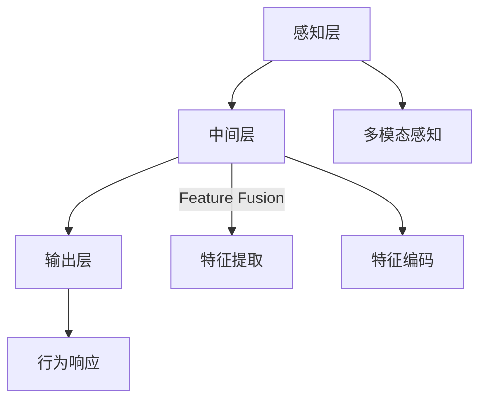

                 

# 认知的形式化：感知—思维—行为之间的协同性

> 关键词：认知科学、感知-思维-行为协同、神经网络、深度学习、心理学、多模态感知

## 1. 背景介绍

认知科学是研究人类心智、思维和行为的科学。它融合了心理学、神经科学、哲学、计算机科学等多个学科的知识，致力于揭示认知过程的机制和规律。近年来，随着人工智能技术的飞速发展，认知科学的研究范式和方法被广泛应用到深度学习模型中，推动了认知模型的不断进步和完善。

在大数据和算力资源的驱动下，深度学习技术迅速崛起，成为当前最为主流的认知模型构建手段。这一范式的核心思想是通过大量数据驱动模型学习，利用神经网络的多层次特征提取和自动学习机制，模拟人类认知过程的层次性和动态性。

本文将从认知科学的角度，探讨深度学习模型的感知—思维—行为协同机制，并结合实际应用案例，阐述认知形式化模型在感知、思维和行为三者之间的协同作用，为认知模型的未来发展提供思考和参考。

## 2. 核心概念与联系

### 2.1 核心概念概述

为更好地理解深度学习模型的感知—思维—行为协同机制，本节将介绍几个关键概念：

- 感知（Perception）：指生物体通过感官系统获取外界信息的过程。深度学习模型的感知层，通过卷积、池化等操作，提取图像、语音等数据的特征。

- 思维（Thought）：指生物体基于感知信息，进行推理、决策、记忆等高级认知活动。深度学习模型的中间层，通过神经网络进行特征融合、提取，形成对输入数据的高层次理解。

- 行为（Action）：指生物体基于思维，进行动作、交互、响应等动态行为。深度学习模型的输出层，通过分类、回归等操作，预测输出目标，指导后续的行为。

- 神经网络（Neural Network）：深度学习模型的核心，由多层神经元（节点）通过连接形成的网络结构，用于模拟生物神经系统的信息传递和处理机制。

- 多模态感知（Multimodal Perception）：指生物体同时通过多种感官获取信息，如视觉、听觉、触觉等。深度学习模型也可以结合多模态数据，进行更全面、深入的感知。

这些概念之间存在紧密的联系，通过感知、思维、行为三者之间的协同作用，深度学习模型能够对复杂多变的环境进行更高效的适应和响应。

### 2.2 核心概念原理和架构的 Mermaid 流程图



这个流程图展示了深度学习模型的基本结构：

1. 感知层：接收外界输入的多模态数据，通过卷积、池化等操作提取特征。
2. 中间层：通过神经网络进行特征融合、提取，形成高层次理解。
3. 输出层：根据中间层的特征输出，进行分类、回归等操作，指导行为响应。

中间层的作用尤为关键，通过多层次的特征提取，深度学习模型可以实现从低级感知向高级思维的转化，从而更好地适应复杂环境。

## 3. 核心算法原理 & 具体操作步骤

### 3.1 算法原理概述

深度学习模型的感知—思维—行为协同机制，基于神经网络的层次化结构。感知层通过感官输入数据的处理，提取特征；中间层通过神经网络的操作，实现特征融合和编码；输出层通过分类或回归等操作，实现对行为响应的预测和指导。

这种机制与认知科学中的人类感知-思维-行为过程高度相似。认知过程的感知、思维、行为环节，同样由大脑的感知神经元、联想神经元、运动神经元等组成，通过神经元之间的连接和信号传递，形成复杂的交互和协同。

### 3.2 算法步骤详解

深度学习模型的感知—思维—行为协同机制，可以通过以下步骤实现：

**Step 1: 数据预处理**
- 将多模态数据进行归一化、降噪、特征提取等预处理操作，形成模型输入。

**Step 2: 感知层操作**
- 将预处理后的数据输入到卷积、池化等感知层，提取特征。

**Step 3: 中间层操作**
- 将感知层提取的特征进行编码和融合，形成高层次的理解。

**Step 4: 输出层操作**
- 根据中间层输出，进行分类、回归等操作，预测行为响应。

**Step 5: 反馈和迭代**
- 利用输出层的预测结果，通过反向传播算法更新模型参数，实现迭代优化。

**Step 6: 评估和部署**
- 在测试集上评估模型性能，对比微调前后的效果。
- 使用微调后的模型对新数据进行预测，部署到实际应用系统中。

### 3.3 算法优缺点

深度学习模型在感知—思维—行为协同机制中，具有以下优点：

1. 自动化特征提取：深度学习模型能够自动从原始数据中提取特征，无需人工干预，提升了处理效率。
2. 动态适应环境：通过不断的迭代优化，深度学习模型能够动态适应复杂多变的环境，具备较强的泛化能力。
3. 鲁棒性较好：深度学习模型对噪声和干扰具有一定的鲁棒性，能够在实际应用中稳定运行。
4. 高灵活性：通过神经网络的设计，深度学习模型可以灵活适应不同领域、不同规模的任务。

同时，该算法也存在一些缺点：

1. 数据需求较高：深度学习模型需要大量数据进行训练，获取高质量标注数据成本较高。
2. 计算资源消耗大：大规模神经网络的训练和推理需要大量的计算资源和存储空间，成本较高。
3. 可解释性不足：深度学习模型通常被视为"黑盒"系统，难以解释其内部工作机制和推理过程。
4. 过拟合风险：深度学习模型在大规模数据上容易过拟合，泛化能力有限。

尽管存在这些局限性，但总体而言，深度学习模型在感知—思维—行为协同机制中仍具有显著的优势，广泛应用于图像识别、语音识别、自然语言处理等多个领域。

### 3.4 算法应用领域

深度学习模型在感知—思维—行为协同机制中，广泛应用于以下领域：

- 计算机视觉：深度学习模型通过卷积神经网络，实现了图像识别、目标检测、图像分割等任务。
- 语音识别：深度学习模型通过卷积、循环神经网络，实现了语音识别、语音合成、情感识别等任务。
- 自然语言处理：深度学习模型通过循环神经网络、Transformer等架构，实现了语言翻译、文本分类、情感分析等任务。
- 游戏AI：深度学习模型通过强化学习等方法，实现了智能游戏的决策、规划和交互。
- 自动驾驶：深度学习模型通过感知、决策和控制三个层次，实现了自动驾驶的感知、路径规划和行为响应。

## 4. 数学模型和公式 & 详细讲解 & 举例说明

### 4.1 数学模型构建

本节将使用数学语言对深度学习模型的感知—思维—行为协同机制进行更加严格的刻画。

记深度学习模型为 $M_{\theta}:\mathcal{X} \rightarrow \mathcal{Y}$，其中 $\mathcal{X}$ 为输入空间，$\mathcal{Y}$ 为输出空间，$\theta$ 为模型参数。假设输入数据为 $x \in \mathcal{X}$，输出数据为 $y \in \mathcal{Y}$。

定义模型 $M_{\theta}$ 在输入 $x$ 上的输出为 $\hat{y}=M_{\theta}(x)$。模型的感知层操作为 $F_{\text{perception}}$，中间层操作为 $F_{\text{thought}}$，输出层操作为 $F_{\text{action}}$。

$$
\hat{y} = F_{\text{action}}(F_{\text{thought}}(F_{\text{perception}}(x)))
$$

### 4.2 公式推导过程

以图像分类任务为例，推导感知—思维—行为协同机制的数学模型：

1. **感知层操作**：
   - 通过卷积神经网络（CNN）对图像数据 $x$ 进行特征提取，得到特征图 $h$：
   $$
   h = F_{\text{perception}}(x)
   $$

2. **中间层操作**：
   - 将特征图 $h$ 输入到全连接层或卷积层，通过神经网络进行特征融合和编码，形成高层次的理解 $t$：
   $$
   t = F_{\text{thought}}(h)
   $$

3. **输出层操作**：
   - 将中间层的输出 $t$ 输入到softmax层或线性层，进行分类操作，得到分类结果 $\hat{y}$：
   $$
   \hat{y} = F_{\text{action}}(t)
   $$

将上述步骤结合起来，得到深度学习模型的感知—思维—行为协同机制：

$$
\hat{y} = F_{\text{action}}(F_{\text{thought}}(F_{\text{perception}}(x)))
$$

### 4.3 案例分析与讲解

以人脸识别为例，分析深度学习模型如何通过感知—思维—行为协同机制实现高精度的人脸识别：

1. **感知层操作**：
   - 通过卷积神经网络（CNN）对输入图像进行特征提取，形成特征图 $h$。

2. **中间层操作**：
   - 将特征图 $h$ 输入到全连接层或卷积层，通过神经网络进行特征融合和编码，形成高层次的理解 $t$。
   - 在特征融合过程中，可以引入注意力机制，对不同区域的特征进行加权处理，提升模型的鲁棒性。
   - 在特征编码过程中，可以引入残差连接、批量归一化等优化策略，提高模型的泛化能力。

3. **输出层操作**：
   - 将中间层的输出 $t$ 输入到softmax层，进行分类操作，得到人脸识别的结果 $\hat{y}$。
   - 在分类过程中，可以通过softmax回归、KNN等方法进行分类预测。

通过上述操作，深度学习模型能够实现从感知到思维再到行为的协同，提升人脸识别的精度和鲁棒性。

## 5. 项目实践：代码实例和详细解释说明

### 5.1 开发环境搭建

在进行感知—思维—行为协同机制的深度学习模型开发前，我们需要准备好开发环境。以下是使用Python进行TensorFlow开发的环境配置流程：

1. 安装Anaconda：从官网下载并安装Anaconda，用于创建独立的Python环境。

2. 创建并激活虚拟环境：
```bash
conda create -n tf-env python=3.8 
conda activate tf-env
```

3. 安装TensorFlow：从官网获取对应的安装命令。例如：
```bash
conda install tensorflow -c conda-forge
```

4. 安装各类工具包：
```bash
pip install numpy pandas scikit-learn matplotlib tqdm jupyter notebook ipython
```

完成上述步骤后，即可在`tf-env`环境中开始深度学习模型开发。

### 5.2 源代码详细实现

下面我们以图像分类任务为例，给出使用TensorFlow对深度学习模型进行训练的PyTorch代码实现。

首先，定义模型结构和损失函数：

```python
import tensorflow as tf
from tensorflow.keras import layers

# 定义模型结构
model = tf.keras.Sequential([
    layers.Conv2D(32, (3, 3), activation='relu', input_shape=(32, 32, 3)),
    layers.MaxPooling2D((2, 2)),
    layers.Conv2D(64, (3, 3), activation='relu'),
    layers.MaxPooling2D((2, 2)),
    layers.Flatten(),
    layers.Dense(64, activation='relu'),
    layers.Dense(10, activation='softmax')
])

# 定义损失函数
loss_fn = tf.keras.losses.SparseCategoricalCrossentropy()

# 编译模型
model.compile(optimizer='adam', loss=loss_fn, metrics=['accuracy'])
```

然后，准备训练和测试数据集：

```python
from tensorflow.keras.datasets import mnist

# 加载MNIST数据集
(x_train, y_train), (x_test, y_test) = mnist.load_data()

# 数据预处理
x_train = x_train.reshape(-1, 32, 32, 3) / 255.0
x_test = x_test.reshape(-1, 32, 32, 3) / 255.0
y_train = tf.keras.utils.to_categorical(y_train)
y_test = tf.keras.utils.to_categorical(y_test)

# 划分训练集和验证集
split_ratio = 0.8
split_idx = int(len(x_train) * split_ratio)
train_data = (x_train[:split_idx], y_train[:split_idx])
dev_data = (x_train[split_idx:], y_train[split_idx:])
```

接着，进行模型训练和评估：

```python
# 模型训练
model.fit(train_data[0], train_data[1], epochs=10, batch_size=32, validation_data=dev_data)

# 模型评估
model.evaluate(x_test, y_test)
```

最后，在测试集上评估模型的性能：

```python
test_loss, test_acc = model.evaluate(x_test, y_test)
print(f'Test loss: {test_loss}, Test accuracy: {test_acc}')
```

以上就是使用TensorFlow对图像分类任务进行深度学习模型微调的完整代码实现。可以看到，TensorFlow提供了强大的API和工具支持，使得深度学习模型的开发和训练变得简单高效。

### 5.3 代码解读与分析

让我们再详细解读一下关键代码的实现细节：

**Sequential模型**：
- `tf.keras.Sequential`用于创建顺序模型，可以方便地堆叠多个层。

**卷积层和池化层**：
- `layers.Conv2D`用于创建卷积层，指定卷积核大小、数量和激活函数。
- `layers.MaxPooling2D`用于创建池化层，指定池化核大小。

**全连接层**：
- `layers.Dense`用于创建全连接层，指定神经元数量和激活函数。

**损失函数**：
- `tf.keras.losses.SparseCategoricalCrossentropy`用于创建分类任务的损失函数，适用于多类别分类问题。

**模型编译和训练**：
- `model.compile`用于编译模型，指定优化器、损失函数和评估指标。
- `model.fit`用于训练模型，指定训练数据、批次大小和验证集。

**模型评估**：
- `model.evaluate`用于在测试集上评估模型性能，返回损失和准确率。

通过上述代码，可以完整地实现深度学习模型的训练和评估。值得注意的是，TensorFlow提供了丰富的API和工具，可以进一步扩展模型的复杂性和深度，实现更高级的感知—思维—行为协同机制。

## 6. 实际应用场景

### 6.1 智能安防系统

智能安防系统利用深度学习模型进行图像、视频等数据的感知和分析，识别异常行为和安全威胁，从而提高安全防范水平。

具体而言，可以采用深度学习模型对监控摄像头拍摄的视频数据进行实时分析，提取图像特征，进行行为识别和异常检测。当检测到可疑行为时，系统会自动发出警报，并记录视频片段进行后续分析和处理。

### 6.2 医疗影像诊断

深度学习模型在医疗影像诊断中有着广泛应用，通过图像分类、分割等操作，帮助医生进行快速、准确的影像诊断。

以乳腺癌筛查为例，深度学习模型可以对乳腺X光片进行图像分类，判断是否存在肿瘤。通过多模态感知，模型还可以同时考虑MRI、CT等影像数据，进行更全面、更准确的诊断。

### 6.3 自动驾驶

自动驾驶系统通过深度学习模型实现感知、决策和行为三个层次的协同，实现车辆的自主驾驶。

在感知阶段，模型通过摄像头、激光雷达等传感器获取环境信息，提取特征。在决策阶段，模型进行路径规划和行为选择，确定驾驶策略。在行为阶段，模型通过车辆控制模块，实现车辆的加速、制动、转向等操作。

## 7. 工具和资源推荐

### 7.1 学习资源推荐

为了帮助开发者系统掌握深度学习模型的感知—思维—行为协同机制，这里推荐一些优质的学习资源：

1. 《深度学习》系列课程：由斯坦福大学Andrew Ng教授主讲，深入浅出地介绍了深度学习的基本原理和应用。

2. 《深度学习框架TensorFlow》书籍：介绍TensorFlow的使用方法、API和工具，是深度学习模型开发的必备参考。

3. 《动手学深度学习》书籍：由李沐等大牛编写的深度学习教程，涵盖模型构建、优化算法、数据预处理等内容。

4. arXiv和IEEE Xplore：提供大量深度学习领域的最新研究成果和论文，是学术学习和项目实践的重要来源。

通过对这些资源的学习实践，相信你一定能够快速掌握深度学习模型的感知—思维—行为协同机制，并用于解决实际的感知、思维和行为问题。

### 7.2 开发工具推荐

高效的开发离不开优秀的工具支持。以下是几款用于深度学习模型开发的常用工具：

1. TensorFlow：由Google主导开发的开源深度学习框架，生产部署方便，适合大规模工程应用。

2. PyTorch：基于Python的开源深度学习框架，灵活动态的计算图，适合快速迭代研究。

3. Keras：高层次API，可以简化模型构建和训练流程，方便初学者上手。

4. Weights & Biases：模型训练的实验跟踪工具，可以记录和可视化模型训练过程中的各项指标，方便对比和调优。

5. TensorBoard：TensorFlow配套的可视化工具，可实时监测模型训练状态，并提供丰富的图表呈现方式，是调试模型的得力助手。

合理利用这些工具，可以显著提升深度学习模型开发的效率，加快创新迭代的步伐。

### 7.3 相关论文推荐

深度学习模型在感知—思维—行为协同机制中，涉及众多前沿研究方向。以下是几篇奠基性的相关论文，推荐阅读：

1. AlexNet: ImageNet Classification with Deep Convolutional Neural Networks：提出卷积神经网络（CNN），开创了深度学习在图像识别中的应用。

2. ResNet: Deep Residual Learning for Image Recognition：提出残差网络（ResNet），有效解决了深度网络训练中的梯度消失问题，大幅提升了模型深度和性能。

3. Inception-v3: Rethinking the Inception Architecture for Computer Vision：提出Inception模块，解决了深度网络参数量大、计算成本高的问题，提高了模型训练和推理效率。

4. Attention is All You Need：提出Transformer架构，改变了传统神经网络的信息传递方式，显著提升了模型在自然语言处理任务中的表现。

5. GANs Trained by a Two Time-Scale Update Rule Converge to a Local Nash Equilibrium：提出生成对抗网络（GANs），通过对抗训练方式，提升生成模型的质量和鲁棒性。

这些论文代表了深度学习模型在感知—思维—行为协同机制中的前沿研究进展，对理解深度学习模型的工作原理和优化策略具有重要意义。

## 8. 总结：未来发展趋势与挑战

### 8.1 总结

本文对深度学习模型的感知—思维—行为协同机制进行了全面系统的介绍。首先阐述了深度学习模型在认知科学中的重要地位，明确了感知—思维—行为三者之间的紧密联系和协同作用。其次，从原理到实践，详细讲解了深度学习模型的数学模型构建和算法步骤，给出了深度学习模型微调的完整代码实例。同时，本文还广泛探讨了深度学习模型在实际应用中的多样场景，展示了其在智能安防、医疗诊断、自动驾驶等多个领域的应用前景。最后，本文精选了深度学习模型的学习资源、开发工具和相关论文，力求为开发者提供全方位的技术指引。

通过本文的系统梳理，可以看到，深度学习模型在感知—思维—行为协同机制中具有显著的优势，极大地拓展了人工智能技术的应用边界，为认知模型的未来发展提供了广阔空间。未来，伴随深度学习技术的不断演进和优化，认知模型必将在更多领域取得突破，为构建安全、可靠、智能的认知系统铺平道路。

### 8.2 未来发展趋势

展望未来，深度学习模型在感知—思维—行为协同机制中，将呈现以下几个发展趋势：

1. 更加智能的感知：随着传感器和计算资源的不断提升，深度学习模型将能够实现更加精细、全面和多模态的感知，提升对复杂环境的理解能力。

2. 更高层次的思维：通过引入注意力机制、记忆网络等技术，深度学习模型将能够进行更高层次的抽象推理，实现更深层次的认知理解和决策。

3. 更灵活的行为：通过强化学习、迁移学习等技术，深度学习模型将能够实现更灵活、更智能的行为响应，更好地适应动态变化的环境。

4. 多任务协同：深度学习模型将能够同时处理多个任务，实现任务之间的协同优化，提升整体性能。

5. 跨领域融合：深度学习模型将能够与其他认知模型、知识图谱等技术进行融合，实现更全面、更深入的认知理解和推理。

6. 认知增强：深度学习模型将能够与其他认知模型、知识图谱等技术进行融合，实现更全面、更深入的认知理解和推理。

这些趋势展示了深度学习模型在认知科学中的巨大潜力，将推动人工智能技术在更多领域的应用和发展。

### 8.3 面临的挑战

尽管深度学习模型在感知—思维—行为协同机制中取得了显著进展，但在迈向更加智能化、普适化应用的过程中，仍面临诸多挑战：

1. 数据瓶颈：深度学习模型需要大量高质量标注数据，对于部分领域，获取标注数据成本较高。如何降低数据需求，提升数据效率，是未来需要解决的问题。

2. 鲁棒性不足：深度学习模型面对噪声和干扰时，容易出现泛化能力不足、过拟合等问题。如何提高模型的鲁棒性，增强其适应能力，是未来需要攻克的难题。

3. 计算资源消耗大：大规模深度学习模型需要大量的计算资源和存储空间，成本较高。如何优化模型结构，降低计算需求，是未来需要探索的方向。

4. 可解释性不足：深度学习模型通常被视为"黑盒"系统，难以解释其内部工作机制和推理过程。如何提高模型的可解释性，增强其透明性，是未来需要解决的问题。

5. 安全性风险：深度学习模型可能学习到有偏见、有害的信息，传递到下游任务，产生误导性、歧视性的输出。如何消除模型偏见，确保输出安全性，是未来需要关注的课题。

6. 伦理道德挑战：深度学习模型在应用过程中，可能面临隐私保护、公平性等伦理道德问题。如何制定相关规范，确保技术应用符合社会伦理，是未来需要考虑的挑战。

7. 知识整合能力不足：现有的深度学习模型往往局限于任务内数据，难以灵活吸收和运用更广泛的先验知识。如何让深度学习模型更好地与外部知识库、规则库等专家知识结合，形成更加全面、准确的信息整合能力，还有很大的想象空间。

### 8.4 未来突破

面对深度学习模型在感知—思维—行为协同机制中面临的诸多挑战，未来的研究需要在以下几个方面寻求新的突破：

1. 探索无监督和半监督学习方法：摆脱对大规模标注数据的依赖，利用自监督学习、主动学习等方法，最大限度利用非结构化数据，实现更加灵活高效的深度学习模型。

2. 研究参数高效和计算高效的深度学习模型：开发更加参数高效的深度学习模型，如卷积神经网络（CNN）、残差网络（ResNet）等，在固定大部分预训练参数的同时，只更新极少量的任务相关参数，提高计算效率。

3. 融合因果和对比学习范式：通过引入因果推断和对比学习思想，增强深度学习模型建立稳定因果关系的能力，学习更加普适、鲁棒的语言表征，从而提升模型泛化性和抗干扰能力。

4. 引入更多先验知识：将符号化的先验知识，如知识图谱、逻辑规则等，与深度学习模型进行巧妙融合，引导深度学习模型学习更准确、合理的语言模型。同时加强不同模态数据的整合，实现视觉、语音等多模态信息与文本信息的协同建模。

5. 结合因果分析和博弈论工具：将因果分析方法引入深度学习模型，识别出模型决策的关键特征，增强输出解释的因果性和逻辑性。借助博弈论工具刻画人机交互过程，主动探索并规避模型的脆弱点，提高系统稳定性。

6. 纳入伦理道德约束：在深度学习模型的训练目标中引入伦理导向的评估指标，过滤和惩罚有偏见、有害的输出倾向。同时加强人工干预和审核，建立模型行为的监管机制，确保输出符合人类价值观和伦理道德。

这些研究方向的探索，必将引领深度学习模型在感知—思维—行为协同机制中的进一步发展，为构建安全、可靠、可解释、可控的认知系统铺平道路。面向未来，深度学习模型还需要与其他人工智能技术进行更深入的融合，如知识表示、因果推理、强化学习等，多路径协同发力，共同推动认知模型的进步和应用。只有勇于创新、敢于突破，才能不断拓展深度学习模型的边界，让认知技术更好地造福人类社会。

## 9. 附录：常见问题与解答

**Q1：深度学习模型在感知—思维—行为协同机制中，如何实现高精度和多样的输出？**

A: 深度学习模型通过多层神经网络的协同作用，可以实现从感知到思维再到行为的复杂映射。在感知阶段，模型通过卷积、池化等操作提取特征；在中间层，模型通过神经网络进行特征融合和编码，形成高层次的理解；在输出层，模型通过分类、回归等操作，实现多样化的输出。

**Q2：深度学习模型在多模态感知中，如何实现对不同模态数据的协同处理？**

A: 深度学习模型通过多模态感知，可以同时处理图像、语音、文本等多种数据类型。在多模态感知中，模型通过多层次、多通道的融合，实现对不同模态数据的协同处理。具体而言，模型可以通过注意力机制，对不同模态数据进行加权处理，提升对复杂环境的理解能力。

**Q3：深度学习模型在智能安防系统中，如何进行实时行为检测和异常预警？**

A: 智能安防系统通过深度学习模型对监控摄像头拍摄的视频数据进行实时分析，提取图像特征，进行行为识别和异常检测。当检测到可疑行为时，系统会自动发出警报，并记录视频片段进行后续分析和处理。

**Q4：深度学习模型在医疗影像诊断中，如何进行图像分类和分割？**

A: 深度学习模型在医疗影像诊断中，通过图像分类和分割，帮助医生进行快速、准确的影像诊断。以乳腺癌筛查为例，深度学习模型可以对乳腺X光片进行图像分类，判断是否存在肿瘤。通过多模态感知，模型还可以同时考虑MRI、CT等影像数据，进行更全面、更准确的诊断。

**Q5：深度学习模型在自动驾驶中，如何进行路径规划和行为选择？**

A: 自动驾驶系统通过深度学习模型实现感知、决策和行为三个层次的协同，实现车辆的自主驾驶。在感知阶段，模型通过摄像头、激光雷达等传感器获取环境信息，提取特征。在决策阶段，模型进行路径规划和行为选择，确定驾驶策略。在行为阶段，模型通过车辆控制模块，实现车辆的加速、制动、转向等操作。

通过上述问题解答，可以更好地理解深度学习模型在感知—思维—行为协同机制中的应用，为深度学习模型的进一步研究和应用提供参考。

---

作者：禅与计算机程序设计艺术 / Zen and the Art of Computer Programming

