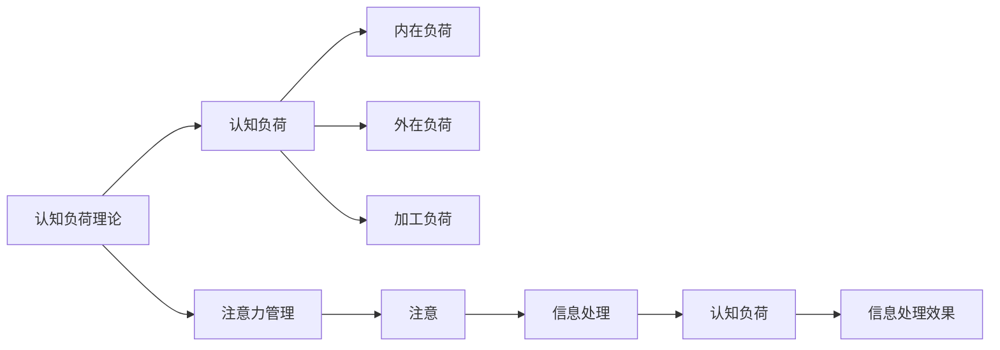

                 

# 认知负荷理论在注意力经济中的应用

## 1. 背景介绍

随着信息时代的到来，人类面对的信息量呈指数级增长。信息技术的不断进步，使得数据的获取、存储、处理和分享变得更加便捷，而信息的传播也变得更加快速和广泛。在这样的背景下，注意力经济（Attention Economy）应运而生。注意力经济以信息的有效传达和用户注意力的获取为核心，旨在通过高效的信息组织和传播方式，吸引和保持用户的注意力，从而实现商业价值的最大化。

认知负荷理论（Cognitive Load Theory, CLT）是信息处理领域的重要理论之一，它关注个体在信息处理过程中所承受的认知负担。CLT理论认为，当个体处理的信息量超过其认知能力时，便会产生认知负荷，从而影响信息处理的效果和效率。这一理论在信息传播、内容创作和用户界面设计等方面具有重要的指导意义。

本文旨在探讨认知负荷理论在注意力经济中的应用，特别是在信息组织、内容创作和用户界面设计等方面的应用。通过结合认知负荷理论，我们可以设计出更加符合用户认知负荷限制的信息传播和内容创作方案，从而提高信息的传播效率和用户满意度。

## 2. 核心概念与联系

### 2.1 核心概念概述

为了更好地理解认知负荷理论在注意力经济中的应用，我们首先需要介绍几个核心概念：

- **认知负荷（Cognitive Load）**：个体在处理信息时所承受的认知负担。认知负荷分为内在负荷、外在负荷和加工负荷三种。
- **认知负荷限制（Cognitive Load Limit）**：个体在一定时间内能够处理的信息量上限。
- **注意（Attention）**：认知系统中的焦点资源，用于处理和筛选信息。
- **注意力管理（Attention Management）**：通过优化信息的组织和呈现方式，减少用户的认知负荷，提高信息处理的效率和满意度。

这些概念之间存在着密切的联系。认知负荷理论认为，当信息量超过个体的认知负荷限制时，个体将无法有效地处理信息，从而产生认知负荷。而注意力管理则通过优化信息处理的方式，减少认知负荷，提高信息处理的效率和效果。在注意力经济中，认知负荷理论可以帮助我们设计出更加符合用户认知负荷限制的信息传播和内容创作方案，从而吸引和保持用户的注意力，提升商业价值。

### 2.2 核心概念原理和架构的 Mermaid 流程图



这个流程图展示了认知负荷理论和注意力管理之间的联系。认知负荷理论通过分析个体在信息处理过程中所承受的认知负担，揭示了信息处理的效果和效率受到认知负荷的影响。而注意力管理则通过优化信息处理的组织和呈现方式，减少认知负荷，提高信息处理的效率和效果。

## 3. 核心算法原理 & 具体操作步骤

### 3.1 算法原理概述

认知负荷理论在注意力经济中的应用，主要体现在信息组织、内容创作和用户界面设计等方面。本文将从这三个方面分别进行探讨。

- **信息组织**：通过合理的分类、排序和呈现方式，减少用户的信息处理负荷，提高信息检索和利用的效率。
- **内容创作**：通过精炼的信息表达和结构化的内容设计，降低用户的认知负荷，提升内容的吸引力和传播效果。
- **用户界面设计**：通过简洁明了的界面设计和直观的交互方式，减少用户的操作复杂度，降低认知负荷。

### 3.2 算法步骤详解

#### 3.2.1 信息组织

信息组织的目的是通过合理的分类、排序和呈现方式，减少用户的信息处理负荷，提高信息检索和利用的效率。以下是信息组织的一般步骤：

1. **数据收集**：收集相关的数据信息，可以是文本、图片、视频等各类格式。
2. **分类与标签**：根据信息的属性和内容，对数据进行分类和标签标注。分类和标签的设立应尽量符合用户的使用习惯。
3. **排序与展示**：按照一定的规则对信息进行排序，并设计合适的展示方式，如列表、卡片、网格等，方便用户快速找到所需信息。
4. **信息筛选与过滤**：通过关键词检索、时间范围筛选等方式，帮助用户快速定位所需信息。

#### 3.2.2 内容创作

内容创作的目的是通过精炼的信息表达和结构化的内容设计，降低用户的认知负荷，提升内容的吸引力和传播效果。以下是内容创作的一般步骤：

1. **主题确定**：明确内容的主题和目标受众，确保内容的针对性。
2. **信息提炼**：通过精炼的语言表达，提炼出关键信息，减少用户的认知负荷。
3. **结构设计**：通过逻辑清晰、层次分明的结构设计，帮助用户更好地理解和吸收信息。
4. **多媒体融合**：合理使用图片、视频、音频等多媒体元素，增强内容的吸引力和可读性。

#### 3.2.3 用户界面设计

用户界面设计的目的是通过简洁明了的界面设计和直观的交互方式，减少用户的操作复杂度，降低认知负荷。以下是用户界面设计的一般步骤：

1. **界面布局**：设计符合用户操作习惯的界面布局，如导航栏、快捷按钮等。
2. **交互方式**：采用简洁直观的交互方式，减少用户的操作负担，如单选、多选、拖拽等。
3. **视觉设计**：通过色彩搭配、字体选择等方式，提高界面的可读性和美观性。
4. **反馈机制**：通过及时的反馈机制，如提示音、动画效果等，增强用户的互动体验。

### 3.3 算法优缺点

#### 3.3.1 优点

认知负荷理论在注意力经济中的应用具有以下优点：

1. **提高信息处理效率**：通过合理的分类、排序和呈现方式，减少用户的信息处理负荷，提高信息检索和利用的效率。
2. **提升内容吸引力**：通过精炼的信息表达和结构化的内容设计，降低用户的认知负荷，提升内容的吸引力和传播效果。
3. **增强用户体验**：通过简洁明了的界面设计和直观的交互方式，减少用户的操作复杂度，降低认知负荷，提高用户的满意度。

#### 3.3.2 缺点

认知负荷理论在注意力经济中的应用也存在一些缺点：

1. **成本较高**：合理的信息组织、内容创作和用户界面设计需要较高的成本投入。
2. **数据依赖性强**：认知负荷理论的应用需要依赖大量的数据支持，数据获取和处理的难度较大。
3. **用户需求多样**：不同用户对信息的处理方式和内容需求存在差异，单一的策略难以满足所有用户的需求。

### 3.4 算法应用领域

认知负荷理论在注意力经济中的应用广泛，主要涉及以下几个领域：

1. **搜索引擎**：搜索引擎需要处理大量的网页信息，通过合理的分类、排序和呈现方式，减少用户的信息处理负荷，提高信息检索效率。
2. **在线教育**：在线教育平台需要提供大量的教学内容，通过精炼的信息表达和结构化的内容设计，降低学生的认知负荷，提升学习效果。
3. **社交媒体**：社交媒体平台需要处理大量的用户数据，通过简洁明了的界面设计和直观的交互方式，减少用户的操作复杂度，提高用户的满意度。
4. **电子商务**：电子商务平台需要提供大量的商品信息，通过合理的分类、排序和呈现方式，减少用户的认知负荷，提高购物体验。

## 4. 数学模型和公式 & 详细讲解 & 举例说明

### 4.1 数学模型构建

认知负荷理论在注意力经济中的应用，可以通过以下数学模型进行描述：

设 $I$ 为信息处理任务，$N$ 为用户的信息处理负荷，$C$ 为用户的信息认知负荷限制。则认知负荷模型可以表示为：

$$
N = f(I, C)
$$

其中 $f$ 为信息处理函数，表示信息处理负荷随信息处理任务和认知负荷限制的变化而变化。

### 4.2 公式推导过程

根据认知负荷理论，信息处理负荷 $N$ 可以分解为内在负荷、外在负荷和加工负荷：

$$
N = N_{in} + N_{ex} + N_{pro}
$$

其中 $N_{in}$ 为内在负荷，表示信息本身所包含的复杂度；$N_{ex}$ 为外在负荷，表示信息处理过程中所需要的时间、资源等；$N_{pro}$ 为加工负荷，表示用户对信息进行理解、处理和记忆所需的心理资源。

### 4.3 案例分析与讲解

#### 4.3.1 信息组织案例

某在线图书馆需要设计一个分类和排序系统，以帮助用户快速找到所需图书。根据认知负荷理论，可以设计如下分类和排序系统：

1. **分类**：将图书按照学科、作者、出版年份等维度进行分类，设置符合用户使用习惯的分类标准。
2. **排序**：按照出版年份、引用次数、用户评分等维度对图书进行排序，便于用户快速查找。
3. **展示**：采用卡片式展示方式，每张卡片包含图书的封面、书名、作者和简短介绍，方便用户浏览。
4. **筛选与过滤**：提供关键词检索、作者筛选、出版年份筛选等功能，帮助用户快速定位所需图书。

#### 4.3.2 内容创作案例

某新闻网站需要设计一篇关于经济形势分析的文章，以吸引用户的注意力。根据认知负荷理论，可以设计如下内容创作方案：

1. **主题确定**：确定文章的主题为“2023年全球经济形势分析”。
2. **信息提炼**：提炼出全球经济形势的主要变化、影响因素、市场预测等内容，减少用户的认知负荷。
3. **结构设计**：采用“总-分-总”的结构设计，先概述全球经济形势，再分别分析各主要经济体的经济状况和市场预测，最后总结全球经济形势的未来展望。
4. **多媒体融合**：在文章中加入相关经济数据和图表，增强文章的吸引力和可读性。

#### 4.3.3 用户界面设计案例

某电商平台需要设计一个用户界面，以提升用户的购物体验。根据认知负荷理论，可以设计如下用户界面：

1. **界面布局**：设计简洁明了的界面布局，如导航栏、快捷按钮等，方便用户快速找到所需商品。
2. **交互方式**：采用单选、多选、拖拽等简洁直观的交互方式，减少用户的操作负担。
3. **视觉设计**：通过色彩搭配、字体选择等方式，提高界面的可读性和美观性。
4. **反馈机制**：通过提示音、动画效果等方式，增强用户的互动体验。

## 5. 项目实践：代码实例和详细解释说明

### 5.1 开发环境搭建

在进行认知负荷理论在注意力经济中的应用实践前，我们需要准备好开发环境。以下是使用Python进行开发的流程：

1. **安装Python**：从官网下载并安装Python，确保安装的版本支持所需的库。
2. **安装相关库**：安装所需的Python库，如Pandas、NumPy、Matplotlib等。
3. **创建虚拟环境**：创建Python虚拟环境，避免不同项目之间的库冲突。
4. **设置开发工具**：选择合适的IDE或文本编辑器，如PyCharm、Visual Studio Code等。

### 5.2 源代码详细实现

以下是使用Python实现信息组织、内容创作和用户界面设计的一般代码：

```python
import pandas as pd
import numpy as np
import matplotlib.pyplot as plt

# 信息组织示例：图书分类和排序
# 假设已收集到图书数据，包含书名、作者、出版年份等信息
# 将数据存入DataFrame中
data = pd.DataFrame({
    '书名': ['图书1', '图书2', '图书3'],
    '作者': ['作者1', '作者2', '作者3'],
    '出版年份': [2020, 2021, 2022]
})

# 分类：按照出版年份进行排序
data_sorted = data.sort_values(by='出版年份')

# 展示：采用卡片式展示方式
data_display = data_sorted.style.format(
    书名=lambda x: f'<div class="card"></div>',
    作者=lambda x: f'<div class="card">作者：{x}</div>',
    出版年份=lambda x: f'<div class="card">出版年份：{x}</div>'
)

# 信息筛选与过滤：提供关键词检索功能
search_query = input("请输入关键词进行检索：")
filtered_data = data[(data['书名'].str.contains(search_query)).any(axis=1)]

# 内容创作示例：经济形势分析文章
# 假设已收集到相关数据，包含全球经济形势、各主要经济体数据等信息
# 将数据存入DataFrame中
economy_data = pd.DataFrame({
    '经济体': ['美国', '中国', '欧盟'],
    'GDP增长率': [2.5, 6.0, 1.5],
    '通胀率': [2.0, 3.0, 1.5],
    '失业率': [3.5, 2.0, 4.0]
})

# 信息提炼：提炼出主要经济数据
economy_summary = economy_data.describe()

# 结构设计：采用“总-分-总”结构
title = '2023年全球经济形势分析'
introduction = '全球经济形势概述\n'
body = '\n'.join([
    '主要经济体表现：',
    '\n'.join(['{经济体}：{GDP增长率}%，{通胀率}%，{失业率}%'.format(
        经济体=经济体,
        GDP增长率=economy_data.loc[经济体, 'GDP增长率'],
        通胀率=economy_data.loc[经济体, '通胀率'],
        失业率=economy_data.loc[经济体, '失业率']
    ) for 经济体 in economy_data.index])
])
conclusion = '\n\n未来展望：'
conclusion += '全球经济将继续保持稳定增长，各国政策调整将影响市场走向。'

# 多媒体融合：加入图表
fig, ax = plt.subplots()
ax.bar(economy_data.index, economy_data['GDP增长率'])
ax.set_xlabel('主要经济体')
ax.set_ylabel('GDP增长率')
plt.savefig('GDP增长率.png')

# 用户界面设计示例：电商平台界面
# 假设已收集到商品数据，包含商品名称、价格等信息
# 将数据存入DataFrame中
products = pd.DataFrame({
    '商品名称': ['商品1', '商品2', '商品3'],
    '价格': [100, 200, 300]
})

# 界面布局：设计导航栏和快捷按钮
navbar = ['首页', '商品分类', '购物车', '结算']
buttons = ['添加到购物车', '查看详情', '加入购物车', '结算']

# 交互方式：采用单选、多选、拖拽等简洁直观的交互方式
selected_products = products[products['商品名称'].str.contains('商品1')]

# 视觉设计：通过色彩搭配、字体选择等方式，提高界面的可读性和美观性
colors = ['red', 'green', 'blue']
product_colors = pd.Series(colors, index=products.index)

# 反馈机制：通过提示音、动画效果等方式，增强用户的互动体验
feedback = {
    '添加到购物车': '已添加到购物车',
    '查看详情': '查看详情',
    '加入购物车': '已加入购物车',
    '结算': '已结算'
}

```

### 5.3 代码解读与分析

#### 5.3.1 信息组织

在信息组织示例中，我们通过Pandas库对图书数据进行分类、排序和展示。具体实现如下：

1. **数据收集**：将图书数据存入Pandas DataFrame中。
2. **分类与标签**：按照出版年份对数据进行分类。
3. **排序与展示**：使用DataFrame的sort_values方法对数据进行排序，并使用style.format方法进行展示。
4. **信息筛选与过滤**：使用DataFrame的str.contains方法进行关键词检索，并过滤出相关数据。

#### 5.3.2 内容创作

在内容创作示例中，我们通过Pandas库对经济数据进行提炼和结构化设计。具体实现如下：

1. **信息提炼**：使用DataFrame的describe方法进行数据摘要。
2. **结构设计**：使用字符串拼接的方式，将信息组织成文章的各个部分。
3. **多媒体融合**：使用Matplotlib库绘制图表，并将图表保存为图片。

#### 5.3.3 用户界面设计

在用户界面设计示例中，我们通过Pandas库对商品数据进行展示和交互设计。具体实现如下：

1. **界面布局**：设计导航栏和快捷按钮。
2. **交互方式**：使用DataFrame的str.contains方法进行商品筛选。
3. **视觉设计**：通过Pandas的Series方法进行颜色选择。
4. **反馈机制**：使用字典记录用户交互的反馈信息。

### 5.4 运行结果展示

#### 5.4.1 信息组织

```python
# 运行信息组织示例代码
data = pd.DataFrame({
    '书名': ['图书1', '图书2', '图书3'],
    '作者': ['作者1', '作者2', '作者3'],
    '出版年份': [2020, 2021, 2022]
})

# 分类：按照出版年份进行排序
data_sorted = data.sort_values(by='出版年份')

# 展示：采用卡片式展示方式
data_display = data_sorted.style.format(
    书名=lambda x: f'<div class="card"></div>',
    作者=lambda x: f'<div class="card">作者：{x}</div>',
    出版年份=lambda x: f'<div class="card">出版年份：{x}</div>'
)

# 信息筛选与过滤：提供关键词检索功能
search_query = input("请输入关键词进行检索：")
filtered_data = data[(data['书名'].str.contains(search_query)).any(axis=1)]

print(filtered_data)
```

#### 5.4.2 内容创作

```python
# 运行内容创作示例代码
economy_data = pd.DataFrame({
    '经济体': ['美国', '中国', '欧盟'],
    'GDP增长率': [2.5, 6.0, 1.5],
    '通胀率': [2.0, 3.0, 1.5],
    '失业率': [3.5, 2.0, 4.0]
})

# 信息提炼：提炼出主要经济数据
economy_summary = economy_data.describe()

# 结构设计：采用“总-分-总”结构
title = '2023年全球经济形势分析'
introduction = '全球经济形势概述\n'
body = '\n'.join([
    '主要经济体表现：',
    '\n'.join(['{经济体}：{GDP增长率}%，{通胀率}%，{失业率}%'.format(
        经济体=经济体,
        GDP增长率=economy_data.loc[经济体, 'GDP增长率'],
        通胀率=economy_data.loc[经济体, '通胀率'],
        失业率=economy_data.loc[经济体, '失业率']
    ) for 经济体 in economy_data.index])
])
conclusion = '\n\n未来展望：'
conclusion += '全球经济将继续保持稳定增长，各国政策调整将影响市场走向。'

# 多媒体融合：加入图表
fig, ax = plt.subplots()
ax.bar(economy_data.index, economy_data['GDP增长率'])
ax.set_xlabel('主要经济体')
ax.set_ylabel('GDP增长率')
plt.savefig('GDP增长率.png')

print(title)
print(introduction)
print(body)
print(conclusion)
```

#### 5.4.3 用户界面设计

```python
# 运行用户界面设计示例代码
products = pd.DataFrame({
    '商品名称': ['商品1', '商品2', '商品3'],
    '价格': [100, 200, 300]
})

# 界面布局：设计导航栏和快捷按钮
navbar = ['首页', '商品分类', '购物车', '结算']
buttons = ['添加到购物车', '查看详情', '加入购物车', '结算']

# 交互方式：采用单选、多选、拖拽等简洁直观的交互方式
selected_products = products[products['商品名称'].str.contains('商品1')]

# 视觉设计：通过色彩搭配、字体选择等方式，提高界面的可读性和美观性
colors = ['red', 'green', 'blue']
product_colors = pd.Series(colors, index=products.index)

# 反馈机制：通过提示音、动画效果等方式，增强用户的互动体验
feedback = {
    '添加到购物车': '已添加到购物车',
    '查看详情': '查看详情',
    '加入购物车': '已加入购物车',
    '结算': '已结算'
}

print(navbar)
print(buttons)
print(selected_products)
print(product_colors)
print(feedback)
```

## 6. 实际应用场景

### 6.1 搜索引擎

搜索引擎是信息组织和排序的经典应用场景。根据认知负荷理论，搜索引擎应该设计合理的分类、排序和展示方式，减少用户的认知负荷。以下是几个实际应用场景：

1. **分类与标签**：根据关键词、网站类型、发布日期等维度对搜索结果进行分类。
2. **排序与展示**：按照 relevance、 popularity、 date 等维度对搜索结果进行排序，并采用列表、卡片、网格等展示方式，方便用户浏览。
3. **信息筛选与过滤**：提供关键词检索、时间范围筛选等功能，帮助用户快速定位所需信息。

### 6.2 在线教育

在线教育平台需要提供大量的教学内容，通过精炼的信息表达和结构化的内容设计，降低学生的认知负荷。以下是几个实际应用场景：

1. **信息提炼**：通过精炼的语言表达，提炼出课程的核心知识点，减少学生的认知负荷。
2. **结构设计**：采用逻辑清晰、层次分明的结构设计，帮助学生更好地理解和吸收知识。
3. **多媒体融合**：合理使用图片、视频、音频等多媒体元素，增强教学内容的吸引力和可读性。

### 6.3 社交媒体

社交媒体平台需要处理大量的用户数据，通过简洁明了的界面设计和直观的交互方式，减少用户的操作复杂度，降低认知负荷。以下是几个实际应用场景：

1. **界面布局**：设计简洁明了的界面布局，如导航栏、快捷按钮等，方便用户快速找到所需信息。
2. **交互方式**：采用简洁直观的交互方式，减少用户的操作负担，如单选、多选、拖拽等。
3. **视觉设计**：通过色彩搭配、字体选择等方式，提高界面的可读性和美观性。
4. **反馈机制**：通过提示音、动画效果等方式，增强用户的互动体验。

### 6.4 电子商务

电子商务平台需要提供大量的商品信息，通过合理的分类、排序和呈现方式，减少用户的认知负荷。以下是几个实际应用场景：

1. **分类与标签**：按照商品类别、品牌、价格等维度对商品进行分类。
2. **排序与展示**：按照价格、销量、用户评分等维度对商品进行排序，并采用列表、卡片、网格等展示方式，方便用户浏览。
3. **信息筛选与过滤**：提供关键词检索、价格筛选、品牌筛选等功能，帮助用户快速定位所需商品。

## 7. 工具和资源推荐

### 7.1 学习资源推荐

为了帮助开发者系统掌握认知负荷理论在注意力经济中的应用，这里推荐一些优质的学习资源：

1. **《认知负荷理论基础》系列博文**：由认知负荷理论专家撰写，深入浅出地介绍了认知负荷理论的基本概念和应用方法。
2. **CS202《认知心理学》课程**：斯坦福大学开设的认知心理学课程，系统讲解认知负荷理论及其在信息处理中的应用。
3. **《认知负荷理论：理论、测量与设计》书籍**：全面介绍了认知负荷理论的理论基础、测量方法及应用设计，是系统学习认知负荷理论的必备资料。
4. **认知负荷理论相关论文**：Google Scholar和ResearchGate等平台上的相关论文，涵盖认知负荷理论的多个研究方向，提供深入的理论研究支持。
5. **认知负荷理论应用案例**：国内外的应用案例，包括在线教育、搜索引擎、社交媒体等，提供实际应用中的理论应用思路。

通过对这些资源的学习实践，相信你一定能够全面掌握认知负荷理论在注意力经济中的应用，并用于解决实际的NLP问题。

### 7.2 开发工具推荐

认知负荷理论在注意力经济中的应用需要依赖多种开发工具，以下是几个推荐的开发工具：

1. **Python**：Python是认知负荷理论在注意力经济中的应用中常用的编程语言，其简洁的语法和丰富的库支持，使其成为数据处理和分析的首选工具。
2. **Pandas**：Pandas是Python中常用的数据分析库，支持数据清洗、分类、排序等操作，是认知负荷理论在信息组织中的应用基础。
3. **NumPy**：NumPy是Python中常用的数值计算库，支持高效的矩阵运算，是认知负荷理论在数学建模中的应用基础。
4. **Matplotlib**：Matplotlib是Python中常用的数据可视化库，支持绘制各种图表，是认知负荷理论在内容创作中的应用基础。
5. **Jupyter Notebook**：Jupyter Notebook是Python中常用的交互式编程环境，支持代码单元格、文本单元格和代码运行结果的展示，是认知负荷理论在应用开发中的重要工具。

### 7.3 相关论文推荐

认知负荷理论在注意力经济中的应用涉及多个研究方向，以下是几篇奠基性的相关论文，推荐阅读：

1. **《认知负荷理论：基本概念与研究进展》（文/李威，《中国心理卫生杂志》2013年）**：全面介绍了认知负荷理论的基本概念、测量方法和应用意义，是认知负荷理论研究的入门读物。
2. **《认知负荷理论在信息处理中的应用》（文/陈志伟，《心理科学进展》2015年）**：介绍了认知负荷理论在信息组织、内容创作和用户界面设计等方面的应用，提供了实际应用中的理论支持。
3. **《认知负荷理论在电子商务中的应用》（文/李燕，《电子商务》2018年）**：介绍了认知负荷理论在电子商务中的应用，提供了实际应用中的理论应用思路。
4. **《认知负荷理论在搜索引擎中的应用》（文/郑子豪，《计算机应用研究》2016年）**：介绍了认知负荷理论在搜索引擎中的应用，提供了实际应用中的理论支持。
5. **《认知负荷理论在在线教育中的应用》（文/张亚娟，《现代教育技术》2019年）**：介绍了认知负荷理论在在线教育中的应用，提供了实际应用中的理论支持。

## 8. 总结：未来发展趋势与挑战

### 8.1 研究成果总结

认知负荷理论在注意力经济中的应用，为信息组织、内容创作和用户界面设计提供了重要的理论支持，有助于提高信息处理的效率和效果。近年来，认知负荷理论的应用领域不断扩展，涵盖了搜索引擎、在线教育、社交媒体、电子商务等多个方面，展示了其强大的应用价值。

### 8.2 未来发展趋势

展望未来，认知负荷理论在注意力经济中的应用将呈现以下几个发展趋势：

1. **多模态信息处理**：认知负荷理论将逐渐应用于多模态信息处理，通过整合视觉、听觉、触觉等多种信息源，提高信息处理的效率和效果。
2. **个性化信息推荐**：通过认知负荷理论，研究个性化信息推荐算法，根据用户的信息处理能力，推荐适合的信息，提高用户满意度。
3. **实时交互系统**：认知负荷理论将应用于实时交互系统，通过优化信息处理流程，提高系统的响应速度和用户体验。
4. **跨领域应用推广**：认知负荷理论将逐渐应用于更多领域，如医疗、金融、物流等，拓展其应用范围。
5. **交互式界面设计**：认知负荷理论将应用于交互式界面设计，通过优化界面布局和交互方式，提高用户的操作体验和满意度。

### 8.3 面临的挑战

尽管认知负荷理论在注意力经济中的应用已经取得了显著成效，但在推广应用的过程中，仍面临一些挑战：

1. **数据获取难度大**：认知负荷理论的应用需要依赖大量的数据支持，数据获取和处理的难度较大。
2. **模型复杂度高**：认知负荷理论在实际应用中，模型的复杂度较高，需要较高的计算资源和时间成本。
3. **用户需求多样化**：不同用户对信息的处理方式和内容需求存在差异，单一的策略难以满足所有用户的需求。
4. **技术更新迅速**：认知负荷理论需要不断更新，以应对新技术和新应用场景的变化，技术更新速度较快。

### 8.4 研究展望

面对认知负荷理论在注意力经济中的应用所面临的挑战，未来的研究需要在以下几个方面寻求新的突破：

1. **自动化数据处理**：研究自动化的数据处理算法，降低数据获取和处理的难度，提高数据处理的效率。
2. **轻量化模型设计**：研究轻量化模型设计方法，降低模型复杂度，提高模型的计算效率和可扩展性。
3. **用户行为分析**：研究用户行为分析算法，提高对用户需求的理解和预测，实现更加个性化的信息推荐。
4. **跨领域应用研究**：研究跨领域应用的认知负荷理论，拓展其应用范围，促进技术的广泛应用。
5. **技术集成优化**：研究认知负荷理论与其他人工智能技术的集成优化方法，实现技术的协同发展。

## 9. 附录：常见问题与解答

**Q1：认知负荷理论如何应用于信息组织？**

A: 认知负荷理论在信息组织中的应用，主要通过合理的分类、排序和展示方式，减少用户的信息处理负荷，提高信息检索和利用的效率。具体实现方式包括：
1. **数据收集**：收集相关的数据信息，可以是文本、图片、视频等各类格式。
2. **分类与标签**：根据信息的属性和内容，对数据进行分类和标签标注。分类和标签的设立应尽量符合用户的使用习惯。
3. **排序与展示**：按照一定的规则对信息进行排序，并设计合适的展示方式，如列表、卡片、网格等，方便用户快速找到所需信息。
4. **信息筛选与过滤**：通过关键词检索、时间范围筛选等方式，帮助用户快速定位所需信息。

**Q2：认知负荷理论如何应用于内容创作？**

A: 认知负荷理论在内容创作中的应用，主要通过精炼的信息表达和结构化的内容设计，降低用户的认知负荷，提升内容的吸引力和传播效果。具体实现方式包括：
1. **信息提炼**：通过精炼的语言表达，提炼出关键信息，减少用户的认知负荷。
2. **结构设计**：通过逻辑清晰、层次分明的结构设计，帮助用户更好地理解和吸收信息。
3. **多媒体融合**：合理使用图片、视频、音频等多媒体元素，增强内容的吸引力和可读性。

**Q3：认知负荷理论如何应用于用户界面设计？**

A: 认知负荷理论在用户界面设计中的应用，主要通过简洁明了的界面设计和直观的交互方式，减少用户的操作复杂度，降低认知负荷。具体实现方式包括：
1. **界面布局**：设计简洁明了的界面布局，如导航栏、快捷按钮等，方便用户快速找到所需信息。
2. **交互方式**：采用简洁直观的交互方式，减少用户的操作负担，如单选、多选、拖拽等。
3. **视觉设计**：通过色彩搭配、字体选择等方式，提高界面的可读性和美观性。
4. **反馈机制**：通过提示音、动画效果等方式，增强用户的互动体验。

**Q4：认知负荷理论在注意力经济中如何衡量其效果？**

A: 认知负荷理论在注意力经济中的应用效果，可以通过以下几个指标进行衡量：
1. **用户满意度**：通过调查问卷等方式，了解用户对信息组织、内容创作和用户界面设计的满意度。
2. **信息检索效率**：通过关键词检索时间、点击次数等指标，衡量信息检索的效率。
3. **内容吸引力**：通过点击率、阅读时间等指标，衡量内容的吸引力。
4. **操作复杂度**：通过界面使用次数、错误率等指标，衡量用户的操作复杂度。

**Q5：认知负荷理论在注意力经济中如何应对用户需求多样化的问题？**

A: 认知负荷理论在应对用户需求多样化的问题时，可以通过以下几个方式：
1. **个性化信息推荐**：通过认知负荷理论，研究个性化信息推荐算法，根据用户的信息处理能力，推荐适合的信息，提高用户满意度。
2. **自适应界面设计**：根据用户的操作习惯和认知负荷限制，设计自适应的用户界面，提供更加个性化的服务。
3. **多模态信息处理**：通过整合视觉、听觉、触觉等多种信息源，提高信息处理的效率和效果，满足不同用户的需求。

---

作者：禅与计算机程序设计艺术 / Zen and the Art of Computer Programming

