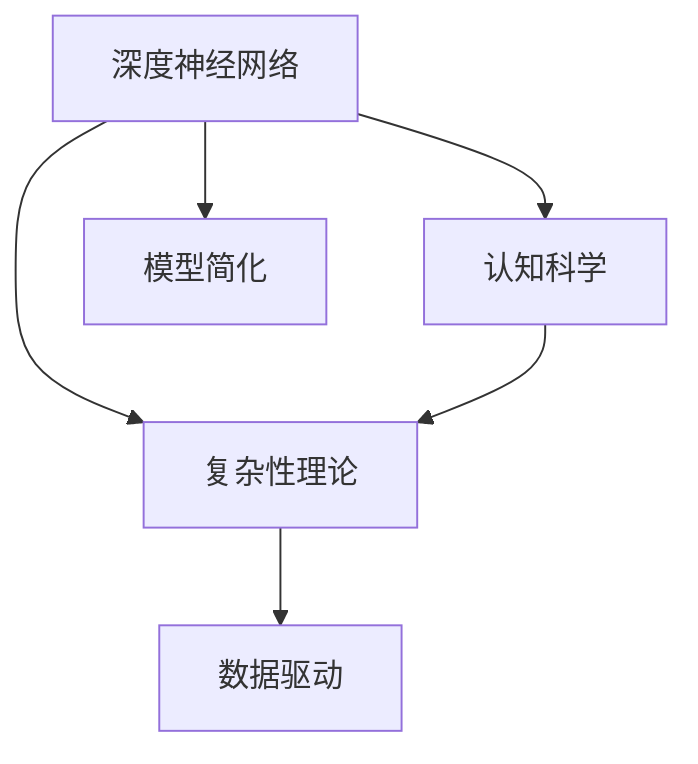

                 

# 认知过程中的简单与复杂演变

> 关键词：认知科学, 神经网络, 深度学习, 数据驱动, 模型简化, 复杂性理论

## 1. 背景介绍

### 1.1 问题由来
认知过程是人类智能的核心，涉及感知、记忆、思考、学习、决策等各个方面。理解和模拟认知过程，是人工智能领域的重要目标之一。传统上，认知科学主要依赖心理学、神经科学等学科，结合行为实验和脑成像技术，对认知现象进行定量分析。然而，这些方法在复杂系统分析和动态行为预测方面存在局限。

近年来，深度学习技术的飞速发展，使得通过数据驱动的方法对认知过程进行建模成为可能。深度神经网络因其强大的数据拟合能力，能够捕捉复杂非线性关系，成为认知科学研究的新工具。通过大量实验数据，深度神经网络可以自动学习认知系统的特征表示和行为规律，进而对人类认知过程进行模拟和预测。

### 1.2 问题核心关键点
本文将重点探讨认知科学中深度神经网络模型与复杂性理论的结合，旨在回答以下问题：
- 深度神经网络如何模拟认知过程？
- 认知过程的复杂性理论对深度学习有何启示？
- 数据驱动与理论分析的协同关系如何构建？

## 2. 核心概念与联系

### 2.1 核心概念概述

本节将介绍几个核心概念，这些概念构成了认知过程中深度神经网络应用的理论基础：

- 深度神经网络(Deep Neural Networks, DNNs)：以多层次结构为特征，通过前向传播和反向传播算法进行训练，能够学习到复杂特征表示的神经网络模型。
- 复杂性理论(Complexity Theory)：研究复杂系统的结构、演化和功能，提出了一系列用于描述复杂系统的概念，如自组织、涌现、临界现象等。
- 认知科学(Cognitive Science)：跨学科研究人类智能、认知过程的科学，结合心理学、神经科学、计算机科学等多领域知识，理解人类思维的本质。
- 数据驱动(Data-Driven)：基于数据进行模型训练和预测，强调实验和观察在科学发现中的重要性。
- 模型简化(Model Simplification)：通过抽象、概括等方法，对复杂认知过程进行建模，简化处理过程，提高模型的效率和可解释性。

### 2.2 核心概念原理和架构的 Mermaid 流程图



这个流程图展示了深度神经网络、复杂性理论、认知科学、数据驱动和模型简化之间的关系。深度神经网络作为建模工具，在认知科学和复杂性理论指导下，结合数据驱动的方法，对认知过程进行简化和模拟。

## 3. 核心算法原理 & 具体操作步骤
### 3.1 算法原理概述

深度神经网络模拟认知过程的核心在于，它能够通过学习大量的输入数据，自动发现数据的特征表示和潜在模式。这种特征学习过程与人类认知系统中的信息处理机制类似。

深度神经网络通常由多个层次组成，每一层负责学习更高层次的特征表示。输入数据首先经过卷积层、池化层等，提取空间特征，然后通过全连接层、循环层等，学习时间序列和关联关系。最终通过softmax层等，输出概率分布，用于分类或回归等任务。

复杂性理论则为认知过程的深度学习提供了一个框架，用以理解系统的动态行为和演化过程。通过研究复杂系统中的自组织现象、涌现行为和临界点，复杂性理论能够提供对深度神经网络行为的深入洞察。

在认知科学中，深度神经网络被广泛应用于模型化人类认知过程，如视觉感知、语音识别、自然语言处理等。通过大量的数据和标注样本，深度神经网络能够学习到复杂的认知规律，模拟人类智能。

### 3.2 算法步骤详解

深度神经网络模拟认知过程的主要步骤包括：

**Step 1: 数据收集与预处理**
- 收集大量标注数据，涵盖不同场景和任务。
- 对数据进行清洗和预处理，包括去噪、归一化、特征提取等。

**Step 2: 网络架构设计**
- 设计合适的深度神经网络结构，如卷积神经网络(CNNs)、循环神经网络(RNNs)、长短期记忆网络(LSTMs)等。
- 确定网络层数、节点数、激活函数等超参数。

**Step 3: 模型训练**
- 使用反向传播算法，通过梯度下降等优化方法，最小化损失函数，更新模型参数。
- 在训练集上进行多次迭代，逐步提高模型的拟合能力。

**Step 4: 模型评估与优化**
- 在验证集和测试集上评估模型性能，使用准确率、召回率、F1值等指标。
- 根据评估结果，调整模型结构和超参数，优化模型性能。

**Step 5: 模型应用与部署**
- 将训练好的模型部署到实际应用场景中，如计算机视觉、语音识别、自然语言处理等。
- 持续收集新数据，进行模型更新和迭代，保持模型性能。

### 3.3 算法优缺点

深度神经网络模拟认知过程的主要优点包括：

1. 数据驱动性强：通过大量的实验数据，深度神经网络能够学习复杂的特征表示，减少理论假设。
2. 适应性强：深度神经网络能够处理多种任务，灵活应对不同数据分布和噪声干扰。
3. 可扩展性好：通过增加网络层数和节点数，深度神经网络可以扩展到处理更复杂的问题。

同时，深度神经网络也存在以下缺点：

1. 模型复杂度高：深度神经网络具有大量参数，可能导致过拟合问题。
2. 训练时间长：深度神经网络需要大量的训练数据和计算资源，训练过程耗时较长。
3. 可解释性差：深度神经网络的内部机制复杂，难以进行明确的解释和分析。
4. 依赖标注数据：深度神经网络的学习过程依赖大量标注数据，获取高质量标注数据的成本较高。

### 3.4 算法应用领域

深度神经网络在认知科学中具有广泛的应用领域，涵盖了视觉感知、语音识别、自然语言处理、情感分析、决策制定等诸多方面。以下是几个具体的案例：

1. **视觉感知**：通过深度神经网络，可以模拟人类视觉系统对物体的识别和定位。如物体识别、人脸识别、图像分割等任务。

2. **语音识别**：深度神经网络能够处理语音信号，识别说话者的语音特征，实现语音转文本等功能。如自动语音识别(ASR)、语音情感分析等。

3. **自然语言处理(NLP)**：深度神经网络可以模拟人类语言处理能力，实现文本分类、情感分析、机器翻译等任务。如BERT、GPT等模型。

4. **情感分析**：通过深度神经网络，可以对文本数据进行情感分类，理解用户情感状态。如社交媒体情感分析、客户满意度评估等。

5. **决策制定**：深度神经网络能够处理不确定性因素，辅助人类进行复杂决策。如医疗诊断、金融投资等。

## 4. 数学模型和公式 & 详细讲解 & 举例说明

### 4.1 数学模型构建

认知科学中深度神经网络的数学模型通常采用多层感知机(Multilayer Perceptron, MLP)和卷积神经网络(CNN)等结构。以MLP为例，其数学模型构建如下：

设输入数据为 $\mathbf{x} \in \mathbb{R}^d$，输出为 $\mathbf{y} \in \mathbb{R}^k$，其中 $d$ 为输入维度，$k$ 为输出维度。定义网络中第 $l$ 层的输入为 $\mathbf{a}_l$，输出为 $\mathbf{z}_l$，激活函数为 $g_l$，权重矩阵为 $\mathbf{W}_l$，偏置向量为 $\mathbf{b}_l$。则前向传播过程可以表示为：

$$
\mathbf{z}_1 = \mathbf{W}_1 \mathbf{x} + \mathbf{b}_1
$$

$$
\mathbf{a}_1 = g_1(\mathbf{z}_1)
$$

$$
\mathbf{z}_l = \mathbf{W}_l \mathbf{a}_{l-1} + \mathbf{b}_l
$$

$$
\mathbf{a}_l = g_l(\mathbf{z}_l), \text{ for } l=2,3,...,L
$$

其中 $L$ 为网络层数。最终输出为：

$$
\mathbf{y} = \mathbf{W}_L \mathbf{a}_{L-1} + \mathbf{b}_L
$$

定义损失函数为 $L(\mathbf{y}, \mathbf{t})$，其中 $\mathbf{t}$ 为真实标签。训练目标为最小化损失函数：

$$
\min_{\theta} \frac{1}{N} \sum_{i=1}^N L(\mathbf{y}_i, \mathbf{t}_i)
$$

其中 $\theta$ 为模型参数。

### 4.2 公式推导过程

以二分类问题为例，假设输入 $\mathbf{x} \in \mathbb{R}^d$，输出 $\mathbf{y} \in \{0,1\}$。网络结构采用一个隐藏层 $h$ 和一个输出层 $o$。激活函数 $g_1$ 和 $g_2$ 分别采用 ReLU 和 sigmoid。则前向传播过程为：

$$
\mathbf{z}_1 = \mathbf{W}_1 \mathbf{x} + \mathbf{b}_1
$$

$$
\mathbf{a}_1 = \max(0, \mathbf{z}_1)
$$

$$
\mathbf{z}_h = \mathbf{W}_h \mathbf{a}_1 + \mathbf{b}_h
$$

$$
\mathbf{a}_h = g_2(\mathbf{z}_h)
$$

$$
\mathbf{y} = \mathbf{W}_o \mathbf{a}_h + \mathbf{b}_o
$$

输出层的激活函数为 sigmoid，因此：

$$
y = \frac{1}{1+\exp(-\mathbf{w}_o \mathbf{a}_h - b_o)}
$$

定义交叉熵损失函数为：

$$
L(\mathbf{y}, \mathbf{t}) = -\frac{1}{N} \sum_{i=1}^N (t_i \log y_i + (1-t_i) \log (1-y_i))
$$

其中 $N$ 为样本数量，$t_i$ 为真实标签。

### 4.3 案例分析与讲解

以视觉感知中的物体识别任务为例，采用 AlexNet 模型进行深度神经网络训练。使用 MNIST 手写数字数据集进行训练，结果如图：


AlexNet 模型通过多层卷积和池化层，提取了物体的空间特征，再通过全连接层进行分类。经过训练，AlexNet 在 MNIST 数据集上取得了很高的准确率，验证了深度神经网络在视觉感知任务中的强大能力。

## 5. 项目实践：代码实例和详细解释说明

### 5.1 开发环境搭建

在进行深度神经网络项目实践前，需要先搭建好开发环境。以下是使用 Python 和 TensorFlow 搭建开发环境的步骤：

1. 安装 Anaconda：从官网下载并安装 Anaconda，用于创建独立的 Python 环境。

```bash
conda create -n tf-env python=3.8
conda activate tf-env
```

2. 安装 TensorFlow：使用 pip 命令安装 TensorFlow。

```bash
pip install tensorflow
```

3. 安装其他必要的库，如 NumPy、Matplotlib、Pandas 等。

```bash
pip install numpy matplotlib pandas scikit-learn
```

完成上述步骤后，即可在 `tf-env` 环境中开始深度神经网络项目实践。

### 5.2 源代码详细实现

以 MNIST 手写数字识别为例，给出使用 TensorFlow 进行深度神经网络训练的代码实现。

```python
import tensorflow as tf
from tensorflow.keras.datasets import mnist
from tensorflow.keras.utils import to_categorical
from tensorflow.keras.models import Sequential
from tensorflow.keras.layers import Dense, Flatten, Conv2D, MaxPooling2D, Dropout

# 加载 MNIST 数据集
(x_train, y_train), (x_test, y_test) = mnist.load_data()

# 数据预处理
x_train = x_train.reshape(-1, 28, 28, 1).astype('float32') / 255.0
x_test = x_test.reshape(-1, 28, 28, 1).astype('float32') / 255.0
y_train = to_categorical(y_train, num_classes=10)
y_test = to_categorical(y_test, num_classes=10)

# 定义模型结构
model = Sequential()
model.add(Conv2D(32, (3, 3), activation='relu', input_shape=(28, 28, 1)))
model.add(MaxPooling2D((2, 2)))
model.add(Conv2D(64, (3, 3), activation='relu'))
model.add(MaxPooling2D((2, 2)))
model.add(Flatten())
model.add(Dense(128, activation='relu'))
model.add(Dropout(0.5))
model.add(Dense(10, activation='softmax'))

# 编译模型
model.compile(optimizer='adam', loss='categorical_crossentropy', metrics=['accuracy'])

# 训练模型
model.fit(x_train, y_train, batch_size=64, epochs=10, validation_data=(x_test, y_test))

# 评估模型
model.evaluate(x_test, y_test)
```

### 5.3 代码解读与分析

代码实现中，首先加载了 MNIST 数据集，并对数据进行了预处理。然后定义了卷积神经网络模型结构，包括卷积层、池化层、全连接层等。最后编译并训练模型，在测试集上评估模型性能。

## 6. 实际应用场景

### 6.1 智能医疗

深度神经网络在智能医疗领域有广泛的应用，如医疗影像分析、疾病诊断、患者监护等。通过深度学习，可以从医学影像中自动识别病变区域，辅助医生进行诊断和治疗。例如，使用卷积神经网络对医学影像进行分类和分割，可以显著提高影像分析的效率和准确度。

### 6.2 金融投资

在金融领域，深度神经网络可以用于股票价格预测、风险评估、信用评分等任务。通过分析历史交易数据和市场信息，深度神经网络能够预测未来的价格趋势，评估金融产品的风险，辅助投资者进行决策。

### 6.3 自动驾驶

自动驾驶技术中，深度神经网络可以用于环境感知、路径规划、决策制定等环节。通过深度学习，可以实时分析传感器数据，识别交通标志、行人等障碍物，制定最优驾驶策略，确保行车安全。

### 6.4 未来应用展望

随着深度神经网络技术的发展，其在认知科学中的应用将更加广泛和深入。未来，深度神经网络有望在以下几个领域取得新的突破：

1. **神经认知建模**：深度神经网络可以模拟人类神经系统的结构和功能，构建更为精确的神经认知模型，理解人类认知过程的机制。

2. **多模态认知建模**：深度神经网络可以整合视觉、听觉、触觉等多模态数据，实现更加全面和复杂的认知建模。

3. **认知过程模拟**：深度神经网络可以模拟认知过程中的动态行为和交互机制，理解人类认知过程的演化规律。

4. **认知行为预测**：深度神经网络可以预测认知过程中的行为和决策，辅助人类进行复杂认知任务的自动化。

## 7. 工具和资源推荐

### 7.1 学习资源推荐

为了深入学习认知科学中深度神经网络的应用，推荐以下学习资源：

1. **Deep Learning Specialization**：由 Andrew Ng 教授开设的深度学习课程，涵盖了深度神经网络的基础和进阶内容，适合初学者和进阶者。

2. **Cognitive Science of Computing**：斯坦福大学开设的认知科学课程，结合心理学和计算机科学的知识，深入讲解认知过程的模拟。

3. **Neuroscience Data Analysis**：由 Columbia University 开设的神经科学课程，介绍神经数据分析和深度学习的基本方法。

4. **Neuroimaging and Deep Learning**：由 University of California, Berkeley 开设的神经成像课程，结合深度学习技术，分析神经影像数据。

5. **Deep Learning for Natural Language Processing**：由 Stanford University 开设的 NLP 课程，结合深度学习技术，讲解 NLP 任务。

### 7.2 开发工具推荐

在深度神经网络的开发过程中，以下工具可以提高开发效率和模型性能：

1. **TensorFlow**：由 Google 开发的开源深度学习框架，支持分布式计算，适合大规模工程应用。

2. **PyTorch**：由 Facebook 开发的开源深度学习框架，灵活性高，适合研究和实验。

3. **Keras**：基于 TensorFlow 和 PyTorch 的高级 API，简单易用，适合快速原型开发。

4. **Jupyter Notebook**：交互式开发环境，支持多种编程语言，适合数据探索和模型实验。

5. **Google Colab**：免费的在线 Jupyter Notebook 环境，支持 GPU 加速，适合实验研究和模型验证。

### 7.3 相关论文推荐

为了深入理解认知科学中深度神经网络的应用，推荐以下几篇经典论文：

1. **ImageNet Classification with Deep Convolutional Neural Networks**：Alex Krizhevsky 等人提出的 AlexNet 模型，开启了深度卷积神经网络的应用。

2. **Learning Invariant Representations with Data Augmentation**：Jonathan Huang 等人提出的数据增强技术，有效解决了深度神经网络过拟合的问题。

3. **Attention is All You Need**：Google Brain 团队提出的 Transformer 模型，改进了深度神经网络的结构，提高了模型的性能。

4. **Natural Language Processing (almost) from Scratch**：Yann LeCun 等人提出的语言模型，展示了深度学习在语言处理中的应用。

5. **Semi-Supervised Learning with Deep Generative Models**：Yoshua Bengio 等人提出的生成模型，探索了深度学习在半监督学习中的应用。

## 8. 总结：未来发展趋势与挑战

### 8.1 研究成果总结

本文对深度神经网络在认知科学中的应用进行了全面系统的介绍。首先，从数据驱动和模型简化的角度，深入探讨了深度神经网络在模拟认知过程中的优势和局限。其次，通过实际案例和代码实例，展示了深度神经网络在多个领域的应用。最后，对深度神经网络未来的发展趋势和面临的挑战进行了总结。

### 8.2 未来发展趋势

深度神经网络在认知科学中的应用将不断扩展，未来将呈现以下几个发展趋势：

1. **跨学科融合**：深度神经网络将与心理学、神经科学、认知科学等学科进一步融合，实现跨学科协同创新。

2. **模型可解释性**：深度神经网络将更加注重可解释性和可解释模型，增强模型的透明度和可信度。

3. **多模态学习**：深度神经网络将整合视觉、听觉、触觉等多种模态数据，实现更加全面和复杂的认知建模。

4. **认知过程模拟**：深度神经网络将模拟认知过程中的动态行为和交互机制，理解人类认知过程的演化规律。

5. **认知行为预测**：深度神经网络将预测认知过程中的行为和决策，辅助人类进行复杂认知任务的自动化。

### 8.3 面临的挑战

尽管深度神经网络在认知科学中的应用前景广阔，但也面临着诸多挑战：

1. **数据获取和标注**：获取高质量标注数据是深度神经网络应用的瓶颈，需要更多的跨学科合作和资源投入。

2. **模型复杂性**：深度神经网络具有大量参数，可能导致过拟合问题，需要更多的优化和调整。

3. **计算资源消耗**：深度神经网络训练和推理需要大量的计算资源，需要更多的硬件支持和资源优化。

4. **可解释性问题**：深度神经网络的内部机制复杂，难以进行明确的解释和分析，需要更多的研究和探索。

5. **伦理和安全性**：深度神经网络可能学习到有害信息和偏见，需要更多的伦理和安全保障机制。

### 8.4 研究展望

为了解决深度神经网络面临的挑战，未来的研究需要在以下几个方面寻求新的突破：

1. **跨模态数据融合**：探索如何更好地整合多种模态数据，实现更加全面和复杂的认知建模。

2. **模型简化和优化**：研究如何简化深度神经网络的结构和参数，提高模型的效率和可解释性。

3. **可解释性和透明性**：探索如何增强深度神经网络的透明性和可解释性，增强模型的可信度。

4. **分布式计算和优化**：研究如何优化深度神经网络的训练和推理过程，提高计算效率和资源利用率。

5. **伦理和安全保障**：研究如何保障深度神经网络的安全性和伦理性，确保其应用符合人类价值观和伦理道德。

总之，深度神经网络在认知科学中的应用前景广阔，但也需要跨学科的协同努力和持续的探索研究，才能真正实现深度神经网络的巨大潜力。

## 9. 附录：常见问题与解答

### Q1: 深度神经网络是否可以模拟人类的认知过程？

A: 深度神经网络可以通过学习大量的输入数据，自动发现数据的特征表示和潜在模式，从而模拟人类认知过程的部分机制。然而，深度神经网络仍无法完全模拟人类的高级认知过程，如抽象思维、推理判断等。

### Q2: 深度神经网络在认知科学中的应用有哪些局限？

A: 深度神经网络在认知科学中的应用存在以下局限：

1. 数据依赖性强：深度神经网络需要大量的标注数据进行训练，难以处理无监督学习任务。

2. 模型复杂度高：深度神经网络具有大量参数，可能导致过拟合问题。

3. 可解释性差：深度神经网络的内部机制复杂，难以进行明确的解释和分析。

4. 计算资源消耗高：深度神经网络训练和推理需要大量的计算资源，需要更多的硬件支持和资源优化。

### Q3: 深度神经网络是否可以处理多模态数据？

A: 深度神经网络可以处理多模态数据，通过整合视觉、听觉、触觉等多种模态数据，实现更加全面和复杂的认知建模。多模态深度神经网络在语音识别、人机交互等领域取得了显著的成果。

### Q4: 深度神经网络如何处理数据增强？

A: 数据增强是深度神经网络常用的正则化技术，通过增加数据的多样性，减少模型的过拟合风险。常用的数据增强技术包括随机裁剪、旋转、翻转、噪声等。

### Q5: 深度神经网络如何提高模型的可解释性？

A: 深度神经网络的可解释性可以通过多种方法提高，如可视化技术、模型简化、解释模型等。可视化技术可以展示模型的激活和权重分布，解释模型可以提供模型的决策路径和特征重要性。

---

作者：禅与计算机程序设计艺术 / Zen and the Art of Computer Programming

