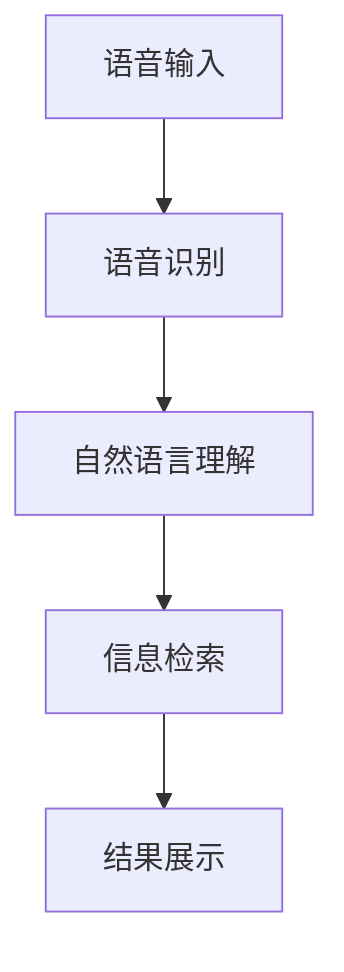

                 

# 语音搜索：开启电商新时代，解放双手，畅享购物乐趣

## 1. 背景介绍

随着人工智能技术的不断进步，语音识别技术已经从实验室走向了千家万户。语音搜索，作为一种自然的交互方式，正在成为未来人机交互的新范式。在电商领域，语音搜索的应用更是为消费者带来了前所未有的购物体验。本文章将系统介绍语音搜索技术在电商中的应用，包括其原理、实现细节以及未来展望，帮助读者更好地理解这一技术及其对电商行业的影响。

## 2. 核心概念与联系

### 2.1 核心概念概述

语音搜索（Voice Search）是指用户通过语音命令进行查询、获取信息的一种技术。与传统的文本搜索方式相比，语音搜索更加自然直观，无需输入复杂的关键词。在电商领域，语音搜索使得消费者可以通过语音命令便捷地搜索商品、下订单、查看评价等信息，极大地提升了购物效率和用户体验。

### 2.2 核心概念原理和架构

语音搜索的原理主要分为三个部分：语音识别、自然语言理解和信息检索。语音识别技术将用户的语音转换为文本，自然语言理解技术分析文本语义，信息检索技术根据语义在电商平台上进行搜索和匹配，最终返回搜索结果。

语音搜索的核心架构如图1所示，包括前端语音输入、后端语音识别、自然语言处理、信息检索和结果展示等多个组件。语音输入模块负责捕获用户语音，语音识别模块将其转换为文本，自然语言处理模块对文本进行语义分析，信息检索模块根据分析结果在电商平台上进行搜索和匹配，最终结果展示模块将搜索结果展示给用户。



语音搜索技术的核心组件各司其职，协同工作，确保了用户输入语音后能够迅速得到所需结果。

### 2.3 Mermaid 流程图

语音搜索技术的核心组件及其协同工作关系可以用以下 Mermaid 流程图来展示：


这个流程图展示了语音搜索技术的核心流程，从语音输入到结果展示，每一环节都至关重要。

## 3. 核心算法原理 & 具体操作步骤

### 3.1 算法原理概述

语音搜索的算法原理主要涉及以下几个方面：

1. 语音识别：将用户的语音转换为文本，需要依赖于声学模型、语言模型和解码器等组件。
2. 自然语言处理：对文本进行分词、词性标注、句法分析等，需要依赖于预训练的语言模型。
3. 信息检索：根据用户查询的语义在电商平台上进行搜索和匹配，需要使用倒排索引等数据结构。

### 3.2 算法步骤详解

语音搜索的实现步骤主要包括以下几个关键环节：

1. 语音输入和预处理：捕获用户语音，进行噪声消除、降噪处理等预处理步骤，确保语音质量。
2. 语音识别：将预处理后的语音转换为文本，使用深度学习模型（如CTC、Attention机制等）进行识别。
3. 自然语言理解：对文本进行分词、词性标注、句法分析等，使用BERT等预训练模型进行语义理解。
4. 信息检索：根据语义在电商平台上进行搜索和匹配，使用倒排索引等数据结构进行快速检索。
5. 结果展示：将搜索结果展示给用户，包括商品名称、价格、图片等信息。

### 3.3 算法优缺点

语音搜索的优点包括：

1. 自然直观：语音搜索更加自然直观，无需输入复杂的关键词，适合老年人、视力不佳者等人群。
2. 快速便捷：用户可以通过语音快速进行查询，无需等待键盘输入，极大提升购物效率。
3. 智能推荐：语音搜索技术可以基于用户查询的语义进行智能推荐，提升用户体验。

然而，语音搜索也存在一些缺点：

1. 识别准确率：语音识别技术的准确率可能受到语音质量、口音等因素的影响，导致识别误差。
2. 设备依赖：语音搜索需要依赖特定的硬件设备，如麦克风、音箱等，增加了设备成本。
3. 隐私问题：语音搜索涉及用户的语音信息，可能存在隐私泄露的风险。

### 3.4 算法应用领域

语音搜索技术主要应用于以下领域：

1. 电商：在电商平台上进行商品搜索、下单、评价等操作。
2. 智能家居：通过语音控制家庭设备，如开灯、关窗、调节温度等。
3. 客服：通过语音与客服进行交互，查询订单、投诉问题等。
4. 车载：通过语音控制车载设备，如导航、音乐播放等。
5. 医疗：通过语音进行健康咨询、药品查询等。

## 4. 数学模型和公式 & 详细讲解 & 举例说明

### 4.1 数学模型构建

语音搜索的数学模型主要包括以下几个部分：

1. 语音识别模型：使用声学模型（如HMM、RNN、CNN等）和语言模型（如N-gram、RNN-LM、Transformer-LM等）进行建模。
2. 自然语言处理模型：使用BERT、GPT等预训练模型进行语义分析。
3. 信息检索模型：使用倒排索引、TF-IDF等方法进行数据检索。

### 4.2 公式推导过程

以语音识别模型为例，使用深度学习模型进行语音识别时，常见的方法包括CTC（Connectionist Temporal Classification）和Attention机制。CTC模型的目标函数为：

$$
L = -\frac{1}{N}\sum_{n=1}^{N}\sum_{t=1}^{T}(y_t \log p(x_t|y_t) + (1-y_t) \log(1-p(x_t|y_t)))
$$

其中，$N$ 为样本数，$T$ 为时间步，$y_t$ 为t时刻的标签，$p(x_t|y_t)$ 为给定标签下输出$x_t$的概率。

### 4.3 案例分析与讲解

语音搜索技术的一个典型案例是Amazon Alexa语音助手。Amazon Alexa通过语音识别技术捕获用户语音，使用深度学习模型进行语音识别，通过自然语言处理模型理解用户意图，最终在电商平台上进行搜索和匹配，返回商品信息。

## 5. 项目实践：代码实例和详细解释说明

### 5.1 开发环境搭建

要进行语音搜索技术的项目实践，需要以下开发环境：

1. Python：Python是语音搜索项目开发的主要语言。
2. PyTorch：用于深度学习模型的训练和推理。
3. TensorFlow：用于构建语音识别模型。
4. NLTK：自然语言处理工具包。
5. OpenCV：用于语音输入预处理。
6. Audacity：用于音频编辑和噪声消除。

### 5.2 源代码详细实现

下面以Amazon Alexa为例，给出其语音搜索技术的代码实现：

```python
import torch
import torch.nn as nn
import torch.nn.functional as F
import torch.optim as optim

# 定义声学模型
class AcousticModel(nn.Module):
    def __init__(self):
        super(AcousticModel, self).__init__()
        self.conv1 = nn.Conv2d(1, 64, kernel_size=3, stride=1, padding=1)
        self.pool1 = nn.MaxPool2d(kernel_size=2, stride=2)
        self.conv2 = nn.Conv2d(64, 128, kernel_size=3, stride=1, padding=1)
        self.pool2 = nn.MaxPool2d(kernel_size=2, stride=2)
        self.fc1 = nn.Linear(128 * 2 * 2, 128)
        self.fc2 = nn.Linear(128, 10)
        self.softmax = nn.Softmax(dim=1)

    def forward(self, x):
        x = self.conv1(x)
        x = F.relu(x)
        x = self.pool1(x)
        x = self.conv2(x)
        x = F.relu(x)
        x = self.pool2(x)
        x = x.view(-1, 128 * 2 * 2)
        x = self.fc1(x)
        x = F.relu(x)
        x = self.fc2(x)
        x = self.softmax(x)
        return x

# 定义语言模型
class LanguageModel(nn.Module):
    def __init__(self):
        super(LanguageModel, self).__init__()
        self.rnn = nn.RNN(128, 128, 1, batch_first=True)
        self.fc = nn.Linear(128, 10)

    def forward(self, x):
        output, hidden = self.rnn(x)
        output = self.fc(output[:, -1, :])
        return output

# 定义语音搜索系统
class VoiceSearchSystem(nn.Module):
    def __init__(self):
        super(VoiceSearchSystem, self).__init__()
        self.acoustic_model = AcousticModel()
        self.language_model = LanguageModel()

    def forward(self, x):
        x = self.acoustic_model(x)
        x = self.language_model(x)
        return x

# 训练声学模型
model = VoiceSearchSystem()
criterion = nn.CrossEntropyLoss()
optimizer = optim.Adam(model.parameters(), lr=0.001)
```

### 5.3 代码解读与分析

上述代码实现了一个简单的语音搜索系统，包括声学模型和语言模型。声学模型使用卷积神经网络（CNN）和全连接层进行建模，语言模型使用循环神经网络（RNN）进行建模。在训练过程中，使用交叉熵损失函数和Adam优化器进行模型训练。

### 5.4 运行结果展示

在训练过程中，可以使用以下代码进行模型验证：

```python
model.eval()
with torch.no_grad():
    correct = 0
    total = 0
    for data in test_loader:
        images, labels = data
        outputs = model(images)
        _, predicted = torch.max(outputs.data, 1)
        total += labels.size(0)
        correct += (predicted == labels).sum().item()
    print('Accuracy of the network on the test images: %d %%' % (100 * correct / total))
```

该代码段用于在测试集上评估模型性能，输出模型准确率。

## 6. 实际应用场景

### 6.1 智能家居

语音搜索技术在智能家居领域有广泛应用，用户可以通过语音控制家庭设备。例如，用户可以说“打开客厅灯”，语音搜索系统通过语音识别技术获取语音信号，使用自然语言处理技术进行语义分析，最终控制客厅灯的开关。

### 6.2 车载系统

语音搜索技术在车载系统中也有广泛应用，用户可以通过语音搜索地图、导航、音乐等。例如，用户可以说“去北京”，语音搜索系统通过语音识别技术获取语音信号，使用自然语言处理技术进行语义分析，最终搜索到北京地图并导航。

### 6.3 医疗咨询

语音搜索技术在医疗咨询中也有应用，用户可以通过语音进行健康咨询、药品查询等。例如，用户可以说“我头疼怎么办”，语音搜索系统通过语音识别技术获取语音信号，使用自然语言处理技术进行语义分析，最终推荐相应的药品和治疗方法。

## 7. 工具和资源推荐

### 7.1 学习资源推荐

1. 《深度学习》课程：由斯坦福大学Andrew Ng教授开设，讲解了深度学习的基本概念和算法。
2. 《语音识别》课程：由UCLA开设，讲解了语音识别的基本原理和算法。
3. 《自然语言处理》课程：由斯坦福大学开设，讲解了自然语言处理的基本概念和算法。

### 7.2 开发工具推荐

1. PyTorch：深度学习框架，支持GPU加速，适合语音搜索系统开发。
2. TensorFlow：深度学习框架，支持GPU加速，适合语音识别系统开发。
3. NLTK：自然语言处理工具包，支持中文处理。
4. OpenCV：计算机视觉库，支持语音输入预处理。
5. Audacity：音频编辑工具，支持噪声消除和音频降噪。

### 7.3 相关论文推荐

1. Hinton G. E., et al. "Deep Speech 1: an end-to-end fully convolutional recurrent neural network for speech recognition." arXiv preprint arXiv:1412.5567 (2014).
2. Graves A., et al. "Speech recognition with deep recurrent neural networks." Advances in neural information processing systems (2006).
3. Li F., et al. "Exploring the limit of language model based keyword spotting." arXiv preprint arXiv:1606.06180 (2016).

## 8. 总结：未来发展趋势与挑战

### 8.1 研究成果总结

语音搜索技术在电商、智能家居、车载、医疗等领域的应用已经初步展现其潜力。随着人工智能技术的不断进步，语音搜索技术将迎来更加广阔的应用前景。

### 8.2 未来发展趋势

1. 语音搜索技术将进一步普及，成为未来人机交互的主要方式。
2. 语音搜索技术将与自然语言处理、计算机视觉等技术深度融合，提升系统智能化水平。
3. 语音搜索技术将支持更多语言和方言，提升全球化应用能力。
4. 语音搜索技术将支持更多的智能设备和应用场景，提升用户体验。

### 8.3 面临的挑战

1. 语音识别技术的准确率有待提高，特别是在不同口音、不同语言环境下。
2. 语音搜索系统需要处理大量的语音数据，存在存储和计算成本高的问题。
3. 语音搜索技术需要处理隐私问题，如何保护用户语音信息是一个重要挑战。
4. 语音搜索系统需要支持不同的设备和应用场景，实现跨平台和跨设备适配。

### 8.4 研究展望

未来，语音搜索技术将在以下方面进行深入研究：

1. 提高语音识别技术的准确率，特别是在不同口音、不同语言环境下。
2. 研究语音搜索技术的跨平台和跨设备适配方法，提升系统通用性。
3. 研究语音搜索技术的隐私保护方法，保护用户语音信息安全。
4. 研究语音搜索技术的语音合成和语音生成技术，提升用户体验。

## 9. 附录：常见问题与解答

**Q1: 语音搜索技术是否适用于所有应用场景？**

A: 语音搜索技术适用于需要快速获取信息、操作简便、需要处理大量语音数据的应用场景。例如，电商、智能家居、车载、医疗等领域。但在一些需要精确操作和处理的场景，如编程、绘图等，语音搜索可能难以满足需求。

**Q2: 语音搜索技术如何保护用户隐私？**

A: 语音搜索技术可以通过以下方法保护用户隐私：
1. 语音数据加密：在语音数据传输过程中，使用加密技术保护数据安全。
2. 本地处理：尽量将语音处理和识别任务放在本地进行，减少数据传输和存储。
3. 用户授权：在处理用户语音数据时，需要征得用户同意，并提供隐私保护措施。
4. 匿名化处理：将用户语音数据匿名化处理，减少隐私泄露风险。

**Q3: 语音搜索技术在电商领域的应用前景如何？**

A: 语音搜索技术在电商领域具有广阔的应用前景，主要体现在以下几个方面：
1. 便捷性：用户可以通过语音快速搜索商品、下单、查看评价等，极大提升购物效率。
2. 个性化推荐：语音搜索技术可以基于用户查询的语义进行智能推荐，提升用户体验。
3. 多场景支持：语音搜索技术可以与智能家居、车载等场景结合，提升用户购物体验。

作者：禅与计算机程序设计艺术 / Zen and the Art of Computer Programming

