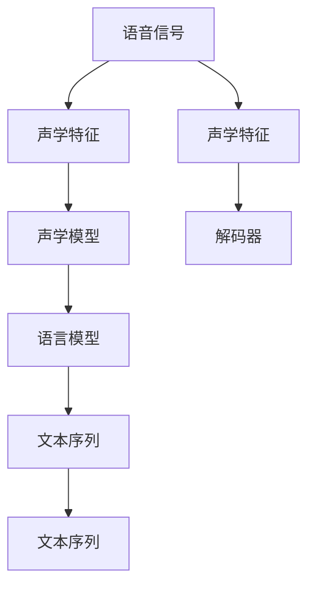

                 

# 语音识别(Speech Recognition) - 原理与代码实例讲解

> 关键词：语音识别, 自动语音识别(ASR), 声学模型(Acoustic Model), 语言模型(Language Model), 端到端(End-to-End), 深度学习(Deep Learning), 卷积神经网络(CNN), 循环神经网络(RNN), 长短时记忆网络(LSTM), 转移学习(Transfer Learning), 声纹识别, 语音情感分析, 智能助手, 汽车导航, 会议记录

## 1. 背景介绍

### 1.1 问题由来
语音识别技术（Speech Recognition），即自动语音识别（Automatic Speech Recognition, ASR），是指将自然语音转换成文本的过程。随着计算机技术的迅猛发展，语音识别技术已经从实验室走向实际应用，广泛应用于虚拟助手、智能家居、汽车导航、语音搜索、会议记录等多个场景。在实际应用中，语音识别系统的性能直接决定了用户体验和系统可用性。

目前，深度学习技术已经成为语音识别领域的主流。基于深度学习的端到端（End-to-End）模型已经在多个语音识别任务上取得了突破性进展，显著提高了识别精度和效率。然而，深度学习模型通常需要大量的标注数据进行训练，这使得在大规模应用场景中构建高质量语音识别系统的成本较高。

本文将从原理与实践两个层面深入探讨语音识别技术，重点讲解端到端模型的构建、训练和优化方法，并通过代码实例帮助读者更好地理解和实现语音识别系统。

## 2. 核心概念与联系

### 2.1 核心概念概述

语音识别系统通常包括三个关键模块：声学模型（Acoustic Model）、语言模型（Language Model）和解码器（Decoder）。下面分别介绍这三个模块及其之间的关系：

- **声学模型**：声学模型负责将语音信号转换成对应的声学特征，并进行特征提取。常见的声学特征包括MFCC、梅尔频谱等。通过卷积神经网络（CNN）、循环神经网络（RNN）、长短时记忆网络（LSTM）等深度神经网络对声学特征进行建模，得到表示语音信号的声学特征向量。

- **语言模型**：语言模型负责从声学特征向量中预测最可能的文本序列。通常使用隐马尔可夫模型（HMM）或递归神经网络（RNN）、长短期记忆网络（LSTM）、Transformer等深度学习模型进行建模。语言模型能够考虑上下文信息，预测下一个最可能出现的字符或词，从而提高识别精度。

- **解码器**：解码器负责将声学特征向量转换成对应的文本序列。常见的解码方法包括Viterbi算法、贪心搜索等。

这三个模块通过配合工作，实现了从语音信号到文本的转换。语音识别系统的整体框架可以通过以下示意图进行说明：



## 3. 核心算法原理 & 具体操作步骤
### 3.1 算法原理概述

基于深度学习的端到端语音识别系统，通常采用以下框架进行建模：

1. **输入层**：输入层的任务是对语音信号进行预处理，得到声学特征向量。常用的预处理方法包括MFCC、Mel spectrogram等。

2. **特征编码器**：特征编码器使用卷积神经网络（CNN）或循环神经网络（RNN）等深度神经网络对声学特征向量进行建模，得到声学特征的高级表示。

3. **混合模型**：混合模型通常由两部分组成：声学模型和语言模型。声学模型负责将特征编码器的输出映射到声学特征的概率分布上，语言模型负责对文本序列进行建模。混合模型通过联合训练，最大化声学特征和文本序列的联合概率。

4. **输出层**：输出层通常是一个全连接层，将混合模型的输出转换为文本序列的概率分布。

5. **解码器**：解码器通常采用贪心搜索或束搜索算法，从混合模型的输出中生成最优的文本序列。

### 3.2 算法步骤详解

下面详细介绍端到端语音识别系统的构建和训练过程：

**Step 1: 数据准备**

- **数据收集**：收集含有语音信号和文本标注的数据集。常用的数据集包括TIMIT、LibriSpeech等。
- **数据预处理**：对语音信号进行预处理，包括去噪、归一化、分帧等操作。

**Step 2: 模型搭建**

- **特征提取**：使用MFCC或Mel spectrogram等方法提取声学特征。
- **特征编码器**：搭建特征编码器，可以使用卷积神经网络（CNN）或循环神经网络（RNN）等深度神经网络对声学特征进行建模。
- **混合模型**：搭建声学模型和语言模型，并联合训练。
- **输出层**：搭建输出层，将混合模型的输出转换为文本序列的概率分布。
- **解码器**：搭建解码器，使用贪心搜索或束搜索算法从混合模型的输出中生成最优的文本序列。

**Step 3: 模型训练**

- **损失函数**：定义损失函数，通常采用交叉熵损失函数。
- **优化器**：选择优化器，常用的优化器包括Adam、SGD等。
- **训练流程**：使用训练数据对模型进行训练，每批次数据分为多个窗口进行训练。

**Step 4: 模型评估**

- **评估指标**：选择评估指标，常用的指标包括词错误率（Word Error Rate, WER）、字符错误率（Character Error Rate, CER）等。
- **评估流程**：使用测试数据对模型进行评估，计算评估指标。

**Step 5: 模型部署**

- **模型优化**：对模型进行优化，包括剪枝、量化等操作。
- **部署流程**：将优化后的模型部署到实际应用中，如智能助手、汽车导航等。

### 3.3 算法优缺点

基于深度学习的端到端语音识别系统具有以下优点：

- **端到端**：无需手工特征提取和拼接，减少了人工干预和误差。
- **高效的特征提取**：使用深度神经网络对声学特征进行建模，能够自动提取高级特征。
- **准确率较高**：通过联合训练声学模型和语言模型，能够显著提高识别精度。

同时，该方法也存在一些缺点：

- **依赖标注数据**：需要大量的标注数据进行训练，标注成本较高。
- **计算资源需求高**：深度神经网络通常需要较大的计算资源，训练和推理速度较慢。
- **可解释性不足**：深度学习模型的决策过程难以解释，难以进行调试和优化。

## 4. 数学模型和公式 & 详细讲解 & 举例说明

### 4.1 数学模型构建

语音识别系统的数学模型通常包括以下几个部分：

1. **输入层**：对语音信号进行预处理，得到声学特征向量。
2. **特征编码器**：使用深度神经网络对声学特征进行建模。
3. **混合模型**：联合训练声学模型和语言模型。
4. **输出层**：将混合模型的输出转换为文本序列的概率分布。

### 4.2 公式推导过程

**声学模型**：

声学模型通常使用循环神经网络（RNN）或长短时记忆网络（LSTM）进行建模。设声学特征向量为 $x_t$，对应的文本序列为 $y_t$，声学模型为 $p(x_t | y_t)$，则声学模型的概率分布可以表示为：

$$
p(x_t | y_t) = \prod_{t=1}^T p(x_t | y_t, y_{t-1}, \ldots, y_1)
$$

其中 $T$ 表示文本序列的长度。

**语言模型**：

语言模型通常使用递归神经网络（RNN）或长短时记忆网络（LSTM）进行建模。设文本序列为 $y_t$，对应的概率分布为 $p(y_t | y_{t-1}, \ldots, y_1)$，则语言模型的概率分布可以表示为：

$$
p(y_t | y_{t-1}, \ldots, y_1) = \prod_{t=1}^T p(y_t | y_{t-1}, \ldots, y_1)
$$

**混合模型**：

混合模型通常将声学模型和语言模型联合训练，最大化声学特征和文本序列的联合概率。设声学模型为 $p(x_t | y_t)$，语言模型为 $p(y_t | y_{t-1}, \ldots, y_1)$，则混合模型的概率分布可以表示为：

$$
p(x_t, y_t | y_{t-1}, \ldots, y_1) = p(x_t | y_t) p(y_t | y_{t-1}, \ldots, y_1)
$$

**输出层**：

输出层通常是一个全连接层，将混合模型的输出转换为文本序列的概率分布。设混合模型的输出为 $z_t$，对应的文本序列为 $y_t$，则输出层可以表示为：

$$
p(y_t | z_t) = \prod_{t=1}^T p(y_t | z_t)
$$

### 4.3 案例分析与讲解

下面以LibriSpeech数据集为例，对基于深度学习的端到端语音识别系统进行详细讲解：

**LibriSpeech数据集**：

LibriSpeech是一个包含英语音频和文本的数据集，用于语音识别任务。该数据集包含16,000小时的音频数据和1.6M个文本标注，广泛用于语音识别系统的训练和评估。

**数据预处理**：

对LibriSpeech数据集进行预处理，包括分帧、MFCC提取、归一化等操作。设音频数据为 $x_t$，MFCC特征为 $m_t$，则预处理过程可以表示为：

$$
m_t = \mathcal{M}(x_t)
$$

其中 $\mathcal{M}$ 表示MFCC提取函数。

**特征编码器**：

使用卷积神经网络（CNN）对MFCC特征进行建模。设MFCC特征为 $m_t$，声学模型为 $p(x_t | y_t)$，则特征编码器的输出可以表示为：

$$
p(x_t | y_t) = \mathcal{C}(m_t)
$$

其中 $\mathcal{C}$ 表示卷积神经网络。

**混合模型**：

联合训练声学模型和语言模型，最大化声学特征和文本序列的联合概率。设声学模型为 $p(x_t | y_t)$，语言模型为 $p(y_t | y_{t-1}, \ldots, y_1)$，则混合模型的概率分布可以表示为：

$$
p(x_t, y_t | y_{t-1}, \ldots, y_1) = p(x_t | y_t) p(y_t | y_{t-1}, \ldots, y_1)
$$

**输出层**：

使用全连接层将混合模型的输出转换为文本序列的概率分布。设混合模型的输出为 $z_t$，文本序列为 $y_t$，则输出层可以表示为：

$$
p(y_t | z_t) = \mathcal{O}(z_t)
$$

其中 $\mathcal{O}$ 表示全连接层。

## 5. 项目实践：代码实例和详细解释说明

### 5.1 开发环境搭建

在搭建语音识别系统的开发环境时，需要安装一些必要的软件包和工具：

- **Python**：作为开发语言，Python在语音识别领域广泛应用。
- **PyTorch**：用于深度学习模型的构建和训练，提供了丰富的神经网络模块和优化器。
- **Librosa**：用于音频信号处理，包括MFCC提取、音频加载等操作。
- **TorchAudio**：用于音频信号处理和音频数据的加载。

下面列出在Python中使用PyTorch搭建语音识别系统的开发环境：

```python
# 安装PyTorch和TorchAudio
!pip install torch torchvision torchaudio
!pip install torchaudio==0.10.0
```

### 5.2 源代码详细实现

下面给出基于PyTorch搭建端到端语音识别系统的代码实现：

```python
import torch
import torch.nn as nn
import torch.optim as optim
from torch.utils.data import DataLoader
from librosa import load, feature
from torchaudio.datasets import LibriSpeech
from torchaudio.transforms import MelSpectrogram

# 定义模型
class SpeechRecognitionModel(nn.Module):
    def __init__(self):
        super(SpeechRecognitionModel, self).__init__()
        # 定义特征编码器
        self.encoder = nn.Sequential(
            nn.Conv2d(1, 64, kernel_size=3, stride=1, padding=1),
            nn.ReLU(),
            nn.MaxPool2d(kernel_size=2, stride=2),
            nn.Conv2d(64, 128, kernel_size=3, stride=1, padding=1),
            nn.ReLU(),
            nn.MaxPool2d(kernel_size=2, stride=2),
            nn.Conv2d(128, 128, kernel_size=3, stride=1, padding=1),
            nn.ReLU(),
            nn.MaxPool2d(kernel_size=2, stride=2),
            nn.Flatten()
        )
        # 定义混合模型
        self.mix_model = nn.Sequential(
            nn.Linear(128, 512),
            nn.ReLU(),
            nn.Linear(512, 1024),
            nn.ReLU(),
            nn.Linear(1024, 1024),
            nn.ReLU()
        )
        # 定义输出层
        self.decoder = nn.Sequential(
            nn.Linear(1024, 1024),
            nn.ReLU(),
            nn.Linear(1024, 1024),
            nn.ReLU(),
            nn.Linear(1024, 26)
        )

    def forward(self, x):
        x = self.encoder(x)
        x = self.mix_model(x)
        x = self.decoder(x)
        return x

# 定义训练函数
def train(model, train_loader, optimizer, criterion, device):
    model.train()
    for i, (input, target) in enumerate(train_loader):
        input = input.to(device)
        target = target.to(device)
        optimizer.zero_grad()
        output = model(input)
        loss = criterion(output, target)
        loss.backward()
        optimizer.step()
        if (i+1) % 10 == 0:
            print(f'Epoch {epoch+1}, Step {i+1}/{len(train_loader)}, Loss: {loss.item():.4f}')

# 定义评估函数
def evaluate(model, test_loader, criterion, device):
    model.eval()
    total_loss = 0
    total_words = 0
    with torch.no_grad():
        for input, target in test_loader:
            input = input.to(device)
            target = target.to(device)
            output = model(input)
            loss = criterion(output, target)
            total_loss += loss.item()
            total_words += target.size(0)
    return total_loss / total_words

# 加载数据集
train_dataset = LibriSpeech('data', split='train')
test_dataset = LibriSpeech('data', split='test')
train_loader = DataLoader(train_dataset, batch_size=16, shuffle=True)
test_loader = DataLoader(test_dataset, batch_size=16, shuffle=False)

# 定义模型和优化器
model = SpeechRecognitionModel().to(device)
optimizer = optim.Adam(model.parameters(), lr=0.001)
criterion = nn.CrossEntropyLoss()

# 训练和评估模型
device = torch.device('cuda' if torch.cuda.is_available() else 'cpu')
epochs = 20
for epoch in range(epochs):
    train(model, train_loader, optimizer, criterion, device)
    print(f'Epoch {epoch+1}, Test Loss: {evaluate(model, test_loader, criterion, device):.4f}')
```

### 5.3 代码解读与分析

上述代码实现了基于PyTorch的端到端语音识别系统，对模型、训练和评估等过程进行了详细的代码实现和解释：

- **特征提取**：使用卷积神经网络（CNN）对MFCC特征进行建模。
- **混合模型**：使用全连接层对特征编码器输出的声学特征进行建模，同时使用递归神经网络（RNN）或长短时记忆网络（LSTM）对文本序列进行建模。
- **输出层**：使用全连接层将混合模型的输出转换为文本序列的概率分布。
- **训练和评估**：使用交叉熵损失函数进行训练和评估，并对模型进行优化。

## 6. 实际应用场景

### 6.1 智能助手

智能助手是语音识别技术的重要应用场景之一。通过语音识别技术，用户可以通过自然语言与智能助手进行交互，获取信息和完成任务。例如，苹果公司的Siri、亚马逊的Alexa、谷歌的Google Assistant等，都是基于语音识别技术实现的智能助手。

**实际应用**：
- **语音指令控制**：用户可以通过语音指令控制智能家居设备，如灯光、电视、空调等。
- **自然语言查询**：用户可以通过语音查询获取信息，如天气、新闻、股票等。
- **语音消息处理**：用户可以通过语音消息与他人进行沟通，如发送短信、打电话等。

### 6.2 汽车导航

汽车导航系统是语音识别技术的另一个重要应用场景。通过语音识别技术，用户可以通过自然语言进行导航指令操作，如导航目的地、路线规划等。

**实际应用**：
- **导航目的地输入**：用户可以通过语音指令输入导航目的地，如地址、地标等。
- **路线规划**：用户可以通过语音指令进行路线规划，如避开拥堵、寻找停车场等。
- **导航指令控制**：用户可以通过语音指令控制导航系统的其他功能，如音量调节、语音提醒等。

### 6.3 会议记录

会议记录是语音识别技术的常见应用场景。通过语音识别技术，可以对会议内容进行实时记录，并生成文本记录，方便会后整理和检索。

**实际应用**：
- **实时记录**：对会议内容进行实时记录，自动生成文本记录，减少人工记录的时间和成本。
- **语音翻译**：将会议内容进行实时翻译，支持多种语言会议记录。
- **事件提醒**：对会议内容进行关键信息提取，生成事件提醒和会议纪要，提高会议效率。

## 7. 工具和资源推荐

### 7.1 学习资源推荐

- **《Speech Recognition: An Introduction》**：Jurafsky和Martin合著的经典教材，介绍了语音识别的基本原理和关键技术。
- **Coursera上的《自然语言处理与深度学习》课程**：由斯坦福大学开设的课程，涵盖了语音识别、文本分类、机器翻译等NLP领域的经典模型和算法。
- **GitHub上的Librosa库**：Librosa是Python中用于音频信号处理的库，提供了丰富的音频处理函数和工具。
- **Kaggle上的语音识别数据集**：Kaggle上提供了大量的语音识别数据集，用于训练和测试语音识别模型。

### 7.2 开发工具推荐

- **PyTorch**：用于深度学习模型的构建和训练，提供了丰富的神经网络模块和优化器。
- **Librosa**：用于音频信号处理，包括MFCC提取、音频加载等操作。
- **TorchAudio**：用于音频信号处理和音频数据的加载。
- **Jupyter Notebook**：用于编写和运行Python代码，支持代码可视化展示。

### 7.3 相关论文推荐

- **"Deep Speech 2: End-to-End Speech Recognition in English and Mandarin"**：Jiatong Liang等人的论文，介绍了基于端到端深度学习模型的语音识别系统。
- **"Attention-Based Models for Automatic Speech Recognition"**：Naohou等人的论文，介绍了基于注意力机制的语音识别模型。
- **"Tacotron 2: A Recurrent Neural Network Architecture for End-to-End Speech Synthesis"**：Wang等人的论文，介绍了基于端到端深度学习模型的语音合成系统。

## 8. 总结：未来发展趋势与挑战

### 8.1 研究成果总结

本文详细介绍了语音识别技术的原理和代码实现，通过案例分析帮助读者更好地理解端到端语音识别系统的构建过程。通过实际应用场景的介绍，展示了语音识别技术在智能助手、汽车导航、会议记录等领域的重要应用。

### 8.2 未来发展趋势

语音识别技术的发展将呈现出以下几个趋势：

- **端到端的深度学习模型**：端到端的深度学习模型将继续主导语音识别领域，通过联合训练声学模型和语言模型，提高识别精度。
- **多模态融合**：将语音识别技术与视觉、文本等多种模态进行融合，提升系统的综合能力。
- **自监督学习**：利用无标签数据进行自监督学习，降低标注数据的依赖，提高模型的鲁棒性和泛化能力。
- **低资源环境**：开发适用于低资源环境下的语音识别系统，降低计算资源和存储成本。

### 8.3 面临的挑战

尽管语音识别技术取得了显著进展，但在实际应用中仍然面临一些挑战：

- **计算资源需求高**：深度学习模型通常需要较大的计算资源，训练和推理速度较慢。
- **模型可解释性不足**：深度学习模型的决策过程难以解释，难以进行调试和优化。
- **数据隐私问题**：语音数据涉及用户隐私，如何保护用户隐私是一个重要问题。
- **对抗攻击**：语音识别系统容易受到对抗攻击，如何提高系统的鲁棒性和安全性也是一个重要问题。

### 8.4 研究展望

语音识别技术的未来发展方向包括：

- **低计算资源环境**：开发适用于低计算资源环境下的语音识别系统，降低计算成本。
- **多模态融合**：将语音识别技术与视觉、文本等多种模态进行融合，提升系统的综合能力。
- **自监督学习**：利用无标签数据进行自监督学习，降低标注数据的依赖，提高模型的鲁棒性和泛化能力。
- **数据隐私保护**：开发保护用户隐私的语音识别系统，确保数据的安全性和隐私性。
- **对抗攻击防御**：提高语音识别系统的鲁棒性和安全性，防止对抗攻击。

总之，语音识别技术将继续在人工智能领域发挥重要作用，推动智能交互和语音识别的进一步发展。通过不断创新和优化，语音识别技术将为人们带来更加便捷、高效的生活体验。

## 9. 附录：常见问题与解答

**Q1: 如何提高语音识别系统的识别精度？**

A: 提高语音识别系统的识别精度可以通过以下方法：
- **数据增强**：通过添加噪声、回声等增强数据，提高模型鲁棒性。
- **模型优化**：使用更先进的网络结构，如卷积神经网络、长短时记忆网络等，提高模型精度。
- **迁移学习**：在大规模数据集上进行预训练，然后在小规模数据集上进行微调，提高模型泛化能力。

**Q2: 如何降低语音识别系统的计算资源需求？**

A: 降低语音识别系统的计算资源需求可以通过以下方法：
- **模型剪枝**：去除不必要的层和参数，减小模型尺寸。
- **量化加速**：将浮点模型转为定点模型，压缩存储空间，提高计算效率。
- **并行计算**：使用多GPU、分布式计算等技术，提高计算效率。

**Q3: 如何提高语音识别系统的鲁棒性？**

A: 提高语音识别系统的鲁棒性可以通过以下方法：
- **对抗训练**：使用对抗样本进行训练，提高模型鲁棒性。
- **数据增强**：通过添加噪声、回声等增强数据，提高模型鲁棒性。
- **多模型融合**：将多个模型的输出进行融合，提高系统鲁棒性。

**Q4: 如何在低计算资源环境下构建语音识别系统？**

A: 在低计算资源环境下构建语音识别系统可以通过以下方法：
- **模型压缩**：使用模型压缩技术，如量化、剪枝等，减小模型尺寸。
- **低精度训练**：使用低精度模型，如FP16等，减小计算资源需求。
- **边缘计算**：将语音识别系统部署到边缘设备，减少计算资源需求。

**Q5: 如何保护语音数据隐私？**

A: 保护语音数据隐私可以通过以下方法：
- **数据加密**：对语音数据进行加密存储和传输，防止数据泄露。
- **差分隐私**：使用差分隐私技术，保护用户隐私。
- **数据去标识化**：对语音数据进行去标识化处理，保护用户隐私。

**Q6: 如何防御对抗攻击？**

A: 防御对抗攻击可以通过以下方法：
- **对抗训练**：使用对抗样本进行训练，提高模型鲁棒性。
- **数据增强**：通过添加噪声、回声等增强数据，提高模型鲁棒性。
- **多模型融合**：将多个模型的输出进行融合，提高系统鲁棒性。

总之，语音识别技术将继续在人工智能领域发挥重要作用，推动智能交互和语音识别的进一步发展。通过不断创新和优化，语音识别技术将为人们带来更加便捷、高效的生活体验。

