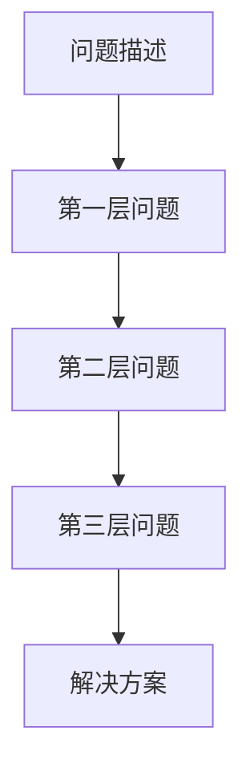

                 

## 1. 背景介绍

费曼提问法，源自著名物理学家理查德·费曼，是一种用于深入理解问题的深度思考工具。它通过构建一系列层层递进的问题，逐步剖析问题的核心，帮助理解复杂现象。在企业管理中，费曼提问法可以用于诊断问题、制定策略、提升团队协作效率。文章将详细探讨费曼提问法在企业管理问题诊断中的应用。

## 2. 核心概念与联系

### 2.1 核心概念概述

费曼提问法是一种基于深度理解和自我反思的学习方法。其核心思想是通过提问来深化对问题的理解，解决知识遗漏和信息不全的问题。在企业管理中，运用费曼提问法可以系统化地分析和解决复杂问题，提升问题诊断的深度和广度。

### 2.2 核心概念原理和架构的 Mermaid 流程图

这个流程图展示了费曼提问法的核心步骤：

1. **问题描述**：首先需要明确问题的具体情境和背景。
2. **第一层问题**：基于问题描述，提出一个宏观的问题框架，涵盖问题的主要方面。
3. **第二层问题**：针对第一层问题，细化问题，提出具体的子问题或关键细节。
4. **第三层问题**：进一步深入，针对第二层问题中的细节，提出更具体的探究问题。
5. **解决方案**：基于对问题的深入理解，制定具体的解决方案或行动计划。

### 2.3 核心概念联系

费曼提问法通过层层递进的问题剖析，帮助企业团队对复杂问题进行深入理解。这种分析方式不仅适用于管理问题的诊断，也适用于战略制定、产品开发等场景。它促进了团队成员之间的深度沟通和协作，提升了组织整体的决策效率和创新能力。

## 3. 核心算法原理 & 具体操作步骤

### 3.1 算法原理概述

费曼提问法的核心在于通过构建递进式问题来深度剖析问题的本质。其原理包括以下几个关键步骤：

1. **问题界定**：明确问题的定义和范围。
2. **问题分层**：将问题分解为若干层级，每层提出具体问题。
3. **深度探究**：针对每一层问题进行深入探究，进一步细化子问题。
4. **解决方案制定**：基于对问题的全面理解，制定具体的解决方案。

### 3.2 算法步骤详解

#### 步骤1：问题界定

问题界定是费曼提问法的第一步，也是最关键的一步。通过明确问题的定义和范围，构建问题的基础框架。例如，如果企业面临销售下降的问题，可以界定问题的范围为：

- 具体产品的销售情况如何？
- 销售下降的趋势是什么？
- 销售下降的原因是什么？

#### 步骤2：问题分层

问题分层是将问题分解为可操作的子问题，每层问题应该尽可能具体，便于探究。例如，继续以上面的销售下降问题为例，可以将问题分为以下层次：

- **第一层问题**：销售下降的主要原因是什么？
- **第二层问题**：竞争对手的销售情况如何？
- **第三层问题**：市场需求变化趋势如何？
- **第四层问题**：产品市场定位是否准确？

#### 步骤3：深度探究

深度探究是通过细化每层问题，进一步探究问题的具体细节。例如，针对销售下降的主要原因，可以提出以下问题：

- **第一层问题**：销售下降的主要原因是什么？
- **第二层问题**：哪些市场区域或产品类别受到影响？
- **第三层问题**：销售下降的具体时间和周期性如何？
- **第四层问题**：销售下降是否与营销活动或市场变化有关？

#### 步骤4：解决方案制定

基于对问题的深入理解，制定具体的解决方案或行动计划。例如，针对销售下降问题，可以提出以下解决方案：

- **第一层问题**：制定增加市场推广力度的策略。
- **第二层问题**：优化产品包装和市场定位。
- **第三层问题**：加强与客户的沟通和反馈机制。
- **第四层问题**：调整销售渠道和分销策略。

### 3.3 算法优缺点

费曼提问法具有以下优点：

1. **深度理解**：通过层层递进的问题剖析，帮助团队成员深入理解问题的本质。
2. **系统化分析**：将问题分解为可操作的子问题，便于系统化分析和解决。
3. **提升协作**：促进团队成员之间的深度沟通和协作，提升整体团队的协同效率。

同时，费曼提问法也存在一些局限性：

1. **时间成本高**：构建深度问题链需要较长时间和精力。
2. **复杂性高**：对问题复杂度要求较高，简单问题可能难以应用。
3. **主观性**：问题设计依赖于提问者的主观判断，可能存在偏差。

### 3.4 算法应用领域

费曼提问法广泛应用于企业管理问题的诊断和解决中，具体应用场景包括：

- **战略制定**：通过深入分析，制定战略规划。
- **产品开发**：理解用户需求，优化产品设计。
- **市场营销**：分析市场趋势，制定营销策略。
- **运营管理**：提升生产效率，优化流程。

## 4. 数学模型和公式 & 详细讲解 & 举例说明

### 4.1 数学模型构建

费曼提问法通过构建问题链来剖析问题，其数学模型可以表示为：

$$
P = Q_1 \land Q_2 \land Q_3 \land \ldots Q_n
$$

其中，$P$为问题的总体描述，$Q_1, Q_2, \ldots, Q_n$为递进式问题链。

### 4.2 公式推导过程

费曼提问法的问题链构建过程可以形式化表示为：

1. 问题描述：$P$ 为问题的总体描述。
2. 第一层问题：$Q_1 = \forall X \in P, Q_1(X)$。
3. 第二层问题：$Q_2 = \forall X \in Q_1, Q_2(X)$。
4. 第三层问题：$Q_3 = \forall X \in Q_2, Q_3(X)$。
5. 递进到第$n$层问题：$Q_n = \forall X \in Q_{n-1}, Q_n(X)$。

### 4.3 案例分析与讲解

#### 案例：销售额下降问题

假设某公司的销售部门发现近期的销售额显著下降，需要进行问题诊断。

1. **问题描述**：销售额在过去三个月下降了20%，影响了几款主要产品。
2. **第一层问题**：销售额下降的主要原因是什么？
   - **子问题**：市场份额下降、竞争加剧、产品问题、促销活动不足等。
3. **第二层问题**：哪些市场区域或产品类别受到影响？
   - **子问题**：不同地区销售数据、产品销售数据等。
4. **第三层问题**：销售下降的具体时间和周期性如何？
   - **子问题**：历史销售数据、季节性变化等。
5. **第四层问题**：销售下降是否与营销活动或市场变化有关？
   - **子问题**：营销活动数据分析、竞争对手动态等。

### 4.4 案例分析与讲解

#### 案例：客户满意度下降问题

假设某公司的客户满意度调查显示满意度大幅下降，需要进行问题诊断。

1. **问题描述**：客户满意度评分从90分降至80分，影响了多个客户群体。
2. **第一层问题**：客户满意度下降的主要原因是什么？
   - **子问题**：产品质量、服务质量、售后支持等。
3. **第二层问题**：客户对哪些具体问题不满意？
   - **子问题**：产品使用体验、售后服务流程等。
4. **第三层问题**：客户不满意的具体表现形式有哪些？
   - **子问题**：客户投诉数据、反馈数据等。
5. **第四层问题**：如何改善客户满意度？
   - **子问题**：提升产品质量、优化服务流程、加强售后服务等。

## 5. 项目实践：代码实例和详细解释说明

### 5.1 开发环境搭建

费曼提问法的实践主要依赖于团队沟通和协作，不需要复杂的代码实现。因此，开发环境的搭建主要涉及团队协作工具的配置。以下是一个基本的配置示例：

- **项目管理工具**：JIRA、Trello、Asana等项目管理工具，用于任务分解和进度跟踪。
- **沟通工具**：Slack、Microsoft Teams等团队沟通工具，用于实时交流和协作。
- **协作文档**：Confluence、Google Docs等协作文档工具，用于记录问题分析和解决方案。

### 5.2 源代码详细实现

由于费曼提问法的实践主要依赖于团队协作，不需要复杂的代码实现。因此，本文不提供代码实现。

### 5.3 代码解读与分析

费曼提问法的代码实现主要涉及团队协作工具的配置和数据的管理。以下是一个基本的配置示例：

1. **项目管理工具配置**：在JIRA中创建项目，分解任务，设置里程碑和进度跟踪。
2. **沟通工具配置**：在Slack中创建团队频道，设置通知和提醒，确保团队成员实时沟通。
3. **协作文档配置**：在Google Docs中创建共享文档，记录问题分析、解决方案和进展。

### 5.4 运行结果展示

费曼提问法的效果展示主要依赖于团队协作的成果。以下是一个基本的成果展示示例：

- **问题链**：销售下降问题的问题链可以表示为：
  - **第一层问题**：销售下降的主要原因是什么？
  - **第二层问题**：哪些市场区域或产品类别受到影响？
  - **第三层问题**：销售下降的具体时间和周期性如何？
  - **第四层问题**：销售下降是否与营销活动或市场变化有关？
- **解决方案**：针对销售下降问题，可以提出以下解决方案：
  - **第一层问题**：制定增加市场推广力度的策略。
  - **第二层问题**：优化产品包装和市场定位。
  - **第三层问题**：加强与客户的沟通和反馈机制。
  - **第四层问题**：调整销售渠道和分销策略。

## 6. 实际应用场景

### 6.1 智能客服系统

费曼提问法在智能客服系统中的应用可以提升客户服务质量。通过构建问题链，深入理解客户需求和问题，提升客服团队的响应速度和问题解决能力。例如，通过构建以下问题链：

- **第一层问题**：客户遇到的主要问题是什么？
- **第二层问题**：客户问题的具体表现是什么？
- **第三层问题**：问题是否频繁出现？
- **第四层问题**：如何进一步优化服务流程？

智能客服系统可以根据客户的具体问题，提供个性化的解决方案，提升客户满意度。

### 6.2 金融风险管理

费曼提问法在金融风险管理中的应用可以提升风险识别和应对能力。通过构建问题链，深入分析风险因素和潜在影响，制定有效的风险应对策略。例如，通过构建以下问题链：

- **第一层问题**：当前市场的风险因素有哪些？
- **第二层问题**：哪些因素对风险的影响最大？
- **第三层问题**：风险事件的可能性和影响程度如何？
- **第四层问题**：如何制定有效的风险应对策略？

金融风险管理系统可以根据风险问题链，提前识别潜在风险，制定相应的应对措施，降低风险损失。

### 6.3 人力资源管理

费曼提问法在人力资源管理中的应用可以提升团队绩效和员工满意度。通过构建问题链，深入了解团队和员工的需求和问题，制定相应的管理策略。例如，通过构建以下问题链：

- **第一层问题**：团队当前的工作效率如何？
- **第二层问题**：影响工作效率的主要因素是什么？
- **第三层问题**：如何提升团队协作和沟通效率？
- **第四层问题**：如何提升员工满意度和忠诚度？

人力资源管理系统可以根据问题链，制定相应的管理策略，提升团队绩效和员工满意度。

## 7. 工具和资源推荐

### 7.1 学习资源推荐

为了帮助企业团队掌握费曼提问法的应用，以下推荐一些优质的学习资源：

1. **书籍**：《费曼学习法》：介绍费曼学习法的经典著作，深入浅出地讲解了费曼提问法的原理和应用。
2. **在线课程**：《深度思考与问题解决》：通过在线课程，系统地学习费曼提问法的应用方法和技巧。
3. **视频教程**：《费曼提问法实战》：通过视频教程，实时观看费曼提问法的应用案例和效果展示。

### 7.2 开发工具推荐

费曼提问法的实践主要依赖于团队协作和沟通工具，以下推荐一些常用的开发工具：

1. **项目管理工具**：JIRA、Trello、Asana等项目管理工具，用于任务分解和进度跟踪。
2. **沟通工具**：Slack、Microsoft Teams等团队沟通工具，用于实时交流和协作。
3. **协作文档工具**：Confluence、Google Docs等协作文档工具，用于记录问题分析和解决方案。

### 7.3 相关论文推荐

以下推荐几篇与费曼提问法相关的经典论文，深入了解其应用和效果：

1. 《费曼学习法的原理与实践》：探讨费曼提问法的原理和应用方法。
2. 《费曼提问法在团队协作中的应用》：通过案例分析，展示费曼提问法在团队协作中的效果。
3. 《费曼提问法在企业管理中的应用》：通过理论分析，探讨费曼提问法在企业管理中的实际应用。

## 8. 总结：未来发展趋势与挑战

### 8.1 研究成果总结

费曼提问法作为一种深度思考工具，已经在企业管理问题诊断中得到了广泛应用。通过构建问题链，逐步剖析问题的本质，提升团队协作效率和决策质量。未来的研究将进一步探索费曼提问法与其他管理工具和方法的融合应用，提升其在实际管理中的效果。

### 8.2 未来发展趋势

1. **与AI技术的融合**：未来，费曼提问法可以与人工智能技术结合，自动化地构建问题链，提升问题诊断的效率和精度。
2. **与大数据分析结合**：通过分析大数据，构建更全面、深入的问题链，提升问题诊断的广度和深度。
3. **与其他管理工具的融合**：将费曼提问法与其他管理工具结合，如OKR、KPI等，提升整体管理效能。

### 8.3 面临的挑战

尽管费曼提问法在企业管理问题诊断中具有显著优势，但仍面临以下挑战：

1. **时间和资源成本高**：构建问题链需要耗费大量时间和资源。
2. **主观性强**：问题设计依赖于提问者的主观判断，可能存在偏差。
3. **复杂性高**：问题链构建复杂，简单问题难以应用。

### 8.4 研究展望

未来的研究需要进一步探索如何自动化构建问题链，提升费曼提问法的应用效果。同时，结合大数据分析和人工智能技术，构建更全面、深入的问题链，提升问题诊断的效率和精度。

## 9. 附录：常见问题与解答

**Q1：费曼提问法是否适用于所有企业管理问题？**

A: 费曼提问法适用于大多数企业管理问题的诊断，但对于一些简单、明确的问题，可能不需要复杂的提问链。

**Q2：如何构建高效的问题链？**

A: 构建高效的问题链需要遵循以下原则：
1. **问题具体化**：问题链中的每个问题应该尽可能具体，便于深入探究。
2. **逻辑清晰**：问题链中的每个问题应该逻辑清晰，能够逐步剖析问题的本质。
3. **全面覆盖**：问题链应该全面覆盖问题的各个方面，避免遗漏关键细节。

**Q3：费曼提问法在实际应用中需要注意哪些问题？**

A: 费曼提问法在实际应用中需要注意以下问题：
1. **问题设计合理**：问题链的设计需要合理，避免过于复杂或简单。
2. **团队协作高效**：问题链的构建和解决需要高效的团队协作。
3. **灵活调整**：根据实际情况，灵活调整问题链，避免僵化和教条。

**Q4：费曼提问法与其他问题诊断方法的区别是什么？**

A: 费曼提问法与其他问题诊断方法的主要区别在于其深度分析和递进式探究的思路。费曼提问法通过层层递进的问题剖析，帮助团队成员深入理解问题的本质，而其他方法可能更侧重于数据驱动或经验总结。

**Q5：费曼提问法在项目管理中的应用效果如何？**

A: 费曼提问法在项目管理中的应用效果显著。通过构建问题链，深入分析项目中的问题，提升项目管理和执行效率。例如，在项目管理中构建以下问题链：

- **第一层问题**：项目进展缓慢的主要原因是什么？
- **第二层问题**：哪些阶段存在问题？
- **第三层问题**：问题产生的原因是什么？
- **第四层问题**：如何改进项目管理和执行？

通过问题链的构建和分析，可以系统化地解决项目管理中的问题，提升项目成功率。

---

作者：禅与计算机程序设计艺术 / Zen and the Art of Computer Programming

