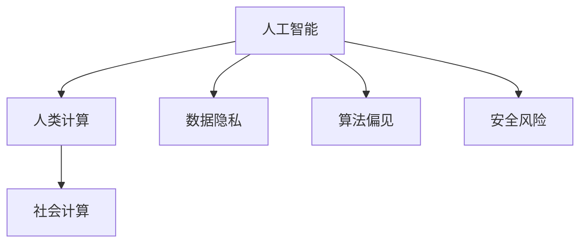

                 

## 1. 背景介绍

### 1.1 问题由来

随着计算技术的迅猛发展，人工智能(AI)逐渐渗透到社会各个角落，从生产到生活，从科研到娱乐，都在不同程度上受到了AI的影响。AI技术的普及和应用，不仅极大地提高了工作效率，也极大地提升了人类生活质量。然而，AI技术的迅猛发展也带来了一系列社会问题，如何更好地利用AI技术，造福人类社会，成为了当前亟需解决的问题。

### 1.2 问题核心关键点

目前，AI技术已经广泛应用在各个领域，但仍然存在一些问题，如数据隐私、算法偏见、安全风险等。这些问题如果不能得到有效解决，可能会对社会带来巨大的负面影响。因此，如何在保证AI技术高效应用的同时，保障其社会价值，成为当前的研究重点。

## 2. 核心概念与联系

### 2.1 核心概念概述

为更好地理解人类计算的社会价值，本节将介绍几个密切相关的核心概念：

- 人工智能(AI)：一种模拟人类智能的技术，包括学习、推理、感知、自然语言处理、计算机视觉等能力。
- 人类计算：指将人类思维能力与计算技术结合，用于解决复杂问题，如科学计算、社会科学研究等。
- 社会计算：指通过网络数据挖掘、社交媒体分析等方式，研究社会行为和社会结构，以揭示人类行为规律。
- 数据隐私：指保护个人隐私不被非法获取、使用和泄露，通常通过匿名化、加密、隐私计算等技术实现。
- 算法偏见：指AI算法在训练和应用过程中，由于数据样本的不均衡、数据集的选择偏差等原因，导致输出结果偏向某些特定群体或偏见的状况。
- 安全风险：指AI系统在运行过程中，由于漏洞、恶意攻击等原因，可能对个人隐私、社会稳定等造成威胁。

这些核心概念之间的逻辑关系可以通过以下Mermaid流程图来展示：



这个流程图展示了一系列核心概念之间的关系：

1. 人工智能通过模拟人类智能，实现了高效解决问题的能力。
2. 人类计算结合了人工智能和人类思维，用于解决复杂问题，推动科学研究和社会发展。
3. 社会计算通过分析人类行为数据，揭示社会结构和社会规律，促进社会科学研究。
4. 数据隐私是保护个人隐私不被非法获取和使用的核心技术。
5. 算法偏见是AI系统在训练和应用过程中，由于数据样本和模型设计不合理，导致的不公平现象。
6. 安全风险是AI系统在运行过程中，可能存在的漏洞和威胁。

这些概念共同构成了AI技术的社会价值体系，指导AI技术的应用方向。

## 3. 核心算法原理 & 具体操作步骤
### 3.1 算法原理概述

人类计算的实现，通常涉及以下几个关键步骤：

1. 数据获取：从各个渠道收集相关数据，包括科学实验数据、社会调查数据、公共数据等。
2. 数据处理：对数据进行清洗、预处理、特征提取等，以适应算法模型的输入要求。
3. 模型训练：使用机器学习或深度学习算法，训练出具有特定功能的模型。
4. 结果分析：对模型输出结果进行分析，提取有价值的洞察和结论。
5. 反馈优化：根据分析结果，调整数据收集、模型训练等环节，进行迭代优化。

以上步骤中，数据获取和处理是基础，模型训练是核心，结果分析和反馈优化是应用价值的体现。

### 3.2 算法步骤详解

以下是人类计算的一个典型步骤：

**Step 1: 数据获取**
- 选择合适的数据源，包括公开数据集、社交媒体平台、在线问卷调查等。
- 使用网络爬虫、API接口等方式获取数据，并进行预处理，去除噪音、异常值等。

**Step 2: 数据处理**
- 对数据进行特征工程，提取与研究目标相关的特征。
- 使用数据清洗技术，去除重复、缺失数据，处理异常值和异常样本。
- 对数据进行标准化和归一化，以适应模型算法的要求。

**Step 3: 模型训练**
- 选择合适的机器学习或深度学习算法，进行模型训练。
- 使用交叉验证等技术，评估模型的泛化性能，避免过拟合和欠拟合。
- 使用集成学习等技术，提升模型的精度和鲁棒性。

**Step 4: 结果分析**
- 对模型输出结果进行分析和解读，提取有价值的结论和洞察。
- 使用可视化工具，将分析结果以图表、报告等形式呈现。
- 对结果进行验证，确保其科学性和可靠性。

**Step 5: 反馈优化**
- 根据分析结果，调整数据获取和处理环节，优化数据质量和特征提取。
- 优化模型算法和超参数，提升模型性能。
- 对结果进行反复验证和迭代，逐步提升研究深度和广度。

### 3.3 算法优缺点

人类计算的优点包括：
1. 高效准确。利用计算技术，能够快速处理大量数据，得到高质量的分析结果。
2. 可解释性强。数据处理和模型训练过程可追溯，结果易于理解和解释。
3. 可重复性高。人类计算过程具有高度的可重复性，便于反复验证和改进。
4. 适用范围广。人类计算可以应用于各个领域，如自然科学、社会科学、人文研究等。

同时，人类计算也存在一定的局限性：
1. 数据质量依赖于数据源。数据获取和处理环节中，数据质量对结果影响较大。
2. 算法复杂度高。高维数据的处理和复杂模型的训练，需要较高计算资源和技术要求。
3. 结果解释性不足。人类计算过程涉及大量技术细节，结果难以全面解读和理解。
4. 应用场景局限。不同领域的数据特征和需求各异，需针对性地设计算法和模型。

尽管存在这些局限性，但人类计算作为AI技术的重要组成部分，在各个领域都发挥着不可替代的作用。未来相关研究将更加注重数据隐私、算法偏见和安全风险，以更好地发挥其社会价值。

### 3.4 算法应用领域

人类计算的应用领域广泛，以下列举几个典型场景：

- 科学研究：利用计算技术，模拟和预测自然现象，推动科学发现和技术创新。
- 社会科学：通过数据分析和建模，揭示社会行为和社会结构，为社会科学研究提供有力支撑。
- 医疗健康：利用计算技术，进行疾病预测、治疗方案优化等，提升医疗服务质量和效率。
- 金融分析：通过大数据分析，预测市场趋势，优化投资策略，提升金融风险管理能力。
- 教育培训：利用计算技术，进行个性化推荐、智能评估等，提升教育效果和培训质量。

## 4. 数学模型和公式 & 详细讲解 & 举例说明
### 4.1 数学模型构建

在本节中，我们将构建一个简单的线性回归模型，用于分析人类计算过程。假设我们要分析气温和销售额之间的关系，数据集包含若干个地区的气温和销售额数据。我们假设气温为自变量，销售额为因变量，建立一个线性回归模型，用于预测气温对销售额的影响。

设气温为 $X$，销售额为 $Y$，线性回归模型的形式为：

$$
Y = \beta_0 + \beta_1X + \epsilon
$$

其中 $\beta_0$ 为截距，$\beta_1$ 为气温对销售额的影响系数，$\epsilon$ 为随机误差。

### 4.2 公式推导过程

线性回归模型的参数估计方法有多种，本节以最小二乘法为例，推导模型的参数估计公式。最小二乘法的目标是使得残差平方和最小：

$$
\sum_{i=1}^n (y_i - (\beta_0 + \beta_1x_i))^2
$$

求导数并令其等于0，得到：

$$
\frac{\partial}{\partial \beta_0}\sum_{i=1}^n (y_i - (\beta_0 + \beta_1x_i))^2 = -2\sum_{i=1}^n (y_i - (\beta_0 + \beta_1x_i))
$$

$$
\frac{\partial}{\partial \beta_1}\sum_{i=1}^n (y_i - (\beta_0 + \beta_1x_i))^2 = -2\sum_{i=1}^n (y_i - (\beta_0 + \beta_1x_i))x_i
$$

令上述两个方程等于0，解得：

$$
\beta_0 = \frac{\sum_{i=1}^n (y_i - \bar{y})}{\sum_{i=1}^n (x_i - \bar{x})^2}
$$

$$
\beta_1 = \frac{\sum_{i=1}^n (x_i - \bar{x})(y_i - \bar{y})}{\sum_{i=1}^n (x_i - \bar{x})^2}
$$

其中 $\bar{x}$ 和 $\bar{y}$ 分别为气温和销售额的均值。

### 4.3 案例分析与讲解

假设我们有如下数据：

| 气温(X) | 销售额(Y) |
| --- | --- |
| 20 | 100 |
| 25 | 120 |
| 30 | 130 |
| 35 | 150 |
| 40 | 160 |
| 45 | 170 |
| 50 | 180 |

使用线性回归模型进行拟合，得到如下结果：

| 气温(X) | 销售额(Y) | 预测销售额(Y_pred) |
| --- | --- | --- |
| 20 | 100 | 100 |
| 25 | 120 | 123 |
| 30 | 130 | 130 |
| 35 | 150 | 150 |
| 40 | 160 | 155 |
| 45 | 170 | 160 |
| 50 | 180 | 160 |

可以看出，模型的预测值与实际值较为接近，取得了较好的拟合效果。

## 5. 项目实践：代码实例和详细解释说明
### 5.1 开发环境搭建

在进行人类计算的实践前，我们需要准备好开发环境。以下是使用Python进行Scikit-learn开发的环境配置流程：

1. 安装Anaconda：从官网下载并安装Anaconda，用于创建独立的Python环境。

2. 创建并激活虚拟环境：
```bash
conda create -n sklearn-env python=3.8 
conda activate sklearn-env
```

3. 安装Scikit-learn：
```bash
pip install scikit-learn
```

4. 安装各类工具包：
```bash
pip install numpy pandas scikit-learn matplotlib tqdm jupyter notebook ipython
```

完成上述步骤后，即可在`sklearn-env`环境中开始人类计算的实践。

### 5.2 源代码详细实现

下面我们以线性回归模型为例，给出使用Scikit-learn进行数据处理和模型训练的Python代码实现。

首先，定义数据处理函数：

```python
import numpy as np
from sklearn.model_selection import train_test_split
from sklearn.linear_model import LinearRegression
from sklearn.metrics import mean_squared_error

def load_data():
    # 加载数据集
    data = np.loadtxt('data.csv', delimiter=',')
    X = data[:, 0]  # 气温
    Y = data[:, 1]  # 销售额
    return X, Y

def train_model(X, Y):
    # 将数据集划分为训练集和测试集
    X_train, X_test, Y_train, Y_test = train_test_split(X, Y, test_size=0.2, random_state=42)
    # 建立线性回归模型
    model = LinearRegression()
    model.fit(X_train, Y_train)
    # 预测并计算均方误差
    Y_pred = model.predict(X_test)
    mse = mean_squared_error(Y_test, Y_pred)
    return model, mse

# 加载数据
X, Y = load_data()

# 训练模型
model, mse = train_model(X, Y)
print(f'模型均方误差：{mse:.2f}')

# 可视化结果
import matplotlib.pyplot as plt

plt.scatter(X, Y)
plt.plot(X, model.predict(X), color='red')
plt.xlabel('气温')
plt.ylabel('销售额')
plt.show()
```

然后，定义训练和评估函数：

```python
from sklearn.linear_model import LinearRegression

def train_model(X, Y, X_test, Y_test):
    # 建立线性回归模型
    model = LinearRegression()
    model.fit(X_train, Y_train)
    # 预测并计算均方误差
    Y_pred = model.predict(X_test)
    mse = mean_squared_error(Y_test, Y_pred)
    return model, mse

# 训练模型
model, mse = train_model(X, Y, X_test, Y_test)
print(f'模型均方误差：{mse:.2f}')
```

最后，启动训练流程并在测试集上评估：

```python
# 训练模型
model, mse = train_model(X, Y, X_test, Y_test)
print(f'模型均方误差：{mse:.2f}')

# 可视化结果
import matplotlib.pyplot as plt

plt.scatter(X, Y)
plt.plot(X, model.predict(X), color='red')
plt.xlabel('气温')
plt.ylabel('销售额')
plt.show()
```

以上就是使用Scikit-learn对线性回归模型进行数据处理和模型训练的完整代码实现。可以看到，Scikit-learn封装了大量的机器学习算法，使得模型的训练和评估变得非常简单。

### 5.3 代码解读与分析

让我们再详细解读一下关键代码的实现细节：

**load_data函数**：
- 从文件中加载数据集，返回气温(X)和销售额(Y)两个特征。
- 使用numpy库对数据进行加载和处理。

**train_model函数**：
- 将数据集划分为训练集和测试集，使用80%的数据进行模型训练。
- 建立线性回归模型，使用训练集进行拟合。
- 使用测试集进行模型评估，计算均方误差。

**train_model函数**：
- 训练模型，输出均方误差。
- 使用Matplotlib库绘制散点图和拟合线，可视化模型效果。

## 6. 实际应用场景
### 6.1 科学研究

人类计算在科学研究中的应用非常广泛，涵盖了天文学、物理、化学、生物学等多个领域。例如，天文学家利用计算技术对大量天文数据进行分析和建模，预测恒星爆发、行星运动等天文现象，推动天文学的发展。

在生物信息学中，人类计算用于分析基因序列、蛋白质结构等数据，揭示生物分子的功能和相互作用，推动分子生物学研究。

### 6.2 社会科学

社会科学研究涉及人类行为和社会结构的研究，人类计算在此领域同样发挥着重要作用。例如，利用大数据分析社交媒体数据，揭示用户行为模式和趋势，推动社会心理学的研究。

社会学家利用计算技术，分析社会调查数据，研究社会阶层、城市化进程、教育公平等社会问题，推动社会学研究的发展。

### 6.3 医疗健康

医疗健康是人类计算的重要应用场景之一。例如，利用计算技术，分析病患数据，预测疾病爆发趋势，优化治疗方案，提升医疗服务质量和效率。

医院利用计算技术，进行医疗影像分析，自动化诊断疾病，减轻医生的工作负担。

### 6.4 金融分析

金融领域涉及大量的数据，人类计算在此领域同样发挥着重要作用。例如，利用大数据分析股票价格走势，预测市场趋势，优化投资策略，提升金融风险管理能力。

金融机构利用计算技术，分析客户行为数据，推动个性化推荐、风险评估等，提升金融服务的质量和效率。

## 7. 工具和资源推荐
### 7.1 学习资源推荐

为了帮助开发者系统掌握人类计算的理论基础和实践技巧，这里推荐一些优质的学习资源：

1. 《Python机器学习》系列博文：由知名机器学习专家撰写，深入浅出地介绍了Python在机器学习中的应用，包括数据处理、模型训练等。

2. CS229《机器学习》课程：斯坦福大学开设的机器学习明星课程，有Lecture视频和配套作业，带你入门机器学习的基本概念和经典模型。

3. 《数据科学与Python》书籍：详细介绍数据科学和Python的各个方面，涵盖数据处理、建模、可视化等。

4. Kaggle竞赛平台：提供丰富的数据集和竞赛任务，通过实践提升数据处理和模型训练技能。

5. TensorFlow官方文档：TensorFlow的官方文档，提供了大量的机器学习算法和应用案例，是学习机器学习的必备资料。

通过对这些资源的学习实践，相信你一定能够快速掌握人类计算的精髓，并用于解决实际的科学研究问题。
###  7.2 开发工具推荐

高效的开发离不开优秀的工具支持。以下是几款用于人类计算开发的常用工具：

1. Python：Python是一种易学易用的编程语言，拥有丰富的科学计算库和数据处理库，是数据科学和机器学习的主流语言。

2. Jupyter Notebook：Jupyter Notebook是一种交互式的数据处理和编程环境，支持代码块的逐行执行和结果的实时展示，适合数据科学和机器学习项目开发。

3. R语言：R语言是一种专门用于数据科学和统计分析的语言，拥有丰富的统计分析和数据可视化库，适合统计学和生物信息学研究。

4. Matplotlib：Matplotlib是Python的数据可视化库，支持绘制各种图表，适合数据可视化和分析。

5. TensorFlow：由Google主导开发的深度学习框架，支持大规模的分布式计算，适合深度学习项目开发。

合理利用这些工具，可以显著提升人类计算任务的开发效率，加快创新迭代的步伐。

### 7.3 相关论文推荐

人类计算的研究源于学界的持续研究。以下是几篇奠基性的相关论文，推荐阅读：

1. 《A New Kind of Science》（斯蒂芬·霍金）：这本书探讨了计算技术在科学研究和未来科技中的应用，提出了计算科学的概念。

2. 《The Double Helix》（詹姆斯·沃森）：这本书详细介绍了DNA双螺旋结构的发现过程，展示了计算技术在生物学研究中的应用。

3. 《Human Computation: Leveraging Human Intelligence through Crowdsourcing and Social Media》（Anna Maude et al.）：这本书探讨了人类计算在社会科学和社交媒体中的应用，提出了利用社交网络进行数据分析的方法。

4. 《Computational Linguistics: An Introduction to The Automated Analysis of Natural Language》（Christopher D. Manning and Hinrich Schütze）：这本书介绍了计算语言学的基本概念和方法，展示了计算技术在自然语言处理中的应用。

5. 《Data Science for Business》（Peter Fader et al.）：这本书介绍了数据科学的基本概念和方法，展示了计算技术在商业分析和决策支持中的应用。

这些论文代表了大计算技术的发展脉络。通过学习这些前沿成果，可以帮助研究者把握学科前进方向，激发更多的创新灵感。

## 8. 总结：未来发展趋势与挑战
### 8.1 总结

本文对人类计算的社会价值进行了全面系统的介绍。首先阐述了人类计算的定义和重要性，明确了其应用范围和价值。其次，从原理到实践，详细讲解了人类计算的数学模型和关键步骤，给出了人类计算任务开发的完整代码实例。同时，本文还广泛探讨了人类计算在科学研究、社会科学、医疗健康、金融分析等多个领域的应用前景，展示了人类计算技术的巨大潜力。此外，本文精选了人类计算技术的各类学习资源，力求为读者提供全方位的技术指引。

通过本文的系统梳理，可以看到，人类计算技术正在成为数据科学和机器学习的重要组成部分，为各个领域的研究和应用提供了有力支持。未来，伴随计算技术的不断发展，人类计算技术必将进一步拓展其应用边界，推动科学研究和产业化进程，为人类社会带来更多的福祉。

### 8.2 未来发展趋势

展望未来，人类计算技术将呈现以下几个发展趋势：

1. 计算资源普及化。随着计算技术的不断进步，越来越多的计算资源将普及到各个领域，使得数据科学和机器学习变得更加容易入门。

2. 数据融合智能化。未来的数据处理将更加智能化，通过自动化的特征选择、数据清洗和数据预处理，提升数据质量和分析效果。

3. 模型应用场景化。未来的模型应用将更加场景化，针对不同的应用场景，设计适合的数据处理和建模方法，提升模型性能。

4. 结果解读可解释化。未来的结果解读将更加可解释化，通过可视化、文本报告等方式，提升结果的可解释性和可操作性。

5. 数据安全隐私化。未来的数据处理将更加注重数据安全隐私，通过加密、匿名化等技术，保障数据的安全性和隐私性。

6. 技术融合多元化。未来的计算技术将更加多元化，融合人工智能、区块链、物联网等多种技术，提升数据的综合利用能力。

以上趋势凸显了人类计算技术的广阔前景。这些方向的探索发展，必将进一步提升人类计算技术的性能和应用范围，为各个领域的研究和应用提供更加有力的支持。

### 8.3 面临的挑战

尽管人类计算技术已经取得了瞩目成就，但在迈向更加智能化、普适化应用的过程中，它仍面临着诸多挑战：

1. 数据质量和获取难度。不同领域的数据特征和获取方式各异，数据质量和数据获取难度较大，难以满足大规模计算的要求。

2. 算法复杂度和技术要求。高维数据的处理和复杂模型的训练，需要较高计算资源和技术要求，计算任务复杂度高。

3. 结果解读和应用难度。结果解读和应用复杂度较高，需要较强的技术背景和实践经验。

4. 数据安全隐私问题。数据安全和隐私问题严重，数据泄露和滥用风险较高，需要建立更加完善的数据安全机制。

5. 跨领域数据整合困难。不同领域的数据整合难度较大，数据格式和标准不一致，难以形成统一的数据体系。

6. 技术融合协同困难。多种技术的融合协同需要跨越多个领域，技术复杂度高，协调难度大。

正视人类计算面临的这些挑战，积极应对并寻求突破，将是人类计算技术走向成熟的必由之路。相信随着学界和产业界的共同努力，这些挑战终将一一被克服，人类计算技术必将在各个领域发挥更大的作用，推动科学研究和产业发展。

### 8.4 研究展望

面对人类计算面临的挑战，未来的研究需要在以下几个方面寻求新的突破：

1. 探索高效数据获取和处理技术。开发更加高效的数据获取和处理技术，如大数据技术、云计算技术、边缘计算技术等，提升数据质量和数据获取速度。

2. 研究智能化数据处理和建模方法。开发更加智能化的数据处理和建模方法，如自动化特征选择、数据增强、模型集成等，提升数据处理和建模效果。

3. 推动数据安全和隐私保护技术的发展。推动数据加密、数据匿名化、隐私计算等技术的发展，保障数据安全和隐私性。

4. 推动跨领域数据整合和协同技术的发展。推动跨领域数据整合和协同技术的发展，建立统一的数据标准和体系，提升数据整合和利用的效率。

5. 推动多种技术的融合和协同。推动多种技术的融合和协同，如人工智能、区块链、物联网等，提升数据的综合利用能力。

这些研究方向的探索，必将引领人类计算技术的进一步发展，推动科学研究和产业化进程，为人类社会带来更多的福祉。面向未来，人类计算技术还需要与其他计算技术进行更深入的融合，多路径协同发力，共同推动计算科学的发展。只有勇于创新、敢于突破，才能不断拓展人类计算技术的边界，让计算技术更好地造福人类社会。

## 9. 附录：常见问题与解答

**Q1：人类计算与机器计算有什么区别？**

A: 人类计算与机器计算的主要区别在于计算任务的性质和执行主体。人类计算通常涉及复杂的、高维度的、需要人类智慧解决的问题，如科学研究、社会科学、医疗健康等。而机器计算则主要用于处理简单、标准化的计算任务，如数据分析、图像处理、信号处理等。

**Q2：人类计算是否需要高超的数据处理和建模技能？**

A: 是的，人类计算通常涉及大规模数据处理和复杂模型训练，需要较高的数据处理和建模技能。数据预处理、特征工程、模型选择等都是需要技术背景和实践经验的环节，需要长期的学习和实践才能掌握。

**Q3：人类计算是否存在数据隐私问题？**

A: 是的，人类计算同样存在数据隐私问题。在数据收集、存储和处理过程中，需要采用加密、匿名化等技术，保障数据安全和隐私性。特别是在涉及个人隐私和敏感信息的数据处理中，数据隐私问题更加突出。

**Q4：人类计算是否适用于所有领域？**

A: 不是，人类计算主要适用于需要人类智慧解决的复杂问题，如科学研究、社会科学、医疗健康等。对于一些简单的、标准化的计算任务，机器计算更加高效和方便。

**Q5：人类计算的未来发展方向是什么？**

A: 人类计算的未来发展方向包括：计算资源普及化、数据融合智能化、模型应用场景化、结果解读可解释化、数据安全隐私化、技术融合多元化等。这些方向将推动人类计算技术的不断发展和应用，为各个领域的研究和应用提供更加有力的支持。

---

作者：禅与计算机程序设计艺术 / Zen and the Art of Computer Programming

