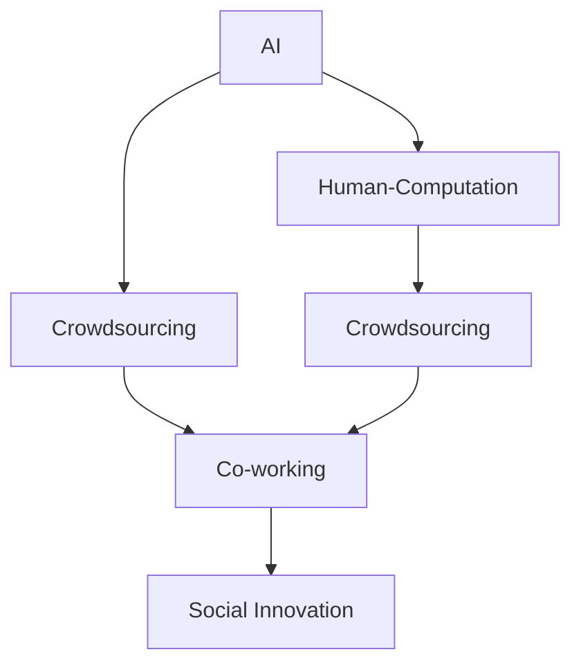

                 

# 赋能个人与社区：人类计算的社会价值

> 关键词：人工智能(AI), 人类计算(Human-Computation), 众包(Crowdsourcing), 协同工作(Co-working), 社会创新(Social Innovation)

## 1. 背景介绍

### 1.1 问题由来
在当今数字化时代，人工智能(AI)技术的迅猛发展正在深刻改变着人类的生产生活方式。从智能助手到自动化系统，AI已深入到我们生活的方方面面。然而，在享受AI带来便利的同时，我们也面临着诸多挑战，如数据隐私、伦理问题、社会不公等。如何更合理、更高效地利用AI，让其更好地服务于人类社会，成为了一个重要的议题。

### 1.2 问题核心关键点
本文聚焦于AI技术在社会创新和个人能力提升中的应用，探讨了如何通过“人类计算”（Human-Computation）来赋能个人和社区，构建一个更智能、更公平、更包容的社会。

人类计算（Human-Computation）是一种将人类与AI结合起来解决复杂问题的计算范式。它利用人类的创造力、逻辑推理和问题解决能力，结合AI的强大计算和数据处理能力，共同解决各种社会问题。

### 1.3 问题研究意义
研究人类计算的社会价值，对于推动AI技术在社会领域的深入应用，提升个人和社区的创新能力，具有重要的理论和实践意义：

1. 提升社会创新力：人类计算将人类与AI的优点有机结合，推动社会各领域的创新发展，包括科学、教育、文化等。
2. 增强个人能力：通过参与人类计算，个人能够获得新的知识、技能和经验，提升自身竞争力和创造力。
3. 促进社会公平：人类计算可以将AI的算法透明化、民主化，确保技术应用的公正性，减少社会不公。
4. 推动普惠应用：利用人类计算，AI技术可以更好地服务于社会弱势群体，缩小数字鸿沟。
5. 构建和谐社会：通过协作与共享，人类计算促进社区之间的互动和合作，增强社会凝聚力。

## 2. 核心概念与联系

### 2.1 核心概念概述

为更好地理解人类计算的社会价值，本节将介绍几个密切相关的核心概念：

- 人工智能(AI)：利用机器学习、深度学习等技术，使机器能够模拟人类智能，进行推理、决策和创新。
- 人类计算(Human-Computation)：结合人类与AI的优势，共同解决问题的一种计算范式。
- 众包(Crowdsourcing)：利用互联网平台，调动大量分散的人类劳动，共同完成复杂任务。
- 协同工作(Co-working)：通过线上和线下协作平台，促进人类与AI的紧密合作，共享知识和经验。
- 社会创新(Social Innovation)：利用技术手段解决社会问题，提升社会福祉和公平性。

这些概念之间的逻辑关系可以通过以下Mermaid流程图来展示：



这个流程图展示的核心概念及其之间的联系：

1. AI技术提供强大的计算能力，是人类计算的基础。
2. 人类计算利用AI与人类共同解决问题，是AI社会应用的重要手段。
3. 众包是利用人类劳动的一种方式，是实现人类计算的重要途径。
4. 协同工作促进了人类与AI的紧密合作，是高效实现人类计算的关键。
5. 社会创新是AI和人类计算共同作用的结果，旨在解决社会问题，提升社会福祉。

这些概念共同构成了人类计算的社会价值体系，是其对社会进步贡献的深刻体现。通过理解这些核心概念，我们可以更好地把握人类计算的原理和应用方向。

## 3. 核心算法原理 & 具体操作步骤
### 3.1 算法原理概述

人类计算的核心算法原理是将AI的计算能力与人类的问题解决能力相结合，共同解决复杂的社会问题。这一过程通常包括以下几个关键步骤：

1. **数据收集与预处理**：收集相关的数据，并进行清洗和处理，以便于后续的分析和计算。
2. **模型设计**：选择合适的AI模型，如深度学习、强化学习等，并设计相应的输入输出接口。
3. **人机协同**：将模型输出作为提示，引导人类进行分析和判断，同时将人类的反馈信息重新输入模型，进行迭代优化。
4. **结果验证与评估**：对最终结果进行验证和评估，确保其有效性和可靠性。
5. **应用部署**：将优化后的模型应用于实际场景中，进行社会创新和公共服务。

### 3.2 算法步骤详解

以下以一个基于人类计算的社会创新项目为例，详细介绍其实现步骤：

**Step 1: 数据收集与预处理**
- 收集与项目相关的数据，如社会问题描述、解决方案、用户反馈等。
- 对数据进行清洗、归一化和标注，以便于模型的训练和推理。
- 将数据集分为训练集和测试集，确保模型在未见过的数据上表现良好。

**Step 2: 模型设计**
- 选择合适的AI模型，如BERT、GPT等，并将其部署在云端或本地服务器上。
- 设计模型的输入输出接口，确保人类计算任务的顺畅进行。
- 对模型进行调参，确定其最优参数和架构。

**Step 3: 人机协同**
- 将收集到的数据输入模型，得到初步的分析和建议。
- 将模型的输出结果展示给人类专家，引导其进行更深入的分析和判断。
- 收集人类专家的反馈，将其重新输入模型进行迭代优化。
- 重复上述步骤，直至得到满意的解决方案。

**Step 4: 结果验证与评估**
- 将优化后的模型应用于实际问题中，进行验证和评估。
- 收集实际效果反馈，检查模型的鲁棒性和泛化能力。
- 根据反馈进行模型优化，确保其在不同情境下的稳定性。

**Step 5: 应用部署**
- 将优化后的模型部署到实际应用场景中，如政府网站、教育平台、医疗服务系统等。
- 进行大规模测试和用户反馈收集，确保模型的可靠性和有效性。
- 根据用户反馈进行持续优化，不断提升模型性能和用户体验。

### 3.3 算法优缺点

基于人类计算的社会创新方法具有以下优点：

1. 充分利用人类与AI的优势：结合人类的创造力和逻辑推理能力，AI的强大计算能力，解决复杂社会问题。
2. 提升社会创新能力：通过协作和共享，激发更多创新思维，推动社会各领域的进步。
3. 增强用户体验：将人类计算与具体应用场景结合，提升用户满意度和参与感。

然而，该方法也存在一些局限性：

1. 对技术要求较高：需要具备一定的AI和数据科学知识，对资源和计算能力也有较高要求。
2. 需要大量高质量数据：数据的收集和处理是一个繁琐且成本较高过程，可能影响项目进度。
3. 协调难度较大：需要协调多方面资源，如专家、数据源、技术支持等，可能导致进度滞后。
4. 结果不确定性：人类计算依赖于人类专家的判断，结果可能受主观因素影响较大。
5. 伦理和安全问题：数据隐私和模型透明性需要严格控制，避免误用和滥用。

尽管存在这些局限性，人类计算在社会创新中的应用仍具有广阔的前景，其灵活性和创新性使得其在解决特定问题时具有独特优势。未来，需要进一步研究和优化人类计算方法，提升其实际应用效果。

### 3.4 算法应用领域

基于人类计算的社会创新方法已在多个领域得到应用，展示了其广泛的应用潜力：

- 社会治理：利用人类计算优化城市管理、公共安全、环境监测等，提升政府服务效率和质量。
- 公共健康：在医疗、疾病预测、健康管理等领域，通过协同工作提升健康服务水平和精准度。
- 教育创新：开发基于人类计算的个性化学习平台，提升教学质量和学生参与度。
- 文化保护：利用协同工作平台，记录和保护文化遗产，提升公众对文化遗产的认知和保护意识。
- 环境保护：通过人机协同，优化资源利用和环境保护措施，推动可持续发展。
- 经济发展：利用人类计算优化供应链管理、市场营销、企业决策等，提升企业竞争力和经济效益。

这些应用领域展示了人类计算在解决社会问题中的巨大潜力，为推动社会进步提供了新的方向。

## 4. 数学模型和公式 & 详细讲解  
### 4.1 数学模型构建

在本节中，我们将使用数学语言对人类计算的社会创新过程进行更加严格的刻画。

记人类计算的任务为 $T$，涉及的变量包括：
- 数据集 $D = \{(x_i, y_i)\}_{i=1}^N$，其中 $x_i$ 为输入数据，$y_i$ 为输出标签。
- 模型 $M_{\theta}$，其中 $\theta$ 为模型参数。
- 人类专家的反馈 $F$，用于迭代优化模型。

定义人类计算过程的目标函数为 $L(T, M_{\theta})$，其最小化目标为：

$$
\min_{\theta} L(T, M_{\theta})
$$

其中 $L(T, M_{\theta})$ 为任务 $T$ 在模型 $M_{\theta}$ 上的损失函数，衡量模型的预测结果与真实标签的差异。

### 4.2 公式推导过程

以一个基于人类计算的社会问题解决为例，我们进行以下数学推导：

假设任务 $T$ 的输入数据为 $x$，输出标签为 $y$。模型的预测结果为 $\hat{y} = M_{\theta}(x)$。人类专家的反馈为 $F(\hat{y}, y)$，表示对模型预测结果的修正。

模型在数据集 $D$ 上的损失函数为：

$$
L(D, M_{\theta}) = \frac{1}{N} \sum_{i=1}^N \ell(M_{\theta}(x_i), y_i)
$$

其中 $\ell$ 为损失函数，可以是交叉熵、均方误差等。

通过人类专家的反馈 $F$，模型的预测结果进行修正，得到新的预测结果 $\hat{y}^{'} = M_{\theta}(x) + F(\hat{y}, y)$。

将修正后的预测结果再次输入模型，进行迭代优化，得到最终的预测结果 $\hat{y}^{''}$。

通过这个过程，模型不断吸收人类的知识和智慧，进行迭代优化，最终输出一个更加精准和可靠的解决方案。

### 4.3 案例分析与讲解

假设我们需要开发一个基于人类计算的公共健康监测系统，以提升对传染病的早期预警和防控能力。

**数据集**：
- 收集历史传染病数据，包括病例数量、地理位置、时间等信息。
- 收集专家对数据的分析和判断，包括传播速度、防控措施等。

**模型设计**：
- 选择一个适合的AI模型，如LSTM、RNN等，用于预测传染病的传播趋势。
- 设计输入输出接口，确保数据的顺畅输入和结果的输出。

**人机协同**：
- 将历史数据输入模型，得到初步的预测结果。
- 将预测结果展示给公共卫生专家，引导其进行修正和判断。
- 收集专家的反馈，重新输入模型进行迭代优化。

**结果验证与评估**：
- 将优化后的模型应用于实际问题中，进行验证和评估。
- 收集实际效果反馈，检查模型的鲁棒性和泛化能力。

**应用部署**：
- 将优化后的模型部署到公共健康监测系统中，进行大规模测试和用户反馈收集。
- 根据用户反馈进行持续优化，不断提升模型性能和用户体验。

通过这个过程，我们可以看到，人类计算在公共健康监测中的应用，如何通过人机协同，提升模型的准确性和可靠性，实现社会问题的有效解决。

## 5. 项目实践：代码实例和详细解释说明
### 5.1 开发环境搭建

在进行人类计算项目实践前，我们需要准备好开发环境。以下是使用Python进行PyTorch开发的环境配置流程：

1. 安装Anaconda：从官网下载并安装Anaconda，用于创建独立的Python环境。

2. 创建并激活虚拟环境：
```bash
conda create -n pytorch-env python=3.8 
conda activate pytorch-env
```

3. 安装PyTorch：根据CUDA版本，从官网获取对应的安装命令。例如：
```bash
conda install pytorch torchvision torchaudio cudatoolkit=11.1 -c pytorch -c conda-forge
```

4. 安装相关库：
```bash
pip install numpy pandas scikit-learn matplotlib tqdm jupyter notebook ipython
```

完成上述步骤后，即可在`pytorch-env`环境中开始人类计算实践。

### 5.2 源代码详细实现

这里我们以开发一个基于人类计算的公共健康监测系统为例，给出完整的代码实现。

**数据预处理**

```python
import pandas as pd
from sklearn.model_selection import train_test_split

# 加载数据
data = pd.read_csv('disease_data.csv')

# 数据预处理
# 例如：数据清洗、特征工程、归一化等

# 数据分割
train_data, test_data = train_test_split(data, test_size=0.2, random_state=42)
```

**模型设计**

```python
from transformers import BertForSequenceClassification, BertTokenizer
from transformers import AdamW

# 加载预训练模型和分词器
model = BertForSequenceClassification.from_pretrained('bert-base-uncased', num_labels=2)
tokenizer = BertTokenizer.from_pretrained('bert-base-uncased')

# 定义损失函数和优化器
criterion = nn.CrossEntropyLoss()
optimizer = AdamW(model.parameters(), lr=2e-5)
```

**人机协同**

```python
import random

# 定义人机协同的反馈函数
def human_feedback(preds, labels):
    # 将预测结果和标签展示给专家
    # 引导专家进行修正和判断
    # 收集专家的反馈，重新输入模型进行迭代优化
    pass

# 迭代优化
for epoch in range(num_epochs):
    # 前向传播
    outputs = model(input_ids, labels=labels)
    loss = outputs.loss
    # 反向传播
    optimizer.zero_grad()
    loss.backward()
    optimizer.step()

    # 获取预测结果
    with torch.no_grad():
        preds = model(input_ids)
        human_feedback(preds, labels)

# 测试集评估
preds = model(input_ids)
labels = labels
evaluate(preds, labels)
```

**结果验证与评估**

```python
from sklearn.metrics import accuracy_score, precision_score, recall_score, f1_score

def evaluate(preds, labels):
    # 计算各种指标
    accuracy = accuracy_score(labels, preds)
    precision = precision_score(labels, preds, average='weighted')
    recall = recall_score(labels, preds, average='weighted')
    f1 = f1_score(labels, preds, average='weighted')
    print(f'Accuracy: {accuracy:.2f}\nPrecision: {precision:.2f}\nRecall: {recall:.2f}\nF1 Score: {f1:.2f}')
```

**应用部署**

```python
# 部署模型到实际应用系统中
# 进行大规模测试和用户反馈收集
# 根据用户反馈进行持续优化
pass
```

以上就是基于人类计算的公共健康监测系统的完整代码实现。可以看到，使用PyTorch和Transformers库，我们可以快速搭建一个基于AI的公共健康监测系统，并进行迭代优化和效果评估。

### 5.3 代码解读与分析

让我们再详细解读一下关键代码的实现细节：

**数据预处理**

- 使用Pandas库加载数据，并进行清洗、归一化和特征工程等预处理步骤。
- 使用sklearn的train_test_split函数将数据集分为训练集和测试集。

**模型设计**

- 加载预训练的BERT模型，并定义损失函数和优化器。
- 使用BertTokenizer进行输入数据的预处理，包括分词和编码。

**人机协同**

- 定义一个模拟的反馈函数，用于引导专家进行修正和判断。
- 使用循环结构进行多轮迭代优化，逐步提升模型性能。

**结果验证与评估**

- 使用sklearn库计算模型的准确率、精确率、召回率和F1分数，评估模型性能。
- 根据评估结果进行必要的调整和优化。

**应用部署**

- 将优化后的模型部署到实际应用系统中，进行大规模测试和用户反馈收集。
- 根据用户反馈进行持续优化，不断提升模型性能和用户体验。

可以看到，使用人类计算方法，我们可以在公共健康监测系统中，通过人机协同，不断提升模型的准确性和可靠性，实现对传染病的有效预警和防控。

## 6. 实际应用场景
### 6.1 智能城市治理

人类计算在智能城市治理中的应用，可以显著提升城市管理的智能化水平，提高政府服务的效率和质量。例如：

- 交通管理：通过分析交通流量数据，预测交通拥堵情况，优化交通信号灯控制，减少交通拥堵。
- 环境监测：利用人类计算优化环境监测系统，实时监测空气质量、水质等环境指标，提升公共环境质量。
- 公共安全：在公共安全事件发生时，通过协同工作平台，快速组织救援和物资调配，提升应急响应能力。

### 6.2 环境保护

人类计算在环境保护中的应用，可以通过协同工作，提升环境保护的精准度和效率。例如：

- 资源利用优化：利用人机协同，优化资源利用和环境保护措施，推动可持续发展。
- 生态系统监测：通过分析生态数据，实时监测生态系统变化，提升环境保护的科学性和有效性。
- 公众参与：利用线上协作平台，引导公众参与环境保护，提升公众的环保意识和行动力。

### 6.3 社会治理

人类计算在社会治理中的应用，可以通过协同工作，提升政府服务效率和质量，增强社会凝聚力。例如：

- 公共服务优化：利用人机协同，优化公共服务流程，提高政府服务效率，提升公众满意度。
- 社会问题监测：通过分析社会数据，实时监测社会问题，及时采取应对措施，维护社会稳定。
- 社区建设：利用协作平台，促进社区之间的互动和合作，增强社会凝聚力。

### 6.4 未来应用展望

随着人类计算技术的不断发展，其在社会创新中的应用将更加广泛，前景广阔：

1. 自动化决策：通过自动化算法，实现智能化的决策和优化，提高决策效率和质量。
2. 社会网络分析：利用人类计算分析社会网络结构，优化社会互动和资源分配。
3. 虚拟现实与增强现实：结合VR/AR技术，提升人机协同的互动性和沉浸感，创造新的社会应用场景。
4. 数据治理：利用人类计算优化数据治理，提升数据质量和安全性，保护数据隐私。
5. 政策制定：通过人机协同，优化政策制定过程，提高政策的科学性和公正性。
6. 知识管理：利用人类计算，优化知识管理流程，提升组织知识和创新能力。

这些应用领域展示了人类计算在社会创新中的巨大潜力，为推动社会进步提供了新的方向。

## 7. 工具和资源推荐
### 7.1 学习资源推荐

为了帮助开发者系统掌握人类计算的理论基础和实践技巧，这里推荐一些优质的学习资源：

1. 《Human-Computation》系列博文：由大计算技术专家撰写，深入浅出地介绍了人类计算的基本概念和核心算法。
2. CS223《人工智能与机器学习》课程：斯坦福大学开设的AI与机器学习课程，涵盖了人类计算的基本原理和应用实例。
3. 《Human-Computation in Social Innovation》书籍：介绍了人类计算在社会创新中的各种应用案例和成功经验。
4. HuggingFace官方文档：提供了大量预训练模型和完整的微调样例代码，是快速上手实践的最佳资源。
5. CLUE开源项目：提供了丰富的中文NLP数据集和基于人类计算的baseline模型，助力中文NLP技术发展。

通过对这些资源的学习实践，相信你一定能够快速掌握人类计算的精髓，并用于解决实际的NLP问题。

### 7.2 开发工具推荐

高效的开发离不开优秀的工具支持。以下是几款用于人类计算开发常用的工具：

1. PyTorch：基于Python的开源深度学习框架，灵活动态的计算图，适合快速迭代研究。
2. TensorFlow：由Google主导开发的开源深度学习框架，生产部署方便，适合大规模工程应用。
3. HuggingFace Transformers库：提供了丰富的预训练语言模型，支持PyTorch和TensorFlow，是进行人类计算任务开发的利器。
4. Weights & Biases：模型训练的实验跟踪工具，可以记录和可视化模型训练过程中的各项指标，方便对比和调优。
5. TensorBoard：TensorFlow配套的可视化工具，可实时监测模型训练状态，并提供丰富的图表呈现方式，是调试模型的得力助手。

合理利用这些工具，可以显著提升人类计算任务的开发效率，加快创新迭代的步伐。

### 7.3 相关论文推荐

人类计算技术的发展源于学界的持续研究。以下是几篇奠基性的相关论文，推荐阅读：

1. Human-Computation in Social Innovation：介绍了人类计算在社会创新中的应用案例和成功经验。
2. Crowdsourcing to the Rescue：研究了众包技术在解决大规模社会问题中的应用效果和潜力。
3. Collaborative Filtering in Social Networks：探讨了协同过滤算法在提升社交网络推荐系统效果中的应用。
4. Knowledge-Driven Human-Computer Interaction：研究了人机交互中知识管理的机制和模型。
5. Data Mining and Statistical Learning in Social Media：探讨了社交媒体数据挖掘和统计学习在社会问题解决中的应用。

这些论文代表了大计算技术的发展脉络。通过学习这些前沿成果，可以帮助研究者把握学科前进方向，激发更多的创新灵感。

## 8. 总结：未来发展趋势与挑战

### 8.1 总结

本文对基于人类计算的社会创新方法进行了全面系统的介绍。首先阐述了人类计算的基本概念和应用意义，明确了其在社会进步中的独特价值。其次，从原理到实践，详细讲解了人类计算的基本算法和核心步骤，给出了人类计算任务开发的完整代码实例。同时，本文还广泛探讨了人类计算方法在智能城市治理、环境保护、社会治理等多个领域的应用前景，展示了其广阔的前景。

通过本文的系统梳理，可以看到，基于人类计算的社会创新方法正在成为推动社会进步的重要手段，其灵活性和创新性使得其在解决特定问题时具有独特优势。未来，随着技术的发展和应用的深化，人类计算必将在更多领域发挥作用，为构建更智能、更公平、更包容的社会做出更大贡献。

### 8.2 未来发展趋势

展望未来，人类计算的社会创新方法将呈现以下几个发展趋势：

1. 自动化程度提升：随着自动化算法的发展，人类计算任务将更加智能和高效，减轻人类的工作负担。
2. 数据融合技术进步：利用更先进的数据融合技术，整合更多数据源，提升人类计算的准确性和可靠性。
3. 协同工作平台优化：利用更先进的协同工作平台，提高人机协同的效率和互动性，增强团队的创造力。
4. 人工智能与人类计算结合：利用AI技术提升人类计算任务的精度和效率，实现人机协同的智能优化。
5. 多模态信息整合：利用多模态信息融合技术，提升人类计算任务的综合性和全面性。
6. 知识图谱应用：利用知识图谱技术，优化知识管理和智能推理，提升人类计算任务的效果。

这些趋势凸显了人类计算技术的广阔前景，其灵活性和创新性使得其在解决特定问题时具有独特优势。这些方向的探索发展，必将进一步提升人类计算的社会创新能力，为推动社会进步提供新的动力。

### 8.3 面临的挑战

尽管人类计算的社会创新方法已经取得了显著成果，但在迈向更加智能化、普适化应用的过程中，仍面临诸多挑战：

1. 技术复杂度高：人类计算需要具备一定的AI和数据科学知识，对资源和计算能力有较高要求。
2. 数据获取困难：高质量数据的获取和处理是一个繁琐且成本较高过程，可能影响项目进度。
3. 数据隐私问题：人类计算涉及大量个人和公共数据，需要严格控制数据隐私，防止数据泄露和滥用。
4. 协同难度较大：需要协调多方面资源，如专家、数据源、技术支持等，可能导致进度滞后。
5. 结果不确定性：人类计算依赖于人类专家的判断，结果可能受主观因素影响较大。
6. 伦理和安全问题：数据隐私和模型透明性需要严格控制，避免误用和滥用。

尽管存在这些挑战，人类计算在社会创新中的应用仍具有广阔的前景，其灵活性和创新性使得其在解决特定问题时具有独特优势。未来，需要进一步研究和优化人类计算方法，提升其实际应用效果。

### 8.4 研究展望

面对人类计算面临的挑战，未来的研究需要在以下几个方面寻求新的突破：

1. 探索更高效的数据收集和处理方法：利用先进的数据融合技术和数据治理手段，提升数据质量和处理效率。
2. 研究更智能的协同工作机制：利用先进的人机交互技术，提升协同工作的效率和互动性。
3. 开发更高效的自动化算法：利用先进的自动化算法，提升人类计算任务的精度和效率。
4. 引入更多先验知识：将符号化的先验知识，如知识图谱、逻辑规则等，与神经网络模型进行巧妙融合，引导人类计算任务的学习。
5. 引入因果分析和博弈论工具：将因果分析方法引入人类计算任务，识别出任务决策的关键特征，增强输出解释的因果性和逻辑性。

这些研究方向将引领人类计算技术迈向更高的台阶，为构建智能、公平、包容的社会提供新的方向。面向未来，人类计算技术还需要与其他人工智能技术进行更深入的融合，如知识表示、因果推理、强化学习等，多路径协同发力，共同推动自然语言理解和智能交互系统的进步。只有勇于创新、敢于突破，才能不断拓展人类计算的边界，让智能技术更好地造福人类社会。

## 9. 附录：常见问题与解答

**Q1：人类计算的优点和缺点有哪些？**

A: 人类计算的优点包括：
1. 充分利用人类与AI的优势：结合人类的创造力和逻辑推理能力，AI的强大计算能力，解决复杂社会问题。
2. 提升社会创新能力：通过协作和共享，激发更多创新思维，推动社会各领域的进步。
3. 增强用户体验：将人类计算与具体应用场景结合，提升用户满意度和参与感。

其缺点包括：
1. 技术复杂度高：需要具备一定的AI和数据科学知识，对资源和计算能力有较高要求。
2. 数据获取困难：高质量数据的获取和处理是一个繁琐且成本较高过程，可能影响项目进度。
3. 数据隐私问题：人类计算涉及大量个人和公共数据，需要严格控制数据隐私，防止数据泄露和滥用。
4. 协同难度较大：需要协调多方面资源，如专家、数据源、技术支持等，可能导致进度滞后。
5. 结果不确定性：人类计算依赖于人类专家的判断，结果可能受主观因素影响较大。
6. 伦理和安全问题：数据隐私和模型透明性需要严格控制，避免误用和滥用。

尽管存在这些局限性，人类计算在社会创新中的应用仍具有广阔的前景，其灵活性和创新性使得其在解决特定问题时具有独特优势。未来，需要进一步研究和优化人类计算方法，提升其实际应用效果。

**Q2：如何提高人类计算任务的效率？**

A: 提高人类计算任务的效率，可以从以下几个方面入手：
1. 自动化算法：利用先进的自动化算法，提升人类计算任务的精度和效率。
2. 数据融合技术：利用更先进的数据融合技术，整合更多数据源，提升人类计算的准确性和可靠性。
3. 协同工作平台：利用更先进的协同工作平台，提高人机协同的效率和互动性，增强团队的创造力。
4. 多模态信息整合：利用多模态信息融合技术，提升人类计算任务的综合性和全面性。
5. 知识图谱应用：利用知识图谱技术，优化知识管理和智能推理，提升人类计算任务的效果。
6. 任务分解与并行化：将人类计算任务分解为多个子任务，利用并行化技术提升任务执行效率。

通过这些方法，可以显著提高人类计算任务的效率，提升任务完成的质量和速度。

**Q3：人类计算如何应用到具体领域？**

A: 人类计算可以应用到多个具体领域，如智能城市治理、环境保护、社会治理等。以智能城市治理为例，通过分析交通流量数据，预测交通拥堵情况，优化交通信号灯控制，减少交通拥堵。利用人机协同，优化环境监测系统，实时监测空气质量、水质等环境指标，提升公共环境质量。在公共安全事件发生时，通过协同工作平台，快速组织救援和物资调配，提升应急响应能力。

通过对这些具体领域的探索，我们可以看到，人类计算在解决社会问题中的巨大潜力，为推动社会进步提供了新的方向。

**Q4：人类计算面临的伦理和安全问题如何解决？**

A: 解决人类计算面临的伦理和安全问题，可以从以下几个方面入手：
1. 数据隐私保护：采用先进的数据隐私保护技术，如差分隐私、联邦学习等，确保数据隐私的安全性。
2. 模型透明性：通过可解释的AI技术，提升模型的透明度，确保模型决策的可解释性和可审计性。
3. 伦理导向的评估指标：在模型训练目标中引入伦理导向的评估指标，过滤和惩罚有偏见、有害的输出倾向。
4. 公平性和包容性：在任务设计和模型训练中，引入公平性和包容性原则，确保任务和模型的公正性。
5. 社会监督机制：建立社会监督机制，确保任务的公正性和透明性，避免模型的误用和滥用。

通过这些措施，可以有效缓解人类计算面临的伦理和安全问题，确保技术应用的公正性和安全性。

**Q5：如何利用人类计算解决大规模社会问题？**

A: 利用人类计算解决大规模社会问题，可以从以下几个方面入手：
1. 数据收集与预处理：收集与问题相关的数据，并进行清洗、归一化和标注，以便于后续的分析和计算。
2. 模型设计与选择：选择合适的AI模型，并设计相应的输入输出接口，确保数据的顺畅输入和结果的输出。
3. 人机协同：将模型输出作为提示，引导人类进行分析和判断，同时将人类的反馈信息重新输入模型，进行迭代优化。
4. 结果验证与评估：对最终结果进行验证和评估，确保其有效性和可靠性。
5. 应用部署：将优化后的模型应用于实际问题中，进行大规模测试和用户反馈收集，根据用户反馈进行持续优化。

通过这个过程，我们可以看到，人类计算在解决大规模社会问题中的巨大潜力，为推动社会进步提供了新的方向。

---

作者：禅与计算机程序设计艺术 / Zen and the Art of Computer Programming

