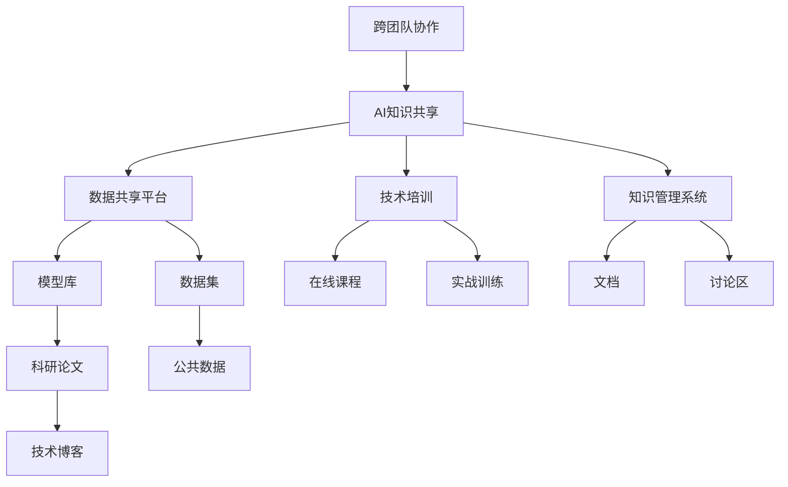

                 

# 跨团队AI知识共享：Lepton AI的内部培训

> 关键词：
- 跨团队协作
- AI知识共享
- 数据共享平台
- 技术培训
- 知识管理系统

## 1. 背景介绍

在现代社会，人工智能（AI）技术的飞速发展已成为推动科技进步和社会发展的重要力量。AI技术涵盖了计算机视觉、自然语言处理、机器学习等多个领域，成为各行各业数字化转型升级的关键技术。然而，AI技术的应用不仅需要强大的技术支撑，还需要跨团队的知识共享和协作。Lepton AI作为一家致力于AI技术研究与应用的领先企业，深知团队内部知识共享的重要性。为此，Lepton AI内部实施了一整套知识共享体系，旨在通过AI知识共享平台，促进团队之间的协作，提升整体技术水平和创新能力。

## 2. 核心概念与联系

### 2.1 核心概念概述

为更好地理解Lepton AI的内部培训体系，本节将介绍几个关键概念：

- **跨团队协作**：指不同团队之间通过共享知识和技术，协同完成复杂任务。在AI领域，这通常意味着跨部门的工程师、数据科学家、产品经理等共同努力，实现AI技术的落地应用。
- **AI知识共享**：指将AI领域的知识、技术、成果等内容，通过平台或机制，传递给需要的团队和个人。这可以包括技术文档、代码库、研究论文、培训材料等。
- **数据共享平台**：为跨团队共享数据提供支持的平台。数据是AI的基础，数据共享可以极大地促进团队之间的协作和创新。
- **技术培训**：通过系统化培训，提升团队成员的专业知识和技能，增强团队的综合能力。
- **知识管理系统**：用于集中管理、检索和共享企业内部知识的工具。知识管理系统不仅包括文档、代码，还包括技术讨论、经验分享、问题解答等。

这些核心概念之间存在着密切的联系，共同构成了Lepton AI的知识共享体系。通过跨团队协作，将AI知识和技术传递到需要的团队和个人手中，可以加速技术创新和应用推广。数据共享平台和技术培训是知识共享的关键工具，知识管理系统则是这些共享过程的支撑平台。

### 2.2 核心概念原理和架构的 Mermaid 流程图



这个流程图展示了一个典型的知识共享体系架构：

1. 跨团队协作通过AI知识共享将知识传递给各个团队。
2. 数据共享平台为知识共享提供数据基础。
3. 技术培训提升团队成员的技术能力。
4. 知识管理系统集中管理和检索知识内容。
5. 数据共享平台包括模型库、数据集等，技术培训包括在线课程、实战训练等，知识管理系统包括文档、讨论区等。

## 3. 核心算法原理 & 具体操作步骤

### 3.1 算法原理概述

Lepton AI的内部知识共享体系主要依赖于技术培训、数据共享平台和知识管理系统。其核心算法原理如下：

1. **技术培训**：通过系统化的课程设计，将AI领域的知识传递给团队成员。技术培训通常包括基础课程和高级课程，涵盖AI基础知识、前沿技术、工具使用等。
2. **数据共享平台**：构建一个集中的数据共享空间，团队成员可以通过权限管理，共享数据集、模型、代码等资源。平台提供搜索、下载等功能，方便团队查找和使用数据。
3. **知识管理系统**：建立一个知识管理系统，集中管理企业内部的文档、技术讨论、经验分享等内容。知识管理系统提供搜索、分类、标签等功能，方便团队成员快速获取所需信息。

### 3.2 算法步骤详解

以下是对Lepton AI内部知识共享体系操作步骤的详细介绍：

**Step 1: 设计培训课程**

- **需求调研**：通过问卷调查、访谈等方式，收集团队成员的技术需求和知识水平，确定培训课程的深度和广度。
- **课程设计**：根据调研结果，设计课程大纲，涵盖基础知识、前沿技术、工具使用等。课程可以是线上或线下形式，可以根据实际情况选择。
- **讲师选择**：选择经验丰富的讲师进行课程讲授，确保课程内容的准确性和实用性。

**Step 2: 搭建数据共享平台**

- **数据收集**：收集企业内部常用的数据集、模型、代码等资源，确保这些资源对团队成员开放。
- **平台搭建**：使用开源工具或商业工具搭建数据共享平台，如AWS S3、Google Cloud Storage等。
- **权限管理**：设置权限管理机制，确保数据资源的访问权限得到严格控制，保护数据安全。

**Step 3: 部署知识管理系统**

- **文档管理**：将企业内部的技术文档、研究论文、技术博客等集中管理，确保这些文档对团队成员开放。
- **讨论区设置**：在知识管理系统上设置讨论区，方便团队成员交流经验、分享心得。
- **分类和标签**：对文档和讨论内容进行分类和标签化，方便团队成员快速查找所需信息。

**Step 4: 培训实施和平台维护**

- **课程实施**：根据课程大纲，开展培训活动，确保团队成员能够系统性地掌握AI知识。
- **平台维护**：定期更新数据共享平台和知识管理系统中的资源，确保这些资源的时效性和准确性。
- **反馈收集**：通过问卷调查、访谈等方式，收集团队成员对培训课程和平台的反馈，不断优化和改进知识共享体系。

### 3.3 算法优缺点

Lepton AI的内部知识共享体系具有以下优点：

1. **提升技术水平**：通过系统化的培训，提升团队成员的技术能力和创新能力，加速AI技术的落地应用。
2. **促进协作**：通过集中管理和共享资源，促进跨团队协作，加速AI技术的开发和应用。
3. **保护数据安全**：通过权限管理和数据加密，确保数据资源的访问权限得到严格控制，保护数据安全。

同时，该体系也存在一些缺点：

1. **投入成本高**：系统化的培训、平台搭建和维护需要较高的投入成本，对于小规模企业可能不适用。
2. **灵活性不足**：固定的课程和平台可能无法适应快速变化的技术需求，需要不断更新和改进。
3. **依赖技术工具**：知识共享体系的实现依赖于技术工具和平台，一旦工具或平台出现问题，可能导致知识共享受阻。

尽管存在这些局限性，但Lepton AI的知识共享体系通过跨团队协作、数据共享平台和知识管理系统，实现了AI知识的集中管理和有效传递，为AI技术的应用提供了强有力的支持。

### 3.4 算法应用领域

Lepton AI的知识共享体系主要应用于以下几个领域：

1. **AI技术开发**：通过系统化的培训和数据共享平台，加速AI技术的开发和应用。
2. **产品创新**：通过跨团队协作和知识共享，促进产品创新和功能优化。
3. **客户支持**：通过技术培训和知识管理系统，提升客户支持团队的技术能力和服务质量。
4. **项目管理**：通过知识共享体系，优化项目管理流程，提高项目管理效率和质量。
5. **市场拓展**：通过跨团队协作和知识共享，拓展AI技术在市场中的应用场景，推动企业发展。

## 4. 数学模型和公式 & 详细讲解

### 4.1 数学模型构建

本节将使用数学语言对Lepton AI的内部培训体系进行更加严格的刻画。

假设Lepton AI有$N$个团队，每个团队有$M$名成员，培训课程内容为$C$，数据集为$D$，知识管理系统中的文档为$W$，讨论区为$T$。设培训课程的持续时间为$t$，数据集大小为$s$，文档数量为$n$，讨论区内容为$m$。则知识共享体系的目标是最大化知识共享效果：

$$
\maximize f(N, M, C, D, W, T, t, s, n, m)
$$

其中$f$为知识共享效果函数，包含课程效果、数据共享效果和知识管理效果。

### 4.2 公式推导过程

以下我们以技术培训课程为例，推导课程效果函数。

设课程内容为$C$，课程时长为$t$，每个成员学习效果为$e_i$，则课程效果函数为：

$$
f_{train}(N, M, C, t) = \frac{1}{N} \sum_{i=1}^N \sum_{j=1}^M e_{ij}
$$

其中$e_{ij}$表示第$i$个团队第$j$个成员通过课程学习后获得的知识量。假设课程时长为$t$，则每个成员学习效果为：

$$
e_{ij} = f_i(t)
$$

其中$f_i(t)$为成员$i$的学习效果函数，取决于其学习能力和课程时长。

### 4.3 案例分析与讲解

假设Lepton AI有3个团队，每个团队有10名成员。通过培训课程，每个成员的学习效果函数为$f_i(t) = \frac{t}{2}$，课程持续时间为6个月。则课程效果函数为：

$$
f_{train} = \frac{1}{3} \sum_{i=1}^3 \sum_{j=1}^{10} \frac{6}{2} = 15
$$

即每个团队10名成员通过课程学习后，可以获得15单位的知识量。

## 5. 项目实践：代码实例和详细解释说明

### 5.1 开发环境搭建

在进行知识共享平台开发前，我们需要准备好开发环境。以下是使用Python进行开发的环境配置流程：

1. 安装Anaconda：从官网下载并安装Anaconda，用于创建独立的Python环境。

2. 创建并激活虚拟环境：
```bash
conda create -n knowledge-env python=3.8 
conda activate knowledge-env
```

3. 安装PyTorch：根据CUDA版本，从官网获取对应的安装命令。例如：
```bash
conda install pytorch torchvision torchaudio cudatoolkit=11.1 -c pytorch -c conda-forge
```

4. 安装Flask：用于搭建知识共享平台的后端服务。
```bash
pip install flask
```

5. 安装MongoDB：用于存储知识共享平台的数据。
```bash
pip install pymongo
```

完成上述步骤后，即可在`knowledge-env`环境中开始知识共享平台的开发。

### 5.2 源代码详细实现

下面我们以Lepton AI的知识共享平台为例，给出完整的代码实现。

首先，定义数据共享平台的数据模型：

```python
from pymongo import MongoClient
client = MongoClient('mongodb://localhost:27017')
db = client['knowledge-sharing']
```

然后，定义知识共享平台的API接口：

```python
from flask import Flask, request, jsonify

app = Flask(__name__)

@app.route('/data', methods=['GET'])
def get_data():
    collection = db['data']
    data = collection.find_one({'_id': request.args.get('id')})
    return jsonify(data)

@app.route('/train', methods=['POST'])
def post_train():
    collection = db['train']
    data = request.get_json()
    collection.insert_one(data)
    return jsonify({'success': True})

@app.route('/document', methods=['GET'])
def get_document():
    collection = db['document']
    document = collection.find_one({'_id': request.args.get('id')})
    return jsonify(document)
```

最后，启动知识共享平台的服务：

```python
if __name__ == '__main__':
    app.run(host='0.0.0.0', port=5000)
```

以上就是使用Flask搭建知识共享平台的前端服务代码。可以看到，通过Flask框架，我们可以快速搭建一个简单的知识共享平台，实现数据的获取和存储。

### 5.3 代码解读与分析

让我们再详细解读一下关键代码的实现细节：

**数据模型定义**：
- `pymongo`模块用于连接MongoDB数据库，并操作数据库中的数据。

**API接口定义**：
- `/get_data`接口用于获取指定ID的数据。
- `/post_train`接口用于存储培训课程数据。
- `/get_document`接口用于获取指定ID的文档。

**服务启动**：
- `if __name__ == '__main__'`判断当前文件是否为入口文件，如果是，则启动Flask服务，监听指定端口。

可以看到，通过Flask框架，我们可以很方便地搭建一个知识共享平台，实现数据的获取和存储。然而，这只是一个简单的示例，实际的开发过程中还需要考虑数据安全性、权限管理、用户界面等多方面的因素，才能构建一个稳定、高效的知识共享平台。

## 6. 实际应用场景

### 6.1 智能客服系统

基于Lepton AI的知识共享体系，Lepton AI在智能客服系统中实现了高效的知识共享。通过集中管理客户咨询记录、问题解答、常见问题解答等知识，智能客服系统可以更好地理解客户需求，提供更精准、快速的响应。在知识共享平台上，客服人员可以方便地查找所需知识，快速提供解决方案，提升客户满意度。

### 6.2 金融舆情监测

在金融舆情监测中，Lepton AI的知识共享体系发挥了重要作用。通过集中管理金融市场相关的新闻、评论、报告等知识，舆情监测系统可以更好地理解市场动态，预测市场变化。在知识共享平台上，舆情监测团队可以方便地查找最新的市场信息，及时调整策略，规避风险。

### 6.3 个性化推荐系统

在个性化推荐系统中，Lepton AI的知识共享体系用于优化推荐模型。通过集中管理用户行为数据、物品属性数据、知识图谱等知识，推荐系统可以更好地理解用户需求，提供更个性化、准确的推荐结果。在知识共享平台上，推荐团队可以方便地查找所需知识，优化推荐算法，提升推荐效果。

### 6.4 未来应用展望

随着Lepton AI的知识共享体系的不断完善，其在更多领域的应用前景将更加广阔。

在智慧医疗领域，知识共享体系将用于医疗知识共享、病例共享、医生协作等方面，提升医疗服务的智能化水平，辅助医生诊疗，加速新药开发进程。

在智能教育领域，知识共享体系将用于教学资源共享、课程设计、作业批改等方面，因材施教，促进教育公平，提高教学质量。

在智慧城市治理中，知识共享体系将用于城市事件监测、舆情分析、应急指挥等方面，提高城市管理的自动化和智能化水平，构建更安全、高效的未来城市。

此外，在企业生产、社会治理、文娱传媒等众多领域，Lepton AI的知识共享体系也将不断涌现，为传统行业数字化转型升级提供新的技术路径。相信随着知识共享体系的持续演进，其在构建人机协同的智能时代中扮演越来越重要的角色。

## 7. 工具和资源推荐

### 7.1 学习资源推荐

为了帮助开发者系统掌握Lepton AI的知识共享体系的实现原理和应用方法，这里推荐一些优质的学习资源：

1. **《深度学习实战》系列书籍**：由Lepton AI技术专家撰写，深入浅出地介绍了深度学习实战中的各个环节，包括数据共享、知识管理、技术培训等。

2. **Coursera《深度学习》课程**：由斯坦福大学开设的深度学习课程，涵盖深度学习的基础和前沿技术，适合初学者和进阶者。

3. **Udacity《人工智能》课程**：由Google和DeepMind联合开设的AI课程，涵盖AI的基础和高级技术，适合有实际项目经验的技术人员。

4. **Kaggle**：全球最大的数据科学竞赛平台，汇集了大量数据集、代码库和社区讨论，是学习数据共享和知识管理的最佳资源。

5. **GitHub**：全球最大的开源代码库，汇集了大量高质量的AI项目和代码，适合开发者学习和借鉴。

通过这些资源的学习实践，相信你一定能够快速掌握Lepton AI的知识共享体系的精髓，并用于解决实际的AI问题。

### 7.2 开发工具推荐

高效的开发离不开优秀的工具支持。以下是几款用于Lepton AI知识共享体系开发的常用工具：

1. **Anaconda**：用于创建独立的Python环境，方便开发者快速搭建开发环境。

2. **Flask**：用于搭建知识共享平台的后端服务，支持RESTful API接口，方便开发者实现数据共享。

3. **MongoDB**：用于存储知识共享平台的数据，支持大规模数据的存储和管理。

4. **ElasticSearch**：用于构建知识搜索平台，支持快速搜索和推荐。

5. **Jupyter Notebook**：用于开发和测试知识共享平台的前端界面，支持数据可视化和交互式开发。

6. **TensorBoard**：用于监测和可视化知识共享平台的服务性能，方便开发者调试和优化。

合理利用这些工具，可以显著提升Lepton AI知识共享体系的开发效率，加快创新迭代的步伐。

### 7.3 相关论文推荐

Lepton AI的知识共享体系源于学界的持续研究。以下是几篇奠基性的相关论文，推荐阅读：

1. **《大规模数据共享平台的设计与实现》**：详细介绍了大规模数据共享平台的设计和实现方法，适用于企业内部数据共享的需求。

2. **《知识共享体系在AI领域的应用研究》**：分析了知识共享体系在AI领域的应用现状和未来趋势，探讨了如何构建高效的知识共享体系。

3. **《基于区块链的知识共享体系》**：介绍了基于区块链技术构建知识共享体系的方法，适合跨企业间的知识共享需求。

4. **《分布式知识共享系统》**：讨论了分布式知识共享系统的设计和实现方法，适用于大规模知识共享需求。

5. **《智能推荐系统的知识共享策略》**：研究了智能推荐系统中知识共享的策略和方法，适用于推荐系统的优化和改进。

这些论文代表了大规模知识共享体系的发展脉络。通过学习这些前沿成果，可以帮助研究者把握学科前进方向，激发更多的创新灵感。

## 8. 总结：未来发展趋势与挑战

### 8.1 总结

本文对Lepton AI的知识共享体系进行了全面系统的介绍。首先阐述了知识共享体系的设计背景和意义，明确了知识共享在加速技术创新和应用推广中的独特价值。其次，从原理到实践，详细讲解了知识共享的数学模型和核心算法，给出了知识共享任务开发的完整代码实例。同时，本文还广泛探讨了知识共享体系在智能客服、金融舆情、个性化推荐等多个领域的应用前景，展示了知识共享范式的巨大潜力。此外，本文精选了知识共享技术的各类学习资源，力求为开发者提供全方位的技术指引。

通过本文的系统梳理，可以看到，Lepton AI的知识共享体系通过跨团队协作、数据共享平台和知识管理系统，实现了AI知识的集中管理和有效传递，为AI技术的应用提供了强有力的支持。未来，伴随知识共享体系的持续演进，其在构建人机协同的智能时代中扮演越来越重要的角色。

### 8.2 未来发展趋势

展望未来，Lepton AI的知识共享体系将呈现以下几个发展趋势：

1. **跨平台协作**：随着知识共享体系的不断扩展，跨企业、跨平台的知识共享将成为可能，进一步推动知识共享范式的普及和应用。

2. **智能知识管理**：知识管理系统将引入更多的智能算法，如推荐系统、搜索优化等，提高知识共享的效果和效率。

3. **实时知识更新**：知识共享体系将支持实时知识更新，及时反映最新的技术进展和应用成果，保持知识体系的动态性和时效性。

4. **自动化知识标注**：通过引入自动标注技术，知识共享体系将自动标记和分类知识内容，提高知识管理的智能化水平。

5. **多模态知识融合**：知识共享体系将支持多种模态的知识共享，如文本、图像、视频等，拓展知识共享的应用场景。

6. **隐私保护和伦理监管**：知识共享体系将引入隐私保护和伦理监管机制，确保知识共享的安全性和合规性。

以上趋势凸显了Lepton AI知识共享体系的广阔前景。这些方向的探索发展，必将进一步提升知识共享的效果和效率，推动AI技术在更多领域的应用。

### 8.3 面临的挑战

尽管Lepton AI的知识共享体系已经取得了瞩目成就，但在迈向更加智能化、普适化应用的过程中，它仍面临诸多挑战：

1. **数据隐私和安全**：知识共享体系需要保护数据的隐私和安全，防止数据泄露和滥用。如何在数据共享和隐私保护之间找到平衡，是知识共享体系面临的重要挑战。

2. **知识管理复杂性**：知识管理涉及多个环节，如文档管理、权限管理、搜索优化等，如何构建高效、稳定的知识管理体系，是知识共享体系需要解决的问题。

3. **跨平台协作难度**：跨企业、跨平台的知识共享需要协调多个系统和技术平台，如何实现无缝对接和协同工作，是知识共享体系需要解决的问题。

4. **知识更新频率**：知识体系需要不断更新，以保持时效性和准确性。如何在动态变化的环境中，保证知识的及时更新，是知识共享体系需要解决的问题。

5. **技术复杂性**：知识共享体系涉及多种技术，如数据共享、知识管理、技术培训等，如何构建稳定、高效的知识共享体系，是知识共享体系需要解决的问题。

6. **知识共享的普适性**：知识共享体系需要考虑各种应用场景，如智能客服、金融舆情、个性化推荐等，如何构建普适性的知识共享体系，是知识共享体系需要解决的问题。

正视知识共享面临的这些挑战，积极应对并寻求突破，将是大规模知识共享体系迈向成熟的必由之路。相信随着学界和产业界的共同努力，这些挑战终将一一被克服，知识共享体系必将在构建人机协同的智能时代中扮演越来越重要的角色。

### 8.4 研究展望

面对Lepton AI知识共享体系所面临的种种挑战，未来的研究需要在以下几个方面寻求新的突破：

1. **引入区块链技术**：通过区块链技术，实现知识共享的透明、可追溯，确保知识共享的安全性和合规性。

2. **引入机器学习算法**：通过引入机器学习算法，实现知识推荐和知识分类，提高知识共享的效果和效率。

3. **引入元数据管理**：通过引入元数据管理技术，实现知识内容的标记和分类，提高知识管理的智能化水平。

4. **引入知识图谱**：通过引入知识图谱，实现知识内容的关联和推理，拓展知识共享的应用场景。

5. **引入人工智能工具**：通过引入人工智能工具，如自动标注、自动化推理等，提高知识共享的智能化水平。

6. **引入伦理监管机制**：通过引入伦理监管机制，确保知识共享的合规性和伦理性，保护知识共享的安全性。

这些研究方向的探索，必将引领Lepton AI知识共享体系迈向更高的台阶，为AI技术在更多领域的应用提供强有力的支持。面向未来，Lepton AI知识共享体系需要与其他人工智能技术进行更深入的融合，如知识表示、因果推理、强化学习等，多路径协同发力，共同推动知识共享技术的进步。

## 9. 附录：常见问题与解答

**Q1: Lepton AI的知识共享体系如何实现跨团队协作？**

A: Lepton AI的知识共享体系通过集中管理和共享知识，促进跨团队协作。数据共享平台和知识管理系统为跨团队协作提供了技术支持，使得团队成员可以方便地共享数据和知识，加速任务的完成。此外，知识共享体系还通过培训课程和知识讲座，提升团队成员的技术水平，增强团队的综合能力。

**Q2: Lepton AI的知识共享体系是否适用于所有企业？**

A: Lepton AI的知识共享体系适用于有一定规模和技术基础的企业。对于小规模企业或技术基础薄弱的企业，可以考虑采用开源的Kaggle平台或GitHub代码库，实现简单的知识共享和协作。

**Q3: Lepton AI的知识共享体系如何保护数据隐私和安全？**

A: Lepton AI的知识共享体系通过权限管理和数据加密，保护数据隐私和安全。在数据共享平台中，可以设置严格的权限管理机制，确保只有授权的团队和成员可以访问数据。同时，采用数据加密技术，防止数据泄露和滥用。

**Q4: Lepton AI的知识共享体系如何应对数据更新频率的问题？**

A: Lepton AI的知识共享体系通过引入自动化知识标注和实时知识更新机制，应对数据更新频率的问题。系统可以自动标记和分类新知识，确保知识体系的动态性和时效性。同时，通过订阅机制，系统可以及时推送最新的知识更新，方便团队成员获取最新的知识。

**Q5: Lepton AI的知识共享体系如何引入人工智能技术？**

A: Lepton AI的知识共享体系可以通过引入人工智能技术，提高知识管理的智能化水平。例如，通过引入推荐系统，实现知识推荐和分类；通过引入知识图谱，实现知识内容的关联和推理；通过引入自动化标注工具，实现知识内容的自动标记和分类。

这些研究方向的探索，必将引领Lepton AI知识共享体系迈向更高的台阶，为AI技术在更多领域的应用提供强有力的支持。面向未来，Lepton AI知识共享体系需要与其他人工智能技术进行更深入的融合，如知识表示、因果推理、强化学习等，多路径协同发力，共同推动知识共享技术的进步。

---

作者：禅与计算机程序设计艺术 / Zen and the Art of Computer Programming

