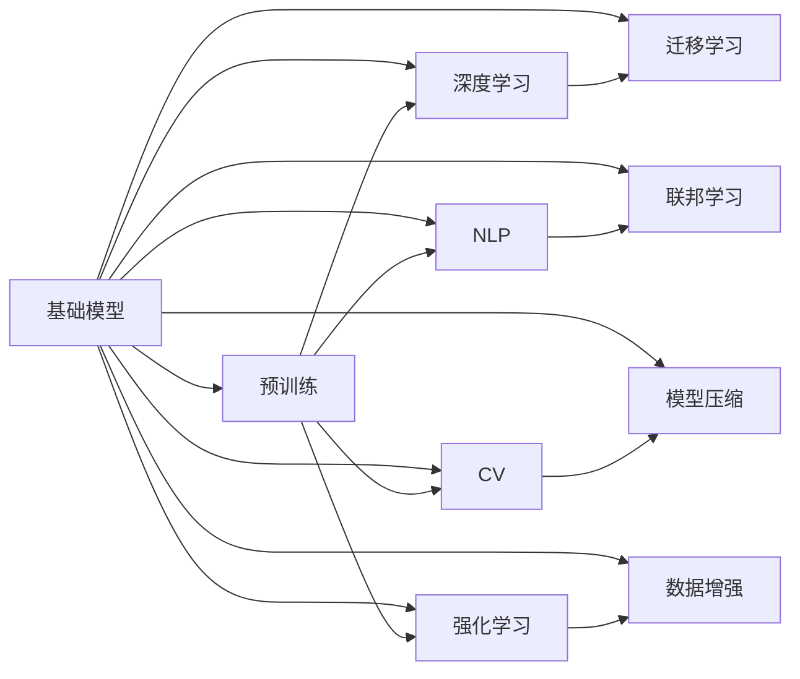

                 

# 跨学科合作与基础模型研究

> 关键词：跨学科合作，基础模型，深度学习，自然语言处理(NLP)，计算机视觉(CV)，强化学习(Reinforcement Learning, RL)，迁移学习(Transfer Learning)，联邦学习(Federated Learning)，模型压缩(Model Compression)，数据增强(Data Augmentation)

## 1. 背景介绍

在当今信息化、智能化的时代背景下，人工智能(AI)技术正在以惊人的速度发展。无论是学术界还是产业界，都高度重视AI技术的研究和应用，并积极探索AI与其他学科的深度融合。跨学科合作作为一种新型科研模式，正在推动AI技术向更广阔、更深远的领域扩展。特别是在基础模型研究领域，跨学科合作的重要性不言而喻。本文将对跨学科合作与基础模型研究的最新进展进行梳理，探讨其背后的原理和应用，并展望未来发展趋势。

## 2. 核心概念与联系

### 2.1 核心概念概述

跨学科合作（Interdisciplinary Collaboration）：指多个不同学科领域的专家共同研究某一问题，从而获得更全面的视角和更深入的理解。通过学科间的交叉融合，可以推动新技术的创新与发展，解决单一学科无法解决的问题。

基础模型（Foundation Model）：指在大规模数据集上预训练，并能在多个任务上保持良好表现的大型AI模型。这些模型通常具有通用性，能够在多种应用场景中发挥作用，是AI技术的重要基石。

深度学习（Deep Learning）：指通过构建多层神经网络，从数据中自动学习特征表示，从而实现复杂模式识别和分析。深度学习是当前AI领域的主流技术。

自然语言处理（Natural Language Processing, NLP）：指利用计算机技术处理、理解、生成自然语言，包括语言模型、文本分类、机器翻译等任务。

计算机视觉（Computer Vision, CV）：指通过计算机技术，使计算机能够像人眼一样观察、理解并解释图像和视频数据。

强化学习（Reinforcement Learning, RL）：指通过试错的方式，让智能体在环境中进行学习，逐步优化决策策略。

迁移学习（Transfer Learning）：指在已有模型基础上，利用已有知识进行新任务的学习，从而提高新任务的性能。

联邦学习（Federated Learning）：指在分布式环境中，各参与方在不共享本地数据的情况下，协同训练全局模型，实现模型知识的聚合。

模型压缩（Model Compression）：指通过优化模型结构、量化模型参数等方式，减小模型规模，提高推理效率。

数据增强（Data Augmentation）：指通过在训练集中添加扰动样本、改变样本属性等手段，扩充训练集，提升模型泛化能力。

这些核心概念构成了基础模型研究的基石，并通过跨学科合作得以进一步发展和应用。

### 2.2 核心概念原理和架构的 Mermaid 流程图



这个流程图展示了基础模型与各个核心概念之间的联系和相互作用，反映了跨学科合作的重要性和必要性。

## 3. 核心算法原理 & 具体操作步骤

### 3.1 算法原理概述

基础模型的核心算法原理主要包括以下几个方面：

- **预训练**：在大规模数据集上，通过自监督学习任务（如掩码语言模型、自编码器等）对模型进行预训练，使其学习到通用表示。
- **微调**：利用特定任务的数据，对预训练模型进行微调，使其能够在该任务上表现优异。
- **迁移学习**：通过已有模型的知识，加速新模型的训练，提高模型在新任务上的表现。
- **联邦学习**：在不共享本地数据的情况下，各参与方协同训练全局模型，保护数据隐私，同时实现模型聚合。

这些原理构成了基础模型研究的基石，并通过跨学科合作得以进一步发展和应用。

### 3.2 算法步骤详解

#### 3.2.1 预训练

预训练是基础模型研究的第一步，通常采用大规模自监督学习任务，如掩码语言模型、自编码器等。以下是预训练的详细步骤：

1. **数据收集**：收集大规模无标签数据集，如英文维基百科、大规模文本语料库等。
2. **模型选择**：选择适合的模型架构，如Transformer、ResNet等。
3. **任务设计**：设计自监督学习任务，如掩码语言模型、自编码器等。
4. **模型训练**：在预训练任务上训练模型，使用大量的GPU/TPU资源，并采用分布式训练策略。
5. **模型保存**：保存预训练模型，供后续微调使用。

#### 3.2.2 微调

微调是在特定任务上对预训练模型进行优化的过程，通常采用有监督学习任务。以下是微调的详细步骤：

1. **任务适配**：根据任务类型，设计合适的输出层和损失函数。
2. **数据准备**：准备任务相关的标注数据集，划分为训练集、验证集和测试集。
3. **模型加载**：加载预训练模型，并根据任务类型微调部分或全部参数。
4. **训练过程**：在训练集上进行有监督学习，使用合适的优化算法（如AdamW、SGD等）进行梯度下降优化。
5. **评估过程**：在验证集上评估模型性能，并根据性能调整学习率、正则化等超参数。
6. **测试过程**：在测试集上评估最终模型性能，对比微调前后的性能提升。

#### 3.2.3 迁移学习

迁移学习是指利用已有模型的知识，加速新模型的训练过程。以下是迁移学习的详细步骤：

1. **模型选择**：选择适合的基础模型，如BERT、GPT等。
2. **任务适配**：根据新任务，在基础模型上设计合适的输出层和损失函数。
3. **数据准备**：准备新任务相关的标注数据集。
4. **模型训练**：在基础模型上进行微调，使用少量的数据进行有监督学习。
5. **模型评估**：在新任务上评估微调后模型的性能，对比微调前后的性能提升。

#### 3.2.4 联邦学习

联邦学习是指在不共享本地数据的情况下，各参与方协同训练全局模型。以下是联邦学习的详细步骤：

1. **数据分布**：各参与方收集本地数据，不共享数据。
2. **模型初始化**：初始化全局模型，并发送给各参与方。
3. **模型更新**：各参与方在本地数据上更新模型参数，并发送更新后的模型参数给全局模型。
4. **模型聚合**：将各参与方发送的更新参数进行聚合，得到新的全局模型。
5. **模型测试**：在全局模型上测试性能，并根据性能调整模型参数。

### 3.3 算法优缺点

基础模型具有以下优点：

- **通用性**：可以在多个任务上保持良好表现，提升任务处理的效率。
- **高效性**：通过预训练和微调，可以显著减少标注数据的需求，提高模型的训练效率。
- **可扩展性**：模型可以在多种硬件平台上进行部署和推理，具有较好的可扩展性。

同时，基础模型也存在以下缺点：

- **资源消耗大**：预训练和微调需要大量的计算资源和时间，不适合在小规模数据集上使用。
- **模型复杂性**：模型参数较多，推理效率较低，需要优化模型结构以提高推理速度。
- **数据隐私风险**：联邦学习等分布式训练方法需要保护参与方的数据隐私，可能面临隐私泄露的风险。

### 3.4 算法应用领域

基础模型在多个领域得到了广泛应用，包括：

- **自然语言处理（NLP）**：如语言模型、文本分类、机器翻译、问答系统等。
- **计算机视觉（CV）**：如图像识别、目标检测、图像生成等。
- **强化学习（RL）**：如游戏AI、机器人控制等。
- **医疗健康**：如医学影像诊断、个性化医疗等。
- **金融科技**：如风险预测、交易策略优化等。
- **智慧城市**：如交通管理、公共安全等。

这些应用领域展示了基础模型的广泛适用性和巨大的应用潜力。

## 4. 数学模型和公式 & 详细讲解 & 举例说明

### 4.1 数学模型构建

基础模型的数学模型构建通常包括以下几个方面：

- **输入层**：表示输入数据的特征向量，如文本的词嵌入、图像的像素值等。
- **隐藏层**：通过多层神经网络对输入数据进行处理，提取特征表示。
- **输出层**：根据任务类型，设计合适的输出形式，如分类、回归、生成等。
- **损失函数**：用于衡量模型预测输出与真实标签之间的差异，如交叉熵损失、均方误差损失等。
- **优化算法**：用于最小化损失函数，更新模型参数，如AdamW、SGD等。

### 4.2 公式推导过程

#### 4.2.1 掩码语言模型（Masked Language Model, MLM）

掩码语言模型是一种常见的自监督学习任务，用于训练语言模型。其公式如下：

$$
L(\theta) = -\sum_{i=1}^N \sum_{j=1}^V \mathbb{P}_{MLM}(x_j \mid x_1, \cdots, \hat{x}_i, \cdots, x_N)
$$

其中，$x$ 表示输入序列，$V$ 表示词汇表大小，$\mathbb{P}_{MLM}$ 表示掩码语言模型的概率分布。在训练过程中，将输入序列中的某些位置随机掩盖，让模型预测被掩盖的位置。

#### 4.2.2 自编码器（Autoencoder）

自编码器是一种常见的自监督学习任务，用于训练特征表示。其公式如下：

$$
L(\theta) = \frac{1}{N}\sum_{i=1}^N \left\| x_i - \hat{x}_i \right\|^2
$$

其中，$x$ 表示输入数据，$\hat{x}$ 表示编码器-解码器的重构输出。在训练过程中，将输入数据经过编码器映射为低维特征表示，再通过解码器还原为原始数据，最小化重构误差。

#### 4.2.3 多任务学习（Multitask Learning, MTL）

多任务学习是指在多个相关任务上同时训练模型，从而提高模型的泛化能力。其公式如下：

$$
L(\theta) = \sum_{t=1}^T L_t(\theta)
$$

其中，$T$ 表示任务数量，$L_t$ 表示任务 $t$ 的损失函数。在训练过程中，模型同时学习多个任务，并共享部分参数，从而提升模型的泛化能力。

### 4.3 案例分析与讲解

#### 4.3.1 文本分类

文本分类是一种常见的NLP任务，通常采用BERT等预训练模型进行微调。以下是文本分类的步骤：

1. **任务适配**：设计二分类任务，并添加线性分类器和交叉熵损失函数。
2. **数据准备**：准备文本数据集和标签，并划分为训练集、验证集和测试集。
3. **模型加载**：加载预训练模型 BERT，并微调顶层。
4. **训练过程**：在训练集上进行有监督学习，使用AdamW优化器进行梯度下降优化。
5. **评估过程**：在验证集上评估模型性能，并根据性能调整学习率、正则化等超参数。
6. **测试过程**：在测试集上评估最终模型性能，对比微调前后的性能提升。

#### 4.3.2 图像识别

图像识别是一种常见的CV任务，通常采用ResNet等预训练模型进行微调。以下是图像识别的步骤：

1. **任务适配**：设计图像分类任务，并添加分类器和交叉熵损失函数。
2. **数据准备**：准备图像数据集和标签，并划分为训练集、验证集和测试集。
3. **模型加载**：加载预训练模型ResNet，并微调顶层。
4. **训练过程**：在训练集上进行有监督学习，使用SGD优化器进行梯度下降优化。
5. **评估过程**：在验证集上评估模型性能，并根据性能调整学习率、正则化等超参数。
6. **测试过程**：在测试集上评估最终模型性能，对比微调前后的性能提升。

## 5. 项目实践：代码实例和详细解释说明

### 5.1 开发环境搭建

在进行基础模型研究时，需要准备好开发环境。以下是使用Python进行PyTorch开发的环境配置流程：

1. 安装Anaconda：从官网下载并安装Anaconda，用于创建独立的Python环境。

2. 创建并激活虚拟环境：
```bash
conda create -n pytorch-env python=3.8 
conda activate pytorch-env
```

3. 安装PyTorch：根据CUDA版本，从官网获取对应的安装命令。例如：
```bash
conda install pytorch torchvision torchaudio cudatoolkit=11.1 -c pytorch -c conda-forge
```

4. 安装Transformers库：
```bash
pip install transformers
```

5. 安装各类工具包：
```bash
pip install numpy pandas scikit-learn matplotlib tqdm jupyter notebook ipython
```

完成上述步骤后，即可在`pytorch-env`环境中开始项目实践。

### 5.2 源代码详细实现

#### 5.2.1 文本分类

以下是一个使用PyTorch和Transformers库进行BERT微调的文本分类示例：

```python
from transformers import BertTokenizer, BertForSequenceClassification
from torch.utils.data import Dataset, DataLoader
import torch
import numpy as np

class TextDataset(Dataset):
    def __init__(self, texts, labels):
        self.texts = texts
        self.labels = labels
        self.tokenizer = BertTokenizer.from_pretrained('bert-base-cased')

    def __len__(self):
        return len(self.texts)

    def __getitem__(self, idx):
        text = self.texts[idx]
        label = self.labels[idx]
        encoding = self.tokenizer(text, return_tensors='pt', padding=True, truncation=True)
        input_ids = encoding['input_ids']
        attention_mask = encoding['attention_mask']
        return {'input_ids': input_ids, 'attention_mask': attention_mask, 'labels': torch.tensor(label, dtype=torch.long)}

# 数据准备
train_texts = [...] # 训练文本列表
train_labels = [...] # 训练标签列表
test_texts = [...] # 测试文本列表
test_labels = [...] # 测试标签列表

# 模型加载
model = BertForSequenceClassification.from_pretrained('bert-base-cased', num_labels=2)
tokenizer = BertTokenizer.from_pretrained('bert-base-cased')

# 数据集准备
train_dataset = TextDataset(train_texts, train_labels)
test_dataset = TextDataset(test_texts, test_labels)

# 模型训练
device = torch.device('cuda') if torch.cuda.is_available() else torch.device('cpu')
model.to(device)

optimizer = torch.optim.AdamW(model.parameters(), lr=2e-5)
epochs = 5
batch_size = 16

for epoch in range(epochs):
    model.train()
    train_loss = 0
    for batch in DataLoader(train_dataset, batch_size=batch_size, shuffle=True):
        input_ids = batch['input_ids'].to(device)
        attention_mask = batch['attention_mask'].to(device)
        labels = batch['labels'].to(device)
        optimizer.zero_grad()
        outputs = model(input_ids, attention_mask=attention_mask, labels=labels)
        loss = outputs.loss
        train_loss += loss.item()
        loss.backward()
        optimizer.step()

    print(f'Epoch {epoch+1}, train loss: {train_loss/len(train_dataset):.4f}')

# 模型评估
model.eval()
test_loss = 0
test_accuracy = 0
with torch.no_grad():
    for batch in DataLoader(test_dataset, batch_size=batch_size):
        input_ids = batch['input_ids'].to(device)
        attention_mask = batch['attention_mask'].to(device)
        labels = batch['labels'].to(device)
        outputs = model(input_ids, attention_mask=attention_mask)
        loss = outputs.loss
        test_loss += loss.item()
        logits = outputs.logits
        predicted_labels = torch.argmax(logits, dim=1)
        test_accuracy += (predicted_labels == labels).sum().item()

print(f'Test loss: {test_loss/len(test_dataset):.4f}, Test accuracy: {test_accuracy/len(test_dataset):.4f}')
```

#### 5.2.2 图像识别

以下是一个使用PyTorch和Transformers库进行ResNet微调的图像识别示例：

```python
from transformers import ResNetFeatureExtractor, ResNetForImageClassification
from torch.utils.data import Dataset, DataLoader
import torch
import numpy as np
import cv2

class ImageDataset(Dataset):
    def __init__(self, images, labels):
        self.images = images
        self.labels = labels
        self.transformer = ResNetFeatureExtractor.from_pretrained('resnet50')

    def __len__(self):
        return len(self.images)

    def __getitem__(self, idx):
        image = self.images[idx]
        label = self.labels[idx]
        encoding = self.transformer(image, return_tensors='pt')
        input_ids = encoding['pixel_values']
        return {'input_ids': input_ids, 'labels': torch.tensor(label, dtype=torch.long)}

# 数据准备
train_images = [...] # 训练图像列表
train_labels = [...] # 训练标签列表
test_images = [...] # 测试图像列表
test_labels = [...] # 测试标签列表

# 模型加载
model = ResNetForImageClassification.from_pretrained('resnet50', num_labels=10)
transformer = ResNetFeatureExtractor.from_pretrained('resnet50')

# 数据集准备
train_dataset = ImageDataset(train_images, train_labels)
test_dataset = ImageDataset(test_images, test_labels)

# 模型训练
device = torch.device('cuda') if torch.cuda.is_available() else torch.device('cpu')
model.to(device)

optimizer = torch.optim.SGD(model.parameters(), lr=0.001, momentum=0.9)
epochs = 5
batch_size = 16

for epoch in range(epochs):
    model.train()
    train_loss = 0
    for batch in DataLoader(train_dataset, batch_size=batch_size, shuffle=True):
        input_ids = batch['input_ids'].to(device)
        labels = batch['labels'].to(device)
        optimizer.zero_grad()
        outputs = model(input_ids, labels=labels)
        loss = outputs.loss
        train_loss += loss.item()
        loss.backward()
        optimizer.step()

    print(f'Epoch {epoch+1}, train loss: {train_loss/len(train_dataset):.4f}')

# 模型评估
model.eval()
test_loss = 0
test_accuracy = 0
with torch.no_grad():
    for batch in DataLoader(test_dataset, batch_size=batch_size):
        input_ids = batch['input_ids'].to(device)
        labels = batch['labels'].to(device)
        outputs = model(input_ids, labels=labels)
        loss = outputs.loss
        test_loss += loss.item()
        logits = outputs.logits
        predicted_labels = torch.argmax(logits, dim=1)
        test_accuracy += (predicted_labels == labels).sum().item()

print(f'Test loss: {test_loss/len(test_dataset):.4f}, Test accuracy: {test_accuracy/len(test_dataset):.4f}')
```

### 5.3 代码解读与分析

#### 5.3.1 文本分类

在文本分类示例中，我们使用了PyTorch和Transformers库，对BERT进行微调。以下是关键代码的解读：

- `TextDataset`类：定义数据集，继承`Dataset`类，实现了`__len__`和`__getitem__`方法，用于加载和处理文本数据。
- `BertForSequenceClassification`模型：继承自`BertModel`，添加了一个线性分类器，用于文本分类任务。
- `TextDataset`类的`__getitem__`方法：将文本数据转换为模型所需的输入格式，并添加标签。
- `DataLoader`类：用于数据批处理和加载，方便模型的训练和推理。
- `AdamW优化器`：用于优化模型参数，采用自适应学习率算法。
- `BertTokenizer`类：用于将文本数据转换为模型所需的输入格式，并进行分词、编码等预处理。

#### 5.3.2 图像识别

在图像识别示例中，我们同样使用了PyTorch和Transformers库，对ResNet进行微调。以下是关键代码的解读：

- `ImageDataset`类：定义数据集，继承`Dataset`类，实现了`__len__`和`__getitem__`方法，用于加载和处理图像数据。
- `ResNetForImageClassification`模型：继承自`ResNet`，添加了一个分类器，用于图像分类任务。
- `ResNetFeatureExtractor`类：用于将图像数据转换为模型所需的输入格式，并进行特征提取。
- `DataLoader`类：用于数据批处理和加载，方便模型的训练和推理。
- `SGD优化器`：用于优化模型参数，采用随机梯度下降算法。

## 6. 实际应用场景

### 6.1 医疗影像诊断

医疗影像诊断是一种常见的医疗健康应用，通过基础模型对医学影像进行分类、分割、检测等处理，提升医疗诊断的准确性和效率。

在医疗影像诊断中，通常采用大规模医学影像数据进行预训练，如CheXNet、CLIP等。然后，通过微调对特定影像分类任务进行优化，如肺部疾病检测、肿瘤分割等。联邦学习等分布式训练方法可以在保护患者隐私的前提下，协同训练全球模型，提升诊断准确性。

### 6.2 自动驾驶

自动驾驶是一种典型的强化学习应用，通过基础模型对车辆行为进行优化，实现自动驾驶功能。

在自动驾驶中，通常采用大规模交通数据进行预训练，如MPOPO、DDPO等。然后，通过微调对特定的驾驶任务进行优化，如路径规划、交通信号识别等。模型可以在云端进行训练，通过联邦学习等分布式训练方法，在保护数据隐私的前提下，协同训练全局模型。

### 6.3 金融交易

金融交易是一种常见的金融科技应用，通过基础模型对交易策略进行优化，提升交易效率和收益。

在金融交易中，通常采用大规模历史交易数据进行预训练，如AlphaNet、S Word等。然后，通过微调对特定的交易策略进行优化，如趋势预测、风险评估等。模型可以在云端进行训练，通过联邦学习等分布式训练方法，在保护数据隐私的前提下，协同训练全局模型。

## 7. 工具和资源推荐

### 7.1 学习资源推荐

为了帮助开发者系统掌握基础模型的原理和实践技巧，这里推荐一些优质的学习资源：

1. 《Deep Learning》（Ian Goodfellow, Yoshua Bengio, Aaron Courville）：经典深度学习教材，涵盖深度学习的基础理论和算法实现。
2. 《Natural Language Processing with PyTorch》（Eli Simon, Sharan Narang, Joe South）：使用PyTorch实现NLP任务的经典教程。
3. 《Computer Vision: Algorithms and Applications》（Richard Szeliski）：经典计算机视觉教材，涵盖计算机视觉的基础理论和算法实现。
4. 《Reinforcement Learning: An Introduction》（Richard S. Sutton, Andrew G. Barto）：经典强化学习教材，涵盖强化学习的基础理论和算法实现。
5. 《Transfer Learning for Computer Vision》（Richard Socher, Christopher Manning, Yoshua Bengio, Aaron Courville, Andrew Y. Ng）：综述论文，总结了计算机视觉中的迁移学习研究。
6. 《Model Distillation》（Sanket Gupta, David Grangier, Ross Rabinovich）：综述论文，总结了模型压缩的研究进展。
7. 《Multi-Task Learning for Modeling Task-Relatedness》（Antonio Torralba, Patricio A. Viola）：综述论文，总结了多任务学习的研究进展。

通过学习这些资源，相信你一定能够系统掌握基础模型的原理和实践技巧，并将其应用到实际项目中。

### 7.2 开发工具推荐

高效的开发离不开优秀的工具支持。以下是几款用于基础模型开发常用的工具：

1. PyTorch：基于Python的开源深度学习框架，灵活动态的计算图，适合快速迭代研究。
2. TensorFlow：由Google主导开发的开源深度学习框架，生产部署方便，适合大规模工程应用。
3. Transformers库：HuggingFace开发的NLP工具库，集成了众多SOTA语言模型，支持PyTorch和TensorFlow，是进行模型训练和推理的利器。
4. Weights & Biases：模型训练的实验跟踪工具，可以记录和可视化模型训练过程中的各项指标，方便对比和调优。与主流深度学习框架无缝集成。
5. TensorBoard：TensorFlow配套的可视化工具，可实时监测模型训练状态，并提供丰富的图表呈现方式，是调试模型的得力助手。
6. HuggingFace官方文档：提供海量预训练模型和完整的微调样例代码，是上手实践的必备资料。

合理利用这些工具，可以显著提升基础模型微调的开发效率，加快创新迭代的步伐。

### 7.3 相关论文推荐

基础模型研究源于学界的持续研究。以下是几篇奠基性的相关论文，推荐阅读：

1. Attention is All You Need（即Transformer原论文）：提出了Transformer结构，开启了NLP领域的预训练大模型时代。
2. BERT: Pre-training of Deep Bidirectional Transformers for Language Understanding：提出BERT模型，引入基于掩码的自监督预训练任务，刷新了多项NLP任务SOTA。
3. Deep Residual Learning for Image Recognition（ResNet论文）：提出ResNet结构，实现了在大型深度网络中抑制梯度消失，提升了图像识别的准确性。
4. Training with Momentum Optimizers：介绍动量优化算法，显著提升了梯度更新的效率，加快了模型的训练速度。
5. PoseNet: Real-time Single-image Person Detection and Pose Estimation in the Wild：提出PoseNet模型，利用迁移学习实现实时单张图像中的人体姿态检测和估计。
6. Scale-Enhanced Feature Networks: Learning to Draw with Data Augmentation and Multi-scale Feature Reconstruction：提出Scale-Enhanced Feature Networks，通过数据增强和多尺度特征重建提升图像生成的效果。
7. GPUMem：GPU Memory Usage Estimation and Visualization：提出GPUMem工具，用于可视化GPU内存使用情况，帮助优化模型训练和推理过程。

这些论文代表了大模型研究的发展脉络。通过学习这些前沿成果，可以帮助研究者把握学科前进方向，激发更多的创新灵感。

## 8. 总结：未来发展趋势与挑战

### 8.1 研究成果总结

基础模型研究在近年来取得了显著进展，主要集中在以下几个方面：

- **大规模预训练**：预训练模型的规模越来越大，参数数量和计算资源的需求也在不断增加。
- **多任务学习**：多任务学习的应用越来越广泛，提升了模型的泛化能力和知识迁移能力。
- **联邦学习**：联邦学习在保护数据隐私的前提下，实现了多参与方协同训练，提高了模型的鲁棒性和泛化能力。
- **模型压缩**：模型压缩技术不断发展，通过优化模型结构和量化参数，提升了模型的推理速度和计算效率。
- **数据增强**：数据增强技术不断进步，通过添加扰动样本、改变样本属性等方式扩充训练集，提高了模型的泛化能力。

### 8.2 未来发展趋势

展望未来，基础模型研究将呈现以下几个发展趋势：

- **模型规模进一步增大**：随着算力成本的下降和数据规模的扩张，预训练语言模型的参数量还将持续增长，超大规模模型将变得更加常见。
- **多任务学习的应用场景将更加广泛**：多任务学习将不再局限于特定领域，而是广泛应用于多个领域和任务，提升模型的泛化能力和知识迁移能力。
- **联邦学习的规模将进一步扩大**：联邦学习将应用于更多分布式环境，提升模型的鲁棒性和泛化能力。
- **模型压缩技术的进步将进一步提升推理速度**：模型压缩技术将不断进步，优化模型结构和量化参数，提升推理速度和计算效率。
- **数据增强技术将更加多样**：数据增强技术将不断进步，通过添加更多的扰动方式和更高级的策略，提升模型的泛化能力和鲁棒性。

### 8.3 面临的挑战

尽管基础模型研究取得了显著进展，但在迈向更加智能化、普适化应用的过程中，它仍面临诸多挑战：

- **资源消耗大**：预训练和微调需要大量的计算资源和时间，不适合在小规模数据集上使用。
- **数据隐私风险**：联邦学习等分布式训练方法需要保护参与方的数据隐私，可能面临隐私泄露的风险。
- **模型复杂性**：模型参数较多，推理效率较低，需要优化模型结构以提高推理速度。
- **知识迁移能力有限**：当前模型在某些特定领域和任务上的迁移能力仍有限，需要进一步提高模型的泛化能力。
- **数据标注成本高**：基础模型的训练需要大量标注数据，而标注数据的获取和标注成本较高。

### 8.4 研究展望

面对基础模型研究所面临的挑战，未来的研究需要在以下几个方面寻求新的突破：

- **无监督和半监督学习**：探索无监督和半监督学习方法，摆脱对大规模标注数据的依赖，最大限度利用非结构化数据，实现更加灵活高效的模型训练。
- **跨模态学习**：融合多模态信息，提升模型的语义理解和生成能力。
- **强化学习**：引入强化学习技术，提升模型的决策能力和泛化能力。
- **分布式计算**：利用分布式计算技术，提升模型的训练速度和计算效率。
- **隐私保护**：采用隐私保护技术，保护数据隐私，降低联邦学习的风险。
- **模型解释性**：增强模型的可解释性，提升模型的可信度和透明度。

这些研究方向的探索，必将引领基础模型研究迈向更高的台阶，为人工智能技术在各个领域的应用提供新的突破。

## 9. 附录：常见问题与解答

**Q1：什么是基础模型？**

A: 基础模型是指在大规模数据集上预训练，并能在多个任务上保持良好表现的大型AI模型。这些模型通常具有通用性，能够在多种应用场景中发挥作用，是AI技术的重要基石。

**Q2：基础模型与通用模型的区别是什么？**

A: 基础模型与通用模型的区别在于其预训练和微调的目的不同。基础模型的预训练目的是学习通用表示，微调目的是提升特定任务的性能；而通用模型的预训练和微调都旨在提升单一任务的性能。

**Q3：如何选择合适的预训练模型？**

A: 选择合适的预训练模型需要考虑任务类型、数据规模、计算资源等因素。对于大规模NLP任务，BERT等语言模型通常表现较好；对于大规模图像任务，ResNet等视觉模型通常表现较好。

**Q4：预训练和微调的过程是否需要分阶段进行？**

A: 预训练和微调的过程可以分阶段进行，也可以联合进行。预训练主要是学习通用的表示，微调主要是针对特定任务的优化。联合训练可以加速模型收敛，提升模型性能。

**Q5：模型压缩与模型压缩的量化方法有什么关系？**

A: 模型压缩是量化模型参数的过程，而模型压缩的量化方法是实现模型压缩的一种手段。通过量化方法，可以将浮点模型转换为定点模型，减小模型规模，提高推理速度。

通过本文的系统梳理，可以看到，跨学科合作与基础模型研究在推动AI技术发展方面具有重要作用。未来，随着跨学科合作的不断深入，基础模型研究必将取得更多的突破，为AI技术在各个领域的应用提供更加坚实的支撑。

