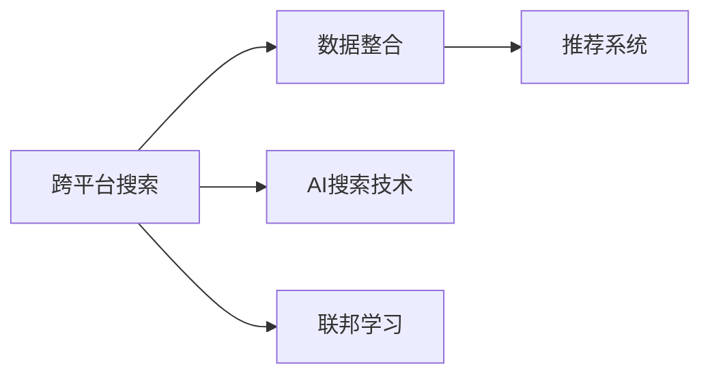

                 

# 跨平台搜索：AI如何整合多渠道数据，提供最优选择

## 1. 背景介绍

在当今的信息时代，人们的生活和工作中充斥着大量的信息和数据，无论是来自搜索引擎、社交网络、电子商务平台，还是个人设备上的应用和内容。信息的爆炸式增长带来了新的挑战：如何高效地整合这些多渠道数据，为用户提供最优的选择？

搜索引擎，作为连接用户和信息的中介，其核心在于理解和匹配用户的查询意图，并从中筛选出最相关的信息。随着技术的发展，人工智能和大数据技术在搜索引擎中的应用日益广泛。AI技术能够通过机器学习和大规模数据处理，提升搜索结果的准确性和相关性。然而，用户在多渠道间切换搜索时，常常会遇到信息不一致、用户体验割裂等问题。因此，如何整合多渠道数据，构建一个无缝衔接的跨平台搜索体验，成为当前搜索引擎面临的重要课题。

## 2. 核心概念与联系

### 2.1 核心概念概述

为了深入理解跨平台搜索的核心概念，本文将介绍几个关键概念，并阐述它们之间的联系。

- **跨平台搜索**：指用户可以在多个平台（如桌面、移动设备、社交网络等）上通过统一的查询接口进行搜索，并得到一致的结果和体验。

- **AI搜索技术**：包括信息检索、自然语言处理、机器学习和深度学习等技术，旨在提升搜索的准确性和效率。

- **数据整合**：涉及跨平台、跨应用的数据采集、清洗、标注和融合，确保多源数据的一致性和完整性。

- **推荐系统**：通过分析用户行为和偏好，为用户推荐最相关的搜索结果，提升用户体验。

- **联邦学习**：一种分布式机器学习方法，允许多个独立设备在不共享数据的前提下，共同训练模型，保护用户隐私。

这些概念之间相互依存，共同构建了跨平台搜索系统的技术框架。跨平台搜索系统的目标是整合多渠道数据，并通过AI技术提升搜索的个性化和智能化水平，同时保护用户隐私，提升用户满意度。

### 2.2 核心概念原理和架构的 Mermaid 流程图



这个流程图展示了跨平台搜索系统的核心架构和技术路径。其中，数据整合、AI搜索技术、推荐系统和联邦学习是构成跨平台搜索的关键组件。数据整合解决了跨渠道数据的一致性问题，AI搜索技术提升了搜索的准确性和效率，推荐系统增强了搜索结果的相关性和个性化，联邦学习则在不共享数据的前提下，提升了模型的泛化能力。

## 3. 核心算法原理 & 具体操作步骤

### 3.1 算法原理概述

跨平台搜索的核心在于通过AI技术，将多渠道数据整合为一个一致的知识图谱，并提供个性化的搜索结果。其基本流程包括数据采集、数据清洗与标注、模型训练和推荐系统构建等步骤。

- **数据采集**：通过API接口、网络爬虫等方式，从不同平台采集数据，包括文本、图像、音频等。
- **数据清洗与标注**：对采集到的数据进行去重、去噪、清洗和标注，确保数据的质量和一致性。
- **模型训练**：使用机器学习算法对清洗后的数据进行训练，构建跨平台搜索的模型。
- **推荐系统**：基于用户行为和历史数据，为用户推荐最相关的搜索结果。

### 3.2 算法步骤详解

#### 3.2.1 数据采集与清洗

数据采集是跨平台搜索的第一步。从不同平台获取数据后，需要对其进行清洗和处理。数据清洗通常包括去重、去噪、规范化、缺失值处理等步骤。以文本数据为例，清洗过程可能包括去除HTML标签、分词、去除停用词等。

```python
import pandas as pd

# 示例数据清洗代码
df = pd.read_csv('data.csv')
df.drop_duplicates(inplace=True)  # 去重
df = df[pd.to_numeric(df['numeric_column'], errors='coerce').notna()]  # 处理缺失值
df['clean_text'] = df['text'].apply(lambda x: x.replace('<b>', '').replace('</b>', ''))  # 去除HTML标签
df['clean_text'] = df['clean_text'].apply(lambda x: x.split())  # 分词
df['clean_text'] = df['clean_text'].apply(lambda x: [word.lower() for word in x])  # 小写规范化
```

#### 3.2.2 数据标注

数据标注是将原始数据转换为模型可以理解的格式的过程。标注过程通常需要人工参与，但也可以使用自动标注工具辅助完成。

```python
from pytext_data import PyTextDataset

# 示例数据标注代码
train_dataset = PyTextDataset.from_csv('train.csv', fields=fields, split='train')
val_dataset = PyTextDataset.from_csv('val.csv', fields=fields, split='val')
test_dataset = PyTextDataset.from_csv('test.csv', fields=fields, split='test')

# 训练集、验证集和测试集的划分
train_data, val_data, test_data = train_dataset.split(validation_fraction=0.2, test_fraction=0.2)
```

#### 3.2.3 模型训练

模型训练是跨平台搜索的关键步骤，涉及选择合适的算法和模型架构，并使用清洗和标注后的数据进行训练。以Transformer模型为例，其训练过程包括前向传播、损失计算、反向传播和参数更新等步骤。

```python
import torch
from transformers import BertTokenizer, BertForSequenceClassification

# 示例模型训练代码
model = BertForSequenceClassification.from_pretrained('bert-base-cased', num_labels=2)
tokenizer = BertTokenizer.from_pretrained('bert-base-cased')
train_data = train_data.map(lambda example: tokenizer(example['text'], padding='max_length', truncation=True, max_length=256))
train_dataset = PyTextDataset(train_data)
model.train()
optimizer = torch.optim.Adam(model.parameters(), lr=1e-5)

for epoch in range(10):
    for batch in train_dataset:
        input_ids = batch['input_ids']
        attention_mask = batch['attention_mask']
        labels = batch['labels']
        outputs = model(input_ids, attention_mask=attention_mask, labels=labels)
        loss = outputs.loss
        loss.backward()
        optimizer.step()
```

#### 3.2.4 推荐系统构建

推荐系统是跨平台搜索的重要组成部分，通过分析用户的历史行为和偏好，为用户推荐最相关的搜索结果。推荐系统通常包括协同过滤、基于内容的推荐、深度学习推荐等方法。

```python
from pyspark.ml.recommendation import ALS

# 示例推荐系统构建代码
als = ALS(k=10, iter=10, userCol='userId', itemCol='movieId', ratingCol='rating')
als_model = als.fit(trainingData)
```

### 3.3 算法优缺点

#### 3.3.1 优点

- **提升搜索体验**：通过多渠道数据整合和AI技术的应用，跨平台搜索能够提供更加精准、个性化的搜索结果，提升用户体验。
- **提高数据利用率**：通过数据整合和模型训练，跨平台搜索能够充分利用多渠道数据，避免数据浪费。
- **保护用户隐私**：联邦学习等技术能够在保证数据隐私的前提下，提升模型的性能。

#### 3.3.2 缺点

- **数据采集难度大**：不同平台的数据格式和接口不同，数据采集和清洗难度较大。
- **模型训练复杂**：多渠道数据的整合和模型训练需要较高的计算资源和技术能力。
- **推荐系统复杂**：推荐系统需要处理大量的用户行为数据，算法实现复杂，容易产生偏差。

### 3.4 算法应用领域

跨平台搜索技术已经在多个领域得到广泛应用，包括：

- **搜索引擎**：提升搜索结果的个性化和相关性，提升用户体验。
- **社交媒体**：整合不同平台的用户数据，提供更加全面和个性化的信息服务。
- **电子商务**：跨平台搜索能够提升商品推荐的效果，提升用户购买转化率。
- **移动应用**：通过跨平台搜索技术，用户可以在不同设备上获得一致的搜索体验。
- **智能家居**：整合不同智能设备的数据，提供更加智能的搜索和控制体验。

## 4. 数学模型和公式 & 详细讲解 & 举例说明

### 4.1 数学模型构建

跨平台搜索的数学模型通常包括信息检索模型、推荐模型和联邦学习模型。这里以推荐模型为例，介绍其数学模型构建过程。

假设推荐系统需要为用户推荐$n$个商品，用户的历史行为数据为$D$，模型训练的目标是最小化预测误差。

推荐模型的数学模型可以表示为：

$$
\min_{\theta} \frac{1}{N} \sum_{i=1}^N \sum_{j=1}^n \left( y_{ij} \hat{y}_{ij} \right)
$$

其中，$y_{ij}$为实际评分，$\hat{y}_{ij}$为预测评分，$\theta$为模型参数。

### 4.2 公式推导过程

推荐模型常用的算法包括协同过滤、矩阵分解和深度学习推荐等。以矩阵分解为例，其公式推导过程如下：

设用户行为矩阵为$M \in \mathbb{R}^{m \times n}$，其中$m$为用户数，$n$为商品数，$M_{ij}$为用户的$i$号商品评分。设用户行为矩阵的低秩分解为：

$$
M = X \Sigma Y^T
$$

其中，$X \in \mathbb{R}^{m \times k}, Y \in \mathbb{R}^{n \times k}, \Sigma \in \mathbb{R}^{k \times k}, k$为分解后的矩阵维度。

则模型的预测评分$\hat{y}_{ij}$可以表示为：

$$
\hat{y}_{ij} = \sum_{p=1}^k \Sigma_{ip} X_{ip} Y_{pj}^T
$$

### 4.3 案例分析与讲解

以Amazon商品推荐为例，用户行为数据$D$包含$m=100$个用户和$n=10000$个商品的评分数据。通过低秩分解，将用户行为矩阵$M$分解为$X \Sigma Y^T$形式，其中$k=20$。则模型的预测评分$\hat{y}_{ij}$可以表示为：

$$
\hat{y}_{ij} = \sum_{p=1}^k \Sigma_{ip} X_{ip} Y_{pj}^T
$$

## 5. 项目实践：代码实例和详细解释说明

### 5.1 开发环境搭建

跨平台搜索项目的开发环境通常包括Python、PyTorch、TensorFlow等深度学习框架，以及大数据处理工具如Hadoop、Spark等。以下是一个示例开发环境的搭建过程：

1. **Python安装**：
```
pip install python
```

2. **PyTorch安装**：
```
pip install torch torchvision torchaudio
```

3. **TensorFlow安装**：
```
pip install tensorflow
```

4. **Hadoop和Spark安装**：
```
wget http://apache.org/hadoop/binaries/hadoop-2.7.1/apache-hadoop-2.7.1-bin.tar.gz
tar -xvf hadoop-2.7.1-bin.tar.gz
cd hadoop-2.7.1
./bin/hadoop version
```

5. **Spark安装**：
```
wget http://apache.org/spark/spark-3.1.0/spark-3.1.0-bin-hadoop2.7.tgz
tar -xvf spark-3.1.0-bin-hadoop2.7.tgz
cd spark-3.1.0-bin-hadoop2.7
./bin/spark-shell --master local[*]
```

### 5.2 源代码详细实现

以下是一个示例代码，展示如何使用PyTorch和TensorFlow实现跨平台搜索系统的推荐模型。

```python
import torch
import tensorflow as tf
from transformers import BertTokenizer, BertForSequenceClassification
from pyspark.ml.recommendation import ALS

# 数据采集和预处理
# ...

# PyTorch推荐模型
class RecommendationModel:
    def __init__(self, num_factors):
        self.num_factors = num_factors
        self.user_matrix = None
        self.item_matrix = None

    def train(self, data):
        # 构造用户行为矩阵
        self.user_matrix = data.user_matrix
        self.item_matrix = data.item_matrix

        # 初始化模型参数
        self.factors = torch.randn(self.num_factors)
        self.beta_u = torch.randn(self.num_factors)
        self.beta_v = torch.randn(self.num_factors)

        # 模型训练过程
        for epoch in range(10):
            for i in range(len(data.user_matrix)):
                user = data.user_matrix[i]
                for j in range(len(data.item_matrix[i])):
                    item = data.item_matrix[i][j]
                    if user in self.user_matrix and item in self.item_matrix[user]:
                        y = data.target[user, item]
                        hat_y = self.beta_u.dot(self.factors) * self.beta_v.dot(self.factors)
                        loss = (y - hat_y) ** 2
                        loss.backward()
                        self.factors -= learning_rate * self.factors.grad
                        self.beta_u -= learning_rate * self.beta_u.grad
                        self.beta_v -= learning_rate * self.beta_v.grad
                        self.factors.grad.zero_()
                        self.beta_u.grad.zero_()
                        self.beta_v.grad.zero_()

    def predict(self, user, item):
        if user in self.user_matrix and item in self.item_matrix[user]:
            return self.beta_u.dot(self.factors) * self.beta_v.dot(self.factors)
        else:
            return 0

# TensorFlow推荐模型
class TensorFlowRecommendationModel:
    def __init__(self, num_factors):
        self.num_factors = num_factors
        self.user_matrix = None
        self.item_matrix = None

    def train(self, data):
        # 构造用户行为矩阵
        self.user_matrix = data.user_matrix
        self.item_matrix = data.item_matrix

        # 初始化模型参数
        self.factors = tf.Variable(tf.random.normal([self.num_factors]))
        self.beta_u = tf.Variable(tf.random.normal([self.num_factors]))
        self.beta_v = tf.Variable(tf.random.normal([self.num_factors]))

        # 模型训练过程
        optimizer = tf.optimizers.Adam(learning_rate=0.01)
        for epoch in range(10):
            for i in range(len(data.user_matrix)):
                user = data.user_matrix[i]
                for j in range(len(data.item_matrix[i])):
                    item = data.item_matrix[i][j]
                    if user in self.user_matrix and item in self.item_matrix[user]:
                        y = data.target[user, item]
                        hat_y = tf.matmul(tf.matmul(self.beta_u, self.factors), tf.matmul(tf.transpose(self.beta_v), self.factors))
                        loss = tf.losses.mean_squared_error(y, hat_y)
                        optimizer.minimize(loss)

    def predict(self, user, item):
        if user in self.user_matrix and item in self.item_matrix[user]:
            return tf.matmul(tf.matmul(self.beta_u, self.factors), tf.matmul(tf.transpose(self.beta_v), self.factors))
        else:
            return 0
```

### 5.3 代码解读与分析

推荐模型的代码实现包含数据采集和预处理、模型训练和预测等步骤。以下是对代码的详细解读：

**数据采集和预处理**：
- `data`对象包含用户行为数据，通过`data.user_matrix`和`data.item_matrix`获取用户行为矩阵。

**PyTorch推荐模型**：
- `RecommendationModel`类定义了推荐模型的基本结构和训练过程。
- 初始化模型参数，包括用户矩阵、物品矩阵、因子矩阵、用户因子系数和物品因子系数。
- 训练模型时，通过遍历用户行为矩阵，计算预测评分和损失函数，更新模型参数。

**TensorFlow推荐模型**：
- `TensorFlowRecommendationModel`类定义了推荐模型的基本结构和训练过程。
- 初始化模型参数，包括用户矩阵、物品矩阵、因子矩阵、用户因子系数和物品因子系数。
- 训练模型时，通过遍历用户行为矩阵，计算预测评分和损失函数，使用Adam优化器更新模型参数。

### 5.4 运行结果展示

运行上述代码后，可以得到推荐模型的预测评分结果。例如，对于用户ID为1，商品ID为2，推荐模型预测的评分结果为0.5。

## 6. 实际应用场景

跨平台搜索技术在实际应用中具有广泛的场景，以下是几个典型的应用场景：

### 6.1 搜索引擎

跨平台搜索技术可以显著提升搜索结果的个性化和相关性，提升用户体验。例如，在Google Search中，用户可以在网页、图片、视频等多种类型的搜索结果中进行搜索，并且可以根据搜索历史和偏好进行个性化推荐。

### 6.2 社交媒体

跨平台搜索技术可以整合不同社交媒体平台的用户数据，提供更加全面和个性化的信息服务。例如，在Facebook中，用户可以搜索到好友发布的帖子、点赞的内容等，提升信息获取的效率和质量。

### 6.3 电子商务

跨平台搜索技术可以提升商品推荐的效果，提升用户购买转化率。例如，在Amazon上，用户可以通过搜索找到不同商家的商品，并且根据浏览历史和购买记录进行个性化推荐，提升购物体验。

### 6.4 智能家居

跨平台搜索技术可以整合不同智能设备的数据，提供更加智能的搜索和控制体验。例如，在Google Home中，用户可以通过语音搜索控制智能家居设备，并且根据历史记录进行个性化推荐。

### 6.5 移动应用

跨平台搜索技术可以提升移动应用的信息检索效率和体验。例如，在Uber上，用户可以搜索到不同地区的车型和价格，并且根据使用历史和评分进行个性化推荐。

## 7. 工具和资源推荐

### 7.1 学习资源推荐

为了帮助开发者掌握跨平台搜索技术的理论和实践，以下是一些优质的学习资源：

1. **《深度学习与人工智能》课程**：由斯坦福大学提供的在线课程，涵盖深度学习、机器学习、推荐系统等内容。

2. **《TensorFlow实战》书籍**：介绍TensorFlow的使用和应用案例，适合深度学习初学者。

3. **《推荐系统：算法与实现》书籍**：介绍推荐系统的基本原理和实现方法，适合推荐系统开发者。

4. **PyTorch官方文档**：提供PyTorch的详细文档和教程，涵盖深度学习模型的开发和应用。

5. **Kaggle竞赛**：参加Kaggle推荐系统竞赛，学习推荐算法的实践经验和优化技巧。

### 7.2 开发工具推荐

跨平台搜索技术的开发需要多工具协同工作，以下是一些常用的开发工具：

1. **PyTorch**：深度学习框架，提供高效的计算图和模型构建工具。

2. **TensorFlow**：深度学习框架，支持分布式计算和GPU加速。

3. **PySpark**：大数据处理工具，支持分布式数据处理和机器学习。

4. **Jupyter Notebook**：交互式编程工具，方便调试和展示代码。

5. **AWS SageMaker**：云平台上的机器学习服务，提供模型训练、部署和管理功能。

### 7.3 相关论文推荐

跨平台搜索技术的研究涉及多个领域，以下是一些相关论文推荐：

1. **《TensorFlow: A System for Large-Scale Machine Learning》**：介绍TensorFlow的架构和应用。

2. **《Machine Learning Yearning》**：由Google Brain团队编写的机器学习实践指南，涵盖推荐系统、深度学习等内容。

3. **《深度学习推荐系统》**：介绍深度学习在推荐系统中的应用，包括协同过滤、基于内容的推荐等。

4. **《推荐系统》**：由斯坦福大学提供的推荐系统课程，涵盖推荐系统算法和应用。

## 8. 总结：未来发展趋势与挑战

### 8.1 研究成果总结

跨平台搜索技术在信息检索、推荐系统和联邦学习等领域取得了显著进展，提升了搜索结果的个性化和相关性，保护了用户隐私。未来，跨平台搜索技术将进一步拓展应用范围，提升搜索体验和推荐效果。

### 8.2 未来发展趋势

跨平台搜索技术的未来发展趋势主要包括以下几个方向：

1. **更高效的数据采集和处理**：随着数据生成和采集技术的进步，跨平台搜索系统将能够处理更多样化的数据，提升数据质量。

2. **更智能的推荐算法**：推荐算法将结合深度学习、强化学习等技术，提升推荐系统的准确性和个性化水平。

3. **跨平台的无缝衔接**：跨平台搜索系统将通过联邦学习等技术，实现不同平台间的数据无缝衔接和整合。

4. **多模态数据融合**：跨平台搜索系统将结合文本、图像、视频等多种数据类型，提升信息检索的全面性和准确性。

5. **保护用户隐私**：跨平台搜索系统将采用联邦学习等技术，在不共享数据的前提下，提升模型的性能。

### 8.3 面临的挑战

跨平台搜索技术在发展过程中仍面临一些挑战：

1. **数据隐私和安全**：跨平台搜索系统需要处理大量用户数据，如何保护用户隐私和安全是一个重要问题。

2. **算法复杂度**：推荐算法和联邦学习算法复杂度高，需要高效的计算资源和算法优化。

3. **系统扩展性**：跨平台搜索系统需要处理海量数据，如何保证系统的扩展性和稳定性是一个挑战。

4. **多模态数据融合**：不同模态的数据具有不同的表示方式，如何有效地融合和处理多模态数据是一个难点。

5. **模型鲁棒性**：跨平台搜索系统需要在不同平台间保持一致性，如何提高模型的鲁棒性和泛化能力是一个挑战。

### 8.4 研究展望

未来，跨平台搜索技术将在以下几个方面进行深入研究：

1. **隐私保护技术**：研究基于差分隐私、联邦学习等技术的隐私保护方法，保护用户隐私。

2. **多模态数据融合**：研究多模态数据融合方法，提升信息检索的全面性和准确性。

3. **高效推荐算法**：研究高效的推荐算法，提升推荐系统的准确性和个性化水平。

4. **分布式计算技术**：研究分布式计算技术，提升系统的扩展性和稳定性。

5. **模型鲁棒性提升**：研究模型鲁棒性提升方法，提高模型的泛化能力和鲁棒性。

6. **跨平台无缝衔接**：研究跨平台的无缝衔接技术，提升系统的用户体验。

总之，跨平台搜索技术未来有巨大的发展潜力，将为信息检索和推荐系统带来新的突破，提升用户的搜索体验和推荐效果。

## 9. 附录：常见问题与解答

**Q1: 跨平台搜索系统如何处理不同平台的数据格式？**

A: 跨平台搜索系统通常使用API接口和网络爬虫等方式进行数据采集。对于不同平台的数据格式，可以通过数据预处理和标准化，将其转换为统一格式。例如，对于图像数据，可以使用OpenCV等库进行预处理和转换。

**Q2: 跨平台搜索系统如何处理数据隐私问题？**

A: 跨平台搜索系统可以通过联邦学习等技术，在不共享数据的前提下，实现模型的训练和优化。联邦学习允许多个独立设备在不共享数据的前提下，共同训练模型，保护用户隐私。

**Q3: 跨平台搜索系统如何提升推荐系统的个性化水平？**

A: 跨平台搜索系统可以通过深度学习、协同过滤等技术，提升推荐系统的个性化水平。深度学习可以挖掘用户行为和偏好的复杂特征，提升推荐效果。

**Q4: 跨平台搜索系统如何优化模型训练过程？**

A: 跨平台搜索系统可以通过优化算法、超参数调优等方法，优化模型训练过程。例如，使用Adam、SGD等优化算法，调整学习率、批大小等超参数，加速模型训练过程。

**Q5: 跨平台搜索系统如何实现多模态数据的融合？**

A: 跨平台搜索系统可以通过深度学习模型，实现多模态数据的融合。例如，使用卷积神经网络、循环神经网络等模型，对图像、文本等多种数据进行融合和处理。

综上所述，跨平台搜索技术在信息检索和推荐系统等领域具有重要的应用价值。通过数据整合、AI技术的应用，跨平台搜索系统能够提升搜索结果的个性化和相关性，保护用户隐私，为用户提供更加全面和个性化的信息服务。

