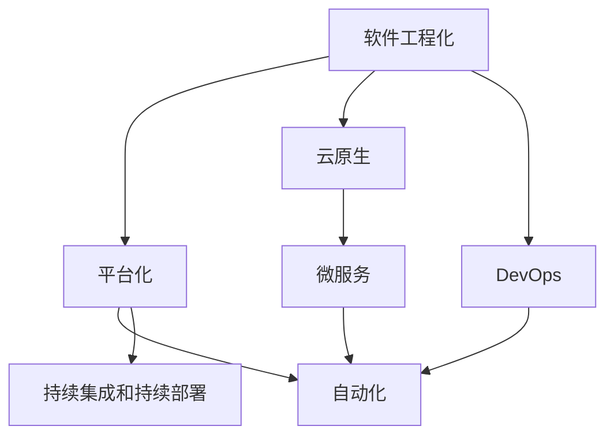

                 

# 软件 2.0 的价值：提升效率、创造价值

## 1. 背景介绍

### 1.1 问题由来

软件技术自诞生以来，经历了数次深刻的变革。从最初的汇编语言到高级编程语言，再到框架和库，软件形态在不断地演变和升级。在当前的技术浪潮中，软件 2.0 的概念正在引起广泛关注。软件 2.0 强调的是通过软件工程化和平台化，极大地提升软件开发和运维的效率，同时实现商业价值的最大化。

在传统的软件开发范式下，开发者需要花费大量时间和精力进行编码、调试、测试等工作。而软件 2.0 的出现，将软件开发从简单的代码编写转变为复杂的系统工程，通过抽象、自动化和优化等手段，大幅度提升了软件开发生产力，使开发者能够快速构建高质量、高可用性的软件系统。

软件 2.0 不仅关注开发效率，还注重商业价值的创造。通过软件平台化和大数据分析，软件 2.0 能够实时监控和优化系统性能，为客户提供定制化的服务，从而提升客户满意度和忠诚度，实现商业模式的创新和业务的持续增长。

### 1.2 问题核心关键点

软件 2.0 的核心在于如何通过软件工程化和平台化，实现效率和价值的双重提升。其关键点包括：

1. **系统架构设计**：设计高效、可扩展的架构，支持快速迭代和弹性扩展。
2. **自动化和持续集成**：通过自动化测试、持续集成和持续部署，提升开发效率，减少人为错误。
3. **大数据和智能分析**：利用大数据和人工智能技术，实时监控和优化系统性能，提升用户体验。
4. **云原生和微服务**：采用云原生和微服务架构，实现服务的解耦合和弹性扩展。
5. **DevOps文化**：倡导协作、快速反馈和持续改进的 DevOps 文化，提升团队协作效率和系统稳定性。

软件 2.0 的概念虽然较新，但其底层技术已经存在多年。例如，DevOps、云原生、微服务等概念早在十年前就已经出现。软件 2.0 的提出，更多是从企业战略和商业角度对已有技术的整合和提升。

## 2. 核心概念与联系

### 2.1 核心概念概述

为更好地理解软件 2.0 的价值，本节将介绍几个密切相关的核心概念：

- **软件工程化**：将软件开发视为系统工程，通过规范的流程、工具和方法，提升开发效率和系统质量。
- **平台化**：通过构建软件平台，将服务、数据和流程进行整合和优化，实现一站式服务。
- **自动化**：通过自动化工具和流程，减少人为操作，提升开发和运维效率。
- **持续集成和持续部署**：通过自动化测试和部署流程，确保代码质量，提升发布速度。
- **云原生**：利用云计算技术，实现服务的弹性扩展和高效运维。
- **微服务**：通过将服务拆分为多个小服务，实现服务的解耦合和灵活扩展。
- **DevOps**：融合开发和运维的DevOps文化，通过自动化和持续反馈，提升团队协作效率和系统稳定性。

这些核心概念之间的逻辑关系可以通过以下Mermaid流程图来展示：



这个流程图展示出软件 2.0 的核心概念及其之间的关系：

1. 软件工程化是基础，通过规范的流程和方法，提升开发效率和系统质量。
2. 平台化是手段，通过构建软件平台，实现服务、数据和流程的整合和优化。
3. 自动化和持续集成是工具，通过自动化流程，提升开发和运维效率。
4. 云原生和微服务是技术，利用云计算和微服务架构，实现服务的弹性扩展和高效运维。
5. DevOps 是文化，通过协作、快速反馈和持续改进，提升团队协作效率和系统稳定性。

这些概念共同构成了软件 2.0 的核心框架，使其能够实现效率和价值的双重提升。通过理解这些核心概念，我们可以更好地把握软件 2.0 的工作原理和优化方向。

## 3. 核心算法原理 & 具体操作步骤
### 3.1 算法原理概述

软件 2.0 的核心算法原理可以概括为以下几个方面：

1. **系统架构设计**：通过架构设计和组件化，将复杂系统拆分为可管理的小模块，实现服务的解耦合和灵活扩展。
2. **自动化流程**：通过自动化工具和流程，减少人为操作，提升开发和运维效率。
3. **持续集成和持续部署**：通过自动化测试和部署流程，确保代码质量，提升发布速度。
4. **云原生技术**：利用云计算和微服务架构，实现服务的弹性扩展和高效运维。
5. **DevOps文化**：通过协作、快速反馈和持续改进的DevOps文化，提升团队协作效率和系统稳定性。

### 3.2 算法步骤详解

软件 2.0 的实现一般包括以下几个关键步骤：

**Step 1: 系统架构设计**
- 定义系统架构，选择合适的技术栈和框架。
- 设计组件化模块，确保各模块独立可扩展。
- 定义服务接口和通信协议，实现模块间的互操作性。

**Step 2: 自动化流程构建**
- 选择合适的自动化工具，如Jenkins、Travis CI等。
- 定义自动化测试流程，包括单元测试、集成测试和端到端测试。
- 配置自动化部署流程，支持持续集成和持续部署。

**Step 3: 持续集成和持续部署**
- 配置CI/CD工具，实现代码的自动化测试和部署。
- 定义代码质量标准，包括代码审查、单元测试覆盖率等。
- 建立自动化的发布流程，确保新代码及时发布到生产环境。

**Step 4: 云原生技术应用**
- 选择合适的云平台，如AWS、Azure、Google Cloud等。
- 采用微服务架构，将服务拆分为多个小服务。
- 利用容器技术，如Docker、Kubernetes等，实现服务的自动化部署和扩展。

**Step 5: DevOps文化建设**
- 建立持续反馈的机制，确保开发和运维团队的紧密合作。
- 实施监控和告警，及时发现和解决问题。
- 建立质量保障体系，确保代码和系统的稳定性。

### 3.3 算法优缺点

软件 2.0 技术具有以下优点：
1. **提升开发效率**：通过自动化和持续集成，减少人为操作，提升开发速度和代码质量。
2. **增强系统弹性**：采用云原生和微服务架构，实现服务的弹性扩展和高效运维。
3. **降低运维成本**：通过自动化运维和持续反馈，降低人工运维成本，提升系统稳定性。
4. **提升用户体验**：通过实时监控和优化，提供更优质的用户服务，提升客户满意度和忠诚度。
5. **实现商业创新**：通过大数据和智能分析，提供定制化服务，拓展商业应用场景。

同时，软件 2.0 技术也存在一些局限性：
1. **技术复杂性高**：需要较高的技术门槛和团队协作能力。
2. **前期成本投入大**：系统架构设计和自动化流程的构建需要较高的投入。
3. **运维复杂度增加**：需要建立完善的监控和告警机制，处理复杂的故障排查和优化。
4. **依赖外部资源**：云平台和大数据资源的依赖，增加了系统的运维难度。
5. **安全性风险增加**：自动化和微服务架构下，需要加强安全性防护，防范潜在风险。

尽管存在这些局限性，但就目前而言，软件 2.0 技术在提升软件开发和运维效率、实现商业价值最大化方面具有显著优势，成为企业数字化转型和创新的重要手段。

### 3.4 算法应用领域

软件 2.0 技术已经在多个行业和领域得到广泛应用，例如：

- **金融行业**：通过云原生和微服务架构，提升金融服务的稳定性和弹性，实现金融产品的快速迭代和创新。
- **电商行业**：利用云平台和大数据，优化电商系统的性能，提供个性化的购物推荐和精准营销。
- **医疗行业**：通过自动化和持续集成，提升医疗系统的开发效率，提供高质量的医疗服务。
- **电信行业**：利用云原生和DevOps文化，提升网络服务的稳定性和用户体验，实现5G网络的快速部署和优化。
- **政府行业**：通过平台化和微服务架构，实现政府服务的统一管理和优化，提升政府工作效率和透明度。

除了这些典型应用外，软件 2.0 技术还在教育、制造、能源等众多行业得到了推广应用，为各行业的数字化转型提供了新的技术支持。

## 4. 数学模型和公式 & 详细讲解 & 举例说明

### 4.1 数学模型构建

软件 2.0 的实现涉及到多个技术领域的知识，包括软件开发、云计算、大数据等。其中，云计算和大数据分析是核心技术之一。

假设我们有一个云平台，用于部署和运维多个服务，其性能可以用以下数学模型来表示：

$$
P = \frac{S \times I \times C \times W}{T}
$$

其中：
- $P$ 为平台性能，
- $S$ 为服务数量，
- $I$ 为资源利用率，
- $C$ 为云平台计算资源，
- $W$ 为网络带宽，
- $T$ 为系统负载。

该模型可以用于评估不同服务数量、资源利用率和系统负载下，云平台性能的变化。

### 4.2 公式推导过程

在上述模型中，我们可以进一步推导出平台性能的计算公式：

$$
P = \frac{S \times I \times C \times W}{T}
$$

其中 $I$ 和 $C$ 的关系可以表示为：

$$
I = \frac{C}{C_{max}}
$$

将上式代入平台性能公式中，得：

$$
P = \frac{S \times \frac{C}{C_{max}} \times C \times W}{T}
$$

化简得：

$$
P = \frac{S \times W}{T} \times \frac{C^2}{C_{max}}
$$

从上式可以看出，平台性能与服务数量、网络带宽、计算资源和负载等因素密切相关。在实际应用中，需要根据具体情况进行参数调整，以实现最优性能。

### 4.3 案例分析与讲解

以电商平台为例，可以构建如下的数学模型来评估平台性能：

$$
P = \frac{S \times I \times C \times W}{T}
$$

其中 $S$ 为商品数量，$I$ 为订单数量，$C$ 为计算资源，$W$ 为网络带宽，$T$ 为平台负载。

在实际应用中，通过实时监控和优化，可以调整计算资源和网络带宽的配置，以适应不同时间段的用户访问流量。例如，在双十一购物高峰期，增加计算资源和网络带宽，确保平台能够平稳运行。

## 5. 项目实践：代码实例和详细解释说明

### 5.1 开发环境搭建

在进行软件 2.0 实践前，我们需要准备好开发环境。以下是使用Python进行Django开发的环境配置流程：

1. 安装Anaconda：从官网下载并安装Anaconda，用于创建独立的Python环境。

2. 创建并激活虚拟环境：
```bash
conda create -n django-env python=3.8 
conda activate django-env
```

3. 安装Django：
```bash
pip install django
```

4. 安装其他必要的工具包：
```bash
pip install numpy pandas scikit-learn
```

完成上述步骤后，即可在`django-env`环境中开始开发。

### 5.2 源代码详细实现

这里我们以构建一个电商平台为例，展示如何利用软件 2.0 技术实现电商系统的开发和运维。

首先，定义电商平台的数据模型：

```python
from django.db import models
from django.contrib.auth.models import User

class Product(models.Model):
    name = models.CharField(max_length=255)
    price = models.DecimalField(max_digits=10, decimal_places=2)
    description = models.TextField()
    image = models.ImageField(upload_to='products/')

class Order(models.Model):
    user = models.ForeignKey(User, on_delete=models.CASCADE)
    product = models.ForeignKey(Product, on_delete=models.CASCADE)
    quantity = models.IntegerField()
    created_at = models.DateTimeField(auto_now_add=True)
    completed_at = models.DateTimeField(null=True, blank=True)

class OrderItem(models.Model):
    order = models.ForeignKey(Order, on_delete=models.CASCADE)
    quantity = models.IntegerField()
    price = models.DecimalField(max_digits=10, decimal_places=2)

# 定义购物车模型
class Cart(models.Model):
    user = models.ForeignKey(User, on_delete=models.CASCADE)
    product = models.ForeignKey(Product, on_delete=models.CASCADE)
    quantity = models.IntegerField()

# 定义订单状态模型
class OrderStatus(models.Model):
    name = models.CharField(max_length=255)
```

然后，定义视图和路由：

```python
from django.shortcuts import render, redirect
from django.http import HttpResponse
from .models import Product, Order, OrderItem

def index(request):
    products = Product.objects.all()
    return render(request, 'index.html', {'products': products})

def product_detail(request, pk):
    product = Product.objects.get(pk=pk)
    return render(request, 'product_detail.html', {'product': product})

def cart(request):
    cart = Cart.objects.filter(user=request.user)
    total_price = 0
    for item in cart:
        total_price += item.product.price * item.quantity
    return render(request, 'cart.html', {'total_price': total_price})

def checkout(request):
    order = Order.objects.create(user=request.user)
    for cart_item in cart:
        OrderItem.objects.create(order=order, product=cart_item.product, quantity=cart_item.quantity, price=cart_item.product.price)
    cart.objects.all().delete()
    return redirect('index')
```

最后，配置Django的路由和模板：

```python
from django.urls import path
from . import views

urlpatterns = [
    path('', views.index, name='index'),
    path('product/<int:pk>/', views.product_detail, name='product_detail'),
    path('cart/', views.cart, name='cart'),
    path('checkout/', views.checkout, name='checkout'),
]
```

在`templates`目录下创建模板文件，例如`index.html`、`product_detail.html`和`cart.html`。在模板文件中定义HTML结构，展示数据并处理用户交互。

### 5.3 代码解读与分析

让我们再详细解读一下关键代码的实现细节：

**数据模型定义**：
- 定义了Product、Order、OrderItem、Cart和OrderStatus等数据模型，用于存储电商系统中的商品、订单、购物车和订单状态等数据。
- 使用Django的ORM（对象关系映射）框架，方便数据库操作。

**视图和路由配置**：
- 定义了`index`、`product_detail`、`cart`和`checkout`等视图函数，用于处理不同的用户请求。
- 使用Django的路由配置，将视图函数映射到URL地址上。
- 在视图函数中，通过Django的模板渲染系统，展示数据并处理用户交互。

**模板文件设计**：
- 在模板文件中，通过Django的模板语言（例如``、``等），继承和重用模板。
- 使用Django的标签（例如``、``等），动态展示数据和用户交互。

通过以上步骤，我们完成了基于软件 2.0 技术的电商系统的开发。可以看到，Django框架提供了完善的开发工具和文档，使得开发者能够快速构建复杂的Web应用。

## 6. 实际应用场景

### 6.1 智能制造系统

在智能制造领域，软件 2.0 技术可以帮助企业实现智能化、自动化生产线的建设。通过云平台和微服务架构，实时监控生产设备的运行状态，自动调整生产参数，实现生产线的灵活配置和高效管理。

### 6.2 智慧城市建设

在智慧城市建设中，软件 2.0 技术可以实现智能交通、公共安全、智慧医疗等多个场景的应用。通过云平台和大数据分析，实现城市资源的统一管理和优化，提升城市管理的智能化水平。

### 6.3 电子商务平台

在电子商务平台中，软件 2.0 技术可以优化订单处理、库存管理、物流配送等环节，提升平台的服务质量和用户体验。通过云平台和大数据，实现商品的精准推荐和个性化营销，提升用户的购物体验和满意度。

### 6.4 未来应用展望

随着软件 2.0 技术的不断演进，其应用范围将进一步扩展到更多领域。例如：

- **智能家居**：通过软件平台和物联网技术，实现家居设备的自动化控制和智能化管理。
- **智能农业**：利用软件平台和传感器技术，实现农业生产的智能化和自动化。
- **智能医疗**：通过软件平台和医疗大数据，实现医疗服务的个性化和精准化。

未来，软件 2.0 技术将与更多新兴技术结合，推动各行各业的数字化转型和智能化升级。

## 7. 工具和资源推荐

### 7.1 学习资源推荐

为了帮助开发者系统掌握软件 2.0 技术的理论基础和实践技巧，这里推荐一些优质的学习资源：

1. **《软件 2.0 原理与实践》系列博文**：由软件 2.0 领域专家撰写，深入浅出地介绍了软件 2.0 技术的基本概念和实现方法。

2. **《软件工程与设计模式》书籍**：经典的编程书籍，涵盖软件开发的各个环节，包括需求分析、系统设计、实现和测试等。

3. **Django官方文档**：Django框架的官方文档，提供完整的开发指南、示例和API文档，是开发者入门Django的最佳资源。

4. **Cloud Computing with Python 3 书籍**：介绍使用Python进行云平台开发的书籍，涵盖AWS、Azure、Google Cloud等主流云平台的API和开发工具。

5. **Docker官方文档**：Docker容器的官方文档，提供Docker的安装、配置和使用指南，帮助开发者构建和管理容器化应用。

通过对这些资源的学习实践，相信你一定能够快速掌握软件 2.0 技术的精髓，并用于解决实际的开发问题。

### 7.2 开发工具推荐

高效的开发离不开优秀的工具支持。以下是几款用于软件 2.0 开发和运维的常用工具：

1. **Django**：开源的Web框架，提供完善的开发工具和模板引擎，帮助开发者快速构建Web应用。

2. **Jenkins**：开源的持续集成和持续部署工具，支持多种集成方式和插件，适用于复杂的CI/CD流程。

3. **Kubernetes**：开源的容器编排工具，支持大规模容器化应用的管理和调度，提升云平台的资源利用率。

4. **Prometheus**：开源的监控和告警工具，支持多种数据源和可视化图表，适用于实时监控和故障排查。

5. **ELK Stack**：开源的日志分析和可视化工具，支持实时监控和日志聚合，适用于大数据分析和可视化。

合理利用这些工具，可以显著提升软件 2.0 开发和运维的效率，加快创新迭代的步伐。

### 7.3 相关论文推荐

软件 2.0 技术的发展源于学界的持续研究。以下是几篇奠基性的相关论文，推荐阅读：

1. **《软件工程与系统集成》论文**：介绍了软件工程的基本概念和系统集成的重要性，提出了软件平台化的概念。

2. **《云计算与软件即服务》论文**：探讨了云计算和大数据技术在软件平台化中的应用，提出了云原生和微服务架构的思想。

3. **《DevOps文化与持续反馈》论文**：分析了DevOps文化对软件开发和运维的促进作用，提出了持续反馈和自动化运维的实现方法。

4. **《大数据分析与智能决策》论文**：介绍了大数据分析和智能决策的基本方法，探讨了其在软件平台中的应用。

这些论文代表了大数据和软件 2.0 技术的发展脉络。通过学习这些前沿成果，可以帮助研究者把握学科前进方向，激发更多的创新灵感。

## 8. 总结：未来发展趋势与挑战

### 8.1 总结

本文对软件 2.0 的价值进行了全面系统的介绍。首先阐述了软件 2.0 技术在提升开发效率和创造商业价值方面的独特优势，明确了系统架构设计、平台化、自动化、持续集成和持续部署、云原生和微服务、DevOps文化等关键点。其次，从原理到实践，详细讲解了软件 2.0 的数学模型和具体实现步骤，给出了电商系统的完整代码实例。同时，本文还广泛探讨了软件 2.0 技术在智能制造、智慧城市、电子商务等诸多领域的应用前景，展示了其广阔的发展潜力。

通过本文的系统梳理，可以看到，软件 2.0 技术正在成为软件开发和运维的重要手段，极大地提升了软件开发生产力和系统稳定性，为数字化转型提供了新路径。未来，伴随软件 2.0 技术的不断演进，其应用场景和应用深度将进一步拓展，为各行各业带来新的变革。

### 8.2 未来发展趋势

展望未来，软件 2.0 技术将呈现以下几个发展趋势：

1. **持续集成和持续部署的普及**：随着DevOps文化的普及，持续集成和持续部署将更加广泛地应用于各个行业，提升开发和运维效率。

2. **云原生和微服务架构的深化**：云原生和微服务架构将继续发展，提升系统的弹性扩展和运维效率，支持更多的应用场景。

3. **大数据分析和智能决策的提升**：随着大数据技术的进步，软件平台将越来越多地利用大数据分析和智能决策技术，提升系统的智能化水平。

4. **DevOps文化的深化**：DevOps文化将进一步深化，提升团队协作效率和系统稳定性，推动企业的数字化转型。

5. **软件平台化的普适性增强**：软件平台化将扩展到更多领域，提供一站式服务和解决方案，满足不同行业的需求。

6. **新兴技术的融合**：软件 2.0 技术将与新兴技术（如物联网、区块链、人工智能等）深度融合，实现更多创新应用。

以上趋势凸显了软件 2.0 技术的广阔前景。这些方向的探索发展，必将进一步提升软件系统的性能和应用范围，为各行各业带来新的技术创新和业务变革。

### 8.3 面临的挑战

尽管软件 2.0 技术已经取得了瞩目成就，但在迈向更加智能化、普适化应用的过程中，它仍面临着诸多挑战：

1. **技术复杂性**：软件 2.0 技术涉及多个领域的知识，需要较高的技术门槛和团队协作能力。

2. **前期成本高**：系统架构设计和自动化流程的构建需要较高的投入，初期实施成本较高。

3. **运维复杂度**：需要建立完善的监控和告警机制，处理复杂的故障排查和优化。

4. **数据安全和隐私**：随着数据量的增加，数据安全和隐私保护成为重要问题，需要加强数据加密和安全审计。

5. **技术变革快**：新兴技术不断涌现，需要持续学习和跟进，保持技术领先。

6. **业务适配难度大**：不同行业的业务需求各异，需要根据具体情况进行定制化开发和优化。

正视软件 2.0 面临的这些挑战，积极应对并寻求突破，将有助于软件 2.0 技术更快、更广泛地应用于各个行业，推动数字化转型的进程。

### 8.4 研究展望

未来，软件 2.0 技术的研发和应用将面临以下几个重要研究方向：

1. **多云平台集成**：实现跨云平台的无缝集成和资源优化，提升云平台的灵活性和成本效益。

2. **自动化运维工具**：开发更加智能和灵活的自动化运维工具，实现运维过程的自动化和智能化。

3. **安全防护技术**：结合人工智能和区块链技术，提升系统的安全防护能力，防范潜在风险。

4. **数据治理和隐私保护**：建立完善的数据治理和隐私保护机制，确保数据的合规性和安全性。

5. **微服务架构优化**：优化微服务架构，提升服务的可靠性和性能，实现服务的弹性扩展。

6. **DevOps文化建设**：加强DevOps文化的建设，提升团队的协作效率和系统稳定性，推动企业数字化转型。

这些研究方向将引领软件 2.0 技术的未来发展，为各行各业提供更加高效、可靠、安全的数字化解决方案。

## 9. 附录：常见问题与解答

**Q1：什么是软件 2.0 技术？**

A: 软件 2.0 技术是一种基于云计算和大数据技术的软件开发和运维范式，通过软件工程化和平台化，极大地提升开发效率和系统稳定性，同时实现商业价值的最大化。

**Q2：软件 2.0 技术的主要优势是什么？**

A: 软件 2.0 技术的主要优势包括：
1. 提升开发效率，通过自动化和持续集成，减少人为操作，提升开发速度和代码质量。
2. 增强系统弹性，采用云原生和微服务架构，实现服务的弹性扩展和高效运维。
3. 降低运维成本，通过自动化运维和持续反馈，降低人工运维成本，提升系统稳定性。
4. 提升用户体验，通过实时监控和优化，提供更优质的用户服务，提升客户满意度和忠诚度。
5. 实现商业创新，通过大数据和智能分析，提供定制化服务，拓展商业应用场景。

**Q3：如何构建软件 2.0 技术体系？**

A: 构建软件 2.0 技术体系一般包括以下步骤：
1. 定义系统架构，选择合适的技术栈和框架。
2. 设计组件化模块，确保各模块独立可扩展。
3. 定义服务接口和通信协议，实现模块间的互操作性。
4. 选择合适的自动化工具，如Jenkins、Travis CI等。
5. 定义自动化测试流程，包括单元测试、集成测试和端到端测试。
6. 配置自动化部署流程，支持持续集成和持续部署。
7. 选择合适的云平台，如AWS、Azure、Google Cloud等。
8. 采用微服务架构，将服务拆分为多个小服务。
9. 利用容器技术，如Docker、Kubernetes等，实现服务的自动化部署和扩展。
10. 建立持续反馈的机制，确保开发和运维团队的紧密合作。
11. 实施监控和告警，及时发现和解决问题。
12. 建立质量保障体系，确保代码和系统的稳定性。

通过以上步骤，可以构建出完整的软件 2.0 技术体系，实现开发和运维的高效化和智能化。

**Q4：如何提升软件 2.0 技术的灵活性和可扩展性？**

A: 提升软件 2.0 技术的灵活性和可扩展性一般有以下方法：
1. 采用微服务架构，将服务拆分为多个小服务，实现服务的解耦合和灵活扩展。
2. 利用容器技术，如Docker、Kubernetes等，实现服务的自动化部署和扩展。
3. 采用云原生架构，实现服务的弹性扩展和高效运维。
4. 设计可扩展的数据模型和API接口，支持第三方服务的集成和扩展。
5. 采用API-first的设计理念，提供灵活和可扩展的服务接口。
6. 实现插件化架构，支持新功能的快速集成和扩展。

通过以上方法，可以提升软件 2.0 技术的灵活性和可扩展性，满足不同业务场景的需求。

**Q5：如何提升软件 2.0 技术的性能和稳定性？**

A: 提升软件 2.0 技术的性能和稳定性一般有以下方法：
1. 采用缓存技术，如Redis、Memcached等，减少数据库访问次数，提升系统响应速度。
2. 利用CDN技术，如AWS CloudFront、阿里云CDN等，加速静态资源的加载速度。
3. 实现负载均衡，如Nginx、HAProxy等，提升系统的并发处理能力。
4. 采用异步处理技术，如消息队列、事件驱动等，减少同步操作的阻塞。
5. 实现服务治理，如服务注册和发现、熔断器、限流器等，提升服务的可靠性和稳定性。
6. 利用大数据分析技术，实时监控和优化系统性能，发现和解决问题。

通过以上方法，可以提升软件 2.0 技术的性能和稳定性，满足高性能、高可用性的应用需求。

---

作者：禅与计算机程序设计艺术 / Zen and the Art of Computer Programming

