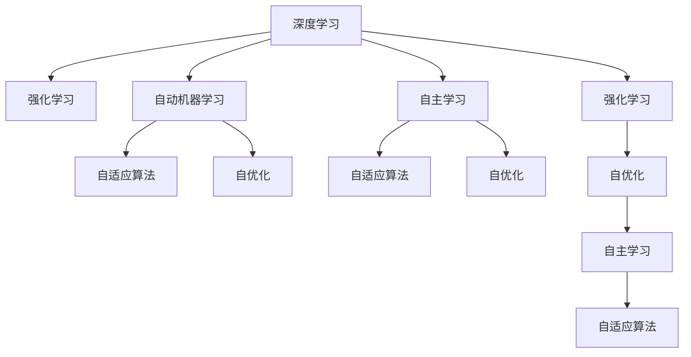

                 

# 软件 2.0 的发展趋势：深度学习、强化学习

> 关键词：软件2.0, 深度学习, 强化学习, 人工智能, 机器学习, 自适应算法, 自优化, 自动机器学习, 自主学习

## 1. 背景介绍

### 1.1 问题由来
随着信息技术与计算能力的飞速进步，软件的形态和功能发生了巨大的转变。从最初的以传统软件为主导的1.0时代，到今天以云计算、人工智能、物联网为核心的2.0时代，软件正在经历一场前所未有的变革。在这场变革中，深度学习和强化学习作为新兴的计算模型和算法，正在重塑软件生态和应用场景。

深度学习（Deep Learning）起源于人工神经网络，通过多层神经网络对数据进行建模和处理，广泛应用于图像识别、语音识别、自然语言处理等领域。而强化学习（Reinforcement Learning）则借鉴了生物学和行为学的原理，通过智能体与环境的交互，训练出能够最优决策的策略。

这两种技术在处理复杂非线性问题、提升软件智能化的过程中展现出强大的能力，推动了软件2.0时代的到来。深度学习和强化学习技术的深入研究和广泛应用，使软件不再仅仅是工具和产品，而是成为具备智能感知、自适应和自优化能力的智能体。

### 1.2 问题核心关键点
深度学习和强化学习在软件2.0时代的应用，主要集中在以下几个方面：

- **自适应算法**：通过学习环境特征和用户行为，使软件能够自动调整策略，实现更好的用户体验。
- **自优化**：软件可以自我学习和优化，提升性能、降低成本、增加用户满意度。
- **自动机器学习**：通过自动化和智能化的方法，快速构建和部署软件模型。
- **自主学习**：软件能够自主获取知识，不断优化自身性能和功能。
- **数据驱动**：通过收集和分析用户数据，优化软件算法和设计。

这些关键点构成了深度学习和强化学习在软件2.0时代的核心应用框架，极大地提高了软件的智能化水平和用户交互体验。

## 2. 核心概念与联系

### 2.1 核心概念概述

为更好地理解深度学习和强化学习在软件2.0时代的应用，本节将介绍几个密切相关的核心概念：

- **深度学习**：通过多层神经网络对数据进行建模和处理，能够自动识别数据中的复杂模式和特征。深度学习广泛应用于图像识别、语音识别、自然语言处理等领域。

- **强化学习**：通过智能体与环境的交互，通过试错的方式学习最优策略。强化学习常用于游戏、机器人控制、推荐系统等领域。

- **自动机器学习**：通过自动化和智能化的方法，快速构建和部署机器学习模型。包括模型选择、特征工程、超参数调优等自动化过程。

- **自适应算法**：算法能够根据环境变化和数据反馈，自动调整模型参数和策略，实现更好的性能。

- **自优化**：算法能够自我学习、自我调整，提升性能和效果。

- **自主学习**：算法能够自主获取知识，不断优化自身性能和功能。

这些核心概念之间的逻辑关系可以通过以下Mermaid流程图来展示：



这个流程图展示了大语言模型的核心概念及其之间的关系：

1. 深度学习和强化学习共同构成了智能算法的基础。
2. 自动机器学习、自适应算法和自优化是深度学习和强化学习的核心技术手段。
3. 自主学习则是更深层次的智能化目标，需要结合多领域知识和技术。

这些概念共同构成了软件2.0时代的智能算法框架，使得软件能够具备更加强大的智能化能力和自适应性。

## 3. 核心算法原理 & 具体操作步骤
### 3.1 算法原理概述

深度学习和强化学习在软件2.0时代的应用，本质上是实现软件智能化和自适应的过程。其核心思想是：通过深度神经网络和强化学习算法，构建能够自动学习、自动优化的智能算法，从而提升软件在复杂环境下的性能和用户体验。

深度学习的核心在于多层神经网络对数据的抽象和学习，通过反向传播算法进行模型参数的更新。其基本流程包括数据预处理、模型构建、训练和测试等步骤。

强化学习的核心在于通过智能体与环境的交互，学习最优策略。其基本流程包括状态观察、策略执行、奖惩反馈等步骤。

在软件2.0时代，深度学习和强化学习技术常通过以下几种方式集成到软件中：

- **模型驱动**：通过构建深度学习或强化学习模型，实现软件智能化。
- **算法驱动**：在软件运行过程中，动态调整算法参数，优化软件性能。
- **数据驱动**：通过收集和分析用户数据，提升算法效果。

### 3.2 算法步骤详解

深度学习和强化学习在软件2.0时代的应用步骤，一般包括以下几个关键步骤：

**Step 1: 数据准备和预处理**
- 收集训练数据，并进行清洗、归一化、特征提取等预处理。
- 划分训练集、验证集和测试集。

**Step 2: 模型选择和构建**
- 选择合适的深度学习或强化学习模型，如卷积神经网络、循环神经网络、深度Q网络等。
- 对模型进行初始化，设置超参数，如学习率、批大小等。

**Step 3: 模型训练和优化**
- 将训练集数据输入模型进行前向传播，计算损失函数。
- 反向传播计算模型参数梯度，并使用优化算法进行更新。
- 周期性在验证集上评估模型性能，根据性能指标决定是否触发Early Stopping。
- 重复上述步骤直至收敛。

**Step 4: 模型评估和部署**
- 在测试集上评估模型性能，对比训练前后的精度提升。
- 使用模型对新样本进行推理预测，集成到实际的应用系统中。
- 持续收集新数据，定期重新训练模型，以适应数据分布的变化。

### 3.3 算法优缺点

深度学习和强化学习在软件2.0时代的应用，具有以下优点：

1. 高精度和泛化能力：深度学习和强化学习算法能够自动学习复杂模式和特征，具有较高的精度和泛化能力。
2. 自适应和自优化：算法能够根据环境变化和数据反馈，自动调整模型参数和策略，实现更好的性能和效果。
3. 高效性：通过自动化和智能化的方法，可以快速构建和部署模型，缩短开发周期。
4. 增强用户体验：通过深度学习和强化学习算法，提升软件在复杂环境下的智能感知和决策能力，增强用户交互体验。

同时，这些技术也存在一定的局限性：

1. 数据依赖性强：深度学习和强化学习算法依赖高质量的数据，数据获取和标注成本较高。
2. 模型复杂度高：深度学习模型参数量庞大，训练和推理耗时较长，硬件需求较高。
3. 解释性和可控性不足：深度学习和强化学习算法“黑盒”特性明显，难以解释其内部决策逻辑。
4. 稳定性问题：在环境复杂多变的情况下，模型泛化能力可能不足，导致性能波动。
5. 安全性问题：深度学习和强化学习算法容易受到对抗样本和噪声干扰，影响安全性和稳定性。

尽管存在这些局限性，但就目前而言，深度学习和强化学习在软件2.0时代的应用，仍是不可或缺的核心技术。未来相关研究的重点在于如何进一步降低数据依赖，提高模型的可解释性和安全性，同时兼顾高效性和自适应性。

### 3.4 算法应用领域

深度学习和强化学习在软件2.0时代的应用，覆盖了软件开发的各个环节，如：

- 智能推荐系统：如电商平台的商品推荐、音乐平台的个性化推荐等。通过深度学习和强化学习算法，构建推荐模型，提升推荐效果。
- 图像识别和处理：如人脸识别、图像分类、图像生成等。通过深度学习算法，实现图像的自动标注、分类和生成。
- 自然语言处理：如机器翻译、文本摘要、问答系统等。通过深度学习和强化学习算法，实现自然语言的理解和生成。
- 自动化运维：如服务器自动化管理、网络流量监控等。通过强化学习算法，实现系统的自优化和自适应。
- 游戏智能体：如自动对战、游戏推荐等。通过强化学习算法，训练游戏智能体，提升游戏体验。

除了上述这些经典应用外，深度学习和强化学习在软件2.0时代的应用还将在更多领域得到探索，如医疗诊断、金融预测、交通控制等，为软件智能化带来新的突破。

## 4. 数学模型和公式 & 详细讲解 & 举例说明

### 4.1 数学模型构建

为更好地理解深度学习和强化学习在软件2.0时代的应用，本节将使用数学语言对核心模型进行更加严格的刻画。

记深度学习模型为 $M_{\theta}$，其中 $\theta$ 为模型参数。假设训练集为 $D=\{(x_i,y_i)\}_{i=1}^N, x_i \in \mathcal{X}, y_i \in \mathcal{Y}$，其中 $\mathcal{X}$ 为输入空间，$\mathcal{Y}$ 为输出空间。深度学习模型的损失函数为 $\mathcal{L}(\theta)$，目标是最小化损失函数：

$$
\theta^* = \mathop{\arg\min}_{\theta} \mathcal{L}(\theta)
$$

记强化学习模型为 $A$，其中 $s_t$ 表示状态，$a_t$ 表示动作，$r_t$ 表示奖励。强化学习模型的目标是通过与环境的交互，学习最优策略 $\pi$：

$$
\pi = \mathop{\arg\max}_{\pi} \mathbb{E}[\sum_{t=0}^{\infty} \gamma^t r_t]
$$

其中 $\gamma$ 为折扣因子。

### 4.2 公式推导过程

以下我们以卷积神经网络（CNN）为例，推导深度学习模型的损失函数及其梯度计算公式。

假设深度学习模型 $M_{\theta}$ 在输入 $x$ 上的输出为 $\hat{y}=M_{\theta}(x) \in [0,1]$，表示样本属于正类的概率。真实标签 $y \in \{0,1\}$。则二分类交叉熵损失函数定义为：

$$
\ell(M_{\theta}(x),y) = -[y\log \hat{y} + (1-y)\log (1-\hat{y})]
$$

将其代入损失函数公式，得：

$$
\mathcal{L}(\theta) = -\frac{1}{N}\sum_{i=1}^N [y_i\log M_{\theta}(x_i)+(1-y_i)\log(1-M_{\theta}(x_i))]
$$

根据链式法则，损失函数对参数 $\theta_k$ 的梯度为：

$$
\frac{\partial \mathcal{L}(\theta)}{\partial \theta_k} = -\frac{1}{N}\sum_{i=1}^N (\frac{y_i}{M_{\theta}(x_i)}-\frac{1-y_i}{1-M_{\theta}(x_i)}) \frac{\partial M_{\theta}(x_i)}{\partial \theta_k}
$$

其中 $\frac{\partial M_{\theta}(x_i)}{\partial \theta_k}$ 可进一步递归展开，利用自动微分技术完成计算。

在得到损失函数的梯度后，即可带入优化算法，完成模型的迭代优化。重复上述过程直至收敛，最终得到适应下游任务的最优模型参数 $\theta^*$。

## 5. 项目实践：代码实例和详细解释说明

### 5.1 开发环境搭建

在进行深度学习和强化学习实践前，我们需要准备好开发环境。以下是使用Python进行TensorFlow开发的环境配置流程：

1. 安装Anaconda：从官网下载并安装Anaconda，用于创建独立的Python环境。

2. 创建并激活虚拟环境：
```bash
conda create -n tensorflow-env python=3.8 
conda activate tensorflow-env
```

3. 安装TensorFlow：根据CUDA版本，从官网获取对应的安装命令。例如：
```bash
conda install tensorflow -c tf -c conda-forge
```

4. 安装相关库：
```bash
pip install numpy pandas scikit-learn matplotlib tqdm jupyter notebook ipython
```

完成上述步骤后，即可在`tensorflow-env`环境中开始深度学习和强化学习的实践。

### 5.2 源代码详细实现

这里我们以强化学习算法中的Q-learning为例，给出使用TensorFlow进行智能游戏代理的PyTorch代码实现。

首先，定义游戏状态和奖励函数：

```python
import gym

env = gym.make('CartPole-v1')

state_dim = env.observation_space.shape[0]
action_dim = env.action_space.n

def reward_fn(state):
    return -abs(state[2]) / 10
```

然后，定义Q-learning模型：

```python
import tensorflow as tf

class QNetwork(tf.keras.Model):
    def __init__(self, state_dim, action_dim):
        super(QNetwork, self).__init__()
        self.fc1 = tf.keras.layers.Dense(64, activation='relu')
        self.fc2 = tf.keras.layers.Dense(action_dim)
        
    def call(self, inputs):
        x = self.fc1(inputs)
        x = self.fc2(x)
        return x
```

接着，定义训练和评估函数：

```python
import numpy as np

def train(env, model, epsilon, num_episodes, learning_rate):
    state = env.reset()
    for episode in range(num_episodes):
        done = False
        while not done:
            if np.random.rand() < epsilon:
                action = env.action_space.sample()
            else:
                action = np.argmax(model(state))
            next_state, reward, done, _ = env.step(action)
            next_q = model(next_state)
            q = model(state)
            q = tf.reshape(q, [1, -1])
            target = reward + 0.9 * np.max(next_q.numpy()[0])
            y = tf.keras.backend.mean(tf.keras.backend.clip(target - q, 0, None))
            q_loss = tf.keras.losses.mean_squared_error(y, q)
            tf.keras.backend.clear_session()
            tf.keras.losses.reset_states()
            model.trainable = True
            q_loss = model.train_on_batch(state, q)
            tf.keras.backend.clear_session()
            tf.keras.losses.reset_states()
            model.trainable = False
            state = next_state

def evaluate(env, model, num_episodes):
    state = env.reset()
    total_reward = 0
    for episode in range(num_episodes):
        done = False
        while not done:
            action = np.argmax(model(state))
            next_state, reward, done, _ = env.step(action)
            state = next_state
            total_reward += reward
    return total_reward / num_episodes
```

最后，启动训练流程并在测试集上评估：

```python
num_episodes = 1000
num_train_episodes = 500
num_test_episodes = 500

epsilon = 1.0
epsilon_decay = 0.995
learning_rate = 0.001
q = QNetwork(state_dim, action_dim)
train(env, q, epsilon, num_train_episodes, learning_rate)
eval_score = evaluate(env, q, num_test_episodes)
print('Q-learning: Total reward = ', eval_score)
```

以上就是使用TensorFlow对Q-learning算法进行智能游戏代理的完整代码实现。可以看到，得益于TensorFlow的强大封装，我们可以用相对简洁的代码实现Q-learning算法的核心逻辑。

### 5.3 代码解读与分析

让我们再详细解读一下关键代码的实现细节：

**状态和奖励函数**：
- 使用gym库创建CartPole-v1环境，获取状态维度和动作维度。
- 定义一个简单的奖励函数，用于计算每一步骤的奖励值。

**Q-learning模型**：
- 定义一个简单的全连接神经网络模型，用于计算Q值。
- 在前向传播中，对输入状态进行一层全连接和一层线性变换，输出Q值。

**训练和评估函数**：
- 定义一个训练函数，模拟智能游戏代理在环境中的交互，更新Q值。
- 在训练过程中，每集不断迭代直到环境终止或达到预设轮数。
- 在每一轮中，根据当前状态和下一状态计算Q值，并使用Q-learning算法更新Q值。
- 定义一个评估函数，对训练好的模型在测试环境中进行评估，输出平均奖励值。

**训练流程**：
- 定义总集数和训练轮数，启动训练过程。
- 在训练过程中，每集不断迭代直到环境终止或达到预设轮数。
- 在训练过程中，根据当前状态和下一状态计算Q值，并使用Q-learning算法更新Q值。
- 在训练完成后，使用评估函数在测试环境中评估模型的平均奖励值。

可以看到，TensorFlow配合gym库使得Q-learning算法的代码实现变得简洁高效。开发者可以将更多精力放在游戏环境和奖励函数的自定义设计上，而不必过多关注底层的实现细节。

当然，工业级的系统实现还需考虑更多因素，如模型的保存和部署、超参数的自动搜索、更灵活的游戏环境设计等。但核心的Q-learning算法基本与此类似。

## 6. 实际应用场景

### 6.1 智能推荐系统

深度学习和强化学习在智能推荐系统中有着广泛的应用。通过分析用户行为数据，构建推荐模型，可以极大地提升推荐系统的个性化和准确性。

在实践过程中，可以通过收集用户的浏览记录、购买记录等数据，构建推荐模型，并使用深度学习和强化学习算法进行优化。推荐模型可以根据用户历史行为和兴趣，预测用户对新物品的偏好，从而实现个性化的推荐。

### 6.2 图像识别和处理

深度学习在图像识别和处理中的应用极为广泛，如人脸识别、图像分类、图像生成等。通过深度学习算法，可以实现对图像的自动标注、分类和生成。

在实践中，可以使用卷积神经网络（CNN）等深度学习模型，对图像数据进行训练。训练好的模型可以对图像进行识别和分类，识别出物体、场景、人物等信息，并生成新的图像。

### 6.3 自然语言处理

深度学习在自然语言处理中的应用，涵盖了机器翻译、文本摘要、问答系统等多个领域。通过深度学习算法，可以实现对自然语言的理解和生成。

在实践中，可以使用循环神经网络（RNN）、长短时记忆网络（LSTM）等深度学习模型，对自然语言数据进行训练。训练好的模型可以对文本进行翻译、摘要、生成等操作，提升自然语言处理系统的智能化水平。

### 6.4 自动化运维

强化学习在自动化运维中的应用，可以提高系统的稳定性和自适应能力。通过强化学习算法，可以实现系统的自动调优和故障修复。

在实践中，可以将自动化运维任务转化为强化学习问题，构建智能运维代理。智能运维代理可以通过与环境的交互，学习最优的操作策略，从而实现系统的自优化和自适应。

### 6.5 游戏智能体

强化学习在游戏智能体中的应用，可以实现游戏中的自主决策和策略优化。通过强化学习算法，训练智能游戏代理，可以提升游戏的智能度和可玩性。

在实践中，可以使用深度强化学习算法，对游戏环境进行训练。训练好的智能游戏代理可以在游戏中自主决策，提高游戏的难度和趣味性。

## 7. 工具和资源推荐
### 7.1 学习资源推荐

为了帮助开发者系统掌握深度学习和强化学习的理论基础和实践技巧，这里推荐一些优质的学习资源：

1. 《深度学习》系列书籍：由大模型技术专家撰写，深入浅出地介绍了深度学习原理和应用。
2. 《强化学习》系列书籍：涵盖强化学习理论基础、算法原理和应用案例。
3. CS229《机器学习》课程：斯坦福大学开设的机器学习明星课程，系统讲解机器学习的基本概念和经典模型。
4. CS231n《计算机视觉：卷积神经网络》课程：斯坦福大学开设的计算机视觉课程，涵盖卷积神经网络、图像分类、目标检测等多个主题。
5. DeepMind博客：DeepMind官方博客，涵盖深度学习和强化学习的最新研究成果和实践经验。

通过对这些资源的学习实践，相信你一定能够快速掌握深度学习和强化学习的精髓，并用于解决实际的NLP问题。

### 7.2 开发工具推荐

高效的开发离不开优秀的工具支持。以下是几款用于深度学习和强化学习开发的常用工具：

1. TensorFlow：由Google主导开发的开源深度学习框架，生产部署方便，适合大规模工程应用。
2. PyTorch：基于Python的开源深度学习框架，灵活动态的计算图，适合快速迭代研究。
3. Gym：OpenAI开发的Python环境库，支持各种强化学习算法和环境，方便测试和实验。
4. Weights & Biases：模型训练的实验跟踪工具，可以记录和可视化模型训练过程中的各项指标，方便对比和调优。
5. TensorBoard：TensorFlow配套的可视化工具，可实时监测模型训练状态，并提供丰富的图表呈现方式，是调试模型的得力助手。

合理利用这些工具，可以显著提升深度学习和强化学习模型的开发效率，加快创新迭代的步伐。

### 7.3 相关论文推荐

深度学习和强化学习的研究源于学界的持续研究。以下是几篇奠基性的相关论文，推荐阅读：

1. 《ImageNet Classification with Deep Convolutional Neural Networks》：提出卷积神经网络（CNN），奠定了深度学习在图像识别领域的地位。
2. 《Attention Is All You Need》：提出Transformer结构，开启了深度学习在自然语言处理领域的预训练大模型时代。
3. 《Playing Atari with Deep Reinforcement Learning》：通过强化学习算法，实现游戏智能体的自主决策。
4. 《Q-learning for Robot Navigation》：提出Q-learning算法，实现了机器人自主导航。
5. 《Human-level Control through Deep Reinforcement Learning》：通过强化学习算法，实现了游戏智能体的自主决策。

这些论文代表了大语言模型微调技术的发展脉络。通过学习这些前沿成果，可以帮助研究者把握学科前进方向，激发更多的创新灵感。

## 8. 总结：未来发展趋势与挑战

### 8.1 总结

本文对深度学习和强化学习在软件2.0时代的应用进行了全面系统的介绍。首先阐述了深度学习和强化学习在软件智能化进程中的重要性，明确了其在处理复杂非线性问题、提升软件智能化的过程中的强大能力。其次，从原理到实践，详细讲解了深度学习和强化学习的数学原理和核心算法，给出了深度学习和强化学习算法在实际应用中的代码实现。同时，本文还广泛探讨了深度学习和强化学习在多个行业领域的应用前景，展示了其在推动软件智能化过程中的巨大潜力。

通过本文的系统梳理，可以看到，深度学习和强化学习在软件2.0时代的广泛应用，不仅提高了软件的智能化水平，也极大提升了用户体验。未来，伴随深度学习和强化学习技术的进一步演进，软件开发将迎来一场新的革命，极大地推动软件产业的发展。

### 8.2 未来发展趋势

展望未来，深度学习和强化学习在软件2.0时代的应用，将呈现以下几个发展趋势：

1. 自动化和智能化程度更高：通过自动化和智能化的方法，进一步提升软件模型构建和优化效率。
2. 多模态融合：结合图像、语音、自然语言等多模态数据，实现更加全面和智能的软件应用。
3. 模型自优化和自适应：软件模型能够自我学习和优化，提升性能和稳定性。
4. 数据驱动的决策制定：通过数据分析和机器学习算法，实现更加精准和有效的决策制定。
5. 用户交互体验的提升：通过深度学习和强化学习算法，提升软件的智能感知和决策能力，增强用户体验。

这些趋势凸显了深度学习和强化学习在软件2.0时代的广阔前景。这些方向的探索发展，必将进一步提升软件的智能化水平和用户交互体验，为软件开发带来新的突破。

### 8.3 面临的挑战

尽管深度学习和强化学习在软件2.0时代的应用，已经取得了瞩目成就，但在迈向更加智能化、普适化应用的过程中，它仍面临着诸多挑战：

1. 数据依赖性强：深度学习和强化学习算法依赖高质量的数据，数据获取和标注成本较高。
2. 模型复杂度高：深度学习模型参数量庞大，训练和推理耗时较长，硬件需求较高。
3. 解释性和可控性不足：深度学习和强化学习算法“黑盒”特性明显，难以解释其内部决策逻辑。
4. 稳定性问题：在环境复杂多变的情况下，模型泛化能力可能不足，导致性能波动。
5. 安全性问题：深度学习和强化学习算法容易受到对抗样本和噪声干扰，影响安全性和稳定性。

尽管存在这些局限性，但就目前而言，深度学习和强化学习在软件2.0时代的应用，仍是不可或缺的核心技术。未来相关研究的重点在于如何进一步降低数据依赖，提高模型的可解释性和安全性，同时兼顾高效性和自适应性。

### 8.4 研究展望

面对深度学习和强化学习面临的种种挑战，未来的研究需要在以下几个方面寻求新的突破：

1. 探索无监督和半监督深度学习算法：摆脱对大规模标注数据的依赖，利用自监督学习、主动学习等无监督和半监督范式，最大限度利用非结构化数据，实现更加灵活高效的深度学习模型。
2. 研究更加高效和计算友好的深度学习算法：开发更加参数高效的深度学习模型，在固定大部分预训练参数的同时，只更新极少量的任务相关参数。同时优化深度学习模型的计算图，减少前向传播和反向传播的资源消耗，实现更加轻量级、实时性的部署。
3. 引入因果分析和博弈论工具：将因果分析方法引入深度学习模型，识别出模型决策的关键特征，增强输出解释的因果性和逻辑性。借助博弈论工具刻画人机交互过程，主动探索并规避模型的脆弱点，提高系统稳定性。
4. 纳入伦理道德约束：在模型训练目标中引入伦理导向的评估指标，过滤和惩罚有偏见、有害的输出倾向。同时加强人工干预和审核，建立模型行为的监管机制，确保输出符合人类价值观和伦理道德。

这些研究方向的探索，必将引领深度学习和强化学习技术迈向更高的台阶，为构建安全、可靠、可解释、可控的智能系统铺平道路。面向未来，深度学习和强化学习技术还需要与其他人工智能技术进行更深入的融合，如知识表示、因果推理、强化学习等，多路径协同发力，共同推动自然语言理解和智能交互系统的进步。只有勇于创新、敢于突破，才能不断拓展深度学习和强化学习技术的边界，让智能技术更好地造福人类社会。

## 9. 附录：常见问题与解答

**Q1：深度学习和强化学习在软件2.0时代的应用场景有哪些？**

A: 深度学习和强化学习在软件2.0时代的应用场景非常广泛，主要涵盖以下几个领域：

1. **智能推荐系统**：如电商平台的商品推荐、音乐平台的个性化推荐等。通过深度学习和强化学习算法，构建推荐模型，提升推荐效果。
2. **图像识别和处理**：如人脸识别、图像分类、图像生成等。通过深度学习算法，实现对图像的自动标注、分类和生成。
3. **自然语言处理**：如机器翻译、文本摘要、问答系统等。通过深度学习算法，实现对自然语言的理解和生成。
4. **自动化运维**：如服务器自动化管理、网络流量监控等。通过强化学习算法，实现系统的自优化和自适应。
5. **游戏智能体**：如自动对战、游戏推荐等。通过强化学习算法，训练游戏智能体，提升游戏体验。

这些应用场景展示了深度学习和强化学习在软件智能化进程中的强大能力。

**Q2：如何选择合适的深度学习模型和算法？**

A: 选择合适的深度学习模型和算法，需要根据具体任务和数据特点进行综合考虑。以下是一些常见的选择原则：

1. **数据量和特征维度**：如果数据量较大且特征维度较高，可以选择较复杂的深度学习模型，如卷积神经网络（CNN）、循环神经网络（RNN）等。
2. **任务类型**：对于分类、回归、序列生成等任务，可以选择不同的深度学习模型，如CNN用于图像识别，RNN用于自然语言处理，GAN用于图像生成等。
3. **计算资源**：如果计算资源有限，可以选择参数量较小的深度学习模型，如MobileNet、EfficientNet等。
4. **性能要求**：如果性能要求较高，可以选择更加高效的深度学习算法，如深度卷积、深度残差等。

在选择深度学习模型和算法时，还需要结合具体的任务需求和数据特点进行细致评估和测试。

**Q3：深度学习和强化学习在应用过程中，如何缓解过拟合问题？**

A: 过拟合是深度学习和强化学习在应用过程中常见的问题，尤其是在标注数据不足的情况下。缓解过拟合的方法包括：

1. **数据增强**：通过回译、近义替换等方式扩充训练集，增加样本多样性。
2. **正则化**：使用L2正则、Dropout等正则化技术，避免过拟合。
3. **早停策略**：在验证集上监测模型性能，当性能不再提升时停止训练，避免过拟合。
4. **模型集成**：通过集成多个模型的预测结果，减少过拟合风险。

这些方法通常需要根据具体任务和数据特点进行灵活组合，以达到最佳的缓解效果。

**Q4：深度学习和强化学习在应用过程中，如何提升模型可解释性？**

A: 深度学习和强化学习模型的可解释性一直是研究热点。以下是一些提升模型可解释性的方法：

1. **特征可视化**：通过可视化工具，观察模型的特征提取过程和决策边界，帮助理解模型的内部工作机制。
2. **模型分解**：将复杂的深度学习模型分解为多个简单的子模型，增强模型的可解释性。
3. **解释性算法**：使用解释性算法，如LIME、SHAP等，生成模型的局部解释。
4. **模型简化**：通过模型简化和剪枝技术，去除冗余参数和层，提高模型的可解释性。

这些方法可以帮助开发者更好地理解深度学习和强化学习模型的内部机制，提升系统的可解释性和可控性。

**Q5：深度学习和强化学习在应用过程中，如何提高模型的安全性和稳定性？**

A: 深度学习和强化学习模型的安全性和稳定性是其应用过程中面临的重要问题。以下是一些提高模型安全性和稳定性的方法：

1. **对抗训练**：使用对抗样本训练模型，提高模型的鲁棒性和抗干扰能力。
2. **模型剪枝**：通过剪枝技术，去除冗余参数和层，减少模型的复杂度，提高模型的稳定性和泛化能力。
3. **数据清洗**：对输入数据进行预处理，去除噪声和异常值，提高模型的鲁棒性。
4. **模型监控**：实时监测模型的运行状态和性能，及时发现和解决潜在问题，提高系统的稳定性。

这些方法可以帮助开发者提升深度学习和强化学习模型的安全性和稳定性，确保模型在实际应用中的可靠性和鲁棒性。

---

作者：禅与计算机程序设计艺术 / Zen and the Art of Computer Programming

