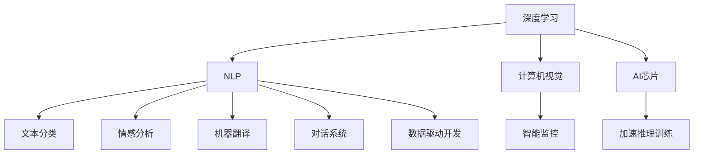

                 

# 软件 2.0 的应用：从实验室走向现实

## 1. 背景介绍

随着科技的快速进步，软件已经从以代码为中心的传统软件1.0（Software 1.0）向以数据和算法为中心的软件2.0（Software 2.0）转变。软件2.0以深度学习、自然语言处理等AI技术为驱动，将算法和数据紧密结合，极大地提升了软件的智能化水平和用户体验。本文将深入探讨软件2.0的应用，从实验室走向现实，剖析其原理与技术细节，并展望未来发展。

## 2. 核心概念与联系

### 2.1 核心概念概述

在软件2.0时代，深度学习、自然语言处理、计算机视觉等技术被广泛应用于软件的开发和优化中。以下是几个核心概念：

- **深度学习（Deep Learning）**：通过多层神经网络进行复杂的模式识别和预测，在图像识别、语音识别、自然语言处理等领域大放异彩。
- **自然语言处理（NLP）**：研究如何使计算机理解和处理人类语言，包括文本分类、情感分析、机器翻译、对话系统等任务。
- **计算机视觉（CV）**：利用计算机算法来解析和理解图像和视频，广泛应用于物体识别、人脸识别、图像处理等领域。
- **AI芯片（AI Chip）**：专门用于加速AI计算任务的芯片，如GPU、TPU等，极大地提升了AI算法的计算效率。
- **API（Application Programming Interface）**：提供程序与软件组件之间的接口，使不同软件系统之间可以高效互操作。

### 2.2 核心概念联系

这些核心概念通过数据和算法相连接，共同构建了软件2.0的生态系统。以自然语言处理为例，其依赖大量的文本数据进行训练，并通过深度学习算法提取语言特征，进而实现情感分析、文本分类、机器翻译等任务。而计算机视觉则通过深度学习算法，利用图像数据进行物体检测、识别和分割，从而实现智能监控、人脸识别等应用。AI芯片则提供了强大的计算能力，加速了深度学习和计算机视觉算法的推理和训练。API则提供了一个统一的接口，使不同软件组件之间的交互更加高效和灵活。

这些概念之间的联系可以通过以下Mermaid流程图来展示：



## 3. 核心算法原理 & 具体操作步骤

### 3.1 算法原理概述

软件2.0的核心算法原理基于数据驱动的深度学习与优化，其基本流程如下：

1. **数据准备**：收集、清洗和标注大量相关领域的数据。
2. **模型训练**：使用深度学习算法在准备好的数据集上训练模型，得到参数初值。
3. **模型评估**：在验证集上评估模型的性能，进行参数微调。
4. **模型部署**：将训练好的模型部署到实际应用场景中，进行推理和优化。

### 3.2 算法步骤详解

以下是软件2.0的核心算法步骤详解：

1. **数据预处理**：
    - 数据清洗：去除噪声、缺失值和异常值。
    - 数据增强：通过数据扩充和增强技术，如旋转、缩放、裁剪等，增加数据多样性。
    - 数据标准化：将数据按一定规则标准化，便于模型训练。

2. **模型选择与构建**：
    - 选择合适的深度学习框架，如TensorFlow、PyTorch等。
    - 设计合适的模型结构，如卷积神经网络（CNN）、循环神经网络（RNN）、Transformer等。
    - 初始化模型参数。

3. **模型训练**：
    - 划分训练集、验证集和测试集。
    - 定义损失函数和优化器。
    - 设置训练轮数和学习率。
    - 在训练集上进行前向传播和反向传播，更新模型参数。
    - 在验证集上定期评估模型性能，防止过拟合。

4. **模型评估与优化**：
    - 在测试集上评估模型性能，使用准确率、召回率、F1分数等指标。
    - 根据评估结果，调整模型结构、超参数或使用正则化技术，提升模型性能。

5. **模型部署与优化**：
    - 将模型部署到实际应用环境中，如服务器、移动设备等。
    - 进行实时监控和优化，根据实际数据反馈调整模型参数。

### 3.3 算法优缺点

**优点**：
- 数据驱动：使用大量数据训练模型，能够更好地捕捉真实世界的复杂性和多样性。
- 自动优化：深度学习算法具有自适应能力，能够自动调整参数以优化模型性能。
- 可扩展性强：随着计算资源的增加，可以处理更大规模的数据和更复杂的模型。

**缺点**：
- 数据依赖性强：需要大量高质量标注数据，数据获取和标注成本较高。
- 模型复杂度高：深度学习模型结构复杂，训练和推理过程较为耗时。
- 可解释性差：深度学习模型通常被视为“黑盒”，难以解释其内部决策过程。

### 3.4 算法应用领域

软件2.0广泛应用于以下领域：

- **医疗健康**：通过自然语言处理技术，自动化处理病历、医学文献，提供智能诊断和辅助决策。
- **金融服务**：利用深度学习算法进行风险评估、信用评分、智能投顾等。
- **智能制造**：通过计算机视觉和自然语言处理技术，实现智能质检、生产调度、客户服务。
- **自动驾驶**：结合计算机视觉、深度学习技术，实现环境感知、路径规划和决策。
- **智能家居**：通过自然语言处理和计算机视觉，实现语音助手、人脸识别、智能家电控制等。

## 4. 数学模型和公式 & 详细讲解 & 举例说明

### 4.1 数学模型构建

软件2.0的数学模型构建通常基于以下步骤：

1. **数据集准备**：收集、清洗和标注数据集。
2. **模型定义**：选择合适的模型结构和参数初始化。
3. **损失函数定义**：定义模型输出的损失函数。
4. **优化算法定义**：选择合适的优化器，如梯度下降、Adam等。
5. **模型训练**：在训练集上进行前向传播和反向传播，更新模型参数。
6. **模型评估**：在验证集上评估模型性能。
7. **模型部署**：将模型部署到实际应用中，进行推理和优化。

### 4.2 公式推导过程

以深度学习中的卷积神经网络（CNN）为例，其基本结构包括卷积层、池化层、全连接层等。下面推导卷积层和池化层的数学公式：

**卷积层**：

$$
\begin{align*}
H &= Conv(W \cdot X + b) \\
&= \sum_{i=1}^{h}\sum_{j=1}^{w}\sum_{k=1}^{c}W_{i,j,k} \cdot X_{i,j,k} + b \\
&= \sum_{i=1}^{h}\sum_{j=1}^{w}\sum_{k=1}^{c}W_{i,j,k} \cdot X_{i',j',k} + b
\end{align*}
$$

其中，$W$ 为卷积核权重，$X$ 为输入数据，$b$ 为偏置项，$H$ 为输出特征图。

**池化层**：

$$
\begin{align*}
H &= MaxPooling(X) \\
&= \max_{i=1}^{h}\max_{j=1}^{w}X_{i',j'}
\end{align*}
$$

其中，$X$ 为输入数据，$H$ 为输出特征图。

### 4.3 案例分析与讲解

**文本分类案例**：

- **数据集准备**：收集和标注文本数据集，如新闻、评论等。
- **模型定义**：使用卷积神经网络（CNN）作为文本分类模型。
- **损失函数定义**：使用交叉熵损失函数。
- **优化算法定义**：使用Adam优化器。
- **模型训练**：在训练集上进行前向传播和反向传播，更新模型参数。
- **模型评估**：在验证集上评估模型性能。
- **模型部署**：将模型部署到实际应用中，进行推理和优化。

## 5. 项目实践：代码实例和详细解释说明

### 5.1 开发环境搭建

1. **安装Python**：从官网下载并安装Python，建议选择最新版本。
2. **安装深度学习框架**：安装TensorFlow、PyTorch等深度学习框架，推荐使用pip安装。
3. **安装数据处理工具**：安装Pandas、NumPy等数据处理工具。
4. **安装模型部署工具**：安装Flask、Django等模型部署工具。

### 5.2 源代码详细实现

以下是一个简单的文本分类项目的代码实现：

```python
import pandas as pd
import numpy as np
from sklearn.model_selection import train_test_split
from tensorflow.keras.models import Sequential
from tensorflow.keras.layers import Dense, Dropout, Embedding, Conv1D, GlobalMaxPooling1D
from tensorflow.keras.preprocessing.text import Tokenizer
from tensorflow.keras.preprocessing.sequence import pad_sequences

# 数据预处理
data = pd.read_csv('data.csv')
X = data['text'].tolist()
y = data['label'].tolist()

# 文本向量化
tokenizer = Tokenizer()
tokenizer.fit_on_texts(X)
X = tokenizer.texts_to_sequences(X)
X = pad_sequences(X)

# 划分训练集和验证集
X_train, X_val, y_train, y_val = train_test_split(X, y, test_size=0.2, random_state=42)

# 定义模型
model = Sequential()
model.add(Embedding(len(tokenizer.word_index) + 1, 128, input_length=X_train[0].shape[1]))
model.add(Conv1D(64, 5, activation='relu'))
model.add(GlobalMaxPooling1D())
model.add(Dense(1, activation='sigmoid'))

# 编译模型
model.compile(optimizer='adam', loss='binary_crossentropy', metrics=['accuracy'])

# 训练模型
model.fit(X_train, y_train, epochs=10, batch_size=32, validation_data=(X_val, y_val))

# 评估模型
loss, acc = model.evaluate(X_val, y_val)
print(f'Loss: {loss}, Accuracy: {acc}')

# 部署模型
import flask
app = flask.Flask(__name__)
@app.route('/')
def classify():
    text = flask.request.args.get('text')
    prediction = model.predict(np.array([tokenizer.texts_to_sequences([text])]))
    return str(prediction[0][0])
```

### 5.3 代码解读与分析

**数据预处理**：
- 使用Pandas读取CSV数据集。
- 使用Numpy和Scikit-Learn进行数据向量化和划分。

**模型定义**：
- 使用Keras定义卷积神经网络模型。
- 添加嵌入层、卷积层和全局最大池化层。
- 添加全连接层和sigmoid激活函数。

**模型编译和训练**：
- 使用Keras编译模型，设置优化器和损失函数。
- 使用fit方法训练模型，设置训练轮数和批大小。
- 在验证集上评估模型性能。

**模型部署**：
- 使用Flask创建API接口，接收文本输入并返回预测结果。

## 6. 实际应用场景

### 6.1 医疗健康

在医疗健康领域，软件2.0可以广泛应用于医学图像处理、病历分析和智能诊断等方面。例如，利用深度学习技术对医学影像进行自动标注和分类，加速医生诊断；通过自然语言处理技术，自动处理和分析电子病历，提供智能辅助诊断。

### 6.2 金融服务

在金融服务领域，软件2.0可以用于信用评分、风险评估、智能投顾等。例如，利用深度学习技术分析客户行为数据，提供个性化的金融服务；通过自然语言处理技术，自动处理金融新闻和报告，提取关键信息。

### 6.3 智能制造

在智能制造领域，软件2.0可以用于智能质检、生产调度和客户服务等方面。例如，利用计算机视觉技术，自动检测产品缺陷，提高生产效率；通过自然语言处理技术，自动处理客户服务请求，提升客户满意度。

### 6.4 未来应用展望

未来，软件2.0将进一步发展，向软件3.0（Software 3.0）迈进，实现更加智能化和自主化的应用。以下是几个可能的方向：

- **自适应学习**：软件2.0能够自动调整模型参数和结构，以适应新的数据和任务。
- **多模态融合**：软件2.0能够融合文本、图像、语音等多模态数据，提供更加全面的信息处理能力。
- **人机协同**：软件2.0能够与人类进行更自然、更高效的交互，实现智能辅助和决策支持。
- **跨领域应用**：软件2.0能够跨越不同领域，实现跨领域的知识迁移和应用。

## 7. 工具和资源推荐

### 7.1 学习资源推荐

1. **TensorFlow官方文档**：包含TensorFlow框架的全面介绍和示例代码，适合初学者和进阶者。
2. **PyTorch官方文档**：包含PyTorch框架的全面介绍和示例代码，适合深度学习研究人员和开发者。
3. **Keras官方文档**：包含Keras框架的全面介绍和示例代码，适合快速构建和训练深度学习模型。
4. **斯坦福大学CS231n课程**：介绍计算机视觉领域的深度学习技术，包含丰富的课程讲义和代码实现。
5. **Coursera深度学习专项课程**：由深度学习专家Andrew Ng主讲，涵盖深度学习基础和应用，适合深度学习初学者。

### 7.2 开发工具推荐

1. **TensorFlow**：由Google开发，支持深度学习模型的构建和训练，广泛应用于学术和工业界。
2. **PyTorch**：由Facebook开发，支持动态图计算和模型构建，广泛应用于深度学习研究。
3. **Keras**：基于TensorFlow和Theano等框架，提供简单易用的深度学习API，适合快速构建模型。
4. **Jupyter Notebook**：提供交互式的代码编写和执行环境，适合数据科学家和深度学习研究人员。
5. **GitHub**：提供代码托管和版本控制服务，适合协作开发和代码管理。

### 7.3 相关论文推荐

1. **《深度学习》（Goodfellow et al., 2016）**：介绍深度学习的基础理论和应用，是深度学习领域的经典教材。
2. **《自然语言处理综述》（Zhou et al., 2017）**：综述自然语言处理领域的最新进展和前沿技术，适合自然语言处理研究者。
3. **《计算机视觉》（Russakovsky et al., 2015）**：介绍计算机视觉领域的基础理论和应用，包含丰富的图像识别示例代码。
4. **《TensorFlow实战》（Manning et al., 2017）**：介绍TensorFlow框架的使用和实战案例，适合TensorFlow初学者。
5. **《动手学深度学习》（李沐等，2018）**：介绍深度学习的基础理论和实现细节，提供丰富的代码示例。

## 8. 总结：未来发展趋势与挑战

### 8.1 研究成果总结

软件2.0的应用已经取得了显著的进展，涵盖文本分类、图像识别、语音识别、智能推荐等多个领域。通过深度学习算法和数据驱动的开发模式，软件2.0展示了强大的智能能力。

### 8.2 未来发展趋势

1. **自适应学习**：软件2.0将进一步发展自适应学习技术，自动调整模型参数和结构，以适应新的数据和任务。
2. **多模态融合**：软件2.0将融合文本、图像、语音等多模态数据，提供更加全面的信息处理能力。
3. **人机协同**：软件2.0将与人类进行更自然、更高效的交互，实现智能辅助和决策支持。
4. **跨领域应用**：软件2.0将跨越不同领域，实现跨领域的知识迁移和应用。

### 8.3 面临的挑战

1. **数据获取和标注成本**：高质量标注数据的获取和标注成本较高，限制了软件2.0的应用范围。
2. **模型复杂度**：深度学习模型结构复杂，训练和推理过程较为耗时。
3. **可解释性差**：深度学习模型通常被视为“黑盒”，难以解释其内部决策过程。
4. **鲁棒性不足**：软件2.0的鲁棒性需要进一步提升，以应对复杂的现实场景。

### 8.4 研究展望

未来，软件2.0需要进一步解决数据依赖性、模型复杂度、可解释性等问题，推动其在更广泛的应用场景中落地。通过引入自适应学习、多模态融合、人机协同等技术，软件2.0将实现更加智能化和自主化的应用。

## 9. 附录：常见问题与解答

**Q1: 如何选择合适的深度学习框架？**

A: 根据应用场景和需求选择合适的深度学习框架。TensorFlow适合大规模分布式计算，PyTorch适合灵活的动态图计算，Keras适合快速构建和训练模型。

**Q2: 深度学习模型的可解释性差，如何解决这个问题？**

A: 通过引入可解释性工具，如SHAP、LIME等，可以部分解释深度学习模型的决策过程。同时，可以通过模型简化和特征工程，提高模型的可解释性。

**Q3: 如何处理深度学习模型的过拟合问题？**

A: 使用数据增强、正则化、早停等方法可以缓解深度学习模型的过拟合问题。同时，可以通过模型裁剪和量化等技术，提高模型的计算效率和可部署性。

**Q4: 深度学习模型的训练过程较慢，如何解决？**

A: 使用分布式计算和GPU/TPU等高性能设备可以提高深度学习模型的训练速度。同时，可以优化模型结构，减少不必要的计算，提高训练效率。

**Q5: 如何处理深度学习模型的推理过程较慢？**

A: 使用GPU/TPU等高性能设备可以提高深度学习模型的推理速度。同时，可以优化模型结构，减少计算量和内存消耗，提高推理效率。

---

作者：禅与计算机程序设计艺术 / Zen and the Art of Computer Programming

