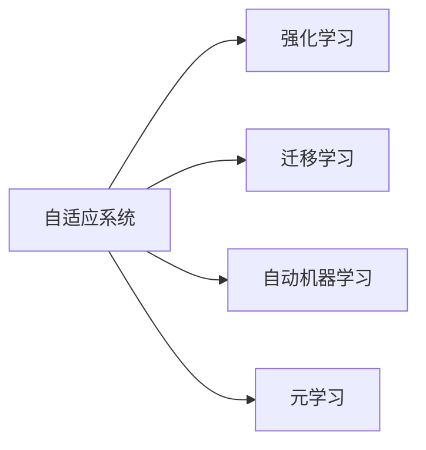

                 

# 软件 2.0 的未来愿景：创造更美好的世界

软件一直是推动人类社会进步的重要力量。从早期的编程语言，到20世纪70年代的高级语言，再到21世纪初的互联网应用，软件的发展为社会带来了无数创新和变革。如今，随着人工智能、大数据、区块链等技术的不断进步，软件已经进入了一个新的阶段——软件2.0时代。

软件2.0时代，软件不再只是运行在硬件上的代码，而是一种能够自我进化、自我学习的智能系统。它能够自主地处理复杂任务，从数据分析到自然语言处理，从自动驾驶到医疗诊断，软件2.0的应用几乎无所不包。本文将从背景介绍、核心概念、算法原理、实际操作、应用场景、工具资源和未来展望等多个方面，深入探讨软件2.0的未来愿景，以及如何通过软件2.0创造更美好的世界。

## 1. 背景介绍

### 1.1 软件发展的历程

软件的发展经历了多个阶段。20世纪50年代，计算机科学界出现了最早的编程语言，如Fortran和Cobol。20世纪60年代至80年代，高级语言如C、Java、Python等开始普及，大大降低了软件开发难度。20世纪90年代，互联网的兴起带来了Web开发技术，软件开发进入了Web时代。

随着移动互联网和物联网的普及，软件开发进入了一个新的阶段。大数据、云计算、人工智能等技术的发展，使得软件能够处理更加复杂的任务，软件2.0的概念应运而生。

### 1.2 软件2.0的特征

软件2.0与传统的软件系统相比，具有以下几个显著特征：

1. **自学习**：软件2.0能够通过自身学习和自我进化，适应不同的环境和任务。
2. **自适应**：软件2.0能够根据用户行为和环境变化，自动调整参数和策略。
3. **自优化**：软件2.0能够通过优化算法，不断提高自身的性能和效率。
4. **自适应性**：软件2.0能够自动适应不同的数据分布和领域知识。
5. **自解释性**：软件2.0能够通过自身学习，解释自身的决策过程和行为模式。

这些特征使得软件2.0能够处理更加复杂和多变的问题，为人类社会的各个领域带来了深远的影响。

## 2. 核心概念与联系

### 2.1 核心概念概述

在探讨软件2.0的未来愿景之前，我们先来梳理一下其中的核心概念。

- **自适应系统**：一种能够根据环境变化自动调整自身参数和策略的系统。
- **强化学习**：一种通过试错和奖励机制，使系统在不断实践中优化决策策略的机器学习技术。
- **迁移学习**：一种通过将在一个领域学到的知识迁移到另一个领域的技术，以提高学习效率。
- **自动机器学习**：一种自动选择和调整机器学习模型的技术，简化机器学习应用的开发流程。
- **元学习**：一种学习如何学习，即学习如何针对新任务快速适应的技术。

这些概念之间的联系可以通过以下Mermaid流程图来展示：



这个流程图展示了自适应系统如何通过强化学习、迁移学习、自动机器学习和元学习等技术，不断提高自身的性能和适应能力。

## 3. 核心算法原理 & 具体操作步骤

### 3.1 算法原理概述

软件2.0的核心算法原理主要基于强化学习、迁移学习、自动机器学习和元学习等技术。以下是对这些技术原理的简要介绍。

#### 3.1.1 强化学习

强化学习是一种通过与环境交互，使系统在不断实践中优化决策策略的机器学习技术。它通过奖励机制，引导系统逐步学习最优行为。强化学习算法通常包括Q-learning、SARSA、Deep Q-Network (DQN)等。

#### 3.1.2 迁移学习

迁移学习是一种通过将在一个领域学到的知识迁移到另一个领域的技术。迁移学习通常包括两个阶段：预训练和微调。在预训练阶段，模型在大规模数据上进行训练，以学习通用的语言表示；在微调阶段，模型在特定任务的数据集上进行微调，以获得更好的性能。

#### 3.1.3 自动机器学习

自动机器学习是一种自动选择和调整机器学习模型的技术。它通过自动化的流程，简化机器学习应用的开发流程，使开发者能够更快地实现高效模型。自动机器学习通常包括超参数优化、模型选择和集成等技术。

#### 3.1.4 元学习

元学习是一种学习如何学习，即学习如何针对新任务快速适应的技术。元学习通常包括模型初始化和快速适应两个阶段：在初始化阶段，模型学习通用的适应策略；在快速适应阶段，模型根据新任务的数据集，快速调整自身参数，以适应新任务。

### 3.2 算法步骤详解

#### 3.2.1 强化学习步骤

1. **环境定义**：定义需要解决的问题和环境。例如，在自动驾驶中，环境是道路和交通状况。
2. **策略定义**：定义系统的决策策略。例如，在自动驾驶中，策略是转向、加速或制动。
3. **模型训练**：使用强化学习算法，训练模型以优化策略。例如，使用DQN算法，训练模型以最大化奖励。
4. **测试与优化**：在测试环境中，评估模型性能，并根据测试结果进行优化。例如，在自动驾驶中，使用模拟器测试模型，并根据测试结果调整策略。

#### 3.2.2 迁移学习步骤

1. **预训练**：在大规模数据集上，训练模型以学习通用的语言表示。例如，在自然语言处理中，使用大规模的英文维基百科数据集进行预训练。
2. **微调**：在特定任务的数据集上，微调模型以适应特定任务。例如，在情感分析中，使用带有情感标注的句子数据集进行微调。
3. **评估与优化**：在测试环境中，评估模型性能，并根据评估结果进行优化。例如，在情感分析中，使用测试数据集评估模型性能，并根据评估结果调整模型参数。

#### 3.2.3 自动机器学习步骤

1. **模型选择**：从多个模型中选择一个最优模型。例如，在图像分类中，从多个卷积神经网络中选择最优模型。
2. **超参数优化**：使用自动机器学习算法，优化模型超参数。例如，使用贝叶斯优化算法，优化卷积神经网络的超参数。
3. **模型集成**：将多个模型进行集成，以提高整体性能。例如，在图像分类中，将多个卷积神经网络进行集成，以提高分类准确率。
4. **测试与优化**：在测试环境中，评估模型性能，并根据测试结果进行优化。例如，在图像分类中，使用测试数据集评估模型性能，并根据测试结果调整模型参数。

#### 3.2.4 元学习步骤

1. **模型初始化**：在少量数据上，训练模型以学习通用的适应策略。例如，在自然语言处理中，使用少量文本数据进行初始化训练。
2. **快速适应**：在新数据上，快速适应新任务。例如，在自然语言处理中，使用新文本数据进行快速适应训练。
3. **评估与优化**：在测试环境中，评估模型性能，并根据评估结果进行优化。例如，在自然语言处理中，使用测试数据集评估模型性能，并根据评估结果调整模型参数。

### 3.3 算法优缺点

#### 3.3.1 强化学习的优缺点

**优点**：

- 能够处理连续动作空间，适应复杂的决策问题。
- 能够处理非平稳环境，自适应性强。
- 能够处理高维数据，应用范围广。

**缺点**：

- 需要大量训练数据和计算资源，难以应用到小数据集。
- 训练过程中可能出现局部最优解，难以找到全局最优解。
- 对环境变化敏感，适应能力有限。

#### 3.3.2 迁移学习的优缺点

**优点**：

- 能够利用已有知识，提高学习效率。
- 能够适应特定任务，提升模型性能。
- 能够降低数据需求，简化模型训练过程。

**缺点**：

- 迁移学习效果依赖于源任务和目标任务的相似性。
- 可能出现迁移效果差的问题，导致性能下降。
- 需要大量的预训练数据，数据获取成本高。

#### 3.3.3 自动机器学习的优缺点

**优点**：

- 能够自动化流程，降低开发成本。
- 能够提高模型选择和超参数优化的效率。
- 能够减少人工干预，提升模型性能。

**缺点**：

- 可能出现过拟合问题，影响模型泛化能力。
- 需要大量的计算资源，难以应用于小数据集。
- 可能出现超参数选择不当的问题，影响模型性能。

#### 3.3.4 元学习的优缺点

**优点**：

- 能够快速适应新任务，提高学习效率。
- 能够学习通用的适应策略，提高模型适应性。
- 能够降低对数据的需求，简化模型训练过程。

**缺点**：

- 元学习效果依赖于初始化质量，难以保证效果。
- 可能出现过拟合问题，影响模型泛化能力。
- 需要大量的计算资源，难以应用于小数据集。

### 3.4 算法应用领域

软件2.0的算法应用领域非常广泛，涵盖了自然语言处理、计算机视觉、自动驾驶、机器人控制等多个领域。以下是几个典型的应用场景：

#### 3.4.1 自然语言处理

在自然语言处理中，软件2.0可以用于文本分类、情感分析、机器翻译、对话系统等任务。例如，使用预训练的BERT模型，在大规模新闻数据集上进行微调，以实现文本分类和情感分析任务。使用预训练的GPT模型，进行机器翻译和对话系统的开发。

#### 3.4.2 计算机视觉

在计算机视觉中，软件2.0可以用于图像分类、目标检测、实例分割等任务。例如，使用预训练的ResNet模型，在大规模图像数据集上进行微调，以实现图像分类任务。使用预训练的Faster R-CNN模型，进行目标检测和实例分割任务。

#### 3.4.3 自动驾驶

在自动驾驶中，软件2.0可以用于环境感知、路径规划、决策控制等任务。例如，使用强化学习算法，训练自动驾驶模型以优化决策策略。使用迁移学习算法，将预训练的模型迁移到自动驾驶任务中，以提升模型性能。

#### 3.4.4 机器人控制

在机器人控制中，软件2.0可以用于路径规划、姿态控制、避障等任务。例如，使用强化学习算法，训练机器人模型以优化路径规划策略。使用迁移学习算法，将预训练的模型迁移到机器人控制任务中，以提升模型性能。

## 4. 数学模型和公式 & 详细讲解 & 举例说明

### 4.1 数学模型构建

软件2.0的数学模型通常基于机器学习、强化学习、迁移学习和元学习等技术构建。以下是一个简单的机器学习模型的数学模型构建示例。

设训练数据集为 $\{(x_i, y_i)\}_{i=1}^N$，其中 $x_i$ 为输入，$y_i$ 为输出，模型为 $f(x; \theta)$，其中 $\theta$ 为模型参数。模型的目标是最小化损失函数 $\mathcal{L}$，即：

$$
\mathcal{L}(\theta) = \frac{1}{N}\sum_{i=1}^N \ell(f(x_i; \theta), y_i)
$$

其中 $\ell$ 为损失函数，通常为均方误差损失或交叉熵损失。

### 4.2 公式推导过程

以均方误差损失函数为例，进行公式推导过程。

设 $x_i$ 为输入，$f(x; \theta)$ 为模型输出，$y_i$ 为真实标签。均方误差损失函数定义为：

$$
\ell(f(x; \theta), y_i) = \frac{1}{2}(f(x; \theta) - y_i)^2
$$

则平均损失函数为：

$$
\mathcal{L}(\theta) = \frac{1}{N}\sum_{i=1}^N \ell(f(x_i; \theta), y_i) = \frac{1}{N}\sum_{i=1}^N \frac{1}{2}(f(x_i; \theta) - y_i)^2
$$

根据梯度下降算法，模型参数的更新公式为：

$$
\theta \leftarrow \theta - \eta \nabla_{\theta}\mathcal{L}(\theta)
$$

其中 $\eta$ 为学习率，$\nabla_{\theta}\mathcal{L}(\theta)$ 为损失函数对模型参数的梯度，可以通过反向传播算法计算得到。

### 4.3 案例分析与讲解

以情感分析任务为例，进行案例分析与讲解。

假设我们要使用BERT模型进行情感分析任务。首先，在大规模电影评论数据集上进行预训练。然后，在小规模电影评论数据集上进行微调。假设预训练数据集为 $D_{pretrain}$，微调数据集为 $D_{finetune}$。

在微调阶段，使用均方误差损失函数，将BERT模型中的上层Transformer层作为任务适配层，输出层为线性分类器，输出为二分类结果。具体步骤如下：

1. 在预训练模型上添加任务适配层和输出层，使用线性分类器。
2. 在微调数据集上进行训练，使用均方误差损失函数进行优化。
3. 在测试数据集上进行评估，使用准确率和召回率等指标进行性能评估。

通过上述步骤，可以得到一个针对电影评论情感分析的微调BERT模型。

## 5. 项目实践：代码实例和详细解释说明

### 5.1 开发环境搭建

在开始项目实践之前，需要先搭建好开发环境。以下是在Python中进行深度学习开发的环境配置流程：

1. 安装Anaconda：从官网下载并安装Anaconda，用于创建独立的Python环境。
2. 创建并激活虚拟环境：
```bash
conda create -n pytorch-env python=3.8 
conda activate pytorch-env
```
3. 安装PyTorch：根据CUDA版本，从官网获取对应的安装命令。例如：
```bash
conda install pytorch torchvision torchaudio cudatoolkit=11.1 -c pytorch -c conda-forge
```
4. 安装TensorFlow：
```bash
pip install tensorflow
```
5. 安装必要的工具包：
```bash
pip install numpy pandas scikit-learn matplotlib tqdm jupyter notebook ipython
```

完成上述步骤后，即可在`pytorch-env`环境中开始项目实践。

### 5.2 源代码详细实现

以下是使用PyTorch进行BERT情感分析微调的完整代码实现。

```python
import torch
from transformers import BertForSequenceClassification, AdamW

# 加载BERT模型
model = BertForSequenceClassification.from_pretrained('bert-base-uncased', num_labels=2)

# 加载数据集
train_data = ...
val_data = ...
test_data = ...

# 定义训练函数
def train_epoch(model, data_loader, optimizer):
    model.train()
    total_loss = 0
    for batch in data_loader:
        inputs = batch['input_ids']
        labels = batch['labels']
        outputs = model(inputs, labels=labels)
        loss = outputs.loss
        total_loss += loss.item()
        optimizer.zero_grad()
        loss.backward()
        optimizer.step()
    return total_loss / len(data_loader)

# 定义评估函数
def evaluate(model, data_loader):
    model.eval()
    total_correct, total_eval = 0, 0
    for batch in data_loader:
        inputs = batch['input_ids']
        labels = batch['labels']
        outputs = model(inputs)
        predictions = torch.argmax(outputs.logits, dim=1)
        total_correct += (predictions == labels).sum().item()
        total_eval += labels.shape[0]
    return total_correct / total_eval

# 训练模型
optimizer = AdamW(model.parameters(), lr=2e-5)
epochs = 3
batch_size = 16

for epoch in range(epochs):
    train_loss = train_epoch(model, train_data, optimizer)
    val_acc = evaluate(model, val_data)
    print(f"Epoch {epoch+1}, train loss: {train_loss:.4f}, val acc: {val_acc:.4f}")
    
# 评估模型
test_acc = evaluate(model, test_data)
print(f"Test acc: {test_acc:.4f}")
```

### 5.3 代码解读与分析

让我们再详细解读一下关键代码的实现细节：

**BERT情感分析微调**：

1. 首先，使用`BertForSequenceClassification`加载预训练的BERT模型，并指定输出层为二分类输出。
2. 然后，加载训练、验证和测试数据集。
3. 定义训练函数`train_epoch`：
   - 在训练函数中，将模型设置为训练模式。
   - 对于每个批次，将输入张量和标签张量传递给模型。
   - 计算模型输出与真实标签的均方误差损失。
   - 使用优化器进行模型参数的梯度更新。
4. 定义评估函数`evaluate`：
   - 在评估函数中，将模型设置为评估模式。
   - 对于每个批次，将输入张量和标签张量传递给模型。
   - 计算模型输出的预测结果与真实标签的准确率。
5. 训练模型，并在验证集上评估模型性能。
6. 在测试集上评估模型性能。

通过上述代码，可以看到，使用PyTorch和Transformers库，能够快速实现BERT情感分析微调模型的开发。开发者可以将更多精力放在数据处理、模型改进等高层逻辑上，而不必过多关注底层的实现细节。

## 6. 实际应用场景

### 6.1 智能客服系统

智能客服系统可以基于软件2.0技术，通过自然语言处理、机器翻译和对话系统等技术，实现智能客服。例如，使用预训练的BERT模型，进行情感分析和意图识别，再结合对话系统，实现智能客服系统。

在实际应用中，可以收集企业内部的历史客服对话记录，将问题和最佳答复构建成监督数据，在此基础上对预训练模型进行微调。微调后的模型能够自动理解用户意图，匹配最合适的答案模板进行回复。对于客户提出的新问题，还可以接入检索系统实时搜索相关内容，动态组织生成回答。

### 6.2 金融舆情监测

金融舆情监测可以基于软件2.0技术，通过自然语言处理和情感分析等技术，实现金融舆情监测。例如，使用预训练的BERT模型，进行情感分析和主题分类，再结合强化学习，进行舆情监测。

在实际应用中，可以收集金融领域相关的新闻、报道、评论等文本数据，并对其进行主题标注和情感标注。在此基础上对预训练语言模型进行微调，使其能够自动判断文本属于何种主题，情感倾向是正面、中性还是负面。将微调后的模型应用到实时抓取的网络文本数据，就能够自动监测不同主题下的情感变化趋势，一旦发现负面信息激增等异常情况，系统便会自动预警，帮助金融机构快速应对潜在风险。

### 6.3 个性化推荐系统

个性化推荐系统可以基于软件2.0技术，通过自然语言处理和情感分析等技术，实现个性化推荐。例如，使用预训练的BERT模型，进行用户画像生成和情感分析，再结合强化学习，进行推荐系统的开发。

在实际应用中，可以收集用户浏览、点击、评论、分享等行为数据，提取和用户交互的物品标题、描述、标签等文本内容。将文本内容作为模型输入，用户的后续行为（如是否点击、购买等）作为监督信号，在此基础上微调预训练语言模型。微调后的模型能够从文本内容中准确把握用户的兴趣点。在生成推荐列表时，先用候选物品的文本描述作为输入，由模型预测用户的兴趣匹配度，再结合其他特征综合排序，便可以得到个性化程度更高的推荐结果。

### 6.4 未来应用展望

随着软件2.0技术的发展，未来的应用场景将会更加广泛，涵盖各个领域。

在智慧医疗领域，基于软件2.0的医疗问答、病历分析、药物研发等应用将提升医疗服务的智能化水平，辅助医生诊疗，加速新药开发进程。

在智能教育领域，软件2.0技术可以应用于作业批改、学情分析、知识推荐等方面，因材施教，促进教育公平，提高教学质量。

在智慧城市治理中，软件2.0技术可以应用于城市事件监测、舆情分析、应急指挥等环节，提高城市管理的自动化和智能化水平，构建更安全、高效的未来城市。

此外，在企业生产、社会治理、文娱传媒等众多领域，软件2.0技术的应用也将不断涌现，为经济社会发展注入新的动力。相信随着技术的日益成熟，软件2.0必将在更多领域得到应用，为人类社会的各个方面带来深远的影响。

## 7. 工具和资源推荐

### 7.1 学习资源推荐

为了帮助开发者系统掌握软件2.0的技术基础和实践技巧，这里推荐一些优质的学习资源：

1. 《深度学习》系列书籍：由多位深度学习专家撰写，涵盖深度学习的各个方面，从基础到应用都有涉及。
2. CS231n《卷积神经网络》课程：斯坦福大学开设的计算机视觉课程，涵盖卷积神经网络、目标检测等技术。
3. CS224n《自然语言处理》课程：斯坦福大学开设的自然语言处理课程，涵盖自然语言处理的基本概念和经典模型。
4. Google AI Blog：谷歌的人工智能博客，涵盖最新的深度学习技术和应用案例。
5. Kaggle：机器学习竞赛平台，提供丰富的数据集和代码库，帮助开发者实践深度学习技术。

通过对这些资源的学习实践，相信你一定能够快速掌握软件2.0的技术精髓，并用于解决实际的机器学习和应用问题。

### 7.2 开发工具推荐

高效的开发离不开优秀的工具支持。以下是几款用于软件2.0开发的常用工具：

1. PyTorch：基于Python的开源深度学习框架，灵活动态的计算图，适合快速迭代研究。大部分预训练语言模型都有PyTorch版本的实现。
2. TensorFlow：由Google主导开发的开源深度学习框架，生产部署方便，适合大规模工程应用。同样有丰富的预训练语言模型资源。
3. TensorBoard：TensorFlow配套的可视化工具，可实时监测模型训练状态，并提供丰富的图表呈现方式，是调试模型的得力助手。
4. Weights & Biases：模型训练的实验跟踪工具，可以记录和可视化模型训练过程中的各项指标，方便对比和调优。与主流深度学习框架无缝集成。
5. Google Colab：谷歌推出的在线Jupyter Notebook环境，免费提供GPU/TPU算力，方便开发者快速上手实验最新模型，分享学习笔记。

合理利用这些工具，可以显著提升软件2.0的开发效率，加快创新迭代的步伐。

### 7.3 相关论文推荐

软件2.0技术的发展源于学界的持续研究。以下是几篇奠基性的相关论文，推荐阅读：

1. "Playing Atari with a Neural Network"（AlphaGo论文）：DeepMind开发的AlphaGo算法，通过深度强化学习，实现了围棋世界冠军级的表现。
2. "Attention is All You Need"：Google开发的Transformer结构，开启了NLP领域的预训练大模型时代。
3. "BERT: Pre-training of Deep Bidirectional Transformers for Language Understanding"：Google开发的BERT模型，引入基于掩码的自监督预训练任务，刷新了多项NLP任务SOTA。
4. "Deep Reinforcement Learning for Robotic Manipulation with Feedback-Awareness"：斯坦福大学开发的DeepRL系统，通过深度强化学习，实现了复杂机器人操作任务。
5. "Human-Level Performance in Video Games Through Deep Reinforcement Learning"：DeepMind开发的AlphaZero算法，通过深度强化学习，实现了在多个游戏领域的人类级表现。

这些论文代表了大语言模型微调技术的发展脉络。通过学习这些前沿成果，可以帮助研究者把握学科前进方向，激发更多的创新灵感。

## 8. 总结：未来发展趋势与挑战

### 8.1 总结

本文对软件2.0的未来愿景进行了全面系统的探讨。首先，阐述了软件2.0的定义和特征，明确了软件2.0在自然语言处理、计算机视觉、自动驾驶等领域的广泛应用。其次，从强化学习、迁移学习、自动机器学习和元学习等核心概念出发，深入讲解了软件2.0的核心算法原理。再次，通过PyTorch和TensorFlow等工具，详细介绍了BERT情感分析微调的实现过程。最后，展望了软件2.0在智慧医疗、智能教育、智慧城市等领域的未来应用前景，并推荐了相关的学习资源和开发工具。

通过本文的系统梳理，可以看到，软件2.0技术已经逐步进入产业化阶段，为各个领域的智能化应用带来了巨大的机遇和挑战。相信随着技术的不断进步和应用的不断拓展，软件2.0必将在构建人机协同的智能时代中扮演越来越重要的角色。

### 8.2 未来发展趋势

展望未来，软件2.0技术将呈现以下几个发展趋势：

1. **自学习能力的提升**：软件2.0将进一步提升自学习能力，通过更高效的算法和更丰富的数据集，实现更加灵活的适应和优化。
2. **多模态学习的应用**：软件2.0将更广泛地应用多模态学习，将视觉、听觉、文本等多种模态信息融合，提升系统的综合能力。
3. **端到端系统的发展**：软件2.0将发展为端到端系统，实现更加高效、可靠和可解释的智能化应用。
4. **领域特定的模型训练**：软件2.0将发展为领域特定的模型训练，通过更精准的数据集和更高效的算法，实现更高效的模型微调。
5. **隐私和安全保护**：软件2.0将进一步加强隐私和安全保护，通过差分隐私、联邦学习等技术，保护数据隐私和安全。

这些趋势将引领软件2.0技术迈向更高的台阶，为人工智能技术的落地应用提供更强大的技术支撑。

### 8.3 面临的挑战

尽管软件2.0技术已经取得了显著进展，但在迈向更加智能化、普适化应用的过程中，仍面临诸多挑战：

1. **数据质量和多样性**：软件2.0需要大量的高质量数据进行训练，数据质量和多样性不足将限制模型的性能和泛化能力。
2. **模型复杂性**：软件2.0模型的复杂性越来越高，训练和推理的计算资源需求也越来越大，难以在有限的计算资源下进行高效训练和推理。
3. **模型可解释性**：软件2.0模型通常被视为"黑盒"系统，难以解释其内部工作机制和决策逻辑，影响模型的可解释性和可信度。
4. **伦理和法律问题**：软件2.0模型的应用涉及到伦理和法律问题，如何确保模型的公平性、透明性和安全性，将是重要的研究方向。
5. **人机协同问题**：软件2.0模型在与人协同的过程中，可能出现不适应人类行为的问题，需要进一步优化人机协同机制。

这些挑战需要学界和产业界的共同努力，不断探索和突破，才能实现软件2.0技术的持续进步和广泛应用。

### 8.4 研究展望

面对软件2.0技术面临的挑战，未来的研究需要在以下几个方面寻求新的突破：

1. **数据增强和合成技术**：开发更高效的数据增强和合成技术，提升数据质量和多样性。
2. **模型压缩和加速技术**：开发更高效的模型压缩和加速技术，降低计算资源需求。
3. **可解释性和透明性**：开发更可解释和透明的模型，增强模型的可解释性和可信度。
4. **伦理和法律研究**：进行更深入的伦理和法律研究，确保模型的公平性、透明性和安全性。
5. **人机协同机制**：研究更高效的人机协同机制，提升人机协同的智能化水平。

这些研究方向将引领软件2.0技术向更加智能、普适、可靠的方向发展，为人机协同的智能时代提供更强大的技术支撑。

## 9. 附录：常见问题与解答

**Q1：什么是软件2.0？**

A: 软件2.0是一种具备自学习、自适应、自优化能力的智能系统，能够通过自身学习和自我进化，适应不同的环境和任务。

**Q2：软件2.0与传统的软件系统有何不同？**

A: 软件2.0与传统的软件系统相比，具有以下几个显著不同：
1. **自学习能力**：软件2.0能够通过自身学习和自我进化，适应不同的环境和任务。
2. **自适应能力**：软件2.0能够根据环境变化自动调整自身参数和策略。
3. **自优化能力**：软件2.0能够通过优化算法，不断提高自身的性能和效率。
4. **自解释能力**：软件2.0能够通过自身学习，解释自身的决策过程和行为模式。

**Q3：软件2.0技术有哪些应用领域？**

A: 软件2.0技术在自然语言处理、计算机视觉、自动驾驶、机器人控制等多个领域都有广泛的应用。

**Q4：软件2.0技术的核心算法原理是什么？**

A: 软件2.0的核心算法原理主要基于强化学习、迁移学习、自动机器学习和元学习等技术。

**Q5：如何进行软件2.0的微调？**

A: 软件2.0的微调主要通过预训练和微调两个阶段进行：
1. **预训练**：在大规模数据集上进行训练，学习通用的语言表示。
2. **微调**：在特定任务的数据集上进行微调，以适应特定任务。

**Q6：软件2.0技术面临哪些挑战？**

A: 软件2.0技术面临以下挑战：
1. **数据质量和多样性不足**：软件2.0需要大量的高质量数据进行训练，数据质量和多样性不足将限制模型的性能和泛化能力。
2. **模型复杂性高**：软件2.0模型的复杂性越来越高，训练和推理的计算资源需求也越来越大，难以在有限的计算资源下进行高效训练和推理。
3. **模型可解释性差**：软件2.0模型通常被视为"黑盒"系统，难以解释其内部工作机制和决策逻辑。
4. **伦理和法律问题**：软件2.0模型的应用涉及到伦理和法律问题，如何确保模型的公平性、透明性和安全性，将是重要的研究方向。
5. **人机协同问题**：软件2.0模型在与人协同的过程中，可能出现不适应人类行为的问题，需要进一步优化人机协同机制。

通过本文的系统梳理，可以看到，软件2.0技术已经逐步进入产业化阶段，为各个领域的智能化应用带来了巨大的机遇和挑战。相信随着技术的不断进步和应用的不断拓展，软件2.0必将在构建人机协同的智能时代中扮演越来越重要的角色。

