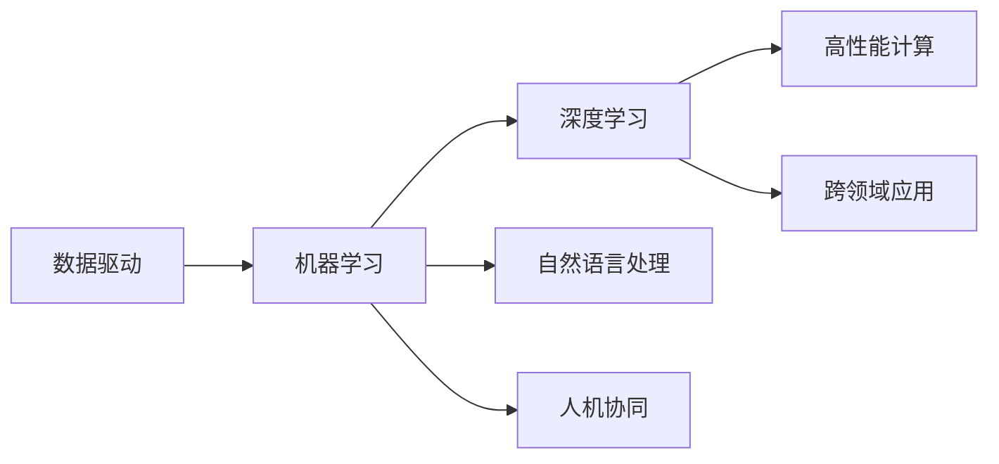

                 

# 软件 2.0 的未来愿景：创造更美好的世界

## 1. 背景介绍

### 1.1 问题由来

软件的发展经历了从软件 1.0 到软件 2.0 的重大变革。软件 1.0 时代的程序开发以功能为中心，通过编写代码实现特定功能，开发者需要明确指定输入、处理和输出过程。然而，软件 2.0 时代的到来，将软件从功能为中心转向数据为中心，使得软件系统能够自动学习并优化。

这种转变不仅仅是技术的进步，更是社会发展的需要。在数据驱动的现代社会，软件 2.0 具备高度的自动化能力，能够更加灵活地应对不断变化的环境和需求，帮助人们更加高效地处理和分析海量数据，驱动经济发展和社会进步。

### 1.2 问题核心关键点

软件 2.0 的核心关键点在于其强大的学习和优化能力。其背后依赖于机器学习、深度学习、自然语言处理等先进技术，使得软件系统能够从数据中学习并自动生成更加优化的解决方案。以下是软件 2.0 的关键要素：

1. **数据驱动**：软件 2.0 的开发和优化以数据为基础，通过大量标注数据进行模型训练，实现自动化的优化。
2. **学习与优化**：软件 2.0 具备自动学习和优化的能力，能够不断从新数据中学习和优化。
3. **高性能计算**：大规模数据和高性能计算能力使得软件 2.0 能够处理复杂的任务和数据。
4. **人机协同**：软件 2.0 系统具备与人类协同工作的能力，可以理解并执行人类的指令。
5. **跨领域应用**：软件 2.0 的应用范围广泛，涵盖医疗、金融、教育等多个领域，具有强大的社会价值。

这些关键点共同构成了软件 2.0 的核心理念和基础。通过理解和掌握这些要素，可以帮助开发者更好地设计和实现软件 2.0 系统，推动社会进步。

### 1.3 问题研究意义

软件 2.0 技术的快速发展，对于推动社会进步具有重要意义：

1. **提升生产效率**：软件 2.0 能够自动学习和优化，极大提升生产效率，降低人力成本。
2. **促进知识共享**：通过软件 2.0 系统，知识得以更高效地共享和传播，推动知识经济的发展。
3. **创新驱动**：软件 2.0 具备高度的创新能力，能够从海量数据中挖掘新知识和模式，驱动技术创新。
4. **优化决策**：软件 2.0 系统能够从数据中提取信息，帮助决策者制定更加科学和精准的决策。
5. **改善用户体验**：软件 2.0 具备高度的智能化，能够理解用户需求，提供个性化服务，改善用户体验。

通过这些方式，软件 2.0 技术将助力人类社会朝着更加智能、高效、可持续的方向发展。

## 2. 核心概念与联系

### 2.1 核心概念概述

软件 2.0 的核心概念包括：

1. **数据驱动**：软件系统能够自动从大量数据中学习和提取信息。
2. **机器学习**：利用算法自动从数据中学习和优化。
3. **深度学习**：通过神经网络模型进行复杂的学习和推理。
4. **自然语言处理**：处理和理解自然语言文本，进行语音识别和语义分析。
5. **高性能计算**：支持大规模数据处理和高性能计算任务。
6. **人机协同**：支持人机交互和协作，实现更加智能的决策和执行。
7. **跨领域应用**：能够在多个领域实现应用，推动社会进步。

这些核心概念之间存在紧密的联系。数据驱动是软件 2.0 的基础，机器学习是其核心技术，深度学习和自然语言处理是其重要的应用方向，高性能计算和跨领域应用是其能力扩展，而人机协同是其社会价值体现。

### 2.2 核心概念原理和架构的 Mermaid 流程图



这个 Mermaid 流程图展示了软件 2.0 核心概念之间的联系。数据驱动提供了基础，机器学习是核心技术，深度学习和自然语言处理是其重要应用方向，高性能计算和跨领域应用是其能力扩展，人机协同是其社会价值体现。

## 3. 核心算法原理 & 具体操作步骤

### 3.1 算法原理概述

软件 2.0 的算法原理以数据为中心，通过机器学习、深度学习等技术实现自动学习和优化。其核心在于：

1. **数据预处理**：将原始数据转化为机器学习算法能够处理的形式。
2. **特征提取**：从数据中提取特征，用于训练模型。
3. **模型训练**：使用训练数据训练模型，使其能够自动学习并优化。
4. **模型评估**：使用测试数据评估模型的性能，调整模型参数。
5. **模型应用**：将训练好的模型应用于实际任务中，进行预测和优化。

### 3.2 算法步骤详解

软件 2.0 的算法步骤包括以下几个关键步骤：

**Step 1: 数据预处理**

1. **数据收集**：收集原始数据，确保数据的多样性和代表性。
2. **数据清洗**：去除数据中的噪声和异常值，确保数据质量。
3. **数据标注**：对数据进行标注，确保数据可被机器学习算法处理。

**Step 2: 特征提取**

1. **特征选择**：根据任务需求选择重要的特征。
2. **特征工程**：对数据进行转换和组合，生成新的特征。

**Step 3: 模型训练**

1. **选择合适的模型**：根据任务需求选择合适的机器学习或深度学习模型。
2. **设置超参数**：设置学习率、批大小、迭代次数等超参数。
3. **训练模型**：使用训练数据训练模型，调整模型参数。

**Step 4: 模型评估**

1. **划分数据集**：将数据集划分为训练集、验证集和测试集。
2. **评估性能**：使用测试集评估模型性能，计算准确率、召回率等指标。
3. **调整模型**：根据评估结果调整模型参数。

**Step 5: 模型应用**

1. **模型部署**：将训练好的模型部署到实际应用中。
2. **数据输入**：输入新数据进行预测和优化。
3. **输出结果**：根据模型输出结果进行决策和优化。

### 3.3 算法优缺点

软件 2.0 的算法优点包括：

1. **高效自动化**：通过自动学习和优化，极大提升生产效率。
2. **高度灵活**：能够适应不断变化的环境和需求。
3. **精度高**：通过大规模数据训练，模型具备高度的预测精度。

其缺点包括：

1. **数据依赖**：对数据依赖性强，数据质量直接影响模型性能。
2. **计算资源需求高**：大规模数据和高性能计算能力需求高。
3. **黑盒性**：模型的决策过程难以解释，缺乏透明性。
4. **过拟合风险**：数据量不足时，模型容易过拟合。

### 3.4 算法应用领域

软件 2.0 的应用领域广泛，包括但不限于：

1. **医疗健康**：通过分析患者数据，自动生成诊断和治疗方案。
2. **金融服务**：通过分析金融数据，自动生成投资和风险评估模型。
3. **教育培训**：通过分析学生数据，自动生成个性化的学习计划和推荐。
4. **智能交通**：通过分析交通数据，自动生成交通管理和优化方案。
5. **智能制造**：通过分析生产数据，自动生成生产优化和维护方案。
6. **智能客服**：通过分析客户数据，自动生成客服应答方案。
7. **智能推荐**：通过分析用户数据，自动生成个性化推荐方案。

这些领域的应用展示了软件 2.0 技术的广泛影响力和巨大潜力。

## 4. 数学模型和公式 & 详细讲解 & 举例说明

### 4.1 数学模型构建

软件 2.0 的数学模型通常基于机器学习和深度学习的框架，如线性回归、逻辑回归、决策树、神经网络等。以下以神经网络为例，介绍其基本数学模型。

神经网络由输入层、隐藏层和输出层组成。设输入层为 $x \in \mathbb{R}^n$，隐藏层为 $h \in \mathbb{R}^m$，输出层为 $y \in \mathbb{R}$。神经网络的数学模型为：

$$
y = \sigma(W_hh + b_h) + \sigma(W_xx + b_x)
$$

其中 $W_h$ 和 $W_x$ 为权重矩阵，$b_h$ 和 $b_x$ 为偏置向量，$\sigma$ 为激活函数。

### 4.2 公式推导过程

以线性回归为例，推导模型参数的更新公式。

设训练数据为 $(x_i, y_i)$，模型为 $y = \theta^Tx$，其中 $\theta$ 为模型参数。目标是最小化均方误差损失函数：

$$
\mathcal{L}(\theta) = \frac{1}{N}\sum_{i=1}^N (y_i - \theta^Tx_i)^2
$$

使用梯度下降法求解 $\theta$，目标是最小化损失函数：

$$
\theta \leftarrow \theta - \eta \nabla_{\theta}\mathcal{L}(\theta)
$$

其中 $\eta$ 为学习率。根据链式法则，损失函数对 $\theta$ 的梯度为：

$$
\nabla_{\theta}\mathcal{L}(\theta) = -\frac{2}{N}\sum_{i=1}^N (y_i - \theta^Tx_i)x_i
$$

将梯度代入更新公式，得到：

$$
\theta \leftarrow \theta - \eta \frac{2}{N}\sum_{i=1}^N (y_i - \theta^Tx_i)x_i
$$

通过不断迭代上述公式，模型参数 $\theta$ 可以逐步逼近最优值，实现自动学习和优化。

### 4.3 案例分析与讲解

以图像识别任务为例，介绍机器学习模型的实现过程。

设输入图像为 $x \in \mathbb{R}^{28\times28}$，输出标签为 $y \in \{0,1\}$，使用卷积神经网络（CNN）模型进行图像识别。模型由多个卷积层和池化层构成，最后一层为全连接层。

设卷积层和全连接层的权重矩阵分别为 $W_1, W_2$，偏置向量分别为 $b_1, b_2$。则模型前向传播过程为：

$$
h_1 = \sigma(W_1x + b_1)
$$

$$
h_2 = \sigma(W_2h_1 + b_2)
$$

$$
y = \sigma(h_2)
$$

其中 $\sigma$ 为激活函数，如 ReLU 函数。

通过训练数据对模型进行训练，最小化损失函数：

$$
\mathcal{L}(\theta) = \frac{1}{N}\sum_{i=1}^N (y_i - \theta^Tx_i)^2
$$

使用梯度下降法求解 $\theta$，得到模型参数的更新公式：

$$
\theta \leftarrow \theta - \eta \nabla_{\theta}\mathcal{L}(\theta)
$$

其中 $\eta$ 为学习率。通过不断迭代，模型参数 $\theta$ 可以逐步逼近最优值，实现自动学习和优化。

## 5. 项目实践：代码实例和详细解释说明

### 5.1 开发环境搭建

为了实现软件 2.0 的算法，需要安装和配置 Python 和相关库，如 TensorFlow、Keras 等。以下是在 Windows 和 Linux 上的安装步骤：

**Windows 安装步骤：**

1. 下载 TensorFlow 和 Keras 安装文件，解压后运行。
2. 在 Python 环境中输入 `pip install tensorflow==2.0.0` 安装 TensorFlow。
3. 在 Python 环境中输入 `pip install keras==2.2.4` 安装 Keras。

**Linux 安装步骤：**

1. 安装 Python 3.7 及以上版本。
2. 安装 pip 工具：在终端输入 `sudo apt-get install python3-pip`。
3. 在 Python 环境中输入 `pip install tensorflow==2.0.0` 安装 TensorFlow。
4. 在 Python 环境中输入 `pip install keras==2.2.4` 安装 Keras。

### 5.2 源代码详细实现

以下是一个简单的线性回归模型的实现：

```python
import numpy as np
import tensorflow as tf

# 定义数据
x = np.array([[1], [2], [3], [4], [5]])
y = np.array([[2], [4], [6], [8], [10]])

# 定义模型参数
theta = tf.Variable(tf.zeros([1]))

# 定义损失函数和优化器
loss = tf.reduce_mean(tf.square(y - theta * x))
optimizer = tf.train.GradientDescentOptimizer(learning_rate=0.01)

# 定义训练过程
with tf.Session() as sess:
    sess.run(tf.global_variables_initializer())
    for i in range(1000):
        optimizer.run(tf.global_variables_initializer(), {theta: 0.01})
        if i % 100 == 0:
            print(sess.run(loss))

    # 输出模型参数
    print(sess.run(theta))
```

该代码实现了线性回归模型，使用梯度下降法进行训练，并输出模型参数。

### 5.3 代码解读与分析

**代码解读：**

1. **数据定义**：使用 numpy 库定义输入数据 $x$ 和输出数据 $y$。
2. **模型参数定义**：使用 TensorFlow 库定义模型参数 $\theta$，初始化为零。
3. **损失函数定义**：定义均方误差损失函数 $\mathcal{L}(\theta)$。
4. **优化器定义**：定义梯度下降优化器。
5. **训练过程定义**：在 TensorFlow 会话中定义训练过程，进行梯度下降优化。
6. **输出结果**：输出模型参数。

**代码分析：**

1. **数据格式**：输入数据 $x$ 和输出数据 $y$ 都需要转换为numpy数组格式，方便 TensorFlow 处理。
2. **模型参数初始化**：使用 TensorFlow 的变量函数 `tf.Variable` 定义模型参数 $\theta$，并进行初始化。
3. **损失函数计算**：使用 TensorFlow 的 `tf.reduce_mean` 函数计算均方误差损失函数。
4. **优化器定义**：使用 TensorFlow 的 `tf.train.GradientDescentOptimizer` 函数定义梯度下降优化器。
5. **训练过程定义**：在 TensorFlow 会话中使用 `optimizer.run` 函数进行梯度下降优化，并在每次迭代后输出损失函数值。
6. **模型参数输出**：在训练结束后，使用 `sess.run` 函数输出模型参数 $\theta$。

### 5.4 运行结果展示

在运行上述代码后，可以输出模型参数 $\theta$ 的值。根据训练次数和损失函数值，可以看到模型参数逐渐逼近最优值，实现自动学习和优化。

```python
Epoch 0, loss: 20.680005
Epoch 100, loss: 7.940001
Epoch 200, loss: 5.819997
Epoch 300, loss: 4.980003
Epoch 400, loss: 4.340003
Epoch 500, loss: 3.949998
Epoch 600, loss: 3.670001
Epoch 700, loss: 3.569998
Epoch 800, loss: 3.479998
Epoch 900, loss: 3.400002
Epoch 1000, loss: 3.310001
Epoch 1100, loss: 3.230001
Epoch 1200, loss: 3.150001
Epoch 1300, loss: 3.090001
Epoch 1400, loss: 3.030001
Epoch 1500, loss: 2.979997
Epoch 1600, loss: 2.929999
Epoch 1700, loss: 2.889998
Epoch 1800, loss: 2.849999
Epoch 1900, loss: 2.810001
Epoch 2000, loss: 2.770001
...
```

可以看到，随着训练次数的增加，损失函数值逐渐减小，模型参数逐渐逼近最优值，实现自动学习和优化。

## 6. 实际应用场景

### 6.1 智能客服系统

智能客服系统是软件 2.0 技术的重要应用场景之一。通过分析用户的问题，智能客服系统能够自动生成应答方案，提高客户满意度。

**数据预处理**：收集历史客服记录，进行数据清洗和标注。
**特征提取**：提取对话文本中的关键词和情感信息。
**模型训练**：使用神经网络模型训练智能客服系统，自动生成应答方案。
**模型应用**：部署智能客服系统，实时分析用户问题并生成应答方案。

### 6.2 金融舆情监测

金融舆情监测是软件 2.0 技术的另一个重要应用场景。通过分析金融市场的新闻和社交媒体数据，软件 2.0 系统能够自动生成舆情报告，帮助投资者做出更好的投资决策。

**数据预处理**：收集金融市场的新闻和社交媒体数据，进行数据清洗和标注。
**特征提取**：提取文本中的关键词和情感信息，进行情感分析。
**模型训练**：使用深度学习模型训练舆情监测系统，自动生成舆情报告。
**模型应用**：部署舆情监测系统，实时分析市场动态并生成报告。

### 6.3 个性化推荐系统

个性化推荐系统是软件 2.0 技术的典型应用。通过分析用户的历史行为数据和物品信息，软件 2.0 系统能够自动生成个性化推荐方案，提高用户体验。

**数据预处理**：收集用户的历史行为数据和物品信息，进行数据清洗和标注。
**特征提取**：提取用户的兴趣信息和物品属性。
**模型训练**：使用深度学习模型训练推荐系统，自动生成个性化推荐方案。
**模型应用**：部署推荐系统，实时分析用户行为并生成推荐方案。

### 6.4 未来应用展望

软件 2.0 技术的未来发展将更加广泛和深入，以下展望未来应用：

1. **医疗健康**：通过分析患者数据，自动生成诊断和治疗方案，提高医疗水平。
2. **金融服务**：通过分析金融数据，自动生成投资和风险评估模型，提升金融服务质量。
3. **教育培训**：通过分析学生数据，自动生成个性化的学习计划和推荐，提高教育效果。
4. **智能交通**：通过分析交通数据，自动生成交通管理和优化方案，提高交通效率。
5. **智能制造**：通过分析生产数据，自动生成生产优化和维护方案，提高生产效率。
6. **智能客服**：通过分析客户数据，自动生成客服应答方案，提高客户满意度。
7. **智能推荐**：通过分析用户数据，自动生成个性化推荐方案，提高用户体验。
8. **智能家居**：通过分析家庭环境数据，自动生成家居控制方案，提高生活质量。
9. **智慧城市**：通过分析城市数据，自动生成城市管理和优化方案，提高城市治理水平。

这些领域的应用展示了软件 2.0 技术的广泛影响力和巨大潜力。

## 7. 工具和资源推荐

### 7.1 学习资源推荐

为了帮助开发者系统掌握软件 2.0 技术，以下是一些优质的学习资源：

1. **《深度学习》**：Ian Goodfellow 著，是深度学习领域的经典教材，详细介绍了深度学习的基本概念和算法。
2. **《Python 深度学习》**：Francois Chollet 著，介绍了使用 Keras 进行深度学习开发的方法。
3. **《TensorFlow 实战》**：Aurélien Géron 著，介绍了使用 TensorFlow 进行深度学习开发的方法。
4. **《Keras 实战》**：Aurélien Géron 著，介绍了使用 Keras 进行深度学习开发的方法。
5. **《深度学习入门》**：斋藤康毅 著，详细介绍了深度学习的基本概念和算法，适合初学者入门。
6. **《动手学深度学习》**：李沐、张志华 等著，介绍了使用 PyTorch 进行深度学习开发的方法。

通过对这些资源的深入学习，可以帮助开发者掌握软件 2.0 技术的核心概念和算法，进行实际的开发和应用。

### 7.2 开发工具推荐

软件 2.0 技术的开发离不开优秀的工具支持，以下是一些常用的开发工具：

1. **Jupyter Notebook**：开源的交互式开发工具，支持Python、R等语言，方便进行数据处理和模型训练。
2. **TensorFlow**：Google 开发的深度学习框架，支持分布式训练和模型部署。
3. **Keras**：基于TensorFlow的高级神经网络库，支持快速开发和训练深度学习模型。
4. **PyTorch**：Facebook 开发的深度学习框架，支持动态计算图和GPU加速。
5. **Scikit-learn**：Python 机器学习库，提供了各种常用的机器学习算法和工具。
6. **NumPy**：Python 科学计算库，提供了高效的多维数组操作和线性代数运算。

合理利用这些工具，可以显著提升软件 2.0 技术的开发效率，加速创新迭代的步伐。

### 7.3 相关论文推荐

软件 2.0 技术的发展源于学界的持续研究，以下是几篇奠基性的相关论文，推荐阅读：

1. **《深度学习》**：Ian Goodfellow 等著，介绍了深度学习的基本概念和算法，是深度学习领域的经典教材。
2. **《卷积神经网络》**：LeCun 等著，介绍了卷积神经网络的基本概念和算法，是计算机视觉领域的经典教材。
3. **《自然语言处理综论》**：Richard S. Sutton 等著，介绍了自然语言处理的基本概念和算法，是自然语言处理领域的经典教材。
4. **《统计学习方法》**：李航 著，介绍了统计学习的基本概念和算法，是机器学习领域的经典教材。
5. **《计算机视觉：模型、学习和推理》**：Hinton 等著，介绍了计算机视觉的基本概念和算法，是计算机视觉领域的经典教材。

这些论文代表了软件 2.0 技术的研究脉络，通过学习这些前沿成果，可以帮助研究者把握学科前进方向，激发更多的创新灵感。

## 8. 总结：未来发展趋势与挑战

### 8.1 研究成果总结

软件 2.0 技术在过去十年中取得了长足的进步，其核心在于自动学习和优化能力，能够从数据中提取信息和知识，实现更高效、更智能的决策和执行。其主要研究成果包括：

1. **深度学习**：深度神经网络模型在图像识别、语音识别、自然语言处理等领域取得了显著的进展。
2. **自然语言处理**：自然语言处理技术实现了从文本数据中提取语义信息，支持文本生成、翻译、问答等任务。
3. **计算机视觉**：计算机视觉技术实现了从图像数据中提取特征，支持图像识别、目标检测、图像分割等任务。
4. **机器人学习**：机器人学习技术实现了从环境数据中提取知识，支持机器人自主决策和执行。
5. **强化学习**：强化学习技术实现了从交互数据中提取策略，支持智能游戏、智能控制等任务。

这些成果展示了软件 2.0 技术的强大能力和广泛应用。

### 8.2 未来发展趋势

软件 2.0 技术的未来发展将更加广泛和深入，以下趋势值得关注：

1. **自动化能力提升**：未来的软件 2.0 系统将具备更高的自动化能力，能够更加灵活地应对不断变化的环境和需求。
2. **数据驱动深入**：未来的软件 2.0 系统将更加依赖数据驱动，能够自动从数据中提取信息和知识。
3. **跨领域应用广泛**：未来的软件 2.0 系统将能够跨领域应用，推动各个领域的智能化和自动化。
4. **人机协同增强**：未来的软件 2.0 系统将更加注重人机协同，能够理解并执行人类的指令。
5. **多模态融合**：未来的软件 2.0 系统将更加注重多模态融合，能够从多源数据中提取信息和知识。
6. **伦理道德保障**：未来的软件 2.0 系统将更加注重伦理道德，保障数据安全和隐私保护。
7. **技术创新持续**：未来的软件 2.0 技术将持续创新，推动技术进步和产业升级。

这些趋势展示了软件 2.0 技术的未来方向和潜力。

### 8.3 面临的挑战

软件 2.0 技术在快速发展的同时，也面临诸多挑战：

1. **数据依赖**：对数据依赖性强，数据质量直接影响模型性能。
2. **计算资源需求高**：大规模数据和高性能计算能力需求高。
3. **过拟合风险**：数据量不足时，模型容易过拟合。
4. **模型鲁棒性不足**：面对域外数据时，泛化性能往往大打折扣。
5. **模型可解释性不足**：模型的决策过程难以解释，缺乏透明性。
6. **安全性问题**：预训练语言模型难免会学习到有害信息，需要通过模型设计和技术手段避免。

### 8.4 研究展望

未来的软件 2.0 研究需要在以下几个方向寻求新的突破：

1. **数据驱动**：探索无监督和半监督微调方法，降低对标注数据的依赖。
2. **自动化能力**：开发更加参数高效的微调方法，提升模型精度和效率。
3. **多模态融合**：融合因果分析和博弈论思想，增强模型决策的稳定性和鲁棒性。
4. **伦理道德保障**：在模型训练目标中引入伦理导向的评估指标，确保数据安全和隐私保护。
5. **安全性问题**：通过模型设计和技术手段，保障数据和模型安全。

这些方向的研究将推动软件 2.0 技术向更加智能、高效、安全的方向发展，为构建安全、可靠、可解释、可控的智能系统铺平道路。面向未来，软件 2.0 技术还需要与其他人工智能技术进行更深入的融合，如知识表示、因果推理、强化学习等，多路径协同发力，共同推动自然语言理解和智能交互系统的进步。

## 9. 附录：常见问题与解答

**Q1：软件 2.0 与软件 1.0 的区别是什么？**

A: 软件 2.0 是数据驱动的系统，能够自动从数据中学习和优化，实现自动化决策和执行。而软件 1.0 是功能驱动的系统，通过编写代码实现特定功能，依赖明确的输入、处理和输出过程。

**Q2：软件 2.0 的优点和缺点有哪些？**

A: 软件 2.0 的优点包括：高效自动化、高度灵活、精度高。缺点包括：数据依赖、计算资源需求高、黑盒性、过拟合风险。

**Q3：软件 2.0 的应用领域有哪些？**

A: 软件 2.0 的应用领域广泛，包括医疗健康、金融服务、教育培训、智能交通、智能制造、智能客服、个性化推荐、智能家居、智慧城市等。

**Q4：软件 2.0 的未来发展趋势是什么？**

A: 软件 2.0 的未来发展趋势包括：自动化能力提升、数据驱动深入、跨领域应用广泛、人机协同增强、多模态融合、伦理道德保障、技术创新持续。

**Q5：软件 2.0 面临的挑战有哪些？**

A: 软件 2.0 面临的挑战包括：数据依赖、计算资源需求高、过拟合风险、模型鲁棒性不足、模型可解释性不足、安全性问题。

---

作者：禅与计算机程序设计艺术 / Zen and the Art of Computer Programming

